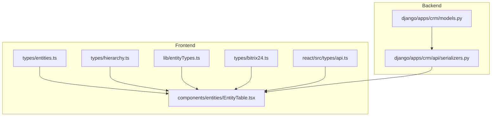
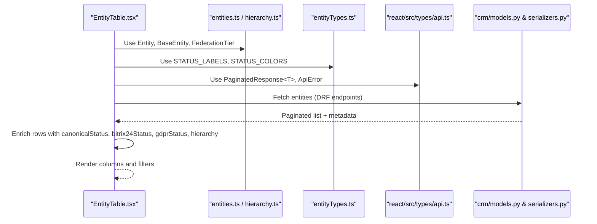
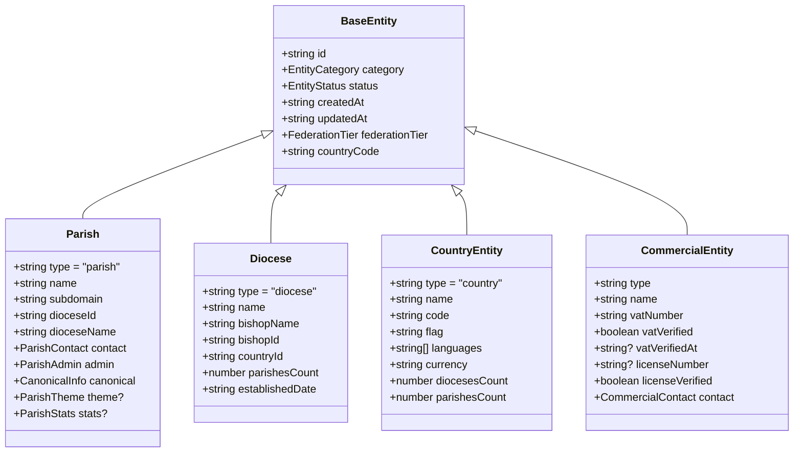
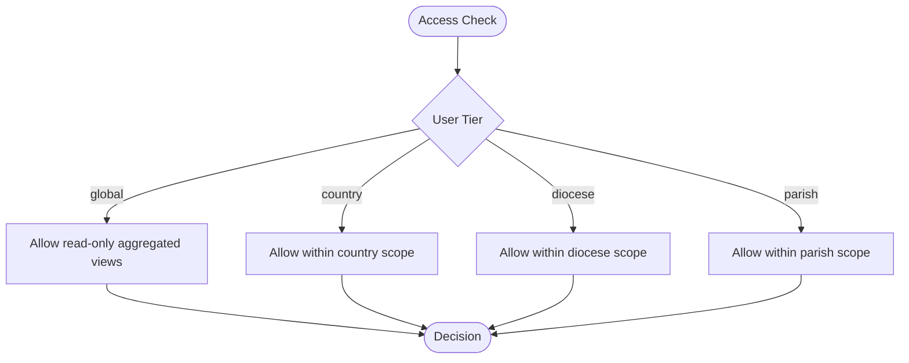
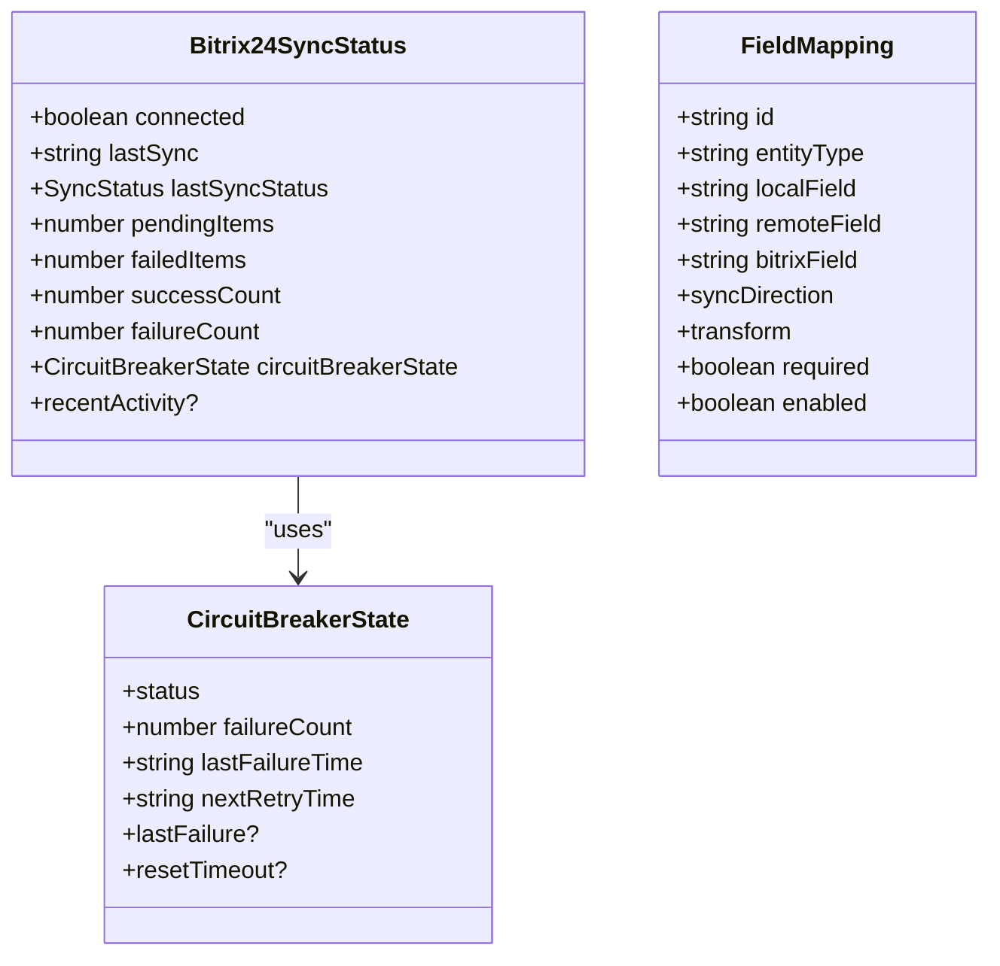
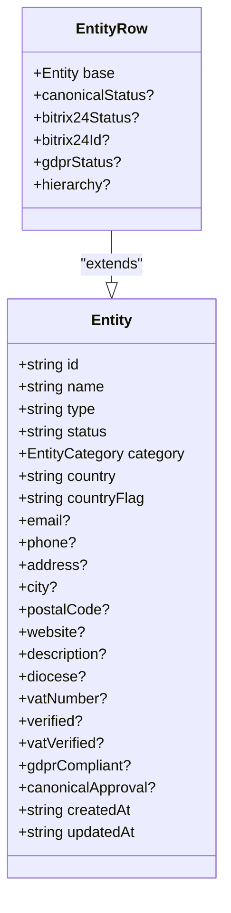
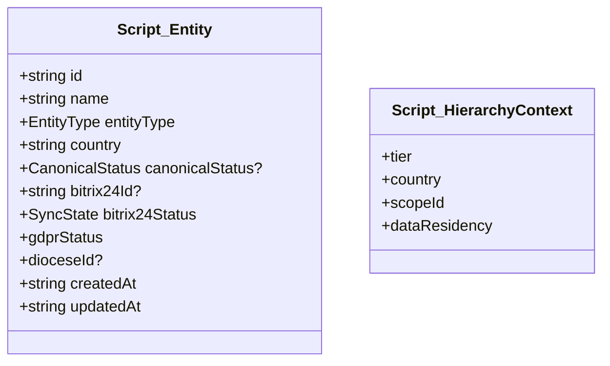
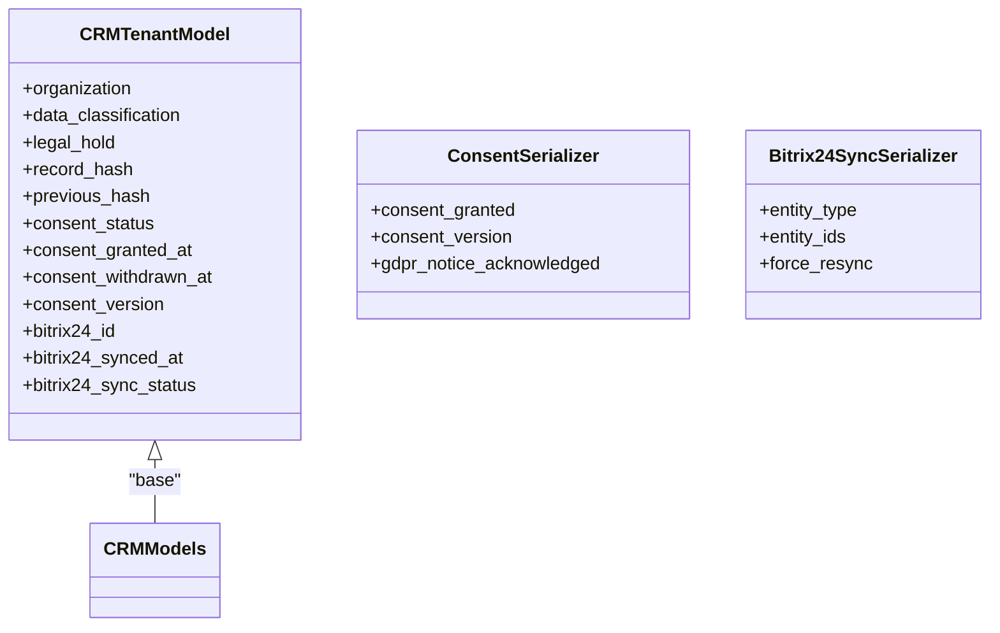
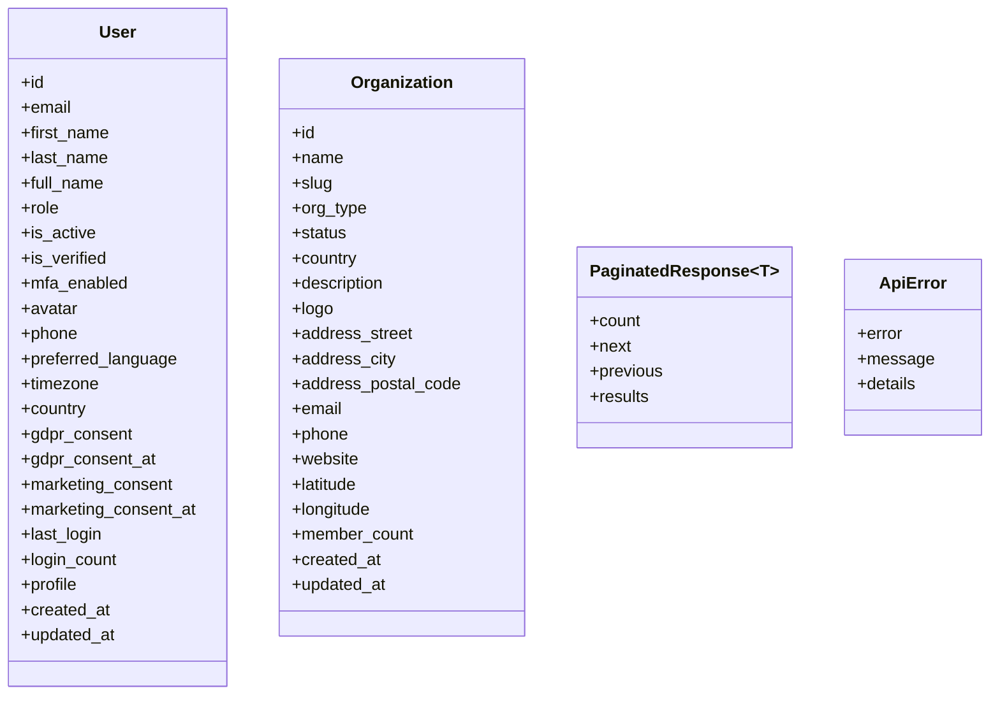
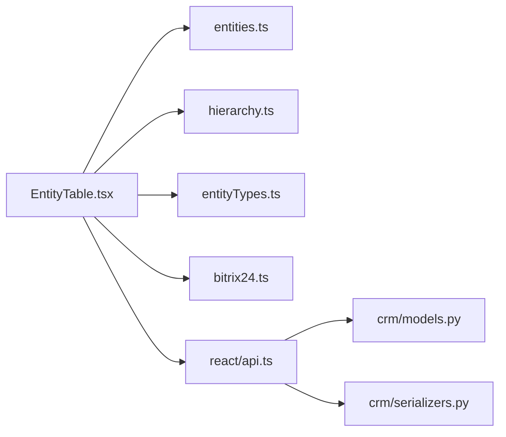

# Entity Types and Interfaces

<cite>
**Referenced Files in This Document**
- [entities.ts](file://frontend/apps/admin-dashboard/src/types/entities.ts)
- [hierarchy.ts](file://frontend/apps/admin-dashboard/src/types/hierarchy.ts)
- [entityTypes.ts](file://frontend/apps/admin-dashboard/src/lib/entityTypes.ts)
- [EntityTable.tsx](file://frontend/apps/admin-dashboard/src/components/entities/EntityTable.tsx)
- [bitrix24.ts](file://frontend/apps/admin-dashboard/src/types/bitrix24.ts)
- [index.ts (scripts)](file://frontend/apps/admin-dashboard/scripts/src/types/index.ts)
- [api.ts](file://frontend/react/src/types/api.ts)
- [models.py](file://backend/django/apps/crm/models.py)
- [serializers.py](file://backend/django/apps/crm/api/serializers.py)
- [auth.ts](file://frontend/apps/admin-dashboard/src/lib/auth.ts)
</cite>

## Table of Contents
1. Introduction
2. Project Structure
3. Core Components
4. Architecture Overview
5. Detailed Component Analysis
6. Dependency Analysis
7. Performance Considerations
8. Troubleshooting Guide
9. Conclusion
10. Appendices

## Introduction
This document explains the entity type definitions and TypeScript interfaces that define platform entities across the frontend and backend. It covers:
- All entity types, properties, relationships, and validation constraints
- The extended EntityRow type with metadata such as canonicalStatus, bitrix24Status, gdprStatus, and hierarchy information
- Enum values for entity states, types, and hierarchy levels
- Examples of type usage, type guards, and utility functions
- Mapping between frontend types and backend API schemas, including transformation patterns

## Project Structure
The entity type system is primarily defined in the admin dashboard’s TypeScript files, with supporting runtime utilities and UI components. Backend contracts are mirrored by Django models and serializers.

**Diagram sources**
- [entities.ts:1-222](file://frontend/apps/admin-dashboard/src/types/entities.ts#L1-L222)
- [hierarchy.ts:1-93](file://frontend/apps/admin-dashboard/src/types/hierarchy.ts#L1-L93)
- [entityTypes.ts:1-123](file://frontend/apps/admin-dashboard/src/lib/entityTypes.ts#L1-L123)
- [EntityTable.tsx:66-255](file://frontend/apps/admin-dashboard/src/components/entities/EntityTable.tsx#L66-L255)
- [bitrix24.ts:1-119](file://frontend/apps/admin-dashboard/src/types/bitrix24.ts#L1-L119)
- [api.ts:1-137](file://frontend/react/src/types/api.ts#L1-L137)
- [models.py:1-200](file://backend/django/apps/crm/models.py#L1-L200)
- [serializers.py:329-352](file://backend/django/apps/crm/api/serializers.py#L329-L352)

**Section sources**
- [entities.ts:1-222](file://frontend/apps/admin-dashboard/src/types/entities.ts#L1-L222)
- [hierarchy.ts:1-93](file://frontend/apps/admin-dashboard/src/types/hierarchy.ts#L1-L93)
- [entityTypes.ts:1-123](file://frontend/apps/admin-dashboard/src/lib/entityTypes.ts#L1-L123)
- [EntityTable.tsx:66-255](file://frontend/apps/admin-dashboard/src/components/entities/EntityTable.tsx#L66-L255)
- [bitrix24.ts:1-119](file://frontend/apps/admin-dashboard/src/types/bitrix24.ts#L1-L119)
- [api.ts:1-137](file://frontend/react/src/types/api.ts#L1-L137)
- [models.py:1-200](file://backend/django/apps/crm/models.py#L1-L200)
- [serializers.py:329-352](file://backend/django/apps/crm/api/serializers.py#L329-L352)

## Core Components
- Entity categories and statuses: Catholic vs Commercial entities; lifecycle statuses like draft, pending_approval, approved, rejected, suspended, archived.
- Hierarchy tiers: global, country, diocese, parish; used to enforce data residency and access control.
- Bitrix24 sync state: idle/syncing/completed/failed/partial; circuit breaker state; field mappings.
- Admin user roles and bindings: role-based permissions scoped by federation tier.
- Generic list responses and display-oriented Entity shape for tables.

Key definitions and their purposes:
- BaseEntity, Parish, Diocese, CountryEntity, CommercialEntity: domain-specific entity shapes with category-scoped fields.
- FederationTier, EEARegion, HierarchyNode, Permission: hierarchy and permission model.
- SyncStatus, CircuitBreakerState, FieldMapping: integration state and mapping configuration.
- AdminUser, AdminRole, EntityBinding: identity and authorization model.
- EntityListResponse<T>, Entity: generic list wrapper and a flat display type.

**Section sources**
- [entities.ts:11-118](file://frontend/apps/admin-dashboard/src/types/entities.ts#L11-L118)
- [entities.ts:124-176](file://frontend/apps/admin-dashboard/src/types/entities.ts#L124-L176)
- [entities.ts:182-218](file://frontend/apps/admin-dashboard/src/types/entities.ts#L182-L218)
- [hierarchy.ts:7-56](file://frontend/apps/admin-dashboard/src/types/hierarchy.ts#L7-L56)
- [bitrix24.ts:7-83](file://frontend/apps/admin-dashboard/src/types/bitrix24.ts#L7-L83)

## Architecture Overview
The frontend defines rich entity types and UI-facing shapes, while the backend enforces data integrity, consent, and sync status via Django models and serializers. The table component composes these into a unified view with additional metadata.

**Diagram sources**
- [EntityTable.tsx:66-255](file://frontend/apps/admin-dashboard/src/components/entities/EntityTable.tsx#L66-L255)
- [entities.ts:195-218](file://frontend/apps/admin-dashboard/src/types/entities.ts#L195-L218)
- [entityTypes.ts:29-56](file://frontend/apps/admin-dashboard/src/lib/entityTypes.ts#L29-L56)
- [api.ts:94-107](file://frontend/react/src/types/api.ts#L94-L107)
- [models.py:154-177](file://backend/django/apps/crm/models.py#L154-L177)
- [serializers.py:329-352](file://backend/django/apps/crm/api/serializers.py#L329-L352)

## Detailed Component Analysis

### Entity Domain Model
- Category: catholic or commercial.
- Status: draft, pending_approval, approved, rejected, suspended, archived.
- Catholic entities include canonical info, approval documents, theme, and stats.
- Commercial entities include VAT and license verification fields.
- Diocese and Country entities provide hierarchical context and counts.

**Diagram sources**
- [entities.ts:11-118](file://frontend/apps/admin-dashboard/src/types/entities.ts#L11-L118)

**Section sources**
- [entities.ts:11-118](file://frontend/apps/admin-dashboard/src/types/entities.ts#L11-L118)

### Hierarchy and Permissions
- FederationTier: global, country, diocese, parish.
- EEARegion groups countries for GDPR data residency.
- HierarchyNode represents tree structure with parent-child relations.
- Permission describes allowed actions per resource.
- TierPermissions outlines capabilities per tier.

**Diagram sources**
- [hierarchy.ts:7-85](file://frontend/apps/admin-dashboard/src/types/hierarchy.ts#L7-L85)
- [auth.ts:64-106](file://frontend/apps/admin-dashboard/src/lib/auth.ts#L64-L106)

**Section sources**
- [hierarchy.ts:7-85](file://frontend/apps/admin-dashboard/src/types/hierarchy.ts#L7-L85)
- [auth.ts:64-106](file://frontend/apps/admin-dashboard/src/lib/auth.ts#L64-L106)

### Bitrix24 Integration Types
- SyncStatus: idle, syncing, completed, failed, partial.
- CircuitBreakerState: closed/open/half-open with failure counters and retry windows.
- FieldMapping: local-to-remote field alignment with transform options and direction.
- Webhook payload and health indicators for monitoring.

**Diagram sources**
- [bitrix24.ts:7-83](file://frontend/apps/admin-dashboard/src/types/bitrix24.ts#L7-L83)

**Section sources**
- [bitrix24.ts:7-83](file://frontend/apps/admin-dashboard/src/types/bitrix24.ts#L7-L83)

### Extended EntityRow and Display Types
- EntityRow extends a base Entity with:
  - canonicalStatus: granted, pending, verification_pending, rejected, n_a
  - bitrix24Status: synced, error, pending, syncing
  - bitrix24Id: optional external ID
  - gdprStatus: compliant, review, non_compliant
  - hierarchy: tier, parentId, parentName, residency
- Entity is a flat shape used for table rendering with common fields like email, phone, address, website, description, diocese, vatNumber, verified flags, timestamps.

**Diagram sources**
- [EntityTable.tsx:78-90](file://frontend/apps/admin-dashboard/src/components/entities/EntityTable.tsx#L78-L90)
- [entities.ts:195-218](file://frontend/apps/admin-dashboard/src/types/entities.ts#L195-L218)

**Section sources**
- [EntityTable.tsx:78-90](file://frontend/apps/admin-dashboard/src/components/entities/EntityTable.tsx#L78-L90)
- [entities.ts:195-218](file://frontend/apps/admin-dashboard/src/types/entities.ts#L195-L218)

### Scripts Auto-Generated Types
- Auto-generated Entity includes entityType union distinct from domain entities, plus CanonicalStatus and SyncState.
- HierarchyContext here uses a different tier set for scripts: super, country, diocese, facility.

**Diagram sources**
- [index.ts (scripts):1-53](file://frontend/apps/admin-dashboard/scripts/src/types/index.ts#L1-L53)

**Section sources**
- [index.ts (scripts):1-53](file://frontend/apps/admin-dashboard/scripts/src/types/index.ts#L1-L53)

### Backend API Contracts
- Django CRM base model adds tenant isolation, data classification, legal hold, record hashes, consent tracking, and Bitrix24 sync fields.
- Serializers expose consent management and Bitrix24 sync operations.

**Diagram sources**
- [models.py:71-177](file://backend/django/apps/crm/models.py#L71-L177)
- [serializers.py:329-352](file://backend/django/apps/crm/api/serializers.py#L329-L352)

**Section sources**
- [models.py:71-177](file://backend/django/apps/crm/models.py#L71-L177)
- [serializers.py:329-352](file://backend/django/apps/crm/api/serializers.py#L329-L352)

### Frontend React API Types
- Mirrors Django User, Organization, and auth endpoints.
- Provides uniform error envelope and paginated response shapes.

**Diagram sources**
- [api.ts:14-48](file://frontend/react/src/types/api.ts#L14-L48)
- [api.ts:94-137](file://frontend/react/src/types/api.ts#L94-L137)

**Section sources**
- [api.ts:14-48](file://frontend/react/src/types/api.ts#L14-L48)
- [api.ts:94-137](file://frontend/react/src/types/api.ts#L94-L137)

## Dependency Analysis
- EntityTable depends on:
  - entities.ts for base Entity and category/status enums
  - hierarchy.ts for FederationTier and EEARegion
  - entityTypes.ts for status labels/colors and Zod form schemas
  - bitrix24.ts for sync status and mapping types
  - react api.ts for pagination and errors
- Backend dependencies:
  - models.py provides canonical fields for sync and consent
  - serializers.py exposes consent and sync endpoints consumed by frontend flows

**Diagram sources**
- [EntityTable.tsx:66-255](file://frontend/apps/admin-dashboard/src/components/entities/EntityTable.tsx#L66-L255)
- [entities.ts:1-222](file://frontend/apps/admin-dashboard/src/types/entities.ts#L1-L222)
- [hierarchy.ts:1-93](file://frontend/apps/admin-dashboard/src/types/hierarchy.ts#L1-L93)
- [entityTypes.ts:1-123](file://frontend/apps/admin-dashboard/src/lib/entityTypes.ts#L1-L123)
- [bitrix24.ts:1-119](file://frontend/apps/admin-dashboard/src/types/bitrix24.ts#L1-L119)
- [api.ts:1-137](file://frontend/react/src/types/api.ts#L1-L137)
- [models.py:1-200](file://backend/django/apps/crm/models.py#L1-L200)
- [serializers.py:329-352](file://backend/django/apps/crm/api/serializers.py#L329-L352)

**Section sources**
- [EntityTable.tsx:66-255](file://frontend/apps/admin-dashboard/src/components/entities/EntityTable.tsx#L66-L255)
- [entities.ts:1-222](file://frontend/apps/admin-dashboard/src/types/entities.ts#L1-L222)
- [hierarchy.ts:1-93](file://frontend/apps/admin-dashboard/src/types/hierarchy.ts#L1-L93)
- [entityTypes.ts:1-123](file://frontend/apps/admin-dashboard/src/lib/entityTypes.ts#L1-L123)
- [bitrix24.ts:1-119](file://frontend/apps/admin-dashboard/src/types/bitrix24.ts#L1-L119)
- [api.ts:1-137](file://frontend/react/src/types/api.ts#L1-L137)
- [models.py:1-200](file://backend/django/apps/crm/models.py#L1-L200)
- [serializers.py:329-352](file://backend/django/apps/crm/api/serializers.py#L329-L352)

## Performance Considerations
- Prefer using the generic Entity for list rendering to minimize payload size; enrich only when necessary.
- Cache status labels and colors in constants to avoid recomputation.
- Use paginated responses to limit memory usage on large datasets.
- Defer Bitrix24 sync checks to background jobs; surface lightweight status in UI.

[No sources needed since this section provides general guidance]

## Troubleshooting Guide
Common issues and resolutions:
- Mismatched status values: Ensure frontend status strings match backend choices; align canonicalStatus and bitrix24Status with UI expectations.
- Missing hierarchy context: Validate that hierarchy.tier and residency are present before rendering; fall back to safe defaults.
- Sync failures: Inspect CircuitBreakerState and recentActivity; handle open state by deferring retries.
- Consent validation: Confirm gdpr_notice_acknowledged is true when granting consent per serializer rules.

**Section sources**
- [bitrix24.ts:27-34](file://frontend/apps/admin-dashboard/src/types/bitrix24.ts#L27-L34)
- [serializers.py:329-341](file://backend/django/apps/crm/api/serializers.py#L329-L341)
- [EntityTable.tsx:98-105](file://frontend/apps/admin-dashboard/src/components/entities/EntityTable.tsx#L98-L105)

## Conclusion
The platform’s entity type system combines strict domain modeling with flexible UI representations. The extended EntityRow enriches core entities with operational metadata for canonical approvals, Bitrix24 synchronization, GDPR compliance, and hierarchy context. Consistent enums and Zod schemas ensure robust validation, while backend models and serializers enforce data integrity and consent requirements. Clear separation between domain types, display types, and integration types enables maintainable evolution across the stack.

[No sources needed since this section summarizes without analyzing specific files]

## Appendices

### Type Usage Examples
- List rendering: Use EntityListResponse<Entity> to render paginated tables.
- Detail forms: Use ParishFormData or CommercialEntityFormData derived from Zod schemas for validated input.
- Access control: Use canAccessEntity with HierarchyContext and HierarchicalEntity to enforce tier-based visibility.

**Section sources**
- [entities.ts:182-189](file://frontend/apps/admin-dashboard/src/types/entities.ts#L182-L189)
- [entityTypes.ts:62-123](file://frontend/apps/admin-dashboard/src/lib/entityTypes.ts#L62-L123)
- [auth.ts:64-106](file://frontend/apps/admin-dashboard/src/lib/auth.ts#L64-L106)

### Mapping Frontend to Backend
- Frontend Entity maps to backend CRM records enriched with Bitrix24 IDs and sync statuses.
- Consent fields map to ConsentSerializer inputs; ensure gdpr_notice_acknowledged is set when granting consent.
- Pagination uses PaginatedResponse<T> aligned with DRF PageNumberPagination.

**Section sources**
- [api.ts:94-107](file://frontend/react/src/types/api.ts#L94-L107)
- [serializers.py:329-352](file://backend/django/apps/crm/api/serializers.py#L329-L352)
- [models.py:154-177](file://backend/django/apps/crm/models.py#L154-L177)