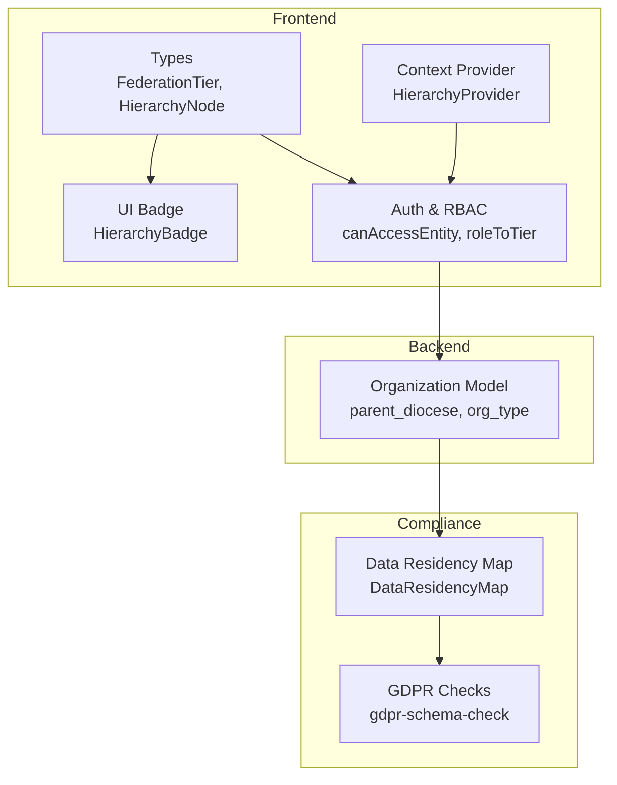
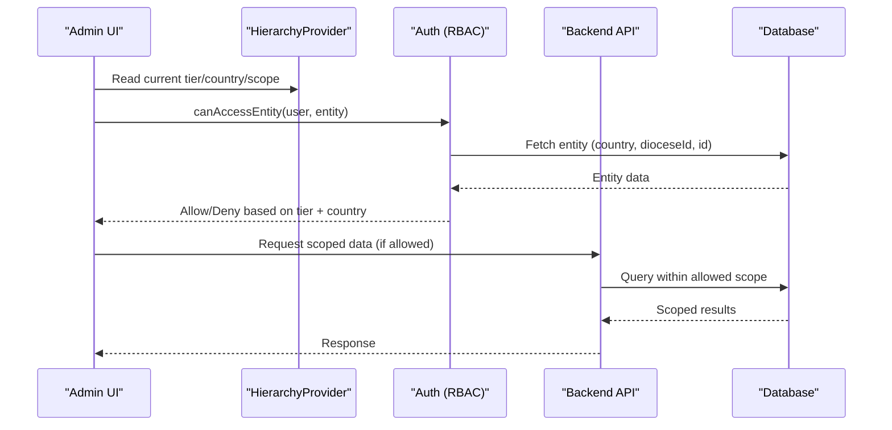
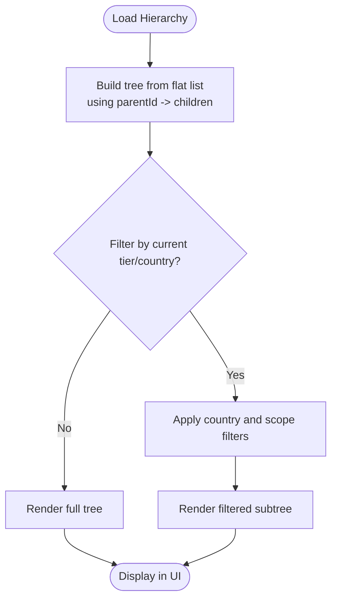
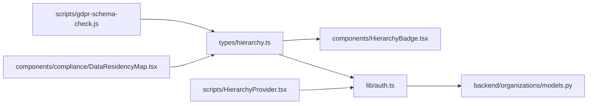
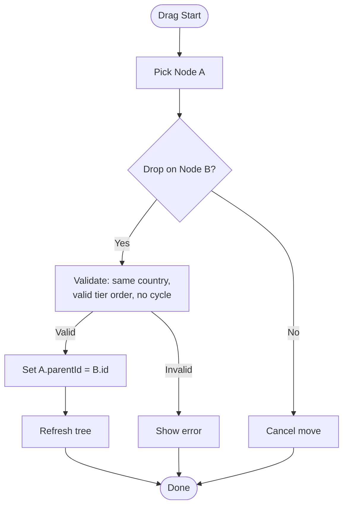

# Hierarchy Management System

<cite>
**Referenced Files in This Document**
- [hierarchy.ts](file://frontend/apps/admin-dashboard/src/types/hierarchy.ts)
- [auth.ts](file://frontend/apps/admin-dashboard/src/lib/auth.ts)
- [HierarchyBadge.tsx](file://frontend/apps/admin-dashboard/src/components/entities/HierarchyBadge.tsx)
- [HierarchyProvider.tsx](file://frontend/apps/admin-dashboard/scripts/src/providers/HierarchyProvider.tsx)
- [models.py](file://backend/django/apps/organizations/models.py)
- [DataResidencyMap.tsx](file://frontend/apps/admin-dashboard/src/components/compliance/DataResidencyMap.tsx)
- [gdpr-schema-check.js](file://frontend/apps/admin-dashboard/scripts/gdpr-schema-check.js)
- [GDPR-checklist.md](file://docs/compliance/GDPR-checklist.md)
</cite>

## Table of Contents
1. [Introduction](#introduction)
2. [Project Structure](#project-structure)
3. [Core Components](#core-components)
4. [Architecture Overview](#architecture-overview)
5. [Detailed Component Analysis](#detailed-component-analysis)
6. [Dependency Analysis](#dependency-analysis)
7. [Performance Considerations](#performance-considerations)
8. [Troubleshooting Guide](#troubleshooting-guide)
9. [Conclusion](#conclusion)
10. [Appendices](#appendices)

## Introduction
This document explains the hierarchy management system that models and visualizes organizational structures across a four-tier federation: global, country, diocese, and parish. It covers:
- The HierarchyBadge component for tier visualization with color coding and residency indicators
- Tree structure concepts for parent-child relationships and hierarchical navigation
- Data model fields for hierarchy relationships (parent IDs, tiers, residency)
- Examples for drag-and-drop reordering, bulk updates, and validation rules
- Integration with country-specific structures and GDPR data residency requirements

## Project Structure
The hierarchy system spans frontend types and UI components, backend organization models, and compliance utilities:
- Frontend types define the canonical 4-tier hierarchy and scopes
- Frontend components render tier badges and residency visuals
- Backend models encode hierarchical relationships and compliance metadata
- Compliance scripts and docs enforce GDPR Article 44 residency constraints

**Diagram sources**
- [hierarchy.ts:1-47](file://frontend/apps/admin-dashboard/src/types/hierarchy.ts#L1-L47)
- [HierarchyProvider.tsx:1-23](file://frontend/apps/admin-dashboard/scripts/src/providers/HierarchyProvider.tsx#L1-L23)
- [HierarchyBadge.tsx:1-35](file://frontend/apps/admin-dashboard/src/components/entities/HierarchyBadge.tsx#L1-L35)
- [auth.ts:1-114](file://frontend/apps/admin-dashboard/src/lib/auth.ts#L1-L114)
- [models.py:112-139](file://backend/django/apps/organizations/models.py#L112-L139)
- [DataResidencyMap.tsx:132-165](file://frontend/apps/admin-dashboard/src/components/compliance/DataResidencyMap.tsx#L132-L165)
- [gdpr-schema-check.js:68-112](file://frontend/apps/admin-dashboard/scripts/gdpr-schema-check.js#L68-L112)

**Section sources**
- [hierarchy.ts:1-47](file://frontend/apps/admin-dashboard/src/types/hierarchy.ts#L1-L47)
- [auth.ts:1-114](file://frontend/apps/admin-dashboard/src/lib/auth.ts#L1-L114)
- [models.py:112-139](file://backend/django/apps/organizations/models.py#L112-L139)

## Core Components
- Federation tier model: A four-tier type defining global, country, diocese, and parish scopes, plus EEA regions for data residency.
- Hierarchy node model: Represents an entity with id, tier, name, parentId, optional country/diocese/parish identifiers, and children for tree rendering.
- Context provider: Supplies current user’s tier, country, scopeId, and dataResidency to the app.
- HierarchyBadge: Renders a colored badge with tier label, icon, and residency code.
- Access control: Enforces GDPR Article 44 by checking user.country vs entity.country and applying tier-based scoping.

Key responsibilities:
- Types define the canonical hierarchy and permissions
- Provider centralizes context for consistent enforcement
- Badge provides immediate visual feedback on tier and residency
- Auth functions implement strict access checks and role-to-tier mapping

**Section sources**
- [hierarchy.ts:1-47](file://frontend/apps/admin-dashboard/src/types/hierarchy.ts#L1-L47)
- [HierarchyProvider.tsx:1-23](file://frontend/apps/admin-dashboard/scripts/src/providers/HierarchyProvider.tsx#L1-L23)
- [HierarchyBadge.tsx:1-35](file://frontend/apps/admin-dashboard/src/components/entities/HierarchyBadge.tsx#L1-L35)
- [auth.ts:64-114](file://frontend/apps/admin-dashboard/src/lib/auth.ts#L64-L114)

## Architecture Overview
The system enforces a strict boundary between tiers and countries:
- Frontend types and providers establish the current scope and residency
- Backend models store hierarchical links and compliance flags
- Compliance tools validate residency at build-time and runtime

**Diagram sources**
- [HierarchyProvider.tsx:1-23](file://frontend/apps/admin-dashboard/scripts/src/providers/HierarchyProvider.tsx#L1-L23)
- [auth.ts:64-114](file://frontend/apps/admin-dashboard/src/lib/auth.ts#L64-L114)
- [models.py:112-139](file://backend/django/apps/organizations/models.py#L112-L139)

## Detailed Component Analysis

### HierarchyBadge Component
Purpose:
- Displays a tier badge with a distinct color and icon per tier
- Shows the residency code (e.g., LT, LV, EE) to reinforce data locality

Behavior:
- Maps each FederationTier to a label, icon, and class
- Renders a compact badge combining tier and residency

Usage:
- Place anywhere a user needs to see the effective tier and residency for an entity or view

**Section sources**
- [HierarchyBadge.tsx:1-35](file://frontend/apps/admin-dashboard/src/components/entities/HierarchyBadge.tsx#L1-L35)
- [hierarchy.ts:1-47](file://frontend/apps/admin-dashboard/src/types/hierarchy.ts#L1-L47)

### Hierarchy Context Provider
Purpose:
- Provides a stable HierarchyContext (tier, country, scopeId, dataResidency) to all components
- Ensures consistent scope assumptions across the dashboard

Behavior:
- Initializes default values and exposes them via React context

Integration:
- Consumers read context to drive filtering, authorization, and UI state

**Section sources**
- [HierarchyProvider.tsx:1-23](file://frontend/apps/admin-dashboard/scripts/src/providers/HierarchyProvider.tsx#L1-L23)
- [auth.ts:196-215](file://frontend/apps/admin-dashboard/src/lib/auth.ts#L196-L215)

### Backend Organization Model (Hierarchical Relationships)
Purpose:
- Encodes the canonical hierarchy using self-referential foreign keys
- Supports diocesan structures (diocese -> deanery -> parish/church)

Key fields:
- parent_diocese: Self-referential FK limiting parents to diocese/deanery types
- org_type: Distinguishes diocese, deanery, parish, etc.
- country: Country code for residency and scoping
- Compliance fields: legal_hold, canonical_records, sacramental_data_processing

Methods:
- get_hierarchy_level: Maps org_type to a 4-tier level for RBAC

**Section sources**
- [models.py:112-139](file://backend/django/apps/organizations/models.py#L112-L139)
- [models.py:226-236](file://backend/django/apps/organizations/models.py#L226-L236)

### Access Control and Tier Mapping
Purpose:
- Enforce GDPR Article 44 by preventing cross-country access
- Implement tiered permissions and role-to-tier mapping

Highlights:
- canAccessEntity validates country equality and tier-scoped scopeId
- roleToTier maps admin roles to tiers consistently
- ROLE_PERMISSIONS defines action/resource grants per role

**Section sources**
- [auth.ts:64-114](file://frontend/apps/admin-dashboard/src/lib/auth.ts#L64-L114)
- [auth.ts:220-234](file://frontend/apps/admin-dashboard/src/lib/auth.ts#L220-L234)
- [auth.ts:248-303](file://frontend/apps/admin-dashboard/src/lib/auth.ts#L248-L303)

### Data Residency Visualization and Validation
Purpose:
- Visualize which countries are locked to their region
- Validate that types and routes include residency checks

Components and scripts:
- DataResidencyMap: Shows per-country lock status with icons
- gdpr-schema-check: Verifies presence of residency fields and country-scoped routes

**Section sources**
- [DataResidencyMap.tsx:132-165](file://frontend/apps/admin-dashboard/src/components/compliance/DataResidencyMap.tsx#L132-L165)
- [gdpr-schema-check.js:68-112](file://frontend/apps/admin-dashboard/scripts/gdpr-schema-check.js#L68-L112)

### Conceptual Overview: Tree Structures and Navigation
Concepts:
- Parent-child relationships are modeled via parent_id (or parent_diocese) and children arrays
- Hierarchical navigation uses breadcrumbs and scoped filters tied to tier and scopeId
- Visualization supports expanding nodes, drilling into dioceses and parishes

[No sources needed since this diagram shows conceptual workflow, not actual code structure]

## Dependency Analysis
- Types depend on no runtime modules; they define shared contracts
- Provider depends on types and React context
- Badge depends on types and UI primitives
- Auth depends on types and implements policy logic
- Models depend on Django ORM and settings
- Compliance scripts depend on filesystem scanning and type definitions

**Diagram sources**
- [hierarchy.ts:1-47](file://frontend/apps/admin-dashboard/src/types/hierarchy.ts#L1-L47)
- [HierarchyBadge.tsx:1-35](file://frontend/apps/admin-dashboard/src/components/entities/HierarchyBadge.tsx#L1-L35)
- [HierarchyProvider.tsx:1-23](file://frontend/apps/admin-dashboard/scripts/src/providers/HierarchyProvider.tsx#L1-L23)
- [auth.ts:1-114](file://frontend/apps/admin-dashboard/src/lib/auth.ts#L1-L114)
- [models.py:112-139](file://backend/django/apps/organizations/models.py#L112-L139)
- [gdpr-schema-check.js:68-112](file://frontend/apps/admin-dashboard/scripts/gdpr-schema-check.js#L68-L112)
- [DataResidencyMap.tsx:132-165](file://frontend/apps/admin-dashboard/src/components/compliance/DataResidencyMap.tsx#L132-L165)

**Section sources**
- [hierarchy.ts:1-47](file://frontend/apps/admin-dashboard/src/types/hierarchy.ts#L1-L47)
- [auth.ts:1-114](file://frontend/apps/admin-dashboard/src/lib/auth.ts#L1-L114)
- [models.py:112-139](file://backend/django/apps/organizations/models.py#L112-L139)

## Performance Considerations
- Keep tree operations O(n) when building adjacency lists from flat lists; cache results per scope
- Use pagination and lazy loading for large hierarchies (e.g., load children on expand)
- Minimize re-renders by memoizing computed trees and filtering results
- Prefer server-side filtering by country and scopeId to reduce payload size

[No sources needed since this section provides general guidance]

## Troubleshooting Guide
Common issues and resolutions:
- Cross-country access denied: Ensure user.country matches entity.country; review canAccessEntity logic
- Missing residency field: Add residency/country fields to types and ensure API routes validate scope
- Incorrect tier mapping: Verify roleToTier and ROLE_PERMISSIONS alignment
- Legal hold blocking edits: Check is_legal_hold_active and related flags before mutations

Validation references:
- GDPR checklist includes country-specific requirements and audit schedules
- Schema checks enforce residency fields and country-scoped routes

**Section sources**
- [auth.ts:64-114](file://frontend/apps/admin-dashboard/src/lib/auth.ts#L64-L114)
- [gdpr-schema-check.js:68-112](file://frontend/apps/admin-dashboard/scripts/gdpr-schema-check.js#L68-L112)
- [GDPR-checklist.md:673-729](file://docs/compliance/GDPR-checklist.md#L673-L729)

## Conclusion
The hierarchy management system combines clear type definitions, robust access controls, and compliance-aware UI to manage multi-tier organizations while enforcing GDPR data residency. The HierarchyBadge provides immediate visual cues, the context provider ensures consistent scoping, and backend models capture hierarchical relationships and compliance metadata. Together, these pieces enable safe, scalable management of federated structures across countries and dioceses.

[No sources needed since this section summarizes without analyzing specific files]

## Appendices

### Data Model Summary
- FederationTier: global | country | diocese | parish
- HierarchyNode: id, tier, name, parentId, countryCode?, dioceseId?, parishId?, children[]
- EEARegion: EU_NORDIC | EU_BALTIC | EU_WESTERN | EU_SOUTHERN | EU_EASTERN
- Organization.parent_diocese: self-referential FK limited to diocese/deanery
- Organization.org_type: distinguishes diocese, deanery, parish, etc.
- Organization.country: two-letter country code for residency

**Section sources**
- [hierarchy.ts:1-47](file://frontend/apps/admin-dashboard/src/types/hierarchy.ts#L1-L47)
- [models.py:112-139](file://backend/django/apps/organizations/models.py#L112-L139)

### Example Workflows

#### Drag-and-Drop Reordering (Conceptual)
Steps:
- Capture source and target nodes during drag events
- Compute new parent_id for moved node based on drop target
- Validate constraints (tier ordering, country match, no cycles)
- Persist changes via a bulk update endpoint
- Refresh local tree and recompute children

[No sources needed since this diagram shows conceptual workflow, not actual code structure]

#### Bulk Hierarchy Updates (Conceptual)
- Collect multiple parent_id changes
- Batch-validate against constraints (country, tier, cycles)
- Execute transactional update
- Emit audit log entries for compliance

[No sources needed since this section provides general guidance]

#### Validation Rules for Hierarchical Constraints
- Country must match user scope (GDPR Article 44)
- Tier must be valid for the operation (e.g., only higher tiers can assign lower tiers)
- No circular parent chains
- Required fields present (name, country, org_type)

**Section sources**
- [auth.ts:64-114](file://frontend/apps/admin-dashboard/src/lib/auth.ts#L64-L114)
- [models.py:226-236](file://backend/django/apps/organizations/models.py#L226-L236)

### Integration with Country-Specific Structures and GDPR
- Country-specific compliance requirements are documented and audited
- Data residency enforced via types, context, and schema checks
- Visual indicators highlight locked/unlocked countries for clarity

**Section sources**
- [GDPR-checklist.md:673-729](file://docs/compliance/GDPR-checklist.md#L673-L729)
- [gdpr-schema-check.js:68-112](file://frontend/apps/admin-dashboard/scripts/gdpr-schema-check.js#L68-L112)
- [DataResidencyMap.tsx:132-165](file://frontend/apps/admin-dashboard/src/components/compliance/DataResidencyMap.tsx#L132-L165)