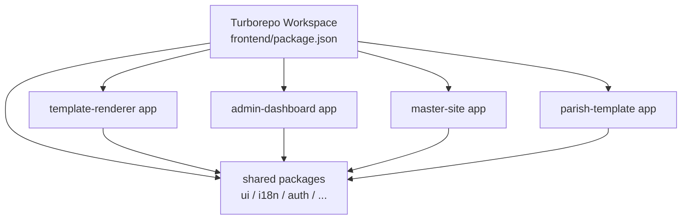
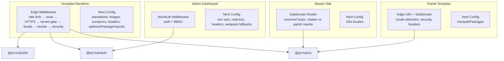
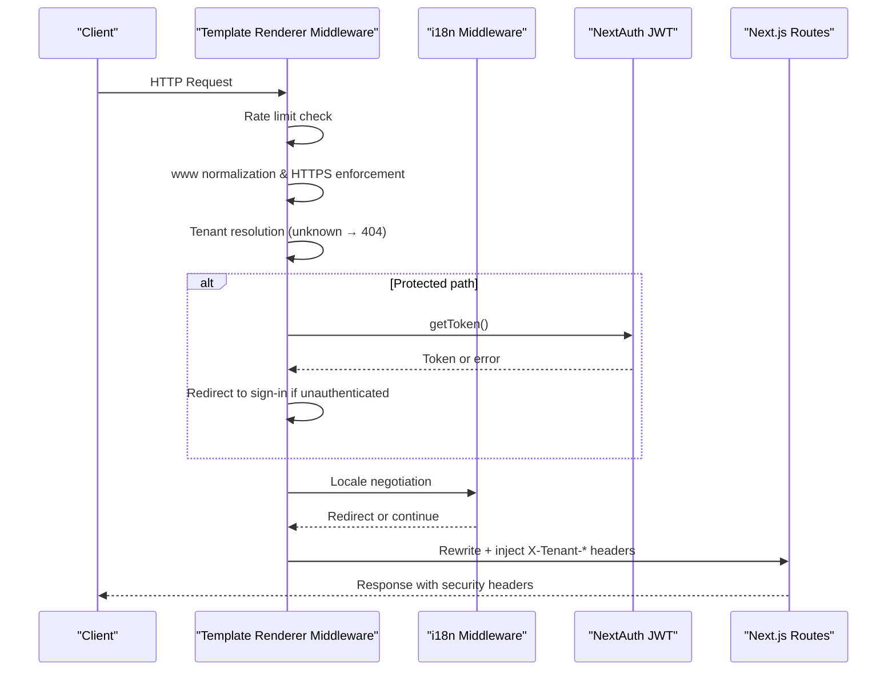
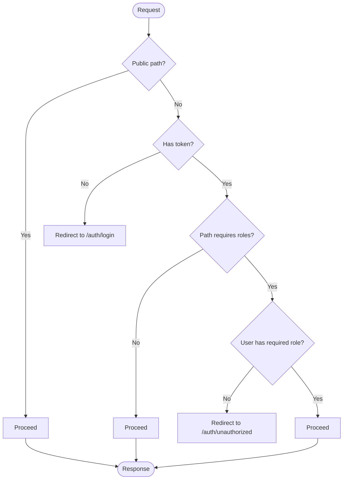
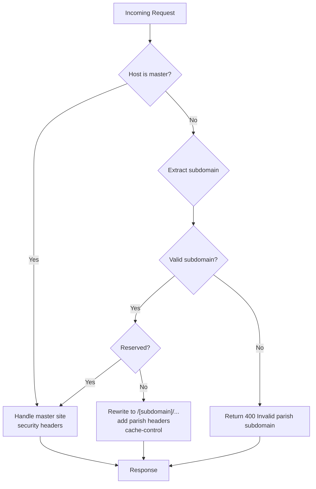
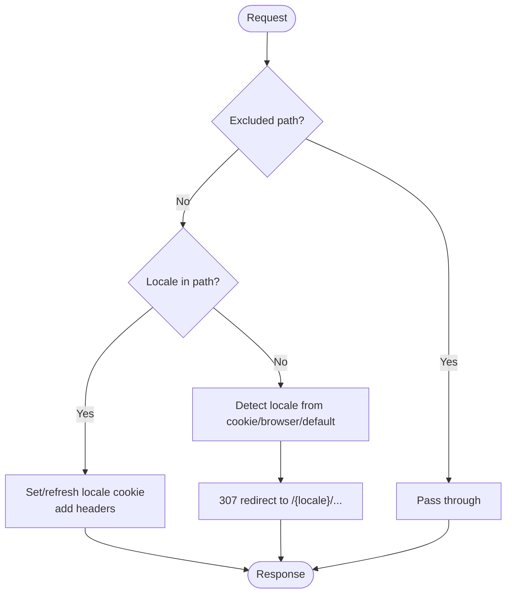
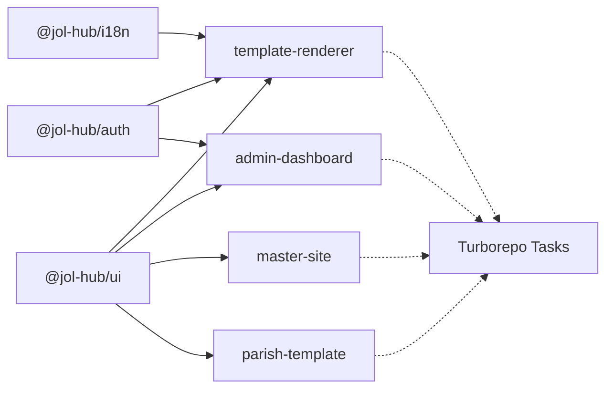

# Frontend Applications (Next.js)

<cite>
**Referenced Files in This Document**
- [frontend/package.json](file://frontend/package.json)
- [frontend/turbo.json](file://frontend/turbo.json)
- [apps/template-renderer/next.config.js](file://frontend/apps/template-renderer/next.config.js)
- [apps/template-renderer/src/middleware.ts](file://frontend/apps/template-renderer/src/middleware.ts)
- [apps/admin-dashboard/next.config.js](file://frontend/apps/admin-dashboard/next.config.js)
- [apps/admin-dashboard/src/middleware.ts](file://frontend/apps/admin-dashboard/src/middleware.ts)
- [apps/master-site/next.config.js](file://frontend/apps/master-site/next.config.js)
- [apps/master-site/src/middleware.ts](file://frontend/apps/master-site/src/middleware.ts)
- [apps/parish-template/next.config.js](file://frontend/apps/parish-template/next.config.js)
- [apps/parish-template/src/middleware.ts](file://frontend/apps/parish-template/src/middleware.ts)
- [packages/auth/package.json](file://frontend/packages/auth/package.json)
- [packages/i18n/package.json](file://frontend/packages/i18n/package.json)
- [packages/ui/package.json](file://frontend/packages/ui/package.json)
</cite>

## Table of Contents
1. [Introduction](#introduction)
2. [Project Structure](#project-structure)
3. [Core Components](#core-components)
4. [Architecture Overview](#architecture-overview)
5. [Detailed Component Analysis](#detailed-component-analysis)
6. [Dependency Analysis](#dependency-analysis)
7. [Performance Considerations](#performance-considerations)
8. [Troubleshooting Guide](#troubleshooting-guide)
9. [Conclusion](#conclusion)
10. [Appendices](#appendices)

## Introduction
This document describes the Next.js frontend applications within the Turborepo monorepo. It covers:
- Template renderer application that generates tenant-specific websites
- Admin dashboard for content management and analytics
- Master site for marketing pages
- Parish templates for religious institution websites
- Shared component library, authentication with NextAuth.js, internationalization across multiple languages, responsive design with Tailwind CSS, performance optimizations, routing patterns, state management approaches, API integration patterns, and deployment configurations across environments.

## Project Structure
The frontend is organized as a Turborepo workspace containing four Next.js apps and shared packages:
- Apps: template-renderer, admin-dashboard, master-site, parish-template
- Packages: ui, i18n, auth, commerce, observability, perf, seo, tenant-resolver, testing, seed-data, bitrix-sdk, a11y

Key orchestration:
- Workspace scripts define build, test, lint, and release tasks across apps and packages.
- Turbo config defines task caching, outputs, and dependencies to accelerate builds and tests.

**Diagram sources**
- [frontend/package.json:11-37](file://frontend/package.json#L11-L37)
- [frontend/turbo.json:5-30](file://frontend/turbo.json#L5-L30)

**Section sources**
- [frontend/package.json:1-67](file://frontend/package.json#L1-L67)
- [frontend/turbo.json:1-33](file://frontend/turbo.json#L1-L33)

## Core Components
- Template Renderer: Edge middleware pipeline for rate limiting, www normalization, HTTPS enforcement, tenant resolution, locale negotiation, protected area auth gating, security headers, and SEO surface handling. Configured for standalone output, image optimization, compression, and bundle analysis.
- Admin Dashboard: Authenticated Next.js app using NextAuth middleware with role-based access control, environment-driven feature flags, and security headers.
- Master Site: Multi-tenant subdomain router for parish sites with reserved subdomain protection, master hostnames, and rewrite logic; also declares i18n locales.
- Parish Template: Lightweight edge middleware for i18n detection (URL path → cookie → browser → default), multi-tenant subdomain extraction, and security headers.

Shared packages:
- @jol-hub/ui: Design system primitives, composite components, layout families, tokens, Tailwind configuration, accessibility utilities.
- @jol-hub/i18n: i18next integration, providers, hooks, middleware, messages, and utilities for localization.
- @jol-hub/auth: NextAuth integration, OIDC helpers, Bitrix24 OAuth2 flows, parish-level guards, and hooks.

**Section sources**
- [apps/template-renderer/src/middleware.ts:1-316](file://frontend/apps/template-renderer/src/middleware.ts#L1-L316)
- [apps/template-renderer/next.config.js:1-86](file://frontend/apps/template-renderer/next.config.js#L1-L86)
- [apps/admin-dashboard/next.config.js:1-93](file://frontend/apps/admin-dashboard/next.config.js#L1-L93)
- [apps/admin-dashboard/src/middleware.ts:1-82](file://frontend/apps/admin-dashboard/src/middleware.ts#L1-L82)
- [apps/master-site/next.config.js:1-15](file://frontend/apps/master-site/next.config.js#L1-L15)
- [apps/master-site/src/middleware.ts:1-301](file://frontend/apps/master-site/src/middleware.ts#L1-L301)
- [apps/parish-template/next.config.js:1-8](file://frontend/apps/parish-template/next.config.js#L1-L8)
- [apps/parish-template/src/middleware.ts:1-177](file://frontend/apps/parish-template/src/middleware.ts#L1-L177)
- [packages/ui/package.json:1-118](file://frontend/packages/ui/package.json#L1-L118)
- [packages/i18n/package.json:1-105](file://frontend/packages/i18n/package.json#L1-L105)
- [packages/auth/package.json:1-66](file://frontend/packages/auth/package.json#L1-L66)

## Architecture Overview
High-level architecture shows how requests flow through each app’s middleware and how shared packages are consumed.

**Diagram sources**
- [apps/template-renderer/src/middleware.ts:1-316](file://frontend/apps/template-renderer/src/middleware.ts#L1-L316)
- [apps/template-renderer/next.config.js:1-86](file://frontend/apps/template-renderer/next.config.js#L1-L86)
- [apps/admin-dashboard/src/middleware.ts:1-82](file://frontend/apps/admin-dashboard/src/middleware.ts#L1-L82)
- [apps/admin-dashboard/next.config.js:1-93](file://frontend/apps/admin-dashboard/next.config.js#L1-L93)
- [apps/master-site/src/middleware.ts:1-301](file://frontend/apps/master-site/src/middleware.ts#L1-L301)
- [apps/master-site/next.config.js:1-15](file://frontend/apps/master-site/next.config.js#L1-L15)
- [apps/parish-template/src/middleware.ts:1-177](file://frontend/apps/parish-template/src/middleware.ts#L1-L177)
- [apps/parish-template/next.config.js:1-8](file://frontend/apps/parish-template/next.config.js#L1-L8)
- [packages/ui/package.json:1-118](file://frontend/packages/ui/package.json#L1-L118)
- [packages/i18n/package.json:1-105](file://frontend/packages/i18n/package.json#L1-L105)
- [packages/auth/package.json:1-66](file://frontend/packages/auth/package.json#L1-L66)

## Detailed Component Analysis

### Template Renderer Application
Responsibilities:
- Edge middleware pipeline:
  - Rate limiting per client IP and tenant
  - www normalization (308)
  - HTTPS enforcement in production
  - Tenant gate with direct generic 404 for unknown tenants
  - Protected area authentication gate via NextAuth JWT token
  - Locale negotiation via i18n middleware
  - Tenant rewrite and header injection for downstream routes
  - Security headers on all responses
- Next.js configuration:
  - Standalone output for containerized deployments
  - Transpile shared packages
  - Image formats (AVIF/WebP), device sizes, long cache TTL
  - Compression and powered-by header off
  - Experimental package import optimization
  - Cache-control headers for static assets, images, sitemap, robots
  - Optional bundle analyzer when ANALYZE=true

**Diagram sources**
- [apps/template-renderer/src/middleware.ts:1-316](file://frontend/apps/template-renderer/src/middleware.ts#L1-L316)
- [apps/template-renderer/next.config.js:1-86](file://frontend/apps/template-renderer/next.config.js#L1-L86)

**Section sources**
- [apps/template-renderer/src/middleware.ts:1-316](file://frontend/apps/template-renderer/src/middleware.ts#L1-L316)
- [apps/template-renderer/next.config.js:1-86](file://frontend/apps/template-renderer/next.config.js#L1-L86)

### Admin Dashboard Application
Responsibilities:
- Authentication and authorization:
  - NextAuth middleware protects routes except public paths
  - Role-based access control for analytics, users, settings
  - Injects user identity into response headers for API calls
- Configuration:
  - Environment variables for API URL, app name/version, feature flags, JWT expiry, supported locales, log level
  - Redirect root to dashboard
  - Security headers (X-Frame-Options, X-Content-Type-Options, Referrer-Policy, Permissions-Policy)
  - Webpack fallbacks for Node-only modules in browser context

**Diagram sources**
- [apps/admin-dashboard/src/middleware.ts:1-82](file://frontend/apps/admin-dashboard/src/middleware.ts#L1-L82)
- [apps/admin-dashboard/next.config.js:1-93](file://frontend/apps/admin-dashboard/next.config.js#L1-L93)

**Section sources**
- [apps/admin-dashboard/src/middleware.ts:1-82](file://frontend/apps/admin-dashboard/src/middleware.ts#L1-L82)
- [apps/admin-dashboard/next.config.js:1-93](file://frontend/apps/admin-dashboard/next.config.js#L1-L93)

### Master Site Application
Responsibilities:
- Multi-tenant subdomain routing:
  - Reserved subdomains blocked from parish usage
  - Master hostnames bypass subdomain routing
  - Rewrites parish subdomains to dynamic routes with parish context headers
  - Adds CORS and security headers
- Configuration:
  - i18n locales configured (lt, ru, en)

**Diagram sources**
- [apps/master-site/src/middleware.ts:1-301](file://frontend/apps/master-site/src/middleware.ts#L1-L301)
- [apps/master-site/next.config.js:1-15](file://frontend/apps/master-site/next.config.js#L1-L15)

**Section sources**
- [apps/master-site/src/middleware.ts:1-301](file://frontend/apps/master-site/src/middleware.ts#L1-L301)
- [apps/master-site/next.config.js:1-15](file://frontend/apps/master-site/next.config.js#L1-L15)

### Parish Template Application
Responsibilities:
- Edge i18n detection:
  - Order: URL path prefix → cookie → Accept-Language → default (lt)
  - Sets locale cookie with secure options in production
  - Adds multi-tenant headers (x-subdomain, x-parish-locale, x-locale)
  - Applies security headers
- Configuration:
  - Minimal transpilePackages for shared UI

**Diagram sources**
- [apps/parish-template/src/middleware.ts:1-177](file://frontend/apps/parish-template/src/middleware.ts#L1-L177)
- [apps/parish-template/next.config.js:1-8](file://frontend/apps/parish-template/next.config.js#L1-L8)

**Section sources**
- [apps/parish-template/src/middleware.ts:1-177](file://frontend/apps/parish-template/src/middleware.ts#L1-L177)
- [apps/parish-template/next.config.js:1-8](file://frontend/apps/parish-template/next.config.js#L1-L8)

### Shared Component Library and Packages
- @jol-hub/ui:
  - Radix-based primitives and composite components
  - Layout families, design tokens, Tailwind configuration
  - Accessibility utilities and locale switcher
- @jol-hub/i18n:
  - i18next integration, providers, hooks, middleware, messages
  - DeepL translation memory support and liturgical calendar translations
- @jol-hub/auth:
  - NextAuth integration, OIDC helpers, Bitrix24 OAuth2 flows
  - Parish-level guards and hooks

These packages are transpiled by apps and imported where needed, enabling consistent UI, localization, and authentication across applications.

**Section sources**
- [packages/ui/package.json:1-118](file://frontend/packages/ui/package.json#L1-L118)
- [packages/i18n/package.json:1-105](file://frontend/packages/i18n/package.json#L1-L105)
- [packages/auth/package.json:1-66](file://frontend/packages/auth/package.json#L1-L66)

## Dependency Analysis
Workspace-level dependencies and build orchestration:
- Scripts coordinate building apps and packages via Turborepo
- Turbo tasks define outputs (.next/**), caching behavior, and dependency ordering
- Apps depend on shared packages for UI, i18n, auth, and other capabilities

**Diagram sources**
- [frontend/package.json:11-37](file://frontend/package.json#L11-L37)
- [frontend/turbo.json:5-30](file://frontend/turbo.json#L5-L30)
- [apps/template-renderer/next.config.js:7-18](file://frontend/apps/template-renderer/next.config.js#L7-L18)
- [apps/admin-dashboard/next.config.js:1-93](file://frontend/apps/admin-dashboard/next.config.js#L1-L93)
- [apps/master-site/next.config.js:1-15](file://frontend/apps/master-site/next.config.js#L1-L15)
- [apps/parish-template/next.config.js:1-8](file://frontend/apps/parish-template/next.config.js#L1-L8)

**Section sources**
- [frontend/package.json:1-67](file://frontend/package.json#L1-L67)
- [frontend/turbo.json:1-33](file://frontend/turbo.json#L1-L33)

## Performance Considerations
- Template Renderer:
  - Standalone output for efficient containerized deployments
  - Image optimization with AVIF/WebP, device sizes, and long cache TTL
  - Compression enabled; powered-by header disabled
  - Experimental optimizePackageImports to tree-shake shared imports
  - Cache-Control headers for static assets, images, sitemap, robots
  - Optional bundle analyzer for budget checks
- Admin Dashboard:
  - Webpack fallbacks to avoid bundling Node-only modules in the browser
  - Security headers reduce attack surface
- Master Site and Parish Template:
  - Edge middleware minimizes server work; caching headers for parish config
  - Subdomain routing avoids unnecessary processing for master hostnames

[No sources needed since this section provides general guidance]

## Troubleshooting Guide
Common issues and mitigations:
- Unknown tenant requests:
  - Direct generic 404 response prevents enumeration and avoids rewrite re-proxies under HTTPS forwarding
- Rate limiting:
  - Per IP and tenant limits protect against abuse; login endpoints have additional brute-force protection
- Authentication failures:
  - Protected areas redirect to sign-in with callbackUrl; failed sessions logged as security events
- Security headers:
  - Enforced across all responses; HSTS in production; strict referrer policy; permissions policy restricts sensitive APIs
- Build and runtime errors:
  - Ensure transpilePackages include shared packages
  - Verify environment variables for API URLs, feature flags, and locales

**Section sources**
- [apps/template-renderer/src/middleware.ts:143-181](file://frontend/apps/template-renderer/src/middleware.ts#L143-L181)
- [apps/template-renderer/src/middleware.ts:186-230](file://frontend/apps/template-renderer/src/middleware.ts#L186-L230)
- [apps/template-renderer/src/middleware.ts:266-286](file://frontend/apps/template-renderer/src/middleware.ts#L266-L286)
- [apps/admin-dashboard/next.config.js:16-39](file://frontend/apps/admin-dashboard/next.config.js#L16-L39)
- [apps/admin-dashboard/next.config.js:51-75](file://frontend/apps/admin-dashboard/next.config.js#L51-L75)

## Conclusion
The Next.js frontend stack uses a layered middleware strategy to handle multi-tenancy, localization, authentication, and security efficiently at the edge. The template renderer orchestrates tenant resolution and locale negotiation, while the admin dashboard enforces authenticated, role-based access. The master site and parish template provide robust subdomain routing and i18n detection. Shared packages ensure consistent UI, localization, and authentication across applications. Performance is optimized through image strategies, compression, caching headers, and selective package imports.

[No sources needed since this section summarizes without analyzing specific files]

## Appendices
- Routing Patterns:
  - Template Renderer: /[locale]/[tenant]/... with protected areas gated by auth
  - Master Site: parish-name.jol-hub.eu rewritten to /[subdomain]/...
  - Parish Template: /[locale]/... with locale cookie persistence
- State Management:
  - Client-side state via React hooks and contexts within apps
  - Server-side data fetching via Next.js server components and API routes
- API Integration:
  - Admin Dashboard uses NEXT_PUBLIC_API_URL for backend communication
  - Template Renderer proxies CRM and other services via internal API routes
- Deployment Configurations:
  - Template Renderer: standalone output suitable for Docker/PM2
  - All apps: environment-driven features, locales, and logging levels
  - Turbo workspace enables parallel builds and caching across apps and packages

[No sources needed since this section provides general guidance]