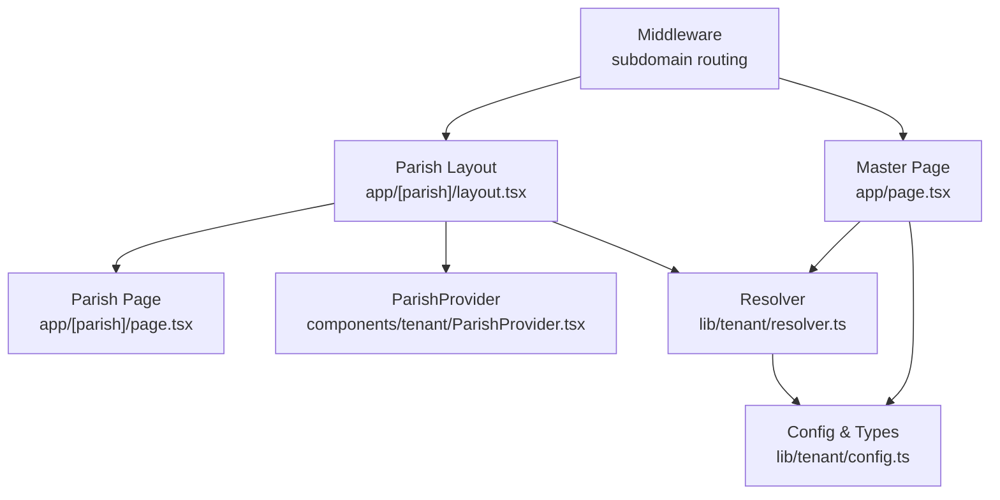
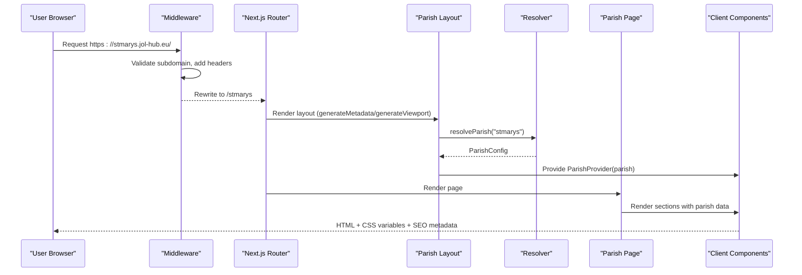
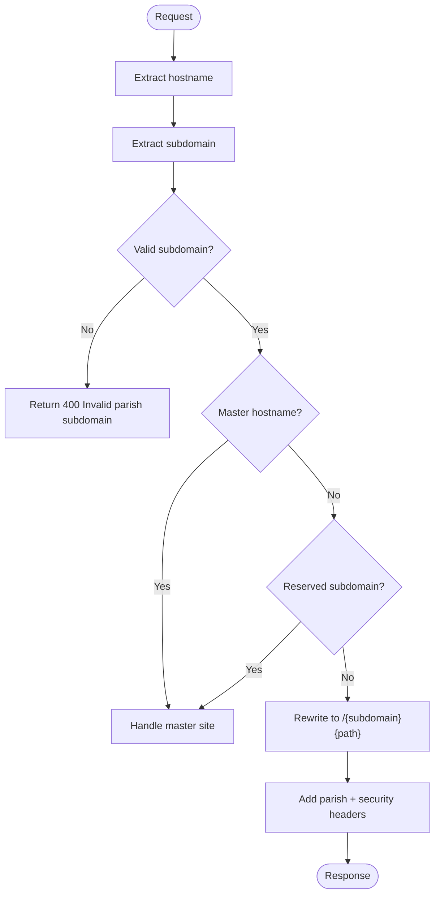
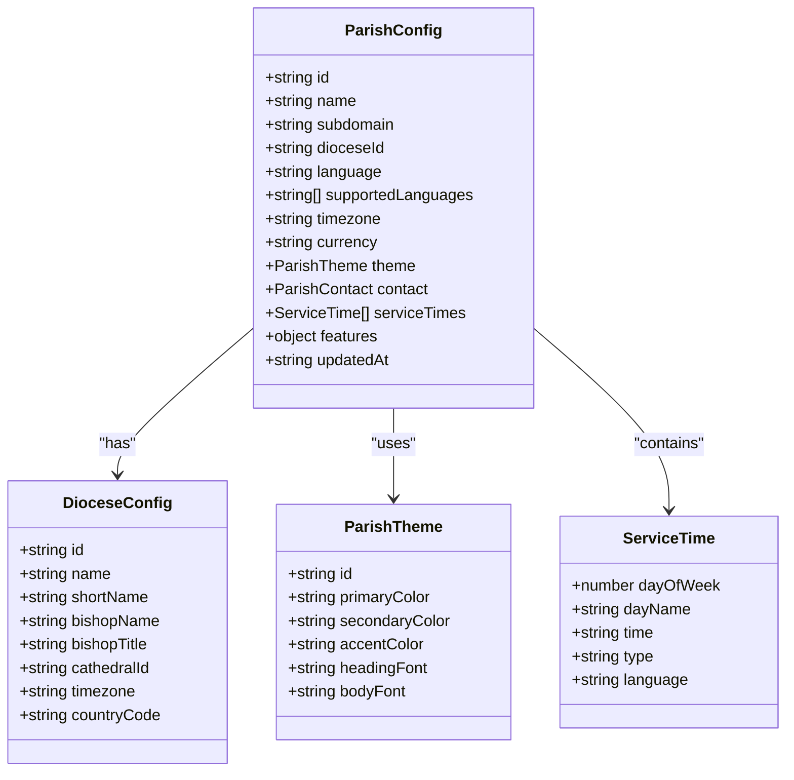
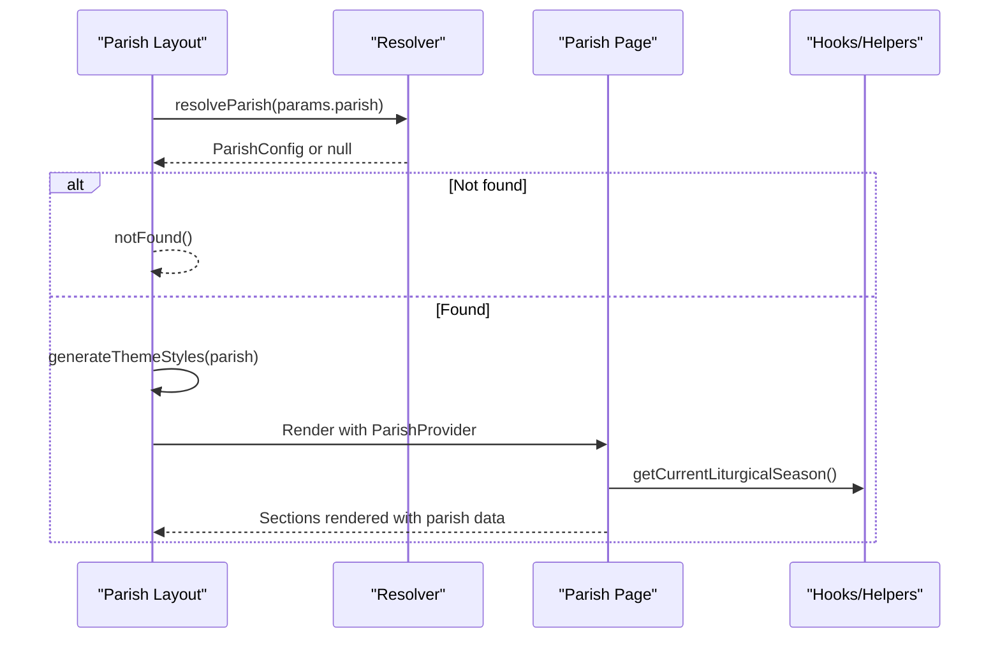
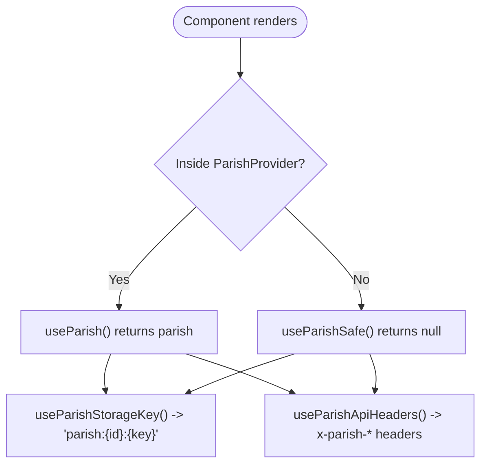
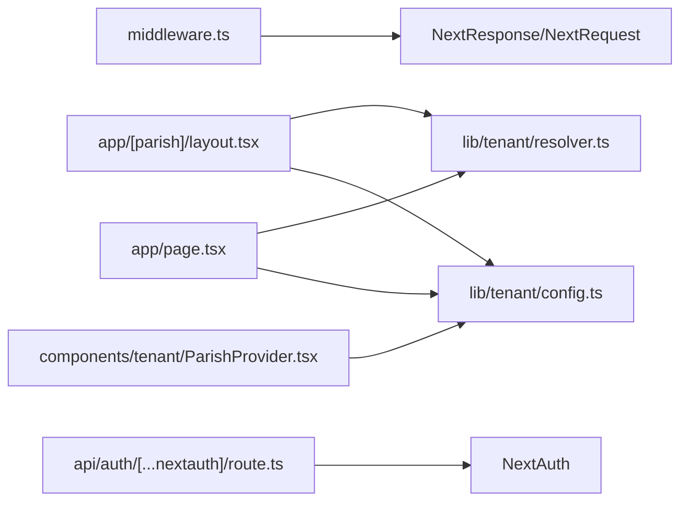

# Master Site Application

<cite>
**Referenced Files in This Document**
- [package.json](file://frontend/apps/master-site/package.json)
- [next.config.js](file://frontend/apps/master-site/next.config.js)
- [middleware.ts](file://frontend/apps/master-site/src/middleware.ts)
- [layout.tsx](file://frontend/apps/master-site/src/app/layout.tsx)
- [page.tsx](file://frontend/apps/master-site/src/app/page.tsx)
- [ParishProvider.tsx](file://frontend/apps/master-site/src/components/tenant/ParishProvider.tsx)
- [config.ts](file://frontend/apps/master-site/src/lib/tenant/config.ts)
- [resolver.ts](file://frontend/apps/master-site/src/lib/tenant/resolver.ts)
- [layout.tsx](file://frontend/apps/master-site/src/app/[parish]/layout.tsx)
- [page.tsx](file://frontend/apps/master-site/src/app/[parish]/page.tsx)
- [route.ts](file://frontend/apps/master-site/src/app/api/auth/[...nextauth]/route.ts)
</cite>

## Table of Contents
1. Introduction
2. Project Structure
3. Core Components
4. Architecture Overview
5. Detailed Component Analysis
6. Dependency Analysis
7. Performance Considerations
8. Troubleshooting Guide
9. Conclusion
10. Appendices

## Introduction
The Master Site is the marketing and landing hub for the JOL-HUB platform. It provides a multi-tenant routing system that serves parish-specific sites via subdomains, renders dynamic content per parish, and exposes a master homepage with SEO-rich metadata. The application uses Next.js App Router, server components for performance, and a tenant context provider to share parish configuration across the component tree. It integrates with backend APIs (planned) and includes middleware-based subdomain routing, security headers, and caching strategies.

## Project Structure
The Master Site is a Next.js application under frontend/apps/master-site. Key areas:
- Middleware handles multi-tenant subdomain routing and security headers.
- Dynamic routes under app/[parish] render parish-specific pages with metadata and theme injection.
- Tenant utilities define types, mock data, and resolvers for parish configuration.
- A React context provider supplies parish data to client components.
- Root layout sets global fonts, viewport, and default SEO metadata.
- Configuration defines supported locales and image domains.

**Diagram sources**
- [middleware.ts:63-153](file://frontend/apps/master-site/src/middleware.ts#L63-L153)
- [page.tsx:631-743](file://frontend/apps/master-site/src/app/page.tsx#L631-L743)
- [layout.tsx:138-167](file://frontend/apps/master-site/src/app/[parish]/layout.tsx#L138-L167)
- [page.tsx:80-127](file://frontend/apps/master-site/src/app/[parish]/page.tsx#L80-L127)
- [ParishProvider.tsx:83-98](file://frontend/apps/master-site/src/components/tenant/ParishProvider.tsx#L83-L98)
- [resolver.ts:516-549](file://frontend/apps/master-site/src/lib/tenant/resolver.ts#L516-L549)
- [config.ts:125-205](file://frontend/apps/master-site/src/lib/tenant/config.ts#L125-L205)

**Section sources**
- [next.config.js:1-15](file://frontend/apps/master-site/next.config.js#L1-L15)
- [package.json:1-58](file://frontend/apps/master-site/package.json#L1-L58)

## Core Components
- Multi-tenant middleware: Extracts subdomain, validates format, rewrites URLs to dynamic routes, adds security and parish headers, and applies caching headers.
- Parish resolver: Resolves parish configuration from subdomain using mock data in development; production notes describe Redis/API integration paths.
- Parish layout and page: Generate per-parish metadata, inject theme CSS variables, wrap content with ParishProvider, and render sections like hero, service times, announcements, priest profile, and contact info.
- ParishProvider: Provides parish context to client components with hooks for safe usage, storage key isolation, and API header generation.
- Root layout and master page: Define global fonts, viewport, default SEO, and a master homepage showcasing featured parishes and platform features.

**Section sources**
- [middleware.ts:63-153](file://frontend/apps/master-site/src/middleware.ts#L63-L153)
- [resolver.ts:516-549](file://frontend/apps/master-site/src/lib/tenant/resolver.ts#L516-L549)
- [layout.tsx:138-167](file://frontend/apps/master-site/src/app/[parish]/layout.tsx#L138-L167)
- [page.tsx:80-127](file://frontend/apps/master-site/src/app/[parish]/page.tsx#L80-L127)
- [ParishProvider.tsx:83-98](file://frontend/apps/master-site/src/components/tenant/ParishProvider.tsx#L83-L98)
- [layout.tsx:16-66](file://frontend/apps/master-site/src/app/layout.tsx#L16-L66)
- [page.tsx:631-743](file://frontend/apps/master-site/src/app/page.tsx#L631-L743)

## Architecture Overview
The request lifecycle for a parish subdomain:
- Middleware extracts subdomain and rewrites to /[parish].
- Next.js resolves dynamic route and runs generateMetadata and generateViewport.
- Parish layout fetches parish config via resolver, injects theme CSS variables, and wraps children with ParishProvider.
- Parish page renders sections using parish data and liturgical season helpers.
- Client components access parish context via hooks for localized behavior and API calls.

**Diagram sources**
- [middleware.ts:63-153](file://frontend/apps/master-site/src/middleware.ts#L63-L153)
- [layout.tsx:48-121](file://frontend/apps/master-site/src/app/[parish]/layout.tsx#L48-L121)
- [layout.tsx:138-167](file://frontend/apps/master-site/src/app/[parish]/layout.tsx#L138-L167)
- [resolver.ts:516-549](file://frontend/apps/master-site/src/lib/tenant/resolver.ts#L516-L549)
- [page.tsx:80-127](file://frontend/apps/master-site/src/app/[parish]/page.tsx#L80-L127)

## Detailed Component Analysis

### Multi-Tenant Middleware
- Subdomain extraction supports standard patterns and preview deployments.
- Reserved subdomains are blocked and routed to master site.
- Rewrites root path to /[parish] and prefixes other paths accordingly.
- Adds parish context headers (x-parish-subdomain, x-parish-id) and CORS for parish origins.
- Applies security headers (X-Content-Type-Options, X-Frame-Options, XSS protection, Referrer-Policy, Permissions-Policy).
- Sets cache-control for static content and parish config caching hints.

**Diagram sources**
- [middleware.ts:63-153](file://frontend/apps/master-site/src/middleware.ts#L63-L153)
- [middleware.ts:159-192](file://frontend/apps/master-site/src/middleware.ts#L159-L192)
- [middleware.ts:198-274](file://frontend/apps/master-site/src/middleware.ts#L198-L274)

**Section sources**
- [middleware.ts:63-153](file://frontend/apps/master-site/src/middleware.ts#L63-L153)
- [middleware.ts:159-192](file://frontend/apps/master-site/src/middleware.ts#L159-L192)
- [middleware.ts:198-274](file://frontend/apps/master-site/src/middleware.ts#L198-L274)

### Parish Resolver and Configuration
- Resolver validates and sanitizes subdomain, then looks up parish in mock data during development.
- Attaches diocese information when available.
- Provides functions to list/search parishes and resolve by ID or diocese.
- Config defines type-safe structures for ParishConfig, DioceseConfig, ServiceTime, and Theme presets.
- Includes helper functions for liturgical season calculation and cache key generation.

**Diagram sources**
- [config.ts:125-205](file://frontend/apps/master-site/src/lib/tenant/config.ts#L125-L205)
- [config.ts:19-49](file://frontend/apps/master-site/src/lib/tenant/config.ts#L19-L49)
- [config.ts:58-73](file://frontend/apps/master-site/src/lib/tenant/config.ts#L58-L73)
- [config.ts:78-91](file://frontend/apps/master-site/src/lib/tenant/config.ts#L78-L91)

**Section sources**
- [resolver.ts:516-549](file://frontend/apps/master-site/src/lib/tenant/resolver.ts#L516-L549)
- [resolver.ts:585-618](file://frontend/apps/master-site/src/lib/tenant/resolver.ts#L585-L618)
- [config.ts:125-205](file://frontend/apps/master-site/src/lib/tenant/config.ts#L125-L205)
- [config.ts:227-326](file://frontend/apps/master-site/src/lib/tenant/config.ts#L227-L326)

### Parish Layout and Page
- generateMetadata builds per-parish title, description, keywords, Open Graph, Twitter card, canonical URL, and robots settings.
- generateViewport sets theme color based on parish theme.
- Layout fetches parish config, triggers notFound if missing, injects CSS variables from theme, and wraps children with ParishProvider.
- Page renders hero, quick actions, announcements, service times, priest profile, contact, and quick links. Uses liturgical season helpers for badges and colors.

**Diagram sources**
- [layout.tsx:48-121](file://frontend/apps/master-site/src/app/[parish]/layout.tsx#L48-L121)
- [layout.tsx:138-167](file://frontend/apps/master-site/src/app/[parish]/layout.tsx#L138-L167)
- [page.tsx:80-127](file://frontend/apps/master-site/src/app/[parish]/page.tsx#L80-L127)
- [config.ts:227-326](file://frontend/apps/master-site/src/lib/tenant/config.ts#L227-L326)

**Section sources**
- [layout.tsx:48-121](file://frontend/apps/master-site/src/app/[parish]/layout.tsx#L48-L121)
- [layout.tsx:138-167](file://frontend/apps/master-site/src/app/[parish]/layout.tsx#L138-L167)
- [page.tsx:80-127](file://frontend/apps/master-site/src/app/[parish]/page.tsx#L80-L127)

### Tenant Context Provider
- Provides parish context value with isValid flag to ensure safe usage.
- Exposes hooks:
  - useParish: throws if used outside parish context.
  - useParishSafe: returns null outside parish context.
  - useIsInParish: boolean check for conditional rendering.
  - useParishStorageKey: generates localStorage keys prefixed by parish ID for isolation.
  - useParishApiHeaders: attaches x-parish-subdomain, x-parish-id, and x-diocese-id headers for backend requests.

**Diagram sources**
- [ParishProvider.tsx:83-98](file://frontend/apps/master-site/src/components/tenant/ParishProvider.tsx#L83-L98)
- [ParishProvider.tsx:121-174](file://frontend/apps/master-site/src/components/tenant/ParishProvider.tsx#L121-L174)
- [ParishProvider.tsx:201-250](file://frontend/apps/master-site/src/components/tenant/ParishProvider.tsx#L201-L250)

**Section sources**
- [ParishProvider.tsx:83-98](file://frontend/apps/master-site/src/components/tenant/ParishProvider.tsx#L83-L98)
- [ParishProvider.tsx:121-174](file://frontend/apps/master-site/src/components/tenant/ParishProvider.tsx#L121-L174)
- [ParishProvider.tsx:201-250](file://frontend/apps/master-site/src/components/tenant/ParishProvider.tsx#L201-L250)

### Master Homepage and SEO
- Root layout sets global fonts, viewport, and default metadata including authors, publisher, and robots.
- Master page defines rich SEO metadata with alternates for multiple languages, Open Graph details, canonical URL, and ISR revalidation.
- Renders hero section with liturgical season badge, search form, stats, featured parishes, feature highlights, donation CTA, and footer.

**Section sources**
- [layout.tsx:16-66](file://frontend/apps/master-site/src/app/layout.tsx#L16-L66)
- [page.tsx:13-52](file://frontend/apps/master-site/src/app/page.tsx#L13-L52)
- [page.tsx:631-743](file://frontend/apps/master-site/src/app/page.tsx#L631-L743)

## Dependency Analysis
- Middleware depends on NextResponse and NextRequest for routing and headers.
- Parish layout and page depend on resolver and config for data and helpers.
- ParishProvider depends on React context and types from config.
- Master page depends on resolver and config for listing and searching parishes.
- Auth route scaffolds NextAuth handler without providers configured.

**Diagram sources**
- [middleware.ts:13-14](file://frontend/apps/master-site/src/middleware.ts#L13-L14)
- [layout.tsx:17-19](file://frontend/apps/master-site/src/app/[parish]/layout.tsx#L17-L19)
- [page.tsx:15-17](file://frontend/apps/master-site/src/app/[parish]/page.tsx#L15-L17)
- [ParishProvider.tsx:13-14](file://frontend/apps/master-site/src/components/tenant/ParishProvider.tsx#L13-L14)
- [page.tsx:1-7](file://frontend/apps/master-site/src/app/page.tsx#L1-L7)
- [route.ts:1-9](file://frontend/apps/master-site/src/app/api/auth/[...nextauth]/route.ts#L1-L9)

**Section sources**
- [middleware.ts:13-14](file://frontend/apps/master-site/src/middleware.ts#L13-L14)
- [layout.tsx:17-19](file://frontend/apps/master-site/src/app/[parish]/layout.tsx#L17-L19)
- [page.tsx:15-17](file://frontend/apps/master-site/src/app/[parish]/page.tsx#L15-L17)
- [ParishProvider.tsx:13-14](file://frontend/apps/master-site/src/components/tenant/ParishProvider.tsx#L13-L14)
- [page.tsx:1-7](file://frontend/apps/master-site/src/app/page.tsx#L1-L7)
- [route.ts:1-9](file://frontend/apps/master-site/src/app/api/auth/[...nextauth]/route.ts#L1-L9)

## Performance Considerations
- Edge-compatible middleware with fast cold start and minimal logic.
- Server components for parish pages reduce client-side bundle size.
- ISR revalidation set at 1 hour for parish routes and 10 minutes for master page.
- Cache-Control headers applied for static content and parish config hints.
- Theme CSS variables injected at layout level to avoid runtime recalculations.
- Planned Redis caching for parish resolution to support large-scale subdomains.

[No sources needed since this section provides general guidance]

## Troubleshooting Guide
- Invalid subdomain: Middleware returns 400 with plain text error. Ensure subdomain matches allowed pattern and is not reserved.
- Parish not found: Layout triggers notFound when resolver returns null. Verify subdomain exists in resolver data or configure production resolver.
- Missing parish context: Client components using useParish outside parish routes will throw an error. Use useParishSafe or guard with useIsInParish.
- API isolation: When calling backend APIs, include headers from useParishApiHeaders to ensure tenant-scoped responses.
- Auth route: NextAuth handler is scaffolded without providers; configure providers and secrets before enabling authentication flows.

**Section sources**
- [middleware.ts:70-79](file://frontend/apps/master-site/src/middleware.ts#L70-L79)
- [layout.tsx:143-149](file://frontend/apps/master-site/src/app/[parish]/layout.tsx#L143-L149)
- [ParishProvider.tsx:121-132](file://frontend/apps/master-site/src/components/tenant/ParishProvider.tsx#L121-L132)
- [ParishProvider.tsx:234-250](file://frontend/apps/master-site/src/components/tenant/ParishProvider.tsx#L234-L250)
- [route.ts:1-9](file://frontend/apps/master-site/src/app/api/auth/[...nextauth]/route.ts#L1-L9)

## Conclusion
The Master Site implements a robust multi-tenant architecture for parish subdomains using Next.js middleware, dynamic routes, and a tenant context provider. It delivers SEO-optimized pages, theme customization, and scalable patterns for future backend integrations. With clear separation of concerns and performance-focused design, it provides a solid foundation for expanding parish templates and customizing the master site appearance.

[No sources needed since this section summarizes without analyzing specific files]

## Appendices

### Creating a New Parish Template
- Add a new entry in the resolver’s mock data for development, ensuring unique subdomain, diocese mapping, and complete fields.
- Optionally extend config types if new fields are required.
- Update generateStaticParams to include the new parish for pre-rendering.
- Test via subdomain rewrite in middleware or local dev environment.

**Section sources**
- [resolver.ts:35-498](file://frontend/apps/master-site/src/lib/tenant/resolver.ts#L35-L498)
- [config.ts:125-205](file://frontend/apps/master-site/src/lib/tenant/config.ts#L125-L205)
- [layout.tsx:178-196](file://frontend/apps/master-site/src/app/[parish]/layout.tsx#L178-L196)

### Customizing the Master Site Appearance
- Modify root layout to adjust fonts, viewport, and default metadata.
- Update next.config.js for additional locales or image domains.
- Adjust master page sections (hero, features, donate CTA) to reflect branding and messaging.
- Use Tailwind classes and theme variables consistently across components.

**Section sources**
- [layout.tsx:16-66](file://frontend/apps/master-site/src/app/layout.tsx#L16-L66)
- [next.config.js:1-15](file://frontend/apps/master-site/next.config.js#L1-L15)
- [page.tsx:631-743](file://frontend/apps/master-site/src/app/page.tsx#L631-L743)