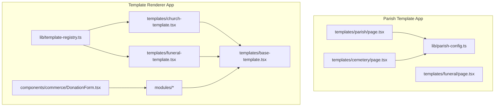
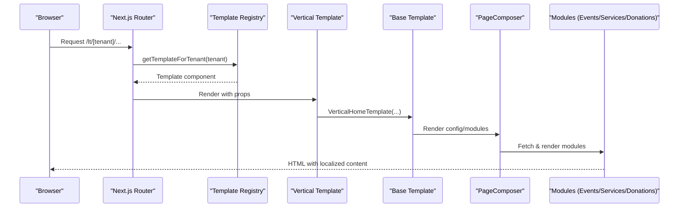
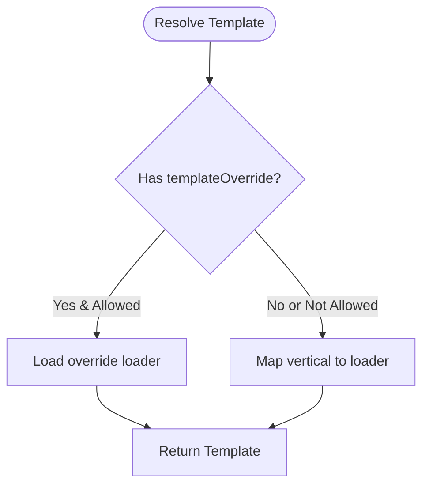
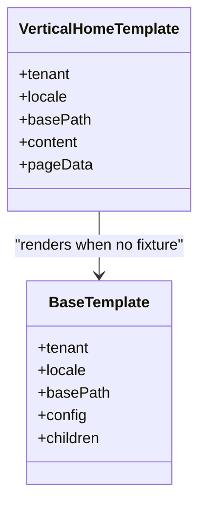
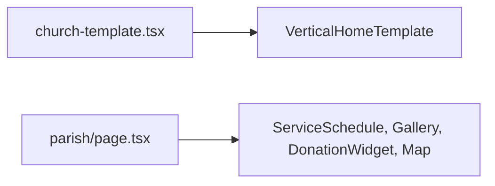
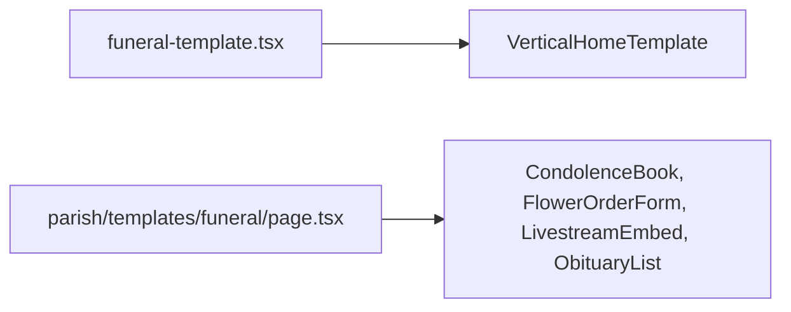
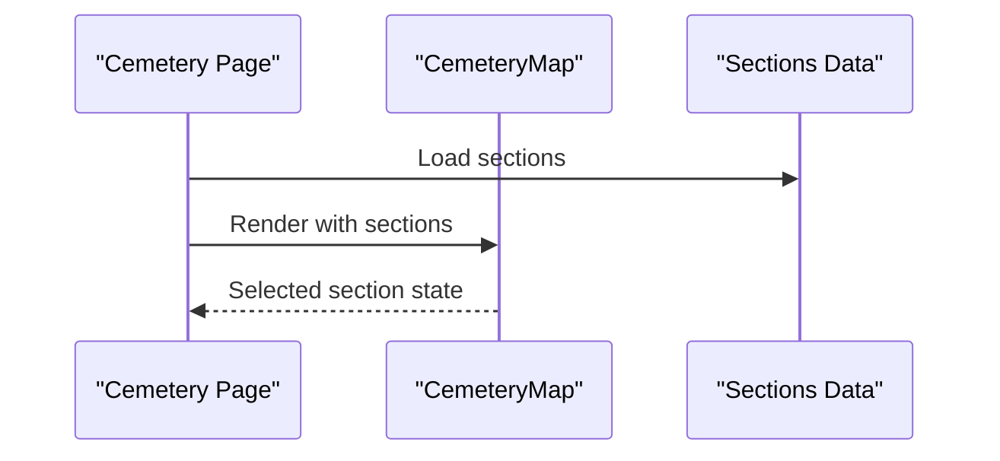
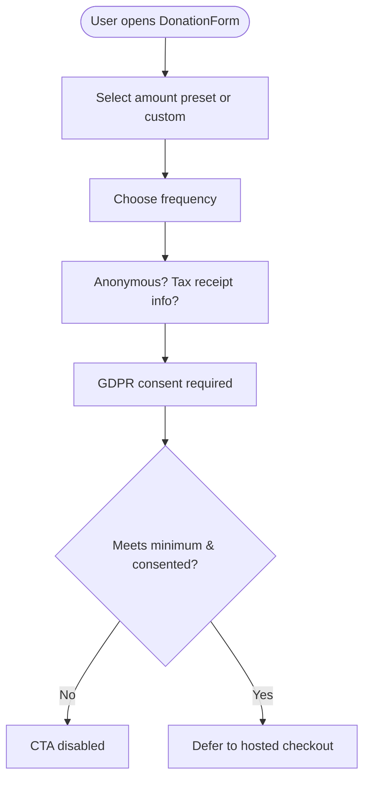
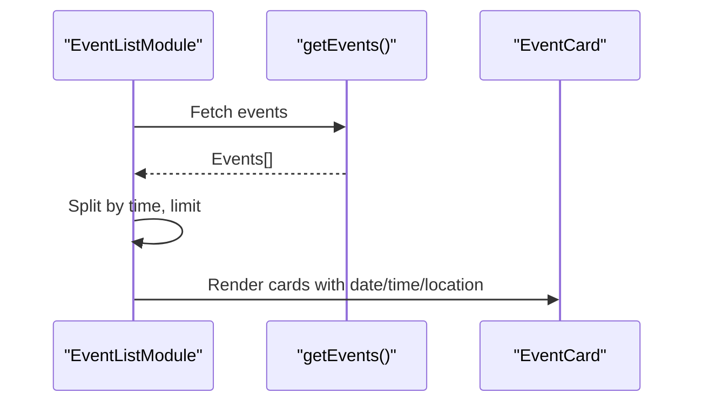
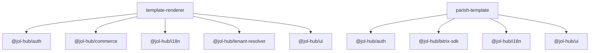

# Parish Template Application

<cite>
**Referenced Files in This Document**
- [package.json](file://frontend/apps/parish-template/package.json)
- [package.json](file://frontend/apps/template-renderer/package.json)
- [page.tsx](file://frontend/apps/parish-template/src/app/templates/parish/page.tsx)
- [page.tsx](file://frontend/apps/parish-template/src/app/templates/cemetery/page.tsx)
- [CemeteryMap.tsx](file://frontend/apps/parish-template/src/app/templates/cemetery/_components/CemeteryMap.tsx)
- [parish-config.ts](file://frontend/apps/parish-template/src/lib/parish-config.ts)
- [template-registry.ts](file://frontend/apps/template-renderer/src/lib/template-registry.ts)
- [base-template.tsx](file://frontend/apps/template-renderer/src/templates/base-template.tsx)
- [church-template.tsx](file://frontend/apps/template-renderer/src/templates/church-template.tsx)
- [funeral-template.tsx](file://frontend/apps/template-renderer/src/templates/funeral-template.tsx)
- [DonationForm.tsx](file://frontend/apps/template-renderer/src/components/commerce/DonationForm.tsx)
- [event-list-module.tsx](file://frontend/apps/template-renderer/src/modules/event-list-module.tsx)
- [service-list-module.tsx](file://frontend/apps/template-renderer/src/modules/service-list-module.tsx)
- [config.ts](file://frontend/apps/master-site/src/lib/tenant/config.ts)
- [generate_parish_site.py](file://tools/qoder/workflows/generate_parish_site.py)
</cite>

## Table of Contents
1. Introduction
2. Project Structure
3. Core Components
4. Architecture Overview
5. Detailed Component Analysis
6. Dependency Analysis
7. Performance Considerations
8. Troubleshooting Guide
9. Conclusion
10. Appendices

## Introduction
This document explains the Parish Template application, a multi-tenant website template system designed for religious institutions. It covers the template architecture, church-specific layouts, service pages (funeral and cemetery services), donation integration, and event management. It also describes how parishes customize templates, manage content via the CMS, configure parish-specific settings, and extend or create new templates.

## Project Structure
The project is organized into two primary front-end applications:
- Parish Template: A standalone Next.js app providing pre-built page templates for parishes, including parish home, funeral services, and cemetery services.
- Template Renderer: A single multi-tenant renderer that resolves tenant-specific verticals to templates and composes pages from modules.

**Diagram sources**
- [page.tsx](file://frontend/apps/parish-template/src/app/templates/parish/page.tsx:1-52)
- [page.tsx](file://frontend/apps/parish-template/src/app/templates/cemetery/page.tsx:90-254)
- [parish-config.ts](file://frontend/apps/parish-template/src/lib/parish-config.ts:1-87)
- [template-registry.ts](file://frontend/apps/template-renderer/src/lib/template-registry.ts:1-109)
- [base-template.tsx](file://frontend/apps/template-renderer/src/templates/base-template.tsx:1-95)
- [church-template.tsx](file://frontend/apps/template-renderer/src/templates/church-template.tsx:1-21)
- [funeral-template.tsx](file://frontend/apps/template-renderer/src/templates/funeral-template.tsx:1-22)
- [DonationForm.tsx](file://frontend/apps/template-renderer/src/components/commerce/DonationForm.tsx:1-176)

**Section sources**
- [package.json](file://frontend/apps/parish-template/package.json:1-48)
- [package.json](file://frontend/apps/template-renderer/package.json:1-64)

## Core Components
- Template Registry: Maps tenant verticals to lazy-loaded templates and supports admin template overrides gated by features.
- Base Template: Provides shared composition, structured data, analytics placeholder, and renders page modules via PageComposer.
- Vertical Templates: Church and Funeral templates delegate rendering to the shared base with data-driven theming.
- Modules: Reusable server-side modules for events, services, donations, galleries, etc., composed into pages.
- Donation Form: Client component for donations with presets, frequency, anonymity, tax receipt info, and GDPR consent; payment delegation to hosted checkout.

Key responsibilities:
- Tenant resolution and feature gating drive which templates and modules are rendered.
- Data-driven themes apply accent colors and schema types per vertical.
- Modules fetch RLS-scoped data and render UI with localization support.

**Section sources**
- [template-registry.ts](file://frontend/apps/template-renderer/src/lib/template-registry.ts:1-109)
- [base-template.tsx](file://frontend/apps/template-renderer/src/templates/base-template.tsx:1-95)
- [church-template.tsx](file://frontend/apps/template-renderer/src/templates/church-template.tsx:1-21)
- [funeral-template.tsx](file://frontend/apps/template-renderer/src/templates/funeral-template.tsx:1-22)
- [DonationForm.tsx](file://frontend/apps/template-renderer/src/components/commerce/DonationForm.tsx:1-176)

## Architecture Overview
The template system uses a registry to resolve a tenant’s vertical to a specific template component. Each template composes shared UI and modules. The base template injects theme tokens, structured data, and renders the module composition. Pages can be driven by fixture/backend content or by default vertical compositions.

**Diagram sources**
- [template-registry.ts](file://frontend/apps/template-renderer/src/lib/template-registry.ts:37-76)
- [base-template.tsx](file://frontend/apps/template-renderer/src/templates/base-template.tsx:44-95)

## Detailed Component Analysis

### Template Resolution and Theming
- The registry maps canonical verticals to template loaders and supports admin overrides when permitted by features.
- Theme mapping converts vertical taxonomy to design-system accents for consistent styling across tenants.

**Diagram sources**
- [template-registry.ts](file://frontend/apps/template-renderer/src/lib/template-registry.ts:52-76)

**Section sources**
- [template-registry.ts](file://frontend/apps/template-renderer/src/lib/template-registry.ts:1-109)

### Base Template and Shared Composition
- The base template sets data-vertical attributes and CSS custom properties, emits baseline JSON-LD, and delegates module rendering to PageComposer.
- VerticalHomeTemplate chooses between fixture-backed content or default vertical composition.

**Diagram sources**
- [base-template.tsx](file://frontend/apps/template-renderer/src/templates/base-template.tsx:44-95)

**Section sources**
- [base-template.tsx](file://frontend/apps/template-renderer/src/templates/base-template.tsx:1-95)

### Church-Specific Layouts
- ChurchTemplate delegates to VerticalHomeTemplate, applying warm gold/amber accents and community-focused composition.
- Parish template page includes hero, service schedule, priest profile, announcements, donation widget, map overlay, and gallery.

**Diagram sources**
- [church-template.tsx](file://frontend/apps/template-renderer/src/templates/church-template.tsx:1-21)
- [page.tsx](file://frontend/apps/parish-template/src/app/templates/parish/page.tsx:1-52)

**Section sources**
- [church-template.tsx](file://frontend/apps/template-renderer/src/templates/church-template.tsx:1-21)
- [page.tsx](file://frontend/apps/parish-template/src/app/templates/parish/page.tsx:1-52)

### Funeral Services Page
- FuneralTemplate applies subdued slate accents and a dignified layout with always-reachable contact.
- Parish-level funeral page provides components such as condolence book, flower order form, livestream embed, and obituary list.

**Diagram sources**
- [funeral-template.tsx](file://frontend/apps/template-renderer/src/templates/funeral-template.tsx:1-22)

**Section sources**
- [funeral-template.tsx](file://frontend/apps/template-renderer/src/templates/funeral-template.tsx:1-22)

### Cemetery Services Page
- Cemetery services page presents service tiers, before/after imagery, gallery, and an interactive map showing sections and availability.
- The map component embeds a map and lists sections with available slots.

**Diagram sources**
- [page.tsx](file://frontend/apps/parish-template/src/app/templates/cemetery/page.tsx:90-254)
- [CemeteryMap.tsx](file://frontend/apps/parish-template/src/app/templates/cemetery/_components/CemeteryMap.tsx:1-86)

**Section sources**
- [page.tsx](file://frontend/apps/parish-template/src/app/templates/cemetery/page.tsx:90-254)
- [CemeteryMap.tsx](file://frontend/apps/parish-template/src/app/templates/cemetery/_components/CemeteryMap.tsx:1-86)

### Donation Integration
- DonationForm offers amount presets, frequency selection, anonymous option, tax receipt eligibility, and GDPR consent.
- Payment delegation follows PCI-DSS constraints: card data never touches this codebase; checkout is handled externally until payments are wired.

**Diagram sources**
- [DonationForm.tsx](file://frontend/apps/template-renderer/src/components/commerce/DonationForm.tsx:1-176)

**Section sources**
- [DonationForm.tsx](file://frontend/apps/template-renderer/src/components/commerce/DonationForm.tsx:1-176)

### Event Management
- EventListModule fetches upcoming events, splits by time, limits display, and links to full events listing.
- ServiceListModule shows services with optional booking CTAs based on package tier entitlements.

**Diagram sources**
- [event-list-module.tsx](file://frontend/apps/template-renderer/src/modules/event-list-module.tsx:1-59)

**Section sources**
- [event-list-module.tsx](file://frontend/apps/template-renderer/src/modules/event-list-module.tsx:1-59)
- [service-list-module.tsx](file://frontend/apps/template-renderer/src/modules/service-list-module.tsx:1-58)

## Dependency Analysis
- Template Renderer depends on workspace packages for auth, commerce, i18n, observability, perf, seed-data, seo, tenant-resolver, and ui.
- Parish Template depends on auth, bitrix-sdk, i18n, ui, and Radix primitives for accessible components.

**Diagram sources**
- [package.json](file://frontend/apps/template-renderer/package.json:23-43)
- [package.json](file://frontend/apps/parish-template/package.json:13-36)

**Section sources**
- [package.json](file://frontend/apps/template-renderer/package.json:1-64)
- [package.json](file://frontend/apps/parish-template/package.json:1-48)

## Performance Considerations
- Lazy loading: Templates are dynamically imported per vertical to minimize bundle size.
- Server modules: Event and service modules fetch data server-side to reduce client work.
- Accessibility and SEO: Structured data and semantic markup improve crawlability and assistive tech support.
- Analytics placeholder: No trackers load without explicit consent to respect privacy and performance budgets.

[No sources needed since this section provides general guidance]

## Troubleshooting Guide
- Template not resolving: Verify tenant.vertical mapping and ensure template loaders exist in the registry.
- Missing modules: Confirm modules are included in the page configuration and tenant features allow rendering.
- Donation CTA disabled: Ensure minimum amount and GDPR consent are satisfied; check feature entitlement for donations.
- Event/Service lists empty: Validate data source queries and RLS permissions; confirm locale and filters.

**Section sources**
- [template-registry.ts](file://frontend/apps/template-renderer/src/lib/template-registry.ts:37-76)
- [DonationForm.tsx](file://frontend/apps/template-renderer/src/components/commerce/DonationForm.tsx:148-173)
- [event-list-module.tsx](file://frontend/apps/template-renderer/src/modules/event-list-module.tsx:20-28)
- [service-list-module.tsx](file://frontend/apps/template-renderer/src/modules/service-list-module.tsx:15-27)

## Conclusion
The Parish Template application provides a robust, multi-tenant template system tailored for religious institutions. It combines a flexible registry, shared base composition, and modular content to deliver church, funeral, and cemetery experiences. Donations and events are integrated through reusable modules with strong privacy and compliance considerations. Parishes can customize their site via configuration and CMS-managed content while maintaining consistent branding and accessibility.

[No sources needed since this section summarizes without analyzing specific files]

## Appendices

### Customizing Parish Settings
- Parish configuration defines identity, hierarchy, localization, appearance, operations, and schedules.
- Use the provided interfaces to structure parish data and integrate with your backend or cache layer.

**Section sources**
- [config.ts](file://frontend/apps/master-site/src/lib/tenant/config.ts:119-174)
- [parish-config.ts](file://frontend/apps/parish-template/src/lib/parish-config.ts:1-87)

### Creating a Custom Parish Template
- Add a new vertical template file that delegates to VerticalHomeTemplate or composes BaseTemplate with custom modules.
- Register the template in the registry under the appropriate vertical or ID-based override if permitted by features.
- Wire up modules for events, services, and donations as needed.

**Section sources**
- [church-template.tsx](file://frontend/apps/template-renderer/src/templates/church-template.tsx:1-21)
- [base-template.tsx](file://frontend/apps/template-renderer/src/templates/base-template.tsx:44-95)
- [template-registry.ts](file://frontend/apps/template-renderer/src/lib/template-registry.ts:37-76)

### Extending Existing Templates with New Features
- Create a new module under modules/ and include it in the page configuration for the target vertical.
- Gate access using tenant.features and packageTier where appropriate (e.g., booking CTAs).
- Integrate with i18n messages and theme tokens for consistent localization and styling.

**Section sources**
- [service-list-module.tsx](file://frontend/apps/template-renderer/src/modules/service-list-module.tsx:15-27)
- [event-list-module.tsx](file://frontend/apps/template-renderer/src/modules/event-list-module.tsx:20-28)

### Generating and Onboarding a Parish Site
- Use the scaffold workflow to generate a parish site, update tenant resolver entries, and set theme defaults.
- The script updates configuration and optionally adds mock parish entries for development.

**Section sources**
- [generate_parish_site.py](file://tools/qoder/workflows/generate_parish_site.py:395-434)