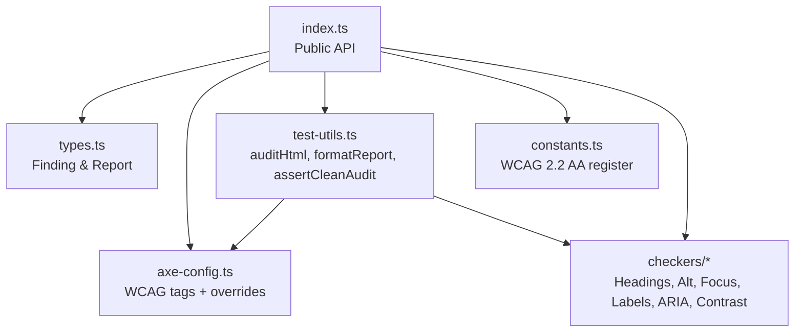
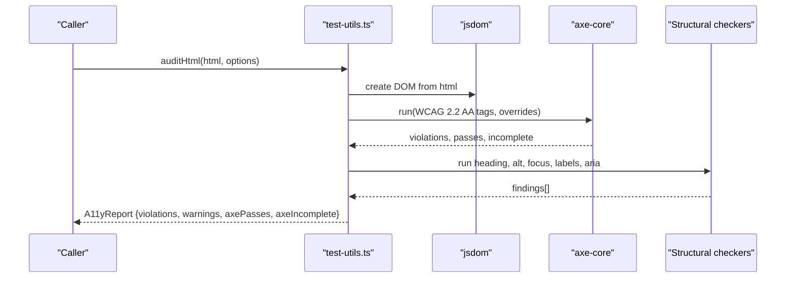
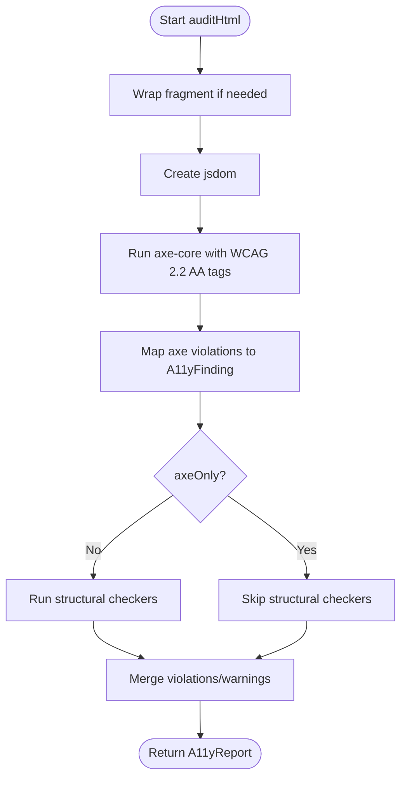
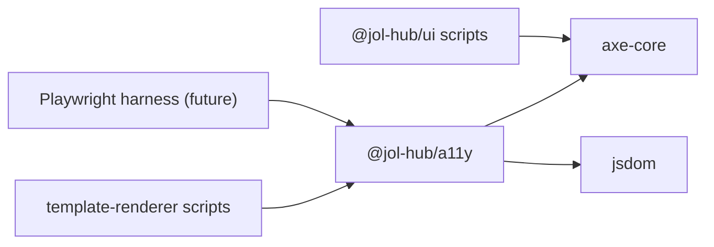

# Accessibility Package

<cite>
**Referenced Files in This Document**
- [package.json](file://frontend/packages/a11y/package.json)
- [index.ts](file://frontend/packages/a11y/src/index.ts)
- [types.ts](file://frontend/packages/a11y/src/types.ts)
- [axe-config.ts](file://frontend/packages/a11y/src/axe-config.ts)
- [test-utils.ts](file://frontend/packages/a11y/src/test-utils.ts)
- [constants.ts](file://frontend/packages/a11y/src/constants.ts)
- [alt-text.ts](file://frontend/packages/a11y/src/checkers/alt-text.ts)
- [aria-usage.ts](file://frontend/packages/a11y/src/checkers/aria-usage.ts)
- [color-contrast.ts](file://frontend/packages/a11y/src/checkers/color-contrast.ts)
- [focus-order.ts](file://frontend/packages/a11y/src/checkers/focus-order.ts)
- [form-labels.ts](file://frontend/packages/a11y/src/checkers/form-labels.ts)
- [heading-hierarchy.ts](file://frontend/packages/a11y/src/checkers/heading-hierarchy.ts)
- [a11y.test.ts](file://frontend/packages/a11y/src/__tests__/a11y.test.ts)
- [check-a11y.tsx](file://frontend/packages/ui/scripts/check-a11y.tsx)
- [a11y-audit.md](file://frontend/docs/a11y-audit.md)
</cite>

## Table of Contents
1. Introduction
2. Project Structure
3. Core Components
4. Architecture Overview
5. Detailed Component Analysis
6. Dependency Analysis
7. Performance Considerations
8. Troubleshooting Guide
9. Conclusion
10. Appendices

## Introduction
This document explains the accessibility package that enforces WCAG 2.2 AA compliance across applications. It covers accessibility utilities, ARIA attribute management, keyboard navigation support, and screen reader compatibility. It also provides guidance for implementing accessible forms, navigation menus, and interactive components, along with automated and manual testing procedures to maintain high accessibility standards.

The package integrates axe-core for rule-based audits, jsdom for headless HTML evaluation, and a set of structural checkers (headings, alt text, focus order, form labels, ARIA usage). It exposes a unified report format so CI gates can fail builds on any violation.

**Section sources**
- [index.ts:1-29](file://frontend/packages/a11y/src/index.ts#L1-L29)
- [package.json:1-35](file://frontend/packages/a11y/package.json#L1-L35)

## Project Structure
The package is organized into:
- Public API entrypoint exporting types, constants, axe configuration, test utilities, and all structural checkers.
- Types defining a consistent finding and report model consumed by all audit surfaces.
- Axe configuration that selects WCAG 2.2 AA tags and disables rules unsuitable for jsdom.
- Test utilities that run axe-core inside jsdom and layer structural checkers on top.
- Checkers for headings, alt text, focus order, form labels, ARIA usage, and color contrast math.
- Tests validating checker behavior and WCAG criteria coverage.

**Diagram sources**
- [index.ts:11-29](file://frontend/packages/a11y/src/index.ts#L11-L29)
- [test-utils.ts:14-23](file://frontend/packages/a11y/src/test-utils.ts#L14-L23)
- [axe-config.ts:17-46](file://frontend/packages/a11y/src/axe-config.ts#L17-L46)

**Section sources**
- [index.ts:1-29](file://frontend/packages/a11y/src/index.ts#L1-L29)
- [package.json:1-35](file://frontend/packages/a11y/package.json#L1-L35)

## Core Components
- Unified findings and reports: All checkers emit A11yFinding; audits return A11yReport with violations, warnings, and axe pass/incomplete counts.
- Axe integration: Centralized WCAG 2.2 AA tag selection and jsdom-specific rule overrides; supports browser harness mode for real-browser runs.
- Audit runner: Boots jsdom, injects axe-core, runs WCAG rules, layers structural checkers, and formats human-readable reports or asserts clean results.
- Structural checkers: Enforce heading hierarchy, image alt presence, focus order discipline, form labeling, ARIA best practices, and provide contrast math for token-level checks.
- WCAG criteria register: Documents how each success criterion is satisfied and verified (automated, token, component, manual, process).

**Section sources**
- [types.ts:1-37](file://frontend/packages/a11y/src/types.ts#L1-L37)
- [axe-config.ts:1-46](file://frontend/packages/a11y/src/axe-config.ts#L1-L46)
- [test-utils.ts:1-136](file://frontend/packages/a11y/src/test-utils.ts#L1-L136)
- [constants.ts:1-95](file://frontend/packages/a11y/src/constants.ts#L1-L95)

## Architecture Overview
The package composes an audit pipeline:
- Consumers supply HTML (full document or fragment).
- The runner creates a jsdom environment, evaluates axe-core, and collects violations.
- Structural checkers analyze the same surface for additional WCAG requirements not covered by axe in jsdom.
- Results are normalized into a single report for CI gating or reporting.

**Diagram sources**
- [test-utils.ts:57-109](file://frontend/packages/a11y/src/test-utils.ts#L57-L109)
- [axe-config.ts:17-46](file://frontend/packages/a11y/src/axe-config.ts#L17-L46)

## Detailed Component Analysis

### Audit Runner and Reporting
- Builds a jsdom instance and injects axe-core source.
- Runs axe with WCAG 2.2 AA tags and jsdom-safe overrides.
- Layers structural checkers unless axeOnly is requested.
- Produces a report and helper functions to format output or assert no failures.

**Diagram sources**
- [test-utils.ts:57-109](file://frontend/packages/a11y/src/test-utils.ts#L57-L109)

**Section sources**
- [test-utils.ts:1-136](file://frontend/packages/a11y/src/test-utils.ts#L1-L136)

### Axe Configuration
- Selects WCAG 2.0–2.2 A+AA tags for consistent rule sets.
- Disables color-contrast under jsdom because computed colors cannot be resolved without a layout engine.
- Provides buildAxeOptions to enable those rules when running in a real browser harness (e.g., Playwright).

**Section sources**
- [axe-config.ts:1-46](file://frontend/packages/a11y/src/axe-config.ts#L1-L46)

### Heading Hierarchy Checker
- Ensures exactly one h1 per page and no skipped heading levels downward.
- Flags empty headings used purely for styling.
- Operates via string scanning to match screen-reader traversal order.

**Section sources**
- [heading-hierarchy.ts:1-74](file://frontend/packages/a11y/src/checkers/heading-hierarchy.ts#L1-L74)

### Alt Text Checker
- Requires every img to have an alt attribute; decorative images should use alt="".
- Requires role="img" elements to expose an accessible name via aria-label or aria-labelledby.

**Section sources**
- [alt-text.ts:1-48](file://frontend/packages/a11y/src/checkers/alt-text.ts#L1-L48)

### Focus Order Checker
- Forbids positive tabindex values to keep focus order aligned with DOM order.
- Allows tabindex="0" and tabindex="-1" where appropriate.

**Section sources**
- [focus-order.ts:1-34](file://frontend/packages/a11y/src/checkers/focus-order.ts#L1-L34)

### Form Labels Checker
- Requires programmatically associated labels for inputs, selects, and textareas.
- Exempts honeypot fields intentionally hidden from assistive technologies.
- Warns when only title is used; fails when no label exists.

**Section sources**
- [form-labels.ts:1-72](file://frontend/packages/a11y/src/checkers/form-labels.ts#L1-L72)

### ARIA Usage Checker
- Warns when div/span are used with interactive roles like button/link; prefers native elements.
- Detects icon-only buttons missing accessible names and suggests adding aria-label.

**Section sources**
- [aria-usage.ts:40-74](file://frontend/packages/a11y/src/checkers/aria-usage.ts#L40-L74)

### Color Contrast Utilities
- Implements WCAG relative luminance and contrast ratio calculations.
- Provides thresholds for normal text, large text, and non-text UI.
- Used at design-token level since rendered-page contrast requires a real browser.

**Section sources**
- [color-contrast.ts:1-72](file://frontend/packages/a11y/src/checkers/color-contrast.ts#L1-L72)

### WCAG Criteria Register
- Enumerates WCAG 2.2 A+AA criteria with verification status (automated, token, component, manual, process).
- Serves as a compliance ledger and reporting aid.

**Section sources**
- [constants.ts:1-95](file://frontend/packages/a11y/src/constants.ts#L1-L95)

### Tests
- Validates checker behaviors such as role=button warnings and contrast math.
- Verifies the criteria register covers the expected number of WCAG 2.2 criteria and statuses.

**Section sources**
- [a11y.test.ts:131-171](file://frontend/packages/a11y/src/__tests__/a11y.test.ts#L131-L171)

## Dependency Analysis
The package depends on:
- axe-core for WCAG rule evaluation.
- jsdom for headless HTML parsing and DOM manipulation.
- TypeScript tooling for type checking and building.

Consumers include:
- UI showcase gate that audits components using a similar jsdom+axe pattern.
- Template-renderer page gate scripts that audit critical pages.
- Future Playwright E2E harness that can re-enable disabled rules via browserHarness.

**Diagram sources**
- [package.json:24-33](file://frontend/packages/a11y/package.json#L24-L33)
- [check-a11y.tsx:33-122](file://frontend/packages/ui/scripts/check-a11y.tsx#L33-L122)

**Section sources**
- [package.json:1-35](file://frontend/packages/a11y/package.json#L1-L35)
- [check-a11y.tsx:33-122](file://frontend/packages/ui/scripts/check-a11y.tsx#L33-L122)

## Performance Considerations
- Full-page audits run against critical pages only due to jsdom+axe cost.
- Component coverage is handled by the UI showcase gate which audits many components in a single document.
- Prefer axeOnly mode when you need faster feedback during development and rely on structural checkers elsewhere.

[No sources needed since this section provides general guidance]

## Troubleshooting Guide
Common issues and resolutions:
- Missing h1 or multiple h1: Add exactly one h1 representing the page title; ensure heading levels do not skip downward.
- Images without alt: Provide descriptive alt for informative images; use alt="" for decorative images.
- Positive tabindex: Remove positive tabindex; rely on natural DOM order or programmatic focus with tabindex="-1".
- Unlabeled form controls: Associate labels via for/id, wrapping label, aria-label, or aria-labelledby; avoid relying solely on title.
- Icon-only buttons without accessible names: Add aria-label or equivalent accessible name.
- Color contrast failures under jsdom: Use token-level contrast checks; re-enable color-contrast in a real browser harness for rendered-page validation.

Manual testing checklist (keyboard, screen readers, zoom/reflow, motion, touch targets, forms):
- Verify keyboard reachability, visible focus indicators, and no traps.
- Validate screen reader announcements for landmarks, labels, live regions, and locale changes.
- Confirm content reflows at 200% zoom and text-only zoom up to 400%.
- Ensure reduced motion respects user preferences and no auto-playing media without controls.
- Confirm touch targets meet minimum sizes.

Automated testing setup:
- Use the package’s auditHtml and assertCleanAudit to gate CI on violations.
- Integrate with the UI showcase script to audit components.
- For full-page audits, add new public pages to the page list and run the page gate.

**Section sources**
- [a11y-audit.md:1-115](file://frontend/docs/a11y-audit.md#L1-L115)
- [test-utils.ts:111-136](file://frontend/packages/a11y/src/test-utils.ts#L111-L136)
- [axe-config.ts:1-46](file://frontend/packages/a11y/src/axe-config.ts#L1-L46)

## Conclusion
The accessibility package provides a robust, extensible foundation for WCAG 2.2 AA compliance. It combines axe-core rule evaluation with targeted structural checkers, standardized reporting, and clear configuration for both jsdom and real-browser environments. By integrating these tools into CI and following the manual audit guidelines, teams can consistently deliver accessible experiences and quickly remediate issues.

[No sources needed since this section summarizes without analyzing specific files]

## Appendices

### Implementing Accessible Forms
- Always associate labels programmatically; prefer visible labels over title attributes.
- Provide clear error messages linked via aria-describedby and suggest corrections.
- Avoid CAPTCHA; use honeypot fields to remain accessible while preventing spam.

**Section sources**
- [form-labels.ts:1-72](file://frontend/packages/a11y/src/checkers/form-labels.ts#L1-L72)
- [a11y-audit.md:79-84](file://frontend/docs/a11y-audit.md#L79-L84)

### Building Accessible Navigation Menus
- Use native link/button elements instead of div/span with roles.
- Ensure icon-only controls have accessible names.
- Maintain logical tab order without positive tabindex.

**Section sources**
- [aria-usage.ts:40-74](file://frontend/packages/a11y/src/checkers/aria-usage.ts#L40-L74)
- [focus-order.ts:1-34](file://frontend/packages/a11y/src/checkers/focus-order.ts#L1-L34)

### Screen Reader Compatibility
- Landmarks and a single h1 improve structure.
- Live regions announce dynamic updates (e.g., locale changes).
- Ensure form errors are announced assertively and linked to controls.

**Section sources**
- [a11y-audit.md:33-45](file://frontend/docs/a11y-audit.md#L33-L45)

### Automated Testing Setup
- Use auditHtml to evaluate HTML fragments or full documents.
- Fail CI on any violation using assertCleanAudit.
- Re-run with browserHarness enabled in Playwright to validate color contrast and other rules requiring a layout engine.

**Section sources**
- [test-utils.ts:57-109](file://frontend/packages/a11y/src/test-utils.ts#L57-L109)
- [axe-config.ts:37-46](file://frontend/packages/a11y/src/axe-config.ts#L37-L46)

### Manual Testing Procedures
- Keyboard navigation: Tab through all interactive elements; verify focus visibility and order.
- Zoom and reflow: Test at 200% and 400% text zoom; confirm no horizontal scrolling.
- Motion: Respect reduced motion preferences; disable unnecessary animations.
- Touch targets: Ensure adequate size for interactive elements.

**Section sources**
- [a11y-audit.md:23-88](file://frontend/docs/a11y-audit.md#L23-L88)