# Authentication Package

<cite>
**Referenced Files in This Document**
- [index.ts](file://frontend/packages/auth/src/index.ts)
- [package.json](file://frontend/packages/auth/package.json)
- [types.ts](file://frontend/packages/auth/src/types.ts)
- [session.tsx](file://frontend/packages/auth/src/session.tsx)
- [auth-options.ts](file://frontend/packages/auth/src/auth-options.ts)
- [oidc/index.ts](file://frontend/packages/auth/src/oidc/index.ts)
- [oidc/hooks.ts](file://frontend/packages/auth/src/oidc/hooks.ts)
- [oidc/config.ts](file://frontend/packages/auth/src/oidc/config.ts)
- [oidc/rbac.ts](file://frontend/packages/auth/src/oidc/rbac.ts)
- [hooks/useBitrixAuth.ts](file://frontend/packages/auth/src/hooks/useBitrixAuth.ts)
- [middleware/parish-guard.ts](file://frontend/packages/auth/src/middleware/parish-guard.ts)
- [providers/bitrix24.ts](file://frontend/packages/auth/src/providers/bitrix24.ts)
- [lib/bitrix-api.ts](file://frontend/packages/auth/src/lib/bitrix-api.ts)
</cite>

## Table of Contents
1. [Introduction](#introduction)
2. [Project Structure](#project-structure)
3. [Core Components](#core-components)
4. [Architecture Overview](#architecture-overview)
5. [Detailed Component Analysis](#detailed-component-analysis)
6. [Dependency Analysis](#dependency-analysis)
7. [Performance Considerations](#performance-considerations)
8. [Troubleshooting Guide](#troubleshooting-guide)
9. [Conclusion](#conclusion)
10. [Appendices](#appendices)

## Introduction
This package provides shared authentication utilities for applications in the JOL-HUB ecosystem. It integrates NextAuth with a Bitrix24 OAuth provider, offers session management and React hooks, implements tenant-scoped role-based access control (RBAC), and includes middleware to enforce parish-level access. It also exposes an OIDC surface for server-safe configuration and discovery, plus a type-safe client for Bitrix24 REST APIs with automatic token refresh and rate limiting.

Key capabilities:
- JWT-based sessions via NextAuth with token refresh on expiry
- Bitrix24 OAuth provider with PKCE support
- Parish-level guards and middleware for multi-tenant routing
- RBAC with hierarchical roles and permissions per tenant
- Client hooks for login/logout, role checks, and permission checks
- Secure OIDC discovery and configuration (server-only)
- Bitrix24 API client with retry and rate limiting

## Project Structure
The package is organized into focused modules:
- Configuration and providers: auth options, Bitrix24 provider
- Session management: context provider and hooks
- Hooks: Bitrix24-specific auth state and utility hooks
- Middleware: parish guard for route protection
- OIDC: server-safe config, discovery, and RBAC logic
- Types: shared interfaces for sessions, tokens, and roles
- API client: Bitrix24 REST client with rate limiting and token refresh

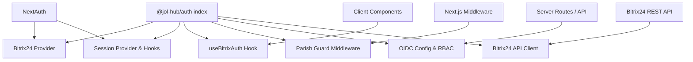

**Diagram sources**
- [index.ts:1-108](file://frontend/packages/auth/src/index.ts#L1-L108)
- [providers/bitrix24.ts:214-308](file://frontend/packages/auth/src/providers/bitrix24.ts#L214-L308)
- [session.tsx:21-51](file://frontend/packages/auth/src/session.tsx#L21-L51)
- [hooks/useBitrixAuth.ts:117-257](file://frontend/packages/auth/src/hooks/useBitrixAuth.ts#L117-L257)
- [middleware/parish-guard.ts:282-387](file://frontend/packages/auth/src/middleware/parish-guard.ts#L282-L387)
- [oidc/index.ts:1-17](file://frontend/packages/auth/src/oidc/index.ts#L1-L17)
- [lib/bitrix-api.ts:209-497](file://frontend/packages/auth/src/lib/bitrix-api.ts#L209-L497)

**Section sources**
- [package.json:1-66](file://frontend/packages/auth/package.json#L1-L66)
- [index.ts:1-108](file://frontend/packages/auth/src/index.ts#L1-L108)

## Core Components
- NextAuth configuration and callbacks for JWT strategy, token refresh, and session mapping
- Bitrix24 OAuth provider with PKCE, profile mapping, and role derivation
- Session provider and hooks for client-side auth state
- Parish guard middleware for route-level authorization
- OIDC server-safe config and discovery, plus RBAC helpers
- Bitrix24 API client with rate limiting and token refresh

**Section sources**
- [auth-options.ts:21-104](file://frontend/packages/auth/src/auth-options.ts#L21-L104)
- [providers/bitrix24.ts:214-308](file://frontend/packages/auth/src/providers/bitrix24.ts#L214-L308)
- [session.tsx:21-51](file://frontend/packages/auth/src/session.tsx#L21-L51)
- [middleware/parish-guard.ts:282-387](file://frontend/packages/auth/src/middleware/parish-guard.ts#L282-L387)
- [oidc/config.ts:39-111](file://frontend/packages/auth/src/oidc/config.ts#L39-L111)
- [oidc/rbac.ts:31-122](file://frontend/packages/auth/src/oidc/rbac.ts#L31-L122)
- [lib/bitrix-api.ts:209-497](file://frontend/packages/auth/src/lib/bitrix-api.ts#L209-L497)

## Architecture Overview
The system combines NextAuth with a Bitrix24 OAuth provider and adds tenant-aware authorization through parish guards and RBAC. Sessions are JWTs that carry user identity and optional tokens; the session callback refreshes expired tokens. The OIDC module provides server-only discovery and RBAC logic. The Bitrix24 API client handles rate limiting and token refresh transparently.

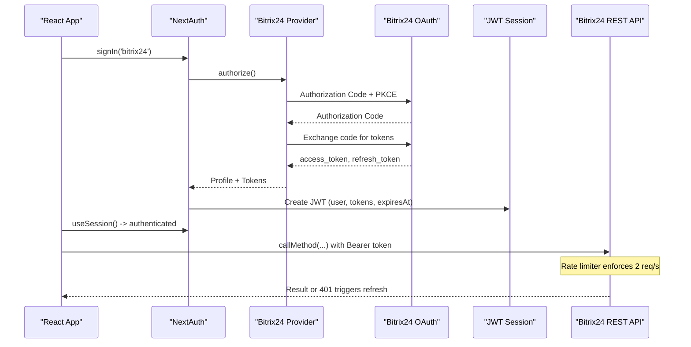

**Diagram sources**
- [providers/bitrix24.ts:214-308](file://frontend/packages/auth/src/providers/bitrix24.ts#L214-L308)
- [auth-options.ts:45-91](file://frontend/packages/auth/src/auth-options.ts#L45-L91)
- [lib/bitrix-api.ts:310-388](file://frontend/packages/auth/src/lib/bitrix-api.ts#L310-L388)

## Detailed Component Analysis

### NextAuth Configuration and JWT Token Management
- Strategy: JWT with maxAge set for long-lived sessions
- Callbacks:
  - signIn: restricts to verified Bitrix24 users
  - jwt: stores tokens and user info; refreshes when expired
  - session: maps JWT payload into extended Session shape
- Token refresh: uses refresh token endpoint when access token is expired

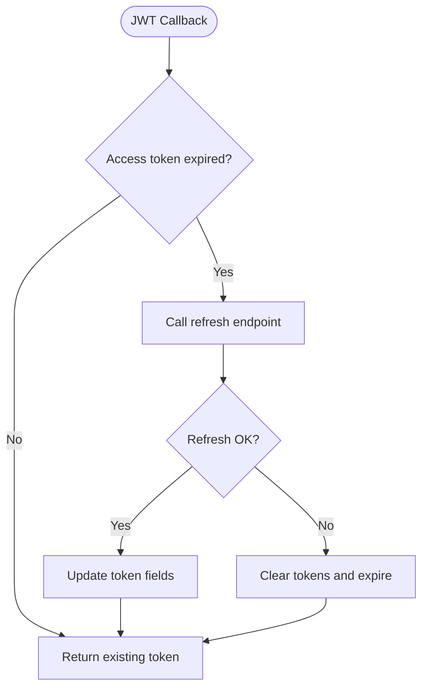

**Diagram sources**
- [auth-options.ts:45-91](file://frontend/packages/auth/src/auth-options.ts#L45-L91)
- [auth-options.ts:125-163](file://frontend/packages/auth/src/auth-options.ts#L125-L163)

**Section sources**
- [auth-options.ts:21-104](file://frontend/packages/auth/src/auth-options.ts#L21-L104)
- [auth-options.ts:125-163](file://frontend/packages/auth/src/auth-options.ts#L125-L163)
- [types.ts:24-65](file://frontend/packages/auth/src/types.ts#L24-L65)

### Bitrix24 OAuth Provider and PKCE
- Implements OAuth2 Authorization Code flow with PKCE (S256)
- Generates secure code verifier/challenge and state parameters
- Maps Bitrix24 profile to internal user model including roles and parish IDs
- Provides token refresh helper

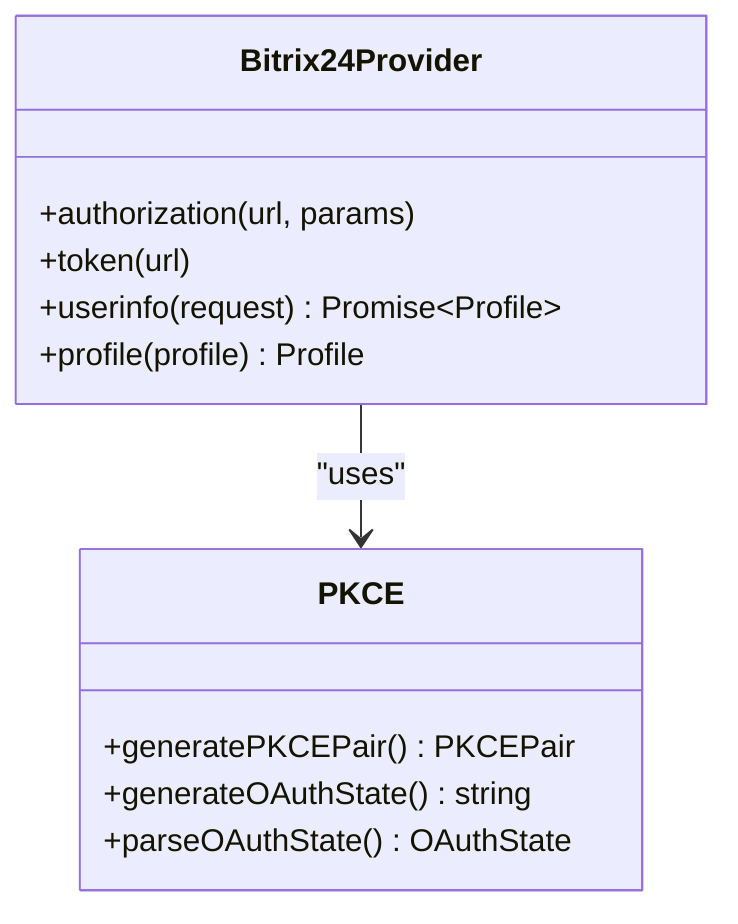

**Diagram sources**
- [providers/bitrix24.ts:75-125](file://frontend/packages/auth/src/providers/bitrix24.ts#L75-L125)
- [providers/bitrix24.ts:214-308](file://frontend/packages/auth/src/providers/bitrix24.ts#L214-L308)

**Section sources**
- [providers/bitrix24.ts:75-125](file://frontend/packages/auth/src/providers/bitrix24.ts#L75-L125)
- [providers/bitrix24.ts:214-308](file://frontend/packages/auth/src/providers/bitrix24.ts#L214-L308)
- [providers/bitrix24.ts:322-353](file://frontend/packages/auth/src/providers/bitrix24.ts#L322-L353)

### Session Provider and Client Hooks
- SessionProvider wraps NextAuth’s useSession and exposes status and update
- useSession hook ensures usage within provider and returns typed session
- Placeholder server functions for getSession/getCsrfToken/signIn/signOut are exported for future integration

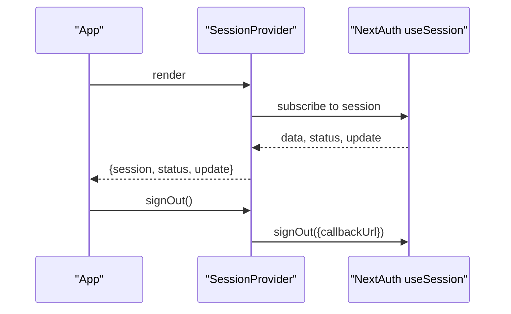

**Diagram sources**
- [session.tsx:21-51](file://frontend/packages/auth/src/session.tsx#L21-L51)
- [session.tsx:57-89](file://frontend/packages/auth/src/session.tsx#L57-L89)

**Section sources**
- [session.tsx:21-51](file://frontend/packages/auth/src/session.tsx#L21-L51)
- [session.tsx:57-89](file://frontend/packages/auth/src/session.tsx#L57-L89)

### Bitrix24 Auth Hook and Parish Access
- useBitrixAuth provides isAuthenticated, isLoading, user, error, login, logout, refreshSession, hasParishAccess, hasRole, hasAnyRole
- Derives user session from NextAuth session and exposes parish-scoped checks
- Utility hooks: useParishContext (subdomain/parishId), useParishAccess (combined auth + parish check)

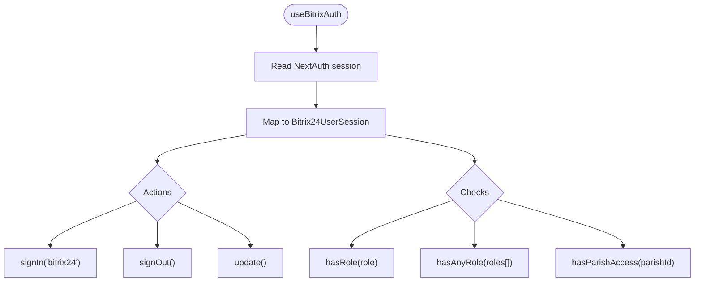

**Diagram sources**
- [hooks/useBitrixAuth.ts:117-257](file://frontend/packages/auth/src/hooks/useBitrixAuth.ts#L117-L257)
- [hooks/useBitrixAuth.ts:267-354](file://frontend/packages/auth/src/hooks/useBitrixAuth.ts#L267-L354)

**Section sources**
- [hooks/useBitrixAuth.ts:117-257](file://frontend/packages/auth/src/hooks/useBitrixAuth.ts#L117-L257)
- [hooks/useBitrixAuth.ts:267-354](file://frontend/packages/auth/src/hooks/useBitrixAuth.ts#L267-L354)

### Parish Guard Middleware
- Factory creates middleware with configurable public, auth-only, and admin paths
- Extracts subdomain and validates parish context
- Enforces authentication and role requirements; redirects to login or access denied
- Adds user and parish headers for downstream components

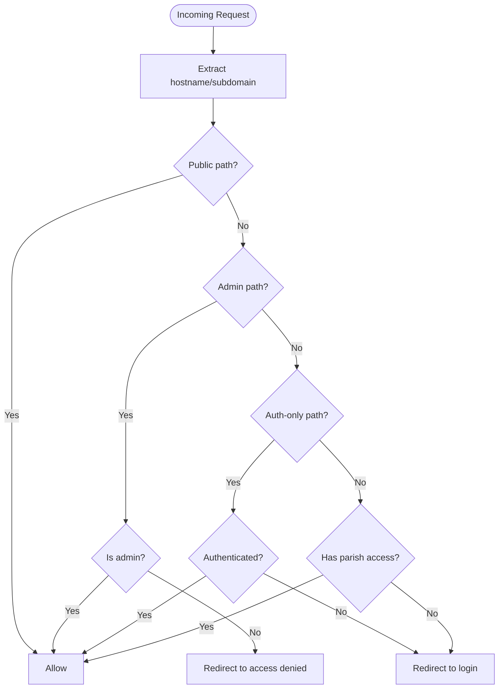

**Diagram sources**
- [middleware/parish-guard.ts:109-152](file://frontend/packages/auth/src/middleware/parish-guard.ts#L109-L152)
- [middleware/parish-guard.ts:200-257](file://frontend/packages/auth/src/middleware/parish-guard.ts#L200-L257)
- [middleware/parish-guard.ts:282-387](file://frontend/packages/auth/src/middleware/parish-guard.ts#L282-L387)

**Section sources**
- [middleware/parish-guard.ts:52-75](file://frontend/packages/auth/src/middleware/parish-guard.ts#L52-L75)
- [middleware/parish-guard.ts:109-152](file://frontend/packages/auth/src/middleware/parish-guard.ts#L109-L152)
- [middleware/parish-guard.ts:200-257](file://frontend/packages/auth/src/middleware/parish-guard.ts#L200-L257)
- [middleware/parish-guard.ts:282-387](file://frontend/packages/auth/src/middleware/parish-guard.ts#L282-L387)

### OIDC Server-Safe Surface and RBAC
- Discovery: fetches and caches OIDC endpoints with TTL
- Environment surface: reads issuer, client id/secret, and next-auth secret
- RBAC: pure functions for role hierarchy, permissions matrix, MFA requirement checks, and safe parsing of tenant roles

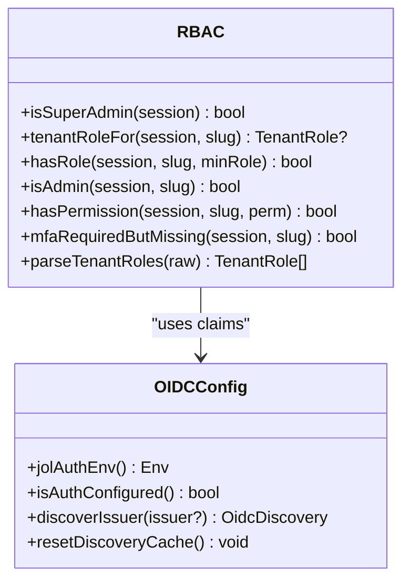

**Diagram sources**
- [oidc/rbac.ts:31-122](file://frontend/packages/auth/src/oidc/rbac.ts#L31-L122)
- [oidc/config.ts:39-111](file://frontend/packages/auth/src/oidc/config.ts#L39-L111)

**Section sources**
- [oidc/index.ts:1-17](file://frontend/packages/auth/src/oidc/index.ts#L1-L17)
- [oidc/config.ts:39-111](file://frontend/packages/auth/src/oidc/config.ts#L39-L111)
- [oidc/rbac.ts:31-122](file://frontend/packages/auth/src/oidc/rbac.ts#L31-L122)

### OIDC Client Hooks
- useAuth: wraps NextAuth useSession, exposes login/logout, isAuthenticated, isLoading
- useTenantRole, usePermission, useHasRole: tenant-scoped checks using RBAC

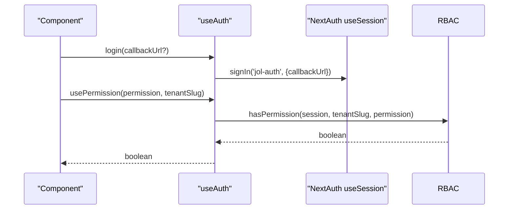

**Diagram sources**
- [oidc/hooks.ts:58-101](file://frontend/packages/auth/src/oidc/hooks.ts#L58-L101)
- [oidc/rbac.ts:74-84](file://frontend/packages/auth/src/oidc/rbac.ts#L74-L84)

**Section sources**
- [oidc/hooks.ts:58-101](file://frontend/packages/auth/src/oidc/hooks.ts#L58-L101)

### Bitrix24 REST API Client
- Rate limiter: enforces 2 requests per second
- Token refresh: proactively refreshes before expiry and retries on 401
- Predefined methods: current user, CRM contacts, tasks, calendar events, departments, users by department

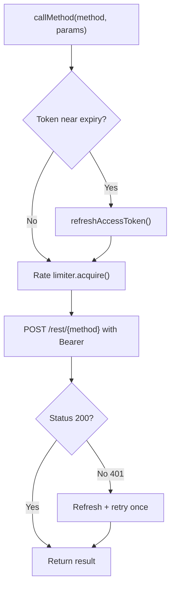

**Diagram sources**
- [lib/bitrix-api.ts:99-179](file://frontend/packages/auth/src/lib/bitrix-api.ts#L99-L179)
- [lib/bitrix-api.ts:230-301](file://frontend/packages/auth/src/lib/bitrix-api.ts#L230-L301)
- [lib/bitrix-api.ts:310-388](file://frontend/packages/auth/src/lib/bitrix-api.ts#L310-L388)

**Section sources**
- [lib/bitrix-api.ts:99-179](file://frontend/packages/auth/src/lib/bitrix-api.ts#L99-L179)
- [lib/bitrix-api.ts:209-497](file://frontend/packages/auth/src/lib/bitrix-api.ts#L209-L497)

## Dependency Analysis
- External dependencies: next-auth (peer dependency on next and react)
- Internal module relationships:
  - index re-exports from providers, session, hooks, middleware, oidc, types, and lib
  - auth-options depends on Bitrix24 provider and types
  - hooks depend on NextAuth and types
  - middleware depends on types and NextResponse
  - oidc modules are server-safe and independent of React
  - api client depends on types and environment

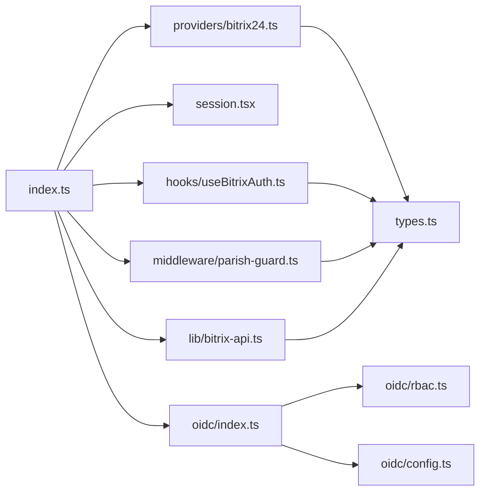

**Diagram sources**
- [index.ts:1-108](file://frontend/packages/auth/src/index.ts#L1-L108)
- [package.json:51-64](file://frontend/packages/auth/package.json#L51-L64)

**Section sources**
- [package.json:1-66](file://frontend/packages/auth/package.json#L1-L66)
- [index.ts:1-108](file://frontend/packages/auth/src/index.ts#L1-L108)

## Performance Considerations
- JWT session strategy reduces server load compared to database-backed sessions
- Token refresh avoids repeated full OAuth flows
- Rate limiter prevents throttling errors against Bitrix24 REST API
- OIDC discovery cache reduces external calls and latency
- Parish guard middleware short-circuits public paths and minimizes auth checks

[No sources needed since this section provides general guidance]

## Troubleshooting Guide
Common issues and strategies:
- Missing Bitrix24 OAuth configuration: ensure BITRIX_AUTH_URL, BITRIX_CLIENT_ID, and BITRIX_CLIENT_SECRET are set; token refresh will fail otherwise
- OIDC not configured: if JOL_AUTH_ISSUER, JOL_AUTH_CLIENT_ID, or NEXTAUTH_SECRET are missing, auth runs in open mode; protected pages should handle this gracefully
- Parish access denied: verify subdomain extraction and user parishIds; check audit logs for reasons like NOT_AUTHENTICATED or PARISH_MISMATCH
- API 401 responses: client automatically refreshes tokens; if refresh fails, onAuthError is invoked and callers should prompt re-login
- Error surfaces:
  - Provider logs failures during user info fetch and token refresh
  - Parish guard logs denied access and login failures
  - API client logs all calls and errors for observability

**Section sources**
- [auth-options.ts:125-163](file://frontend/packages/auth/src/auth-options.ts#L125-L163)
- [oidc/config.ts:55-111](file://frontend/packages/auth/src/oidc/config.ts#L55-L111)
- [middleware/parish-guard.ts:84-100](file://frontend/packages/auth/src/middleware/parish-guard.ts#L84-L100)
- [providers/bitrix24.ts:254-275](file://frontend/packages/auth/src/providers/bitrix24.ts#L254-L275)
- [lib/bitrix-api.ts:270-301](file://frontend/packages/auth/src/lib/bitrix-api.ts#L270-L301)
- [lib/bitrix-api.ts:338-388](file://frontend/packages/auth/src/lib/bitrix-api.ts#L338-L388)

## Conclusion
The authentication package centralizes identity and authorization across applications with a robust mix of NextAuth, Bitrix24 OAuth, parish-level guards, and tenant-scoped RBAC. It supports JWT sessions with automatic token refresh, secure OIDC discovery, and a resilient Bitrix24 API client. Use the provided hooks and middleware to implement login flows, protect routes, and manage sessions consistently.

[No sources needed since this section summarizes without analyzing specific files]

## Appendices

### Implementing Login Flows
- Use the Bitrix24 provider via NextAuth to initiate login
- In client components, use useBitrixAuth.login or OIDC useAuth.login to start the flow
- After successful authentication, the session contains user identity and tokens

**Section sources**
- [providers/bitrix24.ts:214-308](file://frontend/packages/auth/src/providers/bitrix24.ts#L214-L308)
- [hooks/useBitrixAuth.ts:150-172](file://frontend/packages/auth/src/hooks/useBitrixAuth.ts#L150-L172)
- [oidc/hooks.ts:62-65](file://frontend/packages/auth/src/oidc/hooks.ts#L62-L65)

### Protecting Routes
- Configure parish guard middleware with public, auth-only, and admin paths
- Use createParishGuardMiddleware to customize behavior and redirect targets
- Ensure subdomain extraction aligns with parish IDs

**Section sources**
- [middleware/parish-guard.ts:282-387](file://frontend/packages/auth/src/middleware/parish-guard.ts#L282-L387)

### Managing User Sessions
- Wrap your app with SessionProvider to expose session state
- Use useSession to read status and trigger updates
- For server-side needs, integrate getSession/getCsrfToken with NextAuth

**Section sources**
- [session.tsx:21-51](file://frontend/packages/auth/src/session.tsx#L21-L51)
- [session.tsx:57-89](file://frontend/packages/auth/src/session.tsx#L57-L89)

### Multi-Factor Authentication Support
- OIDC RBAC includes mfaRequiredButMissing to enforce MFA for privileged roles
- When enabled, IdP enforces MFA at login; UI can force enrollment based on this check

**Section sources**
- [oidc/rbac.ts:86-94](file://frontend/packages/auth/src/oidc/rbac.ts#L86-L94)
- [oidc/hooks.ts:25-46](file://frontend/packages/auth/src/oidc/hooks.ts#L25-L46)