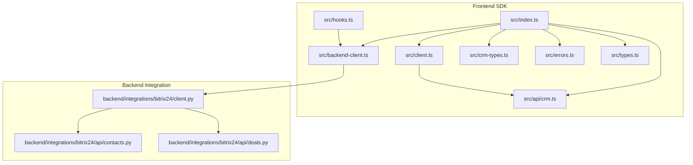
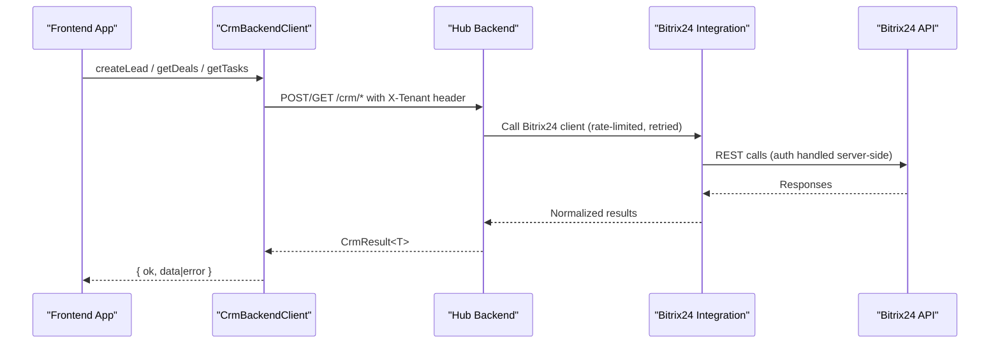
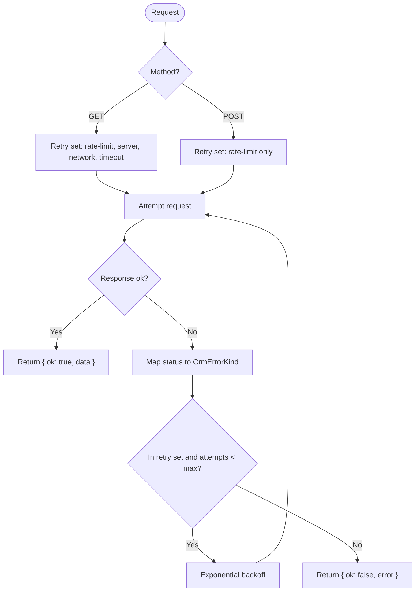
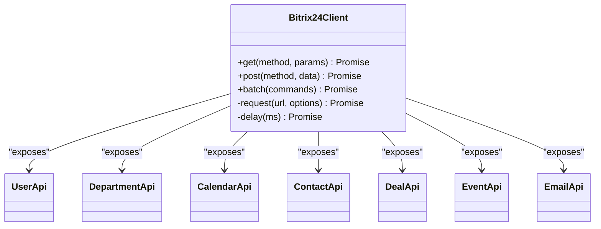
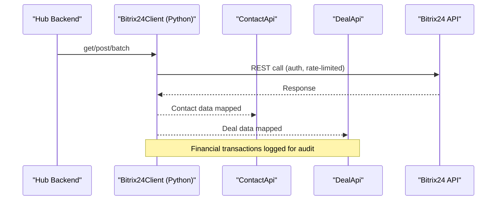
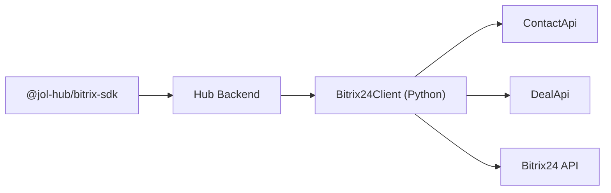

# Bitrix SDK Package

<cite>
**Referenced Files in This Document**
- [package.json](file://frontend/packages/bitrix-sdk/package.json)
- [index.ts](file://frontend/packages/bitrix-sdk/src/index.ts)
- [client.ts](file://frontend/packages/bitrix-sdk/src/client.ts)
- [backend-client.ts](file://frontend/packages/bitrix-sdk/src/backend-client.ts)
- [crm-types.ts](file://frontend/packages/bitrix-sdk/src/crm-types.ts)
- [errors.ts](file://frontend/packages/bitrix-sdk/src/errors.ts)
- [types.ts](file://frontend/packages/bitrix-sdk/src/types.ts)
- [hooks.ts](file://frontend/packages/bitrix-sdk/src/hooks.ts)
- [crm.ts](file://frontend/packages/bitrix-sdk/src/api/crm.ts)
- [client.py](file://backend/integrations/bitrix24/client.py)
- [contacts.py](file://backend/integrations/bitrix24/api/contacts.py)
- [deals.py](file://backend/integrations/bitrix24/api/deals.py)
</cite>

## Table of Contents
1. [Introduction](#introduction)
2. [Project Structure](#project-structure)
3. [Core Components](#core-components)
4. [Architecture Overview](#architecture-overview)
5. [Detailed Component Analysis](#detailed-component-analysis)
6. [Dependency Analysis](#dependency-analysis)
7. [Performance Considerations](#performance-considerations)
8. [Troubleshooting Guide](#troubleshooting-guide)
9. [Conclusion](#conclusion)
10. [Appendices](#appendices)

## Introduction
This document describes the Bitrix CRM SDK package that enables frontend integration with Bitrix24 through a secure, hub-backed architecture. The frontend never holds or sends Bitrix24 tokens directly; instead, it calls a backend-proxied CRM client which manages authentication, rate limiting, retries, and compliance logging before interacting with Bitrix24.

Key capabilities covered:
- Contact management (CRUD, upsert by email)
- Deal tracking (create, update, stage transitions, donation deals)
- Lead creation and lifecycle types
- Communication workflow APIs (tasks and activities)
- Authentication via hub backend (no frontend tokens)
- Request/response handling and error taxonomy
- Examples for fetching contacts, creating deals, and syncing data
- Rate limiting, caching strategies, and offline support considerations
- Security and privacy guidance for frontend access to CRM data

## Project Structure
The SDK is a TypeScript package exposing both legacy direct Bitrix24 client classes (for server-side tooling only) and a preferred hub-backed CRM client for frontend use. It also provides React hooks for data fetching and mutations.

**Diagram sources**
- [index.ts:1-100](file://frontend/packages/bitrix-sdk/src/index.ts#L1-L100)
- [backend-client.ts:1-262](file://frontend/packages/bitrix-sdk/src/backend-client.ts#L1-L262)
- [client.ts:1-197](file://frontend/packages/bitrix-sdk/src/client.ts#L1-L197)
- [crm-types.ts:1-146](file://frontend/packages/bitrix-sdk/src/crm-types.ts#L1-L146)
- [errors.ts:1-75](file://frontend/packages/bitrix-sdk/src/errors.ts#L1-L75)
- [types.ts:1-89](file://frontend/packages/bitrix-sdk/src/types.ts#L1-L89)
- [hooks.ts:1-208](file://frontend/packages/bitrix-sdk/src/hooks.ts#L1-L208)
- [crm.ts:1-337](file://frontend/packages/bitrix-sdk/src/api/crm.ts#L1-L337)
- [client.py:1-403](file://backend/integrations/bitrix24/client.py#L1-L403)
- [contacts.py:1-290](file://backend/integrations/bitrix24/api/contacts.py#L1-L290)
- [deals.py:1-386](file://backend/integrations/bitrix24/api/deals.py#L1-L386)

**Section sources**
- [package.json:1-50](file://frontend/packages/bitrix-sdk/package.json#L1-L50)
- [index.ts:1-100](file://frontend/packages/bitrix-sdk/src/index.ts#L1-L100)

## Core Components
- Hub-backed CRM client: A frontend-safe client that calls the hub backend’s CRM endpoints, enforces tenant scoping, and returns typed results with an error taxonomy.
- Legacy Bitrix24 client: A direct Bitrix24 REST client with retry, timeout, and batch support. Intended for server-side tooling only; not used from browser bundles.
- CRM domain types: Tenant-scoped models for leads, contacts, deals, tasks, and activities, plus webhook payload shapes.
- Error classes: Typed errors for API failures, auth issues, timeouts, and rate limits.
- React hooks: Data fetching and mutation hooks for leads, deals, tasks, and activities with optional polling and in-memory caching.
- CRM API wrappers: Type-safe wrappers around Bitrix24 contact and deal endpoints, including donation deal creation helpers.

**Section sources**
- [backend-client.ts:1-262](file://frontend/packages/bitrix-sdk/src/backend-client.ts#L1-L262)
- [client.ts:1-197](file://frontend/packages/bitrix-sdk/src/client.ts#L1-L197)
- [crm-types.ts:1-146](file://frontend/packages/bitrix-sdk/src/crm-types.ts#L1-L146)
- [errors.ts:1-75](file://frontend/packages/bitrix-sdk/src/errors.ts#L1-L75)
- [hooks.ts:1-208](file://frontend/packages/bitrix-sdk/src/hooks.ts#L1-L208)
- [crm.ts:1-337](file://frontend/packages/bitrix-sdk/src/api/crm.ts#L1-L337)

## Architecture Overview
The recommended flow is frontend → hub backend → Bitrix24 integration → Bitrix24 API. Tokens and sensitive configuration remain on the backend. The frontend uses typed requests and receives standardized results.

**Diagram sources**
- [backend-client.ts:116-162](file://frontend/packages/bitrix-sdk/src/backend-client.ts#L116-L162)
- [client.py:168-202](file://backend/integrations/bitrix24/client.py#L168-L202)
- [crm-types.ts:1-146](file://frontend/packages/bitrix-sdk/src/crm-types.ts#L1-L146)

## Detailed Component Analysis

### Hub-backed CRM Client (preferred for frontend)
Responsibilities:
- Exposes typed methods for leads, contacts, deals, tasks, and activities.
- Enforces tenant isolation via headers.
- Implements idempotent GET retries and safe mutation retry policy.
- Maps HTTP status codes to a stable error taxonomy consumed by UI.

Key behaviors:
- Idempotent GETs retry on rate-limit, server, network, and timeout.
- Mutations retry only on 429 to avoid duplicates.
- Timeouts and network errors are surfaced with retryable flags.
- Human-safe messages prevent leaking internals.

**Diagram sources**
- [backend-client.ts:168-192](file://frontend/packages/bitrix-sdk/src/backend-client.ts#L168-L192)
- [backend-client.ts:194-243](file://frontend/packages/bitrix-sdk/src/backend-client.ts#L194-L243)

**Section sources**
- [backend-client.ts:1-262](file://frontend/packages/bitrix-sdk/src/backend-client.ts#L1-L262)

### Legacy Bitrix24 Client (server-side only)
Responsibilities:
- Direct REST client for Bitrix24 with GET/POST/batch.
- Built-in timeout, retry, and error classification.
- Batch endpoint support for multiple operations.

Notes:
- Must not be used from browser bundles due to token exposure.
- Useful for server-side tooling and scripts.

**Diagram sources**
- [client.ts:25-58](file://frontend/packages/bitrix-sdk/src/client.ts#L25-L58)
- [client.ts:60-116](file://frontend/packages/bitrix-sdk/src/client.ts#L60-L116)
- [client.ts:118-197](file://frontend/packages/bitrix-sdk/src/client.ts#L118-L197)

**Section sources**
- [client.ts:1-197](file://frontend/packages/bitrix-sdk/src/client.ts#L1-L197)

### CRM Domain Types
Defines tenant-scoped entities and payloads:
- Leads, contacts, deals, tasks, activities
- UTM attribution capture
- Webhook envelope shape for backend processing

These types ensure consistent contracts between frontend and backend and keep Bitrix24-specific fields out of the frontend surface.

**Section sources**
- [crm-types.ts:1-146](file://frontend/packages/bitrix-sdk/src/crm-types.ts#L1-L146)

### Error Handling
- Frontend SDK errors: Stable taxonomy with retryable flags and human-safe messages.
- Legacy client errors: Specific classes for API, auth, timeout, and rate limit conditions.

Use these to drive user feedback and retry behavior consistently.

**Section sources**
- [backend-client.ts:39-88](file://frontend/packages/bitrix-sdk/src/backend-client.ts#L39-L88)
- [errors.ts:1-75](file://frontend/packages/bitrix-sdk/src/errors.ts#L1-L75)

### React Hooks for CRM
Provides:
- Query state management with loading, error, and reload
- Polling support for webhook-driven freshness
- In-memory lead cache keyed by tenant and id
- Mutation hook for creating leads

Hooks resolve a registered CrmBackendClient or accept one explicitly.

**Section sources**
- [hooks.ts:1-208](file://frontend/packages/bitrix-sdk/src/hooks.ts#L1-L208)

### CRM API Wrappers (Legacy Surface)
Wraps Bitrix24 contact and deal endpoints:
- Contact CRUD, find by email, upsert by email
- Deal CRUD, move to stage, create donation deal helper
- Donation categories and payment method enums

These are exposed for completeness but should be used server-side only.

**Section sources**
- [crm.ts:1-337](file://frontend/packages/bitrix-sdk/src/api/crm.ts#L1-L337)

### Backend Integration (Python)
The backend integrates with Bitrix24 using:
- Async client with rate limiting, retries, and batch support
- Typed response and command structures
- Audit logging for GDPR and PCI-DSS compliance
- Dedicated Contact and Deal APIs with custom field mapping and financial transaction logging

**Diagram sources**
- [client.py:91-167](file://backend/integrations/bitrix24/client.py#L91-L167)
- [client.py:168-245](file://backend/integrations/bitrix24/client.py#L168-L245)
- [contacts.py:138-290](file://backend/integrations/bitrix24/api/contacts.py#L138-L290)
- [deals.py:149-386](file://backend/integrations/bitrix24/api/deals.py#L149-L386)

**Section sources**
- [client.py:1-403](file://backend/integrations/bitrix24/client.py#L1-L403)
- [contacts.py:1-290](file://backend/integrations/bitrix24/api/contacts.py#L1-L290)
- [deals.py:1-386](file://backend/integrations/bitrix24/api/deals.py#L1-L386)

## Dependency Analysis
- Frontend SDK depends on:
  - Zod for validation (optional runtime dependency)
  - React peer dependency for hooks
- Backend integration depends on:
  - httpx for async HTTP
  - Django settings for credentials
- Coupling:
  - Frontend SDK is decoupled from Bitrix24 details via the hub backend contract.
  - Backend encapsulates Bitrix24 specifics and exposes typed modules.

**Diagram sources**
- [package.json:1-50](file://frontend/packages/bitrix-sdk/package.json#L1-L50)
- [client.py:91-167](file://backend/integrations/bitrix24/client.py#L91-L167)

**Section sources**
- [package.json:1-50](file://frontend/packages/bitrix-sdk/package.json#L1-L50)
- [client.py:1-403](file://backend/integrations/bitrix24/client.py#L1-L403)

## Performance Considerations
- Rate limiting:
  - Backend enforces ~2 req/s per token and honors Retry-After on 429.
  - Frontend SDK responds to 429 with exponential backoff and does not reissue mutations blindly.
- Retries:
  - GETs: full retry budget for transient failures.
  - POSTs: limited to 429 to prevent duplicate side effects.
- Timeouts:
  - Configurable per client; AbortController used to enforce deadlines.
- Caching:
  - In-memory lead cache in hooks reduces redundant fetches.
  - Consider adding response-level caching for list endpoints if needed.
- Offline support:
  - No built-in offline queue; consider queuing mutations locally and replaying when connectivity resumes.

[No sources needed since this section provides general guidance]

## Troubleshooting Guide
Common issues and resolutions:
- Auth rotation (401):
  - Indicates backend rotating Bitrix24 credentials. UI should show temporary unavailability and auto-retry once.
- Rate limit (429):
  - Respect Retry-After and backoff. Avoid rapid bursts; rely on backend rate limiter.
- Validation errors (4xx):
  - Do not retry; fix input or tenant context.
- Server errors (5xx):
  - Retry with backoff for GETs; surface to caller for POSTs.
- Network/timeout:
  - Increase timeout or investigate connectivity; treat as retryable for GETs.

Operational tips:
- Use the error taxonomy to drive user-facing messages without leaking internals.
- Log and monitor retry counts and failure kinds for observability.

**Section sources**
- [backend-client.ts:39-88](file://frontend/packages/bitrix-sdk/src/backend-client.ts#L39-L88)
- [backend-client.ts:245-260](file://frontend/packages/bitrix-sdk/src/backend-client.ts#L245-L260)
- [errors.ts:1-75](file://frontend/packages/bitrix-sdk/src/errors.ts#L1-L75)

## Conclusion
The Bitrix SDK package provides a secure, type-safe, and maintainable way to integrate frontends with Bitrix24 via a hub backend. It abstracts authentication, rate limiting, retries, and compliance while offering clear APIs for contacts, deals, leads, tasks, and activities. Adopt the hub-backed client for all frontend code paths and leverage the provided hooks for efficient data fetching and mutations.

[No sources needed since this section summarizes without analyzing specific files]

## Appendices

### Authentication Methods
- Preferred path: Frontend calls hub backend; no Bitrix24 tokens in the browser.
- Legacy path: Direct Bitrix24 client requires an access token; intended for server-side tooling only.

**Section sources**
- [index.ts:1-100](file://frontend/packages/bitrix-sdk/src/index.ts#L1-L100)
- [client.ts:1-197](file://frontend/packages/bitrix-sdk/src/client.ts#L1-L197)

### Request/Response Handling
- Frontend SDK returns a unified result type with success or error.
- Legacy client wraps responses in standard Bitrix24 response shapes and supports batch operations.

**Section sources**
- [backend-client.ts:168-243](file://frontend/packages/bitrix-sdk/src/backend-client.ts#L168-L243)
- [types.ts:36-89](file://frontend/packages/bitrix-sdk/src/types.ts#L36-L89)
- [client.ts:93-116](file://frontend/packages/bitrix-sdk/src/client.ts#L93-L116)

### Examples

- Fetch contacts via backend:
  - Use CrmBackendClient.getContact(tenantSlug, id) and handle CrmResult<Contact>.
  - Reference: [backend-client.ts:131-134](file://frontend/packages/bitrix-sdk/src/backend-client.ts#L131-L134)

- Create a deal (donation) via backend:
  - Use backend endpoints to create deals; backend maps to Bitrix24 deal creation and logs financial transactions.
  - Reference: [deals.py:247-295](file://backend/integrations/bitrix24/api/deals.py#L247-L295)

- Sync data with Bitrix24:
  - Frontend triggers actions via hub backend; backend performs Bitrix24 calls with rate limiting and retries.
  - Reference: [client.py:168-245](file://backend/integrations/bitrix24/client.py#L168-L245)

### Rate Limiting and Caching Strategies
- Backend rate limiter enforces per-token throughput and respects Retry-After.
- Frontend SDK applies exponential backoff for GETs and limited retries for POSTs.
- Hooks include in-memory caching for leads; extend caching for lists if needed.

**Section sources**
- [client.py:323-336](file://backend/integrations/bitrix24/client.py#L323-L336)
- [backend-client.ts:168-192](file://frontend/packages/bitrix-sdk/src/backend-client.ts#L168-L192)
- [hooks.ts:116-134](file://frontend/packages/bitrix-sdk/src/hooks.ts#L116-L134)

### Offline Support
- Not built-in; implement local queues for mutations and reconcile when online.
- Ensure idempotency keys where applicable to avoid duplicates on replay.

[No sources needed since this section provides general guidance]

### Security and Privacy Compliance
- Frontend never holds Bitrix24 tokens; all auth happens server-side.
- Tenant isolation enforced via headers and backend RLS.
- Audit logging for data operations and financial transactions (GDPR/PCI-DSS).
- Human-safe error messages prevent leaking internals or credentials.

**Section sources**
- [crm-types.ts:1-12](file://frontend/packages/bitrix-sdk/src/crm-types.ts#L1-L12)
- [backend-client.ts:1-27](file://frontend/packages/bitrix-sdk/src/backend-client.ts#L1-L27)
- [contacts.py:197-203](file://backend/integrations/bitrix24/api/contacts.py#L197-L203)
- [deals.py:276-289](file://backend/integrations/bitrix24/api/deals.py#L276-L289)