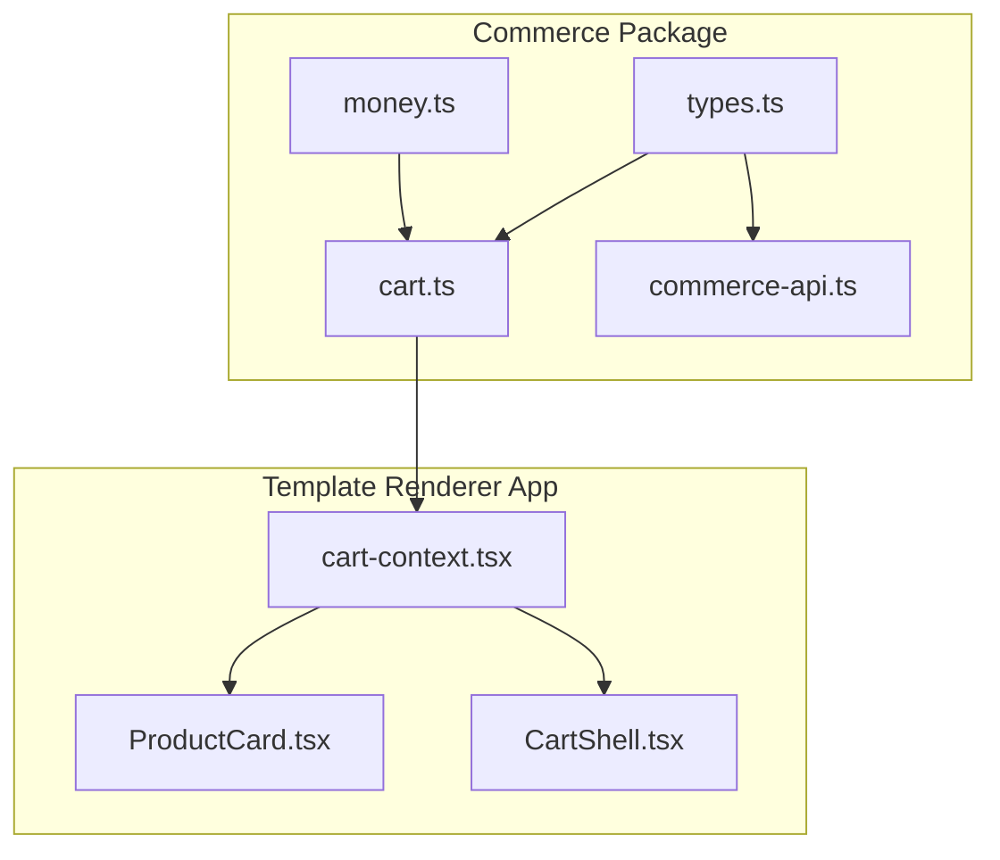
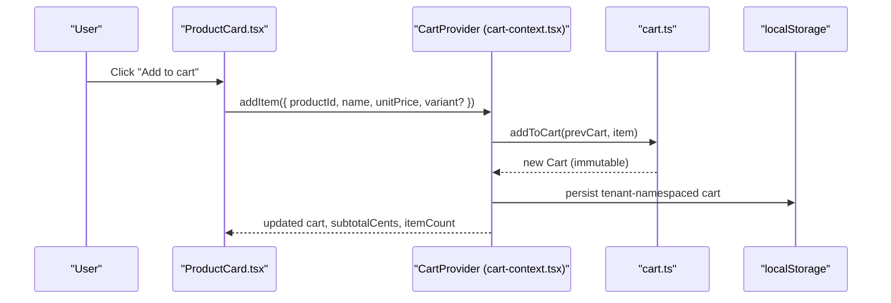
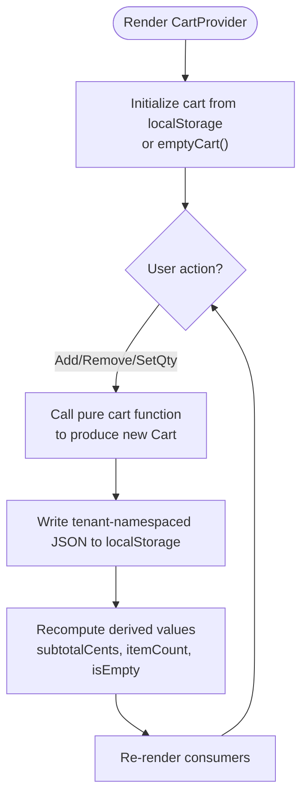
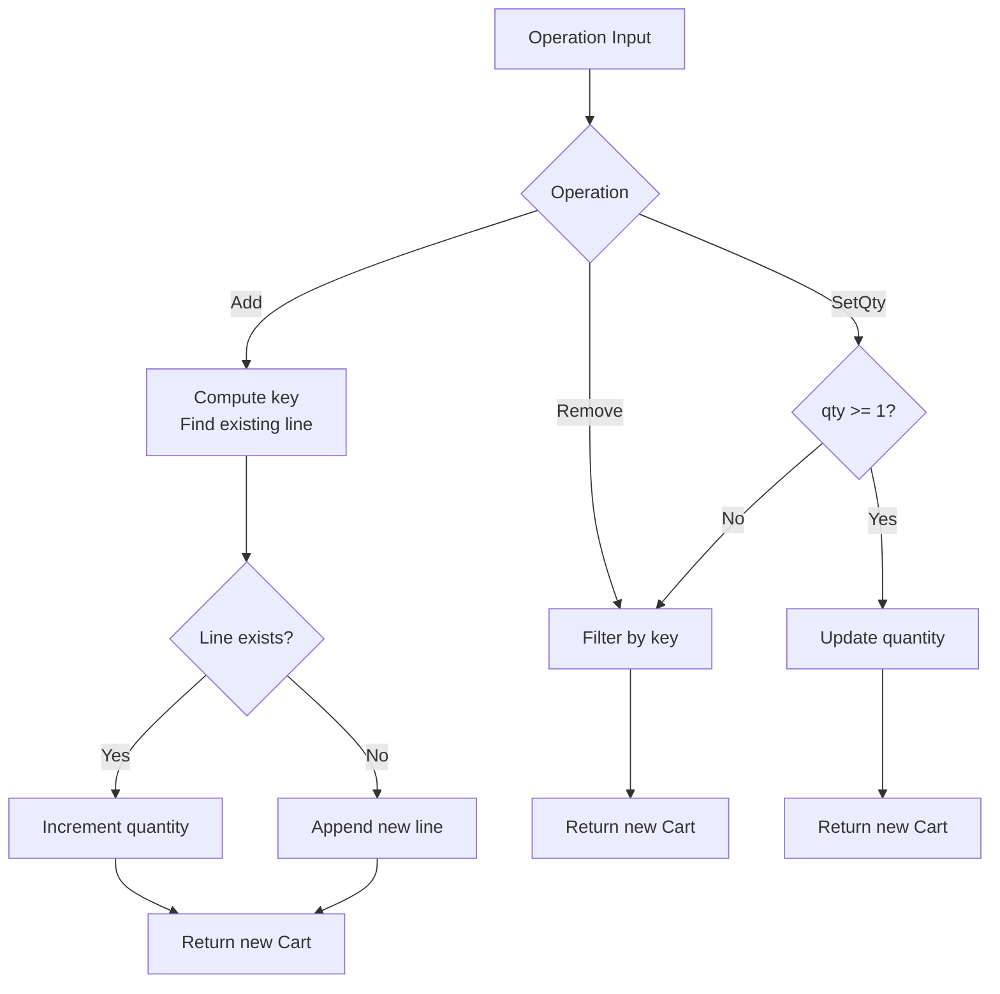
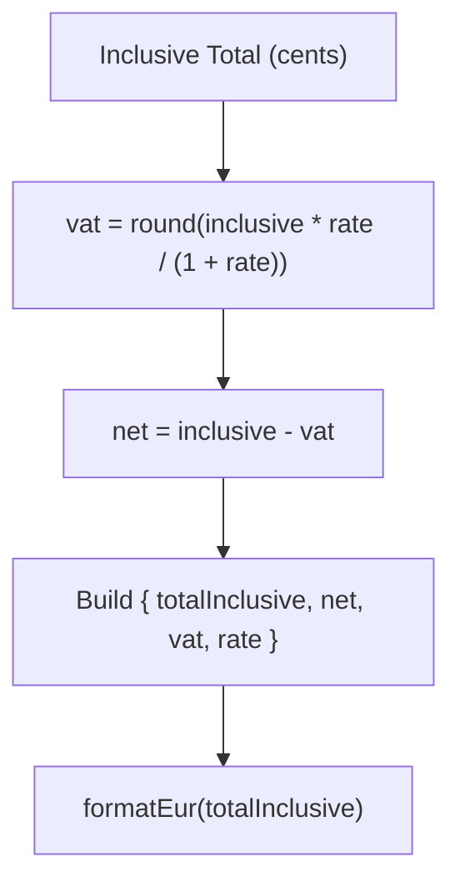
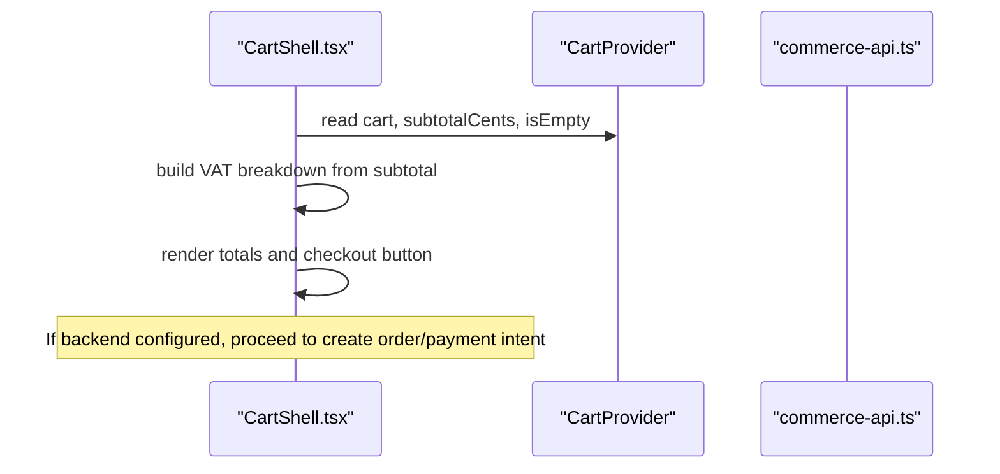
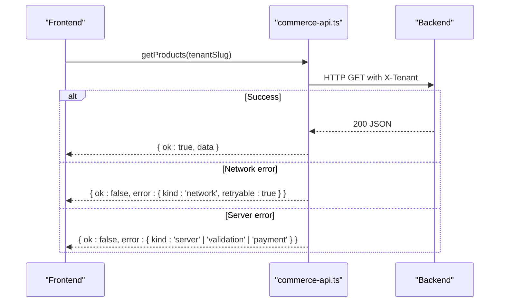
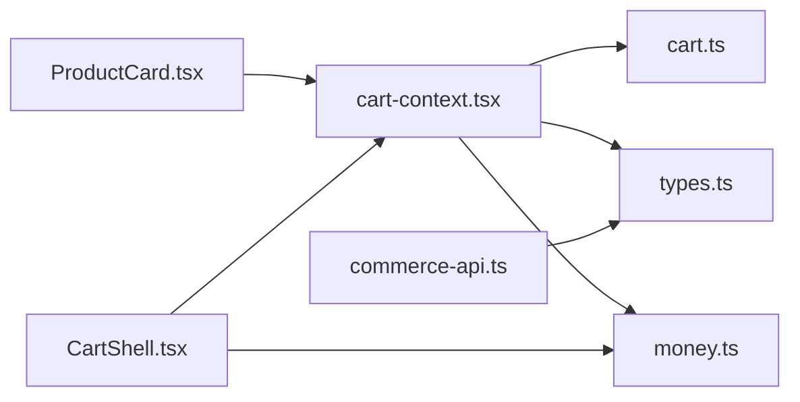

# Cart Management

<cite>
**Referenced Files in This Document**
- [cart.ts](file://frontend/packages/commerce/src/cart.ts)
- [types.ts](file://frontend/packages/commerce/src/types.ts)
- [money.ts](file://frontend/packages/commerce/src/money.ts)
- [commerce-api.ts](file://frontend/packages/commerce/src/commerce-api.ts)
- [cart-context.tsx](file://frontend/apps/template-renderer/src/components/commerce/cart-context.tsx)
- [ProductCard.tsx](file://frontend/apps/template-renderer/src/components/commerce/ProductCard.tsx)
- [CartShell.tsx](file://frontend/apps/template-renderer/src/components/commerce/CartShell.tsx)
- [hooks.test.tsx](file://frontend/apps/template-renderer/src/__tests__/vitest/hooks.test.tsx)
- [commerce.test.ts](file://frontend/packages/commerce/src/__tests__/commerce.test.ts)
- [tokenStore.ts](file://frontend/react/src/lib/tokenStore.ts)
- [cookie-consent-storage.ts](file://frontend/packages/ui/src/components/cookie-consent-storage.ts)
- [use-cookie-consent.ts](file://frontend/packages/i18n/src/hooks/use-cookie-consent.ts)
- [cookie-consent-banner.tsx](file://frontend/packages/i18n/src/components/cookie-consent-banner.tsx)
- [receive_payment_event (views.py)](file://backend/django/apps/payment_events/views.py)
</cite>

## Table of Contents
1. Introduction
2. Project Structure
3. Core Components
4. Architecture Overview
5. Detailed Component Analysis
6. Dependency Analysis
7. Performance Considerations
8. Troubleshooting Guide
9. Conclusion

## Introduction
This document explains the cart management functionality implemented across the frontend packages and apps. It covers the cart context, state management, and operations such as adding items, updating quantities, and removing products. It also documents persistence strategies using tenant-namespaced local storage, session handling considerations, and how to integrate with checkout flows. Validation rules, inventory checks, price calculations, and performance optimizations for large carts and real-time updates are addressed.

## Project Structure
The cart system is split into:
- Pure cart logic and types in a shared commerce package
- A React context provider that binds state and persistence
- UI components that interact with the cart and display totals
- An API client for future backend integration
- Tests validating behavior and persistence isolation

**Diagram sources**
- [cart.ts:1-84](file://frontend/packages/commerce/src/cart.ts#L1-L84)
- [types.ts:1-152](file://frontend/packages/commerce/src/types.ts#L1-L152)
- [money.ts:1-60](file://frontend/packages/commerce/src/money.ts#L1-L60)
- [commerce-api.ts:1-203](file://frontend/packages/commerce/src/commerce-api.ts#L1-L203)
- [cart-context.tsx:1-127](file://frontend/apps/template-renderer/src/components/commerce/cart-context.tsx#L1-L127)
- [ProductCard.tsx:1-39](file://frontend/apps/template-renderer/src/components/commerce/ProductCard.tsx#L1-L39)
- [CartShell.tsx:112-147](file://frontend/apps/template-renderer/src/components/commerce/CartShell.tsx#L112-L147)

**Section sources**
- [cart.ts:1-84](file://frontend/packages/commerce/src/cart.ts#L1-L84)
- [cart-context.tsx:1-127](file://frontend/apps/template-renderer/src/components/commerce/cart-context.tsx#L1-L127)
- [types.ts:1-152](file://frontend/packages/commerce/src/types.ts#L1-L152)
- [money.ts:1-60](file://frontend/packages/commerce/src/money.ts#L1-L60)
- [commerce-api.ts:1-203](file://frontend/packages/commerce/src/commerce-api.ts#L1-L203)

## Core Components
- Cart logic (pure functions): add, remove, set quantity, subtotal, unit count, emptiness check. All amounts are VAT-inclusive cents; no side effects.
- Types: product, cart item, order, stock status, etc., with PCI/GDPR notes and currency constraints.
- Money helpers: EUR formatting, line totals, VAT extraction, breakdowns.
- Commerce API client: graceful unconfigured mode, retry policy for GETs, error taxonomy, tenant scoping via headers.
- React cart context: in-memory state, localStorage persistence scoped by tenant slug, derived values (subtotal, itemCount, isEmpty), drawer open/close state.
- UI components: ProductCard integrates add-to-cart; CartShell displays totals, VAT breakdown, and checkout button gating.

**Section sources**
- [cart.ts:1-84](file://frontend/packages/commerce/src/cart.ts#L1-L84)
- [types.ts:1-152](file://frontend/packages/commerce/src/types.ts#L1-L152)
- [money.ts:1-60](file://frontend/packages/commerce/src/money.ts#L1-L60)
- [commerce-api.ts:1-203](file://frontend/packages/commerce/src/commerce-api.ts#L1-L203)
- [cart-context.tsx:1-127](file://frontend/apps/template-renderer/src/components/commerce/cart-context.tsx#L1-L127)
- [ProductCard.tsx:1-39](file://frontend/apps/template-renderer/src/components/commerce/ProductCard.tsx#L1-L39)
- [CartShell.tsx:112-147](file://frontend/apps/template-renderer/src/components/commerce/CartShell.tsx#L112-L147)

## Architecture Overview
The cart architecture separates pure business logic from UI and persistence:
- Pure layer: cart.ts and money.ts compute immutable results from inputs.
- State layer: cart-context.tsx manages React state and persists to tenant-scoped localStorage.
- Integration layer: commerce-api.ts provides a typed client for future backend calls with retries and error classification.
- UI layer: ProductCard and CartShell consume the cart context to render and trigger actions.

**Diagram sources**
- [ProductCard.tsx:1-39](file://frontend/apps/template-renderer/src/components/commerce/ProductCard.tsx#L1-L39)
- [cart-context.tsx:57-116](file://frontend/apps/template-renderer/src/components/commerce/cart-context.tsx#L57-L116)
- [cart.ts:22-44](file://frontend/packages/commerce/src/cart.ts#L22-L44)

## Detailed Component Analysis

### Cart Context and State Management
- Provides cart state, operations (addItem, removeItem, setQuantity, clear), computed values (subtotalCents, itemCount, isEmpty), and drawer visibility.
- Persists cart under a tenant-namespaced key to isolate data per tenant.
- Initializes from localStorage when available; falls back gracefully if storage is unavailable or corrupted.

**Diagram sources**
- [cart-context.tsx:57-116](file://frontend/apps/template-renderer/src/components/commerce/cart-context.tsx#L57-L116)
- [cart.ts:13-84](file://frontend/packages/commerce/src/cart.ts#L13-L84)

**Section sources**
- [cart-context.tsx:1-127](file://frontend/apps/template-renderer/src/components/commerce/cart-context.tsx#L1-L127)
- [cart.ts:13-84](file://frontend/packages/commerce/src/cart.ts#L13-L84)

### Cart Operations (Pure Logic)
- Add item: increments quantity if line exists; otherwise appends new line.
- Remove item: filters out matching line by product id and optional variant.
- Set quantity: removes line if quantity < 1; otherwise updates quantity.
- Subtotal: sums line totals (unitPrice * quantity) in cents.
- Unit count: sum of all quantities.
- Emptiness: true when no lines exist.

**Diagram sources**
- [cart.ts:22-63](file://frontend/packages/commerce/src/cart.ts#L22-L63)

**Section sources**
- [cart.ts:22-84](file://frontend/packages/commerce/src/cart.ts#L22-L84)

### Price Calculations and VAT Breakdown
- All prices are VAT-inclusive cents.
- Line totals multiply unit price by quantity.
- VAT extraction uses standard rate; net and vat portions derive from inclusive total.
- Formatting produces locale-aware EUR strings.

**Diagram sources**
- [money.ts:17-60](file://frontend/packages/commerce/src/money.ts#L17-L60)

**Section sources**
- [money.ts:1-60](file://frontend/packages/commerce/src/money.ts#L1-L60)

### Persistence Strategy and Tenant Isolation
- Uses localStorage with a prefix and tenant slug to ensure isolation between tenants.
- On every change, writes the current cart state; on initialization, reads and validates structure.
- Gracefully handles storage errors (e.g., private browsing) by keeping an in-memory cart.

**Section sources**
- [cart-context.tsx:57-81](file://frontend/apps/template-renderer/src/components/commerce/cart-context.tsx#L57-L81)
- [hooks.test.tsx:70-123](file://frontend/apps/template-renderer/src/__tests__/vitest/hooks.test.tsx#L70-L123)

### Session Handling and Cross-Device Synchronization
- Current implementation stores cart in browser localStorage scoped by tenant slug.
- No server-side cart store or cross-device sync is present in this codebase.
- For cross-device synchronization, a backend cart service would be required; until then, carts remain device-bound.

[No sources needed since this section synthesizes current behavior and limitations]

### Checkout Flow Integration
- CartShell computes VAT breakdown and renders subtotal and checkout button.
- Checkout readiness can be gated; when not ready, a message indicates payments pending.
- The commerce API client supports future integration with a backend for order creation and payment intents.

**Diagram sources**
- [CartShell.tsx:112-147](file://frontend/apps/template-renderer/src/components/commerce/CartShell.tsx#L112-L147)
- [commerce-api.ts:54-84](file://frontend/packages/commerce/src/commerce-api.ts#L54-L84)

**Section sources**
- [CartShell.tsx:112-147](file://frontend/apps/template-renderer/src/components/commerce/CartShell.tsx#L112-L147)
- [commerce-api.ts:1-203](file://frontend/packages/commerce/src/commerce-api.ts#L1-L203)

### Inventory Checks and Validation Rules
- Product stock status is modeled and surfaced in UI badges.
- Adding items does not enforce stock limits in the cart logic; validation should occur at product selection or checkout time based on stock.kind.
- Payment configuration validation exists in scripts to ensure online store settings are correct.

**Section sources**
- [ProductCard.tsx:28-39](file://frontend/apps/template-renderer/src/components/commerce/ProductCard.tsx#L28-L39)
- [types.ts:49-53](file://frontend/packages/commerce/src/types.ts#L49-L53)
- [validate_entity_configs.py:246-267](file://scripts/validate_entity_configs.py#L246-L267)

### Error Handling and Backend Integration
- The commerce API client returns structured results with error kinds (unconfigured, network, validation, payment, server).
- GET requests retry with exponential backoff; mutations do not auto-retry to avoid duplicates.
- Payment events receiver enforces signature verification, timestamp windows, and idempotency.

**Diagram sources**
- [commerce-api.ts:90-134](file://frontend/packages/commerce/src/commerce-api.ts#L90-L134)
- [receive_payment_event (views.py):79-143](file://backend/django/apps/payment_events/views.py#L79-L143)

**Section sources**
- [commerce-api.ts:29-84](file://frontend/packages/commerce/src/commerce-api.ts#L29-L84)
- [receive_payment_event (views.py):79-143](file://backend/django/apps/payment_events/views.py#L79-L143)

## Dependency Analysis
- cart-context depends on @jol-hub/commerce (cart, types, money) and useTenant for isolation.
- ProductCard consumes useCart to add items and formats prices via commerce utilities.
- CartShell uses money helpers to show VAT breakdown and controls checkout readiness.
- commerce-api depends on environment configuration and adds tenant scoping headers.

**Diagram sources**
- [cart-context.tsx:1-127](file://frontend/apps/template-renderer/src/components/commerce/cart-context.tsx#L1-L127)
- [cart.ts:1-84](file://frontend/packages/commerce/src/cart.ts#L1-L84)
- [types.ts:1-152](file://frontend/packages/commerce/src/types.ts#L1-L152)
- [money.ts:1-60](file://frontend/packages/commerce/src/money.ts#L1-L60)
- [ProductCard.tsx:1-39](file://frontend/apps/template-renderer/src/components/commerce/ProductCard.tsx#L1-L39)
- [CartShell.tsx:112-147](file://frontend/apps/template-renderer/src/components/commerce/CartShell.tsx#L112-L147)
- [commerce-api.ts:1-203](file://frontend/packages/commerce/src/commerce-api.ts#L1-L203)

**Section sources**
- [cart-context.tsx:1-127](file://frontend/apps/template-renderer/src/components/commerce/cart-context.tsx#L1-L127)
- [commerce-api.ts:1-203](file://frontend/packages/commerce/src/commerce-api.ts#L1-L203)

## Performance Considerations
- Large carts:
  - Keep cart operations pure and minimal; avoid unnecessary re-renders by memoizing derived values in the context.
  - Debounce rapid quantity changes if integrating with analytics or external services.
- Real-time updates:
  - Currently, persistence is synchronous to localStorage; consider background sync or optimistic UI patterns if connecting to a backend later.
  - Use event-driven updates sparingly to prevent excessive writes.
- Memory and storage:
  - Validate stored cart shape on load to avoid corruption.
  - Clear cart after successful checkout to free memory and storage.

[No sources needed since this section provides general guidance]

## Troubleshooting Guide
- Cart not persisting:
  - Verify tenant slug resolution and localStorage availability; private browsing may block writes.
  - Check that the storage key includes the tenant slug and matches expected format.
- Incorrect totals:
  - Ensure unitPrice is in cents and VAT-inclusive; use money helpers for formatting and breakdowns.
- Checkout disabled:
  - Confirm checkout readiness flags and backend configuration; the API client returns unconfigured when COMMERCE_API_URL is unset.
- Payment events:
  - Ensure signatures and timestamps are valid; misconfiguration leads to receiver_unconfigured responses.

**Section sources**
- [cart-context.tsx:61-81](file://frontend/apps/template-renderer/src/components/commerce/cart-context.tsx#L61-L81)
- [commerce-api.ts:54-84](file://frontend/packages/commerce/src/commerce-api.ts#L54-L84)
- [receive_payment_event (views.py):79-143](file://backend/django/apps/payment_events/views.py#L79-L143)

## Conclusion
The cart system cleanly separates pure logic, state management, and UI concerns. It provides robust, tenant-isolated persistence and accurate VAT-inclusive pricing. While cross-device synchronization is not yet implemented, the architecture allows straightforward extension to a backend-backed cart service. Validation and error handling are in place for both UI interactions and future backend integrations.