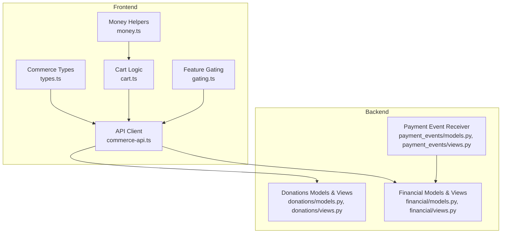
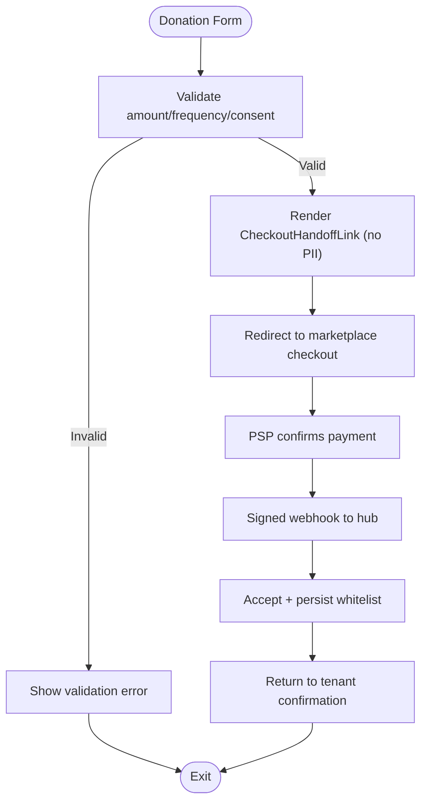
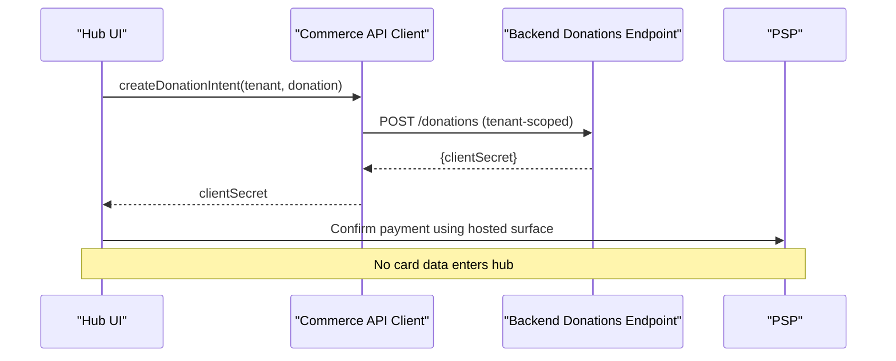
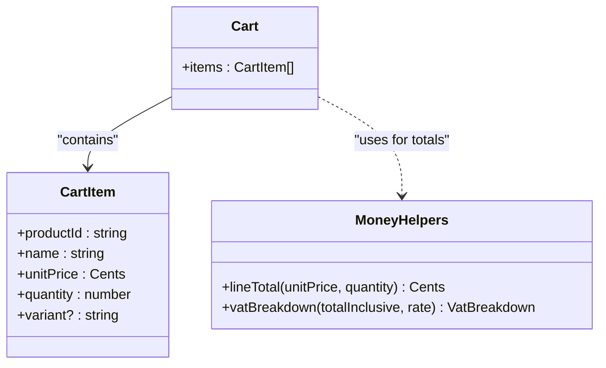
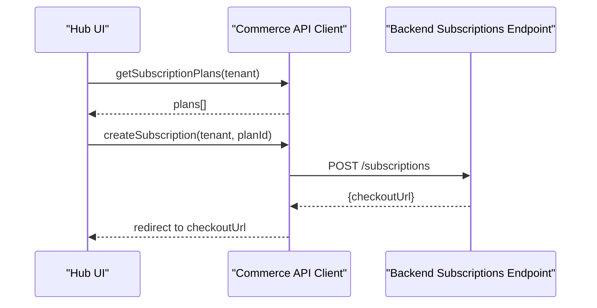
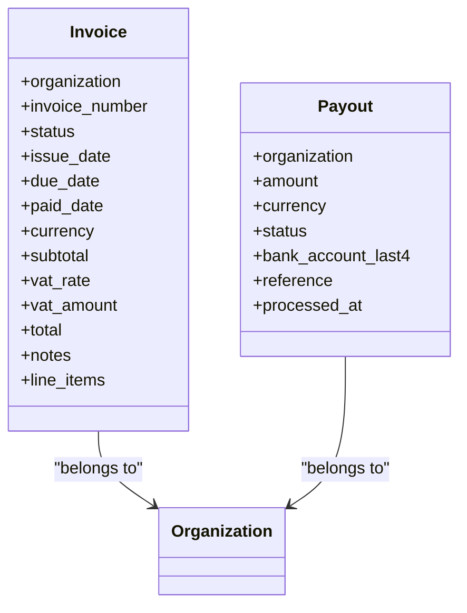
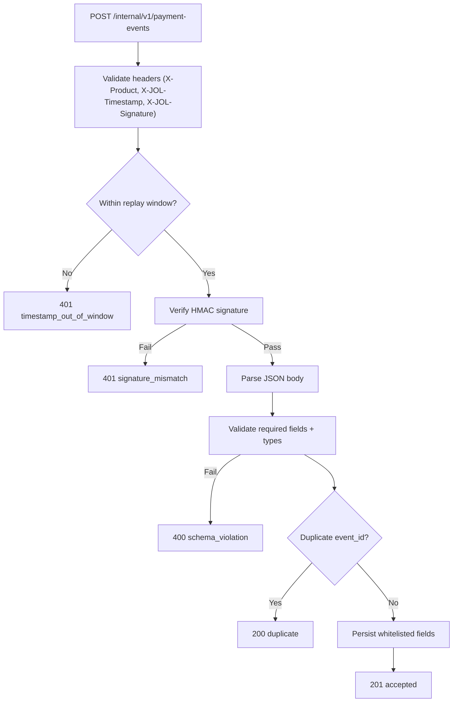
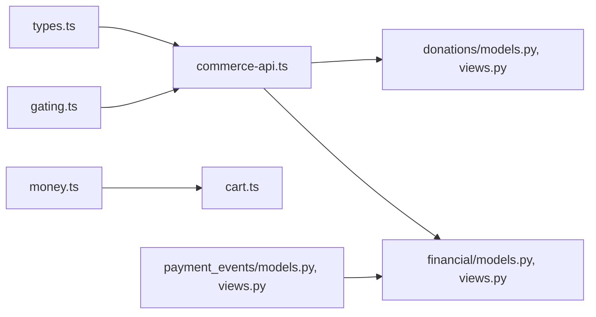

# Commerce Package

<cite>
**Referenced Files in This Document**
- [index.ts](file://frontend/packages/commerce/src/index.ts)
- [types.ts](file://frontend/packages/commerce/src/types.ts)
- [cart.ts](file://frontend/packages/commerce/src/cart.ts)
- [commerce-api.ts](file://frontend/packages/commerce/src/commerce-api.ts)
- [money.ts](file://frontend/packages/commerce/src/money.ts)
- [gating.ts](file://frontend/packages/commerce/src/gating.ts)
- [donation-flow-spec.md](file://docs/commerce/donation-flow-spec.md)
- [models.py (Donations)](file://backend/django/apps/donations/models.py)
- [views.py (Donations)](file://backend/django/apps/donations/views.py)
- [models.py (Financial)](file://backend/django/apps/financial/models.py)
- [views.py (Financial)](file://backend/django/apps/financial/views.py)
- [models.py (Payment Events)](file://backend/django/apps/payment_events/models.py)
- [views.py (Payment Events)](file://backend/django/apps/payment_events/views.py)
</cite>

## Table of Contents
1. Introduction
2. Project Structure
3. Core Components
4. Architecture Overview
5. Detailed Component Analysis
6. Dependency Analysis
7. Performance Considerations
8. Troubleshooting Guide
9. Conclusion
10. Appendices

## Introduction
This document provides comprehensive documentation for the commerce package that powers donation processing, payment workflows, and e-commerce functionality across tenants. It covers donation forms and flows, payment integrations via a marketplace-hosted checkout, cart management, subscription handling, financial reporting, PCI-DSS compliance measures, webhook handling for payment confirmations, and error scenarios. The goal is to make the system understandable for both technical and non-technical readers while providing code-level references and diagrams.

## Project Structure
The commerce capability spans two layers:
- Frontend package: framework-agnostic logic for types, money math, cart operations, API client, and feature gating.
- Backend Django apps: donation records, financial invoices/payouts, and a hardened payment event receiver for marketplace webhooks.



**Diagram sources**
- [types.ts:1-152](file://frontend/packages/commerce/src/types.ts#L1-L152)
- [cart.ts:1-84](file://frontend/packages/commerce/src/cart.ts#L1-L84)
- [money.ts:1-61](file://frontend/packages/commerce/src/money.ts#L1-L61)
- [commerce-api.ts:1-203](file://frontend/packages/commerce/src/commerce-api.ts#L1-L203)
- [gating.ts:1-46](file://frontend/packages/commerce/src/gating.ts#L1-L46)
- [models.py (Donations):1-146](file://backend/django/apps/donations/models.py#L1-L146)
- [views.py (Donations):1-176](file://backend/django/apps/donations/views.py#L1-L176)
- [models.py (Financial):1-170](file://backend/django/apps/financial/models.py#L1-L170)
- [views.py (Financial):1-39](file://backend/django/apps/financial/views.py#L1-L39)
- [models.py (Payment Events):1-36](file://backend/django/apps/payment_events/models.py#L1-L36)
- [views.py (Payment Events):1-144](file://backend/django/apps/payment_events/views.py#L1-L144)

**Section sources**
- [index.ts:1-17](file://frontend/packages/commerce/src/index.ts#L1-L17)
- [donation-flow-spec.md:1-65](file://docs/commerce/donation-flow-spec.md#L1-L65)

## Core Components
- Types: Shared domain vocabulary for products, orders, bookings, subscriptions, and donations; amounts are integer EUR cents; tenant scoping via tenantSlug; no cardholder data in types.
- Cart: Pure, immutable operations for adding/removing items, computing line totals and subtotal; VAT breakdown computed at display time.
- Money: Locale-aware EUR formatting, VAT extraction and breakdown using standard rates; ensures consistent monetary representation.
- API Client: Tenant-scoped HTTP client with retry policy for GETs, idempotent mutation handling, and explicit error taxonomy; delegates payment intent creation to backend and never transmits card data.
- Feature Gating: Capability flags for booking, donations, shop, subscriptions based on tenant tier; UI can hide or prompt upgrade accordingly.

Key responsibilities:
- Keep all sensitive payment handling out of the hub (PCI-DSS SAQ A).
- Enforce tenant isolation via X-Tenant header and backend validation.
- Provide robust error classification for UI handling.

**Section sources**
- [types.ts:1-152](file://frontend/packages/commerce/src/types.ts#L1-L152)
- [cart.ts:1-84](file://frontend/packages/commerce/src/cart.ts#L1-L84)
- [money.ts:1-61](file://frontend/packages/commerce/src/money.ts#L1-L61)
- [commerce-api.ts:1-203](file://frontend/packages/commerce/src/commerce-api.ts#L1-L203)
- [gating.ts:1-46](file://frontend/packages/commerce/src/gating.ts#L1-L46)

## Architecture Overview
The donation flow follows a strict boundary:
- Hub renders donation form and handoff link without personal data.
- Marketplace-hosted checkout handles payment confirmation (Stripe).
- Marketplace sends signed webhooks to the hub’s payment event receiver.
- Hub persists only whitelisted fields and correlates by opaque intent ID.
- Financial reporting aggregates from persisted facts; donor identity remains marketplace-side.

```mermaid
sequenceDiagram
participant User as "Donor"
participant HubUI as "Hub UI"
participant Market as "Marketplace Checkout"
participant PSP as "PSP (e.g., Stripe)"
participant HubWebhook as "Hub Payment Events Receiver"
participant DB as "Payment Events Store"
User->>HubUI : Fill donation form (amount, frequency, consent)
HubUI->>Market : Redirect with non-personal context
Market->>PSP : Initiate payment (client secret)
PSP-->>Market : Payment result
Market-->>User : Return to tenant confirmation state
Market->>HubWebhook : POST signed envelope {event_id,type,...}
HubWebhook->>DB : Persist whitelisted fields (idempotent)
Note over HubUI,DB : Hub never stores card data; correlation via opaque intent ID
```

**Diagram sources**
- [donation-flow-spec.md:5-22](file://docs/commerce/donation-flow-spec.md#L5-L22)
- [views.py (Payment Events):79-144](file://backend/django/apps/payment_events/views.py#L79-L144)
- [models.py (Payment Events):6-36](file://backend/django/apps/payment_events/models.py#L6-L36)

**Section sources**
- [donation-flow-spec.md:1-65](file://docs/commerce/donation-flow-spec.md#L1-L65)
- [commerce-api.ts:11-17](file://frontend/packages/commerce/src/commerce-api.ts#L11-L17)
- [views.py (Payment Events):1-144](file://backend/django/apps/payment_events/views.py#L1-L144)

## Detailed Component Analysis

### Donation Flow and Consent
- Handoff UX carries only non-personal context; donor identity is collected at marketplace checkout.
- Explicit consent capture required; purpose-limited and withdrawable.
- Zero personal data crosses the boundary; hub stores pseudonymous facts keyed by opaque intent ID.
- Return states: success, failed, abandoned handled per contract; duplicates tolerated.



**Diagram sources**
- [donation-flow-spec.md:5-22](file://docs/commerce/donation-flow-spec.md#L5-L22)
- [views.py (Payment Events):79-144](file://backend/django/apps/payment_events/views.py#L79-L144)

**Section sources**
- [donation-flow-spec.md:23-43](file://docs/commerce/donation-flow-spec.md#L23-L43)
- [types.ts:136-152](file://frontend/packages/commerce/src/types.ts#L136-L152)

### Payment Intent Creation and PCI-DSS Compliance
- Frontend requests a donation intent from the backend; backend returns an opaque client secret.
- Payments are confirmed against Stripe-hosted surfaces; hub never touches card data.
- Error taxonomy distinguishes network, validation, payment, server errors; retries applied only to idempotent GETs.



**Diagram sources**
- [commerce-api.ts:171-177](file://frontend/packages/commerce/src/commerce-api.ts#L171-L177)
- [views.py (Donations):24-46](file://backend/django/apps/donations/views.py#L24-L46)

**Section sources**
- [commerce-api.ts:1-203](file://frontend/packages/commerce/src/commerce-api.ts#L1-L203)
- [types.ts:1-14](file://frontend/packages/commerce/src/types.ts#L1-L14)

### Cart Management
- Immutable cart operations ensure predictable state transitions.
- Composite keys differentiate product variants.
- Subtotal computed in cents; VAT breakdown derived at display time.



**Diagram sources**
- [cart.ts:1-84](file://frontend/packages/commerce/src/cart.ts#L1-L84)
- [money.ts:1-61](file://frontend/packages/commerce/src/money.ts#L1-L61)
- [types.ts:55-79](file://frontend/packages/commerce/src/types.ts#L55-L79)

**Section sources**
- [cart.ts:1-84](file://frontend/packages/commerce/src/cart.ts#L1-L84)
- [money.ts:1-61](file://frontend/packages/commerce/src/money.ts#L1-L61)

### Subscription Handling
- Plans listed per tenant; subscription creation returns a checkout URL for hosted payment.
- Active subscription retrieval for manager UI.
- No card data handled by hub; compliant with SAQ A.



**Diagram sources**
- [commerce-api.ts:183-202](file://frontend/packages/commerce/src/commerce-api.ts#L183-L202)
- [types.ts:117-134](file://frontend/packages/commerce/src/types.ts#L117-L134)

**Section sources**
- [commerce-api.ts:183-202](file://frontend/packages/commerce/src/commerce-api.ts#L183-L202)
- [types.ts:117-134](file://frontend/packages/commerce/src/types.ts#L117-L134)

### Financial Reporting and Invoicing
- Invoice and payout models track settlement flows with status lifecycles and tenant isolation.
- Views expose list/retrieve endpoints filtered by organization when provided.
- Audit and compliance enforced via save-time tenant context validation.



**Diagram sources**
- [models.py (Financial):14-95](file://backend/django/apps/financial/models.py#L14-L95)
- [models.py (Financial):97-170](file://backend/django/apps/financial/models.py#L97-L170)
- [views.py (Financial):7-39](file://backend/django/apps/financial/views.py#L7-L39)

**Section sources**
- [models.py (Financial):1-170](file://backend/django/apps/financial/models.py#L1-L170)
- [views.py (Financial):1-39](file://backend/django/apps/financial/views.py#L1-L39)

### Payment Event Webhook Receiver
- Receives signed envelopes with HMAC-SHA256 verification, timestamp window checks, and product routing.
- Schema whitelist enforced; unknown fields ignored; duplicates return 200 no-op.
- Persists only whitelisted fields; correlation via opaque intent ID; no personal data stored.



**Diagram sources**
- [views.py (Payment Events):51-144](file://backend/django/apps/payment_events/views.py#L51-L144)
- [models.py (Payment Events):6-36](file://backend/django/apps/payment_events/models.py#L6-L36)

**Section sources**
- [views.py (Payment Events):1-144](file://backend/django/apps/payment_events/views.py#L1-L144)
- [models.py (Payment Events):1-36](file://backend/django/apps/payment_events/models.py#L1-L36)

## Dependency Analysis
- Frontend commerce package depends on types, money helpers, and feature gating; API client calls backend endpoints scoped by tenant.
- Backend donation and financial modules depend on core base models and organization relationships; payment events module is decoupled and enforces strict contracts.
- External integration points: PSP (e.g., Stripe) via marketplace checkout; hub only receives signed events.



**Diagram sources**
- [types.ts:1-152](file://frontend/packages/commerce/src/types.ts#L1-L152)
- [commerce-api.ts:1-203](file://frontend/packages/commerce/src/commerce-api.ts#L1-L203)
- [money.ts:1-61](file://frontend/packages/commerce/src/money.ts#L1-L61)
- [cart.ts:1-84](file://frontend/packages/commerce/src/cart.ts#L1-L84)
- [gating.ts:1-46](file://frontend/packages/commerce/src/gating.ts#L1-L46)
- [models.py (Donations):1-146](file://backend/django/apps/donations/models.py#L1-L146)
- [views.py (Donations):1-176](file://backend/django/apps/donations/views.py#L1-L176)
- [models.py (Financial):1-170](file://backend/django/apps/financial/models.py#L1-L170)
- [views.py (Financial):1-39](file://backend/django/apps/financial/views.py#L1-L39)
- [models.py (Payment Events):1-36](file://backend/django/apps/payment_events/models.py#L1-L36)
- [views.py (Payment Events):1-144](file://backend/django/apps/payment_events/views.py#L1-L144)

**Section sources**
- [commerce-api.ts:1-203](file://frontend/packages/commerce/src/commerce-api.ts#L1-L203)
- [models.py (Payment Events):1-36](file://backend/django/apps/payment_events/models.py#L1-L36)

## Performance Considerations
- Idempotent GET retries with exponential backoff reduce transient failures impact.
- Mutation endpoints are not retried automatically to avoid duplicate charges/bookings.
- Payment event receiver performs constant-time HMAC comparison and deduplication before persistence to handle at-least-once delivery safely.
- Cart operations are pure and O(n) per operation; suitable for typical cart sizes.

[No sources needed since this section provides general guidance]

## Troubleshooting Guide
Common issues and resolutions:
- Unconfigured commerce backend: API client returns unconfigured result; verify COMMERCE_API_URL environment variable.
- Network errors: GETs auto-retry; if persistent, check connectivity and timeouts.
- Validation errors: 4xx responses indicate bad input; inspect request payload and tenant scoping.
- Payment declines: 402/403 mapped to payment errors; guide users to retry or contact support.
- Webhook signature mismatch: Ensure correct delivery key and timestamp within replay window; verify HMAC computation.
- Duplicate events: Receiver returns 200 no-op; downstream processes should be idempotent.

**Section sources**
- [commerce-api.ts:29-84](file://frontend/packages/commerce/src/commerce-api.ts#L29-L84)
- [views.py (Payment Events):79-144](file://backend/django/apps/payment_events/views.py#L79-L144)

## Conclusion
The commerce package implements a secure, tenant-isolated donation and e-commerce capability with clear boundaries:
- PCI-DSS SAQ A compliance by delegating payment handling to marketplace-hosted surfaces.
- Strict webhook contract enforcement with HMAC verification, schema whitelisting, and deduplication.
- Robust frontend utilities for cart, money, and feature gating to build consistent user experiences.
- Financial reporting backed by durable models and audited operations.

Adhering to these patterns ensures scalability, security, and maintainability across tenants and jurisdictions.

[No sources needed since this section summarizes without analyzing specific files]

## Appendices

### PCI-DSS Compliance Measures
- Hub never handles card data; payments confirmed via Stripe-hosted surfaces.
- Only opaque client secrets cross the boundary; no PAN/CVV/magstripe fields exist in types or payloads.
- Tenant isolation enforced via X-Tenant header and backend validation.

**Section sources**
- [types.ts:6-14](file://frontend/packages/commerce/src/types.ts#L6-L14)
- [commerce-api.ts:11-17](file://frontend/packages/commerce/src/commerce-api.ts#L11-L17)

### Examples: Implementing Donation Flows
- Create donation intent via API client; use returned client secret to confirm payment on marketplace-hosted surface.
- Handle return states (success, failed, abandoned) per specification; render masked intent reference only.
- Use feature gating to enable/disable donation components per tenant tier.

**Section sources**
- [commerce-api.ts:171-177](file://frontend/packages/commerce/src/commerce-api.ts#L171-L177)
- [donation-flow-spec.md:5-22](file://docs/commerce/donation-flow-spec.md#L5-L22)
- [gating.ts:16-46](file://frontend/packages/commerce/src/gating.ts#L16-L46)

### Examples: Processing Payments and Generating Receipts
- Payment intents created server-side; receipts generated after successful webhook acceptance.
- Financial models track invoices and payouts; receipting uses opaque intent IDs for correlation.

**Section sources**
- [views.py (Payment Events):126-144](file://backend/django/apps/payment_events/views.py#L126-L144)
- [models.py (Financial):14-95](file://backend/django/apps/financial/models.py#L14-L95)

### Webhook Handling for Payment Confirmations and Errors
- Envelope validation includes headers, timestamp window, HMAC signature, and schema whitelist.
- Unknown event types and missing fields rejected; duplicates acknowledged without side effects.
- Misconfiguration yields 503; 4xx never triggers retries.

**Section sources**
- [views.py (Payment Events):51-144](file://backend/django/apps/payment_events/views.py#L51-L144)
- [models.py (Payment Events):15-36](file://backend/django/apps/payment_events/models.py#L15-L36)