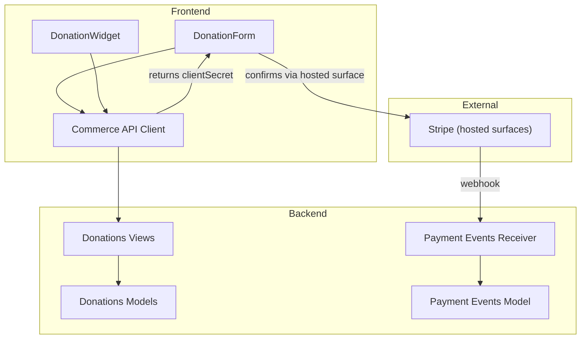
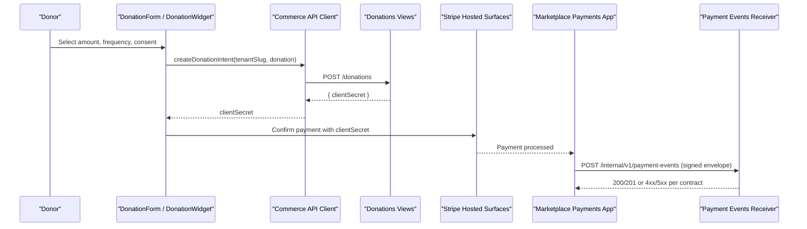
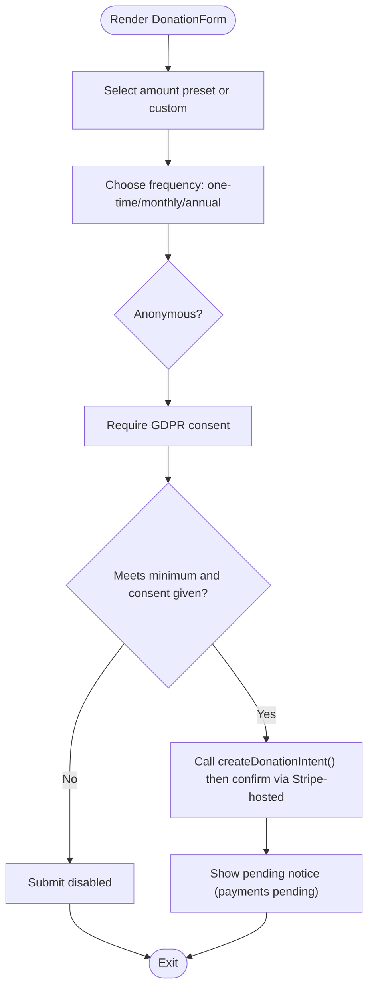
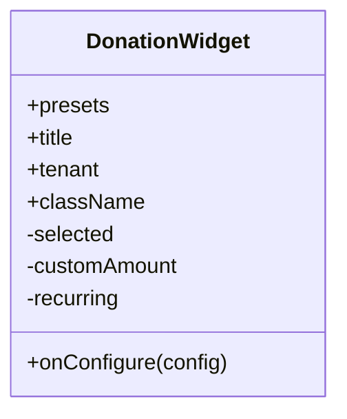
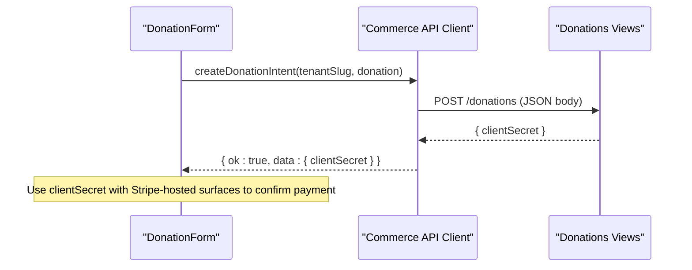
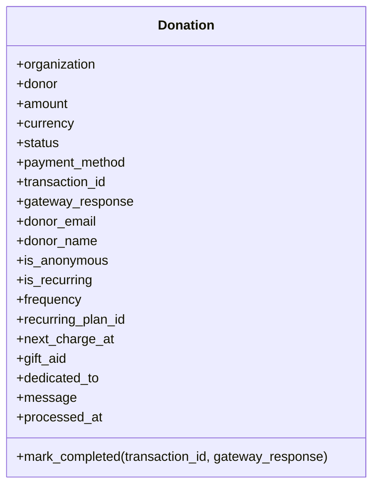
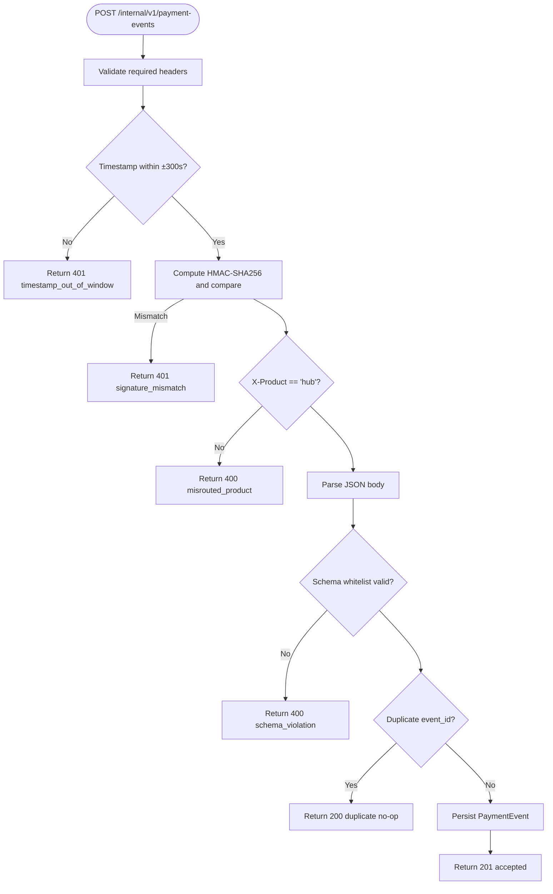
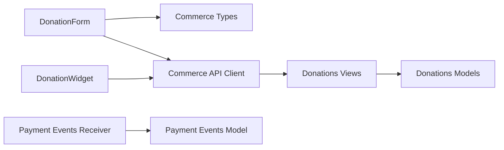

# Donation Processing

<cite>
**Referenced Files in This Document**
- [DonationForm.tsx](file://frontend/apps/template-renderer/src/components/commerce/DonationForm.tsx)
- [DonationWidget.tsx](file://frontend/packages/ui/src/components/composite/donation-widget/DonationWidget.tsx)
- [types.ts](file://frontend/packages/commerce/src/types.ts)
- [commerce-api.ts](file://frontend/packages/commerce/src/commerce-api.ts)
- [index.ts](file://frontend/packages/commerce/src/index.ts)
- [models.py](file://backend/django/apps/donations/models.py)
- [views.py](file://backend/django/apps/donations/views.py)
- [models.py](file://backend/django/apps/payment_events/models.py)
- [views.py](file://backend/django/apps/payment_events/views.py)
- [donation-flow-spec.md](file://docs/commerce/donation-flow-spec.md)
- [payment-api-contract.md](file://docs/payment-api-contract.md)
- [ADR-009-payment-boundary.md](file://docs/decisions/ADR-009-payment-boundary.md)
</cite>

## Table of Contents
1. [Introduction](#introduction)
2. [Project Structure](#project-structure)
3. [Core Components](#core-components)
4. [Architecture Overview](#architecture-overview)
5. [Detailed Component Analysis](#detailed-component-analysis)
6. [Dependency Analysis](#dependency-analysis)
7. [Performance Considerations](#performance-considerations)
8. [Troubleshooting Guide](#troubleshooting-guide)
9. [Conclusion](#conclusion)
10. [Appendices](#appendices)

## Introduction
This document explains donation processing within the commerce package and its backend integration. It covers the DonationForm component, the donation flow from UI to payment provider, validation and submission patterns, error handling, retry logic, user feedback, and PCI-DSS compliance measures. The system is designed so that sensitive payment data never touches the hub codebase; payments are handled by a marketplace payments application using Stripe-hosted surfaces, and the hub receives signed payment events for durable record-keeping.

## Project Structure
The donation feature spans frontend components, a framework-agnostic commerce client, and backend Django apps:
- Frontend:
  - Donation form and widget shells collect amount, frequency, consent, and anonymity preferences without touching card data.
  - Commerce API client creates donation intents via an internal endpoint and returns opaque secrets for Stripe-hosted confirmation.
- Backend:
  - Donations app models and views manage donation records, throttling, and refund workflows with audit logging.
  - Payment events app receives signed envelopes from the marketplace, validates them, deduplicates, and persists facts.

**Diagram sources**
- [DonationForm.tsx:1-175](file://frontend/apps/template-renderer/src/components/commerce/DonationForm.tsx#L1-L175)
- [DonationWidget.tsx:1-125](file://frontend/packages/ui/src/components/composite/donation-widget/DonationWidget.tsx#L1-L125)
- [commerce-api.ts:171-177](file://frontend/packages/commerce/src/commerce-api.ts#L171-L177)
- [views.py:24-46](file://backend/django/apps/donations/views.py#L24-L46)
- [models.py:13-146](file://backend/django/apps/donations/models.py#L13-L146)
- [views.py:79-144](file://backend/django/apps/payment_events/views.py#L79-L144)
- [models.py:6-36](file://backend/django/apps/payment_events/models.py#L6-L36)

**Section sources**
- [DonationForm.tsx:1-175](file://frontend/apps/template-renderer/src/components/commerce/DonationForm.tsx#L1-L175)
- [DonationWidget.tsx:1-125](file://frontend/packages/ui/src/components/composite/donation-widget/DonationWidget.tsx#L1-L125)
- [commerce-api.ts:1-203](file://frontend/packages/commerce/src/commerce-api.ts#L1-L203)
- [models.py:13-146](file://backend/django/apps/donations/models.py#L13-L146)
- [views.py:24-176](file://backend/django/apps/donations/views.py#L24-L176)
- [models.py:6-36](file://backend/django/apps/payment_events/models.py#L6-L36)
- [views.py:79-144](file://backend/django/apps/payment_events/views.py#L79-L144)

## Core Components
- DonationForm (template renderer): Collects amount presets, frequency (one-time/monthly/annual), anonymous option, tax-receipt info, and GDPR consent. It does not process payments directly and defers to Stripe-hosted surfaces via a client secret obtained from the commerce API.
- DonationWidget (UI composite): A reusable shell offering amount selection and recurring toggle, emitting configuration via onConfigure. It also enforces SAQ A boundaries by design.
- Commerce API client: Provides typed functions to call the internal commerce backend, including createDonationIntent which returns an opaque client secret for Stripe-hosted confirmation. Includes error taxonomy and idempotent GET retries; mutations are not retried automatically.
- Donations backend: Models represent donations with status, method, recurrence, and donor fields. Views expose list/create endpoints with throttling and a refund endpoint with full audit trail.
- Payment events receiver: Accepts signed envelopes from the marketplace, validates headers, timestamps, HMAC signature, schema whitelist, deduplicates by event_id, and persists facts.

**Section sources**
- [DonationForm.tsx:1-175](file://frontend/apps/template-renderer/src/components/commerce/DonationForm.tsx#L1-L175)
- [DonationWidget.tsx:1-125](file://frontend/packages/ui/src/components/composite/donation-widget/DonationWidget.tsx#L1-L125)
- [commerce-api.ts:19-47](file://frontend/packages/commerce/src/commerce-api.ts#L19-L47)
- [commerce-api.ts:94-134](file://frontend/packages/commerce/src/commerce-api.ts#L94-L134)
- [commerce-api.ts:171-177](file://frontend/packages/commerce/src/commerce-api.ts#L171-L177)
- [models.py:13-146](file://backend/django/apps/donations/models.py#L13-L146)
- [views.py:24-176](file://backend/django/apps/donations/views.py#L24-L176)
- [views.py:79-144](file://backend/django/apps/payment_events/views.py#L79-L144)

## Architecture Overview
The donation flow follows a strict boundary:
- The tenant site renders donation forms and collects non-sensitive configuration (amount, frequency, consent).
- The commerce API creates a donation intent and returns an opaque client secret.
- The browser confirms payment using Stripe-hosted surfaces (no card data in hub).
- The marketplace processes payment and sends signed events to the hub’s internal receiver.
- The hub persists facts and correlates outcomes via opaque intent IDs.

**Diagram sources**
- [DonationForm.tsx:160-173](file://frontend/apps/template-renderer/src/components/commerce/DonationForm.tsx#L160-L173)
- [DonationWidget.tsx:109-121](file://frontend/packages/ui/src/components/composite/donation-widget/DonationWidget.tsx#L109-L121)
- [commerce-api.ts:171-177](file://frontend/packages/commerce/src/commerce-api.ts#L171-L177)
- [views.py:24-46](file://backend/django/apps/donations/views.py#L24-L46)
- [views.py:79-144](file://backend/django/apps/payment_events/views.py#L79-L144)
- [payment-api-contract.md:21-83](file://docs/payment-api-contract.md#L21-L83)

## Detailed Component Analysis

### DonationForm Component
- Purpose: Renders a donation form with amount presets, frequency selection (one-time/monthly/annual), anonymous option, tax-receipt eligibility note, and GDPR consent checkbox.
- Validation: Enforces minimum donation amount and requires consent before enabling submit. Displays pending notice until payment path is wired per ADR-007.
- Submission: Intended to call createDonationIntent and confirm via Stripe-hosted Elements; currently shows pending notice and does not simulate success.
- Compliance: Explicitly avoids any card data handling; relies on Stripe-hosted surfaces.

**Diagram sources**
- [DonationForm.tsx:21-27](file://frontend/apps/template-renderer/src/components/commerce/DonationForm.tsx#L21-L27)
- [DonationForm.tsx:131-173](file://frontend/apps/template-renderer/src/components/commerce/DonationForm.tsx#L131-L173)
- [commerce-api.ts:171-177](file://frontend/packages/commerce/src/commerce-api.ts#L171-L177)

**Section sources**
- [DonationForm.tsx:1-175](file://frontend/apps/template-renderer/src/components/commerce/DonationForm.tsx#L1-L175)

### DonationWidget Component
- Purpose: Reusable shell providing amount presets and a recurring toggle; emits configuration via onConfigure.
- Compliance: Maintains SAQ A eligibility by design; no card data handling; uses Stripe-hosted surfaces only.

**Diagram sources**
- [DonationWidget.tsx:32-124](file://frontend/packages/ui/src/components/composite/donation-widget/DonationWidget.tsx#L32-L124)

**Section sources**
- [DonationWidget.tsx:1-125](file://frontend/packages/ui/src/components/composite/donation-widget/DonationWidget.tsx#L1-L125)

### Commerce API Client (Donations)
- Types: Defines DonationRequest with tenant scoping, amount in cents, frequency, anonymity, consent, and optional tax receipt flag. Also defines MIN_DONATION_CENTS.
- API: createDonationIntent posts to /donations with tenant-scoped request and returns an opaque client secret for Stripe-hosted confirmation.
- Error handling: Returns structured errors with kind (unconfigured/network/validation/payment/server), message, and retryable flags. GET requests retry with backoff; mutations do not auto-retry to avoid duplicate charges.

**Diagram sources**
- [commerce-api.ts:171-177](file://frontend/packages/commerce/src/commerce-api.ts#L171-L177)
- [views.py:24-46](file://backend/django/apps/donations/views.py#L24-L46)

**Section sources**
- [types.ts:136-152](file://frontend/packages/commerce/src/types.ts#L136-L152)
- [commerce-api.ts:29-47](file://frontend/packages/commerce/src/commerce-api.ts#L29-L47)
- [commerce-api.ts:94-134](file://frontend/packages/commerce/src/commerce-api.ts#L94-L134)
- [commerce-api.ts:171-177](file://frontend/packages/commerce/src/commerce-api.ts#L171-L177)

### Backend Donation Models and Views
- Models: Donation captures organization, donor, amount/currency, status, payment method, transaction ID, gateway response, donor details (including anonymity), recurrence fields, gift aid, dedicated-to/message, and processing timestamp. Includes tenant context validation on save to prevent cross-tenant manipulation.
- Views:
  - DonationListCreateView: Lists and creates donations with authentication and throttling for POST.
  - DonationDetailView: Retrieves a donation.
  - DonationRefundView: Processes refunds with comprehensive audit logging, state checks, and rate limiting.

**Diagram sources**
- [models.py:13-146](file://backend/django/apps/donations/models.py#L13-L146)

**Section sources**
- [models.py:13-146](file://backend/django/apps/donations/models.py#L13-L146)
- [views.py:24-176](file://backend/django/apps/donations/views.py#L24-L176)

### Payment Events Receiver
- Contract: Validates headers (X-Product, X-JOL-Timestamp, X-JOL-Signature), enforces replay window, computes HMAC-SHA256 signature in constant time, routes by product, validates JSON and schema whitelist, deduplicates by event_id, and persists accepted events.
- Data model: Stores whitelisted fields only (event_id, type, product, payment_intent_id, status, amount_cents, currency, occurred_at, received_at).

**Diagram sources**
- [views.py:79-144](file://backend/django/apps/payment_events/views.py#L79-L144)
- [models.py:6-36](file://backend/django/apps/payment_events/models.py#L6-L36)
- [payment-api-contract.md:21-83](file://docs/payment-api-contract.md#L21-L83)

**Section sources**
- [views.py:79-144](file://backend/django/apps/payment_events/views.py#L79-L144)
- [models.py:6-36](file://backend/django/apps/payment_events/models.py#L6-L36)
- [payment-api-contract.md:21-83](file://docs/payment-api-contract.md#L21-L83)

## Dependency Analysis
- Frontend dependencies:
  - DonationForm depends on commerce types and formatting utilities; it delegates payment creation to the commerce API client.
  - DonationWidget is a UI-only shell that emits configuration; it does not depend on payment SDKs.
  - Commerce API client depends on environment configuration and performs HTTP calls with tenant scoping.
- Backend dependencies:
  - Donations views depend on models and throttling; they enforce authentication and rate limits.
  - Payment events receiver depends on settings for feature flags and delivery keys; it persists to the payment events model.

**Diagram sources**
- [DonationForm.tsx:15-20](file://frontend/apps/template-renderer/src/components/commerce/DonationForm.tsx#L15-L20)
- [commerce-api.ts:19-27](file://frontend/packages/commerce/src/commerce-api.ts#L19-L27)
- [views.py:24-46](file://backend/django/apps/donations/views.py#L24-L46)
- [models.py:13-146](file://backend/django/apps/donations/models.py#L13-L146)
- [views.py:79-144](file://backend/django/apps/payment_events/views.py#L79-L144)
- [models.py:6-36](file://backend/django/apps/payment_events/models.py#L6-L36)

**Section sources**
- [DonationForm.tsx:1-175](file://frontend/apps/template-renderer/src/components/commerce/DonationForm.tsx#L1-L175)
- [commerce-api.ts:1-203](file://frontend/packages/commerce/src/commerce-api.ts#L1-L203)
- [views.py:24-176](file://backend/django/apps/donations/views.py#L24-L176)
- [views.py:79-144](file://backend/django/apps/payment_events/views.py#L79-L144)

## Performance Considerations
- Idempotency: Payment events receiver deduplicates by event_id and returns 200 no-op for duplicates, ensuring safe at-least-once delivery.
- Retries: Commerce API client retries GET requests with exponential backoff; mutations (donations, bookings, subscriptions) are not retried automatically to prevent duplicate charges.
- Throttling: Donation endpoints apply stricter throttling for POST operations to mitigate abuse.
- Minimal payload: Payment events envelope carries only whitelisted fields, reducing processing overhead and minimizing data exposure.

[No sources needed since this section provides general guidance]

## Troubleshooting Guide
- Unconfigured commerce backend: If COMMERCE_API_URL is unset, the client returns an unconfigured result; UI can render a “coming soon” state consistent with payments-pending posture.
- Network errors: Non-GET requests return network errors marked non-retryable; callers should surface user-friendly messages and allow manual retry if appropriate.
- Validation errors: 4xx responses indicate bad input; display the provided message and guide users to correct inputs.
- Payment declines: 402/403 mapped to payment errors; show decline messaging and suggest retry or alternative payment methods.
- Server errors: 5xx mapped to server errors marked retryable for GET; for mutations, inform users of temporary unavailability.
- Refund workflow: Ensure donation is completed before attempting refund; refund endpoint logs detailed audit entries and enforces rate limits.

**Section sources**
- [commerce-api.ts:65-84](file://frontend/packages/commerce/src/commerce-api.ts#L65-L84)
- [commerce-api.ts:94-134](file://frontend/packages/commerce/src/commerce-api.ts#L94-L134)
- [views.py:80-168](file://backend/django/apps/donations/views.py#L80-L168)

## Conclusion
The donation processing architecture enforces a strict payment boundary, keeping the hub out of PCI scope while providing robust forms, typed APIs, and secure event reception. DonationForm and DonationWidget collect configuration and consent without handling sensitive data. The commerce API client creates donation intents and returns opaque secrets for Stripe-hosted confirmation. The backend models and views manage donation lifecycle and refunds with strong auditing, and the payment events receiver ensures durable, validated, and deduplicated acceptance of marketplace payment facts. This design supports one-time and recurring donations, clear error handling, and compliance with PCI-DSS and GDPR requirements.

[No sources needed since this section summarizes without analyzing specific files]

## Appendices

### Implementing Custom Donation Forms
- Use DonationForm as a reference for collecting amount presets, frequency, anonymity, and consent.
- Call createDonationIntent from the commerce API client with a DonationRequest object.
- Confirm payment using the returned client secret via Stripe-hosted surfaces; do not handle raw card data.
- Display pending notices and user feedback aligned with payments-pending behavior until live integration is enabled.

**Section sources**
- [DonationForm.tsx:1-175](file://frontend/apps/template-renderer/src/components/commerce/DonationForm.tsx#L1-L175)
- [commerce-api.ts:171-177](file://frontend/packages/commerce/src/commerce-api.ts#L171-L177)

### Handling Different Donation Types
- One-time: Set frequency to one-time in DonationRequest.
- Recurring: Choose monthly or annual frequency; ensure recurring plan setup occurs in the marketplace payments app; the hub only stores intent-level facts.
- Anonymity: Toggle anonymous to hide donor identity where supported; consent remains required for processing.

**Section sources**
- [types.ts:136-152](file://frontend/packages/commerce/src/types.ts#L136-L152)
- [donation-flow-spec.md:23-35](file://docs/commerce/donation-flow-spec.md#L23-L35)

### Managing Donation States
- States include pending, completed, failed, refunded, cancelled.
- Completed state is set when payment succeeds; failed and refunded states are recorded via payment events.
- Refunds require completed status and generate audit entries.

**Section sources**
- [models.py:13-146](file://backend/django/apps/donations/models.py#L13-L146)
- [views.py:80-168](file://backend/django/apps/donations/views.py#L80-L168)

### Error Handling and Retry Logic
- Client-side: Distinguish unconfigured, network, validation, payment, and server errors; use retryable flags to guide retries.
- Backend: Payment events receiver enforces strict validation and returns 4xx for content/schema issues (no retry); 5xx reserved for genuine unavailability.

**Section sources**
- [commerce-api.ts:29-47](file://frontend/packages/commerce/src/commerce-api.ts#L29-L47)
- [commerce-api.ts:94-134](file://frontend/packages/commerce/src/commerce-api.ts#L94-L134)
- [views.py:79-144](file://backend/django/apps/payment_events/views.py#L79-L144)

### PCI-DSS Compliance and Security Considerations
- PCI-DSS Model A: Hub stays out of PCI scope; no card data touches frontend or backend; Stripe-hosted surfaces used exclusively.
- Payment boundary enforcement: Guard scripts and ADR-009 codify the boundary; opening requires SAQ A verification.
- Secure event transport: Signed envelopes with HMAC-SHA256, timestamp windows, and TLS termination at ingress.
- Data minimization: Envelope contains only whitelisted fields; no personal data crosses the boundary.

**Section sources**
- [ADR-009-payment-boundary.md:45-83](file://docs/decisions/ADR-009-payment-boundary.md#L45-L83)
- [payment-api-contract.md:21-83](file://docs/payment-api-contract.md#L21-L83)
- [payment-api-contract.md:147-177](file://docs/payment-api-contract.md#L147-L177)