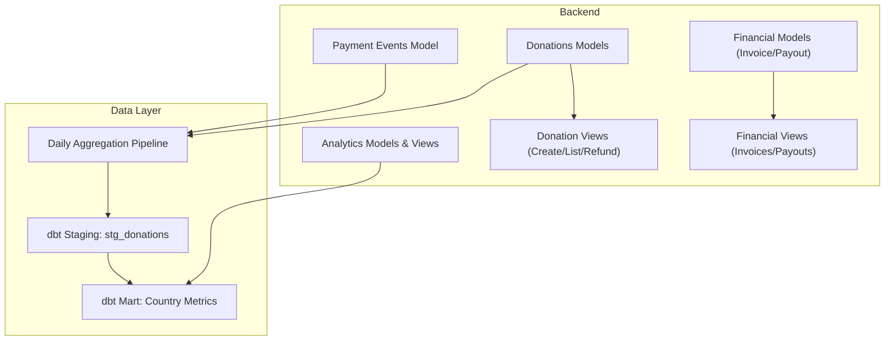
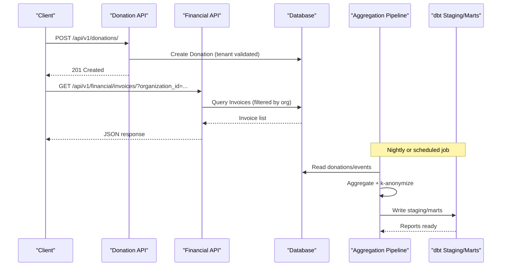
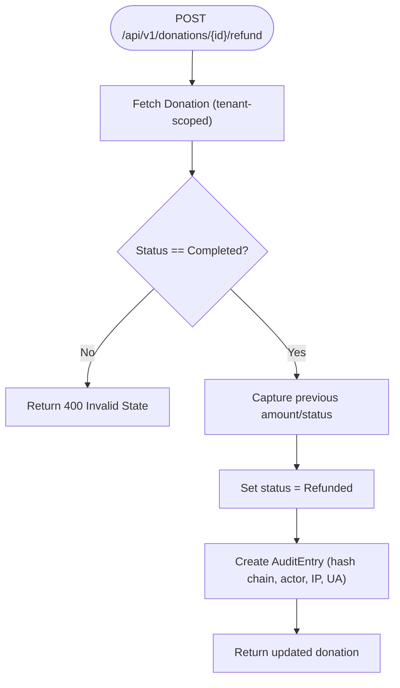
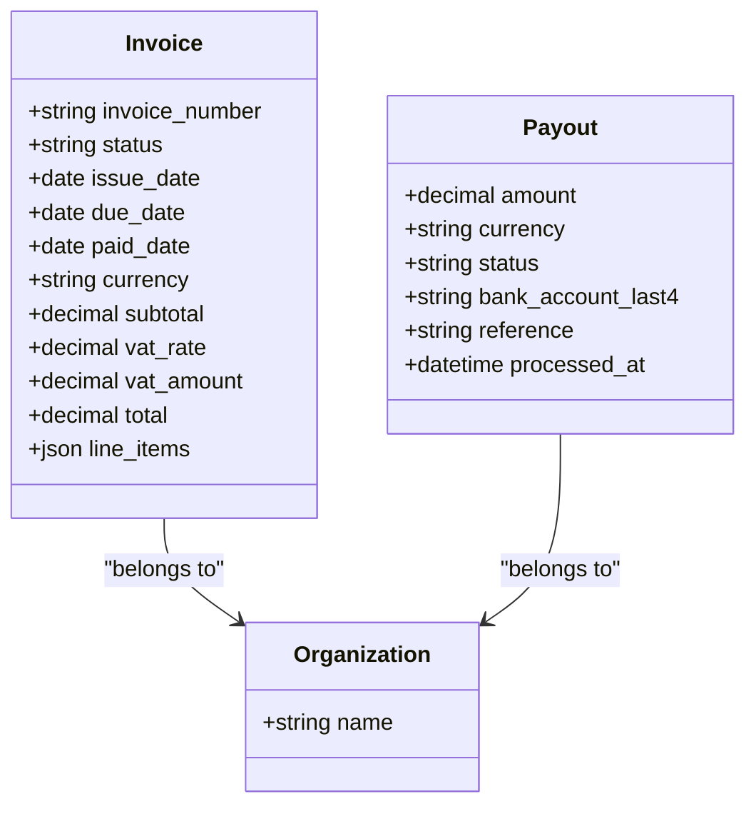
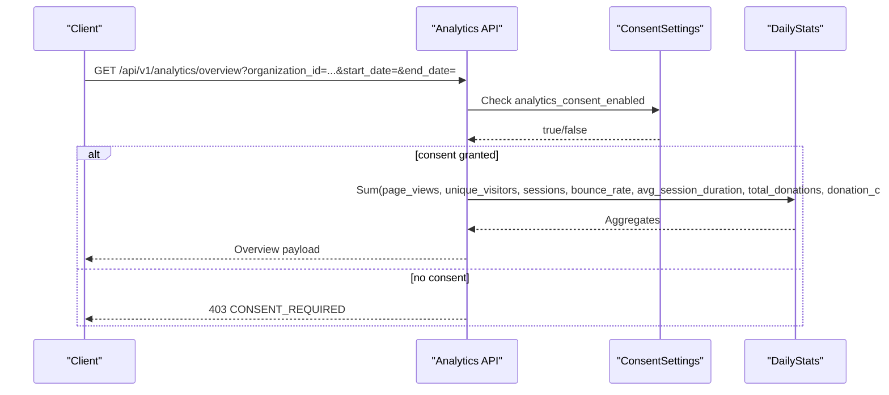
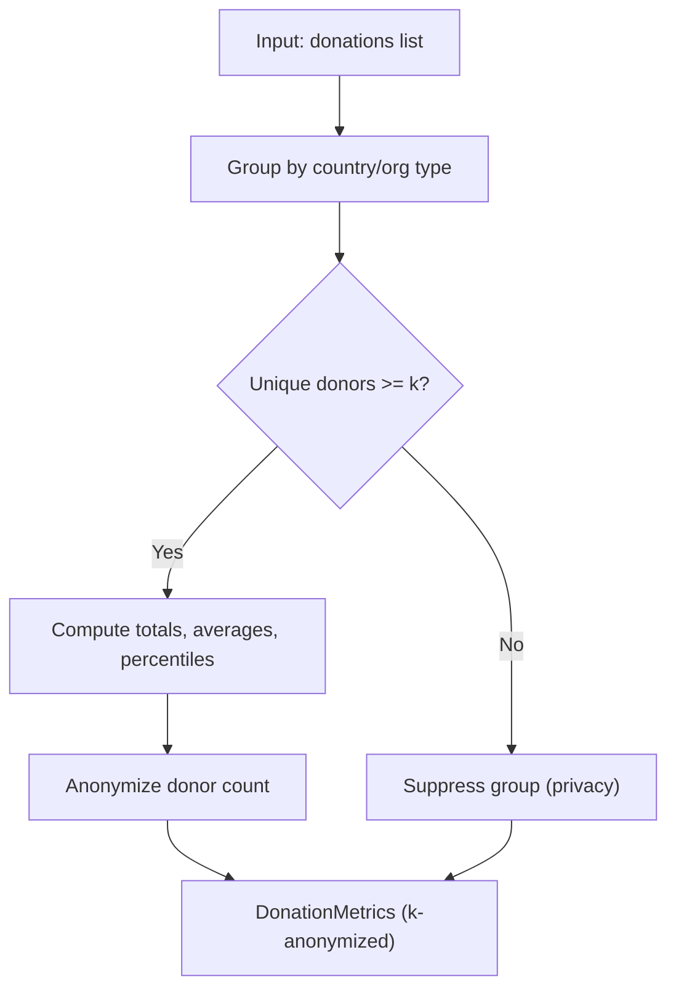
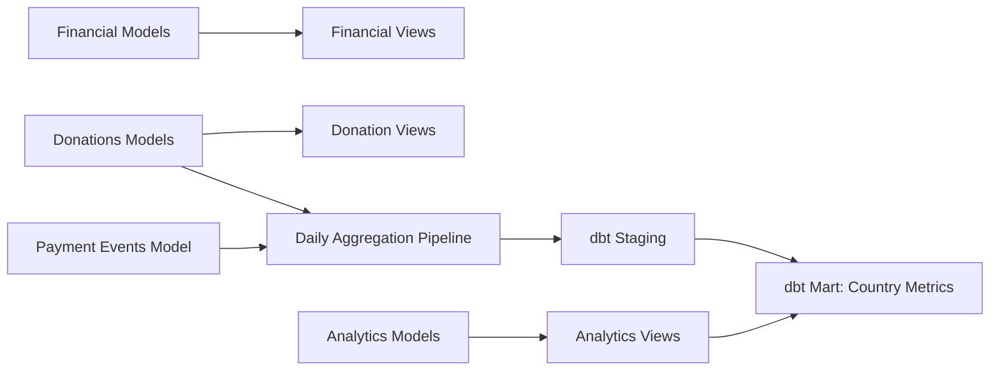

# Financial Reporting

<cite>
**Referenced Files in This Document**
- [models.py](file://backend/django/apps/financial/models.py)
- [views.py](file://backend/django/apps/financial/views.py)
- [serializers.py](file://backend/django/apps/financial/serializers.py)
- [models.py](file://backend/django/apps/donations/models.py)
- [views.py](file://backend/django/apps/donations/views.py)
- [models.py](file://backend/django/apps/payment_events/models.py)
- [daily_aggregation.py](file://data/src/pipelines/donation_analytics/daily_aggregation.py)
- [stg_donations.sql](file://data/dbt/models/staging/stg_donations.sql)
- [mart_country_metrics.sql](file://data/src/transformations/marts/mart_country_metrics.sql)
- [models.py](file://backend/django/apps/analytics/models.py)
- [views.py](file://backend/django/apps/analytics/views.py)
</cite>

## Table of Contents
1. Introduction
2. Project Structure
3. Core Components
4. Architecture Overview
5. Detailed Component Analysis
6. Dependency Analysis
7. Performance Considerations
8. Troubleshooting Guide
9. Conclusion

## Introduction
This document explains the financial reporting and analytics capabilities in the system, focusing on revenue tracking, donation analytics, and financial metrics calculation. It covers report generation, data aggregation, export considerations, currency handling, tax calculations, compliance reporting, data accuracy, audit trails, and regulatory requirements. The goal is to help both technical and non-technical users understand how donations are recorded, aggregated, analyzed, and reported while preserving privacy and integrity.

## Project Structure
The financial reporting stack spans backend Django apps for transactional data (donations, invoices, payouts), a payment event ingestion model, analytics models and views, and a data pipeline with dbt transformations that produce k-anonymized reports.

**Diagram sources**
- [models.py:1-146](file://backend/django/apps/donations/models.py#L1-L146)
- [views.py:1-176](file://backend/django/apps/donations/views.py#L1-L176)
- [models.py:1-170](file://backend/django/apps/financial/models.py#L1-L170)
- [views.py:1-39](file://backend/django/apps/financial/views.py#L1-L39)
- [models.py:1-36](file://backend/django/apps/payment_events/models.py#L1-L36)
- [daily_aggregation.py:1-242](file://data/src/pipelines/donation_analytics/daily_aggregation.py#L1-L242)
- [stg_donations.sql:1-36](file://data/dbt/models/staging/stg_donations.sql#L1-L36)
- [mart_country_metrics.sql:1-96](file://data/src/transformations/marts/mart_country_metrics.sql#L1-L96)
- [models.py:1-174](file://backend/django/apps/analytics/models.py#L1-L174)
- [views.py:1-458](file://backend/django/apps/analytics/views.py#L1-L458)

**Section sources**
- [models.py:1-146](file://backend/django/apps/donations/models.py#L1-L146)
- [views.py:1-176](file://backend/django/apps/donations/views.py#L1-L176)
- [models.py:1-170](file://backend/django/apps/financial/models.py#L1-L170)
- [views.py:1-39](file://backend/django/apps/financial/views.py#L1-L39)
- [models.py:1-36](file://backend/django/apps/payment_events/models.py#L1-L36)
- [daily_aggregation.py:1-242](file://data/src/pipelines/donation_analytics/daily_aggregation.py#L1-L242)
- [stg_donations.sql:1-36](file://data/dbt/models/staging/stg_donations.sql#L1-L36)
- [mart_country_metrics.sql:1-96](file://data/src/transformations/marts/mart_country_metrics.sql#L1-L96)
- [models.py:1-174](file://backend/django/apps/analytics/models.py#L1-L174)
- [views.py:1-458](file://backend/django/apps/analytics/views.py#L1-L458)

## Core Components
- Donation recording and lifecycle management with status transitions, payment methods, recurring support, gift aid flag, and tenant isolation validation.
- Financial invoicing and payout tracking with VAT fields, multi-currency support, and tenant context enforcement.
- Payment event ingestion for durable, contract-aligned storage of payment outcomes.
- Analytics models for page views and daily stats including donation totals and counts.
- Data pipelines and dbt transformations producing k-anonymized, GDPR-compliant reports.

Key responsibilities:
- Donations: capture, validate, and transition states; enforce tenant boundaries; support refunds with full audit trail.
- Financial: manage invoices and payouts; compute VAT amounts; ensure cross-tenant safety.
- Payment events: store immutable envelopes for at-least-once delivery and reconciliation.
- Analytics: aggregate consented usage and donation metrics; apply k-anonymity thresholds.
- Data layer: transform raw data into staging and marts with retention and classification metadata.

**Section sources**
- [models.py:1-146](file://backend/django/apps/donations/models.py#L1-L146)
- [views.py:1-176](file://backend/django/apps/donations/views.py#L1-L176)
- [models.py:1-170](file://backend/django/apps/financial/models.py#L1-L170)
- [views.py:1-39](file://backend/django/apps/financial/views.py#L1-L39)
- [models.py:1-36](file://backend/django/apps/payment_events/models.py#L1-L36)
- [models.py:1-174](file://backend/django/apps/analytics/models.py#L1-L174)
- [daily_aggregation.py:1-242](file://data/src/pipelines/donation_analytics/daily_aggregation.py#L1-L242)
- [stg_donations.sql:1-36](file://data/dbt/models/staging/stg_donations.sql#L1-L36)
- [mart_country_metrics.sql:1-96](file://data/src/transformations/marts/mart_country_metrics.sql#L1-L96)

## Architecture Overview
The system records transactions at the API layer, persists them with tenant isolation checks, and exposes read endpoints for financial records. A separate analytics pipeline aggregates donations into anonymized metrics and produces country-level reports via dbt.

**Diagram sources**
- [views.py:1-176](file://backend/django/apps/donations/views.py#L1-L176)
- [views.py:1-39](file://backend/django/apps/financial/views.py#L1-L39)
- [daily_aggregation.py:1-242](file://data/src/pipelines/donation_analytics/daily_aggregation.py#L1-L242)
- [stg_donations.sql:1-36](file://data/dbt/models/staging/stg_donations.sql#L1-L36)
- [mart_country_metrics.sql:1-96](file://data/src/transformations/marts/mart_country_metrics.sql#L1-L96)

## Detailed Component Analysis

### Donations: Revenue Tracking and Refunds
- Captures one-off and recurring donations with method, currency, and optional donor details. Supports gift aid and deduplication via transaction IDs.
- Enforces tenant isolation on save to prevent cross-tenant manipulation.
- Provides refund processing with an atomic transaction that updates donation state and creates a tamper-evident audit entry capturing who, when, what changed, and authorization context.

**Diagram sources**
- [views.py:59-168](file://backend/django/apps/donations/views.py#L59-L168)
- [models.py:96-146](file://backend/django/apps/donations/models.py#L96-L146)

**Section sources**
- [models.py:1-146](file://backend/django/apps/donations/models.py#L1-L146)
- [views.py:1-176](file://backend/django/apps/donations/views.py#L1-L176)

### Financial: Invoices, VAT, and Payouts
- Invoices track subtotal, VAT rate and amount, total, issue/due/paid dates, and line items. Currency defaults to EUR but supports other codes.
- Payouts record settlement amounts, currencies, bank account last four digits, references, and processing timestamps.
- Both models validate tenant context on save to prevent cross-tenant writes.

**Diagram sources**
- [models.py:14-95](file://backend/django/apps/financial/models.py#L14-L95)
- [models.py:97-170](file://backend/django/apps/financial/models.py#L97-L170)

**Section sources**
- [models.py:1-170](file://backend/django/apps/financial/models.py#L1-L170)
- [views.py:1-39](file://backend/django/apps/financial/views.py#L1-L39)
- [serializers.py:1-27](file://backend/django/apps/financial/serializers.py#L1-L27)

### Payment Events: Immutable Envelopes
- Stores signed payment-event envelopes mirroring a contract whitelist. Includes event type, product, payment intent ID, status, amount in cents, currency, occurrence time, and receipt time.
- Designed for durability and idempotency using event_id as a unique key.

**Section sources**
- [models.py:1-36](file://backend/django/apps/payment_events/models.py#L1-L36)

### Analytics: Consent-Gated Aggregations and K-Anonymity
- PageView and DailyStats models track consent and pre-aggregated metrics, including donation totals and counts per organization per day.
- Analytics views enforce consent checks, validate inputs, limit date ranges, and apply k-anonymity to protect small groups.

**Diagram sources**
- [views.py:173-241](file://backend/django/apps/analytics/views.py#L173-L241)
- [models.py:107-174](file://backend/django/apps/analytics/models.py#L107-L174)

**Section sources**
- [models.py:1-174](file://backend/django/apps/analytics/models.py#L1-L174)
- [views.py:1-458](file://backend/django/apps/analytics/views.py#L1-L458)

### Data Pipeline: Donation Analytics Aggregation
- The daily aggregation pipeline computes anonymized metrics grouped by country and organization type, enforces minimum donor thresholds, calculates percentiles, and generates trend summaries without exposing individual-level data.
- Uses an audit logger to record start/complete events and metadata.

**Diagram sources**
- [daily_aggregation.py:62-242](file://data/src/pipelines/donation_analytics/daily_aggregation.py#L62-L242)

**Section sources**
- [daily_aggregation.py:1-242](file://data/src/pipelines/donation_analytics/daily_aggregation.py#L1-L242)

### dbt Transformations: Staging and Marts
- Staging view for donations redacts sensitive payment references unless explicitly allowed by variables, adds data classification and retention expiry.
- Country metrics mart aggregates donations and entities at country level, applies k-anonymity filters, maps codes to names, and includes compliance metadata.

**Section sources**
- [stg_donations.sql:1-36](file://data/dbt/models/staging/stg_donations.sql#L1-L36)
- [mart_country_metrics.sql:1-96](file://data/src/transformations/marts/mart_country_metrics.sql#L1-L96)

## Dependency Analysis
- Backend modules depend on core services for base models, serializers, throttling, and CRM audit logging.
- Analytics views depend on consent settings and daily stats to gate access and compute aggregates.
- Data pipeline depends on raw donations and payment events to build anonymized outputs consumed by reporting layers.

**Diagram sources**
- [models.py:1-146](file://backend/django/apps/donations/models.py#L1-L146)
- [views.py:1-176](file://backend/django/apps/donations/views.py#L1-L176)
- [models.py:1-170](file://backend/django/apps/financial/models.py#L1-L170)
- [views.py:1-39](file://backend/django/apps/financial/views.py#L1-L39)
- [models.py:1-36](file://backend/django/apps/payment_events/models.py#L1-L36)
- [daily_aggregation.py:1-242](file://data/src/pipelines/donation_analytics/daily_aggregation.py#L1-L242)
- [stg_donations.sql:1-36](file://data/dbt/models/staging/stg_donations.sql#L1-L36)
- [mart_country_metrics.sql:1-96](file://data/src/transformations/marts/mart_country_metrics.sql#L1-L96)
- [models.py:1-174](file://backend/django/apps/analytics/models.py#L1-L174)
- [views.py:1-458](file://backend/django/apps/analytics/views.py#L1-L458)

**Section sources**
- [models.py:1-146](file://backend/django/apps/donations/models.py#L1-L146)
- [views.py:1-176](file://backend/django/apps/donations/views.py#L1-L176)
- [models.py:1-170](file://backend/django/apps/financial/models.py#L1-L170)
- [views.py:1-39](file://backend/django/apps/financial/views.py#L1-L39)
- [models.py:1-36](file://backend/django/apps/payment_events/models.py#L1-L36)
- [daily_aggregation.py:1-242](file://data/src/pipelines/donation_analytics/daily_aggregation.py#L1-L242)
- [stg_donations.sql:1-36](file://data/dbt/models/staging/stg_donations.sql#L1-L36)
- [mart_country_metrics.sql:1-96](file://data/src/transformations/marts/mart_country_metrics.sql#L1-L96)
- [models.py:1-174](file://backend/django/apps/analytics/models.py#L1-L174)
- [views.py:1-458](file://backend/django/apps/analytics/views.py#L1-L458)

## Performance Considerations
- Use database indexes on frequently filtered fields such as organization, status, and created_at to speed up queries for donations, invoices, payouts, and analytics.
- Apply throttling on write-heavy endpoints (e.g., donation creation and refunds) to mitigate abuse and protect downstream systems.
- Limit date ranges in analytics queries to prevent heavy aggregations and potential denial-of-service.
- Prefer server-side aggregation and k-anonymization to reduce client-side processing and exposure of granular data.
- Schedule nightly or incremental jobs for aggregation to keep dashboards responsive.

[No sources needed since this section provides general guidance]

## Troubleshooting Guide
Common issues and resolutions:
- Cross-tenant write attempts: If saving donations, invoices, payouts, or analytics records fails with a tenant validation error, verify that the request context matches the target organization’s tenant. Ensure middleware is available and correctly sets the current tenant.
- Consent-gated analytics: Requests to analytics endpoints return a consent-required error if the organization has not enabled analytics consent. Enable consent in organization settings before querying analytics.
- Input validation errors: Analytics endpoints validate organization_id format, date formats, and range limits. Correct malformed parameters and ensure start_date precedes end_date within the maximum allowed range.
- Refund state errors: Only completed donations can be refunded. Verify donation status before attempting a refund.
- Rate limiting: Excessive requests to donation or refund endpoints may be throttled. Reduce frequency or implement retries with backoff.

**Section sources**
- [models.py:96-146](file://backend/django/apps/donations/models.py#L96-L146)
- [models.py:57-95](file://backend/django/apps/financial/models.py#L57-L95)
- [models.py:132-170](file://backend/django/apps/financial/models.py#L132-L170)
- [models.py:67-105](file://backend/django/apps/analytics/models.py#L67-L105)
- [views.py:173-241](file://backend/django/apps/analytics/views.py#L173-L241)
- [views.py:59-168](file://backend/django/apps/donations/views.py#L59-L168)

## Conclusion
The system provides robust financial reporting and analytics through secure transactional APIs, strict tenant isolation, comprehensive audit trails, and privacy-preserving aggregation. Revenue is tracked via donations and financial documents, while analytics deliver consent-gated insights with k-anonymity. Currency handling and VAT fields support multi-currency invoicing and tax reporting. Data pipelines and dbt transformations ensure accurate, auditable, and compliant reporting suitable for regulatory needs.

[No sources needed since this section summarizes without analyzing specific files]