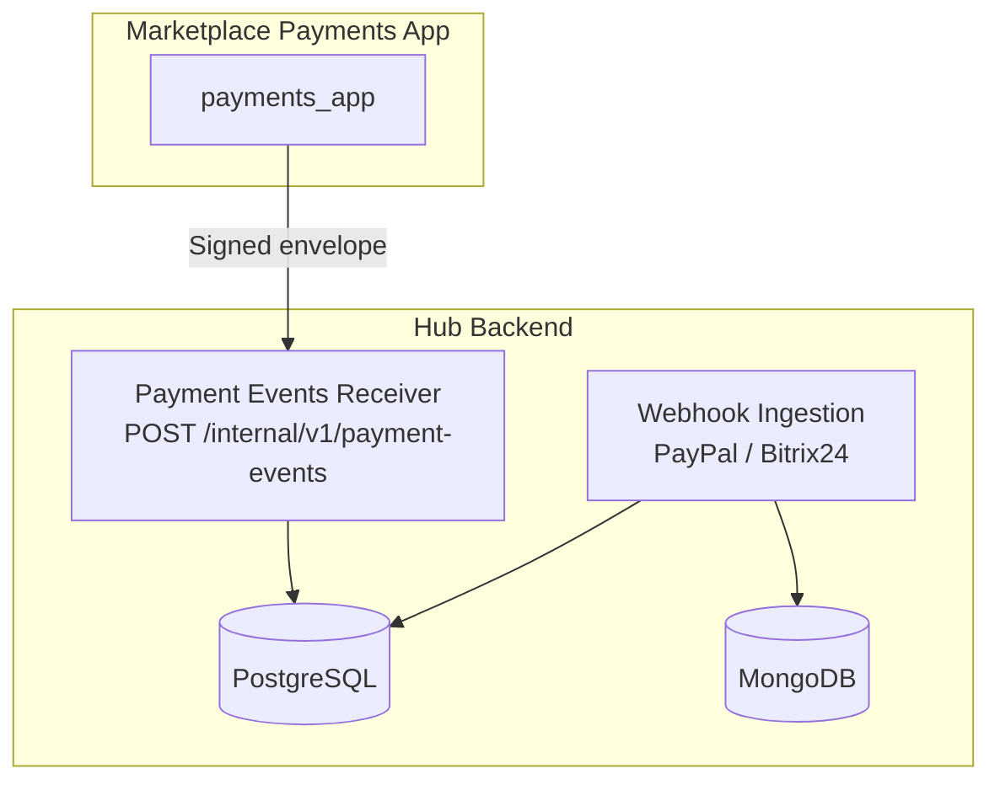
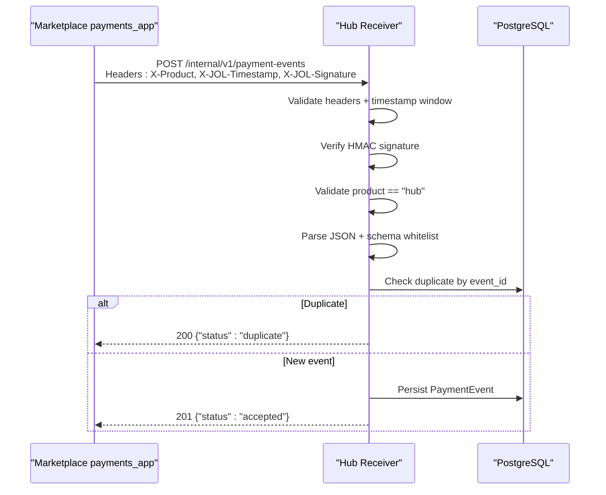
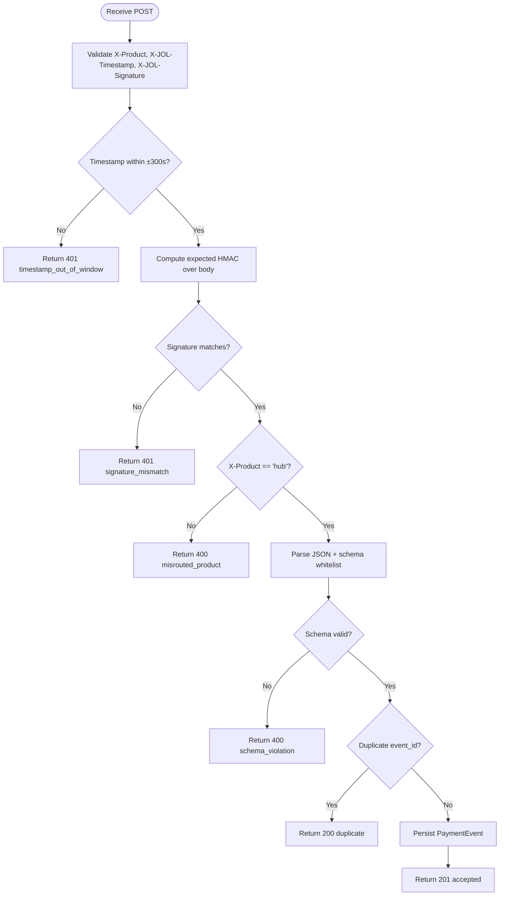
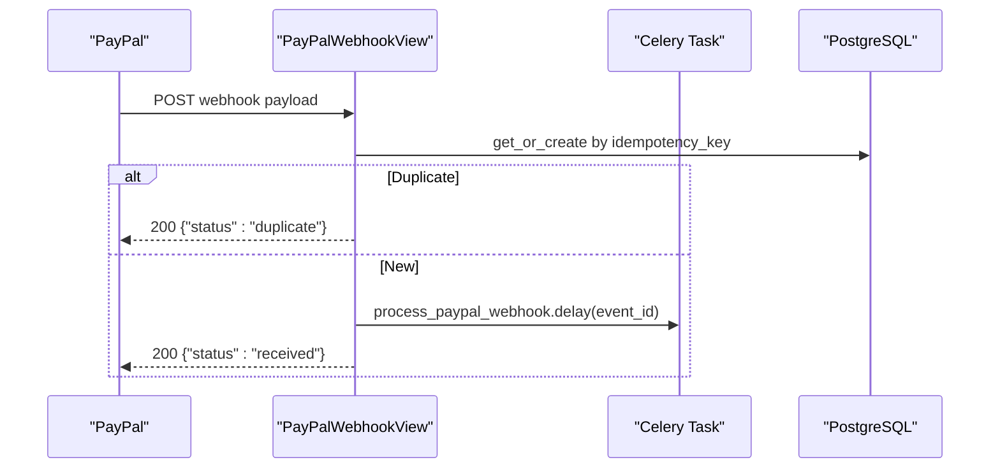
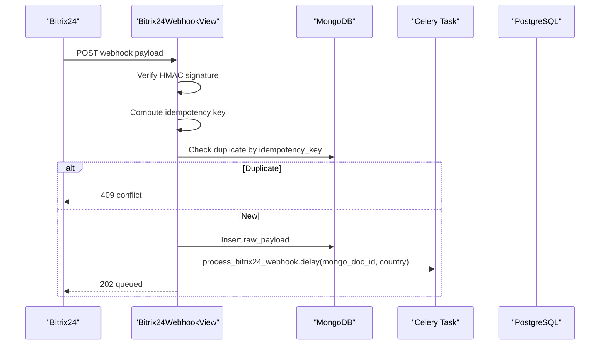
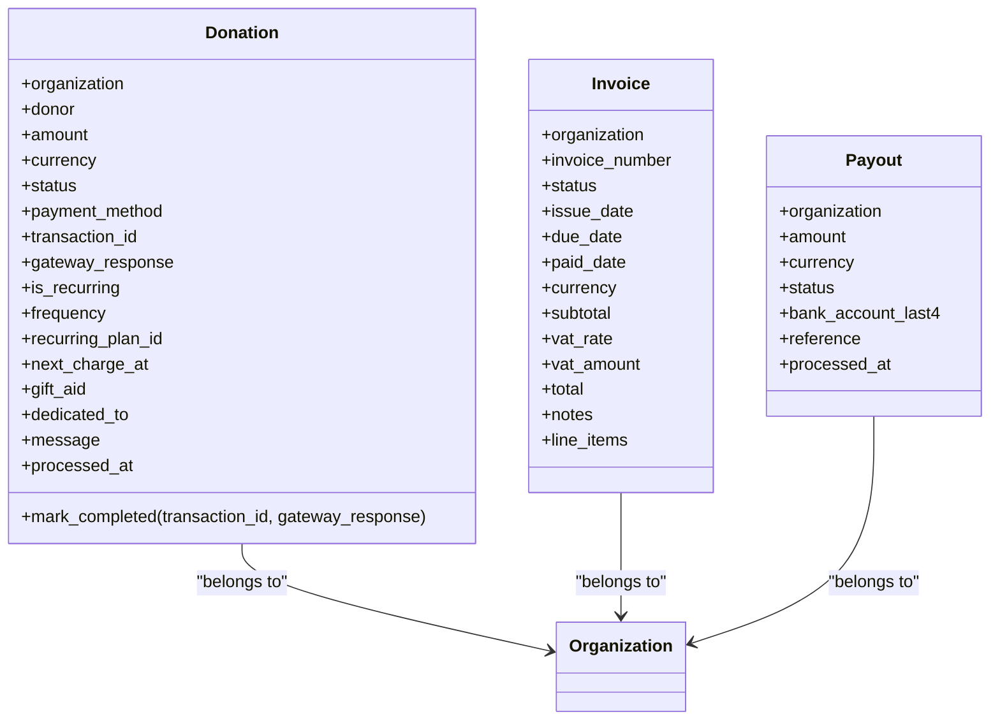
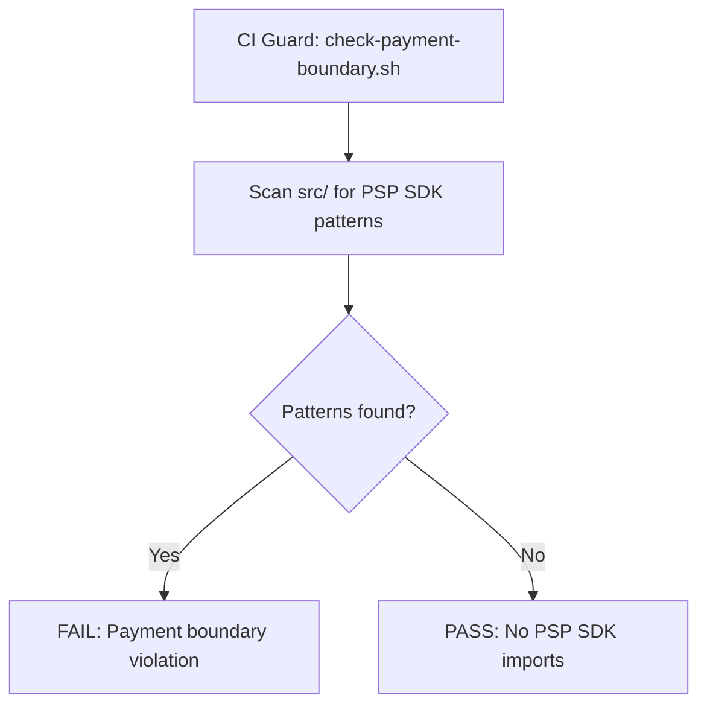
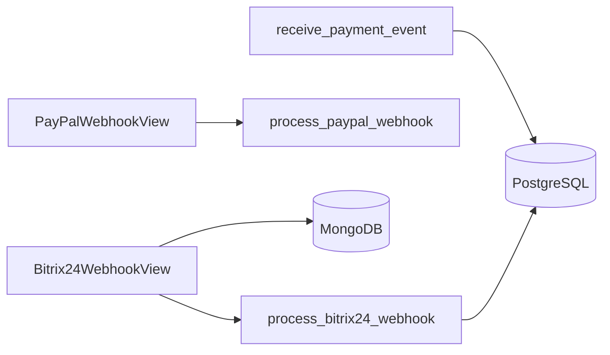

# Payment Integration

<cite>
**Referenced Files in This Document**
- [payment-api-contract.md](file://docs/payment-api-contract.md)
- [ADR-009-payment-boundary.md](file://docs/decisions/ADR-009-payment-boundary.md)
- [check-payment-boundary.sh](file://docs/templates/jol-frontend-repo-template/scripts/check-payment-boundary.sh)
- [views.py (payment_events)](file://backend/django/apps/payment_events/views.py)
- [models.py (payment_events)](file://backend/django/apps/payment_events/models.py)
- [urls.py (payment_events)](file://backend/django/apps/payment_events/urls.py)
- [views.py (integrations)](file://backend/django/apps/integrations/views.py)
- [tasks.py (integrations)](file://backend/django/apps/integrations/tasks.py)
- [urls.py (integrations)](file://backend/django/apps/integrations/urls.py)
- [models.py (donations)](file://backend/django/apps/donations/models.py)
- [models.py (financial)](file://backend/django/apps/financial/models.py)
- [test_compliance.py](file://data/tests/test_compliance.py)
- [main.tf](file://infra/terraform/main.tf)
</cite>

## Table of Contents
1. Introduction
2. Project Structure
3. Core Components
4. Architecture Overview
5. Detailed Component Analysis
6. Dependency Analysis
7. Performance Considerations
8. Troubleshooting Guide
9. Conclusion
10. Appendices

## Introduction
This document explains the payment integration design and implementation boundaries in the project. It focuses on how payment events are received, validated, deduplicated, and persisted; how webhooks from external systems are ingested and processed; and how PCI-DSS scope is minimized by keeping PSP integrations out of this repository. It also covers idempotency, retry strategies, error handling, and compliance guardrails that ensure secure payment handling.

## Project Structure
The payment-related functionality spans:
- A contract defining an internal signed event API between a marketplace payments app and this hub backend.
- A receiver endpoint that validates, signs, deduplicates, and stores payment events.
- Webhook ingestion for non-PSP integrations (e.g., PayPal, Bitrix24).
- Domain models for donations, financial records, and webhook events.
- CI guards and decisions that enforce a closed payment boundary and PCI scope minimization.

**Diagram sources**
- [payment-api-contract.md:21-83](file://docs/payment-api-contract.md#L21-L83)
- [views.py (payment_events):79-143](file://backend/django/apps/payment_events/views.py#L79-L143)
- [views.py (integrations):30-51](file://backend/django/apps/integrations/views.py#L30-L51)
- [views.py (integrations):195-293](file://backend/django/apps/integrations/views.py#L195-L293)

**Section sources**
- [payment-api-contract.md:1-10](file://docs/payment-api-contract.md#L1-L10)
- [ADR-009-payment-boundary.md:31-74](file://docs/decisions/ADR-009-payment-boundary.md#L31-L74)

## Core Components
- Internal Payment-Events Receiver: Validates headers, timestamp window, HMAC signature, product routing, payload schema, deduplicates by event_id, persists durable event records, and returns idempotent responses.
- Webhook Ingestion: Accepts and queues webhooks from PayPal and Bitrix24 with signature verification, idempotency keys, and async processing via Celery tasks.
- Data Models: Stores payment events, donations, invoices, payouts, and webhook events with tenant isolation and auditability.
- Compliance Guards: Enforce Model A (no PSP SDKs or secrets in this repo), maintain a closed payment boundary until SAQ A verification, and validate configuration and secrets.

**Section sources**
- [views.py (payment_events):28-76](file://backend/django/apps/payment_events/views.py#L28-L76)
- [views.py (payment_events):79-143](file://backend/django/apps/payment_events/views.py#L79-L143)
- [models.py (payment_events):6-35](file://backend/django/apps/payment_events/models.py#L6-L35)
- [views.py (integrations):30-51](file://backend/django/apps/integrations/views.py#L30-L51)
- [views.py (integrations):195-293](file://backend/django/apps/integrations/views.py#L195-L293)
- [tasks.py (integrations):81-132](file://backend/django/apps/integrations/tasks.py#L81-L132)
- [models.py (donations):13-83](file://backend/django/apps/donations/models.py#L13-L83)
- [models.py (financial):14-55](file://backend/django/apps/financial/models.py#L14-L55)
- [test_compliance.py:517-547](file://data/tests/test_compliance.py#L517-L547)

## Architecture Overview
The architecture enforces a strict separation between the marketplace’s PSP integration and this hub backend. The marketplace sends signed, time-bounded envelopes to the hub’s internal endpoint. The hub verifies authenticity, enforces schema constraints, deduplicates, and persists events. Non-PSP webhooks (PayPal, Bitrix24) are ingested separately, stored, and processed asynchronously with idempotency and retries.

**Diagram sources**
- [payment-api-contract.md:21-83](file://docs/payment-api-contract.md#L21-L83)
- [views.py (payment_events):79-143](file://backend/django/apps/payment_events/views.py#L79-L143)

**Section sources**
- [payment-api-contract.md:21-83](file://docs/payment-api-contract.md#L21-L83)
- [views.py (payment_events):79-143](file://backend/django/apps/payment_events/views.py#L79-L143)

## Detailed Component Analysis

### Internal Payment-Events Receiver
- Endpoint: POST /internal/v1/payment-events
- Authentication: Signed-envelope HMAC using delivery key; timestamp replay window ±300 seconds; product must be "hub".
- Payload: Whitelist of required fields; unknown fields ignored; strict type checks; ISO-8601 occurred_at.
- Idempotency: Deduplication by event_id; duplicates return 200 no-op.
- Persistence: Durable acceptance before any downstream processing; only minimal payment facts stored.
- Error Contract: 4xx indicates client/schema issues (no retry); 5xx reserved for unavailability (sender retries up to 8 times with backoff).

**Diagram sources**
- [views.py (payment_events):28-76](file://backend/django/apps/payment_events/views.py#L28-L76)
- [views.py (payment_events):79-143](file://backend/django/apps/payment_events/views.py#L79-L143)

**Section sources**
- [payment-api-contract.md:21-83](file://docs/payment-api-contract.md#L21-L83)
- [views.py (payment_events):28-76](file://backend/django/apps/payment_events/views.py#L28-L76)
- [views.py (payment_events):79-143](file://backend/django/apps/payment_events/views.py#L79-L143)
- [models.py (payment_events):6-35](file://backend/django/apps/payment_events/models.py#L6-L35)
- [urls.py (payment_events):1-10](file://backend/django/apps/payment_events/urls.py#L1-L10)

### PayPal Webhook Ingestion
- Endpoint: POST /api/v1/integrations/webhooks/paypal/
- Idempotency: Uses PayPal transmission ID or random fallback to prevent duplicate processing.
- Processing: Queues asynchronous task for background processing; returns immediate acknowledgment.

**Diagram sources**
- [views.py (integrations):30-51](file://backend/django/apps/integrations/views.py#L30-L51)
- [tasks.py (integrations):81-91](file://backend/django/apps/integrations/tasks.py#L81-L91)

**Section sources**
- [views.py (integrations):30-51](file://backend/django/apps/integrations/views.py#L30-L51)
- [tasks.py (integrations):81-91](file://backend/django/apps/integrations/tasks.py#L81-L91)
- [urls.py (integrations):1-17](file://backend/django/apps/integrations/urls.py#L1-L17)

### Bitrix24 Webhook Ingestion
- Endpoint: POST /api/v1/integrations/webhooks/bitrix24/
- Security: HMAC-SHA256 signature verification against configured secret; development mode allows skipping when secret is absent.
- Idempotency: Deterministic key derived from structured fields or SHA-256 of raw body; MongoDB check prevents duplicates.
- Storage: Raw payload stored in MongoDB with auto TTL; country extracted for GDPR Article 44 routing.
- Processing: Celery task with autoretry for transient errors; permanent errors mark FAILED without retry; periodic retry queue job reprocesses recent failures.

**Diagram sources**
- [views.py (integrations):195-293](file://backend/django/apps/integrations/views.py#L195-L293)
- [tasks.py (integrations):93-132](file://backend/django/apps/integrations/tasks.py#L93-L132)

**Section sources**
- [views.py (integrations):101-148](file://backend/django/apps/integrations/views.py#L101-L148)
- [views.py (integrations):195-293](file://backend/django/apps/integrations/views.py#L195-L293)
- [tasks.py (integrations):93-132](file://backend/django/apps/integrations/tasks.py#L93-L132)
- [tasks.py (integrations):135-266](file://backend/django/apps/integrations/tasks.py#L135-L266)
- [tasks.py (integrations):644-668](file://backend/django/apps/integrations/tasks.py#L644-L668)

### Donation and Financial Records
- Donations model supports multiple payment methods, recurring schedules, and status transitions; includes tenant context validation to prevent cross-tenant manipulation.
- Financial models include invoices and payouts with statuses, currency, and tenant-scoped operations; also enforce tenant context validation.

**Diagram sources**
- [models.py (donations):13-83](file://backend/django/apps/donations/models.py#L13-L83)
- [models.py (financial):14-55](file://backend/django/apps/financial/models.py#L14-L55)
- [models.py (financial):97-130](file://backend/django/apps/financial/models.py#L97-L130)

**Section sources**
- [models.py (donations):13-83](file://backend/django/apps/donations/models.py#L13-L83)
- [models.py (financial):14-55](file://backend/django/apps/financial/models.py#L14-L55)
- [models.py (financial):97-130](file://backend/django/apps/financial/models.py#L97-L130)

### Compliance and Security Boundaries
- Model A enforcement: No PSP SDK imports or secrets in this repository; enforced by CI script scanning source files.
- Closed boundary: Payment boundary remains CLOSED until SAQ A verification; donation flow stays design/dry-run.
- Secrets management: Terraform config excludes PSP-card-processor variables; PayPal credentials are present but not card data; KMS scoping for secrets is validated.
- PCI-DSS tests: Ensure no plain-text card storage and presence of encryption/key management controls.

**Diagram sources**
- [check-payment-boundary.sh:1-52](file://docs/templates/jol-frontend-repo-template/scripts/check-payment-boundary.sh#L1-L52)

**Section sources**
- [ADR-009-payment-boundary.md:31-74](file://docs/decisions/ADR-009-payment-boundary.md#L31-L74)
- [ADR-009-payment-boundary.md:76-105](file://docs/decisions/ADR-009-payment-boundary.md#L76-L105)
- [check-payment-boundary.sh:1-52](file://docs/templates/jol-frontend-repo-template/scripts/check-payment-boundary.sh#L1-L52)
- [test_compliance.py:517-547](file://data/tests/test_compliance.py#L517-L547)
- [main.tf:290-325](file://infra/terraform/main.tf#L290-L325)

## Dependency Analysis
- The receiver depends on settings for feature flags, replay window, and delivery key; it depends on PostgreSQL for durable event storage.
- Webhook ingestion depends on MongoDB for raw payload storage and Celery for async processing; PostgreSQL tracks webhook event lifecycle.
- Donation and financial models depend on organization context and enforce tenant isolation at save time.

**Diagram sources**
- [views.py (payment_events):79-143](file://backend/django/apps/payment_events/views.py#L79-L143)
- [views.py (integrations):30-51](file://backend/django/apps/integrations/views.py#L30-L51)
- [views.py (integrations):195-293](file://backend/django/apps/integrations/views.py#L195-L293)
- [tasks.py (integrations):93-132](file://backend/django/apps/integrations/tasks.py#L93-L132)

**Section sources**
- [views.py (payment_events):79-143](file://backend/django/apps/payment_events/views.py#L79-L143)
- [views.py (integrations):30-51](file://backend/django/apps/integrations/views.py#L30-L51)
- [views.py (integrations):195-293](file://backend/django/apps/integrations/views.py#L195-L293)
- [tasks.py (integrations):93-132](file://backend/django/apps/integrations/tasks.py#L93-L132)

## Performance Considerations
- Receiver latency: Must acknowledge well within sender timeout (10 seconds); validation and persistence are lightweight.
- Webhook throughput: Bitrix24 handler returns 202 Accepted quickly; heavy processing is offloaded to Celery tasks.
- Idempotency: Prevents duplicate work and reduces load from retries.
- Retry strategy: Celery autoretry with exponential backoff for transient errors; permanent errors do not retry to avoid wasted cycles.

[No sources needed since this section provides general guidance]

## Troubleshooting Guide
- Signature mismatch: Verify delivery key alignment and timestamp window; ensure constant-time comparison and raw body usage.
- Schema violations: Confirm all required fields are present and correctly typed; ignore unknown fields per contract tolerance.
- Duplicate events: Expected under at-least-once delivery; receiver returns 200 no-op for known event_id.
- Webhook failures: Check Celery logs for transient vs permanent errors; use health endpoints and retry queue jobs to recover.
- Tenant isolation: Ensure organization context matches current tenant; cross-tenant attempts raise validation errors.

**Section sources**
- [views.py (payment_events):87-124](file://backend/django/apps/payment_events/views.py#L87-L124)
- [views.py (integrations):101-148](file://backend/django/apps/integrations/views.py#L101-L148)
- [tasks.py (integrations):240-294](file://backend/django/apps/integrations/tasks.py#L240-L294)
- [models.py (donations):96-135](file://backend/django/apps/donations/models.py#L96-L135)
- [models.py (financial):57-94](file://backend/django/apps/financial/models.py#L57-L94)

## Conclusion
The system enforces a closed payment boundary with Model A PCI scope exclusion, ensuring PSP integrations remain outside this repository. Payment events are securely received, validated, deduplicated, and persisted. Webhooks from external systems are ingested with strong security, idempotency, and robust async processing. Compliance measures, including CI guards and tests, protect against accidental exposure of sensitive data and maintain a secure posture until live payment collection is verified.

[No sources needed since this section summarizes without analyzing specific files]

## Appendices

### Supported Payment Gateways and Methods
- Direct PSP integration in this repository: None (Model A boundary CLOSED).
- Indirect support via webhooks: PayPal (webhook ingestion), Bitrix24 (CRM integration).
- Donation methods modeled: card, bank transfer, PayPal, cash.

**Section sources**
- [ADR-009-payment-boundary.md:31-74](file://docs/decisions/ADR-009-payment-boundary.md#L31-L74)
- [views.py (integrations):30-51](file://backend/django/apps/integrations/views.py#L30-L51)
- [models.py (donations):30-40](file://backend/django/apps/donations/models.py#L30-L40)

### Currency Handling
- Amounts are represented in minor units (cents) for payment events; currencies are ISO-4217 codes.
- Financial models store amounts with decimal precision and default to EUR unless otherwise specified.

**Section sources**
- [payment-api-contract.md:89-98](file://docs/payment-api-contract.md#L89-L98)
- [models.py (financial):41-45](file://backend/django/apps/financial/models.py#L41-L45)

### Webhook Processing and Idempotency
- PayPal: Idempotency via transmission ID; duplicate detection prevents reprocessing.
- Bitrix24: Idempotency via structured key or SHA-256 of raw body; MongoDB check ensures uniqueness; Celery tasks handle retries and failure tracking.

**Section sources**
- [views.py (integrations):30-51](file://backend/django/apps/integrations/views.py#L30-L51)
- [views.py (integrations):150-177](file://backend/django/apps/integrations/views.py#L150-L177)
- [views.py (integrations):247-259](file://backend/django/apps/integrations/views.py#L247-L259)
- [tasks.py (integrations):93-132](file://backend/django/apps/integrations/tasks.py#L93-L132)

### PCI-DSS Compliance Measures
- No PSP SDK imports in frontend or backend code; enforced by CI guard.
- No plain-text card data storage; encryption and key management validated.
- Secrets isolated; PSP-card-processor variables excluded from this repository’s infrastructure config.

**Section sources**
- [check-payment-boundary.sh:1-52](file://docs/templates/jol-frontend-repo-template/scripts/check-payment-boundary.sh#L1-L52)
- [test_compliance.py:517-547](file://data/tests/test_compliance.py#L517-L547)
- [main.tf:290-325](file://infra/terraform/main.tf#L290-L325)