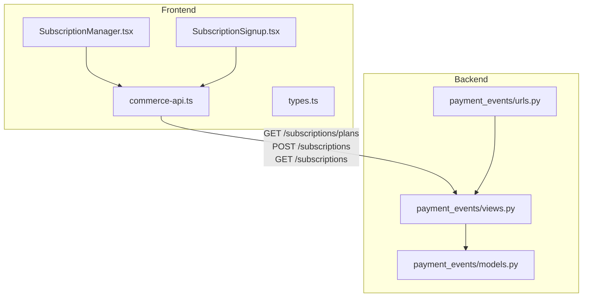
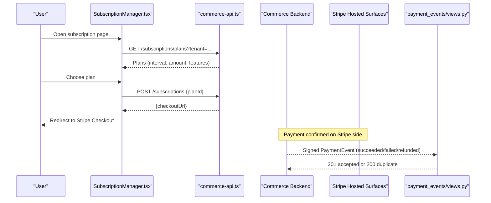
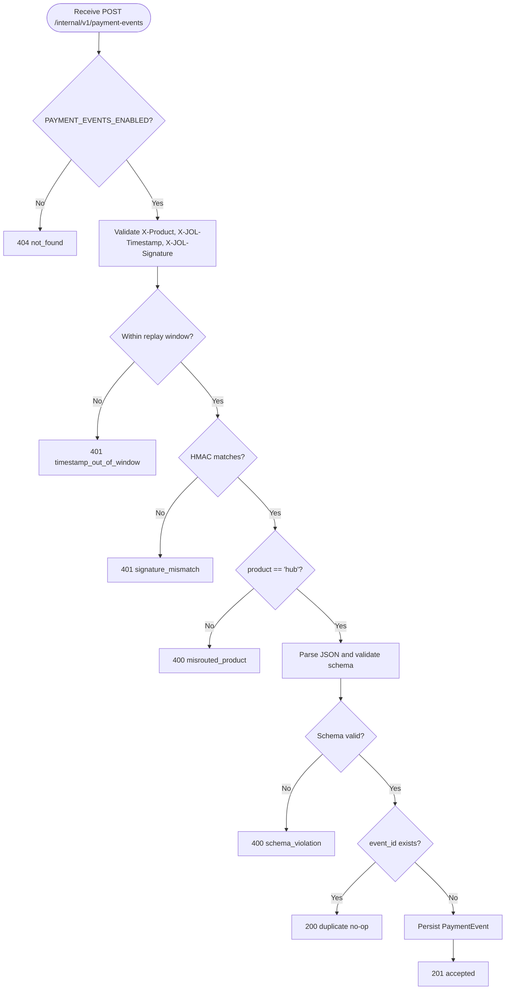
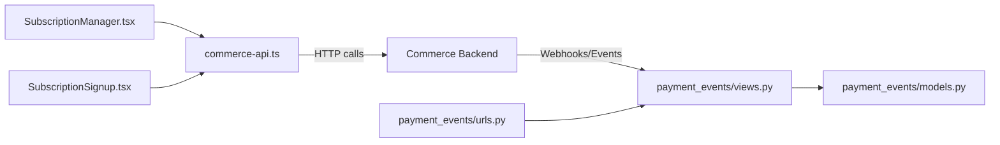

# Subscription Handling

<cite>
**Referenced Files in This Document**
- [commerce-api.ts](file://frontend/packages/commerce/src/commerce-api.ts)
- [types.ts](file://frontend/packages/commerce/src/types.ts)
- [SubscriptionManager.tsx](file://frontend/apps/template-renderer/src/components/commerce/SubscriptionManager.tsx)
- [SubscriptionSignup.tsx](file://frontend/apps/parish-template/src/app/templates/cemetery/_components/SubscriptionSignup.tsx)
- [views.py](file://backend/django/apps/payment_events/views.py)
- [models.py](file://backend/django/apps/payment_events/models.py)
- [urls.py](file://backend/django/apps/payment_events/urls.py)
- [payment-api-contract.md](file://docs/payment-api-contract.md)
</cite>

## Table of Contents
1. [Introduction](#introduction)
2. [Project Structure](#project-structure)
3. [Core Components](#core-components)
4. [Architecture Overview](#architecture-overview)
5. [Detailed Component Analysis](#detailed-component-analysis)
6. [Dependency Analysis](#dependency-analysis)
7. [Performance Considerations](#performance-considerations)
8. [Troubleshooting Guide](#troubleshooting-guide)
9. [Conclusion](#conclusion)

## Introduction
This document explains the subscription handling implemented across the frontend and backend. It covers how subscriptions are discovered, created, and managed; how recurring payments are initiated via Stripe-hosted surfaces; how the hub receives payment events; and how to build forms, manage states, and handle events such as renewals and failures. The design follows a strict payment boundary: the hub never hosts card data (SAQ A), and all payment intent creation and confirmation occur on Stripe-hosted surfaces or through a dedicated commerce backend.

## Project Structure
Subscription-related code spans two layers:
- Frontend: Commerce API client and UI components that list plans, start subscriptions, and display status.
- Backend: A secure receiver for signed payment events from external payment sources, with durable storage and idempotent processing.

**Diagram sources**
- [SubscriptionManager.tsx:1-108](file://frontend/apps/template-renderer/src/components/commerce/SubscriptionManager.tsx#L1-L108)
- [SubscriptionSignup.tsx:36-90](file://frontend/apps/parish-template/src/app/templates/cemetery/_components/SubscriptionSignup.tsx#L36-L90)
- [commerce-api.ts:179-202](file://frontend/packages/commerce/src/commerce-api.ts#L179-L202)
- [types.ts:117-134](file://frontend/packages/commerce/src/types.ts#L117-L134)
- [views.py:79-143](file://backend/django/apps/payment_events/views.py#L79-L143)
- [models.py:1-36](file://backend/django/apps/payment_events/models.py#L1-L36)
- [urls.py:1-10](file://backend/django/apps/payment_events/urls.py#L1-L10)

**Section sources**
- [commerce-api.ts:1-203](file://frontend/packages/commerce/src/commerce-api.ts#L1-L203)
- [SubscriptionManager.tsx:1-108](file://frontend/apps/template-renderer/src/components/commerce/SubscriptionManager.tsx#L1-L108)
- [SubscriptionSignup.tsx:36-222](file://frontend/apps/parish-template/src/app/templates/cemetery/_components/SubscriptionSignup.tsx#L36-L222)
- [views.py:1-144](file://backend/django/apps/payment_events/views.py#L1-L144)
- [models.py:1-36](file://backend/django/apps/payment_events/models.py#L1-L36)
- [urls.py:1-10](file://backend/django/apps/payment_events/urls.py#L1-L10)

## Core Components
- Subscription plan model and state types define plan intervals, amounts, and subscription lifecycle states.
- Commerce API client exposes endpoints to list plans, create subscriptions, and fetch active subscriptions.
- UI components render plan selection and initiate checkout redirects to Stripe-hosted flows.
- Payment event receiver validates, deduplicates, and stores signed payment events for downstream processing.

Key responsibilities:
- Plan discovery and display: GET /subscriptions/plans
- Subscription creation: POST /subscriptions returns a Stripe Checkout/Billing Portal URL
- Active subscription query: GET /subscriptions
- Event ingestion: POST /internal/v1/payment-events (signed envelope)

**Section sources**
- [types.ts:117-134](file://frontend/packages/commerce/src/types.ts#L117-L134)
- [commerce-api.ts:179-202](file://frontend/packages/commerce/src/commerce-api.ts#L179-L202)
- [views.py:79-143](file://backend/django/apps/payment_events/views.py#L79-L143)

## Architecture Overview
The subscription flow is split into three phases:
- Discovery and selection: Frontend lists plans and presents options.
- Creation and payment: Frontend requests a checkout URL and redirects users to Stripe-hosted surfaces.
- Event handling: External payment systems send signed events to the hub’s receiver, which persists them idempotently.

**Diagram sources**
- [SubscriptionManager.tsx:33-47](file://frontend/apps/template-renderer/src/components/commerce/SubscriptionManager.tsx#L33-L47)
- [commerce-api.ts:183-202](file://frontend/packages/commerce/src/commerce-api.ts#L183-L202)
- [views.py:79-143](file://backend/django/apps/payment_events/views.py#L79-L143)

## Detailed Component Analysis

### Subscription Types and Lifecycle
- SubscriptionPlan includes interval (month/year), VAT-inclusive amount in cents, and feature list.
- Subscription tracks tenant association, plan reference, lifecycle state (active, past_due, cancelled, trialing), and current period end.

These types drive UI rendering and state management without exposing sensitive payment details.

**Section sources**
- [types.ts:117-134](file://frontend/packages/commerce/src/types.ts#L117-L134)

### Commerce API Client for Subscriptions
- getSubscriptionPlans: Lists available plans scoped by tenant.
- createSubscription: Starts a subscription and returns a Stripe-hosted checkout URL.
- getSubscription: Retrieves the active subscription for management UIs.

The client enforces SAQ A compliance by never transmitting card data and by delegating payment to Stripe-hosted surfaces.

**Section sources**
- [commerce-api.ts:179-202](file://frontend/packages/commerce/src/commerce-api.ts#L179-L202)

### Subscription Manager UI
- Loads plans when the tenant has the subscriptions capability and commerce is configured.
- Displays plan name, interval, formatted price, and features.
- Provides a “Choose plan” action that triggers a redirect to Stripe Checkout (pilot wiring deferred).

**Section sources**
- [SubscriptionManager.tsx:1-108](file://frontend/apps/template-renderer/src/components/commerce/SubscriptionManager.tsx#L1-L108)

### Cemetery Subscription Signup Form
- Collects service selection, grave size, frequency, and customer details.
- Computes monthly price based on configuration and submits a request to create a subscription session.
- On success, redirects the user to complete payment securely.

**Section sources**
- [SubscriptionSignup.tsx:36-90](file://frontend/apps/parish-template/src/app/templates/cemetery/_components/SubscriptionSignup.tsx#L36-L90)
- [SubscriptionSignup.tsx:194-222](file://frontend/apps/parish-template/src/app/templates/cemetery/_components/SubscriptionSignup.tsx#L194-L222)

### Payment Events Receiver
- Validates headers, timestamp window, HMAC signature, product routing, and schema whitelist.
- Deduplicates by event_id and persists accepted envelopes before any downstream processing.
- Returns idempotent responses: 201 accepted, 200 duplicate, 4xx for invalid input, 5xx for unavailability.

**Diagram sources**
- [views.py:79-143](file://backend/django/apps/payment_events/views.py#L79-L143)

**Section sources**
- [views.py:1-144](file://backend/django/apps/payment_events/views.py#L1-L144)
- [models.py:1-36](file://backend/django/apps/payment_events/models.py#L1-L36)
- [urls.py:1-10](file://backend/django/apps/payment_events/urls.py#L1-L10)
- [payment-api-contract.md:192-236](file://docs/payment-api-contract.md#L192-L236)

## Dependency Analysis
- Frontend components depend on the commerce API client for plan retrieval and subscription creation.
- The commerce API client depends on environment configuration to determine whether the commerce backend is available.
- The backend receiver depends on settings flags and keys to enable/disable ingestion and verify signatures.
- The receiver persists events using the PaymentEvent model and routes via urls.py.

**Diagram sources**
- [SubscriptionManager.tsx:33-47](file://frontend/apps/template-renderer/src/components/commerce/SubscriptionManager.tsx#L33-L47)
- [commerce-api.ts:54-63](file://frontend/packages/commerce/src/commerce-api.ts#L54-L63)
- [views.py:79-143](file://backend/django/apps/payment_events/views.py#L79-L143)
- [models.py:1-36](file://backend/django/apps/payment_events/models.py#L1-L36)
- [urls.py:1-10](file://backend/django/apps/payment_events/urls.py#L1-L10)

**Section sources**
- [commerce-api.ts:1-203](file://frontend/packages/commerce/src/commerce-api.ts#L1-L203)
- [views.py:1-144](file://backend/django/apps/payment_events/views.py#L1-L144)

## Performance Considerations
- GET requests in the commerce client retry with backoff to improve resilience during transient failures.
- Mutation requests (e.g., creating subscriptions) are not retried automatically to avoid duplicate charges.
- The payment event receiver performs fast validation and uses unique indexes on event_id to ensure efficient deduplication.
- Persist-before-process ensures durability even if downstream fulfillment is delayed or disabled.

[No sources needed since this section provides general guidance]

## Troubleshooting Guide
Common issues and resolutions:
- Commerce backend not configured: The client returns an unconfigured result; UI should show a “coming soon” message rather than failing loudly.
- Invalid or missing headers on payment events: Ensure X-Product, X-JOL-Timestamp, and X-JOL-Signature are present and correct.
- Signature mismatch: Verify the delivery key and HMAC computation on the sender side.
- Timestamp out of window: Align sender timestamps within the configured replay window.
- Misrouted product: Only events with product "hub" are accepted by this receiver.
- Schema violations: Ensure all required fields match the contract and types.

Operational checks:
- Confirm PAYMENT_EVENTS_ENABLED flag controls endpoint exposure.
- Ensure HUB_PAYMENT_DELIVERY_KEY is provisioned; otherwise, the receiver responds with unavailability.
- Inspect persisted PaymentEvent records to confirm acceptance and deduplication behavior.

**Section sources**
- [commerce-api.ts:54-84](file://frontend/packages/commerce/src/commerce-api.ts#L54-L84)
- [views.py:79-143](file://backend/django/apps/payment_events/views.py#L79-L143)
- [test_receiver.py:62-121](file://backend/django/apps/payment_events/test_receiver.py#L62-L121)

## Conclusion
The subscription system separates concerns cleanly:
- Frontend focuses on plan presentation and initiating secure checkout flows.
- Backend provides a hardened, idempotent receiver for payment events with strong validation and durable storage.
This architecture supports recurring billing, trial periods, upgrades/downgrades, and robust error handling while maintaining a strict payment boundary and compliance posture.

[No sources needed since this section summarizes without analyzing specific files]