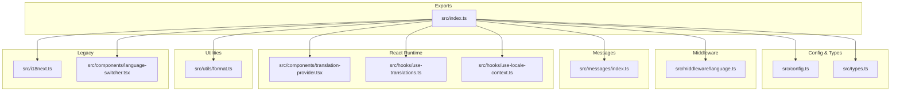
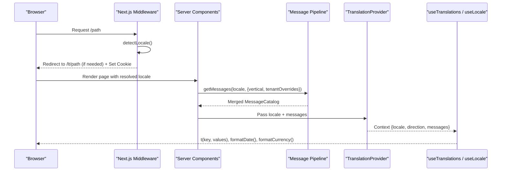
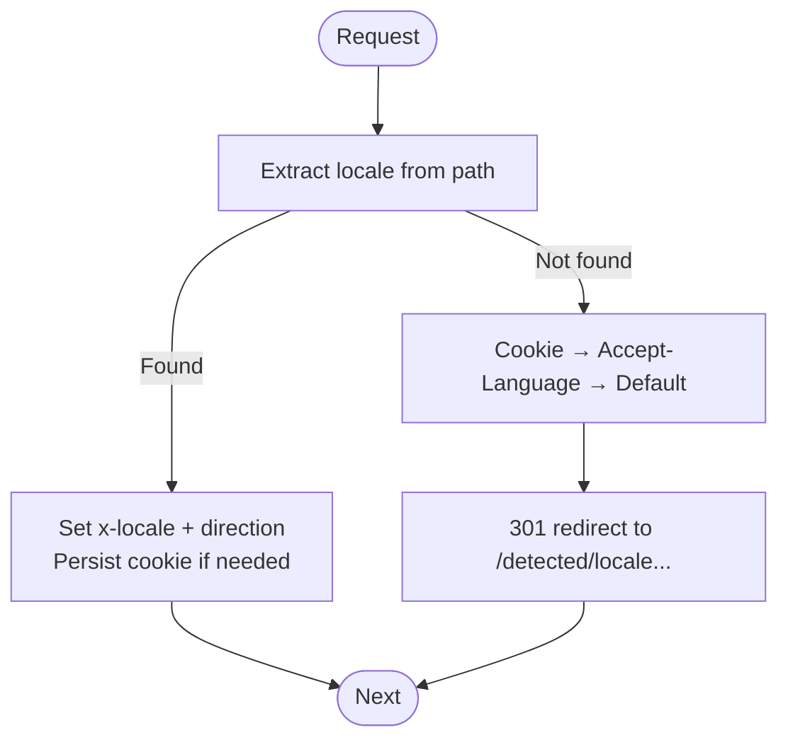
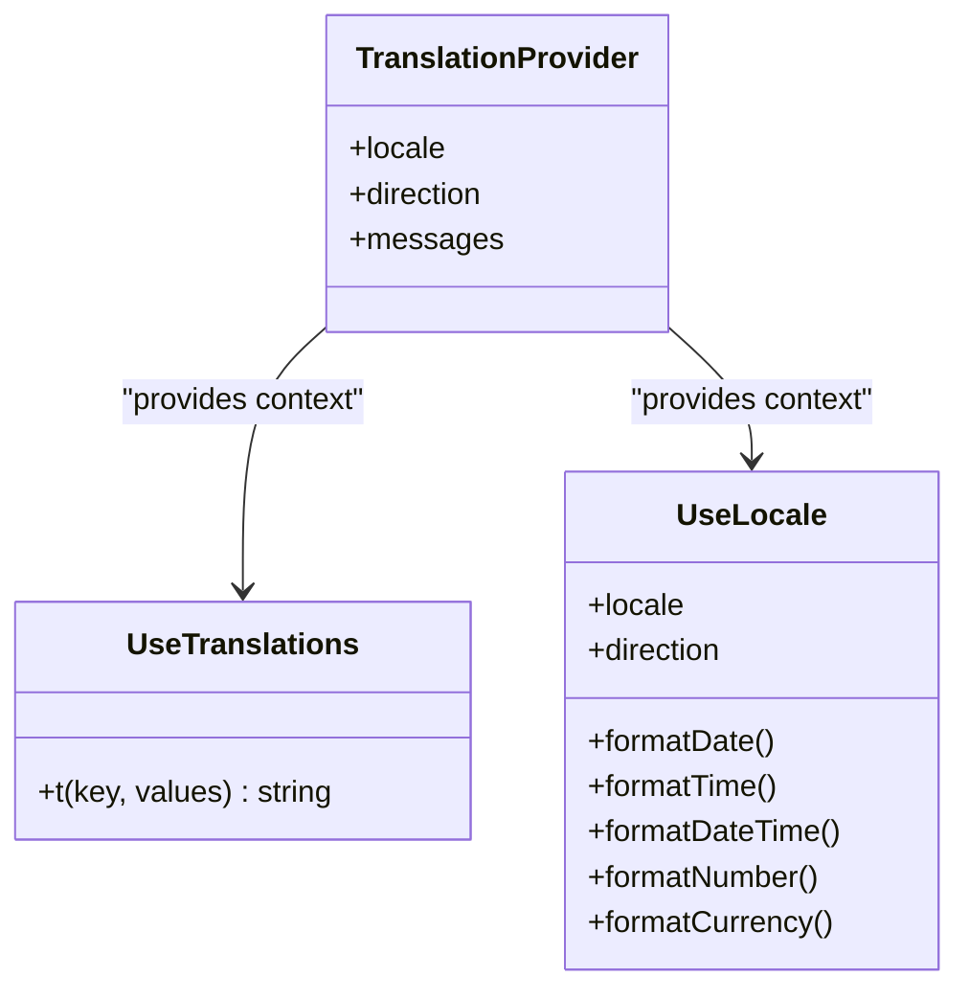
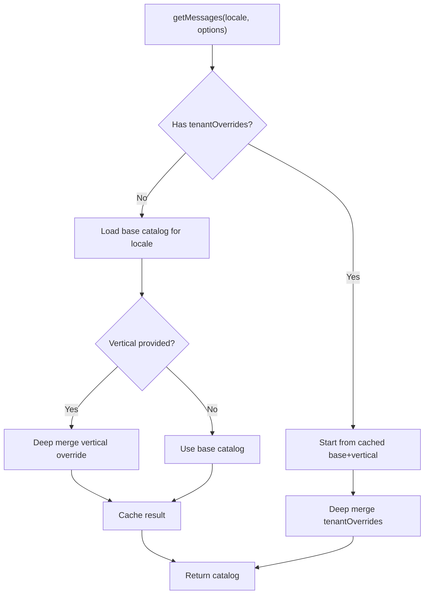
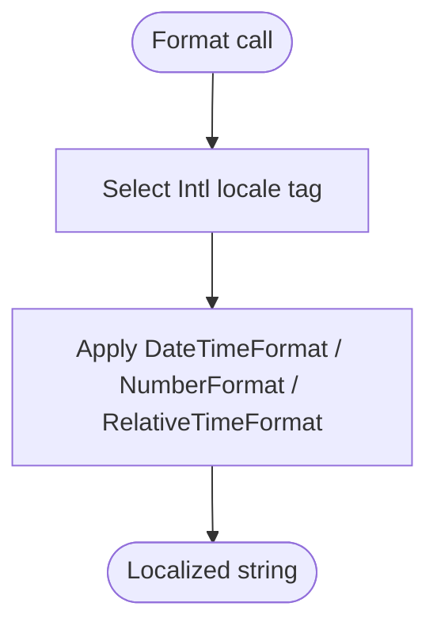
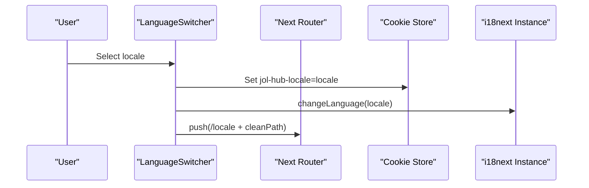
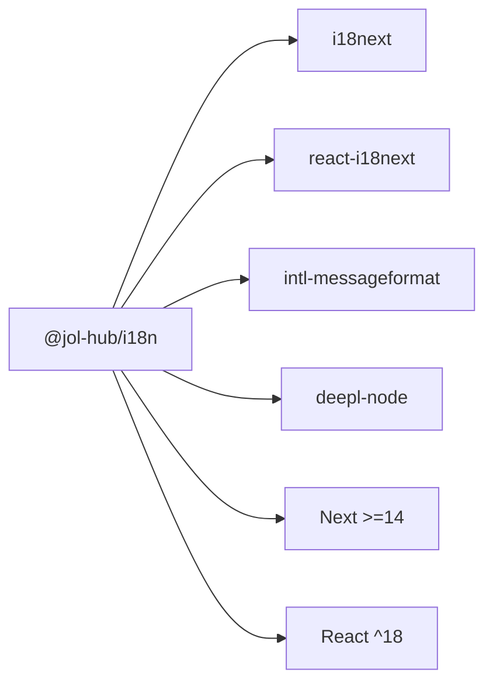

# Internationalization Package

<cite>
**Referenced Files in This Document**
- [README.md](file://frontend/packages/i18n/README.md)
- [package.json](file://frontend/packages/i18n/package.json)
- [index.ts](file://frontend/packages/i18n/src/index.ts)
- [config.ts](file://frontend/packages/i18n/src/config.ts)
- [i18next.ts](file://frontend/packages/i18n/src/i18next.ts)
- [messages/index.ts](file://frontend/packages/i18n/src/messages/index.ts)
- [types.ts](file://frontend/packages/i18n/src/types.ts)
- [components/translation-provider.tsx](file://frontend/packages/i18n/src/components/translation-provider.tsx)
- [hooks/use-translations.ts](file://frontend/packages/i18n/src/hooks/use-translations.ts)
- [hooks/use-locale-context.ts](file://frontend/packages/i18n/src/hooks/use-locale-context.ts)
- [utils/format.ts](file://frontend/packages/i18n/src/utils/format.ts)
- [middleware/language.ts](file://frontend/packages/i18n/src/middleware/language.ts)
- [components/language-switcher.tsx](file://frontend/packages/i18n/src/components/language-switcher.tsx)
</cite>

## Table of Contents
1. Introduction
2. Project Structure
3. Core Components
4. Architecture Overview
5. Detailed Component Analysis
6. Dependency Analysis
7. Performance Considerations
8. Troubleshooting Guide
9. Conclusion

## Introduction
This document describes the internationalization package that enables multi-language support across applications. It covers language switching, translation management, locale detection, pluralization and interpolation, adding new languages, managing translation files, right-to-left text direction, formatting dates and numbers per locale, dynamic content localization, performance considerations, and caching strategies.

The package supports a locale-prefixed routing strategy (for example /lt/, /en/, /ru/) with a clear detection priority: URL path prefix, cookie, query parameter, Accept-Language header, and default fallback. It provides both a modern ICU-based pipeline for server and client rendering and a legacy i18next runtime retained for compatibility.

**Section sources**
- [README.md:10-40](file://frontend/packages/i18n/README.md#L10-L40)
- [README.md:42-70](file://frontend/packages/i18n/README.md#L42-L70)

## Project Structure
The package is organized into configuration, middleware, message catalogs, React components and hooks, utilities, and exports. Key responsibilities:
- Configuration and constants define supported locales, prefixes, cookies, and fallback order.
- Middleware resolves locale from request context and sets headers and cookies.
- Message catalogs provide namespaces and vertical overrides; they are merged to produce an effective catalog.
- React provider and hooks deliver locale-aware translations and formatters to components.
- Utilities format dates, times, numbers, currencies, and relative time using Intl APIs.
- The index barrel exposes public APIs for server, client, middleware, and utilities.

**Diagram sources**
- [index.ts:11-146](file://frontend/packages/i18n/src/index.ts#L11-L146)
- [config.ts:18-73](file://frontend/packages/i18n/src/config.ts#L18-L73)
- [types.ts:42-77](file://frontend/packages/i18n/src/types.ts#L42-L77)
- [middleware/language.ts:28-166](file://frontend/packages/i18n/src/middleware/language.ts#L28-L166)
- [messages/index.ts:26-119](file://frontend/packages/i18n/src/messages/index.ts#L26-L119)
- [components/translation-provider.tsx:19-41](file://frontend/packages/i18n/src/components/translation-provider.tsx#L19-L41)
- [hooks/use-translations.ts:22-52](file://frontend/packages/i18n/src/hooks/use-translations.ts#L22-L52)
- [hooks/use-locale-context.ts:22-59](file://frontend/packages/i18n/src/hooks/use-locale-context.ts#L22-L59)
- [utils/format.ts:6-108](file://frontend/packages/i18n/src/utils/format.ts#L6-L108)
- [i18next.ts:30-80](file://frontend/packages/i18n/src/i18next.ts#L30-L80)
- [components/language-switcher.tsx:106-205](file://frontend/packages/i18n/src/components/language-switcher.tsx#L106-L205)

**Section sources**
- [index.ts:11-146](file://frontend/packages/i18n/src/index.ts#L11-L146)
- [package.json:1-105](file://frontend/packages/i18n/package.json#L1-L105)

## Core Components
- Locale resolution and routing:
  - Detects locale from URL path, cookie, browser header, or defaults to Lithuanian.
  - Sets response headers and cookies to persist user choice.
- Translation provider and hooks:
  - Provides locale, text direction, and merged message catalog via React context.
  - Exposes useTranslations for ICU interpolation and pluralization.
  - Exposes useLocale for date/time/number/currency formatting and direction.
- Message pipeline:
  - Loads base catalogs per locale and merges vertical overrides and tenant-specific overrides.
  - Caches merged catalogs by locale and vertical for performance.
- Formatting utilities:
  - Formats dates, times, numbers, currencies, and relative time using Intl APIs with canonical region tags.
- Legacy i18next runtime:
  - Retained for parish-template compatibility; initializes resources and language detection.

**Section sources**
- [middleware/language.ts:113-166](file://frontend/packages/i18n/src/middleware/language.ts#L113-L166)
- [components/translation-provider.tsx:19-41](file://frontend/packages/i18n/src/components/translation-provider.tsx#L19-L41)
- [hooks/use-translations.ts:22-52](file://frontend/packages/i18n/src/hooks/use-translations.ts#L22-L52)
- [hooks/use-locale-context.ts:22-59](file://frontend/packages/i18n/src/hooks/use-locale-context.ts#L22-L59)
- [messages/index.ts:26-119](file://frontend/packages/i18n/src/messages/index.ts#L26-L119)
- [utils/format.ts:6-108](file://frontend/packages/i18n/src/utils/format.ts#L6-L108)
- [i18next.ts:30-80](file://frontend/packages/i18n/src/i18next.ts#L30-L80)

## Architecture Overview
The system combines server-side locale detection and catalog assembly with client-side rendering through React context and hooks.

**Diagram sources**
- [middleware/language.ts:113-166](file://frontend/packages/i18n/src/middleware/language.ts#L113-L166)
- [messages/index.ts:99-119](file://frontend/packages/i18n/src/messages/index.ts#L99-L119)
- [components/translation-provider.tsx:34-41](file://frontend/packages/i18n/src/components/translation-provider.tsx#L34-L41)
- [hooks/use-translations.ts:22-52](file://frontend/packages/i18n/src/hooks/use-translations.ts#L22-L52)
- [hooks/use-locale-context.ts:32-59](file://frontend/packages/i18n/src/hooks/use-locale-context.ts#L32-L59)

## Detailed Component Analysis

### Locale Detection and Routing (Middleware)
- Priority: URL path prefix → cookie → Accept-Language header → default.
- Behavior:
  - If no locale prefix exists, redirects to the detected locale path.
  - Sets x-locale and direction headers for downstream use.
  - Persists locale in a cookie for subsequent requests.
- RTL readiness:
  - Placeholder list for RTL locales; currently all supported locales are LTR.

**Diagram sources**
- [middleware/language.ts:58-130](file://frontend/packages/i18n/src/middleware/language.ts#L58-L130)
- [middleware/language.ts:188-249](file://frontend/packages/i18n/src/middleware/language.ts#L188-L249)

**Section sources**
- [middleware/language.ts:28-166](file://frontend/packages/i18n/src/middleware/language.ts#L28-L166)
- [middleware/language.ts:188-249](file://frontend/packages/i18n/src/middleware/language.ts#L188-L249)

### Translation Provider and Hooks
- TranslationProvider supplies locale, direction, and the merged message catalog to the React tree.
- useTranslations(namespace) returns a function t(key, values) that:
  - Resolves namespaced keys.
  - Returns missing keys as-is for visibility.
  - Uses IntlMessageFormat for interpolation and pluralization with per-key caching.
- useLocale() returns locale, direction, and bound formatters for dates, times, numbers, and currency.

**Diagram sources**
- [components/translation-provider.tsx:19-41](file://frontend/packages/i18n/src/components/translation-provider.tsx#L19-L41)
- [hooks/use-translations.ts:22-52](file://frontend/packages/i18n/src/hooks/use-translations.ts#L22-L52)
- [hooks/use-locale-context.ts:22-59](file://frontend/packages/i18n/src/hooks/use-locale-context.ts#L22-L59)

**Section sources**
- [components/translation-provider.tsx:19-41](file://frontend/packages/i18n/src/components/translation-provider.tsx#L19-L41)
- [hooks/use-translations.ts:22-52](file://frontend/packages/i18n/src/hooks/use-translations.ts#L22-L52)
- [hooks/use-locale-context.ts:22-59](file://frontend/packages/i18n/src/hooks/use-locale-context.ts#L22-L59)

### Message Pipeline and Vertical Overrides
- Base catalogs are loaded per locale; vertical overrides (church, funeral, cleaning) merge on top.
- Tenant-specific overrides can be applied last, replacing existing keys.
- A cache stores merged catalogs keyed by locale and vertical to avoid repeated merges.
- Server-safe functions translate plain strings and interpolate ICU messages when needed.

**Diagram sources**
- [messages/index.ts:26-119](file://frontend/packages/i18n/src/messages/index.ts#L26-L119)

**Section sources**
- [messages/index.ts:26-119](file://frontend/packages/i18n/src/messages/index.ts#L26-L119)

### Formatting Dates, Numbers, and Currency
- All formatting uses Intl APIs with canonical region tags for each locale.
- Direction is derived from locale; currently all supported locales are LTR.
- Relative time formatting is available for localized “ago” strings.

**Diagram sources**
- [utils/format.ts:6-108](file://frontend/packages/i18n/src/utils/format.ts#L6-L108)

**Section sources**
- [utils/format.ts:6-108](file://frontend/packages/i18n/src/utils/format.ts#L6-L108)

### Language Switching UI
- LanguageSwitcher persists selection to a cookie, updates the i18next instance, and navigates to the locale-prefixed route.
- Supports dropdown and inline variants with keyboard navigation and accessibility attributes.
- Compact variant provides a select element for constrained spaces.

**Diagram sources**
- [components/language-switcher.tsx:106-205](file://frontend/packages/i18n/src/components/language-switcher.tsx#L106-L205)

**Section sources**
- [components/language-switcher.tsx:106-205](file://frontend/packages/i18n/src/components/language-switcher.tsx#L106-L205)

### Adding New Languages
To add a new language:
- Add message files under src/locales/<code>/ for common, liturgical, gdpr namespaces.
- Add vertical overrides under src/messages/verticals/<code>/ if needed.
- Update SUPPORTED_LOCALES and LOCALE_CONFIGS in types.ts.
- Ensure config constants like LOCALE_PREFIXES, LOCALE_HREFLANG, and FALLBACK_ORDER include the new code.
- Run parity checks to ensure key consistency across locales.

**Section sources**
- [types.ts:42-77](file://frontend/packages/i18n/src/types.ts#L42-L77)
- [config.ts:26-73](file://frontend/packages/i18n/src/config.ts#L26-L73)
- [README.md:80-87](file://frontend/packages/i18n/README.md#L80-L87)

### Managing Translation Files
- Base catalogs live under src/locales/<locale>/ and are consumed by the legacy i18next runtime.
- The modern pipeline loads base catalogs from src/messages/<locale>.json and merges vertical overrides.
- Vertical overrides replace keys only; CI enforces parity so new keys must exist across locales.

**Section sources**
- [i18next.ts:13-28](file://frontend/packages/i18n/src/i18next.ts#L13-L28)
- [messages/index.ts:14-39](file://frontend/packages/i18n/src/messages/index.ts#L14-L39)
- [README.md:42-62](file://frontend/packages/i18n/README.md#L42-L62)

### Right-to-Left Text Direction
- Direction is computed per locale; currently all supported locales are LTR.
- RTL support is prepared via helper functions and a placeholder list for future RTL locales.
- CSS logical properties should be used throughout the design system to handle direction changes.

**Section sources**
- [utils/format.ts:92-95](file://frontend/packages/i18n/src/utils/format.ts#L92-L95)
- [middleware/language.ts:145-166](file://frontend/packages/i18n/src/middleware/language.ts#L145-L166)
- [README.md:63-70](file://frontend/packages/i18n/README.md#L63-L70)

### Dynamic Content Localization
- Server components can fetch the effective catalog via getMessages and render localized metadata or content without hooks.
- For interpolated content, use translateWithValues to apply ICU formatting server-side.
- Client components use useTranslations for dynamic, parameterized strings with pluralization.

**Section sources**
- [messages/index.ts:121-153](file://frontend/packages/i18n/src/messages/index.ts#L121-L153)
- [hooks/use-translations.ts:22-52](file://frontend/packages/i18n/src/hooks/use-translations.ts#L22-L52)

## Dependency Analysis
The package’s dependencies include i18next and react-i18next for the legacy runtime, intl-messageformat for ICU formatting, and Deepl integrations for translation assistance. The index barrel selectively re-exports server-safe modules to keep client-only code out of server bundles.

**Diagram sources**
- [package.json:83-103](file://frontend/packages/i18n/package.json#L83-L103)

**Section sources**
- [package.json:1-105](file://frontend/packages/i18n/package.json#L1-L105)
- [index.ts:11-146](file://frontend/packages/i18n/src/index.ts#L11-L146)

## Performance Considerations
- Catalog merging is cached by locale and vertical to avoid repeated deep merges.
- ICU formatters are cached per key within useTranslations to reduce instantiation overhead.
- Middleware avoids processing static assets and API routes to minimize edge runtime work.
- Prefer server-side catalog resolution for metadata and initial renders to reduce client bundle size.
- Use the modern ICU pipeline instead of the legacy i18next runtime where possible to keep bundles lean.

[No sources needed since this section provides general guidance]

## Troubleshooting Guide
- Missing translation keys:
  - Missing keys render as the key path in the UI, which helps identify gaps during development.
  - CI runs parity checks to enforce consistent keys across locales and prevent inventing new keys in overrides.
- Locale not applied:
  - Verify URL path prefix, cookie presence, and Accept-Language header.
  - Ensure middleware matcher excludes only necessary paths and that redirects set cookies correctly.
- Pluralization issues:
  - Confirm ICU syntax in message patterns and that values include count fields for plural forms.
- Formatting inconsistencies:
  - Ensure you pass canonical region tags via the locale mapping and use the provided formatters.

**Section sources**
- [hooks/use-translations.ts:35-47](file://frontend/packages/i18n/src/hooks/use-translations.ts#L35-L47)
- [README.md:80-87](file://frontend/packages/i18n/README.md#L80-L87)
- [middleware/language.ts:188-249](file://frontend/packages/i18n/src/middleware/language.ts#L188-L249)

## Conclusion
The internationalization package provides a robust, scalable foundation for multi-language support with clear separation between server-side locale resolution and client-side rendering. It offers a modern ICU-based pipeline with strong caching, flexible message merging, and comprehensive formatting utilities. The legacy i18next runtime remains available for compatibility. By following the outlined processes for adding languages, managing translations, and handling direction and formatting, teams can localize applications efficiently while maintaining performance and accessibility.

[No sources needed since this section summarizes without analyzing specific files]