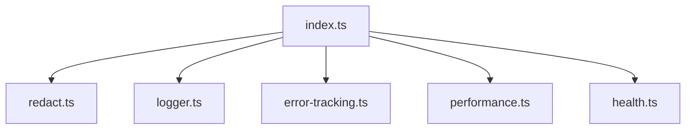
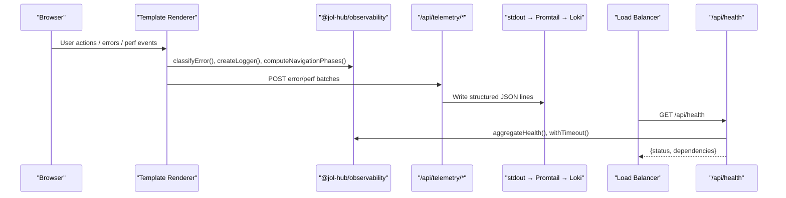
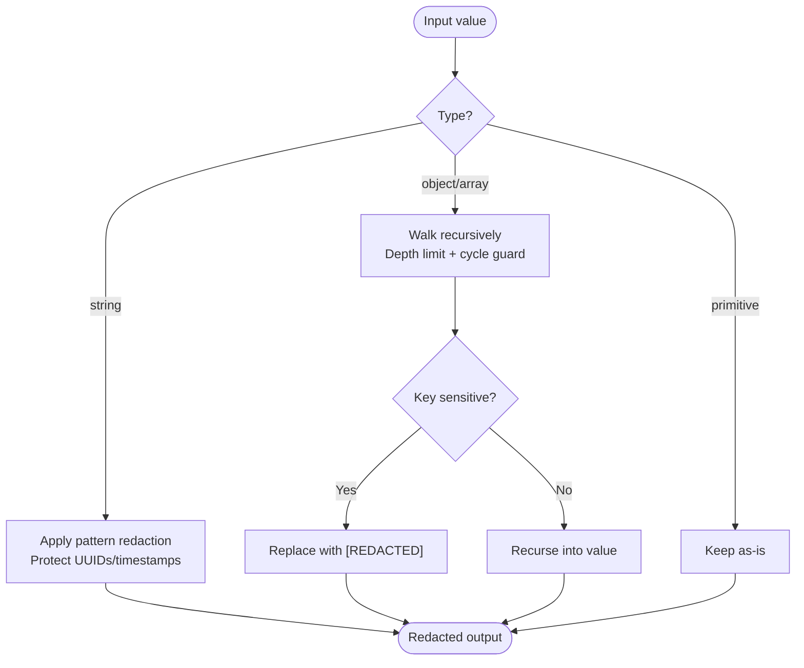
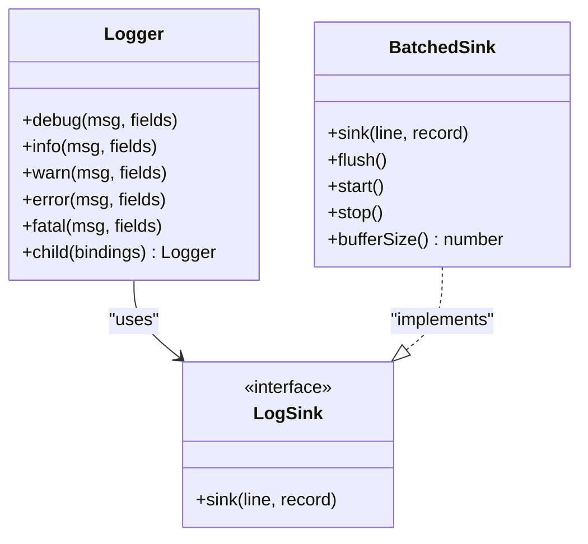
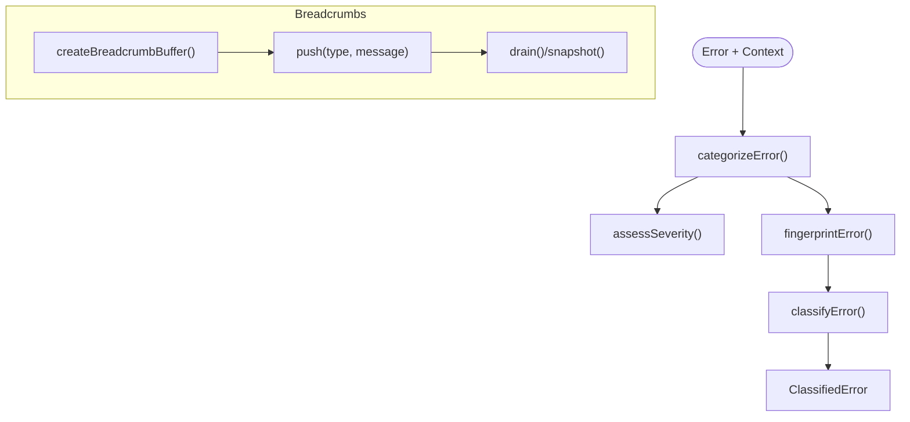
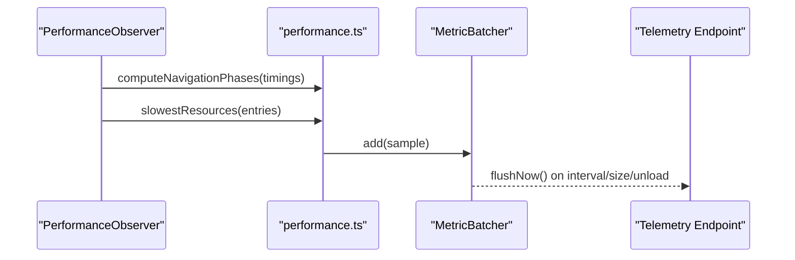
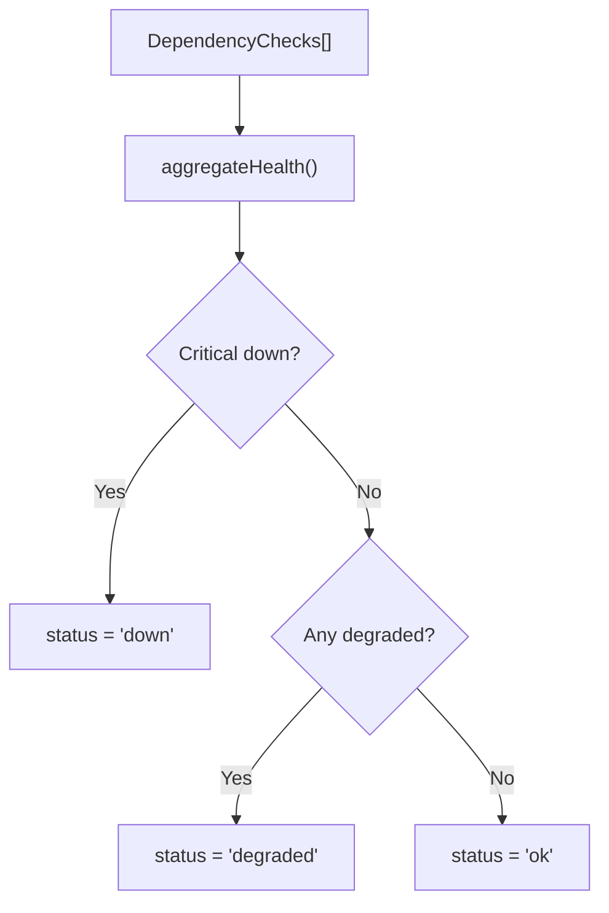
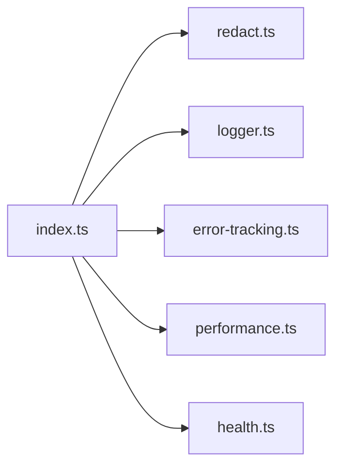

# Observability Package

<cite>
**Referenced Files in This Document**
- [package.json](file://frontend/packages/observability/package.json)
- [index.ts](file://frontend/packages/observability/src/index.ts)
- [logger.ts](file://frontend/packages/observability/src/logger.ts)
- [error-tracking.ts](file://frontend/packages/observability/src/error-tracking.ts)
- [performance.ts](file://frontend/packages/observability/src/performance.ts)
- [health.ts](file://frontend/packages/observability/src/health.ts)
- [redact.ts](file://frontend/packages/observability/src/redact.ts)
- [observability.test.ts](file://frontend/packages/observability/src/__tests__/observability.test.ts)
- [OBSERVABILITY.md](file://frontend/apps/template-renderer/OBSERVABILITY.md)
- [route.ts](file://frontend/apps/template-renderer/src/app/api/health/route.ts)
</cite>

## Table of Contents
1. [Introduction](#introduction)
2. [Project Structure](#project-structure)
3. [Core Components](#core-components)
4. [Architecture Overview](#architecture-overview)
5. [Detailed Component Analysis](#detailed-component-analysis)
6. [Dependency Analysis](#dependency-analysis)
7. [Performance Considerations](#performance-considerations)
8. [Troubleshooting Guide](#troubleshooting-guide)
9. [Conclusion](#conclusion)
10. [Appendices](#appendices)

## Introduction
This document provides comprehensive documentation for the observability package that powers monitoring, logging, error tracking, performance metrics, and health aggregation for the frontend applications. It explains how to implement custom metrics, track user interactions via breadcrumbs, monitor application health, set up error boundaries, capture user feedback, and integrate with external monitoring services. It also covers privacy considerations and GDPR compliance for user data collection.

The package is intentionally vendor-neutral and zero-dependency, enabling safe usage across Node.js, browser, and Next.js edge environments.

## Project Structure
The observability package is a pure logic library exported from a single entry point. It exposes modules for:
- PII redaction (redact)
- Structured logging with batching (logger)
- Error classification, severity assessment, fingerprinting, and breadcrumbs (error-tracking)
- Performance timing and metric batching (performance)
- Health check aggregation and timed probes (health)

**Diagram sources**
- [index.ts:13-60](file://frontend/packages/observability/src/index.ts#L13-L60)

**Section sources**
- [package.json:1-30](file://frontend/packages/observability/package.json#L1-L30)
- [index.ts:1-61](file://frontend/packages/observability/src/index.ts#L1-L61)

## Core Components
- Redaction: Deep, pattern-based and key-based redaction ensures no PII or secrets reach sinks. Protects traceability fields like UUIDs and ISO timestamps.
- Logger: JSON-lines logger with level gating, child bindings, and client-side batching sink that flushes on errors and intervals.
- Error Tracking: Categorizes errors (network, auth, commerce, rendering, security, unknown), assesses severity, generates stable fingerprints, and maintains bounded breadcrumb buffers.
- Performance: Computes navigation phase timings, identifies slow resources, and batches API latency samples.
- Health: Aggregates dependency checks into an overall status and provides timeout-safe probing utilities.

**Section sources**
- [redact.ts:1-131](file://frontend/packages/observability/src/redact.ts#L1-L131)
- [logger.ts:1-173](file://frontend/packages/observability/src/logger.ts#L1-L173)
- [error-tracking.ts:1-172](file://frontend/packages/observability/src/error-tracking.ts#L1-L172)
- [performance.ts:1-133](file://frontend/packages/observability/src/performance.ts#L1-L133)
- [health.ts:1-90](file://frontend/packages/observability/src/health.ts#L1-L90)

## Architecture Overview
The package integrates with the template renderer to provide end-to-end observability:
- Client emits structured logs, error reports, and performance metrics.
- Telemetry endpoints forward data to structured logs (stdout → Promtail → Loki).
- Health endpoint aggregates dependency checks for load balancer probes.
- Alerts and dashboards consume these signals.

**Diagram sources**
- [OBSERVABILITY.md:7-29](file://frontend/apps/template-renderer/OBSERVABILITY.md#L7-L29)
- [route.ts:1-26](file://frontend/apps/template-renderer/src/app/api/health/route.ts#L1-L26)
- [health.ts:39-63](file://frontend/packages/observability/src/health.ts#L39-L63)
- [logger.ts:67-108](file://frontend/packages/observability/src/logger.ts#L67-L108)
- [performance.ts:98-132](file://frontend/packages/observability/src/performance.ts#L98-L132)

## Detailed Component Analysis

### Redaction (PII and Secrets)
- Key-based redaction replaces values for sensitive keys (password, token, secret, authorization, cookie, card, ssn, etc.).
- Pattern-based redaction removes emails, JWTs, bearer tokens, AWS keys, card numbers, and phone numbers from free text.
- Traceability fields (UUIDs, ISO timestamps) are protected so they survive redaction.
- Safe recursion with depth limits and circular reference handling.

**Diagram sources**
- [redact.ts:18-57](file://frontend/packages/observability/src/redact.ts#L18-L57)
- [redact.ts:63-88](file://frontend/packages/observability/src/redact.ts#L63-L88)
- [redact.ts:90-131](file://frontend/packages/observability/src/redact.ts#L90-L131)

**Section sources**
- [redact.ts:1-131](file://frontend/packages/observability/src/redact.ts#L1-L131)
- [observability.test.ts:36-109](file://frontend/packages/observability/src/__tests__/observability.test.ts#L36-L109)

### Logger and Batching Sink
- Produces one JSON object per line with required fields (time, level, msg, service).
- Level gating enforces production safety (no debug in production).
- Child loggers merge context (tenant, requestId, page).
- Client batching sink buffers records, flushes immediately on error/fatal, and periodically otherwise.

**Diagram sources**
- [logger.ts:17-58](file://frontend/packages/observability/src/logger.ts#L17-L58)
- [logger.ts:122-172](file://frontend/packages/observability/src/logger.ts#L122-L172)

**Section sources**
- [logger.ts:1-173](file://frontend/packages/observability/src/logger.ts#L1-L173)
- [observability.test.ts:115-184](file://frontend/packages/observability/src/__tests__/observability.test.ts#L115-L184)

### Error Tracking (Classification, Severity, Fingerprinting, Breadcrumbs)
- Categorization uses message/context markers to assign categories: network, auth, commerce, rendering, security, unknown.
- Severity assessment prioritizes impact (commerce/auth/security critical; rendering error; network warning unless fatal-shaped).
- Fingerprinting normalizes messages and stack frames to group similar errors across tenants/users.
- Breadcrumb buffer keeps a bounded trail of recent user actions before an error.

**Diagram sources**
- [error-tracking.ts:15-93](file://frontend/packages/observability/src/error-tracking.ts#L15-L93)
- [error-tracking.ts:95-129](file://frontend/packages/observability/src/error-tracking.ts#L95-L129)

**Section sources**
- [error-tracking.ts:1-172](file://frontend/packages/observability/src/error-tracking.ts#L1-L172)
- [observability.test.ts:190-237](file://frontend/packages/observability/src/__tests__/observability.test.ts#L190-L237)

### Performance Metrics and Batching
- Navigation phases computed from Performance Timing numbers (DNS, TCP, SSL, TTFB, download, total).
- Slow resource detection filters, sorts, and limits entries while stripping query strings for stability.
- Generic metric batcher supports periodic flushing and size-triggered flushes.

**Diagram sources**
- [performance.ts:12-80](file://frontend/packages/observability/src/performance.ts#L12-L80)
- [performance.ts:86-132](file://frontend/packages/observability/src/performance.ts#L86-L132)

**Section sources**
- [performance.ts:1-133](file://frontend/packages/observability/src/performance.ts#L1-L133)
- [observability.test.ts:243-296](file://frontend/packages/observability/src/__tests__/observability.test.ts#L243-L296)

### Health Checks and Aggregation
- Dependency checks report ok, degraded, down, or unconfigured.
- Aggregation rules: any critical down → down; else any degraded → degraded; else ok.
- Timeout helpers prevent hanging probes; timing helper measures probe latency.

**Diagram sources**
- [health.ts:20-63](file://frontend/packages/observability/src/health.ts#L20-L63)
- [health.ts:65-89](file://frontend/packages/observability/src/health.ts#L65-L89)

**Section sources**
- [health.ts:1-90](file://frontend/packages/observability/src/health.ts#L1-L90)
- [observability.test.ts:302-355](file://frontend/packages/observability/src/__tests__/observability.test.ts#L302-L355)
- [route.ts:1-26](file://frontend/apps/template-renderer/src/app/api/health/route.ts#L1-L26)

## Dependency Analysis
The package has no runtime dependencies and exports a cohesive surface through index.ts. Consumers import specific modules for redaction, logging, error tracking, performance, and health.

**Diagram sources**
- [index.ts:13-60](file://frontend/packages/observability/src/index.ts#L13-L60)

**Section sources**
- [index.ts:1-61](file://frontend/packages/observability/src/index.ts#L1-L61)

## Performance Considerations
- Logging: Use levelFromEnv to enforce production-safe levels; prefer child bindings for contextual fields; leverage batching sink to reduce network overhead.
- Errors: Rely on fingerprinting to avoid alert storms; keep breadcrumbs bounded to control payload size.
- Performance metrics: Use slowestResources to focus on top bottlenecks; batch metrics to minimize requests; clamp negative gaps to handle clock skew.
- Health: Cap probe timeouts to avoid load balancer hangs; mark optional dependencies appropriately to avoid false alarms.

[No sources needed since this section provides general guidance]

## Troubleshooting Guide
- Missing PII in logs: Ensure all payloads pass through redactValue before logging; verify sensitive keys are not bypassed.
- Excessive alerts: Check error categorization and fingerprint normalization; adjust thresholds in alert rules.
- Health flapping: Verify dependency critical flags and timeouts; ensure optional dependencies are marked non-critical when appropriate.
- Data loss on unload: Confirm batching sinks are flushed on error and page hide; use flushNow where necessary.

**Section sources**
- [logger.ts:118-172](file://frontend/packages/observability/src/logger.ts#L118-L172)
- [error-tracking.ts:68-93](file://frontend/packages/observability/src/error-tracking.ts#L68-L93)
- [health.ts:65-89](file://frontend/packages/observability/src/health.ts#L65-L89)
- [observability.test.ts:170-184](file://frontend/packages/observability/src/__tests__/observability.test.ts#L170-L184)

## Conclusion
The observability package delivers a robust, privacy-first foundation for monitoring, logging, error tracking, performance measurement, and health checks. Its pure-logic design enables consistent behavior across server, client, and edge environments while ensuring compliance with GDPR and SOC 2 requirements. Integration points are minimal and well-defined, making it straightforward to adopt and extend.

[No sources needed since this section summarizes without analyzing specific files]

## Appendices

### How to Implement Custom Metrics
- Use createMetricBatcher to collect samples (e.g., API latency, feature usage).
- Add samples via add(sample); start periodic flushing with start(); flush immediately on important events using flushNow().
- Send batches to your telemetry endpoint; ensure payloads are small and consent-gated where required.

**Section sources**
- [performance.ts:86-132](file://frontend/packages/observability/src/performance.ts#L86-L132)

### How to Track User Interactions
- Maintain a breadcrumb buffer with createBreadcrumbBuffer(capacity).
- Record actions such as navigation, clicks, API calls, and form submissions with push(type, message).
- On error, drain or snapshot breadcrumbs to attach to error reports.

**Section sources**
- [error-tracking.ts:95-129](file://frontend/packages/observability/src/error-tracking.ts#L95-L129)

### How to Monitor Application Health
- Define dependency checks with name, status, latencyMs, detail, and critical flag.
- Aggregate with aggregateHealth(checks, version, timestamp) to produce a HealthReport.
- Wrap probes with withTimeout to avoid hanging; measure latency with timed.

**Section sources**
- [health.ts:20-63](file://frontend/packages/observability/src/health.ts#L20-L63)
- [health.ts:65-89](file://frontend/packages/observability/src/health.ts#L65-L89)

### Setting Up Error Boundaries and Capturing Feedback
- Wrap risky UI regions with an error boundary component that catches errors and invokes classifyError to generate a ClassifiedError.
- Attach breadcrumbs captured prior to the error to provide context.
- Forward error reports to /api/telemetry/errors (template renderer binding) which re-redacts and forwards to structured logs.

**Section sources**
- [error-tracking.ts:15-93](file://frontend/packages/observability/src/error-tracking.ts#L15-L93)
- [OBSERVABILITY.md:7-29](file://frontend/apps/template-renderer/OBSERVABILITY.md#L7-L29)

### Integrating with External Monitoring Services
- The core remains vendor-neutral; attach self-hosted GlitchTip or Sentry at the telemetry ingestion route.
- Configure Prometheus alert rules and Grafana dashboards based on the documented shapes and retention policies.

**Section sources**
- [OBSERVABILITY.md:70-79](file://frontend/apps/template-renderer/OBSERVABILITY.md#L70-L79)

### Privacy and GDPR Compliance
- Every log record is deep-redacted before emission; telemetry ingress re-redacts to protect against untrusted clients.
- Essential telemetry (errors without identity, security events, request logs) can run under legitimate interest; analytics require explicit consent.
- Retention policies distinguish between application logs, security logs, audit logs, and error-tracking issues.

**Section sources**
- [redact.ts:1-16](file://frontend/packages/observability/src/redact.ts#L1-L16)
- [OBSERVABILITY.md:47-60](file://frontend/apps/template-renderer/OBSERVABILITY.md#L47-L60)
- [OBSERVABILITY.md:81-95](file://frontend/apps/template-renderer/OBSERVABILITY.md#L81-L95)