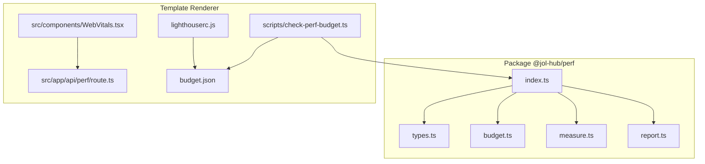
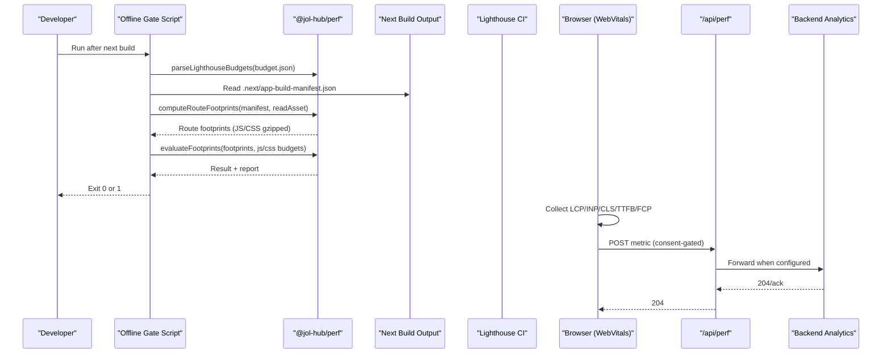
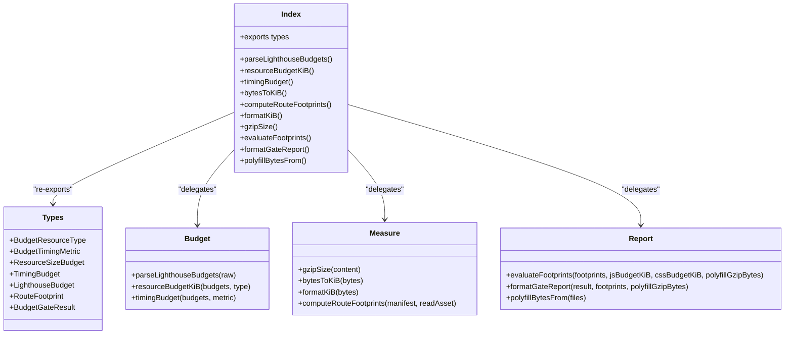
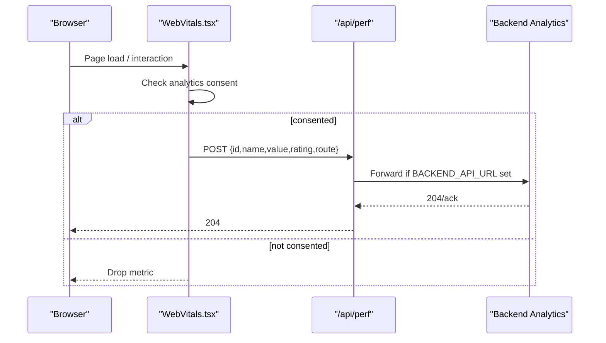
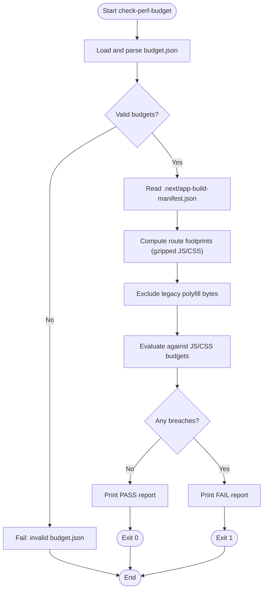

# Performance Package

<cite>
**Referenced Files in This Document**
- [package.json](file://frontend/packages/perf/package.json)
- [index.ts](file://frontend/packages/perf/src/index.ts)
- [types.ts](file://frontend/packages/perf/src/types.ts)
- [budget.ts](file://frontend/packages/perf/src/budget.ts)
- [measure.ts](file://frontend/packages/perf/src/measure.ts)
- [report.ts](file://frontend/packages/perf/src/report.ts)
- [check-perf-budget.ts](file://frontend/apps/template-renderer/scripts/check-perf-budget.ts)
- [budget.json](file://frontend/apps/template-renderer/budget.json)
- [WebVitals.tsx](file://frontend/apps/template-renderer/src/components/WebVitals.tsx)
- [route.ts](file://frontend/apps/template-renderer/src/app/api/perf/route.ts)
- [lighthouserc.js](file://frontend/apps/template-renderer/lighthouserc.js)
- [PERFORMANCE.md](file://frontend/apps/template-renderer/PERFORMANCE.md)
</cite>

## Table of Contents
1. [Introduction](#introduction)
2. [Project Structure](#project-structure)
3. [Core Components](#core-components)
4. [Architecture Overview](#architecture-overview)
5. [Detailed Component Analysis](#detailed-component-analysis)
6. [Dependency Analysis](#dependency-analysis)
7. [Performance Considerations](#performance-considerations)
8. [Troubleshooting Guide](#troubleshooting-guide)
9. [Conclusion](#conclusion)
10. [Appendices](#appendices)

## Introduction
This document explains the performance package that enforces and measures frontend performance for the Next.js template renderer. It covers:
- Web Vitals tracking (RUM) and ingestion
- Bundle analysis and offline byte-budget enforcement
- Lazy loading strategies and code splitting posture
- Caching mechanisms at app, proxy, and backend layers
- Budget enforcement via Lighthouse budgets and CI gates
- Asset optimization (images, fonts, third-party scripts)
- Performance testing strategies and continuous monitoring setup

The package is designed for modest on-prem hardware without cloud CDN assumptions, so transfer size and server response time are primary constraints.

**Section sources**
- [PERFORMANCE.md:1-20](file://frontend/apps/template-renderer/PERFORMANCE.md#L1-L20)

## Project Structure
The performance capability spans a reusable package and its usage in the template renderer:
- @jol-hub/perf package: budget parsing, build-output measurement, evaluation, and reporting
- Template renderer: offline gate script, Lighthouse CI config, RUM component, and RUM ingress route
- Budget contract: single source of truth in Lighthouse format

**Diagram sources**
- [index.ts:1-27](file://frontend/packages/perf/src/index.ts#L1-L27)
- [types.ts:1-70](file://frontend/packages/perf/src/types.ts#L1-L70)
- [budget.ts:1-102](file://frontend/packages/perf/src/budget.ts#L1-L102)
- [measure.ts:1-81](file://frontend/packages/perf/src/measure.ts#L1-L81)
- [report.ts:1-97](file://frontend/packages/perf/src/report.ts#L1-L97)
- [check-perf-budget.ts:1-93](file://frontend/apps/template-renderer/scripts/check-perf-budget.ts#L1-L93)
- [budget.json:1-26](file://frontend/apps/template-renderer/budget.json#L1-L26)
- [WebVitals.tsx:1-59](file://frontend/apps/template-renderer/src/components/WebVitals.tsx#L1-L59)
- [route.ts:1-63](file://frontend/apps/template-renderer/src/app/api/perf/route.ts#L1-L63)
- [lighthouserc.js:1-75](file://frontend/apps/template-renderer/lighthouserc.js#L1-L75)

**Section sources**
- [package.json:1-30](file://frontend/packages/perf/package.json#L1-L30)
- [PERFORMANCE.md:10-18](file://frontend/apps/template-renderer/PERFORMANCE.md#L10-L18)

## Core Components
- Budget parser and helpers: parse and validate Lighthouse-format budgets; extract resource and timing budgets
- Build-output measurement: compute gzipped first-load JS/CSS per route from Next’s app-build-manifest; cache sizes; sort by worst
- Evaluation and reporting: enforce JS/CSS budgets, exclude legacy polyfills, produce human-readable gate reports
- Offline gate script: orchestrates reading budget.json, manifest, measuring assets, evaluating, and exiting non-zero on failure
- RUM pipeline: client-side Web Vitals reporter sends metrics to same-origin API; route validates payload and forwards to backend when configured
- Lighthouse CI: asserts budgets and CWV floors across representative tenant pages with mobile emulation

Key responsibilities and boundaries:
- The package is pure and framework-agnostic; I/O is injected or handled by the consuming script
- The offline gate runs without Chrome; Lighthouse CI runs where Chrome exists
- RUM is consent-gated and privacy-preserving

**Section sources**
- [budget.ts:33-101](file://frontend/packages/perf/src/budget.ts#L33-L101)
- [measure.ts:17-80](file://frontend/packages/perf/src/measure.ts#L17-L80)
- [report.ts:19-96](file://frontend/packages/perf/src/report.ts#L19-L96)
- [check-perf-budget.ts:43-92](file://frontend/apps/template-renderer/scripts/check-perf-budget.ts#L43-L92)
- [WebVitals.tsx:21-55](file://frontend/apps/template-renderer/src/components/WebVitals.tsx#L21-L55)
- [route.ts:17-62](file://frontend/apps/template-renderer/src/app/api/perf/route.ts#L17-L62)
- [lighthouserc.js:19-74](file://frontend/apps/template-renderer/lighthouserc.js#L19-L74)

## Architecture Overview
End-to-end flow for performance enforcement and monitoring:

**Diagram sources**
- [check-perf-budget.ts:43-92](file://frontend/apps/template-renderer/scripts/check-perf-budget.ts#L43-L92)
- [budget.ts:33-101](file://frontend/packages/perf/src/budget.ts#L33-L101)
- [measure.ts:49-80](file://frontend/packages/perf/src/measure.ts#L49-L80)
- [report.ts:19-96](file://frontend/packages/perf/src/report.ts#L19-L96)
- [WebVitals.tsx:36-55](file://frontend/apps/template-renderer/src/components/WebVitals.tsx#L36-L55)
- [route.ts:30-62](file://frontend/apps/template-renderer/src/app/api/perf/route.ts#L30-L62)

## Detailed Component Analysis

### Budget Parsing and Extraction
- Validates Lighthouse-format budget arrays and entries
- Enforces allowed resource types and timing metrics
- Provides helpers to retrieve specific resource/timing budgets

Complexity and behavior:
- Linear scan over budgets and nested arrays
- Defensive validation fails loudly on malformed input

**Section sources**
- [budget.ts:15-101](file://frontend/packages/perf/src/budget.ts#L15-L101)
- [types.ts:15-48](file://frontend/packages/perf/src/types.ts#L15-L48)

### Build-Output Measurement
- Reads Next’s app-build-manifest to determine per-route first-load files
- Computes gzipped sizes using level 9 compression
- Caches repeated asset reads; excludes dev-only routes
- Sorts results by largest footprint to identify the gating route

Optimization notes:
- In-memory cache avoids redundant gzip computations
- CSS counted per route because it loads on first paint in App Router

**Section sources**
- [measure.ts:17-80](file://frontend/packages/perf/src/measure.ts#L17-L80)

### Budget Evaluation and Reporting
- Adjusts JS bytes by subtracting legacy polyfill chunks
- Compares adjusted JS/CSS against budgets
- Produces concise pass/fail output with top routes and failures

Edge cases:
- Polyfill exclusion only applies to legacy noModule chunks
- Worst route identified for targeted remediation

**Section sources**
- [report.ts:12-96](file://frontend/packages/perf/src/report.ts#L12-L96)

### Offline Budget Gate Script
- Loads and validates budget.json
- Reads Next build manifest and computes footprints
- Excludes polyfills and evaluates against budgets
- Prints report and exits non-zero on any breach

Operational details:
- Designed to run after next build in CI or local workspace without Chrome
- Integrates into SOC 2 automated quality control

**Section sources**
- [check-perf-budget.ts:1-93](file://frontend/apps/template-renderer/scripts/check-perf-budget.ts#L1-L93)
- [budget.json:1-26](file://frontend/apps/template-renderer/budget.json#L1-L26)

### Real User Monitoring (RUM)
- Client component collects Core Web Vitals via next/web-vitals
- Sends metrics only after analytics consent; re-checks per batch
- Uses keepalive fetch to survive page hide
- Server route validates payloads and forwards to backend when configured; otherwise returns 204

Privacy and resilience:
- No personal data in payload
- Failures are swallowed to avoid impacting user experience

**Section sources**
- [WebVitals.tsx:21-55](file://frontend/apps/template-renderer/src/components/WebVitals.tsx#L21-L55)
- [route.ts:17-62](file://frontend/apps/template-renderer/src/app/api/perf/route.ts#L17-L62)

### Lighthouse CI Configuration
- Starts Next production server locally for audits
- Emulates mobile device on 4G; sets extra headers for tenant routing
- Asserts category scores and explicit CWV numeric floors
- Uses shared budget.json as the single source of truth

Environment considerations:
- Skips HTTP/2 audit since nginx handles transport
- Runs multiple iterations for stability

**Section sources**
- [lighthouserc.js:19-74](file://frontend/apps/template-renderer/lighthouserc.js#L19-L74)

### Class Diagram of Package Exports

**Diagram sources**
- [index.ts:12-26](file://frontend/packages/perf/src/index.ts#L12-L26)
- [types.ts:15-69](file://frontend/packages/perf/src/types.ts#L15-L69)
- [budget.ts:33-101](file://frontend/packages/perf/src/budget.ts#L33-L101)
- [measure.ts:17-80](file://frontend/packages/perf/src/measure.ts#L17-L80)
- [report.ts:19-96](file://frontend/packages/perf/src/report.ts#L19-L96)

### Sequence Diagram: RUM Metric Flow

**Diagram sources**
- [WebVitals.tsx:36-55](file://frontend/apps/template-renderer/src/components/WebVitals.tsx#L36-L55)
- [route.ts:30-62](file://frontend/apps/template-renderer/src/app/api/perf/route.ts#L30-L62)

### Flowchart: Offline Budget Gate

**Diagram sources**
- [check-perf-budget.ts:43-92](file://frontend/apps/template-renderer/scripts/check-perf-budget.ts#L43-L92)
- [measure.ts:49-80](file://frontend/packages/perf/src/measure.ts#L49-L80)
- [report.ts:19-96](file://frontend/packages/perf/src/report.ts#L19-L96)

## Dependency Analysis
- The package exposes a minimal surface via index.ts, delegating to budget, measure, and report modules
- The offline gate depends on the package and Next’s build artifacts
- Lighthouse CI depends on budget.json and Chrome availability
- RUM depends on next/web-vitals and the same-origin API route

Coupling and cohesion:
- High cohesion within each module (parsing vs measurement vs reporting)
- Low coupling through clean interfaces and injected readers
- Single source of truth for budgets reduces drift between tools

Potential circular dependencies:
- None observed; imports are one-directional from consumers to package

External integrations:
- Next.js build system (app-build-manifest)
- Node zlib for gzip
- next/web-vitals for RUM
- Optional backend analytics endpoint

**Section sources**
- [index.ts:12-26](file://frontend/packages/perf/src/index.ts#L12-L26)
- [check-perf-budget.ts:23-33](file://frontend/apps/template-renderer/scripts/check-perf-budget.ts#L23-L33)
- [WebVitals.tsx:19-20](file://frontend/apps/template-renderer/src/components/WebVitals.tsx#L19-L20)
- [route.ts:27-55](file://frontend/apps/template-renderer/src/app/api/perf/route.ts#L27-L55)

## Performance Considerations
- Transfer-size budgets are enforced hard due to on-prem hardware constraints
- Gzip level 9 used for conservative measurement; actual delivery may use brotli at the proxy layer
- CSS is counted per route because it loads on first paint in App Router
- Legacy polyfills excluded to reflect modern browser baseline
- Images optimized via next/image with AVIF/WebP formats and responsive srcset
- Fonts use system-first stacks to avoid webfont requests in pilot
- Third-party scripts minimized: Stripe hosted server-side; Bitrix24 via server-only client; analytics consent-gated
- Caching: immutable hashed static assets, image caching with stale-while-revalidate, ISR windows per route, gzip fallback enabled
- Mobile-first targets: Lighthouse ≥ 90 mobile; CWV green thresholds enforced

[No sources needed since this section provides general guidance]

## Troubleshooting Guide
Common issues and resolutions:
- Missing budget.json or malformed: ensure file exists and conforms to Lighthouse format; parser will fail loudly
- Missing .next/app-build-manifest.json: run next build before executing the offline gate
- No user-facing routes found: verify App Router pages exist and are not filtered out by dev-only patterns
- Budget exceeded: identify worst route from gate report; bisect with bundle analyzer to find heavy imports
- RUM not sending: confirm analytics consent stored; verify /api/perf returns 204; check backend configuration when applicable
- Lighthouse CI failing: ensure Chrome available; verify tenant headers; review asserted CWV floors and budgets

Operational tips:
- Use bundle analyzer to inspect client/server bundles
- Keep budgets aligned with hardware realities and update incrementally
- Treat RUM forwarding failures as non-blocking; monitor backend ingestion gaps

**Section sources**
- [check-perf-budget.ts:43-92](file://frontend/apps/template-renderer/scripts/check-perf-budget.ts#L43-L92)
- [route.ts:30-62](file://frontend/apps/template-renderer/src/app/api/perf/route.ts#L30-L62)
- [lighthouserc.js:19-74](file://frontend/apps/template-renderer/lighthouserc.js#L19-L74)

## Conclusion
The performance package provides a robust, testable foundation for enforcing and measuring frontend performance in a constrained environment. It combines offline byte-budget enforcement, Lighthouse-based timing checks, and consent-gated RUM to maintain tight control over bundle size and user-perceived performance. By centralizing budgets and automating checks, teams can prevent regressions while optimizing assets and code-splitting strategically.

[No sources needed since this section summarizes without analyzing specific files]

## Appendices

### Measuring Core Web Vitals
- Client-side collection via next/web-vitals in the root layout component
- Consent-gated reporting to same-origin API
- Payload includes metric id/name/value/rating and route; no personal data

**Section sources**
- [WebVitals.tsx:36-55](file://frontend/apps/template-renderer/src/components/WebVitals.tsx#L36-L55)
- [route.ts:17-62](file://frontend/apps/template-renderer/src/app/api/perf/route.ts#L17-L62)

### Implementing Performance Monitoring
- Offline gate: run after next build to enforce JS/CSS budgets without a browser
- Lighthouse CI: assert budgets and CWV floors across representative tenant pages
- RUM: collect field metrics post-consent and forward to backend when configured

**Section sources**
- [check-perf-budget.ts:43-92](file://frontend/apps/template-renderer/scripts/check-perf-budget.ts#L43-L92)
- [lighthouserc.js:19-74](file://frontend/apps/template-renderer/lighthouserc.js#L19-L74)
- [WebVitals.tsx:36-55](file://frontend/apps/template-renderer/src/components/WebVitals.tsx#L36-L55)

### Optimizing Bundle Sizes
- Use dynamic imports per vertical family to split templates server-side
- Leverage App Router route-based splitting for client JS
- Enable experimental optimizePackageImports for shared packages to avoid dragging entire surfaces
- Remove unnecessary third-party SDKs from client bundles; host services server-side where possible
- Exclude legacy polyfills from modern baseline measurements

**Section sources**
- [PERFORMANCE.md:64-82](file://frontend/apps/template-renderer/PERFORMANCE.md#L64-L82)
- [measure.ts:49-80](file://frontend/packages/perf/src/measure.ts#L49-L80)
- [report.ts:12-96](file://frontend/packages/perf/src/report.ts#L12-L96)

### Asset Optimization
- Images: AVIF/WebP formats, responsive srcset, lazy below fold, priority for above-the-fold heroes
- Fonts: system-first stacks; when vendored later, subset glyphs and preload critical weights
- Third-party scripts: minimize or move server-side; analytics consent-gated

**Section sources**
- [PERFORMANCE.md:83-117](file://frontend/apps/template-renderer/PERFORMANCE.md#L83-L117)

### Caching Mechanisms
- Static assets: immutable with long max-age
- Images: cache with stale-while-revalidate
- Sitemap/robots: short-lived caches with revalidation
- Rendering: per-route ISR windows; gzip fallback enabled
- Proxy: brotli/gzip, HTTP/2, upstream keep-alive, proxy_cache for static assets

**Section sources**
- [PERFORMANCE.md:118-142](file://frontend/apps/template-renderer/PERFORMANCE.md#L118-L142)

### Performance Testing Strategies
- Offline gate: fast, deterministic, no browser required
- Lighthouse CI: realistic timing budgets and CWV assertions with mobile emulation
- Bundle analysis: interactive inspection of client/server bundles to locate regressions

**Section sources**
- [check-perf-budget.ts:1-93](file://frontend/apps/template-renderer/scripts/check-perf-budget.ts#L1-L93)
- [lighthouserc.js:19-74](file://frontend/apps/template-renderer/lighthouserc.js#L19-L74)

### Continuous Performance Monitoring Setup
- Integrate offline gate into CI after next build
- Run Lighthouse CI on PRs where Chrome is available
- Monitor RUM ingestion and alert on anomalies in field metrics

**Section sources**
- [PERFORMANCE.md:42-62](file://frontend/apps/template-renderer/PERFORMANCE.md#L42-L62)
- [route.ts:30-62](file://frontend/apps/template-renderer/src/app/api/perf/route.ts#L30-L62)