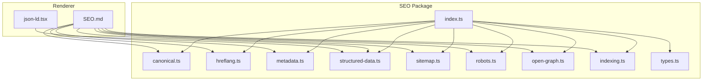
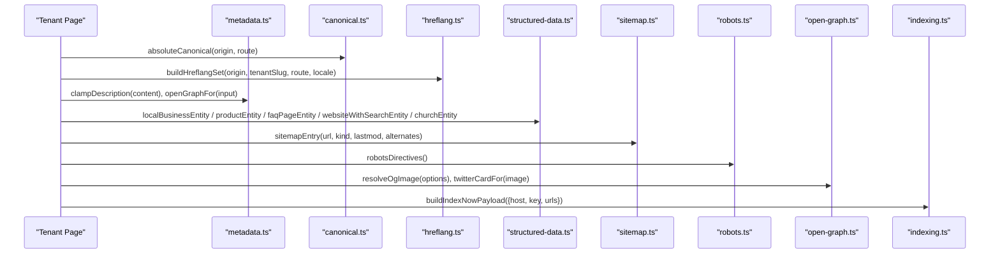
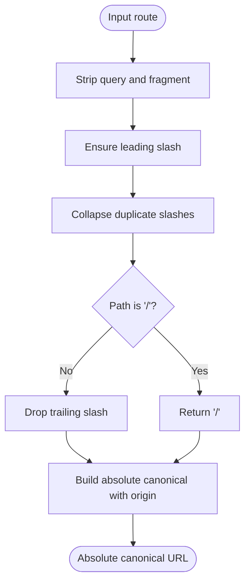
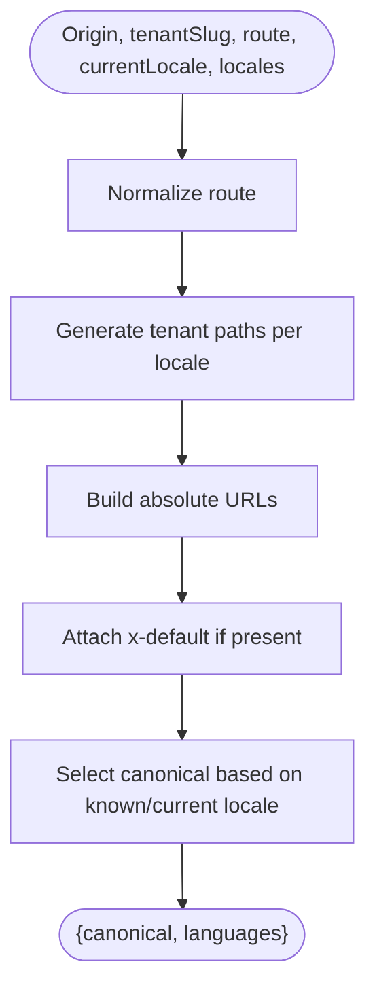
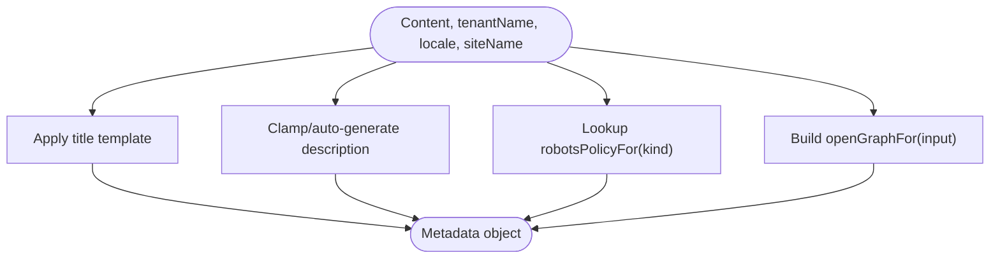
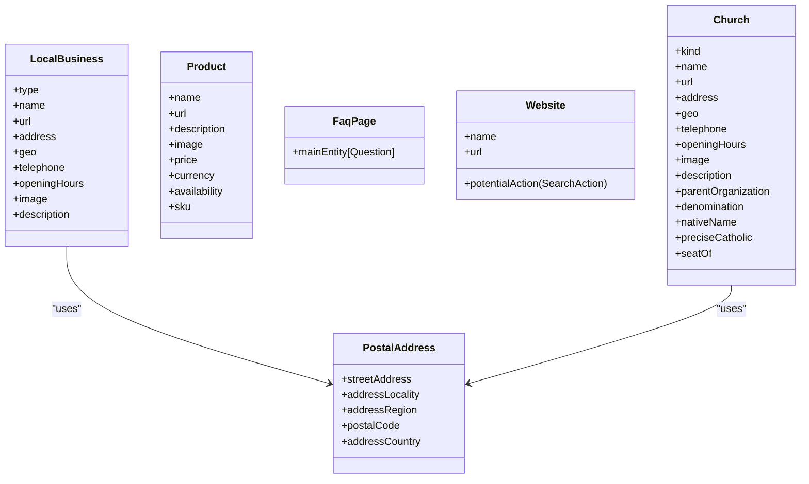
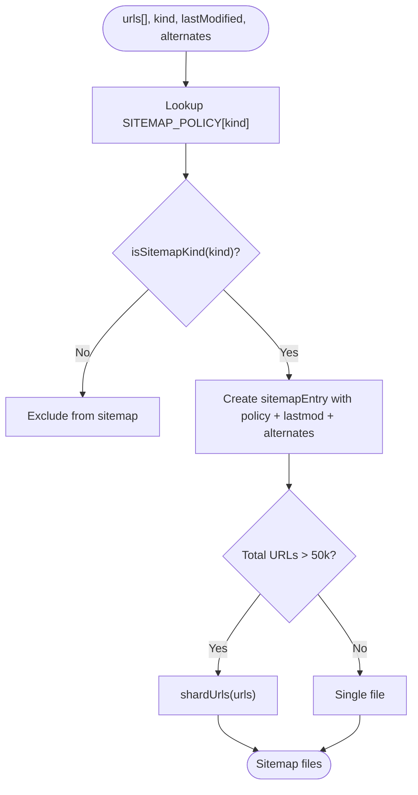
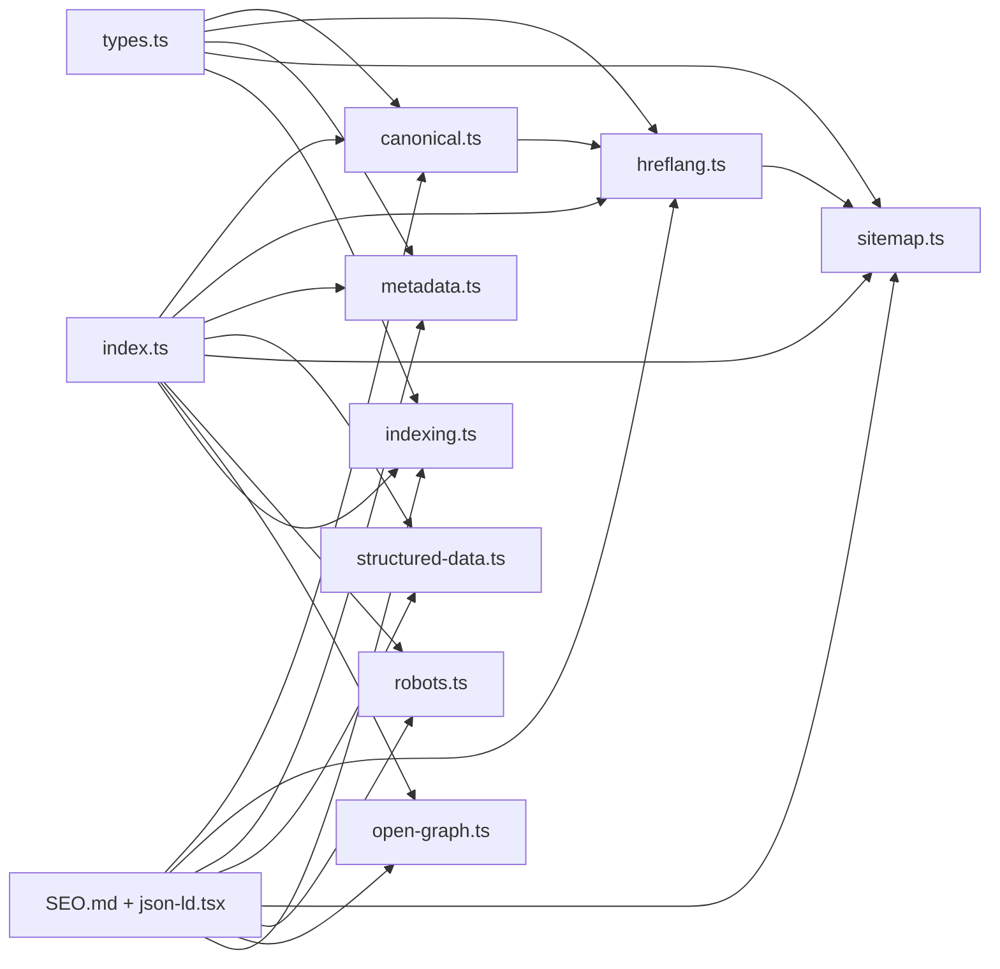

# SEO Package

<cite>
**Referenced Files in This Document**
- [index.ts](file://frontend/packages/seo/src/index.ts)
- [types.ts](file://frontend/packages/seo/src/types.ts)
- [canonical.ts](file://frontend/packages/seo/src/canonical.ts)
- [hreflang.ts](file://frontend/packages/seo/src/hreflang.ts)
- [metadata.ts](file://frontend/packages/seo/src/metadata.ts)
- [structured-data.ts](file://frontend/packages/seo/src/structured-data.ts)
- [sitemap.ts](file://frontend/packages/seo/src/sitemap.ts)
- [robots.ts](file://frontend/packages/seo/src/robots.ts)
- [open-graph.ts](file://frontend/packages/seo/src/open-graph.ts)
- [indexing.ts](file://frontend/packages/seo/src/indexing.ts)
- [SEO.md](file://frontend/apps/template-renderer/SEO.md)
- [json-ld.tsx](file://frontend/apps/template-renderer/src/lib/json-ld.tsx)
- [international-seo-strategy.md](file://docs/seo/international-seo-strategy.md)
- [per-tenant-sitemap-robots.md](file://docs/seo/per-tenant-sitemap-robots.md)
</cite>

## Table of Contents
1. Introduction
2. Project Structure
3. Core Components
4. Architecture Overview
5. Detailed Component Analysis
6. Dependency Analysis
7. Performance Considerations
8. Troubleshooting Guide
9. Conclusion
10. Appendices

## Introduction
This document provides comprehensive documentation for the SEO package that enhances search engine optimization across applications. It covers meta tag management, structured data implementation (JSON-LD), sitemap generation, Open Graph protocol support, canonical URL handling, international SEO with hreflang, robots policy, and indexing strategies such as IndexNow. It also explains how to implement JSON-LD schema markup, optimize page titles and descriptions, handle canonical URLs, add SEO metadata to pages, implement breadcrumbs, optimize for social media sharing, and manage international SEO considerations and multi-region strategies.

## Project Structure
The SEO package is a pure, framework-agnostic library providing primitives for canonicals, hreflang alternates, metadata policy, JSON-LD generators, sitemap utilities, robots directives, Open Graph helpers, and indexing integration points. The renderer composes these into Next.js Metadata, JSON-LD, robots.txt, and sitemap.xml.

**Diagram sources**
- [index.ts:1-18](file://frontend/packages/seo/src/index.ts#L1-L18)
- [SEO.md:8-19](file://frontend/apps/template-renderer/SEO.md#L8-L19)
- [json-ld.tsx:1-44](file://frontend/apps/template-renderer/src/lib/json-ld.tsx#L1-L44)

**Section sources**
- [index.ts:1-18](file://frontend/packages/seo/src/index.ts#L1-L18)
- [SEO.md:8-19](file://frontend/apps/template-renderer/SEO.md#L8-L19)

## Core Components
- Canonical URL normalization and absolute canonical building
- Hreflang alternate set construction and reciprocity verification
- Metadata policy for titles, descriptions, robots, and Open Graph defaults
- JSON-LD structured data builders for organizations, businesses, products, FAQs, websites, and church entities
- Sitemap policy, sharding, and entry assembly
- Robots directives and crawl policies
- Open Graph image contract and Twitter card policy
- IndexNow payload builder for instant indexing

**Section sources**
- [canonical.ts:13-37](file://frontend/packages/seo/src/canonical.ts#L13-L37)
- [hreflang.ts:14-62](file://frontend/packages/seo/src/hreflang.ts#L14-L62)
- [metadata.ts:21-98](file://frontend/packages/seo/src/metadata.ts#L21-L98)
- [structured-data.ts:23-154](file://frontend/packages/seo/src/structured-data.ts#L23-L154)
- [sitemap.ts:10-74](file://frontend/packages/seo/src/sitemap.ts#L10-L74)
- [robots.ts:19-53](file://frontend/packages/seo/src/robots.ts#L19-L53)
- [open-graph.ts:15-50](file://frontend/packages/seo/src/open-graph.ts#L15-L50)
- [indexing.ts:34-51](file://frontend/packages/seo/src/indexing.ts#L34-L51)

## Architecture Overview
The SEO package exposes pure functions and types consumed by the renderer to produce:
- Absolute canonical URLs without query parameters or trailing slashes
- Reciprocal hreflang sets per tenant page
- Page metadata (title, description, robots, OG/Twitter)
- JSON-LD structured data blocks
- Per-tenant sitemaps with policy-driven changefreq/priority and sharding
- Robots.txt directives blocking privileged areas
- IndexNow payloads for instant indexing

**Diagram sources**
- [canonical.ts:32-37](file://frontend/packages/seo/src/canonical.ts#L32-L37)
- [hreflang.ts:35-62](file://frontend/packages/seo/src/hreflang.ts#L35-L62)
- [metadata.ts:31-98](file://frontend/packages/seo/src/metadata.ts#L31-L98)
- [structured-data.ts:57-154](file://frontend/packages/seo/src/structured-data.ts#L57-L154)
- [sitemap.ts:60-74](file://frontend/packages/seo/src/sitemap.ts#L60-L74)
- [robots.ts:45-53](file://frontend/packages/seo/src/robots.ts#L45-L53)
- [open-graph.ts:21-50](file://frontend/packages/seo/src/open-graph.ts#L21-L50)
- [indexing.ts:37-51](file://frontend/packages/seo/src/indexing.ts#L37-L51)

## Detailed Component Analysis

### Canonical URLs
- Normalizes routes by stripping query strings and fragments, ensuring one leading slash and no trailing slash except at root.
- Sanitizes origins to enforce absolute, valid base domains.
- Builds absolute canonical URLs from origin + normalized route.
- Provides equality checks for duplicate content audits.

**Diagram sources**
- [canonical.ts:13-37](file://frontend/packages/seo/src/canonical.ts#L13-L37)

**Section sources**
- [canonical.ts:13-37](file://frontend/packages/seo/src/canonical.ts#L13-L37)

### Hreflang Alternates
- Builds a complete set of absolute alternate URLs for all configured locales plus x-default.
- Enforces reciprocity: every page emits the same full set; helper verifies bidirectional links.
- Supports pilot matrix (lt-LT, en-LT, ru-LT) and can be extended per country via configuration.

**Diagram sources**
- [hreflang.ts:35-62](file://frontend/packages/seo/src/hreflang.ts#L35-L62)

**Section sources**
- [hreflang.ts:14-88](file://frontend/packages/seo/src/hreflang.ts#L14-L88)

### Metadata Policy
- Title template appends tenant name suffix.
- Description clamping ensures 150–160 characters with word-boundary cuts and ellipses when needed.
- Auto-description fallback avoids empty descriptions.
- Robots policy keyed by page kind prevents accidental noindex on public pages.
- Open Graph defaults include title, description, locale, siteName, and type.

**Diagram sources**
- [metadata.ts:21-98](file://frontend/packages/seo/src/metadata.ts#L21-L98)

**Section sources**
- [metadata.ts:21-98](file://frontend/packages/seo/src/metadata.ts#L21-L98)

### Structured Data (JSON-LD)
- Builders emit schema.org entities for LocalBusiness, Product, FAQPage, WebSite with SearchAction, and Church-related entities.
- PostalAddress helper standardizes address fields.
- Church entity supports multiple kinds and controlled vocabulary for denominations and roles.
- All URLs are absolute; GDPR-safe by design (no personal data beyond tenant-published info).

**Diagram sources**
- [structured-data.ts:23-154](file://frontend/packages/seo/src/structured-data.ts#L23-L154)
- [structured-data.ts:156-300](file://frontend/packages/seo/src/structured-data.ts#L156-L300)

**Section sources**
- [structured-data.ts:23-300](file://frontend/packages/seo/src/structured-data.ts#L23-L300)

### Sitemap Generation
- Defines changefreq/priority per page kind and guards privileged kinds from inclusion.
- Shards URL lists to respect the 50,000-URL protocol limit.
- Assembles entries with lastmod ISO timestamps and hreflang alternates.

**Diagram sources**
- [sitemap.ts:10-74](file://frontend/packages/seo/src/sitemap.ts#L10-L74)

**Section sources**
- [sitemap.ts:10-74](file://frontend/packages/seo/src/sitemap.ts#L10-L74)

### Robots Directives
- Centralized allow/disallow list protects privileged areas and disallows query-string variants.
- Emits crawl-delay for politeness where supported.
- Renderer renders robots.txt using this policy.

**Section sources**
- [robots.ts:19-53](file://frontend/packages/seo/src/robots.ts#L19-L53)
- [SEO.md:106-115](file://frontend/apps/template-renderer/SEO.md#L106-L115)

### Open Graph Protocol Support
- Defines required image dimensions and max size.
- Provides a tenant-scoped image path contract and resolution logic with fallback chain.
- Determines Twitter card type based on presence of an image.

**Section sources**
- [open-graph.ts:15-50](file://frontend/packages/seo/src/open-graph.ts#L15-L50)
- [SEO.md:124-131](file://frontend/apps/template-renderer/SEO.md#L124-L131)

### Indexing Strategy (IndexNow)
- Builds validated payloads for instant indexing to Bing/Yandex/Seznam.
- Enforces URL list limits and constructs keyLocation based on host.
- Backend owns keys and submits changed URLs after mutations.

**Section sources**
- [indexing.ts:34-51](file://frontend/packages/seo/src/indexing.ts#L34-L51)
- [SEO.md:148-164](file://frontend/apps/template-renderer/SEO.md#L148-L164)

### JSON-LD Rendering in Renderer
- Renders JSON-LD blocks safely server-side.
- Includes helpers for WebSite and WebPage subtypes.
- Provides breadcrumb entity builder for BreadcrumbList.

**Section sources**
- [json-ld.tsx:1-44](file://frontend/apps/template-renderer/src/lib/json-ld.tsx#L1-L44)
- [json-ld.tsx:95-140](file://frontend/apps/template-renderer/src/lib/json-ld.tsx#L95-L140)

## Dependency Analysis
The package’s index re-exports core modules, while the renderer depends on these primitives to compose SEO surfaces. Types define shared contracts used across modules.

**Diagram sources**
- [index.ts:1-18](file://frontend/packages/seo/src/index.ts#L1-L18)
- [types.ts:12-59](file://frontend/packages/seo/src/types.ts#L12-L59)
- [SEO.md:8-19](file://frontend/apps/template-renderer/SEO.md#L8-L19)

**Section sources**
- [index.ts:1-18](file://frontend/packages/seo/src/index.ts#L1-L18)
- [types.ts:12-59](file://frontend/packages/seo/src/types.ts#L12-L59)

## Performance Considerations
- Canonical normalization reduces duplicate content and improves crawl efficiency.
- Sitemap sharding respects protocol limits and maintains crawl budget.
- Robots directives prevent crawling of privileged areas and query forks.
- JSON-LD builders avoid unnecessary fields, reducing payload size.
- Open Graph images follow spec constraints to ensure fast social sharing previews.

[No sources needed since this section provides general guidance]

## Troubleshooting Guide
- Invalid origin errors: ensure origins are absolute and free of trailing slashes or paths.
- Missing hreflang targets: use reciprocity verification to detect broken alternate sets.
- Empty descriptions: auto-generation returns undefined for empty content; callers should fall back to tenant tagline.
- Privileged pages indexed: verify robotsPolicyFor(kind) and sitemap kind gating to exclude admin/editor/api.
- Sitemap too large: shard URLs to respect 50,000-URL limit.
- Broken OG images: follow fallback chain; omit og:image rather than emit invalid URLs.

**Section sources**
- [canonical.ts:23-30](file://frontend/packages/seo/src/canonical.ts#L23-L30)
- [hreflang.ts:69-88](file://frontend/packages/seo/src/hreflang.ts#L69-L88)
- [metadata.ts:41-50](file://frontend/packages/seo/src/metadata.ts#L41-L50)
- [sitemap.ts:34-51](file://frontend/packages/seo/src/sitemap.ts#L34-L51)
- [open-graph.ts:29-42](file://frontend/packages/seo/src/open-graph.ts#L29-L42)

## Conclusion
The SEO package provides a robust, framework-agnostic foundation for search engine optimization across a large-scale multi-tenant platform. Its pure functions and strict policies ensure correctness for canonicals, hreflang, metadata, structured data, sitemaps, robots, Open Graph, and indexing integrations. The renderer composes these primitives to deliver consistent, scalable SEO outcomes for thousands of tenant sites.

[No sources needed since this section summarizes without analyzing specific files]

## Appendices

### International SEO and Multi-Region Strategies
- Adopt ccTLD per country with tenant subdomains; maintain non-enumeration and privacy.
- Configure per-country hreflang matrices with x-default pointing to national language.
- Use per-tenant sitemaps with hreflang alternates embedded per URL.
- Follow hub-only curated directory indexes; never enumerate tenants globally.

**Section sources**
- [international-seo-strategy.md:22-118](file://docs/seo/international-seo-strategy.md#L22-L118)
- [international-seo-strategy.md:120-178](file://docs/seo/international-seo-strategy.md#L120-L178)
- [international-seo-strategy.md:223-249](file://docs/seo/international-seo-strategy.md#L223-L249)
- [per-tenant-sitemap-robots.md:7-97](file://docs/seo/per-tenant-sitemap-robots.md#L7-L97)

### Implementing JSON-LD Schema Markup
- Use builders for LocalBusiness, Product, FAQPage, WebSite with SearchAction, and Church entities.
- Ensure all entity URLs are absolute and adhere to Rich Results requirements.
- Avoid embedding personal data beyond tenant-published information.

**Section sources**
- [structured-data.ts:57-154](file://frontend/packages/seo/src/structured-data.ts#L57-L154)
- [structured-data.ts:156-300](file://frontend/packages/seo/src/structured-data.ts#L156-L300)
- [SEO.md:61-83](file://frontend/apps/template-renderer/SEO.md#L61-L83)

### Optimizing Page Titles and Descriptions
- Apply title templates that append tenant names.
- Clamp descriptions to 150–160 characters with word-boundary cuts.
- Provide auto-generated descriptions only when content exists; otherwise fall back to tenant tagline.

**Section sources**
- [metadata.ts:21-50](file://frontend/packages/seo/src/metadata.ts#L21-L50)
- [SEO.md:46-59](file://frontend/apps/template-renderer/SEO.md#L46-L59)

### Handling Canonical URLs
- Always emit absolute canonicals without query parameters and with normalized trailing slashes.
- Use utility functions to normalize routes and validate origins.

**Section sources**
- [canonical.ts:13-37](file://frontend/packages/seo/src/canonical.ts#L13-L37)
- [SEO.md:21-28](file://frontend/apps/template-renderer/SEO.md#L21-L28)

### Adding SEO Metadata to Pages
- Compose metadata using builders for titles, descriptions, robots, and Open Graph.
- Integrate with renderer to generate Next.js Metadata objects per page.

**Section sources**
- [metadata.ts:73-98](file://frontend/packages/seo/src/metadata.ts#L73-L98)
- [SEO.md:46-59](file://frontend/apps/template-renderer/SEO.md#L46-L59)

### Implementing Breadcrumbs
- Emit BreadcrumbList JSON-LD for nested pages using breadcrumb entity builder.
- Render accessible breadcrumb navigation alongside structured data.

**Section sources**
- [json-ld.tsx:120-140](file://frontend/apps/template-renderer/src/lib/json-ld.tsx#L120-L140)

### Optimizing for Social Media Sharing
- Define OG image dimensions and max size; follow fallback chain to avoid broken images.
- Set Twitter card type based on image presence.

**Section sources**
- [open-graph.ts:15-50](file://frontend/packages/seo/src/open-graph.ts#L15-L50)
- [SEO.md:124-131](file://frontend/apps/template-renderer/SEO.md#L124-L131)