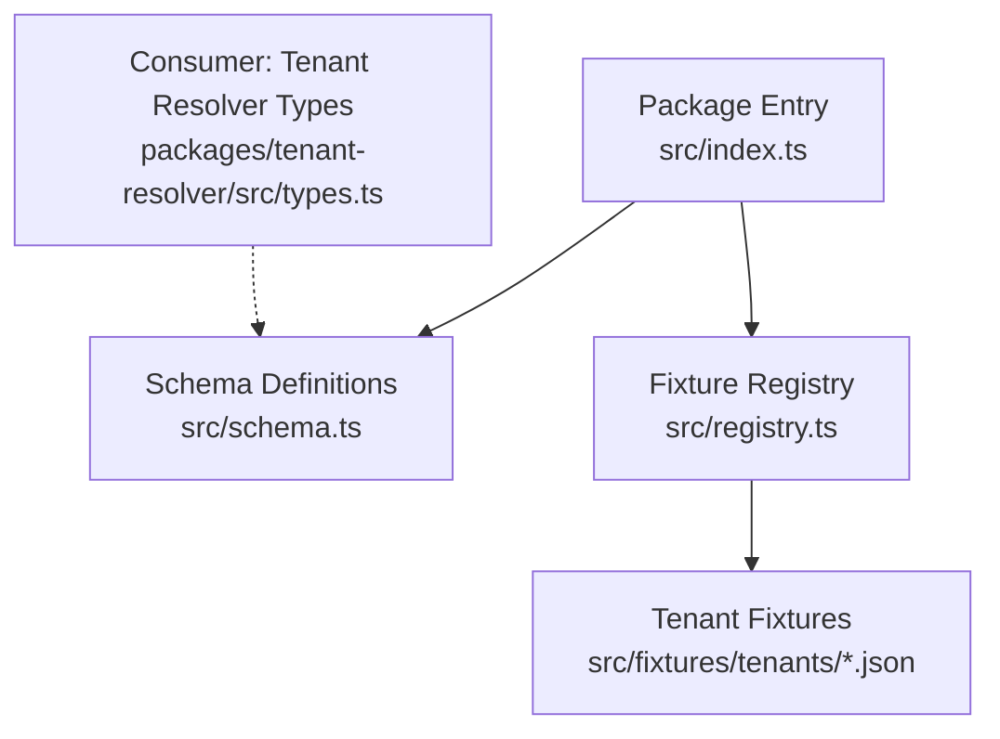
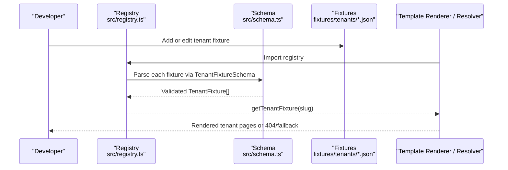
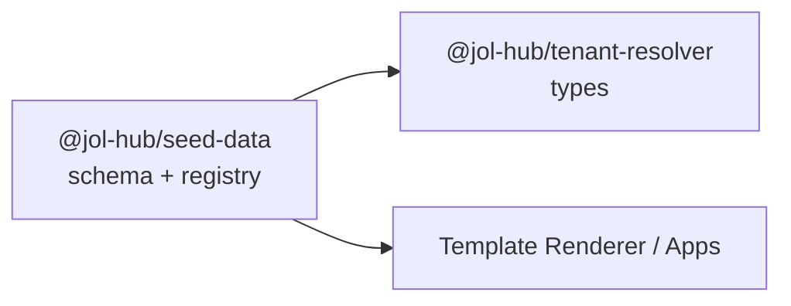

# Seed Data Package

<cite>
**Referenced Files in This Document**
- [package.json](file://frontend/packages/seed-data/package.json)
- [index.ts](file://frontend/packages/seed-data/src/index.ts)
- [schema.ts](file://frontend/packages/seed-data/src/schema.ts)
- [registry.ts](file://frontend/packages/seed-data/src/registry.ts)
- [parish-st-john-vilnius.json](file://frontend/packages/seed-data/src/fixtures/tenants/parish-st-john-vilnius.json)
- [diocese-vilnius.json](file://frontend/packages/seed-data/src/fixtures/tenants/diocese-vilnius.json)
- [reference-sites.json](file://frontend/packages/seed-data/src/fixtures/tenants/reference-sites.json)
- [compliance.yml](file://countries/lt/config/compliance.yml)
- [entity.yml](file://countries/lt/examples/catholic/diocese/vilnius-archdiocese/entity.yml)
- [types.ts](file://frontend/packages/tenant-resolver/src/types.ts)
</cite>

## Table of Contents
1. Introduction
2. Project Structure
3. Core Components
4. Architecture Overview
5. Detailed Component Analysis
6. Dependency Analysis
7. Performance Considerations
8. Troubleshooting Guide
9. Conclusion
10. Appendices

## Introduction
This document explains the seed data package that provides sample tenant fixtures and templates for development, testing, and demo environments. It covers entity templates, country-specific configurations, example datasets, validation rules, schema definitions, and strategies for updating seed data safely. It also shows how to import sample entities, customize templates, and generate test data using the provided schemas and registry.

## Project Structure
The seed data package is a TypeScript/JavaScript library that:
- Defines strict JSON schemas for tenant fixtures (Zod).
- Registers and validates all fixture files at module load time.
- Exposes utilities to look up tenants by slug with a safe fallback.
- Ships with curated fixtures representing parishes, dioceses, cathedrals, funeral homes, cemetery services, and more.

**Diagram sources**
- [index.ts:1-3](file://frontend/packages/seed-data/src/index.ts#L1-L3)
- [schema.ts:1-42](file://frontend/packages/seed-data/src/schema.ts#L1-L42)
- [registry.ts:1-17](file://frontend/packages/seed-data/src/registry.ts#L1-L17)
- [types.ts:1-42](file://frontend/packages/tenant-resolver/src/types.ts#L1-L42)

**Section sources**
- [package.json:1-30](file://frontend/packages/seed-data/package.json#L1-L30)
- [index.ts:1-3](file://frontend/packages/seed-data/src/index.ts#L1-L3)

## Core Components
- Schema layer: Zod-based validation for localized text, content blocks, pages, identity, and the top-level tenant fixture.
- Registry layer: Imports all fixtures, validates them at load time, builds an internal map keyed by slug, and exposes lookup helpers.
- Fixtures: JSON files describing tenants, their verticals, locales, pages, and content blocks.

Key responsibilities:
- Enforce schema compliance at build/deploy time so invalid fixtures fail early.
- Provide a safe default tenant when a slug is unknown.
- Keep HTTP layers from exposing the full registry (security note in comments).

**Section sources**
- [schema.ts:16-42](file://frontend/packages/seed-data/src/schema.ts#L16-L42)
- [schema.ts:274-341](file://frontend/packages/seed-data/src/schema.ts#L274-L341)
- [registry.ts:43-89](file://frontend/packages/seed-data/src/registry.ts#L43-L89)

## Architecture Overview
Seed data flows from static JSON fixtures through a validated registry into consumers such as the template renderer or tenant resolver. The registry ensures only known tenants are served; unknown slugs resolve to a default tenant or a 404 at the HTTP layer.

**Diagram sources**
- [registry.ts:43-89](file://frontend/packages/seed-data/src/registry.ts#L43-L89)
- [schema.ts:296-341](file://frontend/packages/seed-data/src/schema.ts#L296-L341)

## Detailed Component Analysis

### Schema Layer
Defines the contract for all tenant fixtures:
- LocalizedText: mandatory lt, optional en/ru.
- Vertical: enum driving layout selection.
- Content blocks: hero, text, keyValue, schedule, list, stats, cta, massSchedule, gallery, faq, sacramentList, clergyRoleList, visitingInfo, mapLocation.
- Pages: route, title, contentBlocks, optional meta.
- Identity: entityId, jurisdiction, established, address, email, phone, domain, theme.
- TenantFixture: slug, vertical, locale, name, tagline, identity, pages.
- Version marker: TENANT_FIXTURE_SCHEMA constant.

Validation guarantees:
- All fixtures must parse successfully at module load.
- Images require width/height to prevent CLS.
- Mass schedules include ISO start dates for JSON-LD.
- Clergy role lists contain roles only (no names), keeping personal data out of fixtures.

**Section sources**
- [schema.ts:16-42](file://frontend/packages/seed-data/src/schema.ts#L16-L42)
- [schema.ts:48-289](file://frontend/packages/seed-data/src/schema.ts#L48-L289)
- [schema.ts:296-341](file://frontend/packages/seed-data/src/schema.ts#L296-L341)

### Registry Layer
- Imports every fixture file and flattens arrays (e.g., reference sites, wave 1 clusters).
- Parses each raw object through TenantFixtureSchema; any mismatch fails at load.
- Builds a readonly Map of slug → fixture.
- Provides:
  - isKnownTenant(slug): boolean
  - getTenantFixture(slug): TenantFixture | undefined
  - getTenantFixtureWithFallback(slug): TenantFixture (falls back to DEFAULT_TENANT_SLUG)

Security note:
- The registry is internal; do not expose it over HTTP. Unknown tenants should resolve to a bare 404 at the API boundary.

**Section sources**
- [registry.ts:1-17](file://frontend/packages/seed-data/src/registry.ts#L1-L17)
- [registry.ts:43-89](file://frontend/packages/seed-data/src/registry.ts#L43-L89)

### Example Fixtures
- Parish fixture demonstrates home page with hero, schedule, key-value contacts, stats, CTAs, plus separate pages for sacraments, news, and shop.
- Diocese fixture includes stats, directory listing, news, vocations, and shop sections.
- Reference sites bundle multiple tenants (diocese, cathedral, funeral home, cemetery care, parish) in one array file.

These fixtures illustrate:
- Multi-page tenants with localized titles and content.
- Use of content blocks like schedule, list, stats, cta, and hero.
- Optional identity metadata (jurisdiction, established date, contact info, domain, theme).

**Section sources**
- [parish-st-john-vilnius.json:1-451](file://frontend/packages/seed-data/src/fixtures/tenants/parish-st-john-vilnius.json#L1-L451)
- [diocese-vilnius.json:1-284](file://frontend/packages/seed-data/src/fixtures/tenants/diocese-vilnius.json#L1-L284)
- [reference-sites.json:1-688](file://frontend/packages/seed-data/src/fixtures/tenants/reference-sites.json#L1-L688)

### Country-Specific Configurations and Templates
- Lithuania compliance configuration defines legal framework, consent settings, retention periods, data subject rights, breach notification, children’s data rules, religious organization specifics, and audit requirements.
- Entity examples under countries/lt show canonical metadata (id, type, canonical details, hierarchy, website, store, compliance flags, statistics) used to scaffold or configure real tenants.

Use these to:
- Align seed data with local legal requirements.
- Ensure canonical identifiers and hierarchical relationships match expected models.
- Drive template/theme selection per tenant.

**Section sources**
- [compliance.yml:1-201](file://countries/lt/config/compliance.yml#L1-L201)
- [entity.yml:1-118](file://countries/lt/examples/catholic/diocese/vilnius-archdiocese/entity.yml#L1-L118)

### Using Seed Data in Development, Testing, and Demos
- Local development:
  - Import the registry to resolve tenants by slug during rendering or tests.
  - Use getTenantFixtureWithFallback to ensure a working tenant even if a slug is missing.
- Testing:
  - Pick representative fixtures (e.g., parish, diocese) to cover different verticals and content blocks.
  - Validate new fixtures by importing the registry; failures will surface at module load.
- Demo setups:
  - Use bundled reference sites and wave 1 clusters to populate multi-tenant demos quickly.
  - Combine with tenant resolver types to normalize verticals and feature gates.

**Section sources**
- [registry.ts:63-89](file://frontend/packages/seed-data/src/registry.ts#L63-L89)
- [types.ts:1-42](file://frontend/packages/tenant-resolver/src/types.ts#L1-L42)

### Importing Sample Entities and Customizing Templates
- To add a new tenant:
  - Create a new JSON file under fixtures/tenants following TenantFixtureSchema.
  - Import it in registry.ts and include it in the rawFixtures array.
  - Rebuild; validation runs at module load to catch errors early.
- To customize templates:
  - Adjust vertical and theme fields in identity to select appropriate layouts.
  - Compose pages with content blocks defined in schema.ts.
  - Keep personal data out of fixtures (e.g., clergy names); use runtime APIs instead.

**Section sources**
- [schema.ts:274-341](file://frontend/packages/seed-data/src/schema.ts#L274-L341)
- [registry.ts:43-89](file://frontend/packages/seed-data/src/registry.ts#L43-L89)

### Generating Test Data
- Use existing fixtures as seeds for end-to-end tests.
- For synthetic data generation:
  - Build on the schema types to create random but valid fixtures programmatically.
  - Ensure required fields (slug, vertical, locale, name, tagline, pages) are present.
  - Validate generated fixtures against TenantFixtureSchema before use.

[No sources needed since this section provides general guidance]

## Dependency Analysis
The package depends on Zod for runtime validation and exports types consumed by other packages (e.g., tenant resolver). Consumers rely on consistent verticals and localized text shapes.

**Diagram sources**
- [schema.ts:16-42](file://frontend/packages/seed-data/src/schema.ts#L16-L42)
- [types.ts:1-42](file://frontend/packages/tenant-resolver/src/types.ts#L1-L42)

**Section sources**
- [package.json:1-30](file://frontend/packages/seed-data/package.json#L1-L30)
- [types.ts:1-42](file://frontend/packages/tenant-resolver/src/types.ts#L1-L42)

## Performance Considerations
- Validation occurs once at module load; subsequent lookups are O(1) via Map.
- Keep fixture files concise; avoid embedding large media references directly in JSON.
- Prefer lazy loading of heavy assets in the renderer; fixtures should remain lightweight.

[No sources needed since this section provides general guidance]

## Troubleshooting Guide
Common issues and resolutions:
- Fixture validation error at import:
  - Check that the JSON matches TenantFixtureSchema exactly (required fields, enums, formats).
  - Verify image dimensions and ISO date formats where applicable.
- Unknown tenant slug returns unexpected content:
  - Confirm the slug exists in fixtures and is imported in registry.ts.
  - If intentionally unknown, ensure HTTP layer returns 404 rather than exposing registry.
- Default tenant appears unexpectedly:
  - getTenantFixtureWithFallback falls back to DEFAULT_TENANT_SLUG; use getTenantFixture to detect absence explicitly.

Operational checks:
- Run the package build/type-check to catch schema mismatches early.
- Inspect registry logs or errors during module initialization to pinpoint invalid fixtures.

**Section sources**
- [registry.ts:63-89](file://frontend/packages/seed-data/src/registry.ts#L63-L89)
- [schema.ts:296-341](file://frontend/packages/seed-data/src/schema.ts#L296-L341)

## Conclusion
The seed data package centralizes tenant fixtures behind a strict schema and a validated registry. It enables fast, reliable seeding for development, testing, and demos while enforcing security and localization standards. By adhering to the schema, organizing fixtures by tenant, and aligning with country-specific compliance and entity templates, teams can confidently evolve seed data without breaking downstream consumers.

[No sources needed since this section summarizes without analyzing specific files]

## Appendices

### Appendix A: Tenant Fixture Schema Summary
- slug: URL-safe identifier used as subdomain and X-Tenant value.
- vertical: Layout selector (parish, diocese, cathedral, etc.).
- locale: BCP-47-style short tag (e.g., lt, lt-LT).
- name/tagline: LocalizedText (lt required; en/ru optional).
- identity: Optional canonical and contact metadata.
- pages: Array of routes with localized titles and content blocks.
- version: TENANT_FIXTURE_SCHEMA constant for compatibility tracking.

**Section sources**
- [schema.ts:296-341](file://frontend/packages/seed-data/src/schema.ts#L296-L341)

### Appendix B: Content Block Catalog
- hero: Heading/subheading/body with optional image (requires alt and dimensions).
- text: Heading/body.
- keyValue: Key-value pairs for contact/service info.
- schedule: Recurring times by day.
- list: Items with title, subtitle, description, price, tags.
- stats: Label/value metrics.
- cta: Action links with labels.
- massSchedule: Liturgical masses with ISO start dates for JSON-LD.
- gallery: Image set with alt and dimensions.
- faq: Question/answer pairs emitting FAQPage JSON-LD.
- sacramentList: Sacraments emitting Service JSON-LD.
- clergyRoleList: Roles only (no names) to avoid personal data in fixtures.
- visitingInfo: Visitor opening hours (distinct from mass times).
- mapLocation: Coordinates, optional static map, directions link.

**Section sources**
- [schema.ts:48-289](file://frontend/packages/seed-data/src/schema.ts#L48-L289)

### Appendix C: Country Configuration Highlights (Lithuania)
- Consent thresholds, cookie banner language, and marketing opt-in behavior.
- Retention periods for sacramental records (permanent), parishioner records, financials, and analytics.
- Special categories handling for religious and health-related data.
- Canonical record exceptions and audit requirements.

**Section sources**
- [compliance.yml:1-201](file://countries/lt/config/compliance.yml#L1-L201)

### Appendix D: Entity Template Example (Vilnius Archdiocese)
- Canonical metadata (rite, jurisdiction, patron, cathedral).
- Hierarchy (deaneries and parish counts).
- Website and online store settings.
- Compliance flags and retention policies.
- Statistics for planning and reporting.

**Section sources**
- [entity.yml:1-118](file://countries/lt/examples/catholic/diocese/vilnius-archdiocese/entity.yml#L1-L118)