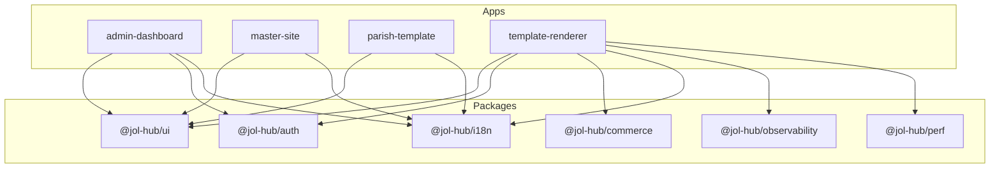
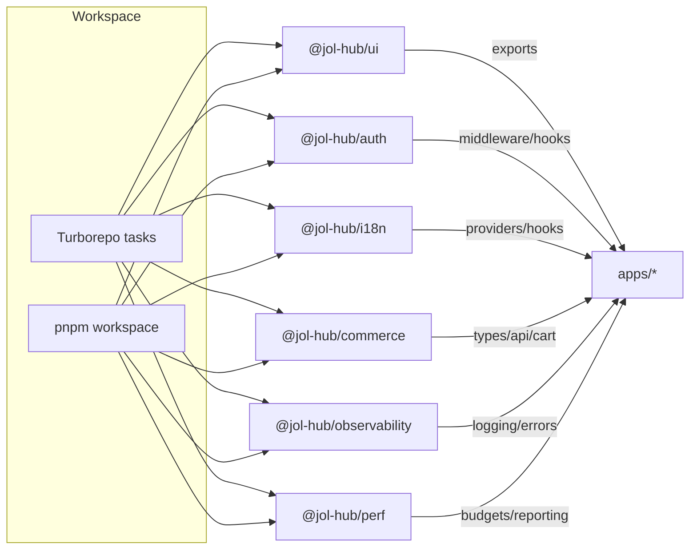
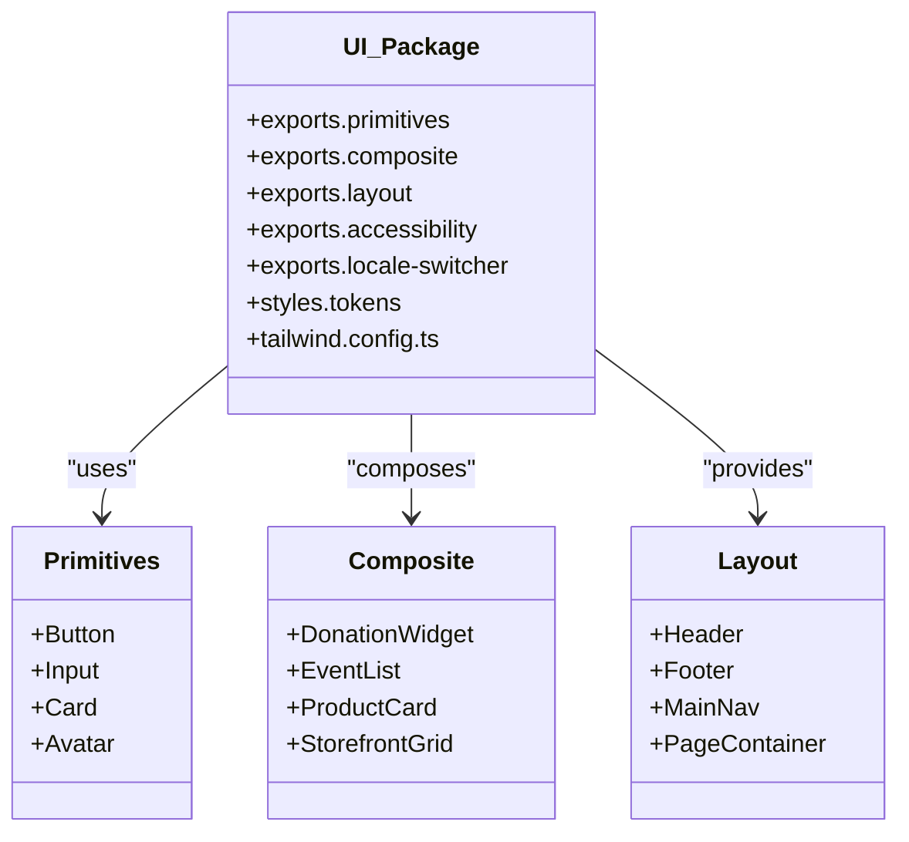
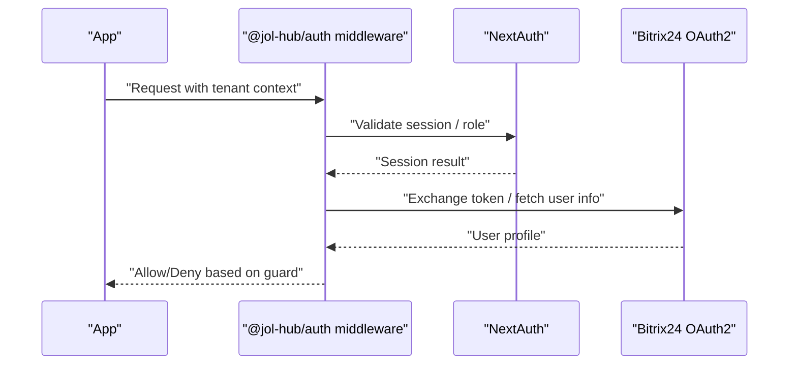
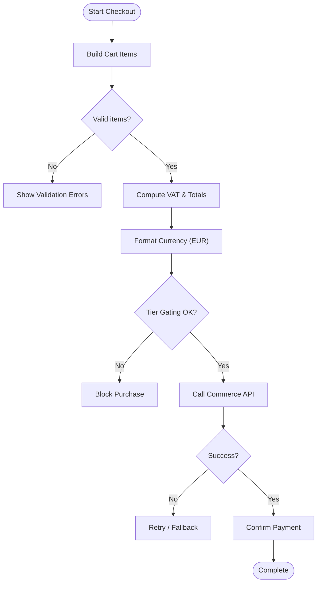
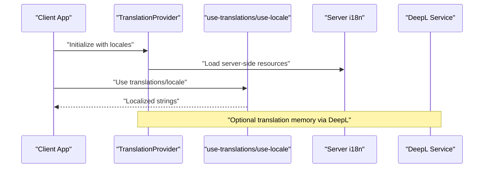
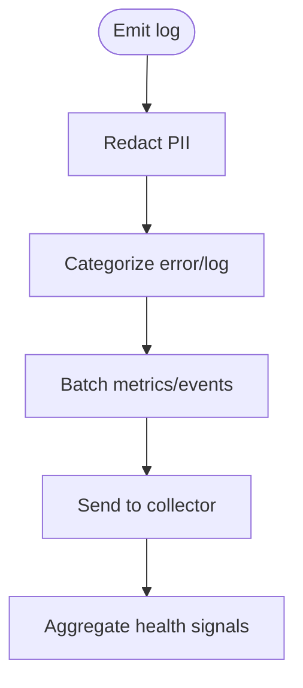
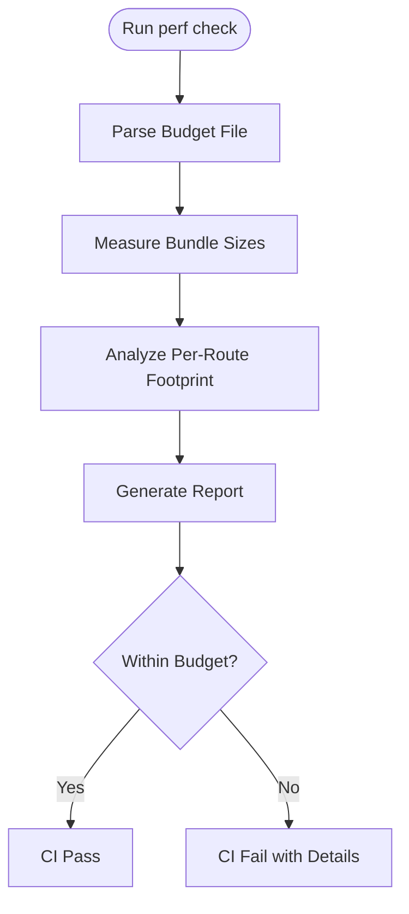
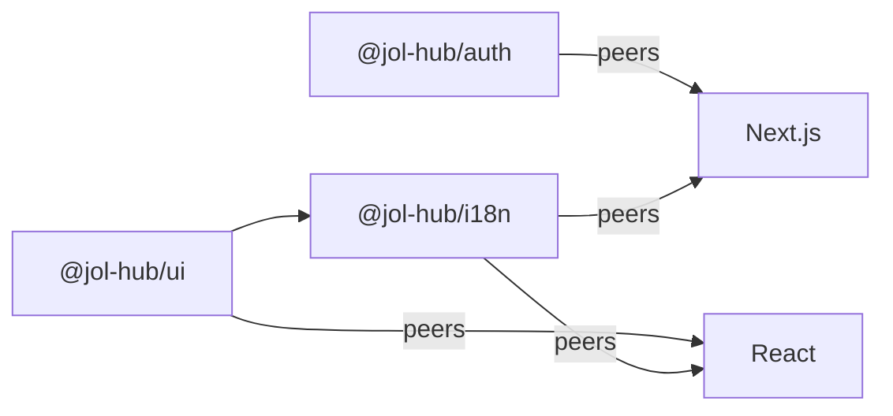

# Shared Packages & Components

<cite>
**Referenced Files in This Document**
- [frontend/package.json](file://frontend/package.json)
- [frontend/pnpm-workspace.yaml](file://frontend/pnpm-workspace.yaml)
- [frontend/turbo.json](file://frontend/turbo.json)
- [frontend/README.md](file://frontend/README.md)
- [packages/ui/package.json](file://packages/ui/package.json)
- [packages/auth/package.json](file://packages/auth/package.json)
- [packages/commerce/package.json](file://packages/commerce/package.json)
- [packages/i18n/package.json](file://packages/i18n/package.json)
- [packages/observability/package.json](file://packages/observability/package.json)
- [packages/perf/package.json](file://packages/perf/package.json)
</cite>

## Table of Contents
1. [Introduction](#introduction)
2. [Project Structure](#project-structure)
3. [Core Components](#core-components)
4. [Architecture Overview](#architecture-overview)
5. [Detailed Component Analysis](#detailed-component-analysis)
6. [Dependency Analysis](#dependency-analysis)
7. [Performance Considerations](#performance-considerations)
8. [Troubleshooting Guide](#troubleshooting-guide)
9. [Conclusion](#conclusion)
10. [Appendices](#appendices)

## Introduction
This document explains the shared packages and reusable components that power the frontend monorepo. It covers:
- UI component library (React + Tailwind CSS)
- Authentication utilities (NextAuth, Bitrix24 OAuth2, OIDC hooks)
- Commerce domain logic (donations, payments, cart, VAT, EUR formatting)
- Internationalization helpers (i18next, locale resolution, translation providers)
- Observability tools (structured logging, error tracking, performance batching)
- Performance monitoring (budget parsing, footprint analysis, CI gates)

It also documents package architecture, dependency management with pnpm workspaces and Turborepo, versioning via Changesets, and usage patterns across applications.

## Project Structure
The frontend is a pnpm workspace with multiple apps and shared packages orchestrated by Turborepo. Apps consume packages through workspace references, enabling consistent builds, type checks, tests, and releases.

**Diagram sources**
- [frontend/README.md:5-21](file://frontend/README.md#L5-L21)
- [frontend/pnpm-workspace.yaml:1-4](file://frontend/pnpm-workspace.yaml#L1-L4)

Key workspace configuration:
- Workspace scope includes apps/* and packages/*
- Turborepo tasks define build, lint, type-check, test, dev, clean with caching and output rules
- Root scripts orchestrate workspace-wide commands

**Section sources**
- [frontend/package.json:1-67](file://frontend/package.json#L1-L67)
- [frontend/pnpm-workspace.yaml:1-4](file://frontend/pnpm-workspace.yaml#L1-L4)
- [frontend/turbo.json:1-33](file://frontend/turbo.json#L1-L33)
- [frontend/README.md:1-66](file://frontend/README.md#L1-L66)

## Core Components
This section summarizes each shared package’s purpose, exports, and typical consumers.

- @jol-hub/ui
  - React primitives, composite components, layout families, design tokens, and Tailwind config
  - Exposes entry points for primitives, composite, layout, accessibility, locale-switcher, and dev showcase
  - Publishes to GitHub Packages with restricted access
  - Depends on Radix UI primitives, class-variance-authority, clsx, lucide-react, tailwind-merge, zod; peers with React/Next

- @jol-hub/auth
  - NextAuth integration, Bitrix24 OAuth2 flows, parish-level guards, and OIDC hooks
  - Exposes middleware, hooks, API client, and OIDC modules
  - Peers with Next and React

- @jol-hub/commerce
  - Framework-agnostic core for donations, bookings, subscriptions, shop
  - Provides types, API client, cart/VAT math, EUR formatting, and package-tier gating
  - React bindings are implemented in the template renderer app

- @jol-hub/i18n
  - i18next-based internationalization with providers, locale resolution, DeepL integration, and liturgical calendar translations
  - Exposes client/server/middleware/config/types/messages/provider/hooks/utils
  - Peers with Next and React

- @jol-hub/observability
  - Zero-dependency structured JSON logging with PII redaction, error categorization/fingerprinting/breadcrumbs, client performance batching, health aggregation
  - Pure logic without React/Next imports; safe for server, client, and edge

- @jol-hub/perf
  - Lighthouse-format budget parsing, gzipped-size measurement, per-route first-load footprint analysis, and CI gate reporting
  - Targets modest on-prem hardware constraints

Usage patterns across apps:
- Import UI components from @jol-hub/ui paths (e.g., primitives, composite, layout)
- Use auth middleware and hooks from @jol-hub/auth
- Compose commerce flows using @jol-hub/commerce types and API client
- Wrap apps with i18n provider and use translation hooks from @jol-hub/i18n
- Emit logs and errors via @jol-hub/observability
- Enforce budgets and measure footprints via @jol-hub/perf

**Section sources**
- [packages/ui/package.json:1-118](file://packages/ui/package.json#L1-L118)
- [packages/auth/package.json:1-66](file://packages/auth/package.json#L1-L66)
- [packages/commerce/package.json:1-30](file://packages/commerce/package.json#L1-L30)
- [packages/i18n/package.json:1-105](file://packages/i18n/package.json#L1-L105)
- [packages/observability/package.json:1-30](file://packages/observability/package.json#L1-L30)
- [packages/perf/package.json:1-30](file://packages/perf/package.json#L1-L30)

## Architecture Overview
The monorepo uses a hub-and-spoke model where shared packages provide stable APIs consumed by multiple apps. Turborepo coordinates builds/tests across packages and apps, while pnpm resolves dependencies within the workspace.

**Diagram sources**
- [frontend/turbo.json:1-33](file://frontend/turbo.json#L1-L33)
- [frontend/pnpm-workspace.yaml:1-4](file://frontend/pnpm-workspace.yaml#L1-L4)

## Detailed Component Analysis

### UI Package (@jol-hub/ui)
- Design system built on Radix primitives, composed into higher-level components
- Organized into primitives, composite, layout, accessibility, and locale-switcher
- Exposes Tailwind configuration and global styles for consistent theming
- Includes accessibility tooling and contrast checks as part of verification scripts

**Diagram sources**
- [packages/ui/package.json:5-54](file://packages/ui/package.json#L5-L54)

Typical import pattern:
- Import primitives or composite components from named export paths defined in the package exports
- Configure Tailwind to extend theme using the package’s Tailwind config
- Include global styles via the provided CSS files

**Section sources**
- [packages/ui/package.json:1-118](file://packages/ui/package.json#L1-L118)

### Auth Package (@jol-hub/auth)
- Integrates NextAuth with Bitrix24 OAuth2 flows
- Provides parish-level guards via middleware
- Offers OIDC configuration and hooks for authentication state
- Exposes an API client for Bitrix24 interactions

**Diagram sources**
- [packages/auth/package.json:5-36](file://packages/auth/package.json#L5-L36)

Typical usage:
- Apply middleware guards to protected routes
- Use hooks to read session state and trigger Bitrix24 login flows
- Call API client methods for CRM operations

**Section sources**
- [packages/auth/package.json:1-66](file://packages/auth/package.json#L1-L66)

### Commerce Package (@jol-hub/commerce)
- Domain logic for donations, bookings, subscriptions, and shop
- Provides types, API client, cart and VAT calculations, EUR formatting, and tier gating
- React-specific bindings live in the template renderer app

**Diagram sources**
- [packages/commerce/package.json:1-30](file://packages/commerce/package.json#L1-L30)

Typical usage:
- Import types and utilities to model donations/products
- Use cart functions to manage line items and totals
- Integrate with backend via the API client

**Section sources**
- [packages/commerce/package.json:1-30](file://packages/commerce/package.json#L1-L30)

### Internationalization Package (@jol-hub/i18n)
- i18next-based setup with client/server/middleware/config/types/messages/provider/hooks/utils
- Supports locale resolution, translation providers, and DeepL integration
- Includes liturgical calendar translations and GDPR messages

**Diagram sources**
- [packages/i18n/package.json:5-66](file://packages/i18n/package.json#L5-L66)

Typical usage:
- Wrap the app with the translation provider
- Use hooks to access localized content and switch locales
- Leverage middleware for language detection and routing

**Section sources**
- [packages/i18n/package.json:1-105](file://packages/i18n/package.json#L1-L105)

### Observability Package (@jol-hub/observability)
- Zero-dependency structured JSON logging with PII redaction
- Error categorization, fingerprinting, breadcrumbs
- Client performance batching and health aggregation
- Safe for server, client, and edge environments

**Diagram sources**
- [packages/observability/package.json:1-30](file://packages/observability/package.json#L1-L30)

Typical usage:
- Initialize logger and configure redaction rules
- Emit structured logs and capture errors with breadcrumbs
- Report health endpoints and aggregate metrics

**Section sources**
- [packages/observability/package.json:1-30](file://packages/observability/package.json#L1-L30)

### Performance Package (@jol-hub/perf)
- Parses Lighthouse-format budgets
- Measures gzipped sizes and per-route first-load footprint
- Reports results for CI gates targeting modest on-prem hardware

**Diagram sources**
- [packages/perf/package.json:1-30](file://packages/perf/package.json#L1-L30)

Typical usage:
- Add budget definitions and run perf checks in CI
- Investigate per-route footprints to optimize loading

**Section sources**
- [packages/perf/package.json:1-30](file://packages/perf/package.json#L1-L30)

## Dependency Analysis
- Workspace resolution: pnpm links packages/apps under apps/* and packages/*
- Turborepo tasks enforce ordering and caching for build, lint, type-check, test
- Package peer dependencies ensure consistent runtime versions across apps
- Some packages depend on others (e.g., UI depends on i18n)

**Diagram sources**
- [packages/ui/package.json:76-104](file://packages/ui/package.json#L76-L104)
- [packages/auth/package.json:51-64](file://packages/auth/package.json#L51-L64)
- [packages/i18n/package.json:83-103](file://packages/i18n/package.json#L83-L103)

Versioning strategy:
- Changesets used for versioning and changelog generation
- Release script builds packages then publishes to GitHub Packages registry

**Section sources**
- [frontend/package.json:34-37](file://frontend/package.json#L34-L37)
- [packages/ui/package.json:60-63](file://packages/ui/package.json#L60-L63)
- [packages/auth/package.json:40-43](file://packages/auth/package.json#L40-L43)
- [packages/i18n/package.json:70-73](file://packages/i18n/package.json#L70-L73)

## Performance Considerations
- Use Turborepo caching to speed up builds and tests
- Prefer importing only necessary components from @jol-hub/ui to reduce bundle size
- Leverage @jol-hub/perf to enforce budgets and monitor per-route footprints
- Use @jol-hub/observability to batch client performance events and avoid excessive network calls
- Keep shared dependencies aligned via peerDependencies to prevent duplicate bundles

[No sources needed since this section provides general guidance]

## Troubleshooting Guide
Common issues and resolutions:
- Build failures due to missing peer dependencies: ensure apps install compatible versions of React/Next
- Type errors when consuming packages: verify TypeScript settings and tsup outputs match package exports
- Localization mismatches: run i18n parity checks and find-hardcoded scripts to maintain message consistency
- Accessibility regressions: run UI package’s a11y and contrast checks before publishing
- Performance regressions: run perf checks and review per-route footprint reports

**Section sources**
- [packages/ui/package.json:67-75](file://packages/ui/package.json#L67-L75)
- [packages/i18n/package.json:74-81](file://packages/i18n/package.json#L74-L81)
- [packages/perf/package.json:12-16](file://packages/perf/package.json#L12-L16)

## Conclusion
The shared packages provide a cohesive foundation for building multi-tenant frontends consistently. By centralizing UI, auth, commerce, i18n, observability, and performance tooling, the monorepo ensures reusability, maintainability, and predictable releases. Adopting the documented usage patterns and leveraging workspace tooling will help teams scale features while maintaining quality and compliance.

[No sources needed since this section summarizes without analyzing specific files]

## Appendices

### How to Import and Use Shared Components
- UI components: import from named export paths (primitives, composite, layout, accessibility, locale-switcher)
- Auth: apply middleware guards and use hooks for session and Bitrix24 flows
- Commerce: use types and API client for donations/payments; React bindings in template renderer
- i18n: wrap app with provider and use hooks for translations and locale switching
- Observability: initialize logger and emit structured logs/errors
- Perf: add budgets and run checks in CI

[No sources needed since this section provides general guidance]

### Creating a New Package
Steps:
- Create a new folder under packages/<name>
- Define package.json with name, version, description, exports, scripts, dependencies, peerDependencies, publishConfig
- Implement source code and tests under src/
- Add build/type-check/test scripts using tsup and tsx
- Reference the package in apps via workspace protocol
- Run workspace commands to build, lint, type-check, and test

**Section sources**
- [frontend/package.json:11-37](file://frontend/package.json#L11-L37)
- [frontend/turbo.json:5-31](file://frontend/turbo.json#L5-L31)

### Maintaining Consistency Across the Codebase
- Use shared Tailwind config and tokens from @jol-hub/ui
- Enforce linting and formatting via root scripts
- Run type checks and tests across the workspace
- Use changesets for versioning and changelogs
- Adhere to package boundaries and peer dependency contracts

**Section sources**
- [frontend/package.json:39-65](file://frontend/package.json#L39-L65)
- [packages/ui/package.json:60-66](file://packages/ui/package.json#L60-L66)