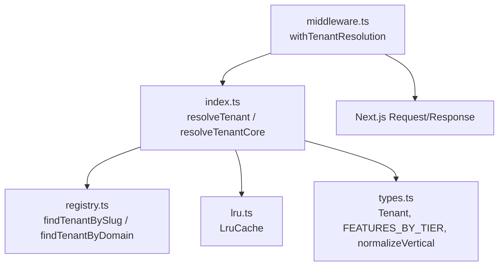
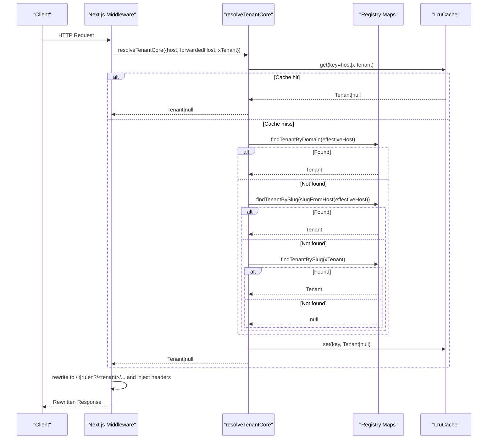
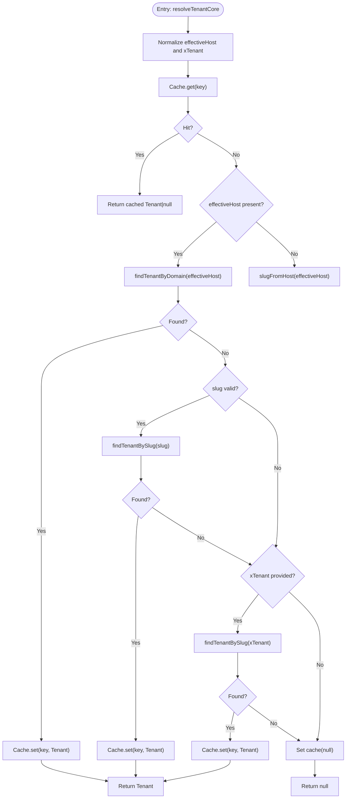
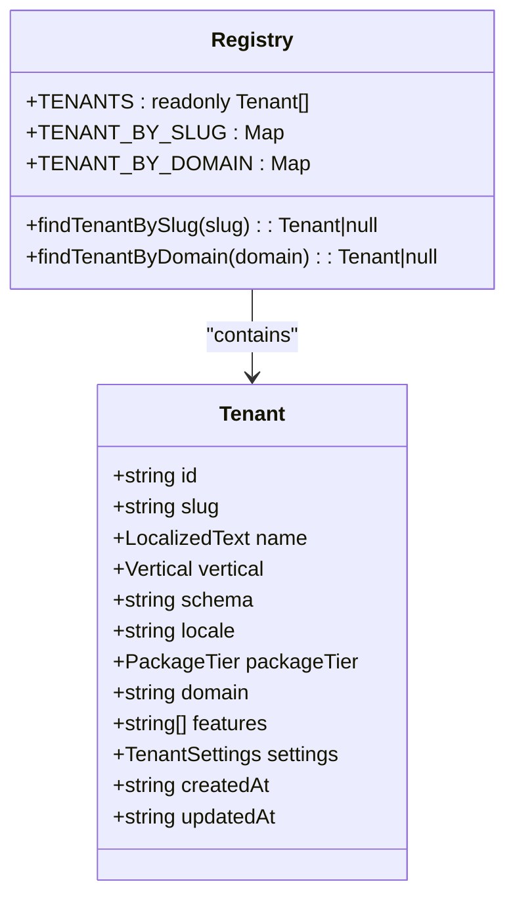
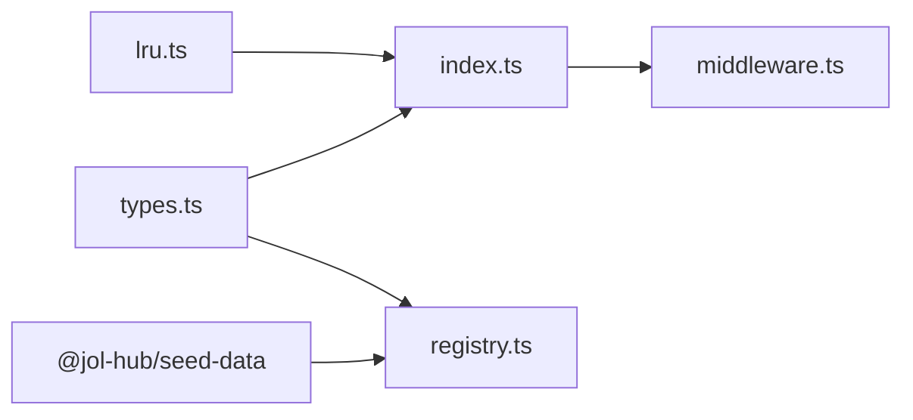

# Tenant Resolver Package

<cite>
**Referenced Files in This Document**
- [index.ts](file://frontend/packages/tenant-resolver/src/index.ts)
- [types.ts](file://frontend/packages/tenant-resolver/src/types.ts)
- [registry.ts](file://frontend/packages/tenant-resolver/src/registry.ts)
- [middleware.ts](file://frontend/packages/tenant-resolver/src/middleware.ts)
- [lru.ts](file://frontend/packages/tenant-resolver/src/lru.ts)
- [resolver.test.ts](file://frontend/packages/tenant-resolver/src/__tests__/resolver.test.ts)
- [lru.test.ts](file://frontend/packages/tenant-resolver/src/__tests__/lru.test.ts)
- [package.json](file://frontend/packages/tenant-resolver/package.json)
</cite>

## Table of Contents
1. [Introduction](#introduction)
2. [Project Structure](#project-structure)
3. [Core Components](#core-components)
4. [Architecture Overview](#architecture-overview)
5. [Detailed Component Analysis](#detailed-component-analysis)
6. [Dependency Analysis](#dependency-analysis)
7. [Performance Considerations](#performance-considerations)
8. [Troubleshooting Guide](#troubleshooting-guide)
9. [Conclusion](#conclusion)
10. [Appendices](#appendices)

## Introduction
This package provides the tenant resolution layer for multi-tenancy across the JOL template renderer. It detects tenants from hostnames/subdomains, explicit headers, and proxy headers; loads tenant configuration from a static registry; and exposes safe surfaces to downstream server code and Next.js middleware. It also supports dynamic theme switching via verticals and feature flags derived from package tiers.

Key responsibilities:
- Detect tenant from hostname/subdomain or explicit header overrides
- Load tenant configuration (vertical, locale, features, settings)
- Rewrite requests into tenant-scoped paths with safe headers
- Provide caching for fast, edge-compatible resolution
- Enforce security boundaries by keeping schema names server-only

## Project Structure
The package is organized around a small set of focused modules:
- index.ts: Public API for resolving tenants from request inputs and headers
- types.ts: Shared types, feature baselines per tier, and helpers
- registry.ts: Static tenant registry and lookup maps
- middleware.ts: Next.js middleware helper that rewrites URLs and injects headers
- lru.ts: Minimal LRU cache with TTL for resolution results

**Diagram sources**
- [index.ts:112-154](file://frontend/packages/tenant-resolver/src/index.ts#L112-L154)
- [registry.ts:150-173](file://frontend/packages/tenant-resolver/src/registry.ts#L150-L173)
- [lru.ts:15-56](file://frontend/packages/tenant-resolver/src/lru.ts#L15-L56)
- [middleware.ts:49-90](file://frontend/packages/tenant-resolver/src/middleware.ts#L49-L90)

**Section sources**
- [index.ts:1-195](file://frontend/packages/tenant-resolver/src/index.ts#L1-L195)
- [types.ts:1-162](file://frontend/packages/tenant-resolver/src/types.ts#L1-L162)
- [registry.ts:1-174](file://frontend/packages/tenant-resolver/src/registry.ts#L1-L174)
- [middleware.ts:1-91](file://frontend/packages/tenant-resolver/src/middleware.ts#L1-L91)
- [lru.ts:1-57](file://frontend/packages/tenant-resolver/src/lru.ts#L1-L57)
- [package.json:1-44](file://frontend/packages/tenant-resolver/package.json#L1-L44)

## Core Components
- Tenant detection and resolution:
  - resolveTenantCore(input): pure function implementing resolution order (exact domain → subdomain slug → X-Tenant header), with caching
  - resolveTenant(hostname, headers): async wrapper over core resolution using request headers
  - resolveTenantFromHeaders(getHeader): resolves using a header getter suitable for server components
  - resolveTenantRequest(request): convenience for Next.js NextRequest
- Registry and configuration:
  - Static TENANTS array and Maps for O(1) lookups by slug and domain
  - Features baseline per package tier and normalization utilities
- Middleware:
  - withTenantResolution(options): rewrites URL to include tenant segment and injects server-only headers for downstream code
- Cache:
  - LruCache<T>: bounded size, TTL-based expiry, LRU eviction, safe for edge runtime

Security notes:
- Schema names are server-only and never serialized to clients
- Unknown slugs/domains return null (closed lookup) to prevent enumeration

**Section sources**
- [index.ts:33-195](file://frontend/packages/tenant-resolver/src/index.ts#L33-L195)
- [registry.ts:15-174](file://frontend/packages/tenant-resolver/src/registry.ts#L15-L174)
- [types.ts:15-162](file://frontend/packages/tenant-resolver/src/types.ts#L15-L162)
- [middleware.ts:23-90](file://frontend/packages/tenant-resolver/src/middleware.ts#L23-L90)
- [lru.ts:10-56](file://frontend/packages/tenant-resolver/src/lru.ts#L10-L56)

## Architecture Overview
The resolver follows a strict chain: domain/subdomain → tenant → schema → template variant (vertical) → locale → content. Resolution prioritizes exact custom domains, then subdomain extraction against a base domain, then an explicit X-Tenant header. Results are cached with a short TTL to meet performance budgets.

**Diagram sources**
- [index.ts:112-154](file://frontend/packages/tenant-resolver/src/index.ts#L112-L154)
- [registry.ts:150-173](file://frontend/packages/tenant-resolver/src/registry.ts#L150-L173)
- [lru.ts:24-46](file://frontend/packages/tenant-resolver/src/lru.ts#L24-L46)
- [middleware.ts:49-90](file://frontend/packages/tenant-resolver/src/middleware.ts#L49-L90)

## Detailed Component Analysis

### Tenant Detection and Resolution
- Resolution order:
  1) Exact hostname match for custom domains
  2) Subdomain extraction from base domain to slug
  3) Explicit X-Tenant header override (dev/admin)
- Normalization:
  - Host: strip ports, lowercase, remove www prefix
  - Slug: lowercase, trim, validate against allowlist regex
- Caching:
  - Key includes effective host and x-tenant header
  - Negative results are cached to avoid repeated lookups
- Public surface:
  - toPublicTenant strips server-only schema field before crossing to client contexts

**Diagram sources**
- [index.ts:64-141](file://frontend/packages/tenant-resolver/src/index.ts#L64-L141)

**Section sources**
- [index.ts:64-141](file://frontend/packages/tenant-resolver/src/index.ts#L64-L141)
- [index.ts:148-195](file://frontend/packages/tenant-resolver/src/index.ts#L148-L195)

### Configuration Loading and Registry
- Static registry composed of Wave-1 pilot entries and derived fixture tenants
- Lookup maps built at module load time for O(1) access
- Schema naming follows a consistent pattern derived from tenant slug
- Feature flags are computed per tenant based on package tier baseline plus optional extras

**Diagram sources**
- [types.ts:44-71](file://frontend/packages/tenant-resolver/src/types.ts#L44-L71)
- [registry.ts:150-173](file://frontend/packages/tenant-resolver/src/registry.ts#L150-L173)

**Section sources**
- [registry.ts:15-174](file://frontend/packages/tenant-resolver/src/registry.ts#L15-L174)
- [types.ts:76-123](file://frontend/packages/tenant-resolver/src/types.ts#L76-L123)

### Dynamic Theme Switching and Feature Flags
- Vertical drives template/theme selection (e.g., cathedral vs funeral)
- Package tier determines baseline feature set; tenants can have extra features
- Use vertical and features to conditionally render tenant-specific layouts and capabilities

Implementation guidance:
- Choose layout based on tenant.vertical
- Gate UI elements and routes using tenant.features
- Derive schema name from tenant.slug for server-side data access

**Section sources**
- [types.ts:22-36](file://frontend/packages/tenant-resolver/src/types.ts#L22-L36)
- [types.ts:91-123](file://frontend/packages/tenant-resolver/src/types.ts#L91-L123)
- [types.ts:129-161](file://frontend/packages/tenant-resolver/src/types.ts#L129-L161)

### Middleware and Routing
- Rewrites incoming requests to include tenant segment while preserving locale prefixes
- Injects server-only headers (tenant id, schema, vertical, locale) for downstream server code
- Excludes internal paths (Next internals, static assets, APIs) from rewriting

Usage example path:
- See usage comments in middleware file for integration in Next.js apps

**Section sources**
- [middleware.ts:1-91](file://frontend/packages/tenant-resolver/src/middleware.ts#L1-L91)

### LRU Cache
- Edge-safe implementation with configurable max size and TTL
- Evicts least-recently-used entries when full
- Supports negative result caching to keep unknown tenant probes cheap

**Section sources**
- [lru.ts:1-57](file://frontend/packages/tenant-resolver/src/lru.ts#L1-L57)

## Dependency Analysis
- Internal dependencies:
  - index.ts depends on registry.ts, lru.ts, types.ts
  - middleware.ts depends on index.ts
  - registry.ts depends on types.ts and seed-data fixtures
- External dependencies:
  - next (peer dependency) for middleware integration
  - @jol-hub/seed-data for fixture tenants

**Diagram sources**
- [index.ts:22-31](file://frontend/packages/tenant-resolver/src/index.ts#L22-L31)
- [registry.ts:15-18](file://frontend/packages/tenant-resolver/src/registry.ts#L15-L18)
- [middleware.ts:17-21](file://frontend/packages/tenant-resolver/src/middleware.ts#L17-L21)
- [package.json:29-34](file://frontend/packages/tenant-resolver/package.json#L29-L34)

**Section sources**
- [package.json:1-44](file://frontend/packages/tenant-resolver/package.json#L1-L44)

## Performance Considerations
- Resolution budget: closed lookups over static maps with no DB calls; well under 5ms
- Caching:
  - In-memory LRU cache with 5-minute TTL
  - Negative results cached to mitigate enumeration probes
  - Cache key includes effective host and x-tenant header to differentiate contexts
- Memory:
  - Bounded map size prevents unbounded growth
  - Eviction policy removes least-recently-used entries
- Edge compatibility:
  - No Node.js-specific APIs used in cache; safe for Next.js middleware edge runtime

Recommendations:
- Monitor cache size and hit rates in production
- Adjust TTL if tenant configurations change frequently
- Ensure environment variable TENANT_BASE_DOMAIN is correctly configured

**Section sources**
- [index.ts:51-62](file://frontend/packages/tenant-resolver/src/index.ts#L51-L62)
- [lru.ts:15-56](file://frontend/packages/tenant-resolver/src/lru.ts#L15-L56)

## Troubleshooting Guide
Common issues and resolutions:
- Unknown tenant returns null:
  - Verify slug validity and presence in registry
  - Check base domain configuration and subdomain mapping
- Custom domain not resolving:
  - Ensure domain is registered in registry and matches exactly
- X-Tenant header ignored:
  - Confirm header name and value normalization rules
  - Remember hostname takes precedence over X-Tenant
- Middleware not rewriting path:
  - Ensure excluded paths do not match your route
  - Verify locale prefix handling and rewrite target
- Cache-related stale data:
  - Use clearTenantCache() during development or after config changes
  - Inspect cache size for unexpected growth

Operational hooks:
- clearTenantCache(): clears resolution cache
- tenantResolutionCacheSize(): inspects current cache size

**Section sources**
- [index.ts:54-62](file://frontend/packages/tenant-resolver/src/index.ts#L54-L62)
- [middleware.ts:23-35](file://frontend/packages/tenant-resolver/src/middleware.ts#L23-L35)
- [resolver.test.ts:131-172](file://frontend/packages/tenant-resolver/src/__tests__/resolver.test.ts#L131-L172)

## Conclusion
The tenant resolver package delivers a secure, performant, and extensible foundation for multi-tenancy. It enforces closed lookups, keeps sensitive schema information server-only, and provides robust middleware integration for routing and context propagation. With feature flags and vertical-driven themes, it enables tenant-specific experiences while maintaining a consistent platform.

## Appendices

### How to Configure Tenants
- Add new tenants to the static registry with slug, names, vertical, package tier, and optional extra features
- For custom domains, set the domain field so exact-hostname matching applies
- Ensure slug conforms to the allowlist pattern

**Section sources**
- [registry.ts:23-53](file://frontend/packages/tenant-resolver/src/registry.ts#L23-L53)
- [registry.ts:59-110](file://frontend/packages/tenant-resolver/src/registry.ts#L59-L110)
- [types.ts:73-79](file://frontend/packages/tenant-resolver/src/types.ts#L73-L79)

### How to Resolve Tenant Context in Server Code
- Use resolveTenantFromHeaders(getHeader) in server components where NextRequest is unavailable
- Use resolveTenantRequest(request) in middleware or handlers with NextRequest
- Access vertical, locale, features, and settings from the resolved tenant object

**Section sources**
- [index.ts:176-195](file://frontend/packages/tenant-resolver/src/index.ts#L176-L195)

### Handling Tenant-Specific Assets and Layouts
- Select layout based on tenant.vertical
- Gate UI and routes using tenant.features
- Serve assets scoped by tenant slug or vertical as needed in your app’s asset strategy

**Section sources**
- [types.ts:22-36](file://frontend/packages/tenant-resolver/src/types.ts#L22-L36)
- [types.ts:91-123](file://frontend/packages/tenant-resolver/src/types.ts#L91-L123)

### Error Handling for Missing or Invalid Tenants
- Treat null resolution as “not found” and render a bare 404 without echoing attempted values
- Validate slugs early using the allowlist pattern to reject invalid input
- Log and monitor failed resolutions for operational insights

**Section sources**
- [index.ts:17-21](file://frontend/packages/tenant-resolver/src/index.ts#L17-L21)
- [index.ts:64-70](file://frontend/packages/tenant-resolver/src/index.ts#L64-L70)
- [resolver.test.ts:59-67](file://frontend/packages/tenant-resolver/src/__tests__/resolver.test.ts#L59-L67)