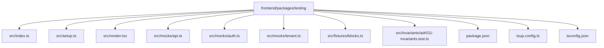
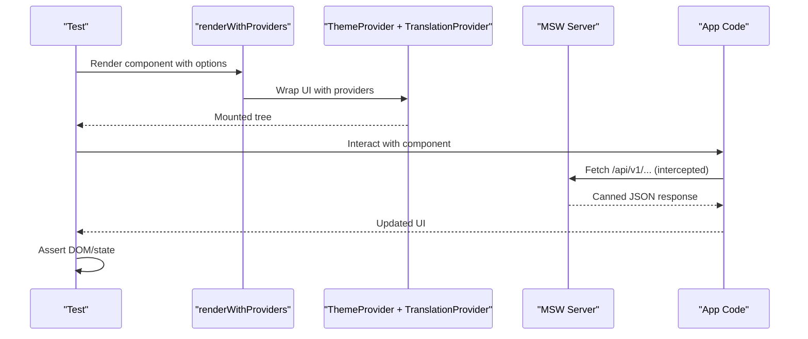
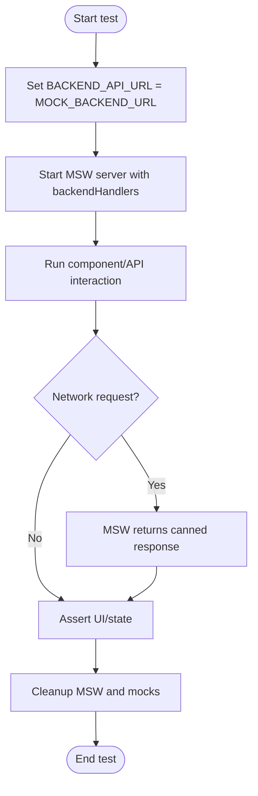
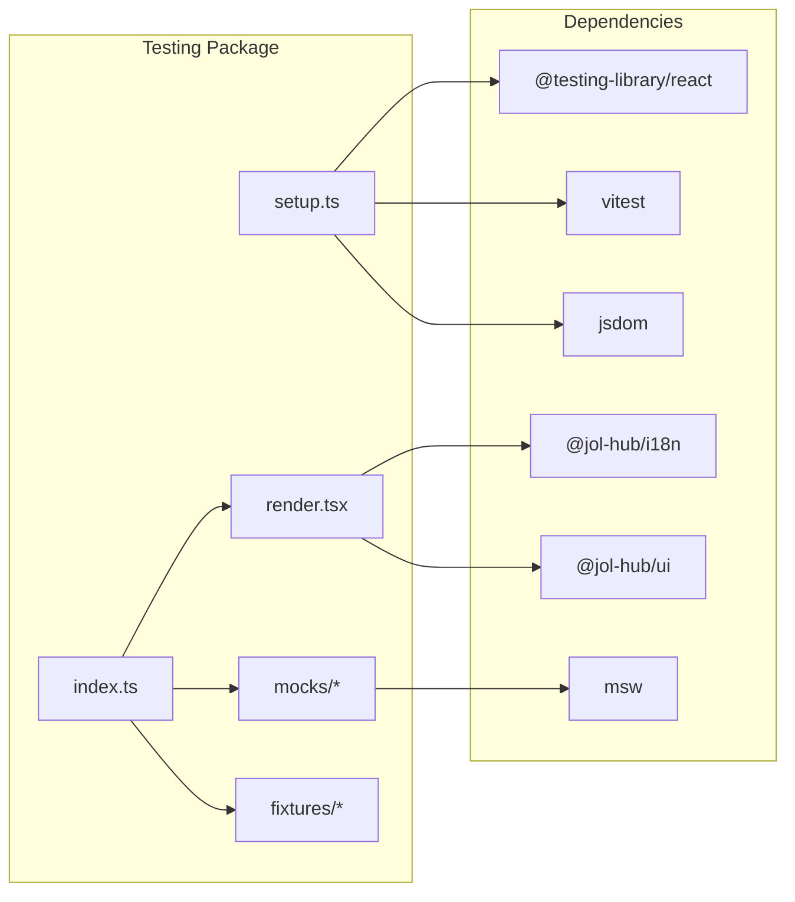

# Testing Package

<cite>
**Referenced Files in This Document**
- [package.json](file://frontend/packages/testing/package.json)
- [tsup.config.ts](file://frontend/packages/testing/tsup.config.ts)
- [tsconfig.json](file://frontend/packages/testing/tsconfig.json)
- [index.ts](file://frontend/packages/testing/src/index.ts)
- [setup.ts](file://frontend/packages/testing/src/setup.ts)
- [render.tsx](file://frontend/packages/testing/src/render.tsx)
- [api.ts](file://frontend/packages/testing/src/mocks/api.ts)
- [auth.ts](file://frontend/packages/testing/src/mocks/auth.ts)
- [tenant.ts](file://frontend/packages/testing/src/mocks/tenant.ts)
- [blocks.ts](file://frontend/packages/testing/src/fixtures/blocks.ts)
- [adr011-invariants.test.ts](file://frontend/packages/testing/src/invariants/adr011-invariants.test.ts)
- [vitest.config.ts](file://frontend/apps/template-renderer/vitest.config.ts)
</cite>

## Table of Contents
1. [Introduction](#introduction)
2. [Project Structure](#project-structure)
3. [Core Components](#core-components)
4. [Architecture Overview](#architecture-overview)
5. [Detailed Component Analysis](#detailed-component-analysis)
6. [Dependency Analysis](#dependency-analysis)
7. [Performance Considerations](#performance-considerations)
8. [Troubleshooting Guide](#troubleshooting-guide)
9. [Conclusion](#conclusion)
10. [Appendices](#appendices)

## Introduction
This documentation describes the shared testing package that provides a deterministic, isolated, and offline-first test harness for the frontend. It standardizes:
- Test setup (cleanup, timezone, jsdom shims, React act environment)
- Provider-aware rendering for React components
- Mocking strategies for tenant context, authentication sessions, and backend APIs via MSW
- Reusable fixtures for editor blocks and XSS payloads
- Invariant tests to enforce architectural rules across the monorepo

The package is designed so that unit, integration, and end-to-end tests can reuse consistent utilities without depending on real networks, timers, or shared mutable state.

## Project Structure
The testing package exposes two entry points:
- Main exports for render helpers, mocks, and fixtures
- A Vitest setup file for global configuration

**Diagram sources**
- [package.json:1-52](file://frontend/packages/testing/package.json#L1-L52)
- [tsup.config.ts:1-15](file://frontend/packages/testing/tsup.config.ts#L1-L15)
- [tsconfig.json:1-14](file://frontend/packages/testing/tsconfig.json#L1-L14)
- [index.ts:1-39](file://frontend/packages/testing/src/index.ts#L1-L39)
- [setup.ts:1-51](file://frontend/packages/testing/src/setup.ts#L1-L51)
- [render.tsx:1-48](file://frontend/packages/testing/src/render.tsx#L1-L48)
- [api.ts:1-120](file://frontend/packages/testing/src/mocks/api.ts#L1-L120)
- [auth.ts:1-59](file://frontend/packages/testing/src/mocks/auth.ts#L1-L59)
- [tenant.ts:1-50](file://frontend/packages/testing/src/mocks/tenant.ts#L1-L50)
- [blocks.ts:1-59](file://frontend/packages/testing/src/fixtures/blocks.ts#L1-L59)
- [adr011-invariants.test.ts:1-392](file://frontend/packages/testing/src/invariants/adr011-invariants.test.ts#L1-L392)

**Section sources**
- [package.json:1-52](file://frontend/packages/testing/package.json#L1-L52)
- [tsup.config.ts:1-15](file://frontend/packages/testing/tsup.config.ts#L1-L15)
- [tsconfig.json:1-14](file://frontend/packages/testing/tsconfig.json#L1-L14)
- [index.ts:1-39](file://frontend/packages/testing/src/index.ts#L1-L39)

## Core Components
- Global setup: Ensures RTL cleanup, fixed timezone, jsdom shims, and React act environment.
- Provider-aware render: Wraps components with ThemeProvider and TranslationProvider; supports an optional app-level wrapper.
- Mocks:
  - Tenant: Deterministic tenant fixtures representing different tiers and features.
  - Auth: Session fixtures mirroring the expected session shape with roles and platform roles.
  - API: MSW handlers intercepting backend routes with canned responses.
- Fixtures: Canonical block drafts and XSS payload batteries for sanitization testing.
- Invariants: Monorepo-wide rule enforcement tests (versioned packages, payment boundary, theme verticals, uniform stack, GDPR records, reversibility).

How to use:
- Unit tests: Import renderWithProviders and fixtures; assert component behavior deterministically.
- Integration tests: Start MSW server with backendHandlers; set BACKEND_API_URL to MOCK_BACKEND_URL before importing modules that fetch from the backend.
- End-to-end tests: Use Playwright with MSW or stubbed fetch to simulate user flows against mocked endpoints.

**Section sources**
- [setup.ts:1-51](file://frontend/packages/testing/src/setup.ts#L1-L51)
- [render.tsx:1-48](file://frontend/packages/testing/src/render.tsx#L1-L48)
- [tenant.ts:1-50](file://frontend/packages/testing/src/mocks/tenant.ts#L1-L50)
- [auth.ts:1-59](file://frontend/packages/testing/src/mocks/auth.ts#L1-L59)
- [api.ts:1-120](file://frontend/packages/testing/src/mocks/api.ts#L1-L120)
- [blocks.ts:1-59](file://frontend/packages/testing/src/fixtures/blocks.ts#L1-L59)
- [adr011-invariants.test.ts:1-392](file://frontend/packages/testing/src/invariants/adr011-invariants.test.ts#L1-L392)

## Architecture Overview
The testing package composes a predictable environment for tests:
- Vitest runs with the provided setup file to guarantee isolation and determinism.
- Tests render components using renderWithProviders, which injects theme and i18n contexts and optionally an app-specific provider.
- Network calls are intercepted by MSW handlers configured with a reserved test origin.
- Fixtures provide canonical data for editor content and security testing.

**Diagram sources**
- [render.tsx:1-48](file://frontend/packages/testing/src/render.tsx#L1-L48)
- [api.ts:1-120](file://frontend/packages/testing/src/mocks/api.ts#L1-L120)
- [setup.ts:1-51](file://frontend/packages/testing/src/setup.ts#L1-L51)

## Detailed Component Analysis

### Global Setup (Vitest)
Ensures:
- Automatic cleanup after each test to prevent DOM leaks
- Timezone locked to UTC for deterministic time-based logic
- React act environment flag for Testing Library compatibility
- Shims for matchMedia and scrollTo to support theme hooks and navigation

Usage:
- Configure your Vitest config to include this setup file under setupFiles.

**Section sources**
- [setup.ts:1-51](file://frontend/packages/testing/src/setup.ts#L1-L51)

### Provider-Aware Rendering
Provides renderWithProviders that:
- Loads messages for a given locale and optional vertical overrides
- Wraps components with ThemeProvider and TranslationProvider
- Accepts an optional wrapper to compose app-level providers outside i18n

Typical usage:
- Pass locale and messagesOverrides to simulate different tenants or languages
- Provide a wrapper to add tenant or auth context specific to your app

**Section sources**
- [render.tsx:1-48](file://frontend/packages/testing/src/render.tsx#L1-L48)
- [index.ts:1-39](file://frontend/packages/testing/src/index.ts#L1-L39)

### Mocking Strategies

#### Tenant Context
Deterministic tenant fixtures:
- mockTenant: Normal-tier church tenant with editing and commerce features
- mockCheapTenant: Read-only tenant with limited features
- mockFuneralTenant: VIP funeral tenant with full commerce surface

Use these to simulate feature flags and tenant-scoped behavior in components.

**Section sources**
- [tenant.ts:1-50](file://frontend/packages/testing/src/mocks/tenant.ts#L1-L50)

#### Authentication Sessions
Session fixtures mirror the expected session shape:
- mockSession: Base session with editor role
- mockAdminSession: Admin role with MFA enrolled
- mockSuperAdminSession: Platform superadmin
- mockViewerSession: Viewer role

These help test RBAC gates and conditional UI without real tokens.

**Section sources**
- [auth.ts:1-59](file://frontend/packages/testing/src/mocks/auth.ts#L1-L59)

#### Backend API (MSW)
Intercepts backend routes at the network layer with canned responses:
- Editor draft CRUD and publish
- Moderation queue listing and actions
- Media library listing and upload
- Performance metrics endpoint

Key concepts:
- MOCK_BACKEND_URL is the reserved test host
- backendHandlers define default responses; tests can override per-route using MSW’s handler precedence
- Tests must set BACKEND_API_URL to MOCK_BACKEND_URL before importing modules that perform network requests

**Diagram sources**
- [api.ts:1-120](file://frontend/packages/testing/src/mocks/api.ts#L1-L120)

**Section sources**
- [api.ts:1-120](file://frontend/packages/testing/src/mocks/api.ts#L1-L120)

### Fixtures
Canonical editor block fixtures:
- validBlocks: A small, well-formed draft
- hostileBlocks: Draft containing XSS payloads, unsafe links, and missing alt text
- XSS_PAYLOADS and CONTACT_XSS_PAYLOADS: Standardized payloads to validate sanitization surfaces

Use these to verify that editors and renderers safely handle malicious input.

**Section sources**
- [blocks.ts:1-59](file://frontend/packages/testing/src/fixtures/blocks.ts#L1-L59)

### Invariant Tests
Monorepo-wide enforcement tests covering:
- INV-2: Versioned packages (semver, changelogs, dist outputs, registry)
- INV-3: Payment boundary closed (no PSP SDK imports or dependencies)
- INV-5: Theme vertical (no denomination literals in UI code)
- INV-7: Uniform stack (Next.js 14, React 18, TS strict, pnpm version)
- INV-9: GDPR Art. 9 (ROPA records exist per vertical)
- INV-11: Reversibility (workspace protocol, build scripts, export paths)

These tests run in the hub monorepo and ensure consistency across packages and apps.

**Section sources**
- [adr011-invariants.test.ts:1-392](file://frontend/packages/testing/src/invariants/adr011-invariants.test.ts#L1-L392)

## Dependency Analysis
The testing package depends on:
- @jol-hub/i18n for message loading and translation provider
- @jol-hub/ui for theme provider
- react and react-dom for rendering
- Peer dependencies: @testing-library/react and vitest
- Dev dependencies: jsdom, msw, typescript, vitest

Build and distribution:
- tsup builds ESM and CJS with TypeScript declarations
- Exports expose both the main module and the setup file

**Diagram sources**
- [package.json:1-52](file://frontend/packages/testing/package.json#L1-L52)
- [tsup.config.ts:1-15](file://frontend/packages/testing/tsup.config.ts#L1-L15)
- [index.ts:1-39](file://frontend/packages/testing/src/index.ts#L1-L39)
- [render.tsx:1-48](file://frontend/packages/testing/src/render.tsx#L1-L48)
- [setup.ts:1-51](file://frontend/packages/testing/src/setup.ts#L1-L51)
- [api.ts:1-120](file://frontend/packages/testing/src/mocks/api.ts#L1-L120)

**Section sources**
- [package.json:1-52](file://frontend/packages/testing/package.json#L1-L52)
- [tsup.config.ts:1-15](file://frontend/packages/testing/tsup.config.ts#L1-L15)
- [tsconfig.json:1-14](file://frontend/packages/testing/tsconfig.json#L1-L14)

## Performance Considerations
- Keep tests fast by reusing deterministic fixtures and avoiding heavy DOM operations.
- Prefer MSW over real network calls to eliminate flakiness and latency.
- Use minimal locales and messagesOverrides to reduce message resolution overhead.
- Limit provider depth by composing only necessary wrappers in tests.
- Leverage invariant tests to catch regressions early in CI.

[No sources needed since this section provides general guidance]

## Troubleshooting Guide
Common issues and resolutions:
- Flaky time-dependent tests: Ensure setup sets TZ to UTC and avoid relying on wall-clock time unless explicitly faked in tests.
- Theme or consent failures in jsdom: The setup provides matchMedia and scrollTo shims; if custom globals are required, extend setup accordingly.
- Network errors in tests: Confirm BACKEND_API_URL is set to MOCK_BACKEND_URL before importing modules that call the backend, and start MSW with backendHandlers.
- Provider mismatches: Use renderWithProviders with the correct locale and messagesOverrides; pass app-specific wrappers when needed.
- MSW conflicts: If multiple handlers match, rely on MSW precedence; override specific routes in tests to isolate behavior.

**Section sources**
- [setup.ts:1-51](file://frontend/packages/testing/src/setup.ts#L1-L51)
- [api.ts:1-120](file://frontend/packages/testing/src/mocks/api.ts#L1-L120)
- [render.tsx:1-48](file://frontend/packages/testing/src/render.tsx#L1-L48)

## Conclusion
The testing package centralizes deterministic test setup, provider-aware rendering, robust mocking, and reusable fixtures to streamline unit, integration, and end-to-end testing across the frontend. Coupled with invariant tests, it enforces architectural standards and reduces flakiness while improving developer productivity.

[No sources needed since this section summarizes without analyzing specific files]

## Appendices

### How to Write Tests Using the Package

- Unit tests for React components:
  - Import renderWithProviders and fixtures
  - Render with appropriate locale and messagesOverrides
  - Optionally provide an app-level wrapper for tenant or auth context
  - Assert rendered output and interactions

- Integration tests with backend:
  - Set BACKEND_API_URL to MOCK_BACKEND_URL before importing modules that fetch
  - Start MSW server with backendHandlers
  - Interact with components that trigger network calls
  - Assert outcomes based on canned responses

- End-to-end tests:
  - Use Playwright with MSW or stubbed fetch to simulate user flows
  - Leverage fixtures for realistic editor content and media states

- Running test suites:
  - Configure Vitest to include the setup file under setupFiles
  - Build the package with tsup to generate dist artifacts
  - Execute tests via your workspace tooling

**Section sources**
- [vitest.config.ts:1-200](file://frontend/apps/template-renderer/vitest.config.ts#L1-L200)
- [tsup.config.ts:1-15](file://frontend/packages/testing/tsup.config.ts#L1-L15)
- [setup.ts:1-51](file://frontend/packages/testing/src/setup.ts#L1-L51)
- [api.ts:1-120](file://frontend/packages/testing/src/mocks/api.ts#L1-L120)
- [render.tsx:1-48](file://frontend/packages/testing/src/render.tsx#L1-L48)