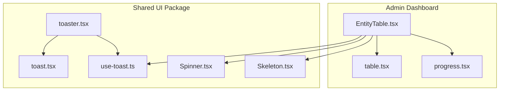
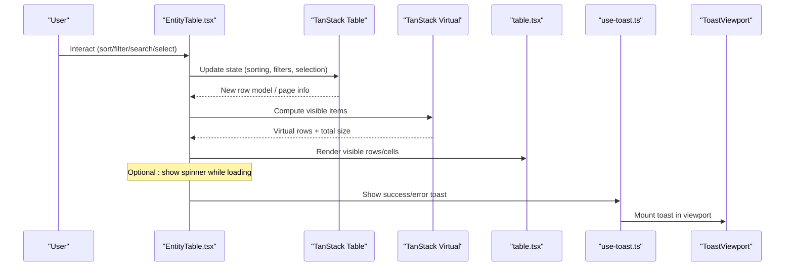
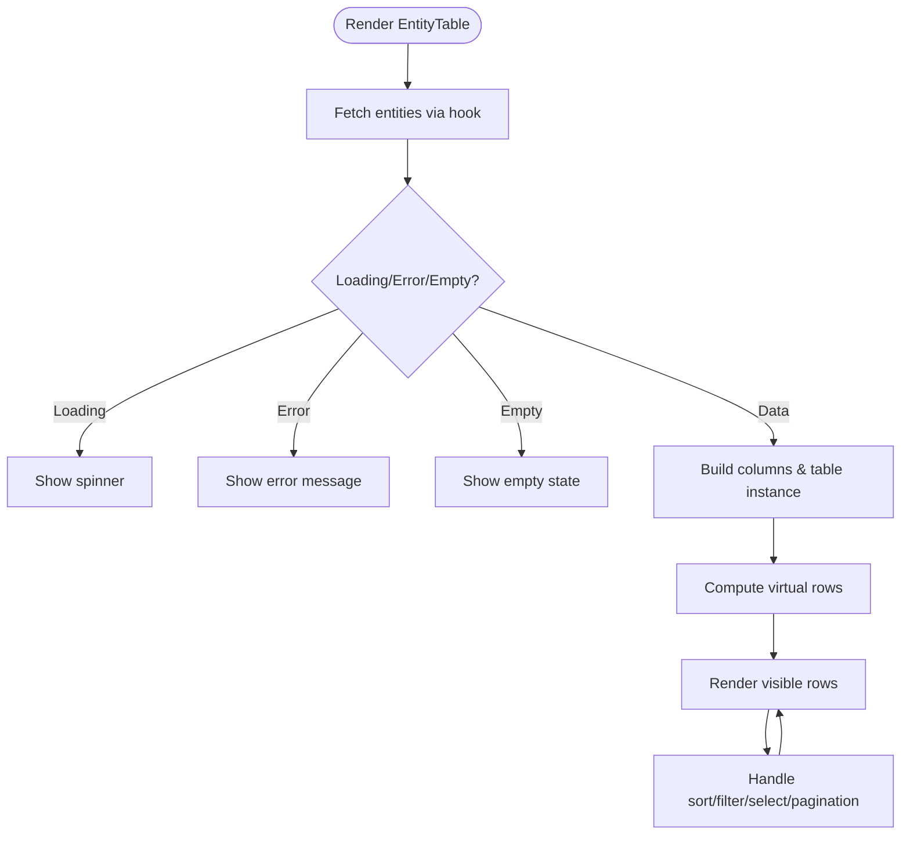
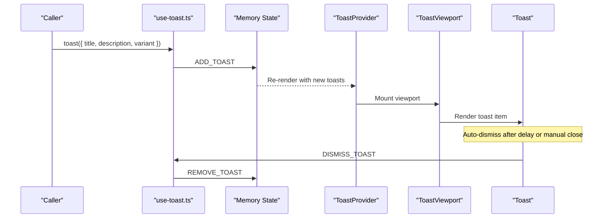
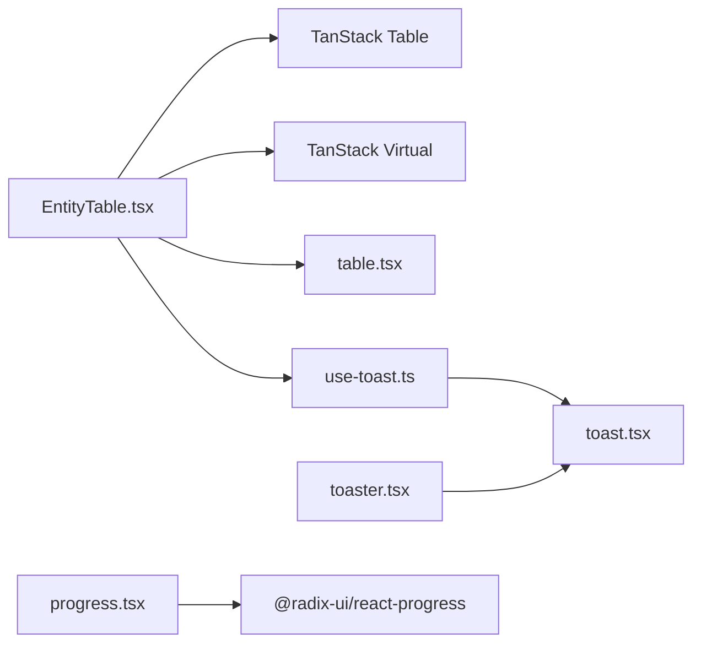

# Data Display Components

<cite>
**Referenced Files in This Document**
- [EntityTable.tsx](file://frontend/apps/admin-dashboard/src/components/entities/EntityTable.tsx)
- [table.tsx](file://frontend/apps/admin-dashboard/src/components/ui/table.tsx)
- [progress.tsx](file://frontend/apps/admin-dashboard/src/components/ui/progress.tsx)
- [toast.tsx](file://frontend/packages/ui/src/components/toast.tsx)
- [use-toast.ts](file://frontend/packages/ui/src/components/use-toast.ts)
- [toaster.tsx](file://frontend/packages/ui/src/components/toaster.tsx)
- [Spinner.tsx](file://frontend/packages/ui/src/components/primitives/spinner/Spinner.tsx)
- [Skeleton.tsx](file://frontend/packages/ui/src/components/primitives/skeleton/Skeleton.tsx)
</cite>

## Table of Contents
1. Introduction
2. Project Structure
3. Core Components
4. Architecture Overview
5. Detailed Component Analysis
6. Dependency Analysis
7. Performance Considerations
8. Troubleshooting Guide
9. Conclusion

## Introduction
This document explains how to use and extend the data display components in this repository: Table, Progress, and Toaster. It covers data binding patterns, sorting and filtering, progress indication methods, and notification handling. It also provides guidance for efficiently displaying large datasets and giving users clear feedback through progress indicators and toast notifications.

## Project Structure
The relevant components are split across application-specific UI primitives and shared UI package utilities:
- Admin dashboard table implementation with virtualization, sorting, filtering, pagination, and selection
- Shared table primitives used by the admin table
- Radix-based progress bar primitive
- Toast system with provider, viewport, and a global hook for dispatching notifications
- Primitive loading indicators (spinner and skeleton) for consistent UX

**Diagram sources**
- [EntityTable.tsx:1-650](file://frontend/apps/admin-dashboard/src/components/entities/EntityTable.tsx#L1-L650)
- [table.tsx:1-117](file://frontend/apps/admin-dashboard/src/components/ui/table.tsx#L1-L117)
- [progress.tsx:1-26](file://frontend/apps/admin-dashboard/src/components/ui/progress.tsx#L1-L26)
- [toast.tsx:1-119](file://frontend/packages/ui/src/components/toast.tsx#L1-L119)
- [use-toast.ts:1-188](file://frontend/packages/ui/src/components/use-toast.ts#L1-L188)
- [toaster.tsx:1-26](file://frontend/packages/ui/src/components/toaster.tsx#L1-L26)
- [Spinner.tsx:1-35](file://frontend/packages/ui/src/components/primitives/spinner/Spinner.tsx#L1-L35)
- [Skeleton.tsx:1-21](file://frontend/packages/ui/src/components/primitives/skeleton/Skeleton.tsx#L1-L21)

**Section sources**
- [EntityTable.tsx:1-650](file://frontend/apps/admin-dashboard/src/components/entities/EntityTable.tsx#L1-L650)
- [table.tsx:1-117](file://frontend/apps/admin-dashboard/src/components/ui/table.tsx#L1-L117)
- [progress.tsx:1-26](file://frontend/apps/admin-dashboard/src/components/ui/progress.tsx#L1-L26)
- [toast.tsx:1-119](file://frontend/packages/ui/src/components/toast.tsx#L1-L119)
- [use-toast.ts:1-188](file://frontend/packages/ui/src/components/use-toast.ts#L1-L188)
- [toaster.tsx:1-26](file://frontend/packages/ui/src/components/toaster.tsx#L1-L26)
- [Spinner.tsx:1-35](file://frontend/packages/ui/src/components/primitives/spinner/Spinner.tsx#L1-L35)
- [Skeleton.tsx:1-21](file://frontend/packages/ui/src/components/primitives/skeleton/Skeleton.tsx#L1-L21)

## Core Components
- Table: A virtualized, feature-rich table built on TanStack Table with row selection, column visibility toggling, global search, per-column filters, sorting, and pagination. It renders only visible rows using TanStack Virtual for efficient large dataset display.
- Progress: A Radix-based progress bar that visually indicates completion percentage via a value prop.
- Toaster: A toast notification system with a provider, viewport, and a global hook to add, update, dismiss, and remove toasts. Includes default and destructive variants.

Key capabilities:
- Data binding: The table binds to fetched entity data and exposes state for sorting, filtering, visibility, selection, and pagination.
- Sorting and filtering: Column-level and global filtering; ascending/descending sort with visual indicators.
- Large datasets: Virtualization limits DOM nodes to visible rows plus overscan, enabling smooth scrolling with thousands of rows.
- Feedback: Loading states via spinners/skeletons; success/error feedback via toasts; progress indication via progress bars.

**Section sources**
- [EntityTable.tsx:150-378](file://frontend/apps/admin-dashboard/src/components/entities/EntityTable.tsx#L150-L378)
- [table.tsx:1-117](file://frontend/apps/admin-dashboard/src/components/ui/table.tsx#L1-L117)
- [progress.tsx:1-26](file://frontend/apps/admin-dashboard/src/components/ui/progress.tsx#L1-L26)
- [toast.tsx:1-119](file://frontend/packages/ui/src/components/toast.tsx#L1-L119)
- [use-toast.ts:1-188](file://frontend/packages/ui/src/components/use-toast.ts#L1-L188)

## Architecture Overview
The table component orchestrates data fetching, state management, and rendering. It composes primitives from the UI library and uses TanStack Table for advanced features. Toast notifications are managed centrally via a context-like hook and rendered by a Toaster component.

**Diagram sources**
- [EntityTable.tsx:354-397](file://frontend/apps/admin-dashboard/src/components/entities/EntityTable.tsx#L354-L397)
- [table.tsx:1-117](file://frontend/apps/admin-dashboard/src/components/ui/table.tsx#L1-L117)
- [use-toast.ts:138-185](file://frontend/packages/ui/src/components/use-toast.ts#L138-L185)
- [toast.tsx:11-23](file://frontend/packages/ui/src/components/toast.tsx#L11-L23)

## Detailed Component Analysis

### Table Component (EntityTable)
Responsibilities:
- Binds to data source via a custom hook and maps it into table rows
- Manages sorting, filtering, column visibility, row selection, and pagination
- Uses TanStack Virtual to render only visible rows for performance
- Provides user actions (view details, bulk operations) and status badges

Data binding pattern:
- Data is fetched with a hook and passed to TanStack Table via props
- Table state (sorting, filters, visibility, selection, global filter) is synchronized with React state
- Row models are derived from TanStack Table and fed into the virtualizer

Sorting and filtering:
- Per-column sorting with toggle between asc/desc and visual arrows
- Global search input updates a global filter
- Column filters for specific fields (e.g., status, canonical status)

Large dataset efficiency:
- Virtualization renders approximately the number of visible rows plus an overscan buffer
- Fixed estimated row height and scroll container enable smooth scrolling with thousands of rows

Progress and loading:
- Shows a spinner during data loading
- Displays error or empty states when appropriate

**Diagram sources**
- [EntityTable.tsx:142-151](file://frontend/apps/admin-dashboard/src/components/entities/EntityTable.tsx#L142-L151)
- [EntityTable.tsx:354-397](file://frontend/apps/admin-dashboard/src/components/entities/EntityTable.tsx#L354-L397)
- [EntityTable.tsx:424-446](file://frontend/apps/admin-dashboard/src/components/entities/EntityTable.tsx#L424-L446)

**Section sources**
- [EntityTable.tsx:157-348](file://frontend/apps/admin-dashboard/src/components/entities/EntityTable.tsx#L157-L348)
- [EntityTable.tsx:354-397](file://frontend/apps/admin-dashboard/src/components/entities/EntityTable.tsx#L354-L397)
- [EntityTable.tsx:452-647](file://frontend/apps/admin-dashboard/src/components/entities/EntityTable.tsx#L452-L647)

### Table Primitives (table.tsx)
Provides accessible, styled HTML table elements:
- Table, TableHeader, TableBody, TableFooter, TableRow, TableHead, TableCell, TableCaption
- Styled with utility classes for borders, hover states, and alignment
- Used by EntityTable to structure the virtualized rows and headers

Usage notes:
- Combine with TanStack Table’s header groups and cell renderers
- Ensure the parent container has a fixed height and overflow for virtualization

**Section sources**
- [table.tsx:1-117](file://frontend/apps/admin-dashboard/src/components/ui/table.tsx#L1-L117)

### Progress Component (progress.tsx)
A Radix-based progress bar:
- Accepts a numeric value to set the indicator width
- Uses CSS transitions for smooth updates
- Suitable for showing upload/download progress, batch operation progress, or sync status

Integration tips:
- Bind value to async operation progress (0–100)
- Combine with a spinner while initial load occurs
- Use alongside toasts to notify completion or errors

**Section sources**
- [progress.tsx:1-26](file://frontend/apps/admin-dashboard/src/components/ui/progress.tsx#L1-L26)

### Toast System (toast.tsx, use-toast.ts, toaster.tsx)
Core pieces:
- use-toast: Central state and API to add/update/dismiss/remove toasts; enforces a limit and auto-remove delay
- toast: Function to create toasts with optional title, description, and action; returns id, dismiss, and update helpers
- toast.tsx: Radix-based UI components (provider, viewport, toast, title, description, close, action)
- toaster.tsx: Renders all active toasts inside a provider and viewport

Notification handling patterns:
- Success: Show brief confirmation after save/export/sync
- Error: Show actionable error with retry or details
- Destructive: Highlight critical failures
- Auto-dismiss: Configured via internal delay; can be dismissed manually

**Diagram sources**
- [use-toast.ts:138-185](file://frontend/packages/ui/src/components/use-toast.ts#L138-L185)
- [toast.tsx:11-23](file://frontend/packages/ui/src/components/toast.tsx#L11-L23)
- [toaster.tsx:1-26](file://frontend/packages/ui/src/components/toaster.tsx#L1-L26)

**Section sources**
- [use-toast.ts:1-188](file://frontend/packages/ui/src/components/use-toast.ts#L1-L188)
- [toast.tsx:1-119](file://frontend/packages/ui/src/components/toast.tsx#L1-L119)
- [toaster.tsx:1-26](file://frontend/packages/ui/src/components/toaster.tsx#L1-L26)

### Loading Indicators (Spinner, Skeleton)
- Spinner: Accessible animated indicator with role="status" and screen-reader label
- Skeleton: Decorative placeholder with pulse animation, disabled under reduced motion preferences

Use cases:
- Spinner for short asynchronous operations
- Skeleton for content placeholders during initial load or list rendering

**Section sources**
- [Spinner.tsx:1-35](file://frontend/packages/ui/src/components/primitives/spinner/Spinner.tsx#L1-L35)
- [Skeleton.tsx:1-21](file://frontend/packages/ui/src/components/primitives/skeleton/Skeleton.tsx#L1-L21)

## Dependency Analysis
- EntityTable depends on:
  - TanStack Table for core features (sorting, filtering, pagination, selection)
  - TanStack Virtual for efficient rendering of large lists
  - Local table primitives for semantic HTML structure
  - Optional hooks for data fetching and country context
  - Toast system for user feedback
- Toast system depends on:
  - Radix Toast primitives for accessibility and behavior
  - Central state management via a simple reducer and listener pattern
- Progress depends on:
  - Radix Progress primitive for semantics and keyboard support

**Diagram sources**
- [EntityTable.tsx:6-17](file://frontend/apps/admin-dashboard/src/components/entities/EntityTable.tsx#L6-L17)
- [table.tsx:1-117](file://frontend/apps/admin-dashboard/src/components/ui/table.tsx#L1-L117)
- [use-toast.ts:1-188](file://frontend/packages/ui/src/components/use-toast.ts#L1-L188)
- [toast.tsx:1-119](file://frontend/packages/ui/src/components/toast.tsx#L1-L119)
- [progress.tsx:1-26](file://frontend/apps/admin-dashboard/src/components/ui/progress.tsx#L1-L26)

**Section sources**
- [EntityTable.tsx:6-17](file://frontend/apps/admin-dashboard/src/components/entities/EntityTable.tsx#L6-L17)
- [use-toast.ts:1-188](file://frontend/packages/ui/src/components/use-toast.ts#L1-L188)
- [toast.tsx:1-119](file://frontend/packages/ui/src/components/toast.tsx#L1-L119)
- [progress.tsx:1-26](file://frontend/apps/admin-dashboard/src/components/ui/progress.tsx#L1-L26)

## Performance Considerations
- Virtualization: Keep estimateSize accurate and adjust overscan for smoother scrolling without excessive memory usage.
- Pagination: For very large datasets, combine server-side pagination with client-side virtualization for optimal performance.
- Filtering and sorting: Prefer server-side operations for complex queries; use client-side for small to medium datasets.
- Rendering: Avoid heavy computations in cell renderers; memoize expensive logic where possible.
- Toasts: Limit concurrent toasts and configure appropriate removal delays to prevent clutter.

[No sources needed since this section provides general guidance]

## Troubleshooting Guide
Common issues and resolutions:
- Table not updating after data changes: Ensure table instance receives updated data and state props; verify hooks return stable references for columns.
- Sorting not reflecting: Confirm column definitions expose sortable headers and that sorting state is bound to table instance.
- Filtering not working: Verify filter functions are defined for columns and that global filter is wired to the input.
- Virtualization glitches: Check that the scroll container has a fixed height and that estimateSize matches actual row heights.
- Toasts not appearing: Ensure a Toaster is mounted in the app tree and useToast is called within a provider context.
- Accessibility concerns: Use role="status" for loaders and ensure aria labels for interactive controls.

**Section sources**
- [EntityTable.tsx:354-397](file://frontend/apps/admin-dashboard/src/components/entities/EntityTable.tsx#L354-L397)
- [use-toast.ts:138-185](file://frontend/packages/ui/src/components/use-toast.ts#L138-L185)
- [toast.tsx:11-23](file://frontend/packages/ui/src/components/toast.tsx#L11-L23)

## Conclusion
The repository provides robust, accessible data display components:
- A high-performance virtualized table with sorting, filtering, selection, and pagination
- A simple yet flexible progress indicator for async operations
- A centralized toast system for user feedback

Adopt these patterns to build responsive interfaces that handle large datasets efficiently and keep users informed throughout their workflows.

[No sources needed since this section summarizes without analyzing specific files]