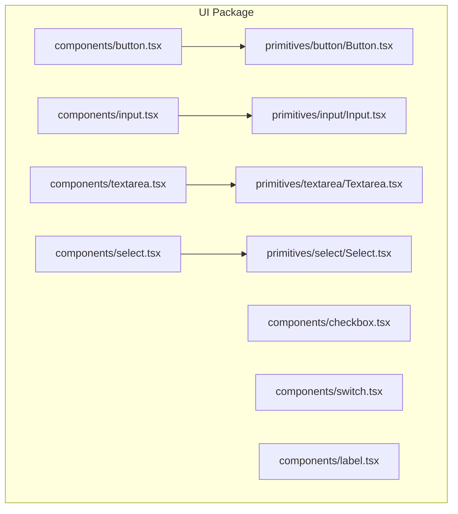
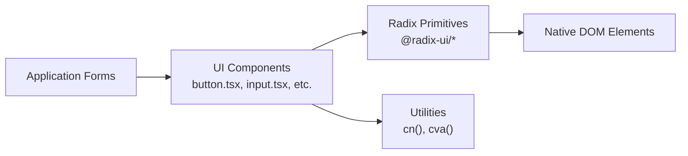
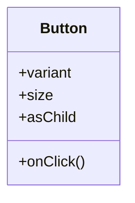
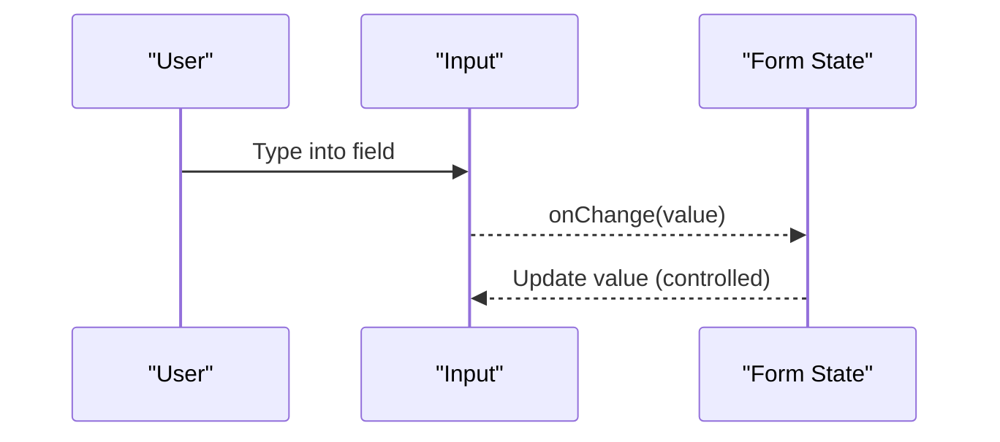
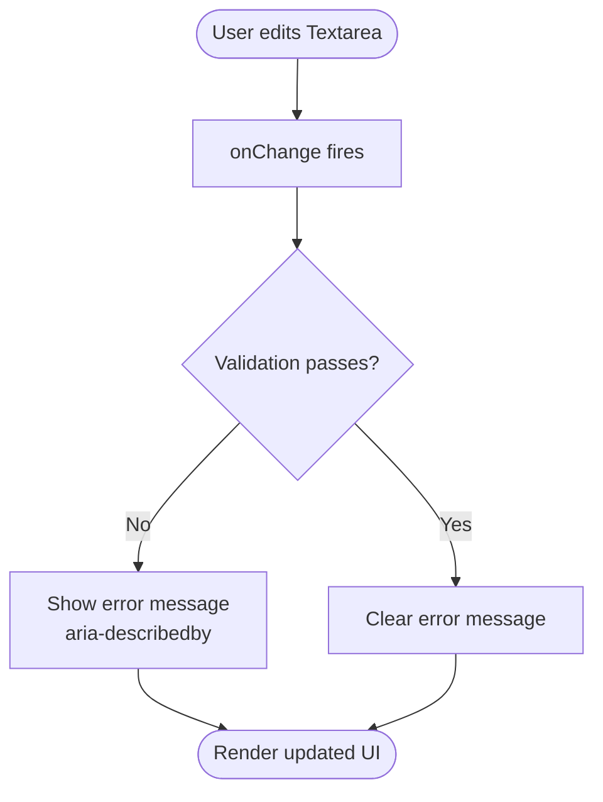
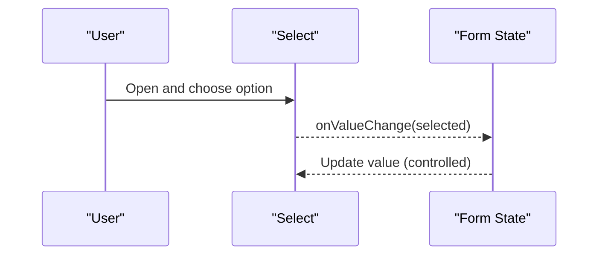
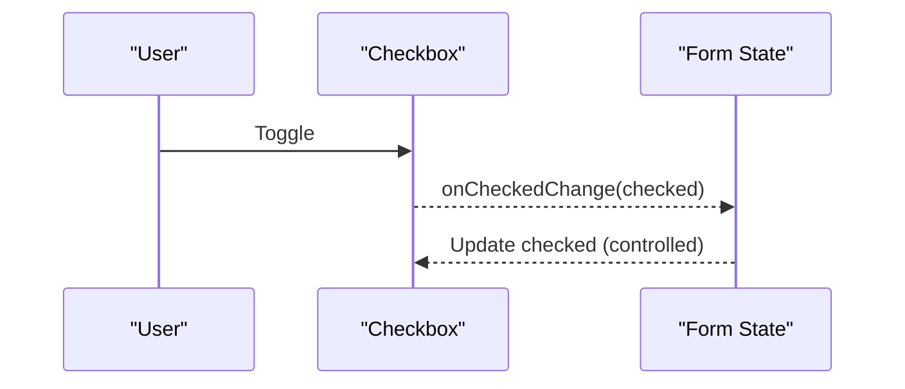
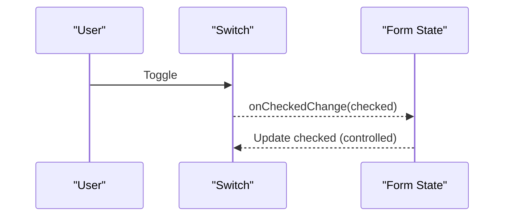
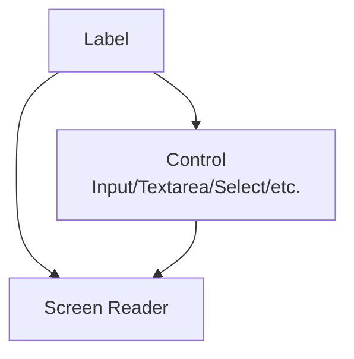
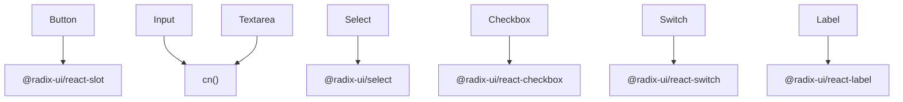

# Form Components

<cite>
**Referenced Files in This Document**
- [button.tsx](file://frontend/packages/ui/src/components/button.tsx)
- [Button.tsx](file://frontend/packages/ui/src/components/primitives/button/Button.tsx)
- [Button.types.ts](file://frontend/packages/ui/src/components/primitives/button/Button.types.ts)
- [input.tsx](file://frontend/packages/ui/src/components/input.tsx)
- [Input.tsx](file://frontend/packages/ui/src/components/primitives/input/Input.tsx)
- [Input.types.ts](file://frontend/packages/ui/src/components/primitives/input/Input.types.ts)
- [textarea.tsx](file://frontend/packages/ui/src/components/textarea.tsx)
- [Textarea.tsx](file://frontend/packages/ui/src/components/primitives/textarea/Textarea.tsx)
- [Textarea.types.ts](file://frontend/packages/ui/src/components/primitives/textarea/Textarea.types.ts)
- [select.tsx](file://frontend/packages/ui/src/components/select.tsx)
- [Select.tsx](file://frontend/packages/ui/src/components/primitives/select/Select.tsx)
- [Select.types.ts](file://frontend/packages/ui/src/components/primitives/select/Select.types.ts)
- [checkbox.tsx](file://frontend/packages/ui/src/components/checkbox.tsx)
- [switch.tsx](file://frontend/packages/ui/src/components/switch.tsx)
- [label.tsx](file://frontend/packages/ui/src/components/label.tsx)
</cite>

## Table of Contents
1. Introduction
2. Project Structure
3. Core Components
4. Architecture Overview
5. Detailed Component Analysis
6. Dependency Analysis
7. Performance Considerations
8. Troubleshooting Guide
9. Conclusion

## Introduction
This document provides comprehensive documentation for form-related UI components used across the application: Button, Input, Textarea, Select, Checkbox, Switch, and Label. It covers props, events, styling options, accessibility features, and patterns for building accessible forms with consistent styling. It also explains how these components integrate to create robust, user-friendly forms with validation support.

## Project Structure
The form components are implemented as thin wrappers around Radix primitives and styled using utility classes. The package exposes both top-level convenience components (e.g., button.tsx, input.tsx) and primitive implementations under a primitives folder for deeper customization when needed.

**Diagram sources**
- [button.tsx:1-49](file://frontend/packages/ui/src/components/button.tsx#L1-L49)
- [Button.tsx:1-200](file://frontend/packages/ui/src/components/primitives/button/Button.tsx#L1-L200)
- [input.tsx:1-24](file://frontend/packages/ui/src/components/input.tsx#L1-L24)
- [Input.tsx:1-200](file://frontend/packages/ui/src/components/primitives/input/Input.tsx#L1-L200)
- [textarea.tsx:1-200](file://frontend/packages/ui/src/components/textarea.tsx#L1-L200)
- [Textarea.tsx:1-200](file://frontend/packages/ui/src/components/primitives/textarea/Textarea.tsx#L1-L200)
- [select.tsx:1-200](file://frontend/packages/ui/src/components/select.tsx#L1-L200)
- [Select.tsx:1-200](file://frontend/packages/ui/src/components/primitives/select/Select.tsx#L1-L200)

**Section sources**
- [button.tsx:1-49](file://frontend/packages/ui/src/components/button.tsx#L1-L49)
- [input.tsx:1-24](file://frontend/packages/ui/src/components/input.tsx#L1-L24)
- [textarea.tsx:1-200](file://frontend/packages/ui/src/components/textarea.tsx#L1-L200)
- [select.tsx:1-200](file://frontend/packages/ui/src/components/select.tsx#L1-L200)
- [checkbox.tsx:1-28](file://frontend/packages/ui/src/components/checkbox.tsx#L1-L28)
- [switch.tsx:1-29](file://frontend/packages/ui/src/components/switch.tsx#L1-L29)
- [label.tsx:1-21](file://frontend/packages/ui/src/components/label.tsx#L1-L21)

## Core Components
This section summarizes each component’s purpose, key props, events, styling, and accessibility notes. For exact prop types and implementation details, refer to the linked files.

- Button
  - Purpose: Primary interactive element for actions and navigation.
  - Key props: variant, size, asChild, plus standard HTML button attributes.
  - Events: onClick and other native button events via React.
  - Styling: Uses class-based variants for appearance and sizes; focus-visible ring for keyboard navigation.
  - Accessibility: Focusable, supports keyboard activation; can render as any child via Slot for semantic flexibility.
  - References: [button.tsx:1-49](file://frontend/packages/ui/src/components/button.tsx#L1-L49), [Button.tsx:1-200](file://frontend/packages/ui/src/components/primitives/button/Button.tsx#L1-L200), [Button.types.ts:1-200](file://frontend/packages/ui/src/components/primitives/button/Button.types.ts#L1-L200)

- Input
  - Purpose: Single-line text entry field.
  - Key props: type, placeholder, disabled, value/onChange, plus all standard input attributes.
  - Events: onChange, onBlur, onFocus, onSubmit (when inside forms).
  - Styling: Consistent border, padding, focus ring; disabled state styling.
  - Accessibility: Supports aria-* attributes; pairs well with Label for screen readers.
  - References: [input.tsx:1-24](file://frontend/packages/ui/src/components/input.tsx#L1-L24), [Input.tsx:1-200](file://frontend/packages/ui/src/components/primitives/input/Input.tsx#L1-L200), [Input.types.ts:1-200](file://frontend/packages/ui/src/components/primitives/input/Input.types.ts#L1-L200)

- Textarea
  - Purpose: Multi-line text entry field.
  - Key props: rows, placeholder, disabled, value/onChange, plus standard textarea attributes.
  - Events: onChange, onBlur, onFocus.
  - Styling: Matches Input styling for consistency; resizable behavior controlled by browser defaults unless customized.
  - Accessibility: Works with Label; supports aria-describedby for error messages.
  - References: [textarea.tsx:1-200](file://frontend/packages/ui/src/components/textarea.tsx#L1-L200), [Textarea.tsx:1-200](file://frontend/packages/ui/src/components/primitives/textarea/Textarea.tsx#L1-L200), [Textarea.types.ts:1-200](file://frontend/packages/ui/src/components/primitives/textarea/Textarea.types.ts#L1-L200)

- Select
  - Purpose: Dropdown selection control for single or multiple choices.
  - Key props: options, value, onValueChange, disabled, placeholder, plus Radix select props.
  - Events: onValueChange, onCloseAutoFocus, onOpenAutoFocus.
  - Styling: Styled dropdown with focus states and theme-aware colors.
  - Accessibility: Keyboard navigable; announces selected option; integrates with Label.
  - References: [select.tsx:1-200](file://frontend/packages/ui/src/components/select.tsx#L1-L200), [Select.tsx:1-200](file://frontend/packages/ui/src/components/primitives/select/Select.tsx#L1-L200), [Select.types.ts:1-200](file://frontend/packages/ui/src/components/primitives/select/Select.types.ts#L1-L200)

- Checkbox
  - Purpose: Binary toggle for true/false selections.
  - Key props: checked, onCheckedChange, disabled, id, name, value.
  - Events: onCheckedChange.
  - Styling: Checked/unchecked states with focus ring; icon indicator for checked state.
  - Accessibility: Native semantics via Radix; works with Label for association.
  - References: [checkbox.tsx:1-28](file://frontend/packages/ui/src/components/checkbox.tsx#L1-L28)

- Switch
  - Purpose: On/off toggle for binary settings.
  - Key props: checked, onCheckedChange, disabled, id, name, value.
  - Events: onCheckedChange.
  - Styling: Thumb animation and state-based background; focus ring for keyboard users.
  - Accessibility: Announces current state; keyboard operable.
  - References: [switch.tsx:1-29](file://frontend/packages/ui/src/components/switch.tsx#L1-L29)

- Label
  - Purpose: Accessible label associated with form controls.
  - Key props: htmlFor, className, plus standard label attributes.
  - Events: None specific; forwards standard label events.
  - Styling: Consistent typography and disabled state styling.
  - Accessibility: Associates with inputs via htmlFor; improves screen reader experience.
  - References: [label.tsx:1-21](file://frontend/packages/ui/src/components/label.tsx#L1-L21)

**Section sources**
- [button.tsx:1-49](file://frontend/packages/ui/src/components/button.tsx#L1-L49)
- [Button.tsx:1-200](file://frontend/packages/ui/src/components/primitives/button/Button.tsx#L1-L200)
- [Button.types.ts:1-200](file://frontend/packages/ui/src/components/primitives/button/Button.types.ts#L1-L200)
- [input.tsx:1-24](file://frontend/packages/ui/src/components/input.tsx#L1-L24)
- [Input.tsx:1-200](file://frontend/packages/ui/src/components/primitives/input/Input.tsx#L1-L200)
- [Input.types.ts:1-200](file://frontend/packages/ui/src/components/primitives/input/Input.types.ts#L1-L200)
- [textarea.tsx:1-200](file://frontend/packages/ui/src/components/textarea.tsx#L1-L200)
- [Textarea.tsx:1-200](file://frontend/packages/ui/src/components/primitives/textarea/Textarea.tsx#L1-L200)
- [Textarea.types.ts:1-200](file://frontend/packages/ui/src/components/primitives/textarea/Textarea.types.ts#L1-L200)
- [select.tsx:1-200](file://frontend/packages/ui/src/components/select.tsx#L1-L200)
- [Select.tsx:1-200](file://frontend/packages/ui/src/components/primitives/select/Select.tsx#L1-L200)
- [Select.types.ts:1-200](file://frontend/packages/ui/src/components/primitives/select/Select.types.ts#L1-L200)
- [checkbox.tsx:1-28](file://frontend/packages/ui/src/components/checkbox.tsx#L1-L28)
- [switch.tsx:1-29](file://frontend/packages/ui/src/components/switch.tsx#L1-L29)
- [label.tsx:1-21](file://frontend/packages/ui/src/components/label.tsx#L1-L21)

## Architecture Overview
The form components follow a layered architecture:
- Top-level components provide convenient APIs and consistent styling.
- Primitive components wrap Radix primitives for robust accessibility and composable behaviors.
- Utilities handle class merging and theme integration.

**Diagram sources**
- [button.tsx:1-49](file://frontend/packages/ui/src/components/button.tsx#L1-L49)
- [input.tsx:1-24](file://frontend/packages/ui/src/components/input.tsx#L1-L24)
- [checkbox.tsx:1-28](file://frontend/packages/ui/src/components/checkbox.tsx#L1-L28)
- [switch.tsx:1-29](file://frontend/packages/ui/src/components/switch.tsx#L1-L29)
- [label.tsx:1-21](file://frontend/packages/ui/src/components/label.tsx#L1-L21)

## Detailed Component Analysis

### Button
- Props: variant (default, destructive, outline, secondary, ghost, link), size (default, sm, lg, icon), asChild, plus all standard button attributes.
- Events: onClick and other native button events.
- Styling: Class-based variants and sizes; focus-visible ring; disabled opacity.
- Accessibility: Focus management and keyboard activation; asChild enables semantic composition.
- Usage pattern: Use as primary action; combine with icons via Slot when asChild is true.

**Diagram sources**
- [button.tsx:1-49](file://frontend/packages/ui/src/components/button.tsx#L1-L49)

**Section sources**
- [button.tsx:1-49](file://frontend/packages/ui/src/components/button.tsx#L1-L49)
- [Button.tsx:1-200](file://frontend/packages/ui/src/components/primitives/button/Button.tsx#L1-L200)
- [Button.types.ts:1-200](file://frontend/packages/ui/src/components/primitives/button/Button.types.ts#L1-L200)

### Input
- Props: type, placeholder, disabled, value/onChange, ref, plus all standard input attributes.
- Events: onChange, onBlur, onFocus.
- Styling: Border, padding, focus ring; file input styles handled; disabled state.
- Accessibility: Pairs with Label; supports aria-describedby for errors.
- Validation integration: Use controlled value/onChange with external validation; show error via aria-describedby.

**Diagram sources**
- [input.tsx:1-24](file://frontend/packages/ui/src/components/input.tsx#L1-L24)

**Section sources**
- [input.tsx:1-24](file://frontend/packages/ui/src/components/input.tsx#L1-L24)
- [Input.tsx:1-200](file://frontend/packages/ui/src/components/primitives/input/Input.tsx#L1-L200)
- [Input.types.ts:1-200](file://frontend/packages/ui/src/components/primitives/input/Input.types.ts#L1-L200)

### Textarea
- Props: rows, placeholder, disabled, value/onChange, ref, plus all standard textarea attributes.
- Events: onChange, onBlur, onFocus.
- Styling: Matches Input; consistent spacing and focus states.
- Accessibility: Works with Label; supports aria-describedby for errors.
- Validation integration: Controlled value/onChange; display inline errors below the field.

**Diagram sources**
- [textarea.tsx:1-200](file://frontend/packages/ui/src/components/textarea.tsx#L1-L200)

**Section sources**
- [textarea.tsx:1-200](file://frontend/packages/ui/src/components/textarea.tsx#L1-L200)
- [Textarea.tsx:1-200](file://frontend/packages/ui/src/components/primitives/textarea/Textarea.tsx#L1-L200)
- [Textarea.types.ts:1-200](file://frontend/packages/ui/src/components/primitives/textarea/Textarea.types.ts#L1-L200)

### Select
- Props: options, value, onValueChange, disabled, placeholder, plus Radix select props.
- Events: onValueChange, onCloseAutoFocus, onOpenAutoFocus.
- Styling: Dropdown panel styling; focus states; theme-aware colors.
- Accessibility: Keyboard navigation; announces selection; associates with Label.
- Validation integration: Controlled value; show error via aria-describedby.

**Diagram sources**
- [select.tsx:1-200](file://frontend/packages/ui/src/components/select.tsx#L1-L200)
- [Select.tsx:1-200](file://frontend/packages/ui/src/components/primitives/select/Select.tsx#L1-L200)

**Section sources**
- [select.tsx:1-200](file://frontend/packages/ui/src/components/select.tsx#L1-L200)
- [Select.tsx:1-200](file://frontend/packages/ui/src/components/primitives/select/Select.tsx#L1-L200)
- [Select.types.ts:1-200](file://frontend/packages/ui/src/components/primitives/select/Select.types.ts#L1-L200)

### Checkbox
- Props: checked, onCheckedChange, disabled, id, name, value, plus Radix checkbox props.
- Events: onCheckedChange.
- Styling: Checked state with icon; focus ring; disabled opacity.
- Accessibility: Semantic checkbox; keyboard operable; associate with Label.
- Validation integration: Controlled checked state; show error via aria-describedby.

**Diagram sources**
- [checkbox.tsx:1-28](file://frontend/packages/ui/src/components/checkbox.tsx#L1-L28)

**Section sources**
- [checkbox.tsx:1-28](file://frontend/packages/ui/src/components/checkbox.tsx#L1-L28)

### Switch
- Props: checked, onCheckedChange, disabled, id, name, value, plus Radix switch props.
- Events: onCheckedChange.
- Styling: Thumb animation; state-based background; focus ring.
- Accessibility: Announces state; keyboard operable; associate with Label.
- Validation integration: Controlled checked state; show error via aria-describedby.

**Diagram sources**
- [switch.tsx:1-29](file://frontend/packages/ui/src/components/switch.tsx#L1-L29)

**Section sources**
- [switch.tsx:1-29](file://frontend/packages/ui/src/components/switch.tsx#L1-L29)

### Label
- Props: htmlFor, className, plus standard label attributes.
- Events: None specific; forwards standard label events.
- Styling: Typography and disabled state styling.
- Accessibility: Associates with controls via htmlFor; improves screen reader context.
- Usage pattern: Wrap or place before Input/Textarea/Select/Checkbox/Switch; use htmlFor to match control id.

**Diagram sources**
- [label.tsx:1-21](file://frontend/packages/ui/src/components/label.tsx#L1-L21)

**Section sources**
- [label.tsx:1-21](file://frontend/packages/ui/src/components/label.tsx#L1-L21)

## Dependency Analysis
- External dependencies:
  - Radix UI primitives for accessible base behaviors (checkbox, switch, label, select, slot).
  - Utility libraries for class merging and variant styling (cva, cn).
- Internal relationships:
  - Top-level components delegate to primitives for advanced cases.
  - All components rely on shared utilities for consistent styling and focus management.

**Diagram sources**
- [button.tsx:1-49](file://frontend/packages/ui/src/components/button.tsx#L1-L49)
- [input.tsx:1-24](file://frontend/packages/ui/src/components/input.tsx#L1-L24)
- [textarea.tsx:1-200](file://frontend/packages/ui/src/components/textarea.tsx#L1-L200)
- [select.tsx:1-200](file://frontend/packages/ui/src/components/select.tsx#L1-L200)
- [checkbox.tsx:1-28](file://frontend/packages/ui/src/components/checkbox.tsx#L1-L28)
- [switch.tsx:1-29](file://frontend/packages/ui/src/components/switch.tsx#L1-L29)
- [label.tsx:1-21](file://frontend/packages/ui/src/components/label.tsx#L1-L21)

**Section sources**
- [button.tsx:1-49](file://frontend/packages/ui/src/components/button.tsx#L1-L49)
- [input.tsx:1-24](file://frontend/packages/ui/src/components/input.tsx#L1-L24)
- [textarea.tsx:1-200](file://frontend/packages/ui/src/components/textarea.tsx#L1-L200)
- [select.tsx:1-200](file://frontend/packages/ui/src/components/select.tsx#L1-L200)
- [checkbox.tsx:1-28](file://frontend/packages/ui/src/components/checkbox.tsx#L1-L28)
- [switch.tsx:1-29](file://frontend/packages/ui/src/components/switch.tsx#L1-L29)
- [label.tsx:1-21](file://frontend/packages/ui/src/components/label.tsx#L1-L21)

## Performance Considerations
- Prefer controlled components for predictable state updates and easier validation.
- Avoid unnecessary re-renders by memoizing form state where appropriate.
- Use asChild on Button only when you need to compose with another component without extra DOM nodes.
- Keep option lists for Select manageable; virtualize if large datasets are required.
- Leverage disabled states to prevent redundant operations during async submissions.

[No sources needed since this section provides general guidance]

## Troubleshooting Guide
- Focus not visible: Ensure focus-visible styles are enabled and no custom CSS overrides them. Check that components are not programmatically blurred.
- Screen reader issues: Always associate Label with controls via htmlFor and ensure controls have unique ids.
- Validation feedback: Use aria-describedby to link error messages to controls; update it dynamically based on validation results.
- Disabled state: Verify disabled props propagate correctly to underlying elements; some primitives may require explicit disabled handling.
- Event handling: Confirm onChange/onValueChange handlers update controlled values consistently to avoid uncontrolled-to-controlled transitions.

**Section sources**
- [button.tsx:1-49](file://frontend/packages/ui/src/components/button.tsx#L1-L49)
- [input.tsx:1-24](file://frontend/packages/ui/src/components/input.tsx#L1-L24)
- [textarea.tsx:1-200](file://frontend/packages/ui/src/components/textarea.tsx#L1-L200)
- [select.tsx:1-200](file://frontend/packages/ui/src/components/select.tsx#L1-L200)
- [checkbox.tsx:1-28](file://frontend/packages/ui/src/components/checkbox.tsx#L1-L28)
- [switch.tsx:1-29](file://frontend/packages/ui/src/components/switch.tsx#L1-L29)
- [label.tsx:1-21](file://frontend/packages/ui/src/components/label.tsx#L1-L21)

## Conclusion
These form components provide a consistent, accessible foundation for building forms across the application. By combining controlled state, proper labeling, and clear validation feedback, teams can deliver inclusive user experiences with minimal effort. Use the primitives layer for advanced customization while relying on top-level components for everyday needs.

[No sources needed since this section summarizes without analyzing specific files]