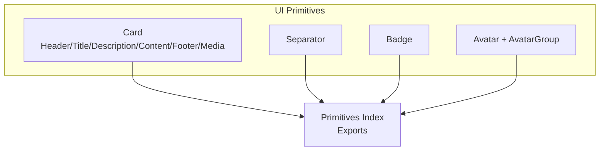
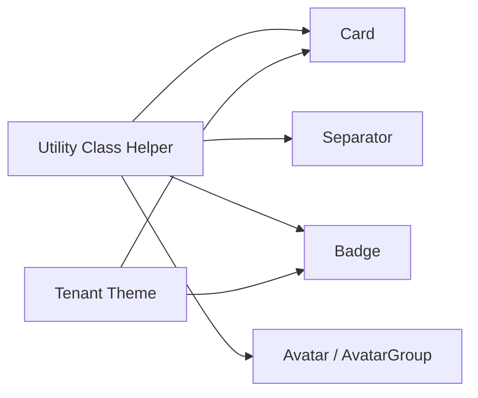
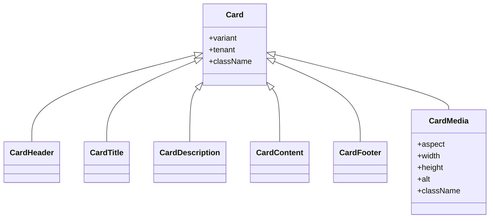
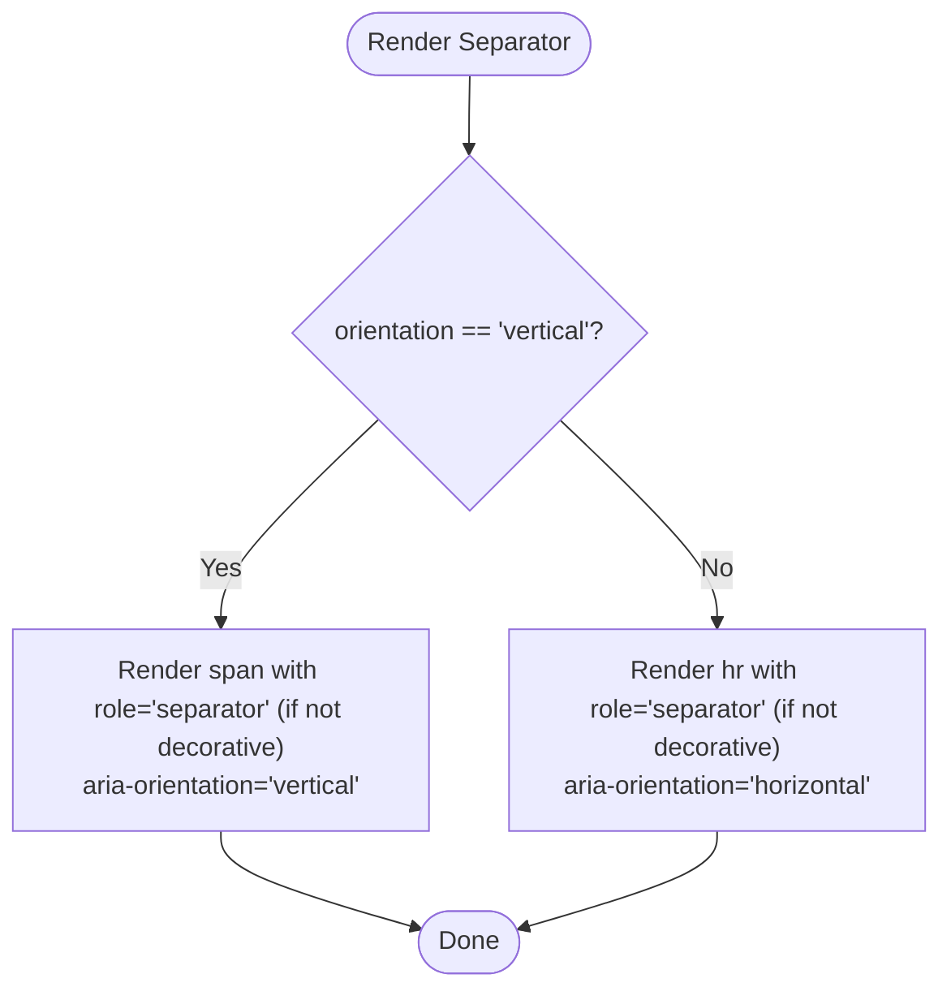
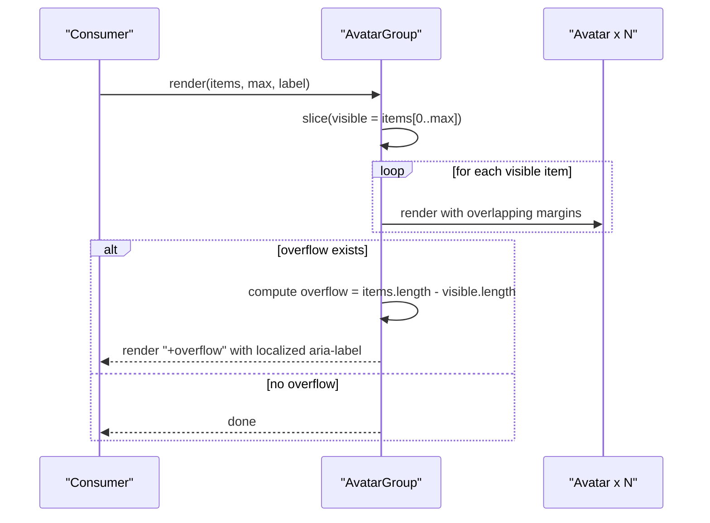
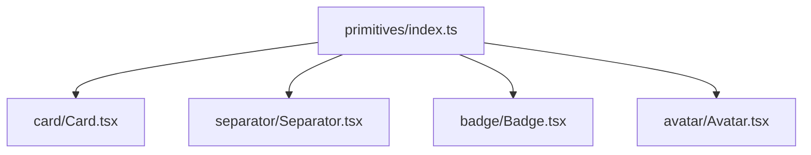

# Layout Components

<cite>
**Referenced Files in This Document**
- [Card.tsx](file://frontend/packages/ui/src/components/primitives/card/Card.tsx)
- [Card.types.ts](file://frontend/packages/ui/src/components/primitives/card/Card.types.ts)
- [Separator.tsx](file://frontend/packages/ui/src/components/primitives/separator/Separator.tsx)
- [Separator.types.ts](file://frontend/packages/ui/src/components/primitives/separator/Separator.types.ts)
- [Badge.tsx](file://frontend/packages/ui/src/components/primitives/badge/Badge.tsx)
- [Badge.types.ts](file://frontend/packages/ui/src/components/primitives/badge/Badge.types.ts)
- [Avatar.tsx](file://frontend/packages/ui/src/components/primitives/avatar/Avatar.tsx)
- [Avatar.types.ts](file://frontend/packages/ui/src/components/primitives/avatar/Avatar.types.ts)
- [index.ts](file://frontend/packages/ui/src/components/primitives/index.ts)
</cite>

## Table of Contents
1. [Introduction](#introduction)
2. [Project Structure](#project-structure)
3. [Core Components](#core-components)
4. [Architecture Overview](#architecture-overview)
5. [Detailed Component Analysis](#detailed-component-analysis)
6. [Dependency Analysis](#dependency-analysis)
7. [Performance Considerations](#performance-considerations)
8. [Troubleshooting Guide](#troubleshooting-guide)
9. [Conclusion](#conclusion)
10. [Appendices](#appendices)

## Introduction
This document provides comprehensive documentation for layout and presentation components: Card, Separator, Badge, and Avatar. It covers component structure, props, styling customization, responsive behavior, accessibility considerations, and practical composition patterns to build consistent, accessible layouts across the application.

## Project Structure
The components are implemented as primitives within the UI package and exported via a central index for consumption by applications and higher-level composite components.

**Diagram sources**
- [index.ts:13-28](file://frontend/packages/ui/src/components/primitives/index.ts#L13-L28)

**Section sources**
- [index.ts:1-33](file://frontend/packages/ui/src/components/primitives/index.ts#L1-L33)

## Core Components
- Card: A flexible content container with slots (header, title, description, content, footer, media) and visual variants (default, outlined, elevated, interactive). Supports tenant theming for accent borders on interactive cards.
- Separator: An accessible divider supporting horizontal and vertical orientations with optional decorative mode to control semantic role exposure.
- Badge: A compact status/metadata label with multiple variants (default, secondary, outline, destructive, vertical, liturgical-season), sizes (sm, md, lg), and tenant-aware accent theming.
- Avatar: User representation with image or initials fallback, plus an AvatarGroup that collapses overflow into an accessible “+N” counter.

**Section sources**
- [Card.tsx:1-80](file://frontend/packages/ui/src/components/primitives/card/Card.tsx#L1-L80)
- [Separator.tsx:1-29](file://frontend/packages/ui/src/components/primitives/separator/Separator.tsx#L1-L29)
- [Badge.tsx:1-49](file://frontend/packages/ui/src/components/primitives/badge/Badge.tsx#L1-L49)
- [Avatar.tsx:1-77](file://frontend/packages/ui/src/components/primitives/avatar/Avatar.tsx#L1-L77)

## Architecture Overview
The primitives share common utilities and theming:
- Utility class merging via a shared helper.
- Tenant theme integration for accent colors and borders.
- Consistent sizing and spacing tokens applied through utility classes.

**Diagram sources**
- [Card.tsx:7-9](file://frontend/packages/ui/src/components/primitives/card/Card.tsx#L7-L9)
- [Badge.tsx:7-9](file://frontend/packages/ui/src/components/primitives/badge/Badge.tsx#L7-L9)
- [Separator.tsx:5-6](file://frontend/packages/ui/src/components/primitives/separator/Separator.tsx#L5-L6)
- [Avatar.tsx:10-13](file://frontend/packages/ui/src/components/primitives/avatar/Avatar.tsx#L10-L13)

## Detailed Component Analysis

### Card
- Purpose: Content container with structured slots and media support.
- Variants: default, outlined, elevated, interactive. Interactive variant adds hover elevation and focus-within shadow; also applies tenant accent border when provided.
- Media: Aspect presets auto, square, video, wide, portrait; enforces intrinsic width/height and alt text for CLS and accessibility.
- Slots: Header, Title, Description, Content, Footer provide consistent spacing and typography.

Props summary
- Card: variant, tenant, className, plus standard div attributes.
- CardMedia: aspect, width, height, alt, className, plus img attributes.
- Slot props: generic HTML attributes for each slot element.

Styling and responsiveness
- Uses utility classes for rounded corners, background, shadows, and transitions.
- Media uses fixed aspect ratios to maintain layout stability.
- Dark mode styles included for backgrounds and borders.

Accessibility
- Semantic heading used for CardTitle.
- Media requires alt; empty string allowed for decorative images.
- Interactive card supports keyboard focus affordances via focus-within.

Composition examples
- Use CardHeader > CardTitle + CardDescription, then CardContent, and CardFooter for actions.
- Place CardMedia at top for hero-style cards.

**Section sources**
- [Card.tsx:16-80](file://frontend/packages/ui/src/components/primitives/card/Card.tsx#L16-L80)
- [Card.types.ts:1-31](file://frontend/packages/ui/src/components/primitives/card/Card.types.ts#L1-L31)

#### Card Class Diagram

**Diagram sources**
- [Card.tsx:30-80](file://frontend/packages/ui/src/components/primitives/card/Card.tsx#L30-L80)
- [Card.types.ts:9-31](file://frontend/packages/ui/src/components/primitives/card/Card.types.ts#L9-L31)

### Separator
- Purpose: Accessible divider for horizontal or vertical orientation.
- Decorative mode: When true, no semantic separator role is exposed; otherwise exposes role="separator" with appropriate aria-orientation.
- Styling: Thin line using utility classes; dark mode support.

Props summary
- orientation: horizontal | vertical (default horizontal).
- decorative: boolean (default true).
- className: additional styles.

Accessibility
- Horizontal renders native hr with role and aria-orientation when not decorative.
- Vertical renders span with role and aria-orientation when not decorative.

Usage guidance
- Use decorative=true when surrounding content already implies separation (e.g., list items).
- Use decorative=false when the divider itself conveys meaning (e.g., between sections).

**Section sources**
- [Separator.tsx:1-29](file://frontend/packages/ui/src/components/primitives/separator/Separator.tsx#L1-L29)
- [Separator.types.ts:1-13](file://frontend/packages/ui/src/components/primitives/separator/Separator.types.ts#L1-L13)

#### Separator Flowchart

**Diagram sources**
- [Separator.tsx:8-27](file://frontend/packages/ui/src/components/primitives/separator/Separator.tsx#L8-L27)

### Badge
- Purpose: Compact label for status or metadata.
- Variants: default, secondary, outline, destructive, vertical (tenant accent), liturgical-season (gold).
- Sizes: sm, md, lg.
- Theming: vertical variant uses tenant accent background; other variants use design tokens.

Props summary
- variant: controls color/style.
- size: controls padding and font size.
- tenant: required for vertical variant to resolve accent color.
- className: additional styles.

Accessibility
- Semantic span with neutral styling; ensure sufficient contrast for chosen variant.
- For status badges conveying critical information, pair with descriptive context.

**Section sources**
- [Badge.tsx:1-49](file://frontend/packages/ui/src/components/primitives/badge/Badge.tsx#L1-L49)
- [Badge.types.ts:1-26](file://frontend/packages/ui/src/components/primitives/badge/Badge.types.ts#L1-L26)

### Avatar and AvatarGroup
- Purpose: Represent users with image or initials fallback; group avatars with overflow handling.
- Features:
  - Avatar renders image if src provided; otherwise shows initials derived from name.
  - AvatarGroup displays up to max visible items; remaining count shown as “+N”.
  - i18n-friendly overflow label via translations.

Props summary
- Avatar: src, alt, name, size (sm/md/lg/xl), className.
- AvatarGroup: items (array of AvatarProps), max (default 4), label, className.

Accessibility
- Avatar has role="img" and aria-label=name; images require alt.
- Group has role="group" and accessible label; overflow item has role="img" and localized aria-label.

Responsive behavior
- Fixed sizes scale typography and dimensions consistently across breakpoints.
- Overlapping negative margin creates compact grouping.

**Section sources**
- [Avatar.tsx:1-77](file://frontend/packages/ui/src/components/primitives/avatar/Avatar.tsx#L1-L77)
- [Avatar.types.ts:1-26](file://frontend/packages/ui/src/components/primitives/avatar/Avatar.types.ts#L1-L26)

#### AvatarGroup Sequence Diagram

**Diagram sources**
- [Avatar.tsx:51-76](file://frontend/packages/ui/src/components/primitives/avatar/Avatar.tsx#L51-L76)

## Dependency Analysis
- Shared dependencies:
  - Utility class merger for composing Tailwind classes.
  - Tenant theme helpers for accent colors and borders.
  - i18n hook for localized labels in AvatarGroup.
- Export surface:
  - All primitives are re-exported from the primitives index for stable consumption.

**Diagram sources**
- [index.ts:13-28](file://frontend/packages/ui/src/components/primitives/index.ts#L13-L28)

**Section sources**
- [index.ts:1-33](file://frontend/packages/ui/src/components/primitives/index.ts#L1-L33)
- [Card.tsx:7-9](file://frontend/packages/ui/src/components/primitives/card/Card.tsx#L7-L9)
- [Badge.tsx:7-9](file://frontend/packages/ui/src/components/primitives/badge/Badge.tsx#L7-L9)
- [Separator.tsx:5-6](file://frontend/packages/ui/src/components/primitives/separator/Separator.tsx#L5-L6)
- [Avatar.tsx:10-13](file://frontend/packages/ui/src/components/primitives/avatar/Avatar.tsx#L10-L13)

## Performance Considerations
- CardMedia: Provide explicit width and height to prevent layout shifts and improve performance.
- Lazy loading: Images use lazy loading to defer offscreen resources.
- Object cover: Ensures efficient rendering without distortion.
- AvatarGroup: Limits DOM nodes by capping visible items and rendering a single overflow indicator.

[No sources needed since this section provides general guidance]

## Troubleshooting Guide
- Missing alt on CardMedia: Ensure alt is always provided; use empty string for decorative images.
- Incorrect aspect ratio: Choose an aspect preset that matches your media to avoid cropping surprises.
- Badge contrast: Verify contrast for selected variant, especially in dark mode.
- Separator semantics: If adjacent content already implies separation, set decorative=true to avoid redundant roles.
- AvatarGroup overflow: Adjust max to balance visibility and space; ensure label conveys total count for screen readers.

**Section sources**
- [Card.types.ts:17-27](file://frontend/packages/ui/src/components/primitives/card/Card.types.ts#L17-L27)
- [Separator.types.ts:1-13](file://frontend/packages/ui/src/components/primitives/separator/Separator.types.ts#L1-L13)
- [Badge.types.ts:1-26](file://frontend/packages/ui/src/components/primitives/badge/Badge.types.ts#L1-L26)
- [Avatar.types.ts:1-26](file://frontend/packages/ui/src/components/primitives/avatar/Avatar.types.ts#L1-L26)

## Conclusion
Card, Separator, Badge, and Avatar form a cohesive set of primitives for building consistent, accessible layouts. They leverage shared utilities and tenant theming, offer clear prop APIs, and include thoughtful defaults for accessibility and performance. Compose these components to create rich, responsive interfaces while maintaining design consistency across the application.

[No sources needed since this section summarizes without analyzing specific files]

## Appendices

### Composition Patterns
- Profile card: Card with CardMedia, CardHeader (title/description), CardContent (details), CardFooter (actions). Add Badge for status and Avatar for author.
- List item: Card with minimal content and a Separator between items; use Badge for tags and Avatar for contributors.
- Dashboard widget: Card with elevated variant, header with title and badge, content with metrics, footer with actions.

[No sources needed since this section provides conceptual guidance]