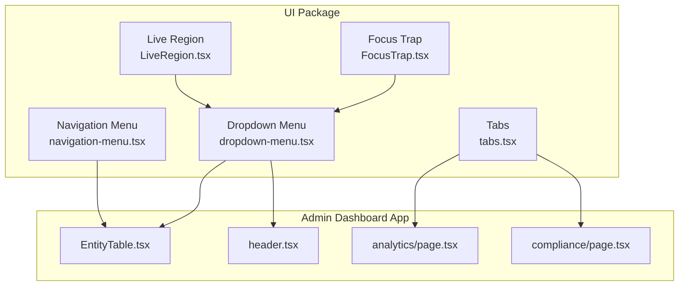
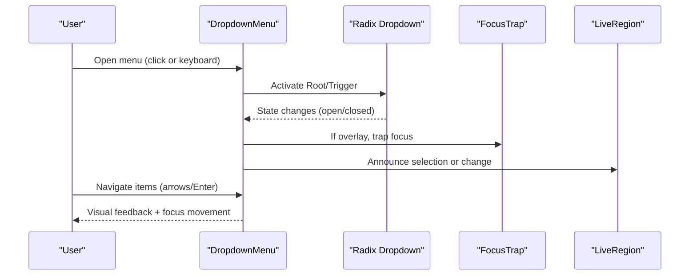
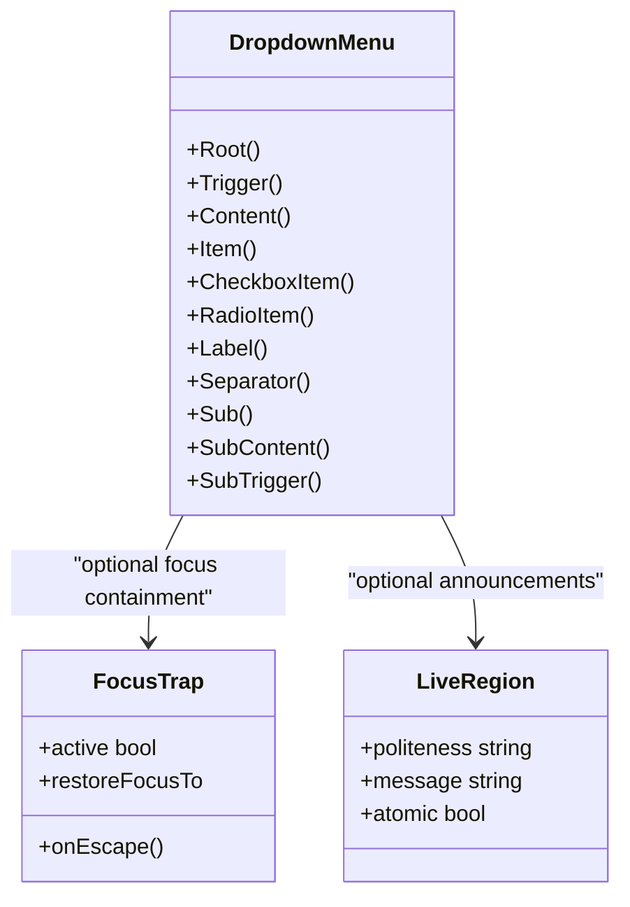
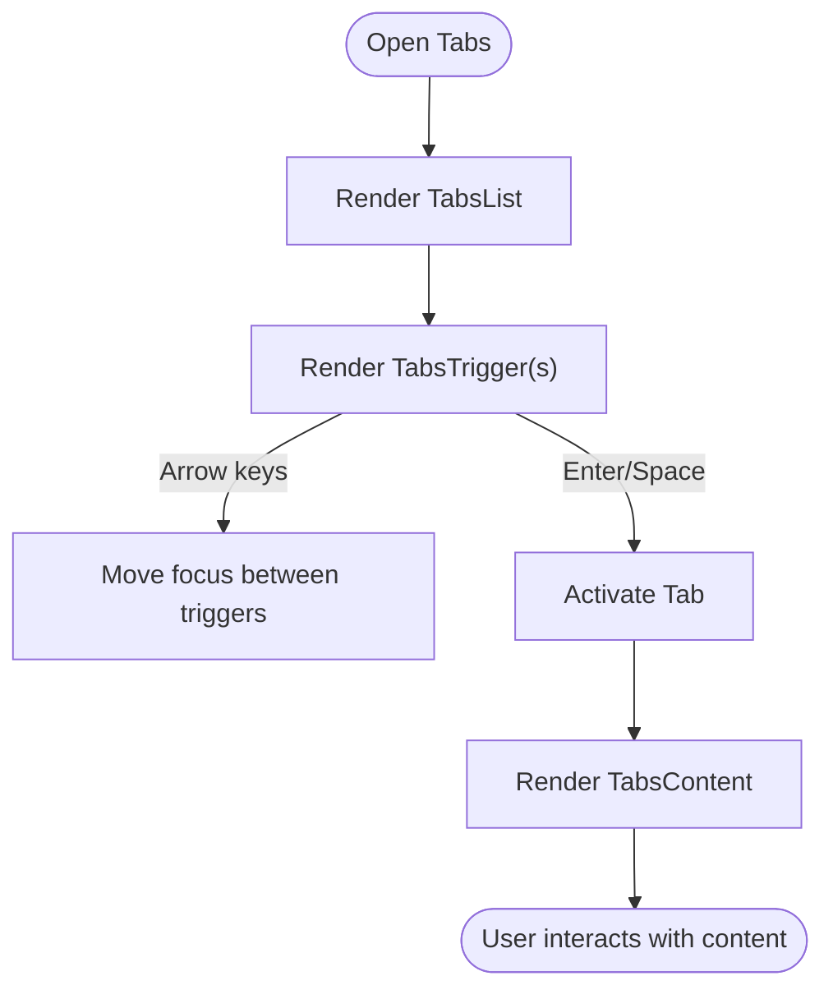
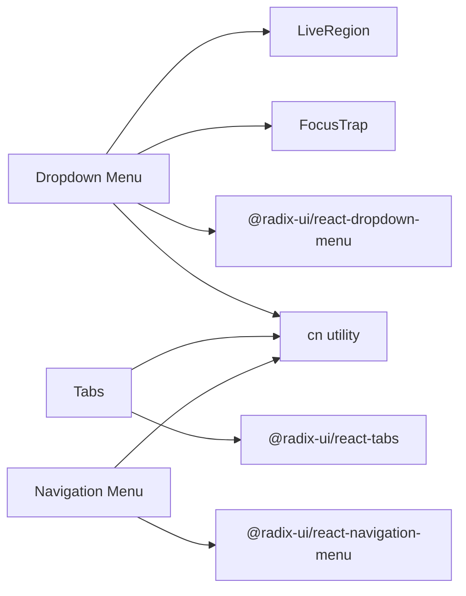

# Navigation Components

<cite>
**Referenced Files in This Document**
- [dropdown-menu.tsx](file://frontend/packages/ui/src/components/dropdown-menu.tsx)
- [tabs.tsx](file://frontend/packages/ui/src/components/tabs.tsx)
- [navigation-menu.tsx](file://frontend/packages/ui/src/components/navigation-menu.tsx)
- [FocusTrap.tsx](file://frontend/packages/ui/src/components/accessibility/focus-trap/FocusTrap.tsx)
- [LiveRegion.tsx](file://frontend/packages/ui/src/components/accessibility/live-region/LiveRegion.tsx)
- [EntityTable.tsx](file://frontend/apps/admin-dashboard/src/components/entities/EntityTable.tsx)
- [header.tsx](file://frontend/apps/admin-dashboard/src/components/layout/header.tsx)
- [analytics/page.tsx](file://frontend/apps/admin-dashboard/src/app/(dashboard)/analytics/page.tsx)
- [compliance/page.tsx](file://frontend/apps/admin-dashboard/src/app/(dashboard)/compliance/page.tsx)
- [service-schedule.tsx](file://frontend/packages/ui/src/components/service-schedule.tsx)
</cite>

## Table of Contents
1. [Introduction](#introduction)
2. [Project Structure](#project-structure)
3. [Core Components](#core-components)
4. [Architecture Overview](#architecture-overview)
5. [Detailed Component Analysis](#detailed-component-analysis)
6. [Dependency Analysis](#dependency-analysis)
7. [Performance Considerations](#performance-considerations)
8. [Troubleshooting Guide](#troubleshooting-guide)
9. [Conclusion](#conclusion)
10. [Appendices](#appendices)

## Introduction
This document provides detailed guidance for implementing navigation-related components in the project, focusing on Dropdown Menu and Tabs. It covers keyboard navigation, accessibility features, state management, styling options, and best practices for user experience and screen reader compatibility. The components are built on Radix UI primitives and styled with Tailwind CSS utilities, ensuring robust behavior and consistent theming across applications.

## Project Structure
The navigation components live in the shared UI package and are consumed by application code:
- Shared primitives and styled wrappers: frontend/packages/ui/src/components
- Application usage examples: frontend/apps/admin-dashboard and frontend/apps/master-site

**Diagram sources**
- [dropdown-menu.tsx:1-185](file://frontend/packages/ui/src/components/dropdown-menu.tsx#L1-L185)
- [tabs.tsx:1-55](file://frontend/packages/ui/src/components/tabs.tsx#L1-L55)
- [navigation-menu.tsx:1-122](file://frontend/packages/ui/src/components/navigation-menu.tsx#L1-L122)
- [FocusTrap.tsx:1-97](file://frontend/packages/ui/src/components/accessibility/focus-trap/FocusTrap.tsx#L1-L97)
- [LiveRegion.tsx:1-27](file://frontend/packages/ui/src/components/accessibility/live-region/LiveRegion.tsx#L1-L27)
- [EntityTable.tsx:40-50](file://frontend/apps/admin-dashboard/src/components/entities/EntityTable.tsx#L40-L50)
- [header.tsx:20-30](file://frontend/apps/admin-dashboard/src/components/layout/header.tsx#L20-L30)
- [analytics/page.tsx:1-20](file://frontend/apps/admin-dashboard/src/app/(dashboard)/analytics/page.tsx#L1-L20)
- [compliance/page.tsx:1-20](file://frontend/apps/admin-dashboard/src/app/(dashboard)/compliance/page.tsx#L1-L20)

**Section sources**
- [dropdown-menu.tsx:1-185](file://frontend/packages/ui/src/components/dropdown-menu.tsx#L1-L185)
- [tabs.tsx:1-55](file://frontend/packages/ui/src/components/tabs.tsx#L1-L55)
- [navigation-menu.tsx:1-122](file://frontend/packages/ui/src/components/navigation-menu.tsx#L1-L122)
- [EntityTable.tsx:40-50](file://frontend/apps/admin-dashboard/src/components/entities/EntityTable.tsx#L40-L50)
- [header.tsx:20-30](file://frontend/apps/admin-dashboard/src/components/layout/header.tsx#L20-L30)
- [analytics/page.tsx:1-20](file://frontend/apps/admin-dashboard/src/app/(dashboard)/analytics/page.tsx#L1-L20)
- [compliance/page.tsx:1-20](file://frontend/apps/admin-dashboard/src/app/(dashboard)/compliance/page.tsx#L1-L20)

## Core Components
- Dropdown Menu: Provides a fully accessible dropdown with keyboard support, nested submenus, checkbox/radio items, labels, separators, and shortcuts. Built on Radix Dropdown Menu and styled via Tailwind classes.
- Tabs: Offers a tabbed interface with list, trigger, and content panels, including focus rings and active states. Built on Radix Tabs and styled via Tailwind classes.
- Navigation Menu: Horizontal menu with triggers, content, viewport, and indicator for large navigation patterns.
- Accessibility Utilities: FocusTrap to manage focus within overlays and LiveRegion to announce dynamic updates to screen readers.

Key implementation highlights:
- Keyboard navigation is handled by Radix primitives (e.g., arrow keys, Enter/Space, Escape).
- Styling uses Tailwind utility classes and class-variance-authority where applicable.
- Screen reader support includes proper roles, aria attributes, and announcements.

**Section sources**
- [dropdown-menu.tsx:1-185](file://frontend/packages/ui/src/components/dropdown-menu.tsx#L1-L185)
- [tabs.tsx:1-55](file://frontend/packages/ui/src/components/tabs.tsx#L1-L55)
- [navigation-menu.tsx:1-122](file://frontend/packages/ui/src/components/navigation-menu.tsx#L1-L122)
- [FocusTrap.tsx:1-97](file://frontend/packages/ui/src/components/accessibility/focus-trap/FocusTrap.tsx#L1-L97)
- [LiveRegion.tsx:1-27](file://frontend/packages/ui/src/components/accessibility/live-region/LiveRegion.tsx#L1-L27)

## Architecture Overview
The navigation components follow a layered architecture:
- Primitives layer: Radix UI components provide unstyled, accessible behaviors.
- Composition layer: Styled wrappers add Tailwind-based design tokens and consistent UX.
- Application layer: Pages and modules compose these components into navigational patterns.

**Diagram sources**
- [dropdown-menu.tsx:1-185](file://frontend/packages/ui/src/components/dropdown-menu.tsx#L1-L185)
- [FocusTrap.tsx:1-97](file://frontend/packages/ui/src/components/accessibility/focus-trap/FocusTrap.tsx#L1-L97)
- [LiveRegion.tsx:1-27](file://frontend/packages/ui/src/components/accessibility/live-region/LiveRegion.tsx#L1-L27)

## Detailed Component Analysis

### Dropdown Menu
- Purpose: Contextual actions and selections presented in a floating panel.
- Keyboard navigation:
  - Arrow Up/Down to move focus between items.
  - Enter/Space to activate items.
  - Escape to close the menu.
  - Submenus supported via Sub/SubContent/SubTrigger.
- Accessibility:
  - Proper roles and aria attributes provided by Radix.
  - Optional integration with FocusTrap when used inside overlays.
  - Use LiveRegion to announce important state changes if needed.
- State management:
  - Controlled via Radix props; integrate with local React state for custom behaviors.
- Styling:
  - Tailwind classes define layout, colors, spacing, and animations.
  - Supports inset items, separators, labels, checkboxes, radio items, and shortcuts.

**Diagram sources**
- [dropdown-menu.tsx:1-185](file://frontend/packages/ui/src/components/dropdown-menu.tsx#L1-L185)
- [FocusTrap.tsx:1-97](file://frontend/packages/ui/src/components/accessibility/focus-trap/FocusTrap.tsx#L1-L97)
- [LiveRegion.tsx:1-27](file://frontend/packages/ui/src/components/accessibility/live-region/LiveRegion.tsx#L1-L27)

Implementation references:
- Usage in admin dashboard header and entity table demonstrates typical patterns for actions and context menus.

**Section sources**
- [dropdown-menu.tsx:1-185](file://frontend/packages/ui/src/components/dropdown-menu.tsx#L1-L185)
- [EntityTable.tsx:40-50](file://frontend/apps/admin-dashboard/src/components/entities/EntityTable.tsx#L40-L50)
- [header.tsx:20-30](file://frontend/apps/admin-dashboard/src/components/layout/header.tsx#L20-L30)
- [FocusTrap.tsx:1-97](file://frontend/packages/ui/src/components/accessibility/focus-trap/FocusTrap.tsx#L1-L97)
- [LiveRegion.tsx:1-27](file://frontend/packages/ui/src/components/accessibility/live-region/LiveRegion.tsx#L1-L27)

### Tabs
- Purpose: Organize related content into switchable panels.
- Keyboard navigation:
  - Arrow Left/Right to move focus between tabs.
  - Enter/Space to activate selected tab.
  - Focus returns to the tab trigger upon activation.
- Accessibility:
  - Roles and aria attributes managed by Radix Tabs.
  - Focus ring styles ensure visible focus indicators.
- State management:
  - Controlled via Radix props; combine with local state for data fetching or side effects.
- Styling:
  - Tailwind classes define list, trigger, and content appearance.
  - Active state styling applied via data attributes.

**Diagram sources**
- [tabs.tsx:1-55](file://frontend/packages/ui/src/components/tabs.tsx#L1-L55)

Usage references:
- Admin dashboard pages use Tabs to segment analytics and compliance views.
- Service schedule component composes Tabs for scheduling interfaces.

**Section sources**
- [tabs.tsx:1-55](file://frontend/packages/ui/src/components/tabs.tsx#L1-L55)
- [analytics/page.tsx:1-20](file://frontend/apps/admin-dashboard/src/app/(dashboard)/analytics/page.tsx#L1-L20)
- [compliance/page.tsx:1-20](file://frontend/apps/admin-dashboard/src/app/(dashboard)/compliance/page.tsx#L1-L20)
- [service-schedule.tsx:10-20](file://frontend/packages/ui/src/components/service-schedule.tsx#L10-L20)

### Navigation Menu
- Purpose: Primary horizontal navigation with rich content areas.
- Features:
  - Triggers with hover/focus states and animated chevron.
  - Viewport and indicator for positioning and visual cues.
  - Accessible interactions via Radix Navigation Menu.

**Section sources**
- [navigation-menu.tsx:1-122](file://frontend/packages/ui/src/components/navigation-menu.tsx#L1-L122)

## Dependency Analysis
- External dependencies:
  - Radix UI primitives provide core behaviors and accessibility.
  - Lucide icons for visual cues (e.g., chevrons).
  - Tailwind CSS for styling.
- Internal dependencies:
  - Utility functions for class merging.
  - Accessibility utilities for focus management and announcements.

**Diagram sources**
- [dropdown-menu.tsx:1-185](file://frontend/packages/ui/src/components/dropdown-menu.tsx#L1-L185)
- [tabs.tsx:1-55](file://frontend/packages/ui/src/components/tabs.tsx#L1-L55)
- [navigation-menu.tsx:1-122](file://frontend/packages/ui/src/components/navigation-menu.tsx#L1-L122)
- [FocusTrap.tsx:1-97](file://frontend/packages/ui/src/components/accessibility/focus-trap/FocusTrap.tsx#L1-L97)
- [LiveRegion.tsx:1-27](file://frontend/packages/ui/src/components/accessibility/live-region/LiveRegion.tsx#L1-L27)

**Section sources**
- [dropdown-menu.tsx:1-185](file://frontend/packages/ui/src/components/dropdown-menu.tsx#L1-L185)
- [tabs.tsx:1-55](file://frontend/packages/ui/src/components/tabs.tsx#L1-L55)
- [navigation-menu.tsx:1-122](file://frontend/packages/ui/src/components/navigation-menu.tsx#L1-L122)
- [FocusTrap.tsx:1-97](file://frontend/packages/ui/src/components/accessibility/focus-trap/FocusTrap.tsx#L1-L97)
- [LiveRegion.tsx:1-27](file://frontend/packages/ui/src/components/accessibility/live-region/LiveRegion.tsx#L1-L27)

## Performance Considerations
- Prefer controlled components where state must be synchronized with app logic.
- Avoid unnecessary re-renders by memoizing callbacks and stable props.
- Use lazy loading for heavy tab content to reduce initial bundle size.
- Keep dropdown menus lightweight; defer rendering complex content until open.
- Leverage Tailwind’s utility-first approach to minimize custom CSS overhead.

[No sources needed since this section provides general guidance]

## Troubleshooting Guide
Common issues and resolutions:
- Keyboard not working:
  - Ensure Radix primitives are used correctly and no event listeners prevent default behavior.
  - Verify that focus is not trapped unexpectedly outside the component.
- Screen reader not announcing changes:
  - Use LiveRegion to announce dynamic updates (e.g., tab switches, dropdown selections).
  - Confirm aria attributes are present and correct.
- Focus not returning after closing:
  - Integrate FocusTrap to manage focus within overlays and restore focus on close.
- Styling conflicts:
  - Check Tailwind class precedence and avoid overriding critical focus-visible styles.

**Section sources**
- [FocusTrap.tsx:1-97](file://frontend/packages/ui/src/components/accessibility/focus-trap/FocusTrap.tsx#L1-L97)
- [LiveRegion.tsx:1-27](file://frontend/packages/ui/src/components/accessibility/live-region/LiveRegion.tsx#L1-L27)
- [dropdown-menu.tsx:1-185](file://frontend/packages/ui/src/components/dropdown-menu.tsx#L1-L185)
- [tabs.tsx:1-55](file://frontend/packages/ui/src/components/tabs.tsx#L1-L55)

## Conclusion
The Dropdown Menu and Tabs components provide robust, accessible navigation patterns built on Radix UI and styled with Tailwind CSS. By following the keyboard navigation guidelines, leveraging accessibility utilities, and applying consistent styling, teams can deliver intuitive experiences compatible with screen readers and assistive technologies. Integration points in the admin dashboard demonstrate practical usage for real-world scenarios.

[No sources needed since this section summarizes without analyzing specific files]

## Appendices
- Best practices checklist:
  - Always use Radix primitives for reliable keyboard and screen reader support.
  - Provide clear labels and descriptions for interactive elements.
  - Test with keyboard-only navigation and screen readers.
  - Keep focus management predictable and consistent across components.
  - Use LiveRegion for meaningful announcements on state changes.

[No sources needed since this section provides general guidance]