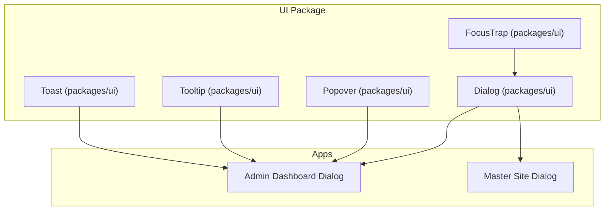
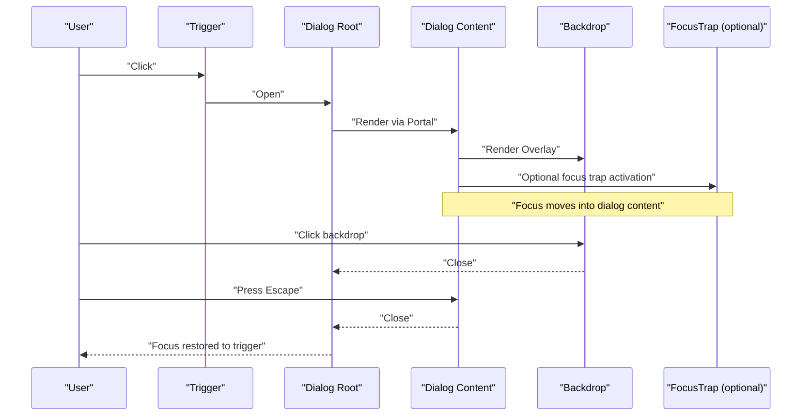
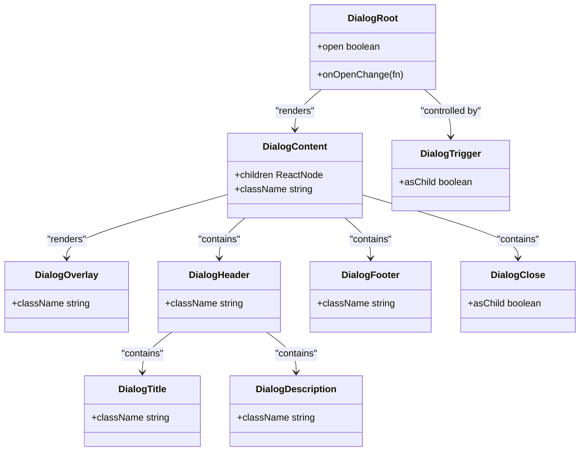
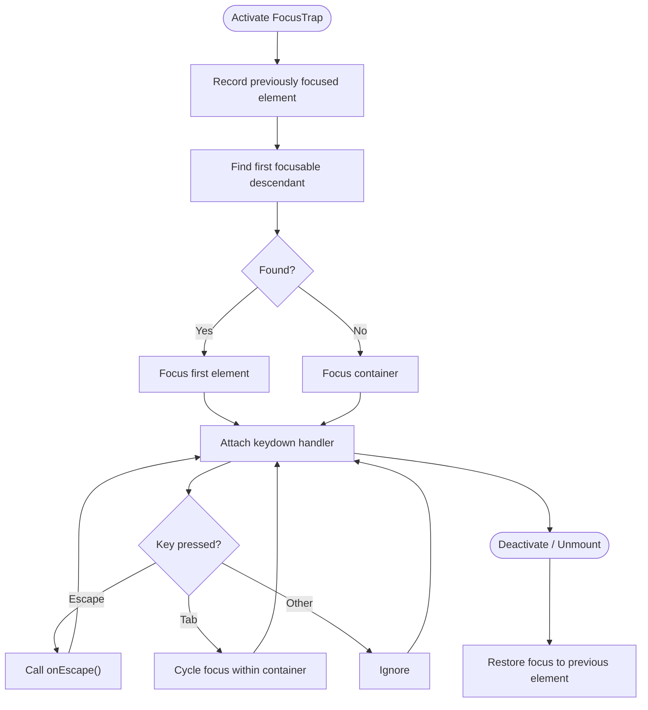
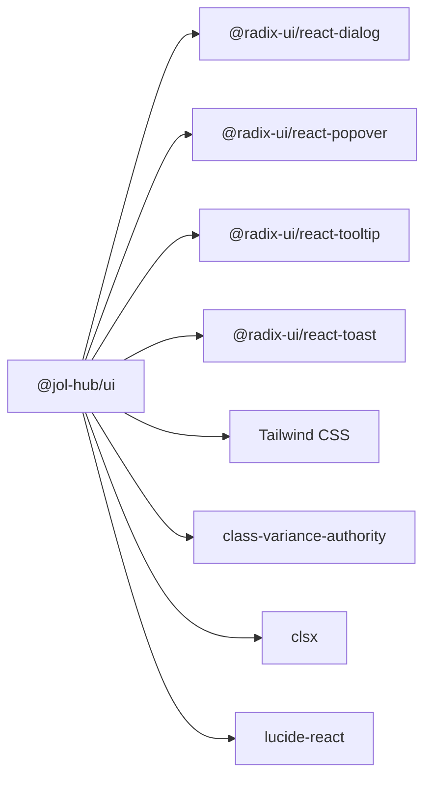

# Overlay Components

<cite>
**Referenced Files in This Document**
- [dialog.tsx](file://frontend/packages/ui/src/components/dialog.tsx)
- [dialog.tsx (admin-dashboard)](file://frontend/apps/admin-dashboard/src/components/ui/dialog.tsx)
- [dialog.tsx (master-site)](file://frontend/apps/master-site/src/components/dialog.tsx)
- [FocusTrap.tsx](file://frontend/packages/ui/src/components/accessibility/focus-trap/FocusTrap.tsx)
- [popover.tsx](file://frontend/packages/ui/src/components/popover.tsx)
- [tooltip.tsx](file://frontend/packages/ui/src/components/tooltip.tsx)
- [toast.tsx](file://frontend/packages/ui/src/components/toast.tsx)
- [package.json](file://frontend/packages/ui/package.json)
</cite>

## Table of Contents
1. Introduction
2. Project Structure
3. Core Components
4. Architecture Overview
5. Detailed Component Analysis
6. Dependency Analysis
7. Performance Considerations
8. Troubleshooting Guide
9. Conclusion
10. Appendices

## Introduction
This document explains the overlay components used across the frontend, with a focus on Dialog modals and related overlays (Popover, Tooltip, Toast). It covers modal behavior, focus management, backdrop handling, keyboard navigation, and accessibility features such as screen reader support. It also provides practical guidance for creating confirmation dialogs, form dialogs, and content display dialogs using consistent patterns found in the codebase.

## Project Structure
The overlay components are implemented as thin wrappers around Radix UI primitives and styled with Tailwind CSS utilities. The shared implementation lives in the UI package and is mirrored in application-specific folders where needed.

**Diagram sources**
- [dialog.tsx:1-104](file://frontend/packages/ui/src/components/dialog.tsx#L1-L104)
- [dialog.tsx (admin-dashboard):1-104](file://frontend/apps/admin-dashboard/src/components/ui/dialog.tsx#L1-L104)
- [dialog.tsx (master-site):1-104](file://frontend/apps/master-site/src/components/dialog.tsx#L1-L104)
- [popover.tsx:1-31](file://frontend/packages/ui/src/components/popover.tsx#L1-L31)
- [tooltip.tsx:1-30](file://frontend/packages/ui/src/components/tooltip.tsx#L1-L30)
- [toast.tsx:1-119](file://frontend/packages/ui/src/components/toast.tsx#L1-L119)
- [FocusTrap.tsx:1-97](file://frontend/packages/ui/src/components/accessibility/focus-trap/FocusTrap.tsx#L1-L97)

**Section sources**
- [dialog.tsx:1-104](file://frontend/packages/ui/src/components/dialog.tsx#L1-L104)
- [dialog.tsx (admin-dashboard):1-104](file://frontend/apps/admin-dashboard/src/components/ui/dialog.tsx#L1-L104)
- [dialog.tsx (master-site):1-104](file://frontend/apps/master-site/src/components/dialog.tsx#L1-L104)
- [package.json:76-99](file://frontend/packages/ui/package.json#L76-L99)

## Core Components
- Dialog: A modal overlay built on Radix Dialog with portal rendering, animated backdrop, centered content, and accessible close button.
- Popover: A floating overlay anchored to a trigger, suitable for contextual information or small actions.
- Tooltip: A lightweight overlay for brief hints and labels.
- Toast: Non-modal notifications that appear in a viewport region without interrupting workflow.
- FocusTrap: Keyboard focus containment utility for overlays and drawers.

Key behaviors:
- Modal behavior: Dialog uses Radix’s stateful open/close semantics with portal rendering to ensure proper stacking context and focus isolation.
- Backdrop handling: An overlay element renders behind content with opacity and fade animations; clicking it closes the dialog.
- Focus management: Radix manages focus within the dialog; FocusTrap can be used to enforce focus cycling when building custom overlays.
- Accessibility: Semantic roles and attributes are provided by Radix; close buttons include visually hidden text for screen readers; titles and descriptions map to appropriate aria semantics.

**Section sources**
- [dialog.tsx:16-53](file://frontend/packages/ui/src/components/dialog.tsx#L16-L53)
- [popover.tsx:11-27](file://frontend/packages/ui/src/components/popover.tsx#L11-L27)
- [tooltip.tsx:13-27](file://frontend/packages/ui/src/components/tooltip.tsx#L13-L27)
- [toast.tsx:11-24](file://frontend/packages/ui/src/components/toast.tsx#L11-L24)
- [FocusTrap.tsx:28-89](file://frontend/packages/ui/src/components/accessibility/focus-trap/FocusTrap.tsx#L28-L89)

## Architecture Overview
The overlays follow a consistent architecture:
- Primitives: Radix UI provides robust, accessible primitives for state, focus, and portalization.
- Wrappers: Application components wrap primitives with Tailwind classes for consistent styling and UX.
- Composition: Complex overlays compose primitives (e.g., Dialog + Header/Footer/Title/Description).
- Utilities: Shared focus management and live regions enhance accessibility.

**Diagram sources**
- [dialog.tsx:8-53](file://frontend/packages/ui/src/components/dialog.tsx#L8-L53)
- [FocusTrap.tsx:55-89](file://frontend/packages/ui/src/components/accessibility/focus-trap/FocusTrap.tsx#L55-L89)

## Detailed Component Analysis

### Dialog Modal
Behavior:
- Opens/closes based on Radix state.
- Renders a full-screen backdrop and a centered content panel with animations.
- Includes a close button with screen-reader-only label.
- Uses portal to render outside the DOM hierarchy for correct z-index and focus scoping.

Accessibility:
- Title and description elements map to semantic roles for assistive technologies.
- Close button includes sr-only text for clarity.
- Focus is managed by Radix; use FocusTrap if you need additional constraints.

Keyboard navigation:
- Escape closes the dialog.
- Tab cycles through focusable elements inside the dialog.

Common composition patterns:
- Confirmation dialog: Title + Description + Footer with Confirm/Cancel actions.
- Form dialog: Header + Form fields + Footer with Submit/Cancel.
- Content display: Header + Scrollable content area + optional Footer.

**Diagram sources**
- [dialog.tsx:8-103](file://frontend/packages/ui/src/components/dialog.tsx#L8-L103)

Practical usage references:
- Confirmation dialog: Compose Dialog + DialogTitle + DialogDescription + DialogFooter with two actions.
- Form dialog: Place form controls inside DialogContent; ensure first input receives focus on open.
- Content display: Use DialogContent with scrollable container; provide clear title and description.

**Section sources**
- [dialog.tsx:16-90](file://frontend/packages/ui/src/components/dialog.tsx#L16-L90)
- [dialog.tsx (admin-dashboard):16-90](file://frontend/apps/admin-dashboard/src/components/ui/dialog.tsx#L16-L90)
- [dialog.tsx (master-site):16-90](file://frontend/apps/master-site/src/components/dialog.tsx#L16-L90)

### Focus Management (FocusTrap)
Purpose:
- Traps keyboard focus within an overlay or drawer.
- Moves focus to the first focusable element on activation.
- Cycles Tab/Shift+Tab within the container.
- Delegates Escape to a callback.
- Restores focus to the previously focused element on deactivation.

Implementation highlights:
- Uses a selector list to identify focusable nodes.
- Attaches keydown listener to handle Tab and Escape.
- Ensures restoration logic runs on unmount or when deactivated.

**Diagram sources**
- [FocusTrap.tsx:28-89](file://frontend/packages/ui/src/components/accessibility/focus-trap/FocusTrap.tsx#L28-L89)

**Section sources**
- [FocusTrap.tsx:19-89](file://frontend/packages/ui/src/components/accessibility/focus-trap/FocusTrap.tsx#L19-L89)

### Popover
Use cases:
- Contextual menus, help panels, or secondary actions near a trigger.
- Lightweight alternative to Dialog when full-screen modal is not required.

Behavior:
- Anchored to trigger with configurable alignment and offset.
- Portal-based rendering for correct stacking.
- Animated open/close states.

**Section sources**
- [popover.tsx:11-27](file://frontend/packages/ui/src/components/popover.tsx#L11-L27)

### Tooltip
Use cases:
- Short hints, labels, or instructions for interactive elements.
- Non-intrusive feedback that does not require user action.

Behavior:
- Positioned relative to trigger with side offsets.
- Animated transitions for show/hide.

**Section sources**
- [tooltip.tsx:13-27](file://frontend/packages/ui/src/components/tooltip.tsx#L13-L27)

### Toast
Use cases:
- Success, error, or informational messages.
- Dismissible notifications with optional actions.

Behavior:
- Viewport positioned at top/bottom-right depending on screen size.
- Variants for default and destructive styles.
- Swipe gestures and animations supported.

**Section sources**
- [toast.tsx:11-118](file://frontend/packages/ui/src/components/toast.tsx#L11-L118)

## Dependency Analysis
The overlays depend on Radix UI primitives for robust accessibility and state management. The UI package declares these dependencies and exposes them via exports.

**Diagram sources**
- [package.json:76-99](file://frontend/packages/ui/package.json#L76-L99)

**Section sources**
- [package.json:76-99](file://frontend/packages/ui/package.json#L76-L99)

## Performance Considerations
- Prefer Portal rendering for overlays to avoid layout thrashing in deep component trees.
- Keep Dialog content minimal; defer heavy computations until after open.
- Use lazy loading for large content inside Dialogs to reduce initial bundle size.
- Avoid unnecessary re-renders by memoizing expensive children or splitting state.
- For many concurrent overlays, ensure only one active modal to prevent focus conflicts.

[No sources needed since this section provides general guidance]

## Troubleshooting Guide
Common issues and resolutions:
- Focus not trapped: Ensure the overlay has focusable descendants; verify FocusTrap is active and container is mounted.
- Escape does not close: Confirm Escape handler is wired; check for event propagation blocking.
- Backdrop click does nothing: Verify the overlay element is present and pointer events are enabled.
- Screen reader announcements missing: Provide descriptive titles and descriptions; ensure sr-only text for icons like close buttons.
- Z-index stacking problems: Ensure portals are rendered at the app root and no parent containers override stacking contexts.

**Section sources**
- [FocusTrap.tsx:55-89](file://frontend/packages/ui/src/components/accessibility/focus-trap/FocusTrap.tsx#L55-L89)
- [dialog.tsx:46-50](file://frontend/packages/ui/src/components/dialog.tsx#L46-L50)

## Conclusion
The overlay system leverages Radix UI primitives to deliver accessible, composable, and consistently styled overlays. Dialogs provide modal experiences with robust focus and keyboard handling; Popovers and Tooltips offer lightweight contextual overlays; Toasts deliver non-blocking notifications. By composing these primitives and applying the FocusTrap utility when necessary, teams can build reliable, accessible overlays for confirmations, forms, and content display.

[No sources needed since this section summarizes without analyzing specific files]

## Appendices

### Creating Common Dialog Types
- Confirmation dialog:
  - Use Dialog + DialogTitle + DialogDescription + DialogFooter with Confirm and Cancel actions.
  - Ensure Cancel returns focus to the trigger; Confirm performs action and closes.
- Form dialog:
  - Place form fields inside DialogContent; set initial focus to the first input.
  - Validate before closing; provide inline errors and accessible messages.
- Content display dialog:
  - Use DialogContent with a scrollable container for long content.
  - Include a clear title and description; allow closing via backdrop, Escape, or close button.

[No sources needed since this section provides conceptual guidance]