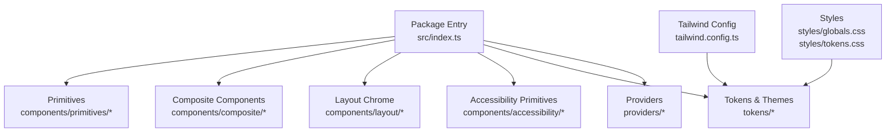
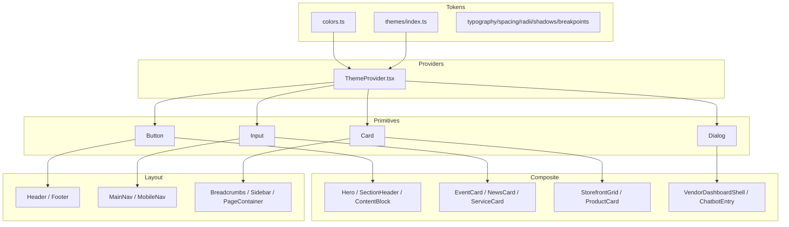
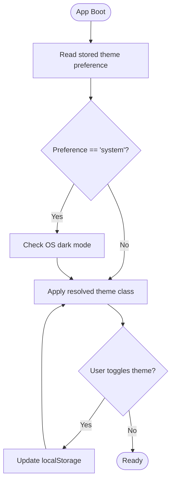
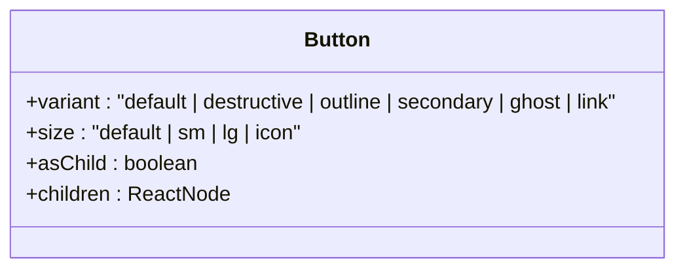
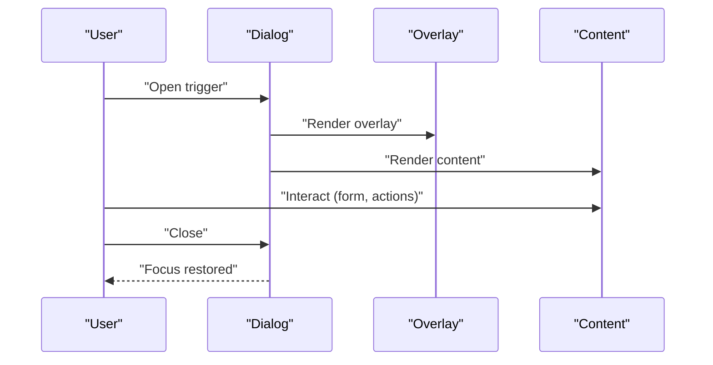
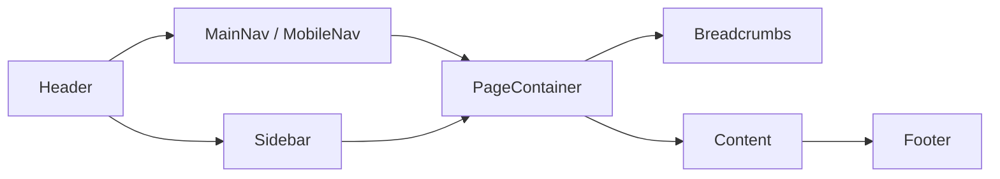
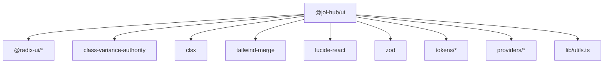

# UI Component Library

<cite>
**Referenced Files in This Document**
- [package.json](file://frontend/packages/ui/package.json)
- [index.ts](file://frontend/packages/ui/src/index.ts)
- [button.tsx](file://frontend/packages/ui/src/components/button.tsx)
- [card.tsx](file://frontend/packages/ui/src/components/card.tsx)
- [dialog.tsx](file://frontend/packages/ui/src/components/dialog.tsx)
- [input.tsx](file://frontend/packages/ui/src/components/input.tsx)
- [ThemeProvider.tsx](file://frontend/packages/ui/src/providers/ThemeProvider.tsx)
- [colors.ts](file://frontend/packages/ui/src/tokens/colors.ts)
- [themes/index.ts](file://frontend/packages/ui/src/tokens/themes/index.ts)
- [utils.ts](file://frontend/packages/ui/src/lib/utils.ts)
- [Header.tsx](file://frontend/packages/ui/src/components/layout/header/Header.tsx)
- [Footer.tsx](file://frontend/packages/ui/src/components/layout/footer/Footer.tsx)
- [MainNav.tsx](file://frontend/packages/ui/src/components/layout/main-nav/MainNav.tsx)
- [MobileNav.tsx](file://frontend/packages/ui/src/components/layout/mobile-nav/MobileNav.tsx)
- [Breadcrumbs.tsx](file://frontend/packages/ui/src/components/layout/breadcrumbs/Breadcrumbs.tsx)
- [Sidebar.tsx](file://frontend/packages/ui/src/components/layout/sidebar/Sidebar.tsx)
- [PageContainer.tsx](file://frontend/packages/ui/src/components/layout/page-container/PageContainer.tsx)
</cite>

## Table of Contents
1. Introduction
2. Project Structure
3. Core Components
4. Architecture Overview
5. Detailed Component Analysis
6. Dependency Analysis
7. Performance Considerations
8. Troubleshooting Guide
9. Conclusion
10. Appendices

## Introduction
This document describes the shared UI component library built with React and Tailwind CSS. It covers reusable primitives, composite components, layout chrome, accessibility utilities, theming, and responsive behavior. You will learn how to import components, customize appearance via props and tokens, ensure accessibility, and apply tenant-specific themes across applications.

## Project Structure
The library is published as a single package with multiple subpath exports for primitives, composites, layout, accessibility, and tokens. The barrel index re-exports stable surfaces for consumers while keeping internal organization modular.

**Diagram sources**
- [index.ts:1-240](file://frontend/packages/ui/src/index.ts#L1-L240)
- [package.json:5-58](file://frontend/packages/ui/package.json#L5-L58)

Key characteristics:
- Subpath exports for primitives, composite, layout, accessibility, tokens, providers, and styles.
- Side effects include global CSS files for consistent base styles.
- Peer dependencies on React, ReactDOM, and Next.js; compatible with modern React apps.

**Section sources**
- [package.json:1-118](file://frontend/packages/ui/package.json#L1-L118)
- [index.ts:1-240](file://frontend/packages/ui/src/index.ts#L1-L240)

## Core Components
The library exposes a comprehensive set of accessible primitives and higher-level components:

- Buttons: variant-driven styling (default, destructive, outline, secondary, ghost, link), sizes (default, sm, lg, icon), and composition via Slot for linking or wrapping.
- Inputs and form fields: standardized focus rings, disabled states, and placeholder styling.
- Cards: structured surface with header, title, description, content, and footer.
- Dialogs: overlay, portal, header/footer, title/description, and close affordance.
- Navigation menus, dropdowns, selects, tabs, tooltips, toasts, and more are available through the barrel.

Styling approach:
- Class merging utility combines Tailwind classes deterministically.
- Variant-based styling uses a class variants system for consistent prop-driven customization.

Accessibility highlights:
- Focus-visible outlines and ring offsets for keyboard navigation.
- Screen-reader-only labels where needed (e.g., dialog close).
- Semantic HTML elements (buttons, headings, lists) used throughout.

Usage patterns:
- Import from the package root for convenience (e.g., Button, Input, Card, Dialog).
- For granular control, import from subpaths like primitives or composite.

**Section sources**
- [button.tsx:1-49](file://frontend/packages/ui/src/components/button.tsx#L1-L49)
- [input.tsx:1-24](file://frontend/packages/ui/src/components/input.tsx#L1-L24)
- [card.tsx:1-56](file://frontend/packages/ui/src/components/card.tsx#L1-L56)
- [dialog.tsx:1-104](file://frontend/packages/ui/src/components/dialog.tsx#L1-L104)
- [utils.ts:1-7](file://frontend/packages/ui/src/lib/utils.ts#L1-L7)
- [index.ts:6-86](file://frontend/packages/ui/src/index.ts#L6-L86)

## Architecture Overview
The design system separates concerns into layers:
- Tokens: color scales, typography, spacing, radii, shadows, breakpoints, and theme profiles.
- Providers: ThemeProvider manages light/dark/system mode and persists user preference.
- Primitives: low-level building blocks (Button, Input, Card, etc.).
- Composite: domain-aware components (Hero, EventCard, StorefrontGrid, VendorDashboardShell, etc.).
- Layout: Header, Footer, MainNav, MobileNav, Breadcrumbs, Sidebar, PageContainer.
- Accessibility: SkipLink, AnnouncerProvider/LiveRegion, FocusTrap.

**Diagram sources**
- [colors.ts:1-319](file://frontend/packages/ui/src/tokens/colors.ts#L1-L319)
- [themes/index.ts:1-159](file://frontend/packages/ui/src/tokens/themes/index.ts#L1-L159)
- [ThemeProvider.tsx:1-132](file://frontend/packages/ui/src/providers/ThemeProvider.tsx#L1-L132)
- [button.tsx:1-49](file://frontend/packages/ui/src/components/button.tsx#L1-L49)
- [input.tsx:1-24](file://frontend/packages/ui/src/components/input.tsx#L1-L24)
- [card.tsx:1-56](file://frontend/packages/ui/src/components/card.tsx#L1-L56)
- [dialog.tsx:1-104](file://frontend/packages/ui/src/components/dialog.tsx#L1-L104)
- [index.ts:159-237](file://frontend/packages/ui/src/index.ts#L159-L237)

## Detailed Component Analysis

### Theming and Design System Principles
- Color tokens define semantic scales (primary, secondary, accent, neutral, success, warning, error, info) plus church-specific palettes (altar, candle, incense, stone, wood, gold).
- Theme roles map semantic colors to light/dark modes, ensuring contrast compliance.
- Denomination theme profiles allow configuration-only theme swaps without code changes. Profiles include catholic, orthodox, protestant, and other.
- ThemeProvider applies the correct class to the document root and persists user preference, preventing flash-of-wrong-theme when paired with an inline init script.

**Diagram sources**
- [ThemeProvider.tsx:28-33](file://frontend/packages/ui/src/providers/ThemeProvider.tsx#L28-L33)
- [ThemeProvider.tsx:52-69](file://frontend/packages/ui/src/providers/ThemeProvider.tsx#L52-L69)
- [ThemeProvider.tsx:96-115](file://frontend/packages/ui/src/providers/ThemeProvider.tsx#L96-L115)

**Section sources**
- [colors.ts:1-319](file://frontend/packages/ui/src/tokens/colors.ts#L1-L319)
- [themes/index.ts:1-159](file://frontend/packages/ui/src/tokens/themes/index.ts#L1-L159)
- [ThemeProvider.tsx:1-132](file://frontend/packages/ui/src/providers/ThemeProvider.tsx#L1-L132)

### Button
- Props: standard button attributes plus variant and size; supports asChild to render as another element via Slot.
- Styling: variant-driven classes for default, destructive, outline, secondary, ghost, link; sizes default, sm, lg, icon.
- Accessibility: focus-visible ring, disabled state handling, keyboard support by default.

**Diagram sources**
- [button.tsx:6-49](file://frontend/packages/ui/src/components/button.tsx#L6-L49)

**Section sources**
- [button.tsx:1-49](file://frontend/packages/ui/src/components/button.tsx#L1-L49)

### Input
- Props: standard input attributes; type supported.
- Styling: consistent borders, padding, focus rings, placeholder styling, disabled state.
- Accessibility: native semantics, focus-visible ring, proper label association recommended by consumers.

**Section sources**
- [input.tsx:1-24](file://frontend/packages/ui/src/components/input.tsx#L1-L24)

### Card
- Surface with semantic sections: CardHeader, CardTitle, CardDescription, CardContent, CardFooter.
- Styling: rounded border, background, shadow, and appropriate spacing.
- Accessibility: uses h3 for titles; consumers should provide descriptive text for screen readers.

**Section sources**
- [card.tsx:1-56](file://frontend/packages/ui/src/components/card.tsx#L1-L56)

### Dialog
- Composition: Root, Portal, Overlay, Trigger, Close, Content, Header, Footer, Title, Description.
- Styling: centered modal with animations, backdrop, and close affordance.
- Accessibility: focus management handled by underlying primitive; includes sr-only close label.

**Diagram sources**
- [dialog.tsx:8-53](file://frontend/packages/ui/src/components/dialog.tsx#L8-L53)
- [dialog.tsx:55-103](file://frontend/packages/ui/src/components/dialog.tsx#L55-L103)

**Section sources**
- [dialog.tsx:1-104](file://frontend/packages/ui/src/components/dialog.tsx#L1-L104)

### Layout Components
- Header/Footer: top-level chrome for branding, links, and social links.
- MainNav/MobileNav: primary navigation with responsive behavior.
- Breadcrumbs: hierarchical navigation aid.
- Sidebar: contextual navigation or filters.
- PageContainer: page-level wrapper for consistent spacing and structure.

**Diagram sources**
- [Header.tsx](file://frontend/packages/ui/src/components/layout/header/Header.tsx)
- [Footer.tsx](file://frontend/packages/ui/src/components/layout/footer/Footer.tsx)
- [MainNav.tsx](file://frontend/packages/ui/src/components/layout/main-nav/MainNav.tsx)
- [MobileNav.tsx](file://frontend/packages/ui/src/components/layout/mobile-nav/MobileNav.tsx)
- [Breadcrumbs.tsx](file://frontend/packages/ui/src/components/layout/breadcrumbs/Breadcrumbs.tsx)
- [Sidebar.tsx](file://frontend/packages/ui/src/components/layout/sidebar/Sidebar.tsx)
- [PageContainer.tsx](file://frontend/packages/ui/src/components/layout/page-container/PageContainer.tsx)

**Section sources**
- [index.ts:159-173](file://frontend/packages/ui/src/index.ts#L159-L173)

### Accessibility Utilities
- SkipLink: quick access to main content.
- AnnouncerProvider/useAnnounce: programmatic announcements for dynamic updates.
- LiveRegion: region for live-updating content.
- FocusTrap: confines focus within a container (e.g., dialogs).

These primitives help maintain WCAG-compliant experiences across the library.

**Section sources**
- [index.ts:175-183](file://frontend/packages/ui/src/index.ts#L175-L183)

## Dependency Analysis
- External dependencies include Radix UI primitives for robust, accessible behaviors; Lucide icons; class-variance-authority for variant styling; clsx and tailwind-merge for class composition; Zod for validation in some composites.
- Peer dependencies require React, ReactDOM, and Next.js versions aligned with modern ecosystems.
- Internal dependencies: tokens and providers feed styling and theme behavior; utils provides deterministic class merging.

**Diagram sources**
- [package.json:76-99](file://frontend/packages/ui/package.json#L76-L99)
- [utils.ts:1-7](file://frontend/packages/ui/src/lib/utils.ts#L1-L7)

**Section sources**
- [package.json:1-118](file://frontend/packages/ui/package.json#L1-L118)
- [utils.ts:1-7](file://frontend/packages/ui/src/lib/utils.ts#L1-L7)

## Performance Considerations
- Use the class merging utility to avoid redundant or conflicting Tailwind classes.
- Prefer primitives and composites that leverage lightweight overlays and portals to minimize reflows.
- ThemeProvider avoids FOUT by applying classes early; pair with the provided init script in your app’s head/body for optimal performance.
- Token-driven styling ensures consistent rendering and reduces runtime style computation.

[No sources needed since this section provides general guidance]

## Troubleshooting Guide
Common issues and resolutions:
- Theme not applied on first paint: ensure the init script is inlined before hydration and that ThemeProvider wraps your app tree.
- Conflicting styles: verify class merging is used and no external CSS overrides Tailwind classes unexpectedly.
- Focus not trapped in modals: confirm FocusTrap usage and that interactive elements inside have valid tab order.
- Contrast failures: use the token scales and rely on theme roles; run contrast checks to validate AA compliance.

**Section sources**
- [ThemeProvider.tsx:28-33](file://frontend/packages/ui/src/providers/ThemeProvider.tsx#L28-L33)
- [colors.ts:275-298](file://frontend/packages/ui/src/tokens/colors.ts#L275-L298)

## Conclusion
This UI component library provides a cohesive, accessible, and themeable foundation for building consistent interfaces across applications. By leveraging tokens, providers, and well-structured components, teams can rapidly compose pages and features while maintaining design integrity and accessibility standards.

[No sources needed since this section summarizes without analyzing specific files]

## Appendices

### How to Import and Customize Components
- Import from the package root for convenience:
  - Example paths: Button, Input, Card, Dialog, Header, Footer, MainNav, MobileNav, Breadcrumbs, Sidebar, PageContainer.
- Import from subpaths for granularity:
  - primitives, composite, layout, accessibility, tokens, providers.
- Customize via props:
  - Button: variant, size, asChild.
  - Input: type and standard attributes.
  - Card: semantic sections for structured layouts.
  - Dialog: composition of parts for flexible modals.
- Apply themes:
  - Wrap your app with ThemeProvider and optionally use the init script to prevent theme flicker.
  - Select denomination profiles via configuration to swap palettes without code changes.

**Section sources**
- [index.ts:6-237](file://frontend/packages/ui/src/index.ts#L6-L237)
- [ThemeProvider.tsx:1-132](file://frontend/packages/ui/src/providers/ThemeProvider.tsx#L1-L132)
- [package.json:5-58](file://frontend/packages/ui/package.json#L5-L58)