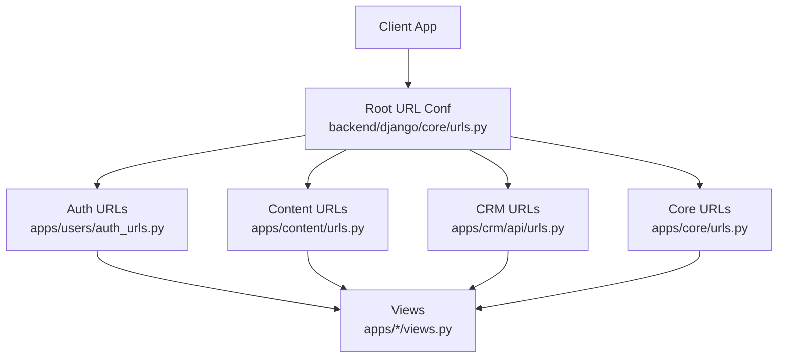
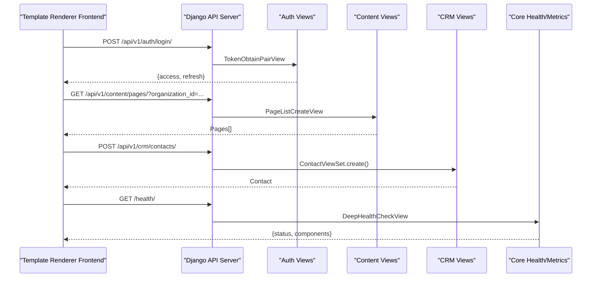
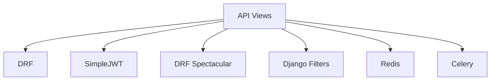

# API Routes & Endpoints

<cite>
**Referenced Files in This Document**
- [backend/django/core/urls.py](file://backend/django/core/urls.py)
- [backend/django/apps/core/urls.py](file://backend/django/apps/core/urls.py)
- [backend/django/apps/core/views.py](file://backend/django/apps/core/views.py)
- [backend/django/apps/users/auth_urls.py](file://backend/django/apps/users/auth_urls.py)
- [backend/django/apps/users/views.py](file://backend/django/apps/users/views.py)
- [backend/django/apps/content/urls.py](file://backend/django/apps/content/urls.py)
- [backend/django/apps/content/views.py](file://backend/django/apps/content/views.py)
- [backend/django/apps/crm/api/urls.py](file://backend/django/apps/crm/api/urls.py)
- [backend/django/apps/crm/api/views.py](file://backend/django/apps/crm/api/views.py)
- [backend/django/core/settings/base.py](file://backend/django/core/settings/base.py)
- [docs/api/openapi-spec.yaml](file://docs/api/openapi-spec.yaml)
</cite>

## Table of Contents
1. Introduction
2. Project Structure
3. Core Components
4. Architecture Overview
5. Detailed Component Analysis
6. Dependency Analysis
7. Performance Considerations
8. Troubleshooting Guide
9. Conclusion

## Introduction
This document provides API documentation for the template renderer’s server-side endpoints, focusing on authentication routes, content management APIs, CRM integration endpoints, and editor functionality exposed by the backend Django services. It specifies HTTP methods, request/response schemas, authentication requirements, error handling patterns, and operational considerations such as rate limiting, security, and monitoring. It also includes guidance for integrating with the backend from frontend applications, handling media uploads, and implementing real-time collaboration features.

## Project Structure
The API surface is mounted under /api/v1 and includes:
- Authentication: /api/v1/auth/*
- Content Management: /api/v1/content/*
- CRM Integration: /api/v1/crm/*
- Observability: /health/, /health/ready/, /metrics/
- Admin and internal endpoints are also present but not the focus here.

**Diagram sources**
- [backend/django/core/urls.py:39-66](file://backend/django/core/urls.py#L39-L66)
- [backend/django/apps/users/auth_urls.py:16-21](file://backend/django/apps/users/auth_urls.py#L16-L21)
- [backend/django/apps/content/urls.py:6-12](file://backend/django/apps/content/urls.py#L6-L12)
- [backend/django/apps/crm/api/urls.py:18-31](file://backend/django/apps/crm/api/urls.py#L18-L31)
- [backend/django/apps/core/urls.py:18-46](file://backend/django/apps/core/urls.py#L18-L46)

**Section sources**
- [backend/django/core/urls.py:39-66](file://backend/django/core/urls.py#L39-L66)
- [backend/django/apps/core/urls.py:18-46](file://backend/django/apps/core/urls.py#L18-L46)

## Core Components
- Authentication endpoints: register, login, logout, token refresh.
- Content endpoints: pages CRUD and publish; media file list/create/retrieve/delete.
- CRM endpoints: contacts, deals, GDPR data subject requests, audit log, Bitrix24 sync.
- Observability: health checks, readiness probe, Prometheus metrics.

Authentication uses JWT via SimpleJWT; most endpoints require an authenticated user. Rate limiting is applied to sensitive endpoints (auth, GDPR operations). Tenant isolation is enforced for CRM resources.

**Section sources**
- [backend/django/apps/users/auth_urls.py:16-21](file://backend/django/apps/users/auth_urls.py#L16-L21)
- [backend/django/apps/users/views.py:31-70](file://backend/django/apps/users/views.py#L31-L70)
- [backend/django/apps/content/urls.py:6-12](file://backend/django/apps/content/urls.py#L6-L12)
- [backend/django/apps/content/views.py:14-83](file://backend/django/apps/content/views.py#L14-L83)
- [backend/django/apps/crm/api/urls.py:18-31](file://backend/django/apps/crm/api/urls.py#L18-L31)
- [backend/django/apps/crm/api/views.py:141-769](file://backend/django/apps/crm/api/views.py#L141-L769)
- [backend/django/apps/core/urls.py:18-46](file://backend/django/apps/core/urls.py#L18-L46)

## Architecture Overview
The template renderer integrates with a Django backend that exposes RESTful APIs. The root URL configuration mounts sub-apps for auth, content, CRM, and core observability. Middleware enforces tenant context for CRM endpoints. DRF Spectacular provides OpenAPI/Swagger/Redoc at /api/schema/, /api/docs/, /api/redoc/.

**Diagram sources**
- [backend/django/core/urls.py:39-66](file://backend/django/core/urls.py#L39-L66)
- [backend/django/apps/users/auth_urls.py:16-21](file://backend/django/apps/users/auth_urls.py#L16-L21)
- [backend/django/apps/content/urls.py:6-12](file://backend/django/apps/content/urls.py#L6-L12)
- [backend/django/apps/crm/api/urls.py:18-31](file://backend/django/apps/crm/api/urls.py#L18-L31)
- [backend/django/apps/core/urls.py:18-46](file://backend/django/apps/core/urls.py#L18-L46)

## Detailed Component Analysis

### Authentication Endpoints
- POST /api/v1/auth/register/
  - Purpose: Create a new user account.
  - Auth: None (public).
  - Throttling: Anonymous and per-user throttles applied.
  - Response: User object or validation errors.
  - Errors: 400 Bad Request, 429 Too Many Requests.

- POST /api/v1/auth/login/
  - Purpose: Obtain JWT access and refresh tokens.
  - Auth: None (public).
  - Throttling: Anonymous and per-user throttles applied.
  - Response: Access and refresh tokens.
  - Errors: 401 Unauthorized, 429 Too Many Requests.

- POST /api/v1/auth/logout/
  - Purpose: Blacklist refresh token to terminate session.
  - Auth: Required (Bearer token).
  - Request: JSON with refresh_token.
  - Response: Success message.
  - Errors: 400 Bad Request if missing field, 401 Unauthorized.

- POST /api/v1/auth/refresh/
  - Purpose: Refresh access token using refresh token.
  - Auth: None (public).
  - Response: New access token.
  - Errors: 401 Unauthorized.

Integration notes:
- Include Authorization: Bearer <access_token> for protected endpoints.
- Handle 429 responses by backing off and retrying after delay.

Security considerations:
- Enforce HTTPS in production.
- Store tokens securely on the client side.
- Rotate refresh tokens and blacklist on logout.

Rate limiting:
- Sensitive endpoints use strict throttles to prevent abuse.

**Section sources**
- [backend/django/apps/users/auth_urls.py:16-21](file://backend/django/apps/users/auth_urls.py#L16-L21)
- [backend/django/apps/users/views.py:31-70](file://backend/django/apps/users/views.py#L31-L70)
- [docs/api/openapi-spec.yaml:61-146](file://docs/api/openapi-spec.yaml#L61-L146)

### Content Management Endpoints
- GET /api/v1/content/pages/
  - Purpose: List pages with optional filters (organization_id, language, status).
  - Auth: Required.
  - Query params: organization_id, language, status, page, page_size.
  - Response: Paginated list of pages.

- POST /api/v1/content/pages/
  - Purpose: Create a new page.
  - Auth: Required.
  - Request: PageCreate schema.
  - Response: Created page.
  - Errors: 400 Bad Request.

- GET /api/v1/content/pages/{id}/
  - Purpose: Retrieve a specific page.
  - Auth: Required.
  - Response: Page object.
  - Errors: 404 Not Found.

- PATCH /api/v1/content/pages/{id}/
  - Purpose: Update a page.
  - Auth: Required.
  - Request: PageUpdate schema.
  - Response: Updated page.
  - Errors: 400, 404.

- DELETE /api/v1/content/pages/{id}/
  - Purpose: Soft delete a page.
  - Auth: Required.
  - Response: 204 No Content.
  - Errors: 404 Not Found.

- POST /api/v1/content/pages/{id}/publish/
  - Purpose: Publish a draft page.
  - Auth: Required.
  - Response: Published page.
  - Errors: 404 Not Found.

- GET /api/v1/content/media/
  - Purpose: List media files with optional organization filter.
  - Auth: Required.
  - Response: Media list.

- POST /api/v1/content/media/
  - Purpose: Upload a media file.
  - Auth: Required.
  - Request: multipart/form-data with file field(s).
  - Response: Uploaded media metadata.
  - Errors: 400 Bad Request.

- GET /api/v1/content/media/{id}/
  - Purpose: Retrieve media details.
  - Auth: Required.
  - Response: Media object.
  - Errors: 404 Not Found.

- DELETE /api/v1/content/media/{id}/
  - Purpose: Soft delete a media file.
  - Auth: Required.
  - Response: 204 No Content.
  - Errors: 404 Not Found.

Media upload guidance:
- Use multipart/form-data for file fields.
- Validate file types and sizes server-side.
- Ensure proper CORS headers for browser uploads.

Real-time collaboration:
- For collaborative editing, consider WebSocket channels or SSE for live updates.
- Implement optimistic UI updates and conflict resolution strategies.

**Section sources**
- [backend/django/apps/content/urls.py:6-12](file://backend/django/apps/content/urls.py#L6-L12)
- [backend/django/apps/content/views.py:14-83](file://backend/django/apps/content/views.py#L14-L83)
- [docs/api/openapi-spec.yaml:593-762](file://docs/api/openapi-spec.yaml#L593-L762)

### CRM Integration Endpoints
- Contacts
  - GET /api/v1/crm/contacts/
    - Purpose: List contacts filtered by tenant and optional query params (data_classification, consent_status, has_religious_data, created_after).
    - Auth: Required + Organization member.
    - Response: Contact list (minimal serializer for list).
  - POST /api/v1/crm/contacts/
    - Purpose: Create contact within tenant context.
    - Auth: Required + Organization member.
    - Response: Created contact.
  - GET /api/v1/crm/contacts/{id}/
    - Purpose: Retrieve contact with tenant ownership validation.
    - Response: Contact detail.
  - PATCH /api/v1/crm/contacts/{id}/
    - Purpose: Update contact with tenant validation.
    - Response: Updated contact.
  - DELETE /api/v1/crm/contacts/{id}/
    - Purpose: Delete contact (blocked if legal hold active).
    - Response: 204 No Content or 403 Forbidden.
  - POST /api/v1/crm/contacts/{id}/grant_consent/
    - Purpose: Grant GDPR consent for contact.
    - Response: Updated contact.
  - POST /api/v1/crm/contacts/{id}/withdraw_consent/
    - Purpose: Withdraw GDPR consent.
    - Response: Updated contact.
  - GET /api/v1/crm/contacts/{id}/export/
    - Purpose: Export contact data (GDPR Art. 15).
    - Response: Contact and related deals export payload.

- Deals
  - GET /api/v1/crm/deals/
    - Purpose: List deals with filters (contact, created_after, amount ranges).
    - Response: Deal list (minimal serializer for list).
  - POST /api/v1/crm/deals/
    - Purpose: Create deal within tenant context.
    - Response: Created deal.
  - GET /api/v1/crm/deals/{id}/
    - Purpose: Retrieve deal with tenant validation.
    - Response: Deal detail.
  - PATCH /api/v1/crm/deals/{id}/
    - Purpose: Update deal with tenant validation.
    - Response: Updated deal.
  - DELETE /api/v1/crm/deals/{id}/
    - Purpose: Delete deal.
    - Response: 204 No Content.
  - POST /api/v1/crm/deals/{id}/mark_paid/
    - Purpose: Mark deal as paid with financial audit logging.
    - Response: Updated deal.
  - POST /api/v1/crm/deals/{id}/refund/
    - Purpose: Process refund with PCI-DSS audit logging.
    - Response: Updated deal.
  - POST /api/v1/crm/deals/{id}/send_receipt/
    - Purpose: Send donation receipt email.
    - Response: Updated deal.
  - GET /api/v1/crm/deals/statistics/
    - Purpose: Aggregated statistics for tenant.
    - Response: Stats including totals and breakdowns.

- GDPR Data Subject Requests
  - GET /api/v1/crm/gdpr/requests/
    - Purpose: List DSRs with filters (request_type, status).
    - Response: DSR list.
  - POST /api/v1/crm/gdpr/requests/{id}/process/
    - Purpose: Process DSR (access or erasure).
    - Response: Updated DSR with results.

- Audit Log
  - GET /api/v1/crm/audit/
    - Purpose: Read-only audit log access limited to last 1000 entries.
    - Response: Audit entries.
  - GET /api/v1/crm/audit/verify_integrity/
    - Purpose: Verify audit hash chain integrity.
    - Response: Integrity check result.
  - GET /api/v1/crm/audit/export/
    - Purpose: Export audit log for compliance reporting.
    - Response: Exported entries with integrity status.
  - GET /api/v1/crm/audit/statistics/
    - Purpose: Get audit log statistics for dashboard.
    - Response: Counts and breakdowns.
  - GET /api/v1/crm/audit/chain_info/
    - Purpose: Get first and last entry info for verification.
    - Response: Chain info.

- Bitrix24 Sync
  - POST /api/v1/crm/bitrix24/sync/
    - Purpose: Queue entities for sync to Bitrix24.
    - Request: entity_type, entity_ids, force_resync.
    - Response: Queued status with count.

Tenant isolation:
- All CRM endpoints enforce tenant context via middleware and mixin.
- Unauthorized access attempts are logged and blocked.

Rate limiting:
- CRM operations use standard throttle; GDPR exports/deletions use stricter limits.

**Section sources**
- [backend/django/apps/crm/api/urls.py:18-31](file://backend/django/apps/crm/api/urls.py#L18-L31)
- [backend/django/apps/crm/api/views.py:141-769](file://backend/django/apps/crm/api/views.py#L141-L769)

### Editor Functionality Endpoints
- POST /api/v1/content/pages/{id}/publish/
  - Purpose: Publish a draft page from the editor.
  - Auth: Required.
  - Response: Published page.

- POST /api/v1/content/media/
  - Purpose: Upload assets used by the editor.
  - Auth: Required.
  - Request: multipart/form-data with file(s).
  - Response: Media metadata.

- GET /api/v1/content/media/
  - Purpose: List available media for editor selection.
  - Auth: Required.
  - Response: Media list.

Real-time collaboration:
- Use WebSockets or Server-Sent Events to broadcast edits and presence.
- Implement conflict resolution and versioning for concurrent edits.

**Section sources**
- [backend/django/apps/content/urls.py:6-12](file://backend/django/apps/content/urls.py#L6-L12)
- [backend/django/apps/content/views.py:47-83](file://backend/django/apps/content/views.py#L47-L83)

### Observability Endpoints
- GET /health/
  - Purpose: Deep health check (liveness + component checks).
  - Auth: None.
  - Response: Status and component health.

- GET /health/ready/
  - Purpose: Readiness probe (database/cache).
  - Auth: None.
  - Response: Readiness status.

- GET /metrics/
  - Purpose: Prometheus metrics exposition.
  - Auth: IP allowlist enforced by endpoint.
  - Response: Metrics text.

- GET /audit-logs/
  - Purpose: Admin-only recent audit logs.
  - Auth: Admin required.
  - Response: Recent audit entries.

**Section sources**
- [backend/django/apps/core/urls.py:18-46](file://backend/django/apps/core/urls.py#L18-L46)
- [backend/django/apps/core/views.py:36-121](file://backend/django/apps/core/views.py#L36-L121)

## Dependency Analysis
The API depends on:
- Django REST Framework for viewsets and serializers.
- SimpleJWT for token-based authentication.
- DRF Spectacular for OpenAPI docs.
- Django Filters for filtering/searching.
- Redis for caching and potentially rate limiting.
- Celery for background tasks (e.g., DSAR processing, Bitrix24 sync).

**Diagram sources**
- [backend/django/core/settings/base.py:59-117](file://backend/django/core/settings/base.py#L59-L117)

**Section sources**
- [backend/django/core/settings/base.py:59-117](file://backend/django/core/settings/base.py#L59-L117)

## Performance Considerations
- Use minimal serializers for list views to reduce payload size.
- Apply pagination and limit page_size to avoid large responses.
- Enable compression and caching headers for static assets and images.
- Use tenant isolation to scope queries and improve performance.
- Monitor metrics via /metrics/ and set alerts for high latency or error rates.

[No sources needed since this section provides general guidance]

## Troubleshooting Guide
Common issues and resolutions:
- 401 Unauthorized: Ensure valid Bearer token is included; refresh if expired.
- 403 Forbidden: Check tenant membership and permissions; verify tenant context.
- 404 Not Found: Confirm resource IDs and soft-delete status.
- 429 Too Many Requests: Back off and retry; respect throttle limits.
- 503 Service Unavailable: Check health endpoints and dependencies (DB, cache, broker).

Error handlers:
- Custom handlers return consistent error shapes with message keys for i18n.

**Section sources**
- [backend/django/apps/core/views.py:129-162](file://backend/django/apps/core/views.py#L129-L162)

## Conclusion
The template renderer’s backend exposes a comprehensive API covering authentication, content management, CRM integration, and observability. Endpoints are secured with JWT, rate-limited where appropriate, and enforce tenant isolation for CRM resources. Use the provided OpenAPI spec and Swagger UI for exploration and integration. Follow the security and performance recommendations to ensure robust operation in production environments.

[No sources needed since this section summarizes without analyzing specific files]