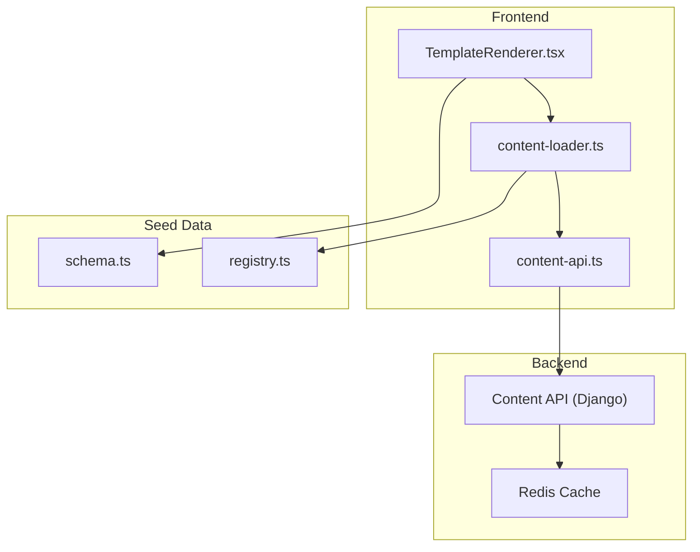
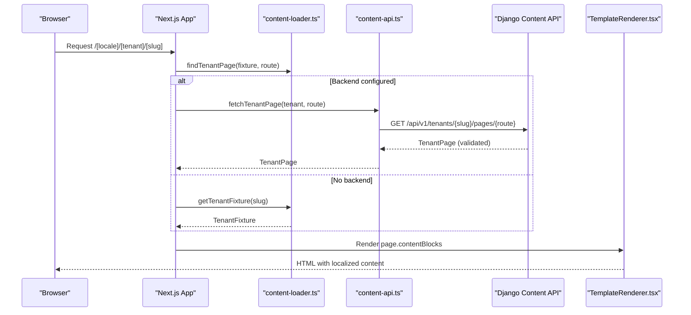
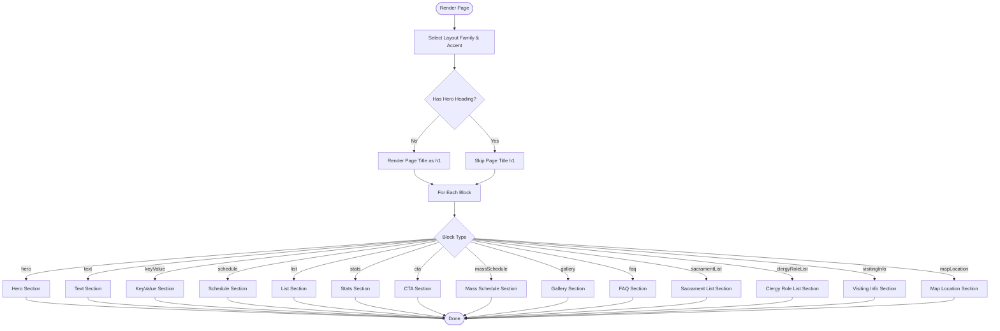
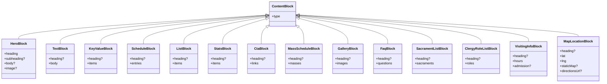
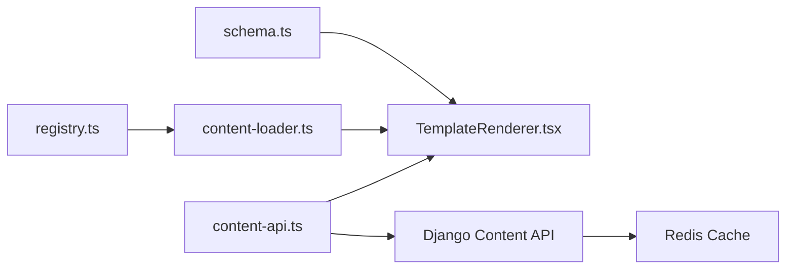

# Content Block System

<cite>
**Referenced Files in This Document**
- [TemplateRenderer.tsx](file://frontend/apps/template-renderer/src/components/TemplateRenderer.tsx)
- [schema.ts](file://frontend/packages/seed-data/src/schema.ts)
- [registry.ts](file://frontend/packages/seed-data/src/registry.ts)
- [content-loader.ts](file://frontend/apps/template-renderer/src/lib/content-loader.ts)
- [content-api.ts](file://frontend/apps/template-renderer/src/lib/content-api.ts)
- [block-schema-extension.md](file://docs/architecture/block-schema-extension.md)
- [data-flow.md](file://docs/architecture/data-flow.md)
- [base.py](file://backend/django/core/settings/base.py)
- [PERFORMANCE.md](file://frontend/apps/template-renderer/PERFORMANCE.md)
</cite>

## Table of Contents
1. [Introduction](#introduction)
2. [Project Structure](#project-structure)
3. [Core Components](#core-components)
4. [Architecture Overview](#architecture-overview)
5. [Detailed Component Analysis](#detailed-component-analysis)
6. [Dependency Analysis](#dependency-analysis)
7. [Performance Considerations](#performance-considerations)
8. [Troubleshooting Guide](#troubleshooting-guide)
9. [Conclusion](#conclusion)
10. [Appendices](#appendices)

## Introduction
This document explains the content block system that renders dynamic page content through a composable block architecture. It covers supported block types, the rendering engine, localization handling for multi-language content, responsive design patterns, accessibility compliance, creating custom blocks, integrating with external data sources, and performance considerations including caching strategies for large datasets.

The system is built around:
- A schema-driven content model that validates all tenant pages and their blocks.
- A single template renderer that switches on block type to render UI consistently across tenants.
- Optional backend integration via a server-only content API client that fetches pages and blocks with revalidation and error mapping.
- Localization utilities that select the appropriate language variant for display.
- Accessibility-first patterns (semantic headings, alt text, native disclosure widgets).

## Project Structure
At a high level:
- Schema definitions live in the seed-data package and define every supported block type and page structure.
- The template renderer consumes validated content and renders blocks using a switch-based dispatcher.
- A registry loads fixtures at module load time and provides lookup helpers.
- A content loader resolves tenant fixtures by slug and finds pages by route.
- A content API client optionally fetches pages/blocks from a backend service with Next.js revalidation and in-flight deduplication.

**Diagram sources**
- [TemplateRenderer.tsx:1-56](file://frontend/apps/template-renderer/src/components/TemplateRenderer.tsx#L1-L56)
- [schema.ts:274-290](file://frontend/packages/seed-data/src/schema.ts#L274-L290)
- [registry.ts:63-88](file://frontend/packages/seed-data/src/registry.ts#L63-L88)
- [content-loader.ts:17-32](file://frontend/apps/template-renderer/src/lib/content-loader.ts#L17-L32)
- [content-api.ts:128-177](file://frontend/apps/template-renderer/src/lib/content-api.ts#L128-L177)

**Section sources**
- [TemplateRenderer.tsx:1-56](file://frontend/apps/template-renderer/src/components/TemplateRenderer.tsx#L1-L56)
- [schema.ts:274-290](file://frontend/packages/seed-data/src/schema.ts#L274-L290)
- [registry.ts:63-88](file://frontend/packages/seed-data/src/registry.ts#L63-L88)
- [content-loader.ts:17-32](file://frontend/apps/template-renderer/src/lib/content-loader.ts#L17-L32)
- [content-api.ts:128-177](file://frontend/apps/template-renderer/src/lib/content-api.ts#L128-L177)

## Core Components
- ContentBlock schemas: Define all supported block types and validate fixture payloads at build/load time.
- TemplateRenderer: Renders any tenant by selecting layout family and iterating over content blocks; each block type has a dedicated rendering branch.
- Registry: Loads and validates fixtures into an internal map; exposes safe lookup functions.
- Content Loader: Resolves tenant fixtures by slug and finds pages by route; defines shared routes not rendered from fixtures.
- Content API Client: Server-only client to fetch pages, blocks, and collections from the backend with typed validation and revalidation windows.

Supported block types include hero, text, keyValue, schedule, list, stats, cta, massSchedule, gallery, faq, sacramentList, clergyRoleList, visitingInfo, and mapLocation.

**Section sources**
- [schema.ts:48-289](file://frontend/packages/seed-data/src/schema.ts#L48-L289)
- [TemplateRenderer.tsx:64-465](file://frontend/apps/template-renderer/src/components/TemplateRenderer.tsx#L64-L465)
- [registry.ts:63-88](file://frontend/packages/seed-data/src/registry.ts#L63-L88)
- [content-loader.ts:17-43](file://frontend/apps/template-renderer/src/lib/content-loader.ts#L17-L43)
- [content-api.ts:128-217](file://frontend/apps/template-renderer/src/lib/content-api.ts#L128-L217)

## Architecture Overview
The rendering pipeline supports two modes:
- Fixture mode: Tenant fixtures are loaded from the registry and rendered directly.
- Backend mode: When configured, the frontend fetches pages and blocks from the backend content API, validates them against the same schemas, and renders identically.

**Diagram sources**
- [content-api.ts:128-177](file://frontend/apps/template-renderer/src/lib/content-api.ts#L128-L177)
- [content-loader.ts:17-32](file://frontend/apps/template-renderer/src/lib/content-loader.ts#L17-L32)
- [TemplateRenderer.tsx:34-56](file://frontend/apps/template-renderer/src/components/TemplateRenderer.tsx#L34-L56)

## Detailed Component Analysis

### Rendering Engine: TemplateRenderer
- Selects layout family and accent based on tenant vertical.
- Ensures exactly one h1 per page (hero or page title fallback).
- Iterates contentBlocks and delegates to a type-switched BlockView.
- Localizes all user-facing strings via a helper that prefers Lithuanian, then English.

Key behaviors:
- Hero block: Supports optional image with explicit width/height for CLS prevention and localized alt text for WCAG 1.1.1.
- Text block: Renders heading and body with localization.
- KeyValue block: Displays key-value pairs in a definition list.
- Schedule block: Shows days, times, and notes.
- List block: Cards with title, subtitle, description, price, and tags.
- Stats block: Numbered metrics with localized labels.
- CTA block: Primary and secondary links with tenant-relative href resolution.
- massSchedule block: Emits Event JSON-LD semantics via <time dateTime>.
- gallery block: Lazy images with alt and captions.
- faq block: Native details/summary for accessible accordion behavior.
- sacramentList block: Service-oriented cards with schedule and requirements.
- clergyRoleList block: Roles only (no names), contact email link.
- visitingInfo block: Opening hours distinct from mass times.
- mapLocation block: Static map image fallback and coordinates with optional directions URL.

**Diagram sources**
- [TemplateRenderer.tsx:34-56](file://frontend/apps/template-renderer/src/components/TemplateRenderer.tsx#L34-L56)
- [TemplateRenderer.tsx:64-465](file://frontend/apps/template-renderer/src/components/TemplateRenderer.tsx#L64-L465)

**Section sources**
- [TemplateRenderer.tsx:21-56](file://frontend/apps/template-renderer/src/components/TemplateRenderer.tsx#L21-L56)
- [TemplateRenderer.tsx:64-465](file://frontend/apps/template-renderer/src/components/TemplateRenderer.tsx#L64-L465)

### Schema and Supported Blocks
All block types are defined with Zod schemas and included in a discriminated union. This ensures:
- Build-time validation of fixtures.
- Type safety for rendering logic.
- Clear contracts for optional fields and localization.

Highlights:
- LocalizedTextSchema enforces lt as required and en/en/ru as optional.
- Image blocks require explicit width/height and localized alt to prevent layout shift and meet accessibility standards.
- massSchedule uses ISO 8601 startDate for structured data correctness.
- clergyRoleList intentionally excludes names to comply with GDPR Art. 9.

**Diagram sources**
- [schema.ts:48-289](file://frontend/packages/seed-data/src/schema.ts#L48-L289)

**Section sources**
- [schema.ts:16-25](file://frontend/packages/seed-data/src/schema.ts#L16-L25)
- [schema.ts:48-289](file://frontend/packages/seed-data/src/schema.ts#L48-L289)

### Localization Handling
- The renderer uses a simple t() helper that selects lt first, then en, ensuring Lithuanian-first display while falling back gracefully.
- All user-facing strings in blocks are passed through this helper.
- The i18n package supports vertical overrides and message catalogs for broader app-wide localization needs.

Best practices:
- Always provide localized text for user-visible strings.
- Keep image alt text localized where applicable.
- Avoid mixing languages within a single string.

**Section sources**
- [TemplateRenderer.tsx:21-25](file://frontend/apps/template-renderer/src/components/TemplateRenderer.tsx#L21-L25)
- [TemplateRenderer.tsx:64-465](file://frontend/apps/template-renderer/src/components/TemplateRenderer.tsx#L64-L465)

### Responsive Design Patterns
- Grid layouts adapt across breakpoints (e.g., md:grid-cols-2, lg:grid-cols-3).
- Images use responsive classes and explicit dimensions to prevent layout shift.
- CTA buttons wrap flexibly and emphasize primary actions.
- Cards stack vertically on small screens and expand on larger viewports.

Examples:
- Hero block uses conditional grid when an image is present.
- List and stats blocks use responsive grids.
- Schedule and visiting info blocks use two-column grids on medium screens.

**Section sources**
- [TemplateRenderer.tsx:64-465](file://frontend/apps/template-renderer/src/components/TemplateRenderer.tsx#L64-L465)

### Accessibility Compliance
- Exactly one h1 per page enforced by checking for hero presence and falling back to page title.
- Images include alt text and explicit dimensions to avoid CLS and meet WCAG 1.1.1.
- FAQ uses native details/summary for keyboard-operable disclosure without JS.
- Time elements use dateTime attributes for semantic meaning.
- Links open new tabs safely with rel="noopener noreferrer".
- Focus and contrast guidelines are covered by the design system and tests.

**Section sources**
- [TemplateRenderer.tsx:42-50](file://frontend/apps/template-renderer/src/components/TemplateRenderer.tsx#L42-L50)
- [TemplateRenderer.tsx:76-85](file://frontend/apps/template-renderer/src/components/TemplateRenderer.tsx#L76-L85)
- [TemplateRenderer.tsx:289-312](file://frontend/apps/template-renderer/src/components/TemplateRenderer.tsx#L289-L312)
- [TemplateRenderer.tsx:437-452](file://frontend/apps/template-renderer/src/components/TemplateRenderer.tsx#L437-L452)

### Creating Custom Content Blocks
Steps to add a new block:
1. Define a Zod schema in the seed-data schema file and add it to the discriminated union.
2. Add a case in the TemplateRenderer’s BlockView switch to render the block.
3. If the block carries its own structured data (e.g., events), ensure JSON-LD mapping aligns with the block schema extension decisions.
4. Update fixtures or backend responses to include the new block type.
5. Test validation and rendering paths.

Guidance:
- Keep block schemas minimal and focused on presentation concerns.
- Use LocalizedText for all user-facing strings.
- Provide explicit dimensions for images to prevent CLS.
- Ensure accessibility semantics (headings, alt text, roles).

**Section sources**
- [schema.ts:274-289](file://frontend/packages/seed-data/src/schema.ts#L274-L289)
- [TemplateRenderer.tsx:64-465](file://frontend/apps/template-renderer/src/components/TemplateRenderer.tsx#L64-L465)
- [block-schema-extension.md:1-68](file://docs/architecture/block-schema-extension.md#L1-L68)

### Integrating with External Data Sources
- The content API client fetches pages and blocks from the backend when configured, validating responses against the same schemas used for fixtures.
- In pilot mode (no backend configured), the system falls back to fixtures seamlessly.
- Collections (news/events/services) can be fetched with appropriate caching policies.

Integration points:
- fetchTenantPage returns a validated TenantPage or null in pilot mode.
- fetchTenantContentBlock returns a validated ContentBlock or null in pilot mode.
- fetchTenantCollection and fetchTenantCollectionItem handle dynamic content with cache/no-store policies.

Error handling:
- 404 maps to not-found.
- 403 maps to forbidden.
- 5xx maps to server-error.
- Malformed payloads are treated as server errors to prevent rendering invalid content.

**Section sources**
- [content-api.ts:128-217](file://frontend/apps/template-renderer/src/lib/content-api.ts#L128-L217)

### Implementing Block-Specific Styling and Behavior
- Use Tailwind utility classes for consistent spacing, typography, and responsive layouts.
- Apply accent colors derived from the tenant vertical to maintain brand consistency.
- For interactive blocks (e.g., FAQ), prefer native HTML elements to minimize JS overhead and improve accessibility.
- For media-heavy blocks (e.g., gallery), use lazy loading and explicit dimensions.

**Section sources**
- [TemplateRenderer.tsx:64-465](file://frontend/apps/template-renderer/src/components/TemplateRenderer.tsx#L64-L465)

## Dependency Analysis
The block system depends on:
- Schema definitions for validation and type safety.
- Registry for fixture loading and lookup.
- Content loader for route-to-page resolution.
- Content API client for backend integration and caching.
- Template renderer for rendering blocks.

**Diagram sources**
- [schema.ts:274-289](file://frontend/packages/seed-data/src/schema.ts#L274-L289)
- [registry.ts:63-88](file://frontend/packages/seed-data/src/registry.ts#L63-L88)
- [content-loader.ts:17-32](file://frontend/apps/template-renderer/src/lib/content-loader.ts#L17-L32)
- [content-api.ts:128-177](file://frontend/apps/template-renderer/src/lib/content-api.ts#L128-L177)

**Section sources**
- [schema.ts:274-289](file://frontend/packages/seed-data/src/schema.ts#L274-L289)
- [registry.ts:63-88](file://frontend/packages/seed-data/src/registry.ts#L63-L88)
- [content-loader.ts:17-32](file://frontend/apps/template-renderer/src/lib/content-loader.ts#L17-L32)
- [content-api.ts:128-177](file://frontend/apps/template-renderer/src/lib/content-api.ts#L128-L177)

## Performance Considerations
- Revalidation windows: Pages, blocks, and news collections have different revalidate intervals to balance freshness and performance.
- In-flight deduplication: Concurrent identical requests share a single network call during a render pass.
- Caching: Backend uses Redis with configurable timeouts; frontend uses Next.js data cache for ISR and no-store for time-sensitive content.
- Resource hints: Prefetch/preconnect should be added only when third-party origins are actually referenced.
- Mobile optimizations: Viewport meta, touch targets, reduced motion support, and modern tap delay semantics.

Recommendations:
- Prefer fixture mode for static content to reduce network calls.
- Use lazy loading for non-critical images.
- Keep block payloads lean; avoid embedding large media in blocks.
- Monitor Core Web Vitals and adjust revalidation windows based on content sensitivity.

**Section sources**
- [content-api.ts:35-42](file://frontend/apps/template-renderer/src/lib/content-api.ts#L35-L42)
- [content-api.ts:82-112](file://frontend/apps/template-renderer/src/lib/content-api.ts#L82-L112)
- [base.py:392-416](file://backend/django/core/settings/base.py#L392-L416)
- [PERFORMANCE.md:156-181](file://frontend/apps/template-renderer/PERFORMANCE.md#L156-L181)

## Troubleshooting Guide
Common issues and resolutions:
- Unknown block type: The renderer defaults to null to avoid leaking raw payloads; verify the block exists in the schema union and the renderer switch.
- Invalid payload: Backend responses are validated; malformed data triggers a server-error to prevent garbage rendering.
- Missing localization: Ensure LocalizedText includes lt; fallback to en if provided.
- Image CLS: Provide explicit width/height and localized alt text.
- Accessibility failures: Use native elements (details/summary), ensure heading hierarchy, and verify contrast and focus indicators.

Debugging tips:
- Check schema validation errors in seed-data fixtures.
- Inspect content API responses and status codes.
- Use browser dev tools to verify semantic HTML and image attributes.
- Run accessibility checks per design system acceptance criteria.

**Section sources**
- [TemplateRenderer.tsx:458-465](file://frontend/apps/template-renderer/src/components/TemplateRenderer.tsx#L458-L465)
- [content-api.ts:144-149](file://frontend/apps/template-renderer/src/lib/content-api.ts#L144-L149)
- [content-api.ts:172-176](file://frontend/apps/template-renderer/src/lib/content-api.ts#L172-L176)

## Conclusion
The content block system provides a robust, schema-driven approach to rendering dynamic page content across tenants. It supports a wide range of block types, ensures accessibility and responsiveness, and integrates seamlessly with both fixtures and a backend content API. By following the outlined patterns for localization, styling, and performance, teams can extend the system with custom blocks and scale to large content datasets while maintaining quality and compliance.

## Appendices

### Block Types Summary
- hero: Headline, optional subheading/body, optional image with alt and dimensions.
- text: Heading and body.
- keyValue: Key-value pairs in a definition list.
- schedule: Days, times, and notes.
- list: Cards with title, subtitle, description, price, tags.
- stats: Metrics with localized labels.
- cta: Primary and secondary links with tenant-relative routing.
- massSchedule: Events with ISO 8601 start dates.
- gallery: Images with alt and captions.
- faq: Accessible Q&A using native disclosure.
- sacramentList: Liturgical services with schedule and requirements.
- clergyRoleList: Roles only, with optional contact.
- visitingInfo: Visitor opening hours distinct from mass times.
- mapLocation: Coordinates with optional static map and directions URL.

**Section sources**
- [schema.ts:48-289](file://frontend/packages/seed-data/src/schema.ts#L48-L289)
- [TemplateRenderer.tsx:64-465](file://frontend/apps/template-renderer/src/components/TemplateRenderer.tsx#L64-L465)