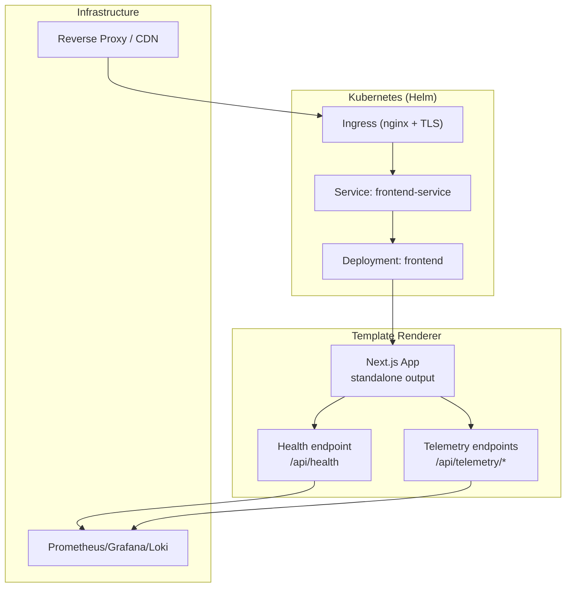
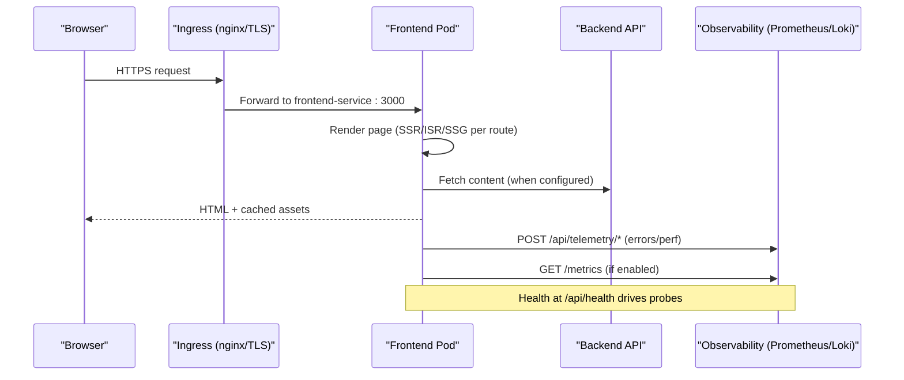
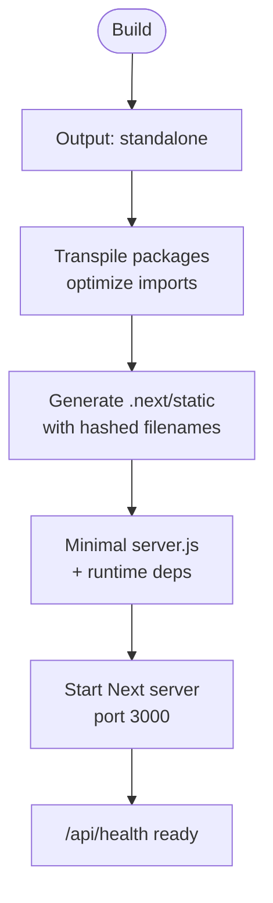
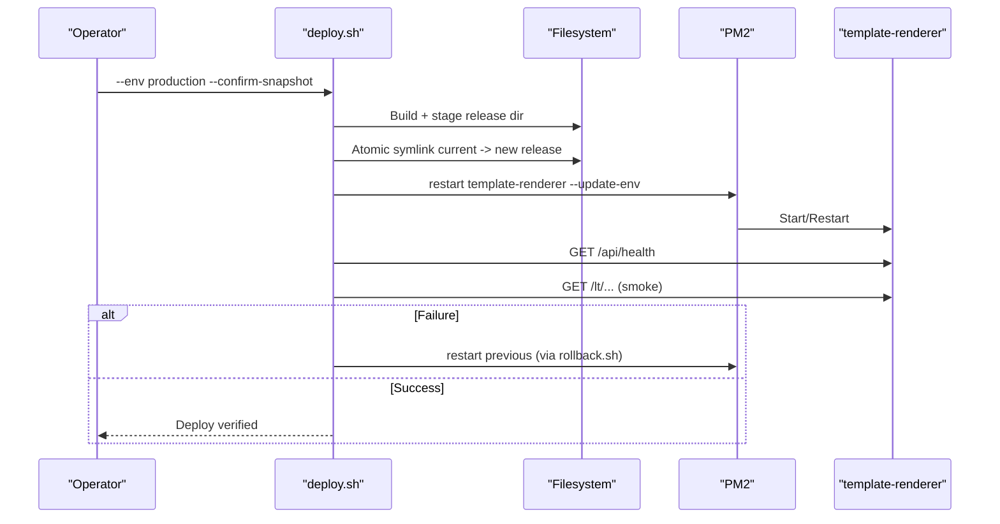
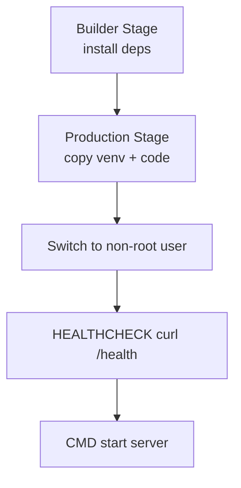
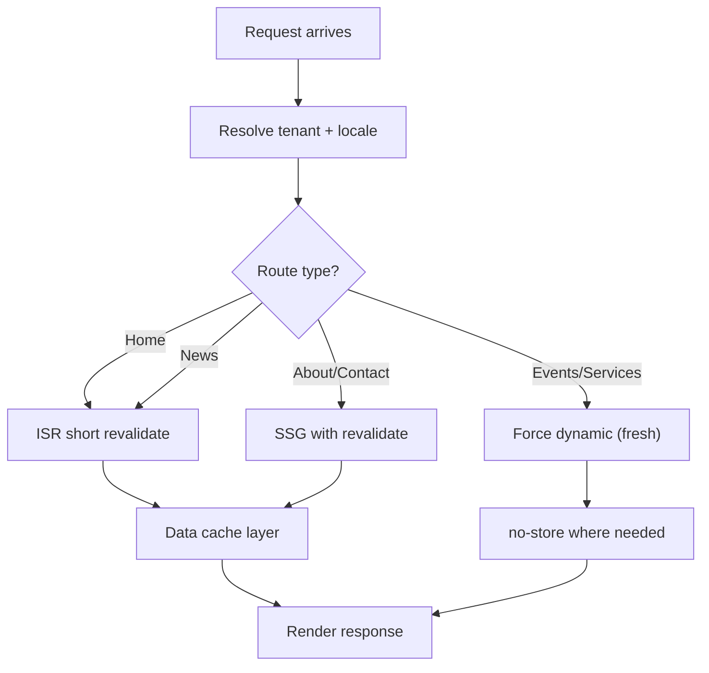
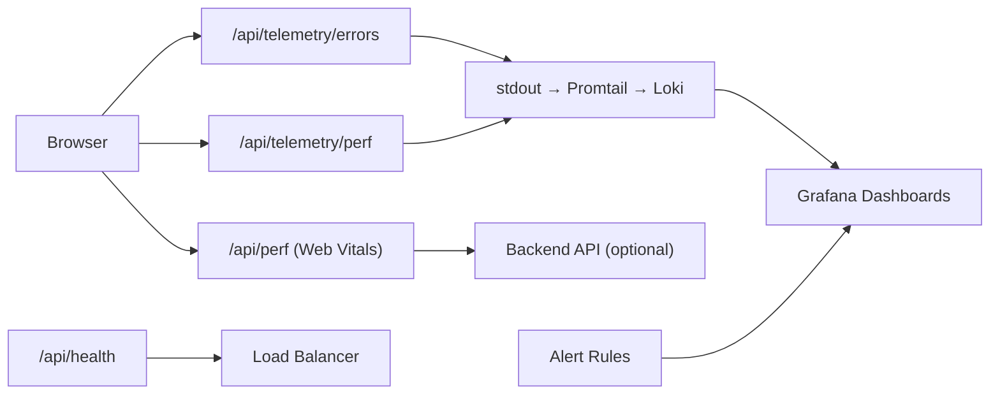
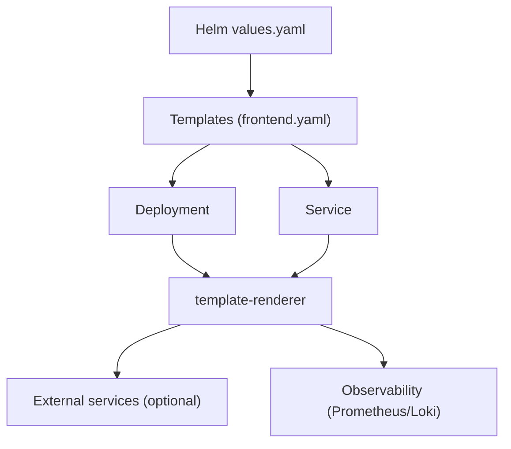

# Deployment & Configuration

<cite>
**Referenced Files in This Document**
- [package.json](file://frontend/apps/template-renderer/package.json)
- [next.config.js](file://frontend/apps/template-renderer/next.config.js)
- [RENDERING.md](file://frontend/apps/template-renderer/RENDERING.md)
- [PERFORMANCE.md](file://frontend/apps/template-renderer/PERFORMANCE.md)
- [OBSERVABILITY.md](file://frontend/apps/template-renderer/OBSERVABILITY.md)
- [deploy.sh](file://frontend/apps/template-renderer/scripts/deploy.sh)
- [rollback.sh](file://frontend/apps/template-renderer/scripts/rollback.sh)
- [values.yaml](file://infra/helm/jol-hub/values.yaml)
- [Chart.yaml](file://infra/helm/jol-hub/Chart.yaml)
- [frontend.yaml](file://infra/helm/jol-hub/templates/frontend.yaml)
- [Dockerfile](file://backend/Dockerfile)
- [docker-compose.yml](file://docker-compose.yml)
</cite>

## Table of Contents
1. Introduction
2. Project Structure
3. Core Components
4. Architecture Overview
5. Detailed Component Analysis
6. Dependency Analysis
7. Performance Considerations
8. Troubleshooting Guide
9. Conclusion
10. Appendices

## Introduction
This document provides deployment and configuration guidance for the template renderer application, a single Next.js app that renders multi-tenant pages. It covers:
- Docker containerization (backend image used as reference; frontend uses standalone output)
- Kubernetes deployment via Helm charts
- Environment configuration and secrets handling
- Standalone Next.js build process and PM2-based process management on Proxmox
- Monitoring setup with health checks, structured logs, and alerting
- Scaling strategies and performance tuning
- Security headers and integration points
- Troubleshooting and rollback procedures

## Project Structure
The template renderer is located under the frontend workspace and configured to produce a self-contained production artifact suitable for deployment without a full Node source tree. The Helm chart defines services for frontend, backend, admin dashboard, Celery workers, and supporting infrastructure.



**Diagram sources**
- [frontend.yaml:1-75](file://infra/helm/jol-hub/templates/frontend.yaml#L1-L75)
- [values.yaml:184-249](file://infra/helm/jol-hub/values.yaml#L184-L249)
- [next.config.js:48-74](file://frontend/apps/template-renderer/next.config.js#L48-L74)

**Section sources**
- [package.json:6-21](file://frontend/apps/template-renderer/package.json#L6-L21)
- [next.config.js:1-27](file://frontend/apps/template-renderer/next.config.js#L1-L27)
- [values.yaml:56-83](file://infra/helm/jol-hub/values.yaml#L56-L83)
- [Chart.yaml:1-19](file://infra/helm/jol-hub/Chart.yaml#L1-L19)

## Core Components
- Template renderer (Next.js): Produces a standalone server for efficient deployment on Proxmox or inside containers. Health and telemetry endpoints are exposed for probes and observability.
- Helm chart: Defines deployments, services, autoscaling, security contexts, ingress, and monitoring integrations.
- Backend reference image: Demonstrates multi-stage Docker build, non-root execution, and health check wiring.

Key responsibilities:
- Build and serve static assets efficiently with immutable caching
- Provide robust health checks for orchestration and load balancers
- Expose structured logging and metrics for observability
- Support safe rollouts and rollbacks with atomic switches

**Section sources**
- [next.config.js:1-27](file://frontend/apps/template-renderer/next.config.js#L1-L27)
- [next.config.js:48-74](file://frontend/apps/template-renderer/next.config.js#L48-L74)
- [frontend.yaml:25-55](file://infra/helm/jol-hub/templates/frontend.yaml#L25-L55)
- [Dockerfile:30-71](file://backend/Dockerfile#L30-L71)

## Architecture Overview
The template renderer runs as a stateless service behind an ingress. Health checks drive readiness/liveness probes. Observability data flows to Prometheus/Grafana/Loki. Autoscaling adjusts replicas based on CPU/memory targets.



**Diagram sources**
- [frontend.yaml:33-55](file://infra/helm/jol-hub/templates/frontend.yaml#L33-L55)
- [values.yaml:242-249](file://infra/helm/jol-hub/values.yaml#L242-L249)
- [OBSERVABILITY.md:9-18](file://frontend/apps/template-renderer/OBSERVABILITY.md#L9-L18)

## Detailed Component Analysis

### Standalone Next.js Build and Serve
- Output mode is set to standalone so the build produces a minimal server plus required dependencies, ideal for PM2 or containerized runtimes.
- Static assets are fingerprinted and served with long-lived cache headers; images use modern formats and responsive sizing.
- Headers enforce secure caching for static assets, images, sitemap, and robots.



**Diagram sources**
- [next.config.js:1-27](file://frontend/apps/template-renderer/next.config.js#L1-L27)
- [next.config.js:29-74](file://frontend/apps/template-renderer/next.config.js#L29-L74)
- [package.json:6-21](file://frontend/apps/template-renderer/package.json#L6-L21)

**Section sources**
- [next.config.js:1-27](file://frontend/apps/template-renderer/next.config.js#L1-L27)
- [next.config.js:29-74](file://frontend/apps/template-renderer/next.config.js#L29-L74)
- [package.json:6-21](file://frontend/apps/template-renderer/package.json#L6-L21)

### PM2 Process Management on Proxmox
- Release directory layout: timestamped releases under a releases folder; current symlink points to the active release.
- Deploy script enforces snapshot confirmation, builds and tests, stages artifacts, performs an atomic symlink switch, restarts the service via PM2, then verifies health and smoke test.
- Rollback script restores a previous release, restarts via PM2, verifies health, and posts an alert webhook.



**Diagram sources**
- [deploy.sh:48-171](file://frontend/apps/template-renderer/scripts/deploy.sh#L48-L171)
- [rollback.sh:14-83](file://frontend/apps/template-renderer/scripts/rollback.sh#L14-L83)

**Section sources**
- [deploy.sh:48-171](file://frontend/apps/template-renderer/scripts/deploy.sh#L48-L171)
- [rollback.sh:14-83](file://frontend/apps/template-renderer/scripts/rollback.sh#L14-L83)

### Kubernetes Deployment with Helm
- Frontend deployment exposes port 3000, sets environment variables from values, and probes /api/health for readiness and liveness.
- Autoscaling is enabled with CPU target utilization; resources are defined for requests and limits.
- Ingress enables TLS and nginx annotations for SSL redirect and body size.

```mermaid
classDiagram
class FrontendDeployment {
+replicas
+image
+ports[http : 3000]
+env[]
+readinessProbe(/api/health)
+livenessProbe(/api/health)
+resources{requests,limits}
}
class Service {
+type ClusterIP
+port 3000
}
class Values {
+frontend.enabled
+frontend.replicaCount
+frontend.image.repository/tag/pullPolicy
+frontend.resources
+frontend.autoscaling
+ingress.className/tls/annotations
}
FrontendDeployment --> Service : "exposed by"
FrontendDeployment --> Values : "configured by"
```

**Diagram sources**
- [frontend.yaml:1-75](file://infra/helm/jol-hub/templates/frontend.yaml#L1-L75)
- [values.yaml:56-83](file://infra/helm/jol-hub/values.yaml#L56-L83)
- [values.yaml:184-196](file://infra/helm/jol-hub/values.yaml#L184-L196)

**Section sources**
- [frontend.yaml:1-75](file://infra/helm/jol-hub/templates/frontend.yaml#L1-L75)
- [values.yaml:56-83](file://infra/helm/jol-hub/values.yaml#L56-L83)
- [values.yaml:184-196](file://infra/helm/jol-hub/values.yaml#L184-L196)

### Docker Containerization Reference
- Multi-stage build separates builder and production layers.
- Non-root user, minimal runtime dependencies, and health check command are configured.
- Default command starts the web server on port 8000 (for backend); the template renderer uses standalone output and can be started similarly within a container.



**Diagram sources**
- [Dockerfile:7-71](file://backend/Dockerfile#L7-L71)

**Section sources**
- [Dockerfile:7-71](file://backend/Dockerfile#L7-L71)

### Rendering Strategy and Data Flow
- Pages use SSR/ISR/SSG depending on freshness needs; data fetches honor revalidate windows at the data layer even when HTML is dynamic due to request-scoped locale resolution.
- Collections resolve to empty in pilot mode until backend is available; routes return appropriate empty states or 404s.



**Diagram sources**
- [RENDERING.md:6-31](file://frontend/apps/template-renderer/RENDERING.md#L6-L31)
- [RENDERING.md:33-48](file://frontend/apps/template-renderer/RENDERING.md#L33-L48)

**Section sources**
- [RENDERING.md:6-31](file://frontend/apps/template-renderer/RENDERING.md#L6-L31)
- [RENDERING.md:33-48](file://frontend/apps/template-renderer/RENDERING.md#L33-L48)

### Monitoring and Observability
- Health endpoint returns status, version, timestamp, and dependency health; critical dependency failures return 503.
- Structured JSON logs stream to stdout for collection by Promtail into Loki.
- Telemetry endpoints accept error reports and performance batches; client-side RUM collects Web Vitals after consent.
- Alert rules define thresholds for error rates, 5xx spikes, auth outages, conversion drops, booking failures, and performance regressions.



**Diagram sources**
- [OBSERVABILITY.md:9-18](file://frontend/apps/template-renderer/OBSERVABILITY.md#L9-L18)
- [OBSERVABILITY.md:62-79](file://frontend/apps/template-renderer/OBSERVABILITY.md#L62-L79)

**Section sources**
- [OBSERVABILITY.md:9-18](file://frontend/apps/template-renderer/OBSERVABILITY.md#L9-L18)
- [OBSERVABILITY.md:62-79](file://frontend/apps/template-renderer/OBSERVABILITY.md#L62-L79)

## Dependency Analysis
- The template renderer depends on:
  - Kubernetes cluster with Helm-managed services
  - Ingress controller for TLS termination and routing
  - Optional backend API for content and telemetry forwarding
  - Observability stack (Prometheus, Grafana, Loki)
- Helm values control replica counts, autoscaling, resource requests/limits, and ingress behavior.



**Diagram sources**
- [values.yaml:56-83](file://infra/helm/jol-hub/values.yaml#L56-L83)
- [frontend.yaml:1-75](file://infra/helm/jol-hub/templates/frontend.yaml#L1-L75)

**Section sources**
- [values.yaml:56-83](file://infra/helm/jol-hub/values.yaml#L56-L83)
- [frontend.yaml:1-75](file://infra/helm/jol-hub/templates/frontend.yaml#L1-L75)

## Performance Considerations
- Standalone output reduces runtime footprint; gzip compression is enabled at the Next layer as a fallback while reverse proxy handles brotli/gzip.
- Image optimization uses AVIF/WebP with responsive sizes and long cache TTLs.
- Per-route rendering strategy balances freshness and performance; data-layer caching honors revalidate windows.
- Budget enforcement ensures initial JS/CSS remain small; bundle analysis helps identify regressions.
- Autoscaling targets CPU utilization; ensure resource requests/limits align with workload characteristics.

**Section sources**
- [next.config.js:23-74](file://frontend/apps/template-renderer/next.config.js#L23-L74)
- [PERFORMANCE.md:20-63](file://frontend/apps/template-renderer/PERFORMANCE.md#L20-L63)
- [PERFORMANCE.md:118-141](file://frontend/apps/template-renderer/PERFORMANCE.md#L118-L141)
- [values.yaml:74-83](file://infra/helm/jol-hub/values.yaml#L74-L83)

## Troubleshooting Guide
Common issues and resolutions:
- Health check fails after deploy:
  - Verify /api/health responds 200; check logs for startup errors; confirm environment variables are loaded.
  - If unhealthy, trigger rollback to restore previous release.
- Smoke test fails (no title in home page):
  - Indicates rendering issue; review recent changes and revert if necessary.
- Autoscaling not triggering:
  - Confirm metrics endpoint exposure and scrape targets; verify CPU/memory thresholds in values.
- High latency or timeouts:
  - Check reverse proxy settings (timeouts, keep-alive), image sizes, and rendering strategy for heavy routes.
- Observability gaps:
  - Ensure telemetry endpoints are reachable; validate log shipping pipeline; confirm alert rules are applied.

Rollback procedure:
- Use the rollback script to restore a previous release, restart the service, verify health, and post an alert webhook.
- If health remains failing after rollback, restore the VM snapshot taken before deploy.

**Section sources**
- [deploy.sh:132-171](file://frontend/apps/template-renderer/scripts/deploy.sh#L132-L171)
- [rollback.sh:51-83](file://frontend/apps/template-renderer/scripts/rollback.sh#L51-L83)
- [OBSERVABILITY.md:62-79](file://frontend/apps/template-renderer/OBSERVABILITY.md#L62-L79)

## Conclusion
The template renderer is designed for efficient, safe deployments across PM2 on Proxmox and Kubernetes via Helm. Its standalone build, robust health checks, structured observability, and automated rollback workflow provide a reliable foundation for multi-tenant rendering at scale. Follow the performance budgets, configure autoscaling appropriately, and maintain strict change control with snapshots and verification gates.

## Appendices

### Environment Configuration Options
- Frontend environment variables:
  - NEXT_PUBLIC_API_URL: Base URL for backend API calls
  - Additional variables can be injected via Helm values env list
- Ingress configuration:
  - TLS enabled with cert-manager and nginx annotations for SSL redirect and body size limits
- Monitoring:
  - ServiceMonitor path and interval configurable; metrics endpoint exposed for scraping

**Section sources**
- [values.yaml:80-83](file://infra/helm/jol-hub/values.yaml#L80-L83)
- [values.yaml:184-196](file://infra/helm/jol-hub/values.yaml#L184-L196)
- [values.yaml:242-249](file://infra/helm/jol-hub/values.yaml#L242-L249)

### Security Headers and Caching
- Static assets: immutable cache with long TTL
- Images: long cache with stale-while-revalidate
- Sitemap and robots: short cache with SWR
- poweredByHeader disabled to reduce tech disclosure

**Section sources**
- [next.config.js:48-74](file://frontend/apps/template-renderer/next.config.js#L48-L74)

### Local Development with Docker Compose
- Services include PostgreSQL, Redis, MongoDB, backend, Celery worker, and Celery beat
- Environment variables demonstrate database URLs, secret keys, and MongoDB settings
- Health checks ensure dependencies are ready before starting dependent services

**Section sources**
- [docker-compose.yml:15-148](file://docker-compose.yml#L15-L148)