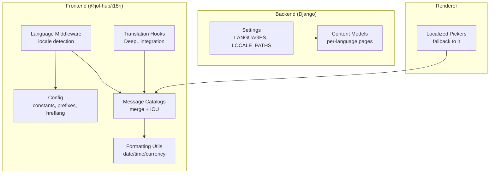
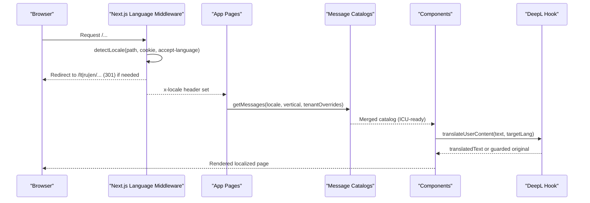
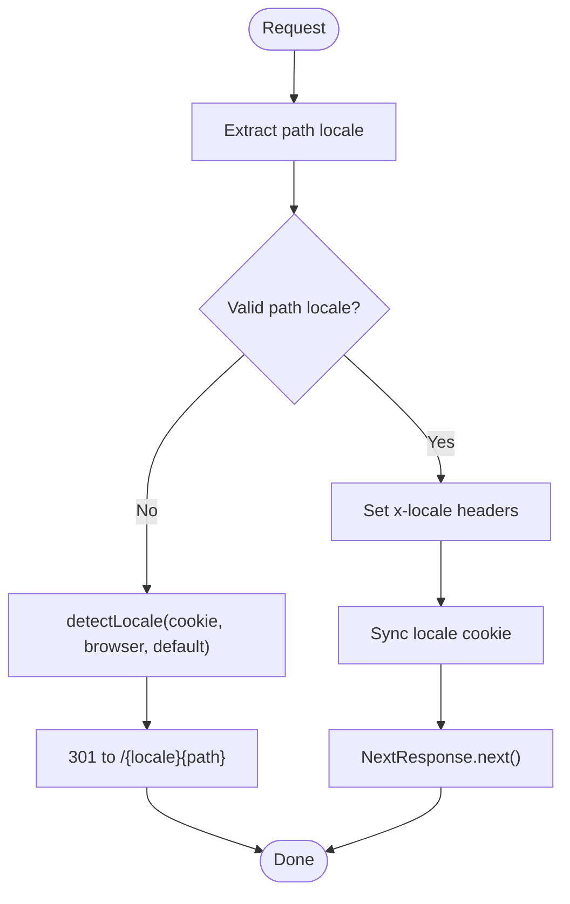
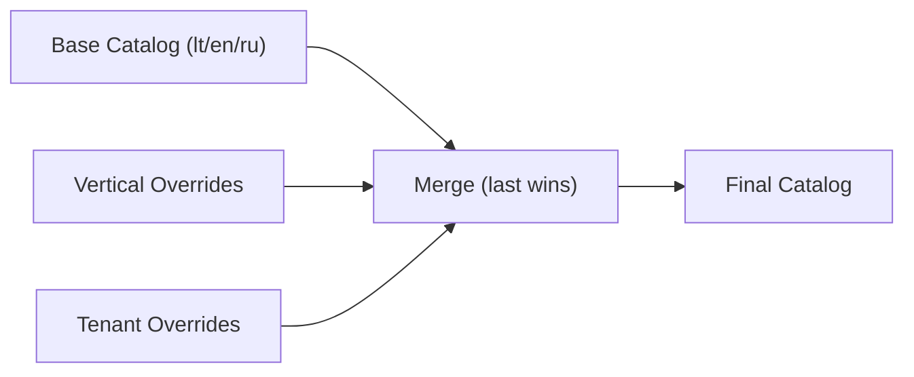
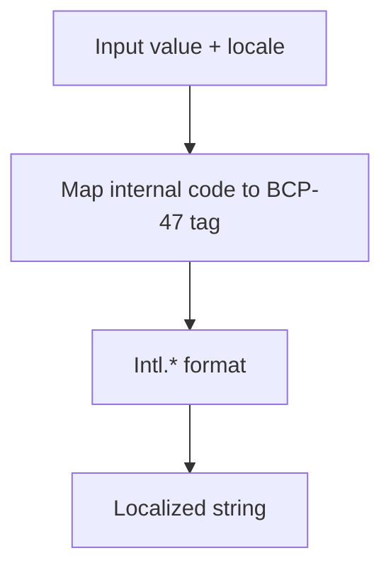
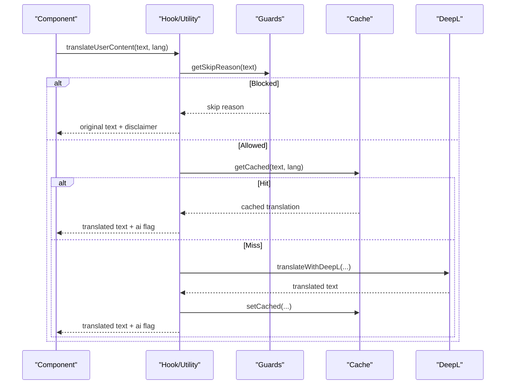
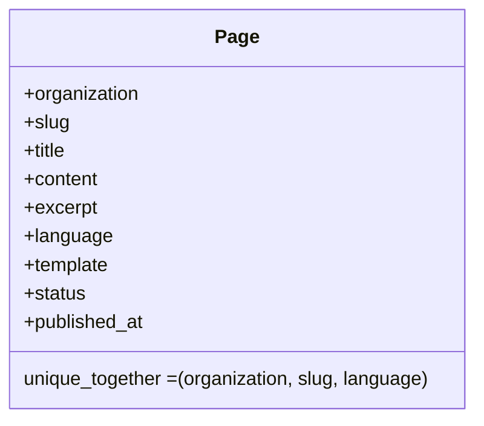
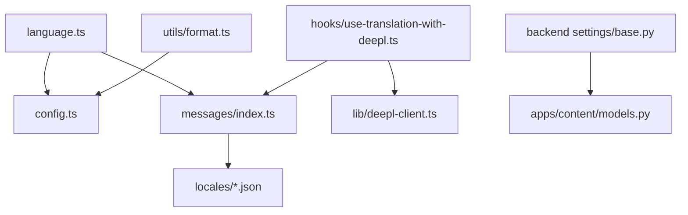

# Internationalization & Localization

<cite>
**Referenced Files in This Document**
- [README.md](file://frontend/packages/i18n/README.md)
- [config.ts](file://frontend/packages/i18n/src/config.ts)
- [language.ts](file://frontend/packages/i18n/src/middleware/language.ts)
- [format.ts](file://frontend/packages/i18n/src/utils/format.ts)
- [index.ts](file://frontend/packages/i18n/src/index.ts)
- [i18next.ts](file://frontend/packages/i18n/src/i18next.ts)
- [messages/index.ts](file://frontend/packages/i18n/src/messages/index.ts)
- [use-translation-with-deepl.ts](file://frontend/packages/i18n/src/hooks/use-translation-with-deepl.ts)
- [common.json](file://frontend/packages/i18n/src/locales/en/common.json)
- [base.py](file://backend/django/core/settings/base.py)
- [models.py](file://backend/django/apps/content/models.py)
- [i18n-helpers.ts](file://frontend/apps/template-renderer/src/lib/i18n-helpers.ts)
</cite>

## Table of Contents
1. Introduction
2. Project Structure
3. Core Components
4. Architecture Overview
5. Detailed Component Analysis
6. Dependency Analysis
7. Performance Considerations
8. Troubleshooting Guide
9. Conclusion
10. Appendices

## Introduction
This document explains the internationalization (i18n) and localization (l10n) system that supports multiple languages across tenant websites. It covers locale detection, content translation management, date/time formatting, currency handling, right-to-left (RTL) readiness, and the end-to-end pipeline from content ingestion to rendered output. It also documents fallback mechanisms, translation workflows (including AI-assisted translation with safeguards), and performance strategies for large catalogs and localized content.

The system is designed so that adding a new language is primarily a data change: add message files and update configuration arrays without changing routing or components. The frontend uses Next.js middleware for locale resolution and rendering, while the backend provides Django i18n infrastructure and per-language content storage.

## Project Structure
At a high level:
- Frontend package @jol-hub/i18n centralizes locale detection, message catalogs, formatting utilities, and translation hooks.
- Backend Django settings enable i18n and define supported languages; content models store per-language pages.
- Template renderer helpers pick the best available translation for fixtures.

**Diagram sources**
- [language.ts:28-166](file://frontend/packages/i18n/src/middleware/language.ts#L28-L166)
- [config.ts:22-62](file://frontend/packages/i18n/src/config.ts#L22-L62)
- [messages/index.ts:26-119](file://frontend/packages/i18n/src/messages/index.ts#L26-L119)
- [format.ts:6-73](file://frontend/packages/i18n/src/utils/format.ts#L6-L73)
- [base.py:212-251](file://backend/django/core/settings/base.py#L212-L251)
- [models.py:41-68](file://backend/django/apps/content/models.py#L41-L68)
- [i18n-helpers.ts:16-19](file://frontend/apps/template-renderer/src/lib/i18n-helpers.ts#L16-L19)

**Section sources**
- [README.md:1-40](file://frontend/packages/i18n/README.md#L1-L40)
- [language.ts:28-166](file://frontend/packages/i18n/src/middleware/language.ts#L28-L166)
- [config.ts:22-62](file://frontend/packages/i18n/src/config.ts#L22-L62)
- [base.py:212-251](file://backend/django/core/settings/base.py#L212-L251)

## Core Components
- Locale detection and routing: Edge-compatible middleware resolves locale from URL path, cookie, Accept-Language header, and defaults. It sets response headers and cookies and redirects unprefixed paths to canonical prefixed URLs.
- Message catalogs: A merge pipeline combines base locale messages with vertical overrides and optional tenant overrides, using ICU interpolation via intl-messageformat.
- Formatting utilities: Date, time, number, currency, and relative time formatting use Intl APIs with locale-specific tags.
- Translation workflow: A hook and standalone utility translate user-generated content through DeepL with liturgical and clergy-approval guards, plus caching.
- Backend i18n: Django i18n enabled with LANGUAGES and LOCALE_PATHS; content models store per-language pages with unique constraints on organization/slug/language.

**Section sources**
- [language.ts:55-166](file://frontend/packages/i18n/src/middleware/language.ts#L55-L166)
- [messages/index.ts:26-119](file://frontend/packages/i18n/src/messages/index.ts#L26-L119)
- [format.ts:6-73](file://frontend/packages/i18n/src/utils/format.ts#L6-L73)
- [use-translation-with-deepl.ts:194-221](file://frontend/packages/i18n/src/hooks/use-translation-with-deepl.ts#L194-L221)
- [base.py:212-251](file://backend/django/core/settings/base.py#L212-L251)
- [models.py:41-68](file://backend/django/apps/content/models.py#L41-L68)

## Architecture Overview
The localization pipeline spans request entry, middleware resolution, catalog merging, rendering, and optional AI translation.

**Diagram sources**
- [language.ts:113-166](file://frontend/packages/i18n/src/middleware/language.ts#L113-L166)
- [messages/index.ts:107-119](file://frontend/packages/i18n/src/messages/index.ts#L107-L119)
- [use-translation-with-deepl.ts:194-221](file://frontend/packages/i18n/src/hooks/use-translation-with-deepl.ts#L194-L221)

## Detailed Component Analysis

### Locale Detection and Routing
- Priority: URL path prefix → cookie → browser Accept-Language → default.
- Behavior: Unprefixed paths redirect to the detected locale; prefixed paths pass through with locale headers and cookie sync.
- Excluded paths: Static assets, API routes, and other non-content paths bypass i18n routing.
- RTL readiness: Infrastructure exists to mark locales as RTL; currently all supported locales are LTR.

**Diagram sources**
- [language.ts:55-166](file://frontend/packages/i18n/src/middleware/language.ts#L55-L166)
- [language.ts:188-249](file://frontend/packages/i18n/src/middleware/language.ts#L188-L249)

**Section sources**
- [language.ts:55-166](file://frontend/packages/i18n/src/middleware/language.ts#L55-L166)
- [language.ts:188-249](file://frontend/packages/i18n/src/middleware/language.ts#L188-L249)

### Message Catalogs and Merge Pipeline
- Base catalogs per locale include common, liturgical, and GDPR namespaces.
- Vertical overrides (church, funeral, cleaning) can augment base messages.
- Tenant overrides can be merged at runtime.
- ICU interpolation is supported via intl-messageformat; server-safe plain lookup returns fallback when keys are missing.

**Diagram sources**
- [messages/index.ts:26-119](file://frontend/packages/i18n/src/messages/index.ts#L26-L119)

**Section sources**
- [messages/index.ts:26-119](file://frontend/packages/i18n/src/messages/index.ts#L26-L119)

### Date, Time, Number, Currency Formatting
- Uses Intl.DateTimeFormat and Intl.NumberFormat with locale strings mapped from internal codes to BCP-47 tags.
- Supports relative time formatting and consistent direction reporting (currently LTR).

**Diagram sources**
- [format.ts:6-73](file://frontend/packages/i18n/src/utils/format.ts#L6-L73)
- [format.ts:97-108](file://frontend/packages/i18n/src/utils/format.ts#L97-L108)

**Section sources**
- [format.ts:6-73](file://frontend/packages/i18n/src/utils/format.ts#L6-L73)

### Translation Workflow (AI-Assisted with Safeguards)
- Guards prevent sending sacred or clergy-sensitive content to machine translation.
- Two-layer cache: in-process Map (server/Edge) and localStorage (client) with 24-hour TTL.
- Returns flags indicating whether text was AI-translated and human-readable disclaimers for blocked cases.

**Diagram sources**
- [use-translation-with-deepl.ts:194-221](file://frontend/packages/i18n/src/hooks/use-translation-with-deepl.ts#L194-L221)
- [use-translation-with-deepl.ts:323-374](file://frontend/packages/i18n/src/hooks/use-translation-with-deepl.ts#L323-L374)

**Section sources**
- [use-translation-with-deepl.ts:194-221](file://frontend/packages/i18n/src/hooks/use-translation-with-deepl.ts#L194-L221)
- [use-translation-with-deepl.ts:323-374](file://frontend/packages/i18n/src/hooks/use-translation-with-deepl.ts#L323-L374)

### Backend Content Storage and Django i18n
- Django i18n enabled with LANGUAGES list and LOCALE_PATHS configured.
- Content Page model stores per-language entries with unique constraints on organization, slug, and language.
- Template renderer picks the best available translation for fixtures, falling back to Lithuanian to ensure content visibility.

**Diagram sources**
- [models.py:41-68](file://backend/django/apps/content/models.py#L41-L68)

**Section sources**
- [base.py:212-251](file://backend/django/core/settings/base.py#L212-L251)
- [models.py:41-68](file://backend/django/apps/content/models.py#L41-L68)
- [i18n-helpers.ts:16-19](file://frontend/apps/template-renderer/src/lib/i18n-helpers.ts#L16-L19)

## Dependency Analysis
- Middleware depends on config constants for supported locales, default locale, and path helpers.
- Message catalogs depend on locale JSON files and vertical overrides; they are merged at runtime.
- Formatting utils depend on Intl APIs and locale mapping.
- Translation hook depends on DeepL client and caches; it integrates with i18next for base t() function.
- Backend relies on Django i18n settings and per-language content models.

**Diagram sources**
- [language.ts:28-166](file://frontend/packages/i18n/src/middleware/language.ts#L28-L166)
- [config.ts:22-62](file://frontend/packages/i18n/src/config.ts#L22-L62)
- [messages/index.ts:26-119](file://frontend/packages/i18n/src/messages/index.ts#L26-L119)
- [format.ts:6-73](file://frontend/packages/i18n/src/utils/format.ts#L6-L73)
- [use-translation-with-deepl.ts:194-221](file://frontend/packages/i18n/src/hooks/use-translation-with-deepl.ts#L194-L221)
- [base.py:212-251](file://backend/django/core/settings/base.py#L212-L251)
- [models.py:41-68](file://backend/django/apps/content/models.py#L41-L68)

**Section sources**
- [index.ts:117-152](file://frontend/packages/i18n/src/index.ts#L117-L152)
- [i18next.ts:30-82](file://frontend/packages/i18n/src/i18next.ts#L30-L82)

## Performance Considerations
- Catalog merging: Use the provided merge pipeline to combine base, vertical, and tenant catalogs once per locale and reuse results. Avoid recomputing per render.
- Translation caching: Leverage the two-layer cache (in-memory Map and localStorage) with 24-hour TTL to minimize DeepL calls.
- Middleware efficiency: Skip static and API paths to reduce processing overhead.
- Backend caching: Redis-backed cache with compression and connection pooling is configured; apply appropriate timeouts for localized queries.
- Large translation files: Prefer splitting by namespace (common, liturgical, gdpr) and loading only what is needed; avoid bundling unused locales.

[No sources needed since this section provides general guidance]

## Troubleshooting Guide
- Locale not applied: Ensure the path has a valid locale prefix or that the cookie is set; check middleware matcher excludes and that requests are not hitting excluded paths.
- Missing translations: Verify the key exists in the merged catalog; use the server-safe translate helper which falls back to the key or provided fallback.
- AI translation blocked: If content matches liturgical or clergy-approval patterns, translation is intentionally skipped; display the corresponding disclaimer.
- Formatting issues: Confirm the locale mapping includes the target locale; verify input dates are valid before formatting.

**Section sources**
- [language.ts:188-249](file://frontend/packages/i18n/src/middleware/language.ts#L188-L249)
- [messages/index.ts:121-129](file://frontend/packages/i18n/src/messages/index.ts#L121-L129)
- [use-translation-with-deepl.ts:194-221](file://frontend/packages/i18n/src/hooks/use-translation-with-deepl.ts#L194-L221)
- [format.ts:6-73](file://frontend/packages/i18n/src/utils/format.ts#L6-L73)

## Conclusion
The internationalization system provides robust locale detection, scalable message catalogs, reliable formatting, and safe AI-assisted translation with strong safeguards. It is designed for easy extension to additional languages and regions while maintaining performance through caching and efficient middleware. Backend support ensures per-language content isolation and Django i18n readiness.

[No sources needed since this section summarizes without analyzing specific files]

## Appendices

### Adding a New Language
- Add message files under locales/<code>/ and update message catalogs to include the new locale.
- Update supported locales and defaults in configuration and middleware constants.
- Ensure hreflang mappings and HTML lang attributes include the new locale.
- For backend, add the language to the LANGUAGES list and ensure LOCALE_PATHS points to translation resources if used.

**Section sources**
- [config.ts:22-62](file://frontend/packages/i18n/src/config.ts#L22-L62)
- [language.ts:28-62](file://frontend/packages/i18n/src/middleware/language.ts#L28-L62)
- [base.py:212-251](file://backend/django/core/settings/base.py#L212-L251)

### Translating Content Blocks
- Use the message catalog merge pipeline to add or override keys for the target locale.
- For vertical-specific blocks, provide overrides in the relevant vertical catalog.
- For tenant-specific overrides, supply tenantOverrides at runtime to customize content per tenant.

**Section sources**
- [messages/index.ts:26-119](file://frontend/packages/i18n/src/messages/index.ts#L26-L119)

### Implementing Locale-Specific Features
- Use formatting utilities for dates, times, numbers, and currencies with the resolved locale.
- Apply RTL direction when supporting RTL locales via locale direction helpers.
- Integrate AI translation for user-generated content using the hook/utility with built-in guards and caching.

**Section sources**
- [format.ts:6-73](file://frontend/packages/i18n/src/utils/format.ts#L6-L73)
- [language.ts:141-166](file://frontend/packages/i18n/src/middleware/language.ts#L141-L166)
- [use-translation-with-deepl.ts:194-221](file://frontend/packages/i18n/src/hooks/use-translation-with-deepl.ts#L194-L221)