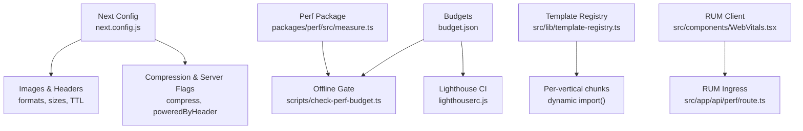
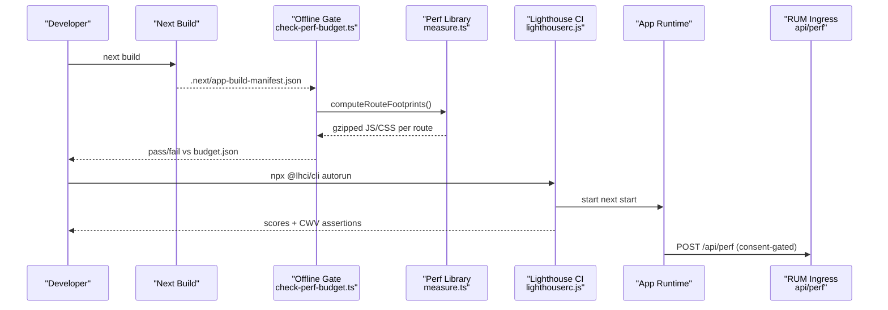
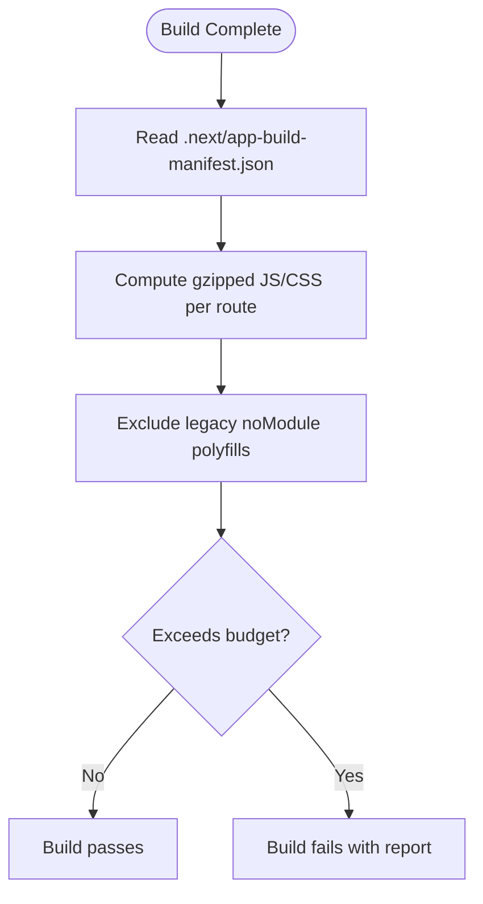
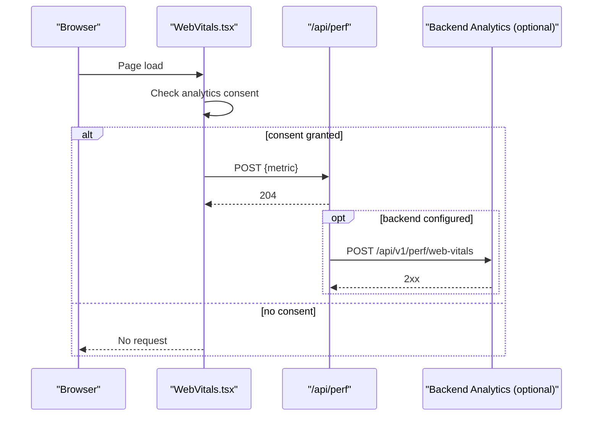
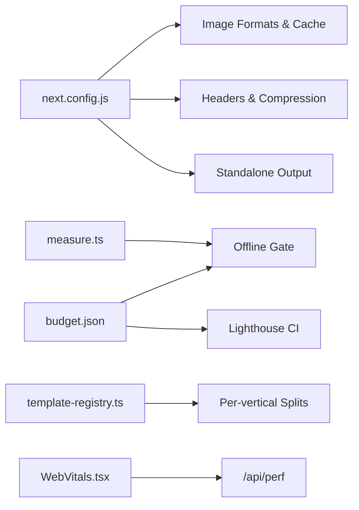

# Performance Optimization

<cite>
**Referenced Files in This Document**
- [PERFORMANCE.md](file://frontend/apps/template-renderer/PERFORMANCE.md)
- [next.config.js](file://frontend/apps/template-renderer/next.config.js)
- [budget.json](file://frontend/apps/template-renderer/budget.json)
- [lighthouserc.js](file://frontend/apps/template-renderer/lighthouserc.js)
- [check-perf-budget.ts](file://frontend/apps/template-renderer/scripts/check-perf-budget.ts)
- [measure.ts](file://frontend/packages/perf/src/measure.ts)
- [template-registry.ts](file://frontend/apps/template-renderer/src/lib/template-registry.ts)
- [WebVitals.tsx](file://frontend/apps/template-renderer/src/components/WebVitals.tsx)
- [route.ts](file://frontend/apps/template-renderer/src/app/api/perf/route.ts)
</cite>

## Table of Contents
1. [Introduction](#introduction)
2. [Project Structure](#project-structure)
3. [Core Components](#core-components)
4. [Architecture Overview](#architecture-overview)
5. [Detailed Component Analysis](#detailed-component-analysis)
6. [Dependency Analysis](#dependency-analysis)
7. [Performance Considerations](#performance-considerations)
8. [Troubleshooting Guide](#troubleshooting-guide)
9. [Conclusion](#conclusion)
10. [Appendices](#appendices)

## Introduction
This document explains the performance optimization strategies implemented in the template renderer application, focusing on static site generation posture, image optimization with AVIF/WebP, bundle analysis and tree-shaking, caching at browser and proxy layers, resource loading optimization, standalone output configuration, compression settings, CDN integration patterns, performance monitoring tools, budget enforcement, and troubleshooting slow-loading pages. It also provides guidelines for optimizing custom templates and content blocks to maximize performance on modest on-prem hardware.

## Project Structure
The template renderer is a Next.js application optimized for rendering many tenant sites from a single build. Performance controls are centralized in configuration files, budgets, CI scripts, and a dedicated performance package. Key elements include:
- Standalone output and transpiled packages for efficient deployment
- Image formats and cache headers for optimal delivery
- Budgets enforced offline (byte budgets) and in CI (Lighthouse timing budgets)
- Template lazy loading per vertical to minimize first-load payload
- Real User Monitoring (RUM) via Web Vitals with consent gating

**Diagram sources**
- [next.config.js:1-86](file://frontend/apps/template-renderer/next.config.js#L1-L86)
- [budget.json:1-26](file://frontend/apps/template-renderer/budget.json#L1-L26)
- [check-perf-budget.ts:1-93](file://frontend/apps/template-renderer/scripts/check-perf-budget.ts#L1-L93)
- [lighthouserc.js:1-75](file://frontend/apps/template-renderer/lighthouserc.js#L1-L75)
- [template-registry.ts:1-109](file://frontend/apps/template-renderer/src/lib/template-registry.ts#L1-L109)
- [WebVitals.tsx:1-59](file://frontend/apps/template-renderer/src/components/WebVitals.tsx#L1-L59)
- [route.ts:1-63](file://frontend/apps/template-renderer/src/app/api/perf/route.ts#L1-L63)
- [measure.ts:1-81](file://frontend/packages/perf/src/measure.ts#L1-L81)

**Section sources**
- [PERFORMANCE.md:1-203](file://frontend/apps/template-renderer/PERFORMANCE.md#L1-L203)
- [next.config.js:1-86](file://frontend/apps/template-renderer/next.config.js#L1-L86)

## Core Components
- Standalone output and server flags: The app builds as a standalone artifact with minimal server dependencies and disables unnecessary response headers to reduce payload size.
- Image optimization: AVIF and WebP formats are enabled with tuned device/image sizes and long immutable caching for hashed URLs.
- Bundle budgets and analysis: A single budget file drives both offline byte-budget enforcement and Lighthouse CI assertions. An optional bundle analyzer can be enabled for deep inspection.
- Template code splitting: Vertical-specific templates are loaded dynamically to ensure only relevant code runs per tenant type.
- Caching strategy: Browser and proxy-level caching headers are set for static assets, images, and SEO endpoints; ISR windows vary by route freshness needs.
- RUM pipeline: Consent-gated Web Vitals collection posts metrics to a same-origin endpoint that optionally forwards to a backend analytics service.

**Section sources**
- [next.config.js:1-86](file://frontend/apps/template-renderer/next.config.js#L1-L86)
- [budget.json:1-26](file://frontend/apps/template-renderer/budget.json#L1-L26)
- [lighthouserc.js:1-75](file://frontend/apps/template-renderer/lighthouserc.js#L1-L75)
- [template-registry.ts:1-109](file://frontend/apps/template-renderer/src/lib/template-registry.ts#L1-L109)
- [WebVitals.tsx:1-59](file://frontend/apps/template-renderer/src/components/WebVitals.tsx#L1-L59)
- [route.ts:1-63](file://frontend/apps/template-renderer/src/app/api/perf/route.ts#L1-L63)

## Architecture Overview
The performance architecture combines build-time and runtime safeguards:
- Build-time: Offline gate measures gzipped first-load payloads per route against JS/CSS budgets using the Next build manifest.
- CI-time: Lighthouse enforces score floors and CWV numeric limits across representative tenant routes.
- Runtime: Templates are split per vertical; images are served in modern formats with strong caching; RUM collects field data after consent.

**Diagram sources**
- [check-perf-budget.ts:1-93](file://frontend/apps/template-renderer/scripts/check-perf-budget.ts#L1-L93)
- [measure.ts:1-81](file://frontend/packages/perf/src/measure.ts#L1-L81)
- [lighthouserc.js:1-75](file://frontend/apps/template-renderer/lighthouserc.js#L1-L75)
- [route.ts:1-63](file://frontend/apps/template-renderer/src/app/api/perf/route.ts#L1-L63)

## Detailed Component Analysis

### Static Site Generation and Standalone Output
- The application uses a standalone output mode to ship a minimal server with the production build, reducing deployment footprint and improving cold-start behavior on constrained hardware.
- Transpilation of shared workspace packages ensures compatibility and enables tree-shaking across monorepo packages.

**Section sources**
- [next.config.js:1-86](file://frontend/apps/template-renderer/next.config.js#L1-L86)

### Image Optimization (AVIF/WebP)
- Modern image formats are prioritized to reduce transfer sizes while maintaining compatibility with legacy agents through fallbacks.
- Device and image size presets are tuned for responsive delivery; immutable caching is applied to hashed asset URLs.
- Tenant uploads are optimized at ingest; the renderer never hot-links unoptimized originals. SVGs are optimized at authoring time.

**Section sources**
- [next.config.js:29-37](file://frontend/apps/template-renderer/next.config.js#L29-L37)
- [PERFORMANCE.md:83-95](file://frontend/apps/template-renderer/PERFORMANCE.md#L83-L95)

### Bundle Analysis and Tree-Shaking
- A single budget file defines resource and timing budgets consumed by both offline and CI gates.
- Offline gate reads the Next build manifest, computes gzipped first-load sizes per route, excludes legacy polyfills, and fails the build when budgets are exceeded.
- Optional bundle analyzer can be enabled to inspect client/server composition and identify heavy dependencies.
- Workspace barrel imports are optimized to avoid pulling entire libraries into every route.

**Diagram sources**
- [check-perf-budget.ts:1-93](file://frontend/apps/template-renderer/scripts/check-perf-budget.ts#L1-L93)
- [measure.ts:1-81](file://frontend/packages/perf/src/measure.ts#L1-L81)
- [budget.json:1-26](file://frontend/apps/template-renderer/budget.json#L1-L26)

**Section sources**
- [budget.json:1-26](file://frontend/apps/template-renderer/budget.json#L1-L26)
- [check-perf-budget.ts:1-93](file://frontend/apps/template-renderer/scripts/check-perf-budget.ts#L1-L93)
- [measure.ts:1-81](file://frontend/packages/perf/src/measure.ts#L1-L81)
- [next.config.js:77-83](file://frontend/apps/template-renderer/next.config.js#L77-L83)
- [PERFORMANCE.md:20-73](file://frontend/apps/template-renderer/PERFORMANCE.md#L20-L73)

### Caching Strategies (Browser and Proxy Layers)
- Browser caching: Hashed static assets are marked immutable with long max-age; images use long cache with stale-while-revalidate; SEO endpoints use short cache with SWR.
- Rendering layer: Compression is enabled at the Next layer as a fallback; reverse proxy handles brotli/gzip and HTTP/2/HTTP/3 where supported.
- Backend caching: Redis is used for frequent queries to reduce load during rendering.

**Section sources**
- [next.config.js:48-74](file://frontend/apps/template-renderer/next.config.js#L48-L74)
- [PERFORMANCE.md:118-141](file://frontend/apps/template-renderer/PERFORMANCE.md#L118-L141)

### Resource Loading Optimization
- Template registry uses dynamic imports per vertical family to ensure each tenant loads only its relevant template chunk.
- Route-based code splitting via Next App Router ensures per-route client JS is loaded only when needed.
- System-first font stacks avoid webfont requests in pilot; when vendored later, subset fonts and preload critical weights.

**Section sources**
- [template-registry.ts:1-109](file://frontend/apps/template-renderer/src/lib/template-registry.ts#L1-L109)
- [PERFORMANCE.md:64-108](file://frontend/apps/template-renderer/PERFORMANCE.md#L64-L108)

### Standalone Output Configuration and Compression Settings
- Standalone output produces a self-contained production artifact suitable for containerization or process managers on on-prem servers.
- Compression is enabled at the Next layer as a fallback; powered-by header is disabled to reduce response size and avoid tech disclosure.

**Section sources**
- [next.config.js:1-27](file://frontend/apps/template-renderer/next.config.js#L1-L27)

### CDN Integration Patterns
- While no CDN is used in the pilot, the configuration sets immutable caching for static assets and long-lived caching for images, which aligns with CDN best practices. When a CDN is introduced, these headers enable effective edge caching without revalidation overhead.

**Section sources**
- [next.config.js:48-74](file://frontend/apps/template-renderer/next.config.js#L48-L74)
- [PERFORMANCE.md:118-141](file://frontend/apps/template-renderer/PERFORMANCE.md#L118-L141)

### Performance Monitoring Tools
- Real User Monitoring: A consent-gated component collects Web Vitals and posts them to a same-origin ingress. The ingress validates payloads and optionally forwards to a backend analytics service; in pilot mode it returns success without persisting data.
- Lab testing: Lighthouse CI asserts budgets and CWV thresholds across representative tenant routes.

**Diagram sources**
- [WebVitals.tsx:1-59](file://frontend/apps/template-renderer/src/components/WebVitals.tsx#L1-L59)
- [route.ts:1-63](file://frontend/apps/template-renderer/src/app/api/perf/route.ts#L1-L63)

**Section sources**
- [WebVitals.tsx:1-59](file://frontend/apps/template-renderer/src/components/WebVitals.tsx#L1-L59)
- [route.ts:1-63](file://frontend/apps/template-renderer/src/app/api/perf/route.ts#L1-L63)
- [lighthouserc.js:1-75](file://frontend/apps/template-renderer/lighthouserc.js#L1-L75)

### Budget Enforcement
- Single source of truth: budget.json defines resource sizes, counts, and timing budgets.
- Offline gate: Enforces JS/CSS budgets against real gzipped payloads from the build output, excluding legacy polyfills.
- Lighthouse CI: Asserts score floors and CWV numeric limits across multiple tenant page types.

**Section sources**
- [budget.json:1-26](file://frontend/apps/template-renderer/budget.json#L1-L26)
- [check-perf-budget.ts:1-93](file://frontend/apps/template-renderer/scripts/check-perf-budget.ts#L1-L93)
- [lighthouserc.js:1-75](file://frontend/apps/template-renderer/lighthouserc.js#L1-L75)

### Guidelines for Optimizing Custom Templates and Content Blocks
- Prefer server components for templates, collections, and JSON-LD; keep client components only where interactivity is required.
- Use dynamic imports for heavy features and avoid importing entire libraries for single functions to preserve tree-shaking.
- Avoid render-blocking scripts in head; inline only what is critical (e.g., theme init).
- Ensure images have explicit width/height and use priority sparingly for above-the-fold heroes; rely on next/image for responsive srcset and lazy loading below the fold.
- Keep third-party scripts off the global scope; load them conditionally on relevant pages and honor consent requirements.

**Section sources**
- [PERFORMANCE.md:64-117](file://frontend/apps/template-renderer/PERFORMANCE.md#L64-L117)
- [template-registry.ts:1-109](file://frontend/apps/template-renderer/src/lib/template-registry.ts#L1-L109)

## Dependency Analysis
The performance system depends on:
- Next.js configuration for output mode, image formats, headers, and optional analyzer
- Budget definitions driving both offline and CI enforcement
- Template registry enabling per-vertical code splitting
- RUM client and ingress for field performance data
- Perf library utilities for measuring gzipped sizes and evaluating budgets

**Diagram sources**
- [next.config.js:1-86](file://frontend/apps/template-renderer/next.config.js#L1-L86)
- [budget.json:1-26](file://frontend/apps/template-renderer/budget.json#L1-L26)
- [template-registry.ts:1-109](file://frontend/apps/template-renderer/src/lib/template-registry.ts#L1-L109)
- [WebVitals.tsx:1-59](file://frontend/apps/template-renderer/src/components/WebVitals.tsx#L1-L59)
- [route.ts:1-63](file://frontend/apps/template-renderer/src/app/api/perf/route.ts#L1-L63)
- [measure.ts:1-81](file://frontend/packages/perf/src/measure.ts#L1-L81)

**Section sources**
- [next.config.js:1-86](file://frontend/apps/template-renderer/next.config.js#L1-L86)
- [budget.json:1-26](file://frontend/apps/template-renderer/budget.json#L1-L26)
- [template-registry.ts:1-109](file://frontend/apps/template-renderer/src/lib/template-registry.ts#L1-L109)
- [WebVitals.tsx:1-59](file://frontend/apps/template-renderer/src/components/WebVitals.tsx#L1-L59)
- [route.ts:1-63](file://frontend/apps/template-renderer/src/app/api/perf/route.ts#L1-L63)
- [measure.ts:1-81](file://frontend/packages/perf/src/measure.ts#L1-L81)

## Performance Considerations
- Hardware constraints: Targets are calibrated for modest on-prem hardware without cloud CDN; every byte matters.
- First-load budgets: JS and CSS budgets are strict; exceeding them fails the build to prevent regressions.
- Image strategy: AVIF/WebP with responsive sizing and immutable caching reduces bandwidth and improves LCP.
- Code splitting: Per-vertical templates and route-based splitting minimize initial payload.
- Caching: Strong browser caching for hashed assets and images; short cache with SWR for SEO endpoints; proxy-level compression and HTTP/2/3.
- Monitoring: RUM provides field data post-consent; Lighthouse CI ensures lab metrics meet targets.

[No sources needed since this section provides general guidance]

## Troubleshooting Guide
- Build fails due to budget breach:
  - Inspect the offline gate report to identify the worst route and its JS/CSS sizes.
  - Enable bundle analysis to visualize client/server composition and locate heavy dependencies.
  - Bisect changes to isolate the offending import or component.
- Slow LCP or INP:
  - Verify image formats and sizes; ensure hero images use priority appropriately.
  - Check for render-blocking scripts or large third-party payloads.
  - Confirm caching headers are present for static assets and images.
- RUM not reporting:
  - Ensure analytics consent is granted before metrics are sent.
  - Validate the payload shape and check ingress responses; in pilot mode, 204 indicates acceptance.

**Section sources**
- [check-perf-budget.ts:1-93](file://frontend/apps/template-renderer/scripts/check-perf-budget.ts#L1-L93)
- [next.config.js:77-83](file://frontend/apps/template-renderer/next.config.js#L77-L83)
- [WebVitals.tsx:1-59](file://frontend/apps/template-renderer/src/components/WebVitals.tsx#L1-L59)
- [route.ts:1-63](file://frontend/apps/template-renderer/src/app/api/perf/route.ts#L1-L63)

## Conclusion
The template renderer employs a comprehensive performance strategy tailored to constrained on-prem environments. Budgets are enforced at build and CI time, images are optimized with modern formats and strong caching, templates are split per vertical, and RUM provides field insights with privacy-preserving consent gating. These practices collectively ensure fast first paint, low latency, and stable performance across thousands of tenant sites.

[No sources needed since this section summarizes without analyzing specific files]

## Appendices
- Acceptance criteria and verification steps are documented alongside the performance strategy and can be used to validate deployments and changes.

**Section sources**
- [PERFORMANCE.md:183-203](file://frontend/apps/template-renderer/PERFORMANCE.md#L183-L203)