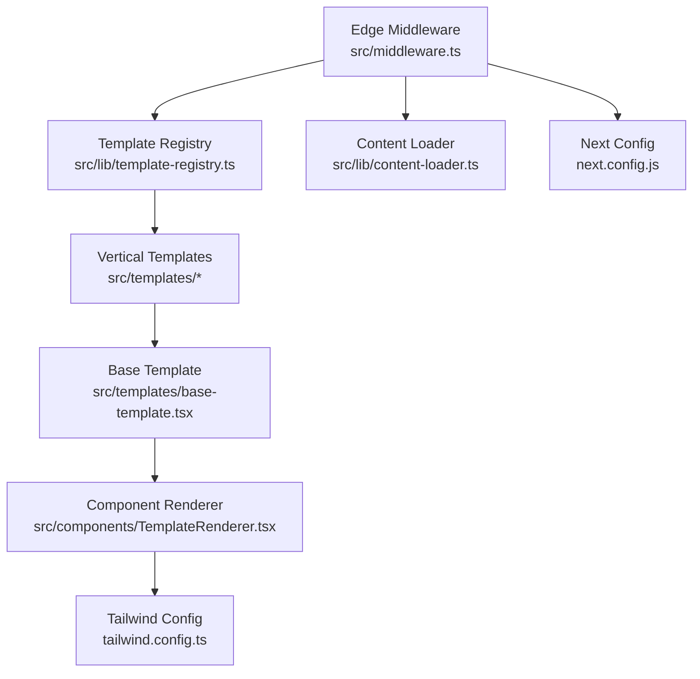
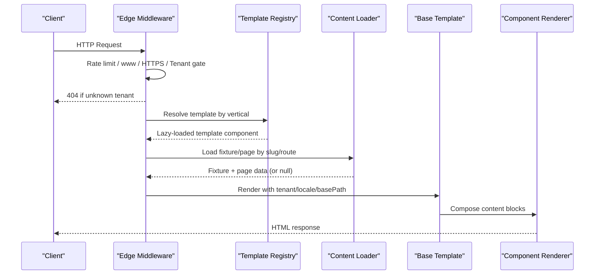
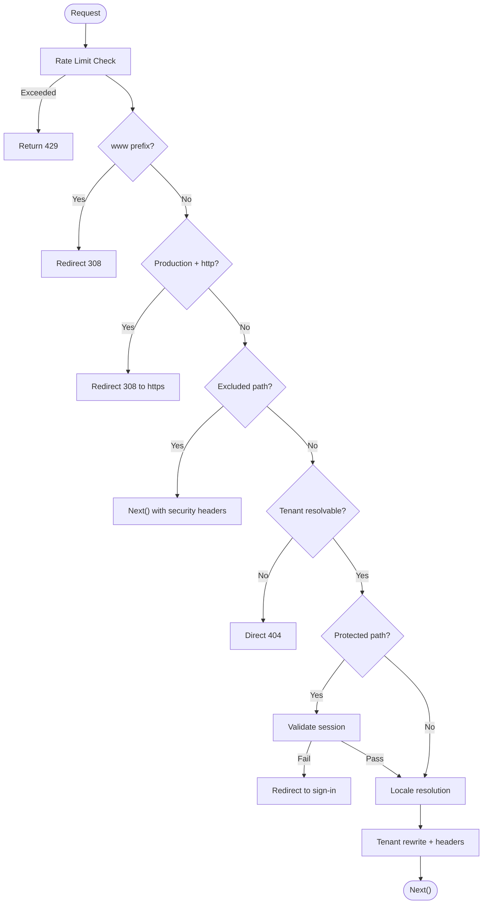
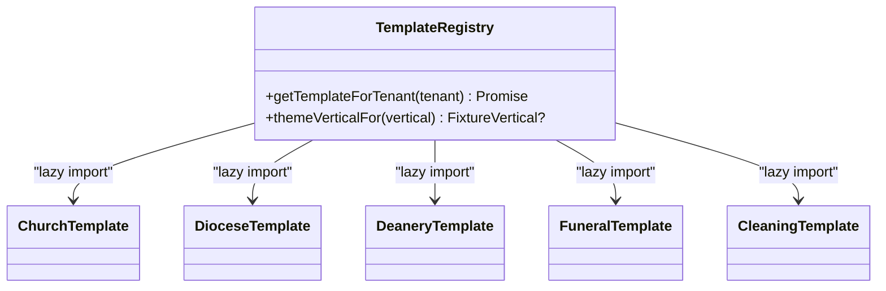
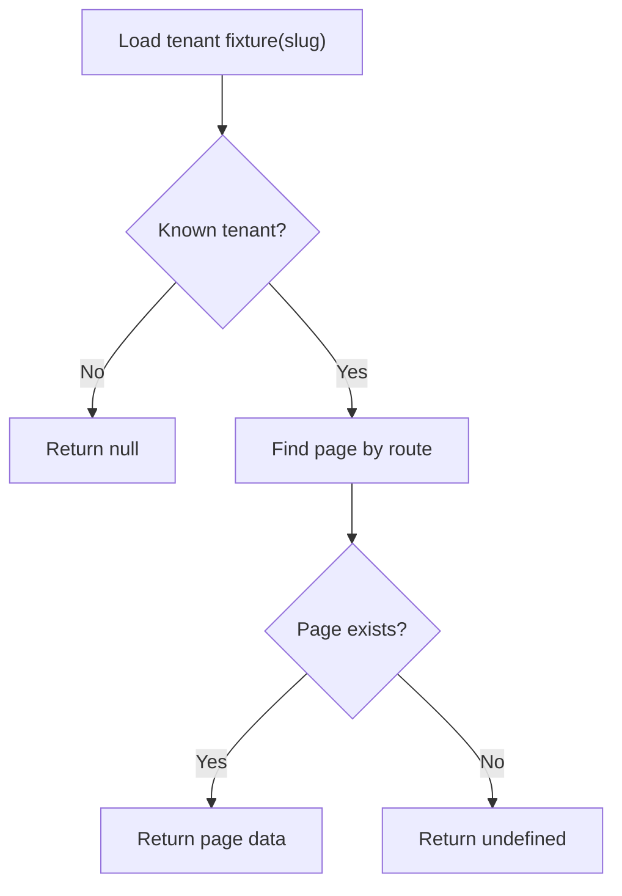
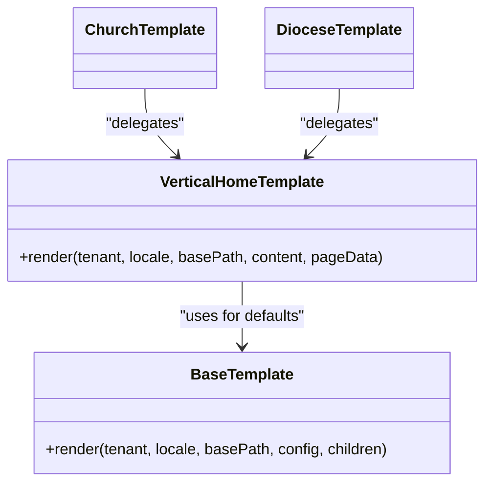
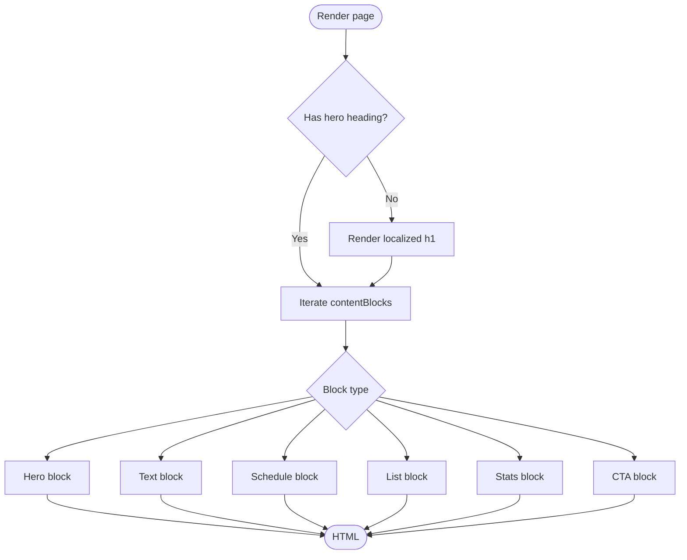
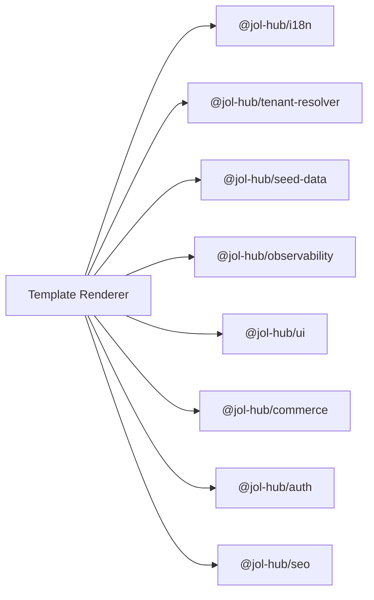

# Template Renderer Application

<cite>
**Referenced Files in This Document**
- [RENDERING.md](file://frontend/apps/template-renderer/RENDERING.md)
- [package.json](file://frontend/apps/template-renderer/package.json)
- [next.config.js](file://frontend/apps/template-renderer/next.config.js)
- [tailwind.config.ts](file://frontend/apps/template-renderer/tailwind.config.ts)
- [middleware.ts](file://frontend/apps/template-renderer/src/middleware.ts)
- [template-registry.ts](file://frontend/apps/template-renderer/src/lib/template-registry.ts)
- [content-loader.ts](file://frontend/apps/template-renderer/src/lib/content-loader.ts)
- [TemplateRenderer.tsx](file://frontend/apps/template-renderer/src/components/TemplateRenderer.tsx)
- [base-template.tsx](file://frontend/apps/template-renderer/src/templates/base-template.tsx)
- [church-template.tsx](file://frontend/apps/template-renderer/src/templates/church-template.tsx)
- [diocese-template.tsx](file://frontend/apps/template-renderer/src/templates/diocese-template.tsx)
</cite>

## Table of Contents
1. [Introduction](#introduction)
2. [Project Structure](#project-structure)
3. [Core Components](#core-components)
4. [Architecture Overview](#architecture-overview)
5. [Detailed Component Analysis](#detailed-component-analysis)
6. [Dependency Analysis](#dependency-analysis)
7. [Performance Considerations](#performance-considerations)
8. [Troubleshooting Guide](#troubleshooting-guide)
9. [Conclusion](#conclusion)
10. [Appendices](#appendices)

## Introduction
This document explains the Template Renderer application, a Next.js-based site generation engine that creates tenant-specific websites for religious institutions such as parishes, cathedrals, dioceses, and related services. It covers the dynamic template rendering system, the template registry architecture, content loading from fixtures and future backend sources, multi-tenant routing, responsive design with Tailwind CSS, internationalization support, and performance strategies including static site generation (SSG), incremental static regeneration (ISR), and server-side rendering (SSR).

The renderer is designed to be data-driven: tenants are identified at runtime by middleware, templates are selected via a registry based on vertical taxonomy, and page content is composed from either seed fixtures or a backend content service when available. SEO, accessibility, and security are integrated throughout the request pipeline.

## Project Structure
The Template Renderer lives under frontend/apps/template-renderer and is built on Next.js App Router. Key areas include:
- Edge middleware for tenant resolution, locale negotiation, rate limiting, and security headers
- A template registry that maps verticals to lazy-loaded template components
- Content loaders that resolve tenant fixtures and pages
- Vertical templates (church, diocese, deanery, funeral, cleaning) that compose shared UI blocks
- Tailwind configuration extending a shared design system token set
- Next.js build configuration for standalone output, caching, image optimization, and bundle analysis

**Diagram sources**
- [middleware.ts:120-310](file://frontend/apps/template-renderer/src/middleware.ts#L120-L310)
- [template-registry.ts:37-76](file://frontend/apps/template-renderer/src/lib/template-registry.ts#L37-L76)
- [content-loader.ts:17-43](file://frontend/apps/template-renderer/src/lib/content-loader.ts#L17-L43)
- [base-template.tsx:44-94](file://frontend/apps/template-renderer/src/templates/base-template.tsx#L44-L94)
- [TemplateRenderer.tsx:34-55](file://frontend/apps/template-renderer/src/components/TemplateRenderer.tsx#L34-L55)
- [tailwind.config.ts:15-26](file://frontend/apps/template-renderer/tailwind.config.ts#L15-L26)
- [next.config.js:1-86](file://frontend/apps/template-renderer/next.config.js#L1-L86)

**Section sources**
- [package.json:1-64](file://frontend/apps/template-renderer/package.json#L1-L64)
- [next.config.js:1-86](file://frontend/apps/template-renderer/next.config.js#L1-L86)
- [tailwind.config.ts:15-26](file://frontend/apps/template-renderer/tailwind.config.ts#L15-L26)

## Core Components
- Edge middleware: Orchestrates rate limiting, www normalization, HTTPS enforcement, tenant gate, locale resolution, protected route authentication, and security headers. Unknown tenants receive a direct generic 404 without leaking identifiers.
- Template registry: Maps vertical taxonomy to lazy-loaded template components and supports admin template overrides gated by features.
- Content loader: Loads tenant fixtures and resolves pages by tenant-relative routes; defines shared compliance routes.
- Base template and vertical templates: Provide a shared composition shell and per-vertical styling/SEO while delegating rendering logic to a single base implementation.
- Component renderer: Renders typed content blocks (hero, text, schedule, list, stats, CTA) with localization and accessibility considerations.

**Section sources**
- [middleware.ts:120-310](file://frontend/apps/template-renderer/src/middleware.ts#L120-L310)
- [template-registry.ts:37-76](file://frontend/apps/template-renderer/src/lib/template-registry.ts#L37-L76)
- [content-loader.ts:17-43](file://frontend/apps/template-renderer/src/lib/content-loader.ts#L17-L43)
- [base-template.tsx:44-94](file://frontend/apps/template-renderer/src/templates/base-template.tsx#L44-L94)
- [TemplateRenderer.tsx:34-55](file://frontend/apps/template-renderer/src/components/TemplateRenderer.tsx#L34-L55)

## Architecture Overview
The request lifecycle flows through edge middleware into route handlers where tenant context is resolved, locale is negotiated, and templates are selected. Content is loaded from fixtures or a backend API, then composed into pages using the base template and component renderer.

**Diagram sources**
- [middleware.ts:120-310](file://frontend/apps/template-renderer/src/middleware.ts#L120-L310)
- [template-registry.ts:37-76](file://frontend/apps/template-renderer/src/lib/template-registry.ts#L37-L76)
- [content-loader.ts:17-43](file://frontend/apps/template-renderer/src/lib/content-loader.ts#L17-L43)
- [base-template.tsx:44-94](file://frontend/apps/template-renderer/src/templates/base-template.tsx#L44-L94)
- [TemplateRenderer.tsx:34-55](file://frontend/apps/template-renderer/src/components/TemplateRenderer.tsx#L34-L55)

## Detailed Component Analysis

### Edge Middleware: Multi-Tenant Spine
- Enforces rate limits per client IP and tenant before any processing.
- Normalizes www prefixes and enforces HTTPS in production.
- Exempts static assets and internal APIs from tenant routing while still applying security headers.
- Directly returns a generic 404 for unknown tenants to avoid enumeration and proxy issues.
- Protects admin/editor routes with OIDC checks and injects user identity into request-only headers.
- Delegates locale negotiation and tenant rewrite to specialized helpers, ensuring x-locale and tenant headers propagate downstream.

**Diagram sources**
- [middleware.ts:120-310](file://frontend/apps/template-renderer/src/middleware.ts#L120-L310)

**Section sources**
- [middleware.ts:120-310](file://frontend/apps/template-renderer/src/middleware.ts#L120-L310)

### Template Registry: Vertical-to-Template Mapping
- Maps canonical vertical taxonomy to lazy-loaded template components, minimizing initial bundle size.
- Supports admin template overrides gated by feature flags; unknown overrides fall back safely.
- Provides theme mapping utilities to align vertical taxonomy with design tokens.

**Diagram sources**
- [template-registry.ts:37-76](file://frontend/apps/template-renderer/src/lib/template-registry.ts#L37-L76)
- [church-template.tsx:15-20](file://frontend/apps/template-renderer/src/templates/church-template.tsx#L15-L20)
- [diocese-template.tsx:15-21](file://frontend/apps/template-renderer/src/templates/diocese-template.tsx#L15-L21)

**Section sources**
- [template-registry.ts:37-76](file://frontend/apps/template-renderer/src/lib/template-registry.ts#L37-L76)

### Content Loading: Fixtures and Future Backend Integration
- Loads tenant fixtures by slug; returns null for unknown slugs so routes can render 404.
- Provides fallback loading for known tenants to ensure graceful degradation.
- Resolves pages within a fixture by tenant-relative route.
- Declares shared compliance routes rendered by tenant-independent UI.

**Diagram sources**
- [content-loader.ts:17-43](file://frontend/apps/template-renderer/src/lib/content-loader.ts#L17-L43)

**Section sources**
- [content-loader.ts:17-43](file://frontend/apps/template-renderer/src/lib/content-loader.ts#L17-L43)

### Base Template and Vertical Templates: Shared Composition
- Base template sets vertical-aware structured data, accent styles, and renders either a PageComposer config or children.
- Vertical templates delegate to a shared VerticalHomeTemplate which chooses between fixture-driven rendering and default composition.
- Church and diocese templates illustrate how verticals remain thin wrappers around shared logic.

**Diagram sources**
- [base-template.tsx:44-94](file://frontend/apps/template-renderer/src/templates/base-template.tsx#L44-L94)
- [church-template.tsx:15-20](file://frontend/apps/template-renderer/src/templates/church-template.tsx#L15-L20)
- [diocese-template.tsx:15-21](file://frontend/apps/template-renderer/src/templates/diocese-template.tsx#L15-L21)

**Section sources**
- [base-template.tsx:44-94](file://frontend/apps/template-renderer/src/templates/base-template.tsx#L44-L94)
- [church-template.tsx:15-20](file://frontend/apps/template-renderer/src/templates/church-template.tsx#L15-L20)
- [diocese-template.tsx:15-21](file://frontend/apps/template-renderer/src/templates/diocese-template.tsx#L15-L21)

### Component Renderer: Block-Based Page Composition
- Renders typed content blocks (hero, text, keyValue, schedule, list, stats, cta) with localized strings and accessible markup.
- Ensures exactly one h1 per page and uses explicit dimensions for images to prevent layout shift.
- Bridges tenant-relative links to absolute paths under the tenant base path.

**Diagram sources**
- [TemplateRenderer.tsx:34-55](file://frontend/apps/template-renderer/src/components/TemplateRenderer.tsx#L34-L55)
- [TemplateRenderer.tsx:64-239](file://frontend/apps/template-renderer/src/components/TemplateRenderer.tsx#L64-L239)

**Section sources**
- [TemplateRenderer.tsx:34-55](file://frontend/apps/template-renderer/src/components/TemplateRenderer.tsx#L34-L55)
- [TemplateRenderer.tsx:64-239](file://frontend/apps/template-renderer/src/components/TemplateRenderer.tsx#L64-L239)

### Internationalization Strategy
- Locale negotiation occurs in middleware; the root layout reads the x-locale header to set html lang, making each request’s language context explicit.
- The i18n package provides message loading, translation helpers, cookie consent gating, and language switching components.
- In the pilot, content may be limited due to an unset backend API; pages render translated empty states until real content is available.

**Section sources**
- [RENDERING.md:6-31](file://frontend/apps/template-renderer/RENDERING.md#L6-L31)
- [middleware.ts:288-310](file://frontend/apps/template-renderer/src/middleware.ts#L288-L310)

### Responsive Design with Tailwind CSS
- Tailwind extends a shared design system token bridge, avoiding hardcoded colors and ensuring consistent theming across verticals.
- Dark mode is class-based, controlled by a provider or tenant override rather than media queries.
- Content classes leverage responsive utilities for mobile-first layouts.

**Section sources**
- [tailwind.config.ts:15-26](file://frontend/apps/template-renderer/tailwind.config.ts#L15-L26)

### Rendering Strategy: SSG, ISR, SSR
- Pages export revalidate windows to control data cache refresh even when full-page caching is disabled by per-request layout dependencies.
- Home, about, contact, news lists/details use ISR with varying staleness windows; events and services use SSR for freshness.
- Fixture-first delegation ensures pilot tenants retain exact outputs; otherwise, collection-driven rendering composes modules.

**Section sources**
- [RENDERING.md:20-83](file://frontend/apps/template-renderer/RENDERING.md#L20-L83)

## Dependency Analysis
The Template Renderer depends on workspace packages for i18n, tenant resolution, seed data, observability, and UI components. Next.js configuration transpiles these packages and optimizes imports to keep bundles lean.

**Diagram sources**
- [package.json:23-34](file://frontend/apps/template-renderer/package.json#L23-L34)
- [next.config.js:7-18](file://frontend/apps/template-renderer/next.config.js#L7-L18)

**Section sources**
- [package.json:23-34](file://frontend/apps/template-renderer/package.json#L23-L34)
- [next.config.js:7-18](file://frontend/apps/template-renderer/next.config.js#L7-L18)

## Performance Considerations
- Output is standalone for efficient deployment; compression enabled; powered-by header disabled.
- Images optimized with AVIF/WebP, device sizes configured, and long immutable caching for hashed assets.
- Headers configure aggressive caching for static assets, moderate caching for images, and short SWR for SEO surfaces.
- Experimental optimizePackageImports reduces first-load payload by tree-shaking unused UI and commerce code.
- Data cache revalidate windows balance freshness vs load; SSR used for time-sensitive listings.

**Section sources**
- [next.config.js:1-86](file://frontend/apps/template-renderer/next.config.js#L1-L86)
- [RENDERING.md:20-49](file://frontend/apps/template-renderer/RENDERING.md#L20-L49)

## Troubleshooting Guide
- Unknown tenant requests return a direct 429/404 early in middleware to avoid enumeration and proxy errors.
- Protected routes redirect to sign-in when no valid session is present; failed attempts are logged as security events.
- If backend content is unavailable, list/detail pages render empty states or 404s; this is expected during the pilot phase.
- For SEO anomalies, verify sitemap.xml and robots.txt caching headers and ensure tenant resolution injects the correct tenant header.

**Section sources**
- [middleware.ts:143-181](file://frontend/apps/template-renderer/src/middleware.ts#L143-L181)
- [middleware.ts:266-286](file://frontend/apps/template-renderer/src/middleware.ts#L266-L286)
- [RENDERING.md:75-83](file://frontend/apps/template-renderer/RENDERING.md#L75-L83)

## Conclusion
The Template Renderer provides a robust, data-driven foundation for generating tenant-specific sites across multiple religious institution types. Its edge middleware secures and routes requests, the template registry selects appropriate vertical templates, and the content loader bridges fixtures and future backend services. Combined with responsive Tailwind styling, internationalization, and carefully tuned rendering strategies, it delivers performant, accessible, and SEO-friendly sites ready for deployment.

## Appendices

### Example: Creating a New Vertical Template
- Add a new vertical mapping in the template registry to point to a new template file.
- Create a thin template wrapper that delegates to the shared VerticalHomeTemplate.
- Ensure vertical-specific accents and schema types are covered by the theme mapping utilities.

**Section sources**
- [template-registry.ts:37-76](file://frontend/apps/template-renderer/src/lib/template-registry.ts#L37-L76)
- [church-template.tsx:15-20](file://frontend/apps/template-renderer/src/templates/church-template.tsx#L15-L20)
- [diocese-template.tsx:15-21](file://frontend/apps/template-renderer/src/templates/diocese-template.tsx#L15-L21)

### Example: Integrating Backend Content
- When the backend API becomes available, update content loaders to fetch collections and detail pages.
- Adjust revalidate windows per route to match content change frequency.
- Keep fixture-first behavior for pilot fidelity until backend integration is complete.

**Section sources**
- [RENDERING.md:75-83](file://frontend/apps/template-renderer/RENDERING.md#L75-L83)
- [content-loader.ts:17-43](file://frontend/apps/template-renderer/src/lib/content-loader.ts#L17-L43)

### Example: Deployment Configuration
- Use standalone output for Docker/PM2 deployments.
- Configure nginx/proxy to honor caching headers for static assets and images.
- Enable bundle analysis via environment variable to monitor package sizes.

**Section sources**
- [next.config.js:1-86](file://frontend/apps/template-renderer/next.config.js#L1-L86)