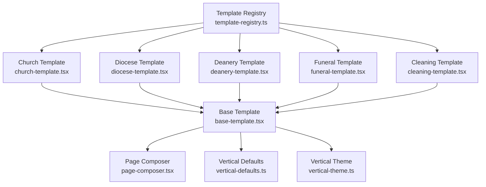
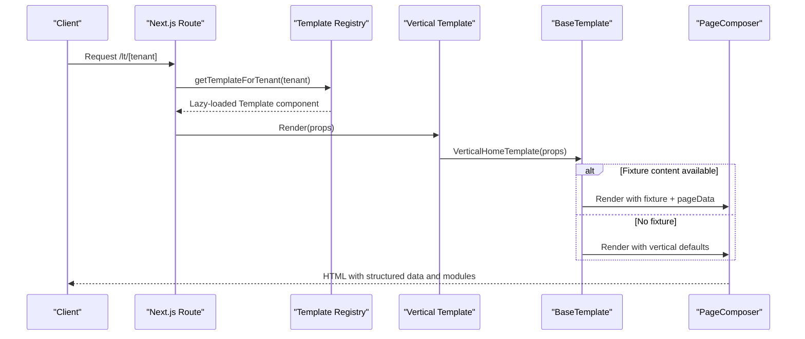
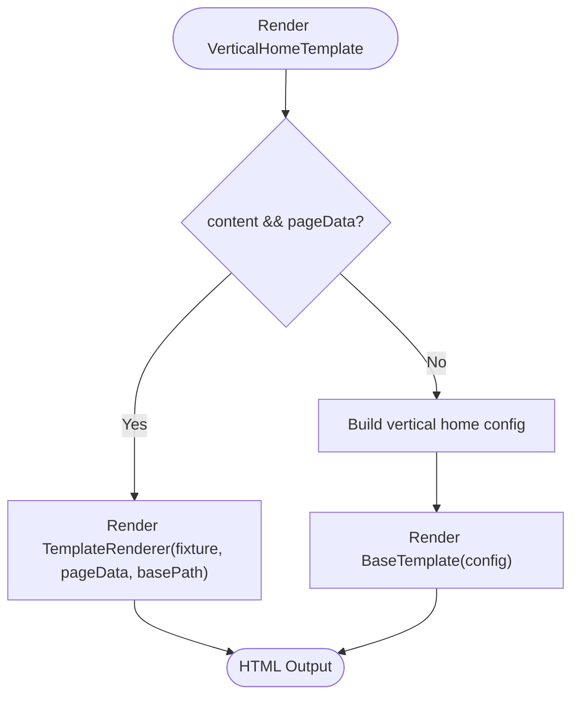
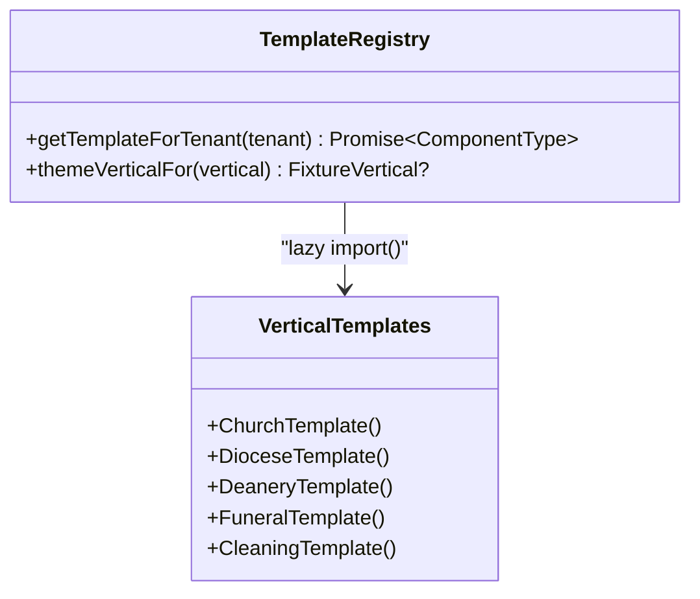
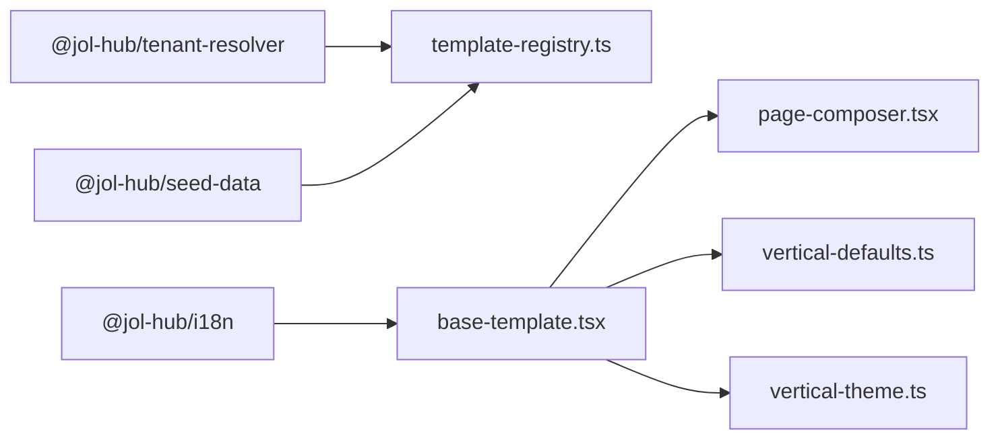

# Template Component Architecture

<cite>
**Referenced Files in This Document**
- [base-template.tsx](file://frontend/apps/template-renderer/src/templates/base-template.tsx)
- [church-template.tsx](file://frontend/apps/template-renderer/src/templates/church-template.tsx)
- [diocese-template.tsx](file://frontend/apps/template-renderer/src/templates/diocese-template.tsx)
- [funeral-template.tsx](file://frontend/apps/template-renderer/src/templates/funeral-template.tsx)
- [deanery-template.tsx](file://frontend/apps/template-renderer/src/templates/deanery-template.tsx)
- [cleaning-template.tsx](file://frontend/apps/template-renderer/src/templates/cleaning-template.tsx)
- [template-registry.ts](file://frontend/apps/template-renderer/src/lib/template-registry.ts)
- [page-composer.tsx](file://frontend/apps/template-renderer/src/lib/page-composer.tsx)
- [vertical-defaults.ts](file://frontend/apps/template-renderer/src/lib/vertical-defaults.ts)
- [vertical-theme.ts](file://frontend/apps/template-renderer/src/lib/vertical-theme.ts)
</cite>

## Table of Contents
1. Introduction
2. Project Structure
3. Core Components
4. Architecture Overview
5. Detailed Component Analysis
6. Dependency Analysis
7. Performance Considerations
8. Troubleshooting Guide
9. Conclusion
10. Appendices

## Introduction
This document explains the template component architecture used to render different religious institution types (church, diocese, deanery, funeral, and cemetery cleaning). It focuses on how templates receive tenant data, locale information, base path, and page content; how shared UI is composed with vertical-specific arrangements; and how server-side rendering and data fetching patterns are applied. It also provides guidance for creating new template components while following established architectural patterns.

## Project Structure
The template system lives under the template-renderer app and is organized around a small set of reusable building blocks:
- A base template that owns cross-cutting concerns (theme hooks, structured data, analytics placeholder, and composition rendering).
- Vertical-specific template files that delegate to a shared renderer.
- A registry that maps tenants to lazy-loaded templates based on their vertical taxonomy.
- Supporting libraries for page composition, vertical defaults, and theme mapping.

**Diagram sources**
- [template-registry.ts:38-76](file://frontend/apps/template-renderer/src/lib/template-registry.ts#L38-L76)
- [base-template.tsx:44-94](file://frontend/apps/template-renderer/src/templates/base-template.tsx#L44-L94)
- [church-template.tsx:15-20](file://frontend/apps/template-renderer/src/templates/church-template.tsx#L15-L20)
- [diocese-template.tsx:16-21](file://frontend/apps/template-renderer/src/templates/diocese-template.tsx#L16-L21)
- [deanery-template.tsx:15-20](file://frontend/apps/template-renderer/src/templates/deanery-template.tsx#L15-L20)
- [funeral-template.tsx:16-21](file://frontend/apps/template-renderer/src/templates/funeral-template.tsx#L16-L21)
- [cleaning-template.tsx:13-18](file://frontend/apps/template-renderer/src/templates/cleaning-template.tsx#L13-L18)

**Section sources**
- [template-registry.ts:1-109](file://frontend/apps/template-renderer/src/lib/template-registry.ts#L1-L109)
- [base-template.tsx:1-95](file://frontend/apps/template-renderer/src/templates/base-template.tsx#L1-L95)

## Core Components
- BaseTemplate: Provides the shared shell for all vertical templates. It sets the vertical theme context, injects baseline structured data, renders the page composition via PageComposer, and supports optional children.
- VerticalHomeTemplate: Shared renderer used by all vertical templates. It chooses between fixture-driven content and default vertical home composition.
- Vertical Templates: church-template, diocese-template, deanery-template, funeral-template, cleaning-template. Each is a thin wrapper delegating to VerticalHomeTemplate.
- Template Registry: Maps tenant.vertical to lazy-loaded template modules and supports admin template overrides when permitted.

Key responsibilities:
- Tenant isolation: Each template receives a resolved tenant record containing schema and settings.
- Localization: Locale is passed through to ensure localized fields are rendered correctly.
- Routing context: basePath is provided so URLs in structured data and links remain absolute and correct.
- Content strategy: Fixture content (pilot era) or default composition can be rendered depending on availability.

**Section sources**
- [base-template.tsx:32-94](file://frontend/apps/template-renderer/src/templates/base-template.tsx#L32-L94)
- [template-registry.ts:19-33](file://frontend/apps/template-renderer/src/lib/template-registry.ts#L19-L33)
- [template-registry.ts:38-76](file://frontend/apps/template-renderer/src/lib/template-registry.ts#L38-L76)

## Architecture Overview
The runtime flow resolves a tenant’s vertical, selects a template via the registry, and renders it server-side. The base template then composes the page using either fixture content or default vertical configuration.

**Diagram sources**
- [template-registry.ts:66-76](file://frontend/apps/template-renderer/src/lib/template-registry.ts#L66-L76)
- [base-template.tsx:82-94](file://frontend/apps/template-renderer/src/templates/base-template.tsx#L82-L94)
- [page-composer.tsx:1-200](file://frontend/apps/template-renderer/src/lib/page-composer.tsx#L1-L200)

## Detailed Component Analysis

### TemplateProps Interface
Every vertical template receives a consistent set of props:
- tenant: Resolved tenant record (server-side only), including vertical, name, schema, and settings.
- locale: Active locale for localized field resolution.
- basePath: URL prefix for the tenant route (e.g., /lt/siauliai-church).
- content: Optional fixture content for pilot fidelity.
- pageData: Optional resolved page within content after route matching.

These props enable:
- Data-driven theming and SEO via tenant.vertical and tenant.name.
- Absolute URL generation for structured data and links.
- Conditional rendering of fixture vs default content.

**Section sources**
- [template-registry.ts:19-33](file://frontend/apps/template-renderer/src/lib/template-registry.ts#L19-L33)

### BaseTemplate and VerticalHomeTemplate
BaseTemplate:
- Applies vertical theme attributes and accent styles.
- Injects baseline JSON-LD (Organization subtype per vertical and Website entity).
- Renders PageComposer with config derived from vertical defaults when no fixture is present.
- Supports optional children for additional content.

VerticalHomeTemplate:
- If both content and pageData are present, delegates to TemplateRenderer with fixture and page.
- Otherwise, builds a default vertical home configuration and renders via BaseTemplate.

**Diagram sources**
- [base-template.tsx:82-94](file://frontend/apps/template-renderer/src/templates/base-template.tsx#L82-L94)

**Section sources**
- [base-template.tsx:44-94](file://frontend/apps/template-renderer/src/templates/base-template.tsx#L44-L94)

### Vertical Templates (church, diocese, deanery, funeral, cleaning)
Each vertical template is intentionally minimal:
- Imports VerticalHomeTemplate.
- Accepts TemplateProps.
- Delegates rendering to VerticalHomeTemplate.

Differentiation is achieved via:
- tenant.vertical determining theme, schema type, and default composition.
- Fixture content providing vertical-specific layouts during the pilot phase.

Examples:
- ChurchTemplate: Sacred-family layout with warm accents and community-focused composition.
- DioceseTemplate: Administrative layout with formal tone and regional focus.
- DeaneryTemplate: Smaller administrative grouping with parish-centric composition.
- FuneralTemplate: Memorial layout with dignified styling and service-oriented composition.
- CleaningTemplate: Service layout for cemetery-care with bright, trustworthy visuals.

**Section sources**
- [church-template.tsx:1-21](file://frontend/apps/template-renderer/src/templates/church-template.tsx#L1-L21)
- [diocese-template.tsx:1-22](file://frontend/apps/template-renderer/src/templates/diocese-template.tsx#L1-L22)
- [deanery-template.tsx:1-21](file://frontend/apps/template-renderer/src/templates/deanery-template.tsx#L1-L21)
- [funeral-template.tsx:1-22](file://frontend/apps/template-renderer/src/templates/funeral-template.tsx#L1-L22)
- [cleaning-template.tsx:1-19](file://frontend/apps/template-renderer/src/templates/cleaning-template.tsx#L1-L19)

### Template Registry and Lazy Loading
The registry:
- Maps canonical vertical taxonomy to lazy-loaded template modules.
- Supports admin template override when feature flags allow.
- Provides themeVerticalFor to bridge vertical taxonomy to design-system tokens.

Lazy loading ensures each vertical ships as its own chunk, reducing payload for unrelated visitors.

**Diagram sources**
- [template-registry.ts:38-76](file://frontend/apps/template-renderer/src/lib/template-registry.ts#L38-L76)
- [template-registry.ts:83-108](file://frontend/apps/template-renderer/src/lib/template-registry.ts#L83-L108)

**Section sources**
- [template-registry.ts:1-109](file://frontend/apps/template-renderer/src/lib/template-registry.ts#L1-L109)

### Page Composition and Default Configurations
- PageComposer: Renders the module composition defined by config, receiving tenant, locale, and basePath to resolve localized content and URLs.
- Vertical Defaults: Builds a default home composition for each vertical when fixtures are absent.

This separation allows:
- Consistent composition across verticals.
- Easy customization via fixtures or future backend-provided configs.

**Section sources**
- [base-template.tsx:65-67](file://frontend/apps/template-renderer/src/templates/base-template.tsx#L65-L67)
- [vertical-defaults.ts:1-200](file://frontend/apps/template-renderer/src/lib/vertical-defaults.ts#L1-L200)
- [page-composer.tsx:1-200](file://frontend/apps/template-renderer/src/lib/page-composer.tsx#L1-L200)

### Theming and Structured Data
- Vertical Theme: Determines schema type and accent style based on tenant.vertical.
- BaseTemplate: Applies data-vertical attribute and CSS custom property for accent color; injects JSON-LD Organization and Website entities with absolute URLs.

This ensures:
- Visual consistency per vertical.
- SEO-friendly structured data aligned with the institution type.

**Section sources**
- [base-template.tsx:45-55](file://frontend/apps/template-renderer/src/templates/base-template.tsx#L45-L55)
- [vertical-theme.ts:1-200](file://frontend/apps/template-renderer/src/lib/vertical-theme.ts#L1-L200)

## Dependency Analysis
The template layer depends on:
- Tenant resolver for tenant records and vertical taxonomy.
- i18n package for supported locales.
- Seed data types for fixtures and pages.
- Page composer for module rendering.
- Vertical defaults for fallback compositions.
- Vertical theme for schema and accent mapping.

**Diagram sources**
- [template-registry.ts:14-18](file://frontend/apps/template-renderer/src/lib/template-registry.ts#L14-L18)
- [base-template.tsx:19-30](file://frontend/apps/template-renderer/src/templates/base-template.tsx#L19-L30)

**Section sources**
- [template-registry.ts:14-18](file://frontend/apps/template-renderer/src/lib/template-registry.ts#L14-L18)
- [base-template.tsx:19-30](file://frontend/apps/template-renderer/src/templates/base-template.tsx#L19-L30)

## Performance Considerations
- Lazy loading: Each vertical template is loaded on demand, minimizing initial bundle size.
- Fixture vs default: When fixtures are present, they avoid extra network calls; otherwise, default compositions render immediately.
- Server-side rendering: Tenant, locale, and basePath are resolved server-side, ensuring fast first paint and accurate SEO metadata.
- Analytics gating: Analytics integration is inert until consented, avoiding unnecessary payloads.

[No sources needed since this section provides general guidance]

## Troubleshooting Guide
Common issues and resolutions:
- Wrong template selected: Verify tenant.vertical matches expected value and that TEMPLATE_LOADERS includes the mapping. Check for templateOverride usage and feature flag presence.
- Missing fixture content: Ensure content and pageData are provided when expecting fixture-driven rendering; otherwise, verify vertical defaults include required modules.
- Incorrect URLs in structured data: Confirm basePath is correct and absoluteUrl is used for JSON-LD URLs.
- Theme mismatch: Validate verticalThemeFor mapping and that tenant.vertical is recognized; unknown mappings fall back to neutral accent.

**Section sources**
- [template-registry.ts:66-76](file://frontend/apps/template-renderer/src/lib/template-registry.ts#L66-L76)
- [base-template.tsx:45-55](file://frontend/apps/template-renderer/src/templates/base-template.tsx#L45-L55)

## Conclusion
The template architecture separates concerns cleanly:
- Vertical templates are thin wrappers that delegate to a shared renderer.
- BaseTemplate centralizes cross-cutting logic like theming, structured data, and composition rendering.
- The registry enables flexible, lazy-loaded template selection driven by tenant data.
- Fixtures provide pilot-era fidelity while defaults ensure robustness without external content.

This design makes it straightforward to add new verticals, customize compositions, and maintain consistent UX and SEO across institution types.

[No sources needed since this section summarizes without analyzing specific files]

## Appendices

### Creating a New Template Component
Follow these steps to add a new vertical template:
1. Create a new template file under src/templates/ that accepts TemplateProps and delegates to VerticalHomeTemplate.
2. Register the vertical mapping in the registry’s TEMPLATE_LOADERS if introducing a new vertical key.
3. Add any necessary theme mappings in themeVerticalFor if bridging to design-system tokens.
4. Optionally define default composition entries in vertical-defaults for the new vertical.
5. Ensure your template uses BaseTemplate indirectly via VerticalHomeTemplate to inherit theming, structured data, and composition behavior.

Guidance:
- Keep the template file minimal; differentiate via tenant.vertical and fixtures rather than duplicating logic.
- Use basePath for absolute URLs in links and structured data.
- Respect locale by relying on localized fields provided via tenant and page data.
- Avoid adding trackers or analytics directly; rely on the consent-gated integration point in BaseTemplate.

**Section sources**
- [template-registry.ts:38-76](file://frontend/apps/template-renderer/src/lib/template-registry.ts#L38-L76)
- [base-template.tsx:44-94](file://frontend/apps/template-renderer/src/templates/base-template.tsx#L44-L94)
- [vertical-defaults.ts:1-200](file://frontend/apps/template-renderer/src/lib/vertical-defaults.ts#L1-L200)