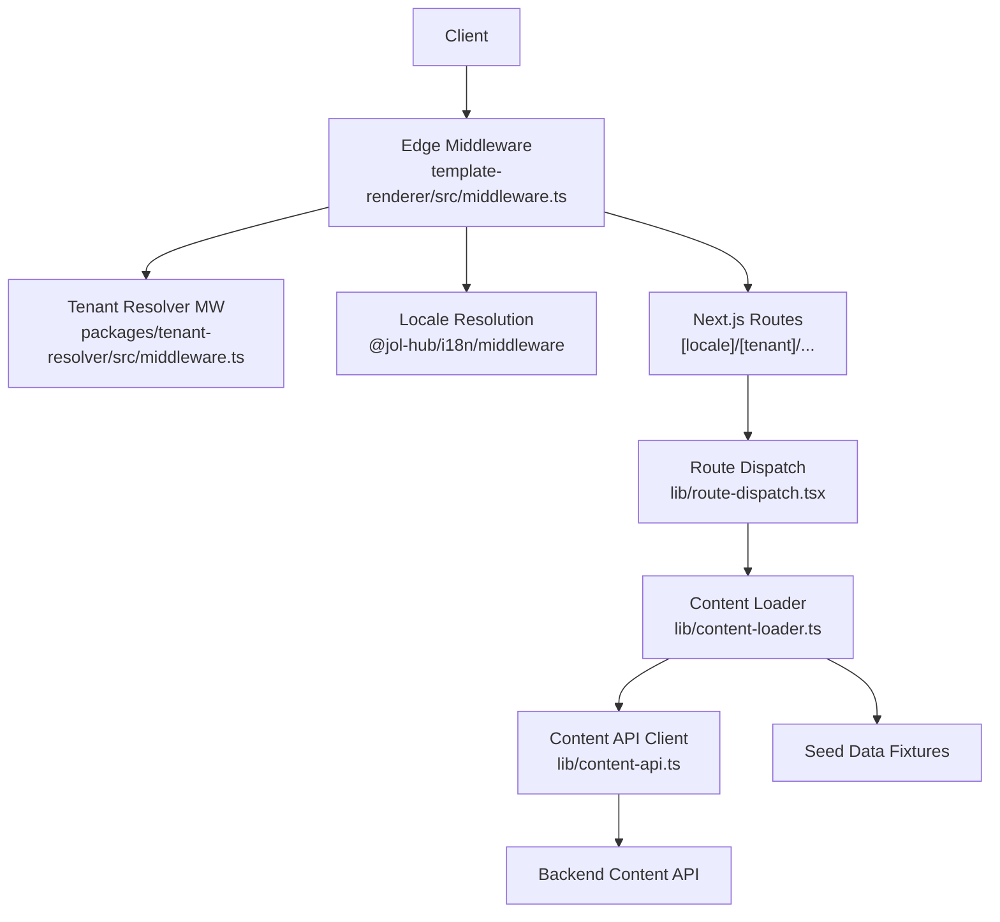
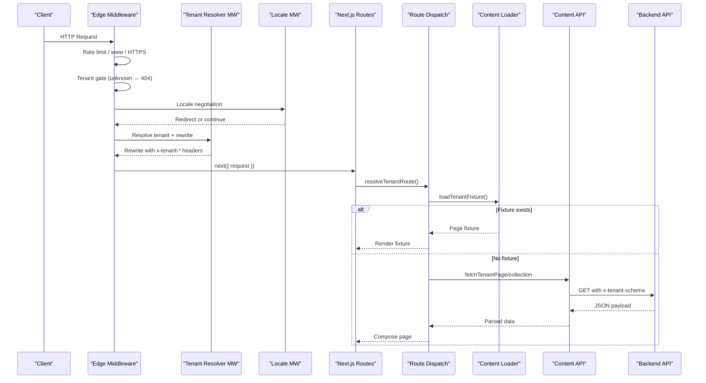
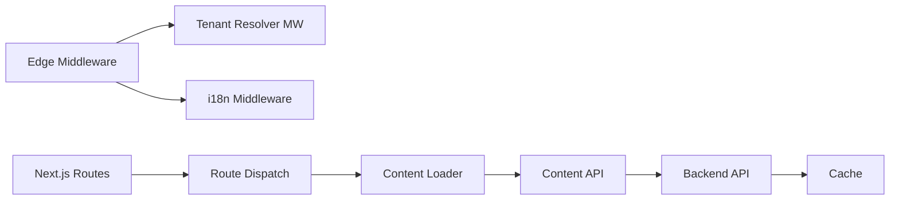

# Template Lifecycle & Rendering Flow

<cite>
**Referenced Files in This Document**
- [middleware.ts](file://frontend/apps/template-renderer/src/middleware.ts)
- [middleware.ts](file://frontend/packages/tenant-resolver/src/middleware.ts)
- [RENDERING.md](file://frontend/apps/template-renderer/RENDERING.md)
- [route-dispatch.tsx](file://frontend/apps/template-renderer/src/lib/route-dispatch.tsx)
- [content-api.ts](file://frontend/apps/template-renderer/src/lib/content-api.ts)
- [content-loader.ts](file://frontend/apps/template-renderer/src/lib/content-loader.ts)
- [middleware.py](file://backend/django/apps/crm/middleware.py)
</cite>

## Table of Contents
1. Introduction
2. Project Structure
3. Core Components
4. Architecture Overview
5. Detailed Component Analysis
6. Dependency Analysis
7. Performance Considerations
8. Troubleshooting Guide
9. Conclusion

## Introduction
This document explains the complete template lifecycle from tenant resolution to component rendering in the template-renderer application. It covers how edge middleware processes incoming requests, resolves tenant identity and locale, rewrites routes for tenant scoping, and delegates to route handlers that select fixtures or compose pages. It also documents integration points with the backend content API, error handling and fallbacks (including pilot mode), localization, caching strategies, and debugging/monitoring hooks throughout the flow.

## Project Structure
The template lifecycle spans three layers:
- Edge middleware layer: request hygiene, rate limiting, HTTPS/www normalization, tenant gate, locale negotiation, and tenant rewrite/header injection.
- Route dispatch layer: tenant validation, fixture-first delegation, and composition/collection rendering.
- Content layer: optional backend content API calls with RLS context headers and Next.js data cache; otherwise seed-data fixtures.

**Diagram sources**
- [middleware.ts:120-310](file://frontend/apps/template-renderer/src/middleware.ts#L120-L310)
- [middleware.ts:49-90](file://frontend/packages/tenant-resolver/src/middleware.ts#L49-L90)
- [route-dispatch.tsx:49-78](file://frontend/apps/template-renderer/src/lib/route-dispatch.tsx#L49-L78)
- [content-api.ts:123-217](file://frontend/apps/template-renderer/src/lib/content-api.ts#L123-L217)
- [content-loader.ts:17-32](file://frontend/apps/template-renderer/src/lib/content-loader.ts#L17-L32)

**Section sources**
- [middleware.ts:120-310](file://frontend/apps/template-renderer/src/middleware.ts#L120-L310)
- [middleware.ts:49-90](file://frontend/packages/tenant-resolver/src/middleware.ts#L49-L90)
- [route-dispatch.tsx:49-78](file://frontend/apps/template-renderer/src/lib/route-dispatch.tsx#L49-L78)
- [content-api.ts:123-217](file://frontend/apps/template-renderer/src/lib/content-api.ts#L123-L217)
- [content-loader.ts:17-32](file://frontend/apps/template-renderer/src/lib/content-loader.ts#L17-L32)

## Core Components
- Edge middleware orchestrates the request pipeline: rate limiting, www/HTTPS normalization, tenant gate, protected-area auth, locale negotiation, tenant rewrite, and security headers.
- Tenant resolver middleware normalizes paths by injecting tenant segments and server-only x-tenant-* headers.
- Route dispatch validates tenants, loads fixtures, and chooses between fixture rendering and dynamic composition.
- Content API client fetches tenant-scoped content with RLS context headers and applies per-content-type revalidation; falls back to fixtures when the backend is not configured.
- Content loader provides fixture lookups and shared-route detection.

**Section sources**
- [middleware.ts:120-310](file://frontend/apps/template-renderer/src/middleware.ts#L120-L310)
- [middleware.ts:49-90](file://frontend/packages/tenant-resolver/src/middleware.ts#L49-L90)
- [route-dispatch.tsx:49-78](file://frontend/apps/template-renderer/src/lib/route-dispatch.tsx#L49-L78)
- [content-api.ts:123-217](file://frontend/apps/template-renderer/src/lib/content-api.ts#L123-L217)
- [content-loader.ts:17-32](file://frontend/apps/template-renderer/src/lib/content-loader.ts#L17-L32)

## Architecture Overview
The request lifecycle follows a strict sequence:
1. Rate limit check per client IP and resolved tenant.
2. www prefix normalization via permanent redirect.
3. HTTPS enforcement in production via permanent redirect.
4. Excluded path handling (static assets, APIs, SEO surfaces).
5. Tenant gate: unknown/unresolvable tenants receive a direct generic 404 without enumeration.
6. Protected area authentication gate for admin/editor/settings/dashboard routes.
7. Locale negotiation may issue a canonical redirect.
8. Tenant rewrite injects tenant segment and x-tenant-* headers for downstream server components.
9. Next.js routes resolve to page layouts/components.
10. Route dispatch validates tenant, loads fixtures, and either renders fixtures or composes pages using collections.
11. Content API calls are scoped by schema and tenant; results are cached per content type.

**Diagram sources**
- [middleware.ts:120-310](file://frontend/apps/template-renderer/src/middleware.ts#L120-L310)
- [middleware.ts:49-90](file://frontend/packages/tenant-resolver/src/middleware.ts#L49-L90)
- [route-dispatch.tsx:49-78](file://frontend/apps/template-renderer/src/lib/route-dispatch.tsx#L49-L78)
- [content-api.ts:123-217](file://frontend/apps/template-renderer/src/lib/content-api.ts#L123-L217)
- [content-loader.ts:17-32](file://frontend/apps/template-renderer/src/lib/content-loader.ts#L17-L32)

## Detailed Component Analysis

### Edge Middleware (Request Pipeline)
Responsibilities:
- Structured logging per request with requestId correlation across middleware, routes, and telemetry.
- Rate limiting keyed by client IP and resolved tenant; login brute-force protection on auth callbacks.
- www normalization and HTTPS enforcement with safe public host derivation behind proxies.
- Excluded paths bypass tenant routing while still allowing SEO surfaces to set x-resolved-tenant.
- Tenant gate returns a static generic 404 for unknown tenants to avoid registry enumeration.
- Protected area authentication gate enforces OIDC session presence for admin/editor/settings/dashboard.
- Locale negotiation via i18n middleware; redirects to canonical locale when needed.
- Tenant rewrite ensures tenant segment is present and injects server-only x-tenant-* headers.

Error handling and observability:
- Security events logged for rate-limit hits and auth denials.
- Unknown tenant requests logged with event type and path.
- All responses include security headers; HSTS applied in production.

Performance characteristics:
- Early exits for excluded paths and redirects minimize work.
- Tenant resolution uses an LRU cache internally; rewrite avoids extra round-trips.
- Request-scoped tracing enables correlation across services.

**Section sources**
- [middleware.ts:120-310](file://frontend/apps/template-renderer/src/middleware.ts#L120-L310)

### Tenant Resolver Middleware
Responsibilities:
- Skips rewriting for Next internals, favicons, and APIs.
- Resolves tenant from request context; if absent, passes through to route layer which returns a bare 404.
- Preserves locale prefixes when rewriting to /lt/[tenant]/...
- Injects server-only x-tenant-id, x-tenant-schema, x-tenant-vertical, x-tenant-locale, and x-resolved-tenant headers.
- Rewrites to tenant-prefixed path with mutated headers preserved through rewrite.

Security considerations:
- Schema header is server-only secret; never emitted to browsers.
- Unresolvable tenants do not enumerate registry entries.

**Section sources**
- [middleware.ts:49-90](file://frontend/packages/tenant-resolver/src/middleware.ts#L49-L90)

### Route Dispatch and Fixture-First Delegation
Responsibilities:
- Validates tenant slug; unknown tenants trigger notFound() for a bare 404.
- Loads tenant fixture; if present and contains the requested route, renders via TemplateRenderer.
- Otherwise, falls through to STEP 6 composition/collection system.
- Normalizes locale to supported values; builds basePath for links and metadata.

Integration points:
- Uses i18n helpers for locale validation.
- Uses tenant resolver to find full tenant record (with schema) for downstream use.

**Section sources**
- [route-dispatch.tsx:49-78](file://frontend/apps/template-renderer/src/lib/route-dispatch.tsx#L49-L78)

### Content Loading and Backend Integration
Responsibilities:
- Fixture loading: closed lookup returning null for unknown slugs; fallback variant for known tenants.
- Shared routes list for compliance UI rendered by shared templates.
- Content API client:
  - Sends x-tenant-schema and x-tenant-id headers for row-level security.
  - Applies per-content-type revalidation windows (page, block, news).
  - Deduplicates concurrent in-flight requests within a render pass.
  - Throws typed errors for not-found, forbidden, and server-error; callers map to UX.
  - Pilot mode: when BACKEND_API_URL is unset, returns null so callers render empty states or fixtures.

Data flows:
- Pages and blocks fetched with revalidate windows; collections vary by kind (news ISR, events/services no-store).
- Malformed payloads treated as server errors to prevent garbage rendering.

**Section sources**
- [content-loader.ts:17-32](file://frontend/apps/template-renderer/src/lib/content-loader.ts#L17-L32)
- [content-api.ts:123-217](file://frontend/apps/template-renderer/src/lib/content-api.ts#L123-L217)

### Backend Tenant Context Middleware
Responsibilities:
- Extracts tenant context from JWT claims, X-Tenant-ID header, or user’s default organization.
- Stores immutable TenantContext in thread-local storage for the duration of the request.
- Validates tenant info and caches it briefly to reduce DB load.
- Provides decorators and permission classes to enforce tenant context on views.
- Logs access events for audit trails.

Integration notes:
- Frontend sets x-tenant-schema and x-tenant-id on backend calls; backend can rely on these for RLS and isolation.
- Request ID propagation supports cross-service tracing.

**Section sources**
- [middleware.py:96-154](file://backend/django/apps/crm/middleware.py#L96-L154)
- [middleware.py:156-197](file://backend/django/apps/crm/middleware.py#L156-L197)
- [middleware.py:233-265](file://backend/django/apps/crm/middleware.py#L233-L265)

## Dependency Analysis
Key dependencies and coupling:
- Edge middleware depends on tenant-resolver and i18n middleware packages; couples tightly to Next.js request/response model.
- Route dispatch depends on tenant-resolver and seed-data; decouples from content source via content-api abstraction.
- Content API depends on environment configuration; toggles between backend calls and fixture fallback.
- Backend middleware depends on Django/DRF and caching; isolates tenant context per request.

**Diagram sources**
- [middleware.ts:120-310](file://frontend/apps/template-renderer/src/middleware.ts#L120-L310)
- [middleware.ts:49-90](file://frontend/packages/tenant-resolver/src/middleware.ts#L49-L90)
- [route-dispatch.tsx:49-78](file://frontend/apps/template-renderer/src/lib/route-dispatch.tsx#L49-L78)
- [content-api.ts:123-217](file://frontend/apps/template-renderer/src/lib/content-api.ts#L123-L217)
- [middleware.py:96-154](file://backend/django/apps/crm/middleware.py#L96-L154)

**Section sources**
- [middleware.ts:120-310](file://frontend/apps/template-renderer/src/middleware.ts#L120-L310)
- [middleware.ts:49-90](file://frontend/packages/tenant-resolver/src/middleware.ts#L49-L90)
- [route-dispatch.tsx:49-78](file://frontend/apps/template-renderer/src/lib/route-dispatch.tsx#L49-L78)
- [content-api.ts:123-217](file://frontend/apps/template-renderer/src/lib/content-api.ts#L123-L217)
- [middleware.py:96-154](file://backend/django/apps/crm/middleware.py#L96-L154)

## Performance Considerations
- Per-request rendering due to dynamic lang in root layout; content caching via Next.js data cache with revalidate windows reduces backend load.
- In-flight deduplication prevents redundant network calls during a single render pass.
- Tenant resolution uses LRU cache; SEO surfaces set x-resolved-tenant without full routing overhead.
- Events/services collections use no-store to ensure freshness for time-sensitive data.
- Avoid unnecessary redirects by early-exitting on excluded paths.

[No sources needed since this section provides general guidance]

## Troubleshooting Guide
Common issues and diagnostics:
- Unknown tenant requests:
  - Symptom: Generic 404 response without tenant enumeration.
  - Check: Tenant resolution logs and tenant gate behavior in edge middleware.
- Rate limiting:
  - Symptom: 429 Too Many Requests.
  - Check: Rate limit logs keyed by client IP and tenant; verify thresholds and keys.
- Authentication failures:
  - Symptom: Redirect to sign-in for protected routes.
  - Check: Auth config status and token presence; log events for denied access.
- Locale mismatch:
  - Symptom: Redirect to canonical locale.
  - Check: Locale negotiation middleware output and supported locales.
- Backend errors:
  - Symptom: Server errors or malformed payloads.
  - Check: Content API error mapping and revalidation settings; validate schemas.
- Observability:
  - Use x-request-id to correlate logs across middleware, routes, and backend.
  - Monitor structured logs for tenant.resolved, tenant.unknown, security.rate-limit, security.auth-denied.

**Section sources**
- [middleware.ts:120-310](file://frontend/apps/template-renderer/src/middleware.ts#L120-L310)
- [content-api.ts:123-217](file://frontend/apps/template-renderer/src/lib/content-api.ts#L123-L217)

## Conclusion
The template lifecycle integrates robust tenant resolution, secure request handling, and flexible content delivery. Edge middleware ensures safety and performance before delegating to route dispatch, which prioritizes fixture fidelity and falls back to dynamic composition. The content API layer enforces row-level security and caching policies, while the backend maintains isolated tenant contexts. Together, these components deliver a scalable, secure, and observable rendering pipeline suitable for multi-tenant environments.

[No sources needed since this section summarizes without analyzing specific files]