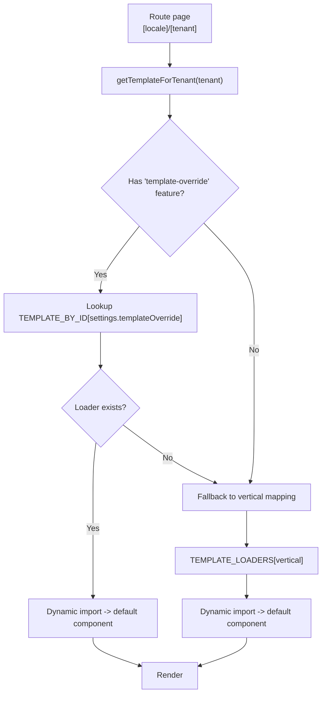
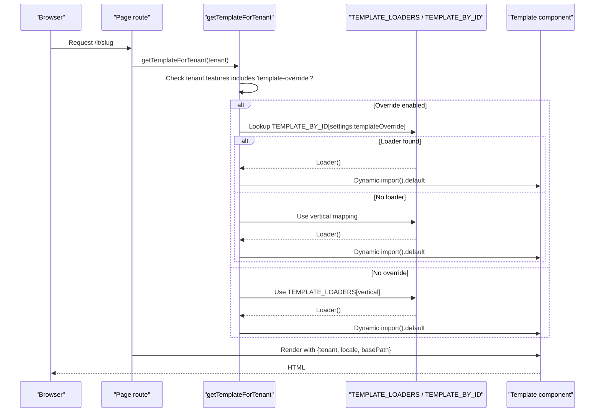
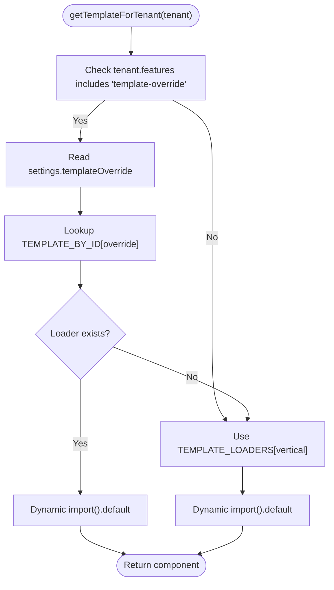
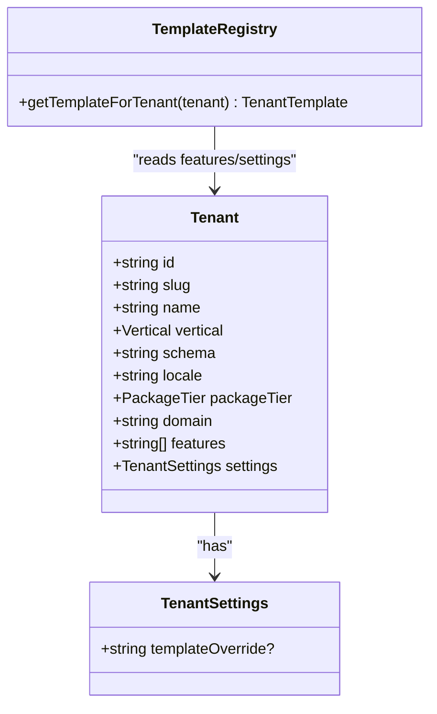
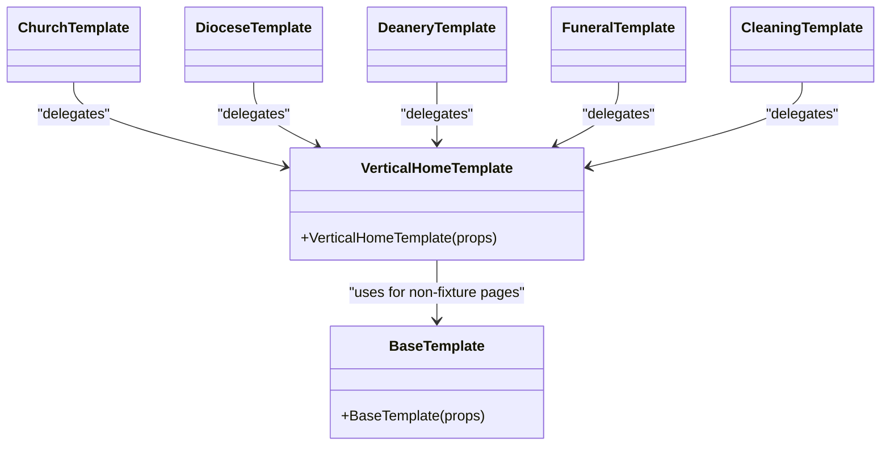
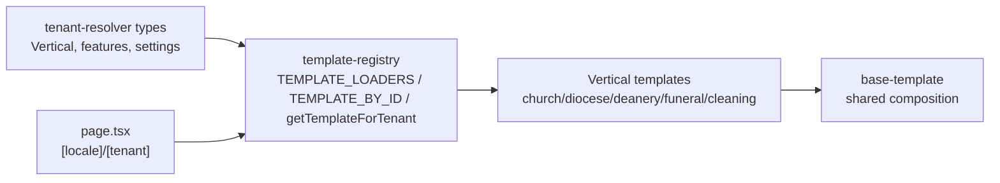

# Template Registry & Resolution

<cite>
**Referenced Files in This Document**
- [template-registry.ts](file://frontend/apps/template-renderer/src/lib/template-registry.ts)
- [types.ts](file://frontend/packages/tenant-resolver/src/types.ts)
- [church-template.tsx](file://frontend/apps/template-renderer/src/templates/church-template.tsx)
- [diocese-template.tsx](file://frontend/apps/template-renderer/src/templates/diocese-template.tsx)
- [deanery-template.tsx](file://frontend/apps/template-renderer/src/templates/deanery-template.tsx)
- [funeral-template.tsx](file://frontend/apps/template-renderer/src/templates/funeral-template.tsx)
- [cleaning-template.tsx](file://frontend/apps/template-renderer/src/templates/cleaning-template.tsx)
- [base-template.tsx](file://frontend/apps/template-renderer/src/templates/base-template.tsx)
- [page.tsx](file://frontend/apps/template-renderer/src/app/[locale]/[tenant]/page.tsx)
- [resolver.test.ts](file://frontend/packages/tenant-resolver/src/__tests__/resolver.test.ts)
- [PERFORMANCE.md](file://frontend/apps/template-renderer/PERFORMANCE.md)
</cite>

## Table of Contents
1. [Introduction](#introduction)
2. [Project Structure](#project-structure)
3. [Core Components](#core-components)
4. [Architecture Overview](#architecture-overview)
5. [Detailed Component Analysis](#detailed-component-analysis)
6. [Dependency Analysis](#dependency-analysis)
7. [Performance Considerations](#performance-considerations)
8. [Troubleshooting Guide](#troubleshooting-guide)
9. [Conclusion](#conclusion)
10. [Appendices](#appendices)

## Introduction
This document explains the template registry and resolution mechanism that maps a tenant’s vertical to a specific React template component using lazy loading via dynamic imports. It covers:
- The mapping from canonical verticals to template loaders (TEMPLATE_LOADERS).
- The admin-driven override system (TEMPLATE_BY_ID) gated by a feature flag.
- The getTemplateForTenant function logic and how it chooses between overrides and defaults.
- How each vertical (basilica, cathedral, church, diocese, deanery, funeral, cemetery-cleaning) resolves to a concrete template.
- Feature-gated overrides and their integration with tenant settings.
- Guidance for extending the registry with new verticals and understanding chunk splitting benefits.

## Project Structure
The template resolution spans three layers:
- Tenant model and features: defines Vertical, features per tier, and settings including templateOverride.
- Template registry: maps verticals to lazy-loaded template modules and exposes getTemplateForTenant.
- Template implementations: one file per vertical family, delegating to shared base composition.

**Diagram sources**
- [template-registry.ts:66-76](file://frontend/apps/template-renderer/src/lib/template-registry.ts#L66-L76)
- [types.ts:38-71](file://frontend/packages/tenant-resolver/src/types.ts#L38-L71)
- [page.tsx:102-108](file://frontend/apps/template-renderer/src/app/[locale]/[tenant]/page.tsx#L102-L108)

**Section sources**
- [types.ts:15-71](file://frontend/packages/tenant-resolver/src/types.ts#L15-L71)
- [template-registry.ts:19-76](file://frontend/apps/template-renderer/src/lib/template-registry.ts#L19-L76)
- [page.tsx:102-108](file://frontend/apps/template-renderer/src/app/[locale]/[tenant]/page.tsx#L102-L108)

## Core Components
- Vertical taxonomy and features: Canonical vertical values and package-tier feature sets define entitlements, including template-override for VIP tenants.
- Template registry: Maps each vertical to a lazy loader; provides an override map keyed by stable IDs used in tenant settings.
- getTemplateForTenant: Applies feature gating, checks override, then falls back to vertical-based mapping.
- Template components: Each vertical template is a thin wrapper around a shared base composition, enabling data-driven differentiation without code duplication.

Key responsibilities:
- Centralize mapping and selection logic in one place.
- Keep templates small and composable.
- Gate advanced features behind explicit flags.

**Section sources**
- [types.ts:22-33](file://frontend/packages/tenant-resolver/src/types.ts#L22-L33)
- [types.ts:91-123](file://frontend/packages/tenant-resolver/src/types.ts#L91-L123)
- [template-registry.ts:37-76](file://frontend/apps/template-renderer/src/lib/template-registry.ts#L37-L76)

## Architecture Overview
The runtime flow selects a template at request time based on the resolved tenant record:

**Diagram sources**
- [template-registry.ts:66-76](file://frontend/apps/template-renderer/src/lib/template-registry.ts#L66-L76)
- [page.tsx:102-108](file://frontend/apps/template-renderer/src/app/[locale]/[tenant]/page.tsx#L102-L108)
- [types.ts:38-71](file://frontend/packages/tenant-resolver/src/types.ts#L38-L71)

## Detailed Component Analysis

### Template Registry (mapping and resolution)
- TEMPLATE_LOADERS: Maps every canonical Vertical to a lazy loader returning a template module. Church-family verticals share one loader; others have dedicated loaders.
- TEMPLATE_BY_ID: Stable identifiers for admin-selected overrides stored in tenant.settings.templateOverride. Only church, diocese, deanery, funeral, and cleaning are supported override targets.
- getTemplateForTenant: 
  - If tenant has the 'template-override' feature and settings.templateOverride is set, attempt to resolve via TEMPLATE_BY_ID.
  - If no valid override, fall back to TEMPLATE_LOADERS[vertical], with a safe fallback to church when unknown.
  - Returns the default export of the dynamically imported module.

**Diagram sources**
- [template-registry.ts:66-76](file://frontend/apps/template-renderer/src/lib/template-registry.ts#L66-L76)
- [template-registry.ts:37-59](file://frontend/apps/template-renderer/src/lib/template-registry.ts#L37-L59)

**Section sources**
- [template-registry.ts:37-76](file://frontend/apps/template-renderer/src/lib/template-registry.ts#L37-L76)

### Vertical-to-Template Mapping Examples
- basilica → church-template
- cathedral → church-template
- church → church-template
- protestant → church-template
- orthodox → church-template
- other-church → church-template
- diocese → diocese-template
- deanery → deanery-template
- funeral → funeral-template
- cemetery-cleaning → cleaning-template

These mappings are defined centrally so adding or changing a vertical’s target template requires updating only the registry.

**Section sources**
- [template-registry.ts:37-50](file://frontend/apps/template-renderer/src/lib/template-registry.ts#L37-L50)

### Feature-Gated Overrides Integration
- The override path is only taken when the tenant’s effective features include 'template-override'.
- Features are derived from the tenant’s package tier baseline plus any per-tenant overrides; VIP tier includes 'template-override'.
- Unknown override IDs safely fall back to the vertical-based mapping.

**Diagram sources**
- [types.ts:38-71](file://frontend/packages/tenant-resolver/src/types.ts#L38-L71)
- [template-registry.ts:66-76](file://frontend/apps/template-renderer/src/lib/template-registry.ts#L66-L76)

**Section sources**
- [types.ts:91-123](file://frontend/packages/tenant-resolver/src/types.ts#L91-L123)
- [template-registry.ts:66-76](file://frontend/apps/template-renderer/src/lib/template-registry.ts#L66-L76)
- [resolver.test.ts:215-231](file://frontend/packages/tenant-resolver/src/__tests__/resolver.test.ts#L215-L231)

### Template Implementations and Shared Composition
Each vertical template is a thin wrapper that delegates rendering to a shared base composition. This ensures consistent SEO, analytics hooks, and module composition while allowing vertical-specific styling and content through data-driven configuration.

- church-template.tsx: Delegates to shared base for sacred-family verticals.
- diocese-template.tsx: Administrative layout for diocesan tenants.
- deanery-template.tsx: Administrative layout for deaneries.
- funeral-template.tsx: Memorial layout for funeral homes.
- cleaning-template.tsx: Service layout for cemetery-care tenants.
- base-template.tsx: Provides shared structure, JSON-LD, theme accent injection, and renders either fixture-backed content or a vertical-default composition.

**Diagram sources**
- [base-template.tsx:44-95](file://frontend/apps/template-renderer/src/templates/base-template.tsx#L44-L95)
- [church-template.tsx:15-20](file://frontend/apps/template-renderer/src/templates/church-template.tsx#L15-L20)
- [diocese-template.tsx:15-21](file://frontend/apps/template-renderer/src/templates/diocese-template.tsx#L15-L21)
- [deanery-template.tsx:15-20](file://frontend/apps/template-renderer/src/templates/deanery-template.tsx#L15-L20)
- [funeral-template.tsx:15-21](file://frontend/apps/template-renderer/src/templates/funeral-template.tsx#L15-L21)
- [cleaning-template.tsx:13-18](file://frontend/apps/template-renderer/src/templates/cleaning-template.tsx#L13-L18)

**Section sources**
- [base-template.tsx:44-95](file://frontend/apps/template-renderer/src/templates/base-template.tsx#L44-L95)
- [church-template.tsx:1-21](file://frontend/apps/template-renderer/src/templates/church-template.tsx#L1-L21)
- [diocese-template.tsx:1-22](file://frontend/apps/template-renderer/src/templates/diocese-template.tsx#L1-L22)
- [deanery-template.tsx:1-21](file://frontend/apps/template-renderer/src/templates/deanery-template.tsx#L1-L21)
- [funeral-template.tsx:1-22](file://frontend/apps/template-renderer/src/templates/funeral-template.tsx#L1-L22)
- [cleaning-template.tsx:1-19](file://frontend/apps/template-renderer/src/templates/cleaning-template.tsx#L1-L19)

## Dependency Analysis
- Vertical type and features are defined centrally in the tenant resolver package.
- The template registry depends on the Vertical type and reads tenant.features and tenant.settings.
- Each template depends on the shared base template for cross-cutting concerns.
- Routes call getTemplateForTenant to obtain the component before rendering.

**Diagram sources**
- [types.ts:22-71](file://frontend/packages/tenant-resolver/src/types.ts#L22-L71)
- [template-registry.ts:37-76](file://frontend/apps/template-renderer/src/lib/template-registry.ts#L37-L76)
- [base-template.tsx:44-95](file://frontend/apps/template-renderer/src/templates/base-template.tsx#L44-L95)
- [page.tsx:102-108](file://frontend/apps/template-renderer/src/app/[locale]/[tenant]/page.tsx#L102-L108)

**Section sources**
- [types.ts:22-71](file://frontend/packages/tenant-resolver/src/types.ts#L22-L71)
- [template-registry.ts:37-76](file://frontend/apps/template-renderer/src/lib/template-registry.ts#L37-L76)
- [page.tsx:102-108](file://frontend/apps/template-renderer/src/app/[locale]/[tenant]/page.tsx#L102-L108)

## Performance Considerations
- Lazy loading via dynamic import(): Each vertical template is loaded on demand, producing separate chunks. A visitor to a funeral site never downloads the diocese template.
- Route-based splitting: Next.js App Router splits client JS per route, further reducing payload.
- Workspace-level optimizations: Package import optimization reduces accidental bundling of large libraries into routes.

Practical implications:
- Smaller initial payloads and faster Time to Interactive for each vertical.
- Predictable bundle growth: Adding a new vertical adds its own chunk only when needed.

**Section sources**
- [PERFORMANCE.md:64-81](file://frontend/apps/template-renderer/PERFORMANCE.md#L64-L81)
- [template-registry.ts:10-12](file://frontend/apps/template-renderer/src/lib/template-registry.ts#L10-L12)

## Troubleshooting Guide
Common issues and resolutions:
- Override not applied:
  - Ensure the tenant’s features include 'template-override' (VIP tier baseline).
  - Verify settings.templateOverride matches a key present in TEMPLATE_BY_ID.
  - Unknown override keys fall back to vertical mapping; check logs or network to confirm which loader was chosen.
- Wrong template selected:
  - Confirm tenant.vertical is normalized to a canonical value.
  - Check TEMPLATE_LOADERS mapping for the vertical.
- Unexpected chunk load:
  - Review imports in templates to ensure they remain lazy and do not pull in heavy dependencies eagerly.

Validation references:
- Tests assert VIP tenants include 'template-override' and that closed lookups return null for unknown slugs/domains.

**Section sources**
- [template-registry.ts:66-76](file://frontend/apps/template-renderer/src/lib/template-registry.ts#L66-L76)
- [types.ts:91-123](file://frontend/packages/tenant-resolver/src/types.ts#L91-L123)
- [resolver.test.ts:215-243](file://frontend/packages/tenant-resolver/src/__tests__/resolver.test.ts#L215-L243)

## Conclusion
The template registry centralizes vertical-to-template mapping and applies feature-gated overrides to deliver the correct UI per tenant. Lazy loading ensures efficient chunking, while shared base composition keeps templates maintainable and consistent. Extending the system involves adding entries to the registry and optionally implementing a new template that delegates to the shared base.

## Appendices

### Extending the Registry with a New Vertical
Steps:
1. Define or normalize the vertical if needed in the tenant resolver types.
2. Add a mapping in TEMPLATE_LOADERS pointing to a new or existing template loader.
3. If admin overrides should be allowed, add a stable ID entry in TEMPLATE_BY_ID.
4. Create or update the template component to delegate to the shared base composition.
5. Validate behavior with tests and performance budgets.

Reference paths:
- Vertical definition and normalization: [types.ts:22-33](file://frontend/packages/tenant-resolver/src/types.ts#L22-L33), [types.ts:129-161](file://frontend/packages/tenant-resolver/src/types.ts#L129-L161)
- Registry mappings: [template-registry.ts:37-59](file://frontend/apps/template-renderer/src/lib/template-registry.ts#L37-L59)
- Shared base composition: [base-template.tsx:44-95](file://frontend/apps/template-renderer/src/templates/base-template.tsx#L44-L95)

### Chunk Splitting Benefits
- Per-vertical chunks reduce initial payload size.
- Visitors only download templates relevant to their vertical.
- Combined with route-based splitting, this yields lean bundles and faster interactions.

**Section sources**
- [PERFORMANCE.md:64-81](file://frontend/apps/template-renderer/PERFORMANCE.md#L64-L81)
- [template-registry.ts:10-12](file://frontend/apps/template-renderer/src/lib/template-registry.ts#L10-L12)