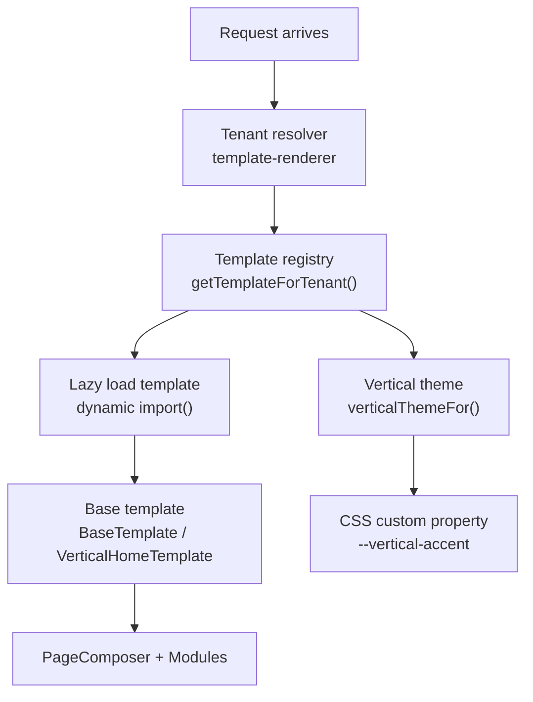
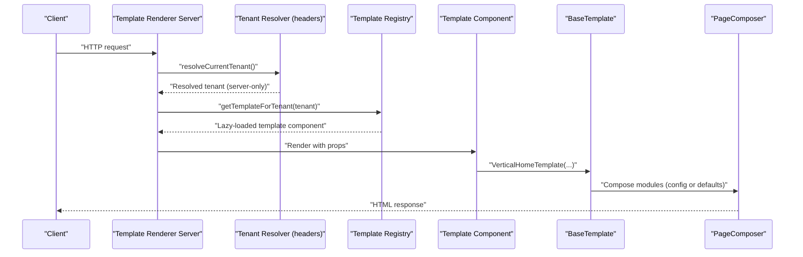
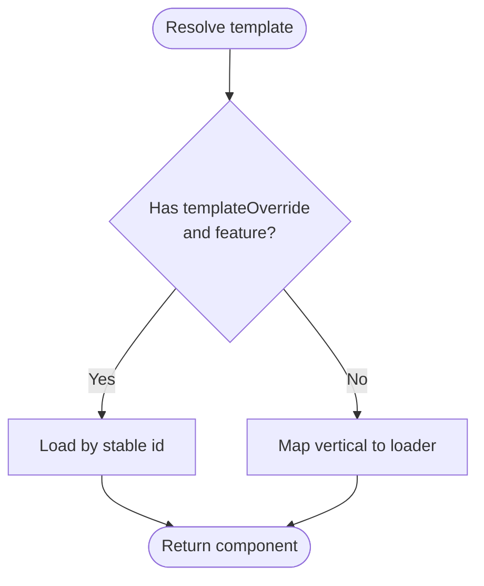
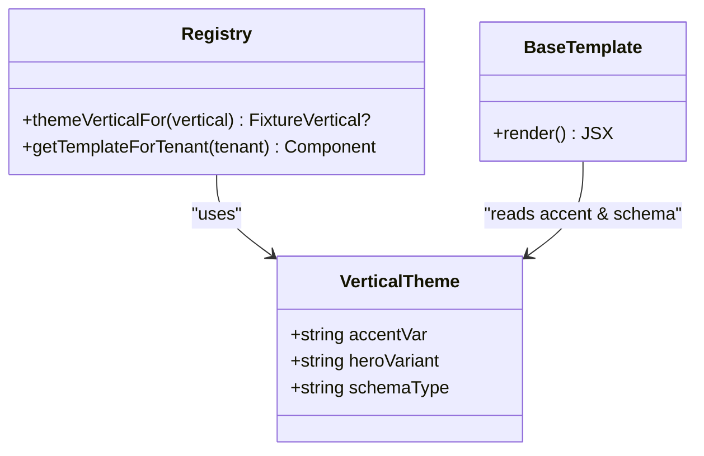
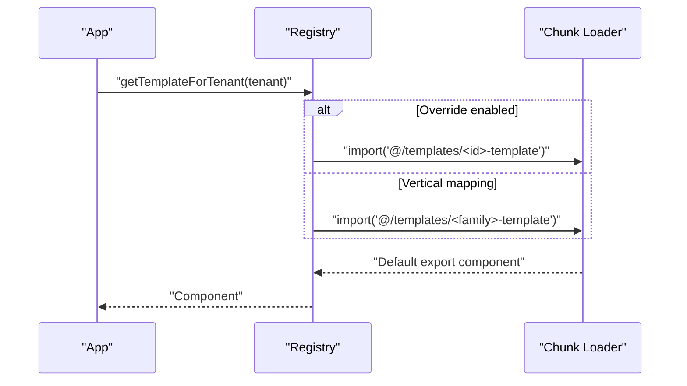
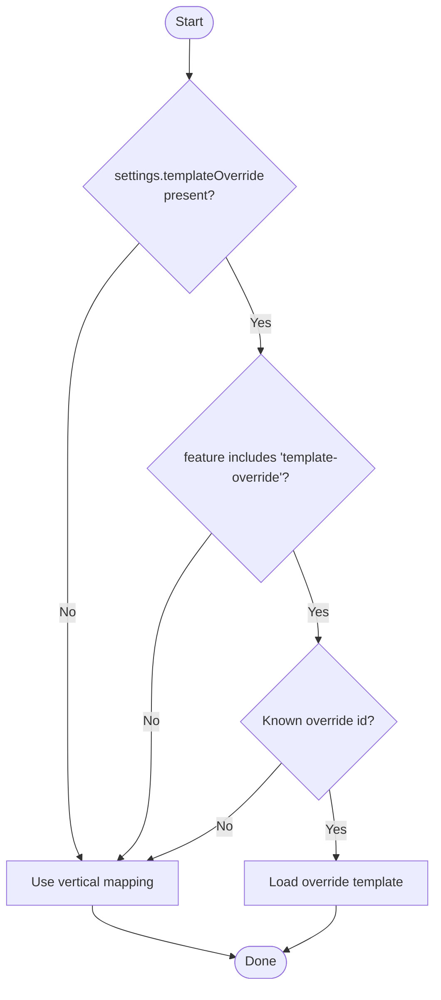
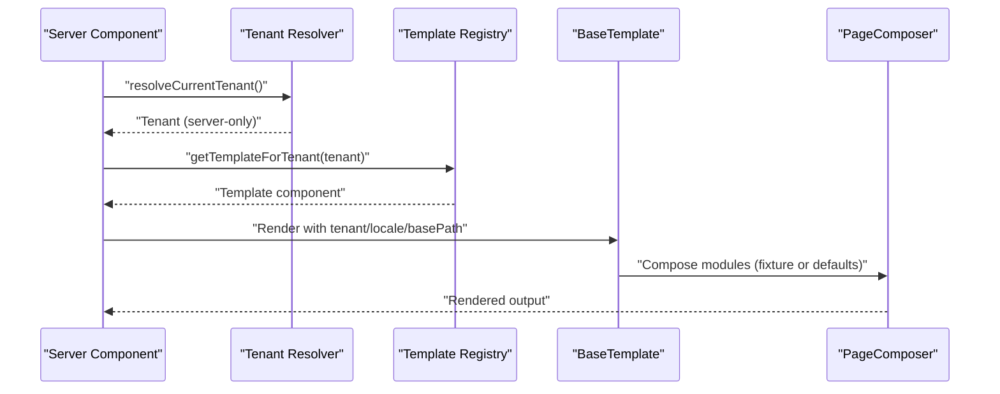
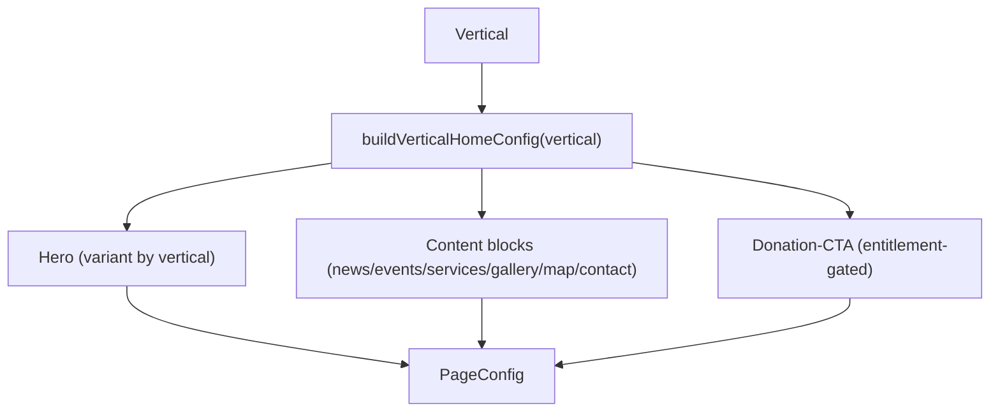
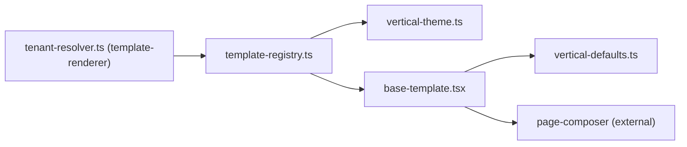

# Template System Architecture

<cite>
**Referenced Files in This Document**
- [template-registry.ts](file://frontend/apps/template-renderer/src/lib/template-registry.ts)
- [vertical-theme.ts](file://frontend/apps/template-renderer/src/lib/vertical-theme.ts)
- [vertical-defaults.ts](file://frontend/apps/template-renderer/src/lib/vertical-defaults.ts)
- [base-template.tsx](file://frontend/apps/template-renderer/src/templates/base-template.tsx)
- [church-template.tsx](file://frontend/apps/template-renderer/src/templates/church-template.tsx)
- [tenant-resolver.ts (template-renderer)](file://frontend/apps/template-renderer/src/lib/tenant-resolver.ts)
- [resolver.ts (master-site)](file://frontend/apps/master-site/src/lib/tenant/resolver.ts)
</cite>

## Table of Contents
1. Introduction
2. Project Structure
3. Core Components
4. Architecture Overview
5. Detailed Component Analysis
6. Dependency Analysis
7. Performance Considerations
8. Troubleshooting Guide
9. Conclusion

## Introduction
This document explains the template system architecture that powers dynamic site generation for different religious institution types. It covers:
- The template registry mechanism that maps tenant verticals to template components
- Vertical taxonomy mapping and theme accent assignment
- Lazy loading strategies for per-vertical templates
- Template override functionality gated by features
- The end-to-end lifecycle from tenant resolution to component rendering
- Practical guidance for creating new templates, implementing overrides, and understanding data-driven customization

The system supports verticals including basilica, cathedral, church, diocese, deanery, funeral, and cemetery-cleaning, with consistent composition via shared modules and a design-system-driven accent model.

## Project Structure
At a high level, the template renderer app provides:
- A template registry that resolves a React component based on tenant vertical or admin override
- Vertical theming utilities that map verticals to CSS accents, hero variants, and schema.org types
- Default home compositions per vertical when no backend page config is present
- Shared base template logic that sets up structured data, analytics placeholders, and module composition
- Tenant resolution adapters for server components and master-site subdomain routing

**Diagram sources**
- [tenant-resolver.ts (template-renderer):1-35](file://frontend/apps/template-renderer/src/lib/tenant-resolver.ts#L1-L35)
- [template-registry.ts:38-76](file://frontend/apps/template-renderer/src/lib/template-registry.ts#L38-L76)
- [vertical-theme.ts:26-62](file://frontend/apps/template-renderer/src/lib/vertical-theme.ts#L26-L62)
- [base-template.tsx:44-94](file://frontend/apps/template-renderer/src/templates/base-template.tsx#L44-L94)

**Section sources**
- [tenant-resolver.ts (template-renderer):1-35](file://frontend/apps/template-renderer/src/lib/tenant-resolver.ts#L1-L35)
- [resolver.ts (master-site):1-678](file://frontend/apps/master-site/src/lib/tenant/resolver.ts#L1-L678)
- [template-registry.ts:1-109](file://frontend/apps/template-renderer/src/lib/template-registry.ts#L1-L109)
- [vertical-theme.ts:1-63](file://frontend/apps/template-renderer/src/lib/vertical-theme.ts#L1-L63)
- [vertical-defaults.ts:1-108](file://frontend/apps/template-renderer/src/lib/vertical-defaults.ts#L1-L108)
- [base-template.tsx:1-95](file://frontend/apps/template-renderer/src/templates/base-template.tsx#L1-L95)
- [church-template.tsx:1-21](file://frontend/apps/template-renderer/src/templates/church-template.tsx#L1-L21)

## Core Components
- Template Registry: Maps canonical verticals to lazy-loaded template components and supports feature-gated admin overrides.
- Vertical Theme: Defines accent tokens, hero variants, and schema.org types per vertical; exposes helpers to inject CSS variables.
- Vertical Defaults: Provides default home page module sequences per vertical when no backend content is available.
- Base Template: Sets up structured data, analytics placeholder, and delegates to PageComposer for module rendering.
- Tenant Resolver (template-renderer): Bridges Next.js headers to the shared tenant resolver for server components.
- Master-site Resolver: Subdomain-based tenant lookup (development mock included; production-ready hooks documented).

Key responsibilities:
- Resolve which template to render based on tenant.vertical or settings.templateOverride
- Apply vertical-specific visual identity without duplicating UI code
- Compose pages from reusable modules with optional fixture/backend content
- Keep sensitive tenant context server-only and expose safe public data to clients

**Section sources**
- [template-registry.ts:19-76](file://frontend/apps/template-renderer/src/lib/template-registry.ts#L19-L76)
- [vertical-theme.ts:17-62](file://frontend/apps/template-renderer/src/lib/vertical-theme.ts#L17-L62)
- [vertical-defaults.ts:14-108](file://frontend/apps/template-renderer/src/lib/vertical-defaults.ts#L14-L108)
- [base-template.tsx:19-94](file://frontend/apps/template-renderer/src/templates/base-template.tsx#L19-L94)
- [tenant-resolver.ts (template-renderer):1-35](file://frontend/apps/template-renderer/src/lib/tenant-resolver.ts#L1-L35)
- [resolver.ts (master-site):516-578](file://frontend/apps/master-site/src/lib/tenant/resolver.ts#L516-L578)

## Architecture Overview
The runtime flow connects request handling to template rendering:

**Diagram sources**
- [tenant-resolver.ts (template-renderer):21-34](file://frontend/apps/template-renderer/src/lib/tenant-resolver.ts#L21-L34)
- [template-registry.ts:66-76](file://frontend/apps/template-renderer/src/lib/template-registry.ts#L66-L76)
- [base-template.tsx:82-94](file://frontend/apps/template-renderer/src/templates/base-template.tsx#L82-L94)

## Detailed Component Analysis

### Template Registry Mechanism
- Vertical-to-template mapping: Canonical verticals are mapped to specific template modules. Multiple sacred-family verticals share one template chunk to reduce bundle size.
- Admin override: If a tenant has a valid templateOverride id and includes the 'template-override' feature, the registry uses it; otherwise it falls back to vertical-based mapping.
- Lazy loading: Each template is loaded via dynamic import(), ensuring visitors only download the relevant vertical’s code.

**Diagram sources**
- [template-registry.ts:38-76](file://frontend/apps/template-renderer/src/lib/template-registry.ts#L38-L76)

**Section sources**
- [template-registry.ts:38-76](file://frontend/apps/template-renderer/src/lib/template-registry.ts#L38-L76)

### Vertical Taxonomy Mapping and Theme Accent
- Vertical themes define:
  - accentVar: CSS custom property value bound to --vertical-accent
  - heroVariant: Visual treatment for the hero section
  - schemaType: schema.org Organization subtype for SEO
- Mapping examples:
  - Sacred family (basilica, cathedral, church, protestant, orthodox, other-church, diaconate) use church-oriented accents and hero variants
  - Administrative (diocese, deanery) use formal styling
  - Memorial (funeral) uses subdued styling
  - Service (cemetery-cleaning) uses fresh green accents
- Unknown verticals fall back to a neutral church theme to avoid breakage.

**Diagram sources**
- [vertical-theme.ts:17-62](file://frontend/apps/template-renderer/src/lib/vertical-theme.ts#L17-L62)
- [template-registry.ts:83-108](file://frontend/apps/template-renderer/src/lib/template-registry.ts#L83-L108)
- [base-template.tsx:44-55](file://frontend/apps/template-renderer/src/templates/base-template.tsx#L44-L55)

**Section sources**
- [vertical-theme.ts:26-62](file://frontend/apps/template-renderer/src/lib/vertical-theme.ts#L26-L62)
- [template-registry.ts:83-108](file://frontend/apps/template-renderer/src/lib/template-registry.ts#L83-L108)
- [base-template.tsx:44-55](file://frontend/apps/template-renderer/src/templates/base-template.tsx#L44-L55)

### Lazy Loading Strategies
- Per-vertical templates are dynamically imported, so each vertical ships as its own chunk.
- This ensures minimal payload for visitors (e.g., funeral visitors do not download diocese template code).
- Overrides also use dynamic imports keyed by stable ids.

**Diagram sources**
- [template-registry.ts:38-76](file://frontend/apps/template-renderer/src/lib/template-registry.ts#L38-L76)

**Section sources**
- [template-registry.ts:38-76](file://frontend/apps/template-renderer/src/lib/template-registry.ts#L38-L76)

### Template Override Functionality
- Admins can set a stable template id in tenant settings.
- Overrides are applied only if the tenant package includes the 'template-override' feature.
- Unknown override ids fall back to the vertical-based mapping to maintain stability.

**Diagram sources**
- [template-registry.ts:66-76](file://frontend/apps/template-renderer/src/lib/template-registry.ts#L66-L76)

**Section sources**
- [template-registry.ts:66-76](file://frontend/apps/template-renderer/src/lib/template-registry.ts#L66-L76)

### Template Lifecycle: From Tenant Resolution to Rendering
- Server-side tenant resolution reads headers and returns the full tenant record (including schema) for server-only usage.
- The template registry selects a template based on vertical or override.
- The base template sets structured data, applies vertical accent, and composes modules via PageComposer.
- When backend content exists, it renders fixtures/pages; otherwise, it uses vertical default compositions.

**Diagram sources**
- [tenant-resolver.ts (template-renderer):21-34](file://frontend/apps/template-renderer/src/lib/tenant-resolver.ts#L21-L34)
- [template-registry.ts:66-76](file://frontend/apps/template-renderer/src/lib/template-registry.ts#L66-L76)
- [base-template.tsx:44-94](file://frontend/apps/template-renderer/src/templates/base-template.tsx#L44-L94)

**Section sources**
- [tenant-resolver.ts (template-renderer):21-34](file://frontend/apps/template-renderer/src/lib/tenant-resolver.ts#L21-L34)
- [base-template.tsx:44-94](file://frontend/apps/template-renderer/src/templates/base-template.tsx#L44-L94)

### Vertical Home Composition Defaults
- For tenants without backend page configs, the system builds a default home composition per vertical.
- Compositions include hero, news/events, services, gallery, map, contact, and donation-cta where appropriate.
- Commercial modules are gated by entitlements; donations default OFF per policy.

**Diagram sources**
- [vertical-defaults.ts:14-108](file://frontend/apps/template-renderer/src/lib/vertical-defaults.ts#L14-L108)

**Section sources**
- [vertical-defaults.ts:32-108](file://frontend/apps/template-renderer/src/lib/vertical-defaults.ts#L32-L108)

### Conceptual Overview
- The system separates concerns:
  - Tenant resolution is server-only and secure
  - Templates are thin compositions driven by data
  - Theming is tokenized and scoped via CSS custom properties
  - Module composition is declarative and configurable

[No sources needed since this diagram shows conceptual workflow, not actual code structure]

## Dependency Analysis
The following diagram shows how core files depend on each other during rendering:

**Diagram sources**
- [tenant-resolver.ts (template-renderer):21-34](file://frontend/apps/template-renderer/src/lib/tenant-resolver.ts#L21-L34)
- [template-registry.ts:66-76](file://frontend/apps/template-renderer/src/lib/template-registry.ts#L66-L76)
- [vertical-theme.ts:52-62](file://frontend/apps/template-renderer/src/lib/vertical-theme.ts#L52-L62)
- [base-template.tsx:44-94](file://frontend/apps/template-renderer/src/templates/base-template.tsx#L44-L94)
- [vertical-defaults.ts:32-108](file://frontend/apps/template-renderer/src/lib/vertical-defaults.ts#L32-L108)

**Section sources**
- [template-registry.ts:38-76](file://frontend/apps/template-renderer/src/lib/template-registry.ts#L38-L76)
- [vertical-theme.ts:26-62](file://frontend/apps/template-renderer/src/lib/vertical-theme.ts#L26-L62)
- [vertical-defaults.ts:32-108](file://frontend/apps/template-renderer/src/lib/vertical-defaults.ts#L32-L108)
- [base-template.tsx:44-94](file://frontend/apps/template-renderer/src/templates/base-template.tsx#L44-L94)
- [tenant-resolver.ts (template-renderer):21-34](file://frontend/apps/template-renderer/src/lib/tenant-resolver.ts#L21-L34)

## Performance Considerations
- Lazy loading per vertical reduces initial bundle size and improves Time to Interactive.
- Shared sacred-family templates minimize duplication across related verticals.
- Default compositions avoid unnecessary network calls when backend content is absent; modules fetch collections lazily.
- Server-only tenant context prevents leaking sensitive data to clients.

[No sources needed since this section provides general guidance]

## Troubleshooting Guide
Common issues and resolutions:
- Unknown vertical mapping: Falls back to church theme; verify vertical values and mappings.
- Override not applied: Ensure tenant features include 'template-override' and the override id is known.
- Missing accent styles: Confirm --vertical-accent is set on the template wrapper and CSS targets [data-vertical].
- No content rendered: Verify whether backend page config exists; otherwise check vertical default composition for expected modules.

**Section sources**
- [template-registry.ts:66-76](file://frontend/apps/template-renderer/src/lib/template-registry.ts#L66-L76)
- [vertical-theme.ts:52-62](file://frontend/apps/template-renderer/src/lib/vertical-theme.ts#L52-L62)
- [base-template.tsx:65-94](file://frontend/apps/template-renderer/src/templates/base-template.tsx#L65-L94)

## Conclusion
The template system cleanly separates tenant resolution, template selection, theming, and composition. It supports multiple religious institution verticals through a data-driven approach, enabling scalable customization while maintaining performance and security. New verticals can be added by extending mappings, themes, and default compositions, and overrides allow controlled customization for eligible tenants.

[No sources needed since this section summarizes without analyzing specific files]