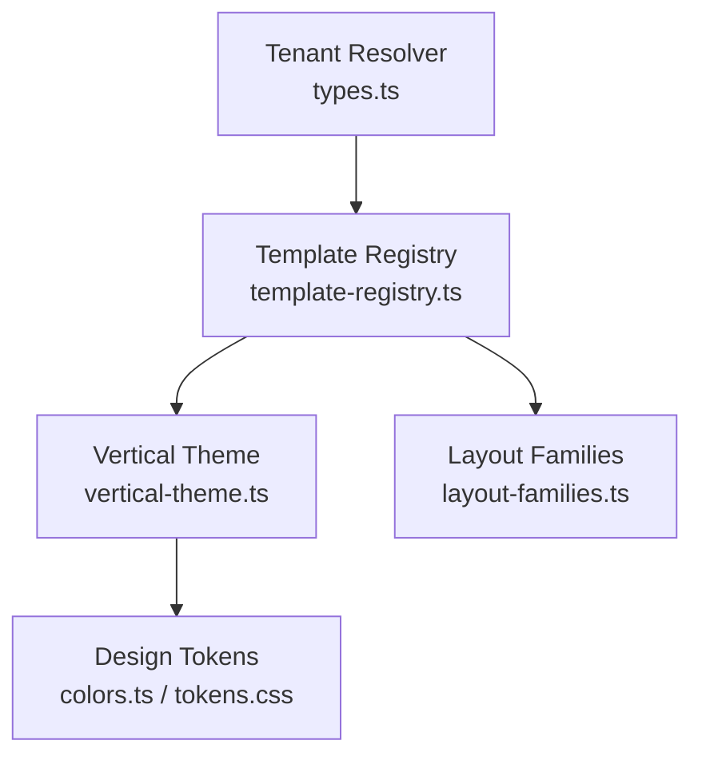
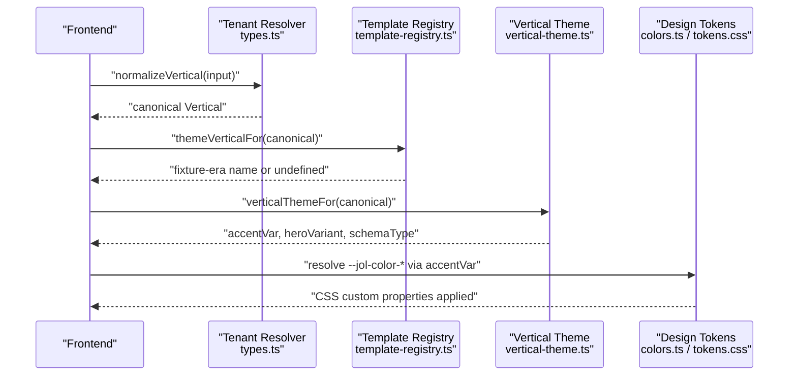
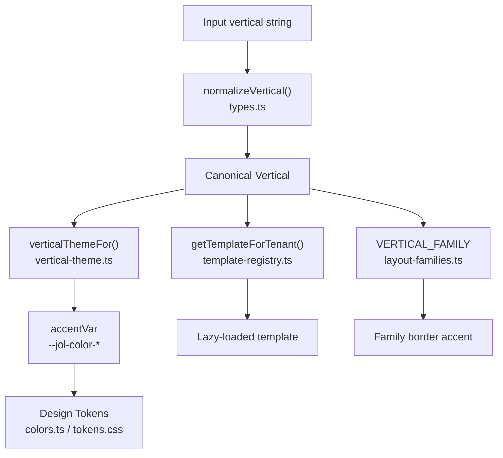

# Vertical Taxonomy Mapping

<cite>
**Referenced Files in This Document**
- [types.ts](file://frontend/packages/tenant-resolver/src/types.ts)
- [vertical-theme.ts](file://frontend/apps/template-renderer/src/lib/vertical-theme.ts)
- [layout-families.ts](file://frontend/apps/template-renderer/src/lib/layout-families.ts)
- [template-registry.ts](file://frontend/apps/template-renderer/src/lib/template-registry.ts)
- [colors.ts](file://frontend/packages/ui/src/tokens/colors.ts)
- [tokens.css](file://frontend/packages/ui/src/styles/tokens.css)
- [vertical-taxonomy-mapping.md](file://docs/architecture/vertical-taxonomy-mapping.md)
</cite>

## Table of Contents
1. [Introduction](#introduction)
2. [Project Structure](#project-structure)
3. [Core Components](#core-components)
4. [Architecture Overview](#architecture-overview)
5. [Detailed Component Analysis](#detailed-component-analysis)
6. [Dependency Analysis](#dependency-analysis)
7. [Performance Considerations](#performance-considerations)
8. [Troubleshooting Guide](#troubleshooting-guide)
9. [Conclusion](#conclusion)

## Introduction
This document explains the vertical taxonomy mapping system that bridges the canonical STEP-5 vertical taxonomy with design-system accent tokens used by the frontend. It focuses on how `themeVerticalFor` maps canonical verticals to fixture-era names so styling remains consistent across tenants, and how unknown mappings fall back to neutral primary accents. The abstraction ensures the frontend stays decoupled from backend taxonomy changes by centralizing normalization and mapping logic in a few well-defined modules.

## Project Structure
The mapping spans several layers:
- Canonical taxonomy definition and normalization live in the tenant resolver package.
- Template selection and theme mapping live in the template renderer app.
- Design-system tokens define the actual color values consumed via CSS custom properties.
- Layout families group verticals into structural families for shared visual treatment.

**Diagram sources**
- [types.ts:22-33](file://frontend/packages/tenant-resolver/src/types.ts#L22-L33)
- [template-registry.ts:38-50](file://frontend/apps/template-renderer/src/lib/template-registry.ts#L38-L50)
- [vertical-theme.ts:26-49](file://frontend/apps/template-renderer/src/lib/vertical-theme.ts#L26-L49)
- [colors.ts:254-267](file://frontend/packages/ui/src/tokens/colors.ts#L254-L267)
- [tokens.css:6-117](file://frontend/packages/ui/src/styles/tokens.css#L6-L117)
- [layout-families.ts:18-31](file://frontend/apps/template-renderer/src/lib/layout-families.ts#L18-L31)

**Section sources**
- [types.ts:22-33](file://frontend/packages/tenant-resolver/src/types.ts#L22-L33)
- [template-registry.ts:38-50](file://frontend/apps/template-renderer/src/lib/template-registry.ts#L38-L50)
- [vertical-theme.ts:26-49](file://frontend/apps/template-renderer/src/lib/vertical-theme.ts#L26-L49)
- [layout-families.ts:18-31](file://frontend/apps/template-renderer/src/lib/layout-families.ts#L18-L31)
- [colors.ts:254-267](file://frontend/packages/ui/src/tokens/colors.ts#L254-L267)
- [tokens.css:6-117](file://frontend/packages/ui/src/styles/tokens.css#L6-L117)

## Core Components
- Canonical vertical type and normalization: defines the stable set of verticals and normalizes legacy or variant names into this canonical set.
- Template registry: maps each canonical vertical to a lazy-loaded template and provides `themeVerticalFor`, which maps canonical verticals to fixture-era names used by design-system tokens.
- Vertical theme: maps each canonical vertical to a design-token-based accent variable, hero variant, and schema.org type; includes a defensive fallback to a neutral church theme.
- Layout families: groups verticals into structural families (sacred, eastern, administrative, memorial, congregation) for consistent layout and border accents.

Key responsibilities:
- Normalize input verticals to the canonical set before any styling decisions.
- Map canonical verticals to fixture-era names for token lookup.
- Resolve CSS custom property variables for accents without hard-coding colors in components.
- Provide safe defaults when encountering unknown verticals.

**Section sources**
- [types.ts:125-161](file://frontend/packages/tenant-resolver/src/types.ts#L125-L161)
- [template-registry.ts:78-108](file://frontend/apps/template-renderer/src/lib/template-registry.ts#L78-L108)
- [vertical-theme.ts:17-62](file://frontend/apps/template-renderer/src/lib/vertical-theme.ts#L17-L62)
- [layout-families.ts:15-48](file://frontend/apps/template-renderer/src/lib/layout-families.ts#L15-L48)

## Architecture Overview
The runtime flow resolves a tenant’s vertical into a consistent visual identity:

**Diagram sources**
- [types.ts:125-161](file://frontend/packages/tenant-resolver/src/types.ts#L125-L161)
- [template-registry.ts:78-108](file://frontend/apps/template-renderer/src/lib/template-registry.ts#L78-L108)
- [vertical-theme.ts:51-62](file://frontend/apps/template-renderer/src/lib/vertical-theme.ts#L51-L62)
- [colors.ts:254-267](file://frontend/packages/ui/src/tokens/colors.ts#L254-L267)
- [tokens.css:6-117](file://frontend/packages/ui/src/styles/tokens.css#L6-L117)

## Detailed Component Analysis

### Canonical Vertical Type and Normalization
- Defines the canonical set of verticals used throughout the system.
- Normalizes fixture-era aliases (e.g., parish/chapel → church; cemetery → cemetery-cleaning; orthodox-church → orthodox; protestant-church → protestant; monastery/greek-catholic → other-church).
- Unknown inputs fall back to other-church to ensure a stable default.

Impact:
- Guarantees downstream modules operate against a single source of truth.
- Reduces branching in UI code by centralizing taxonomy reconciliation.

**Section sources**
- [types.ts:22-33](file://frontend/packages/tenant-resolver/src/types.ts#L22-L33)
- [types.ts:125-161](file://frontend/packages/tenant-resolver/src/types.ts#L125-L161)

### Template Registry and themeVerticalFor
- Maps each canonical vertical to a lazy-loaded template component.
- Provides `themeVerticalFor`, which maps canonical verticals to fixture-era names used by design-system tokens:
  - basilica → basilica
  - cathedral → cathedral
  - diocese → diocese
  - deanery → deanery
  - church, diaconate, other-church → parish
  - protestant → protestant-church
  - orthodox → orthodox-church
  - funeral → funeral-home
  - cemetery-cleaning → cemetery
  - unknown → undefined (components use neutral primary accent)

Rationale:
- Keeps components free of taxonomy details; they consume stable fixture-era names for token lookup.
- Centralizes mapping so backend taxonomy changes only require updates here.

**Section sources**
- [template-registry.ts:38-50](file://frontend/apps/template-renderer/src/lib/template-registry.ts#L38-L50)
- [template-registry.ts:78-108](file://frontend/apps/template-renderer/src/lib/template-registry.ts#L78-L108)

### Vertical Theme Mapping
- Maps each canonical vertical to:
  - accentVar: a CSS custom property reference like var(--jol-color-accent), var(--jol-color-primary-700), etc.
  - heroVariant: a visual treatment selector (church/funeral/cleaning/default).
  - schemaType: an SEO Organization subtype.
- Defensive fallback: if a vertical is not found, returns the church theme (neutral primary accent).

Mapping table (canonical vertical → accent strategy):
- basilica: warm gold/amber accent (var(--jol-color-accent))
- cathedral: deep primary accent (var(--jol-color-primary-700))
- church: warm gold/amber accent (var(--jol-color-accent))
- orthodox: secondary dark accent (var(--jol-color-secondary-800))
- protestant: success green accent (var(--jol-color-success-700))
- other-church: primary accent (var(--jol-color-primary))
- diaconate: primary medium accent (var(--jol-color-primary-600))
- diocese: secondary dark accent (var(--jol-color-secondary-800))
- deanery: primary medium accent (var(--jol-color-primary-600))
- funeral: stone muted accent (var(--jol-color-stone-700))
- cemetery-cleaning: success green accent (var(--jol-color-success-700))

Fallback behavior:
- Unknown verticals resolve to the church theme, ensuring a neutral primary accent is always applied.

**Section sources**
- [vertical-theme.ts:26-62](file://frontend/apps/template-renderer/src/lib/vertical-theme.ts#L26-L62)

### Layout Families
- Groups verticals into structural families for consistent layout and border accents:
  - sacred: basilica, cathedral, church, chapel, monastery
  - eastern: orthodox-church, greek-catholic
  - administrative: diocese, deanery
  - memorial: cemetery, funeral-home
  - congregation: protestant-church
- Family-level accent overrides exist (e.g., cemetery care gets fresh green instead of standard memorial grey).

Purpose:
- Ensures consistent structural presentation across verticals within the same family.
- Separates layout concerns from token-specific styling.

**Section sources**
- [layout-families.ts:15-48](file://frontend/apps/template-renderer/src/lib/layout-families.ts#L15-L48)

### Design System Tokens
- All color values are defined centrally in tokens and generated into CSS custom properties under the --jol-color-* namespace.
- Vertical accents are referenced via these tokens; no hex values appear in component code.
- Generated CSS exposes variables such as --jol-color-primary, --jol-color-accent, --jol-color-success-700, etc.

Integration:
- Vertical themes reference these variables through accentVar strings.
- Components apply them via inline style objects or scoped attributes, keeping styling data-driven.

**Section sources**
- [colors.ts:254-267](file://frontend/packages/ui/src/tokens/colors.ts#L254-L267)
- [tokens.css:6-117](file://frontend/packages/ui/src/styles/tokens.css#L6-L117)

## Dependency Analysis
The following diagram shows how the vertical taxonomy flows through the system to produce final styling:

**Diagram sources**
- [types.ts:125-161](file://frontend/packages/tenant-resolver/src/types.ts#L125-L161)
- [vertical-theme.ts:51-62](file://frontend/apps/template-renderer/src/lib/vertical-theme.ts#L51-L62)
- [template-registry.ts:66-76](file://frontend/apps/template-renderer/src/lib/template-registry.ts#L66-L76)
- [layout-families.ts:18-31](file://frontend/apps/template-renderer/src/lib/layout-families.ts#L18-L31)
- [colors.ts:254-267](file://frontend/packages/ui/src/tokens/colors.ts#L254-L267)
- [tokens.css:6-117](file://frontend/packages/ui/src/styles/tokens.css#L6-L117)

**Section sources**
- [types.ts:125-161](file://frontend/packages/tenant-resolver/src/types.ts#L125-L161)
- [vertical-theme.ts:51-62](file://frontend/apps/template-renderer/src/lib/vertical-theme.ts#L51-L62)
- [template-registry.ts:66-76](file://frontend/apps/template-renderer/src/lib/template-registry.ts#L66-L76)
- [layout-families.ts:18-31](file://frontend/apps/template-renderer/src/lib/layout-families.ts#L18-L31)
- [colors.ts:254-267](file://frontend/packages/ui/src/tokens/colors.ts#L254-L267)
- [tokens.css:6-117](file://frontend/packages/ui/src/styles/tokens.css#L6-L117)

## Performance Considerations
- Lazy loading of templates per vertical reduces bundle size; visitors only download the template relevant to their vertical.
- Token resolution uses CSS custom properties, avoiding heavy runtime computations in components.
- Centralized mapping functions are pure and fast; they avoid repeated lookups by being called once during rendering setup.

[No sources needed since this section provides general guidance]

## Troubleshooting Guide
Common issues and resolutions:
- Unknown vertical appears: Ensure the input has been normalized via normalizeVertical first. If still unknown, it will fall back to other-church for taxonomy and church theme for styling.
- Incorrect accent color: Verify that the vertical maps correctly in both verticalThemeFor and themeVerticalFor. Check that the corresponding CSS custom property exists in tokens.css.
- Template mismatch: Confirm that getTemplateForTenant resolves the expected template based on tenant.vertical. Admin template overrides require the 'template-override' feature flag.

**Section sources**
- [types.ts:125-161](file://frontend/packages/tenant-resolver/src/types.ts#L125-L161)
- [vertical-theme.ts:51-62](file://frontend/apps/template-renderer/src/lib/vertical-theme.ts#L51-L62)
- [template-registry.ts:66-76](file://frontend/apps/template-renderer/src/lib/template-registry.ts#L66-L76)
- [template-registry.ts:78-108](file://frontend/apps/template-renderer/src/lib/template-registry.ts#L78-L108)

## Conclusion
The vertical taxonomy mapping system centralizes canonicalization and mapping logic to keep the frontend decoupled from backend taxonomy changes. By normalizing inputs, mapping canonical verticals to fixture-era names for token lookup, and resolving CSS custom properties through a single source of truth, the system ensures consistent styling, safe defaults, and maintainable architecture. The design-system tokens enforce WCAG contrast and prevent ad-hoc color usage, while layout families provide structural consistency across related verticals.

[No sources needed since this section summarizes without analyzing specific files]