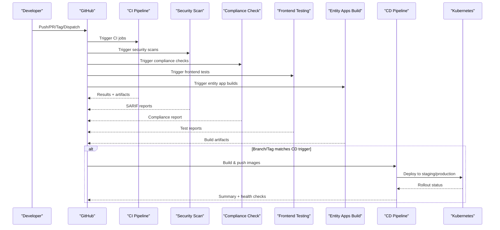
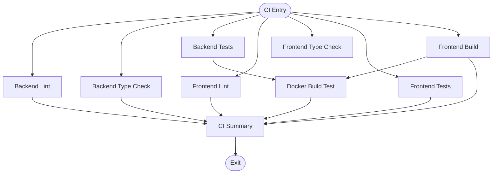
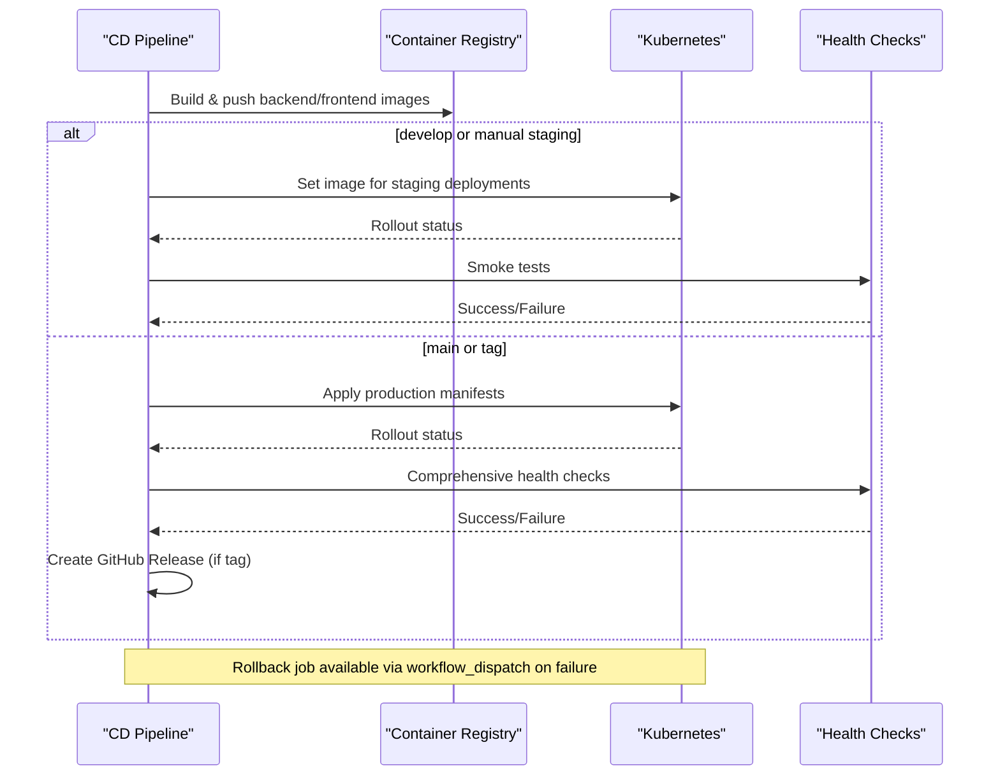
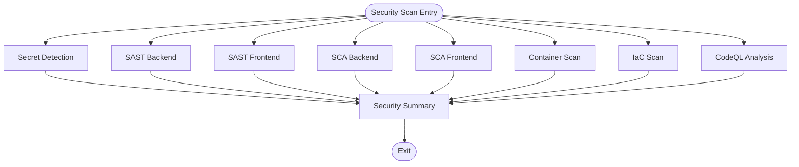
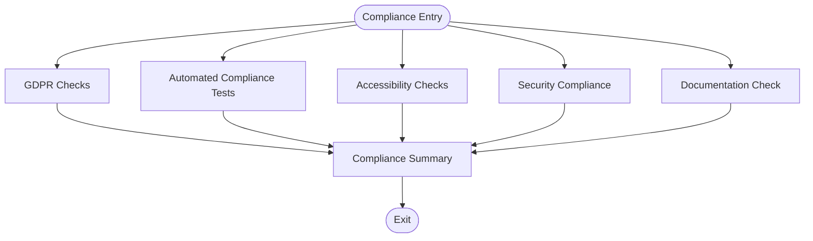
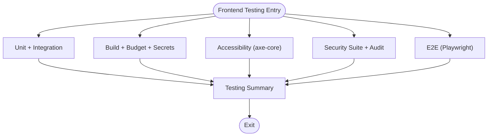
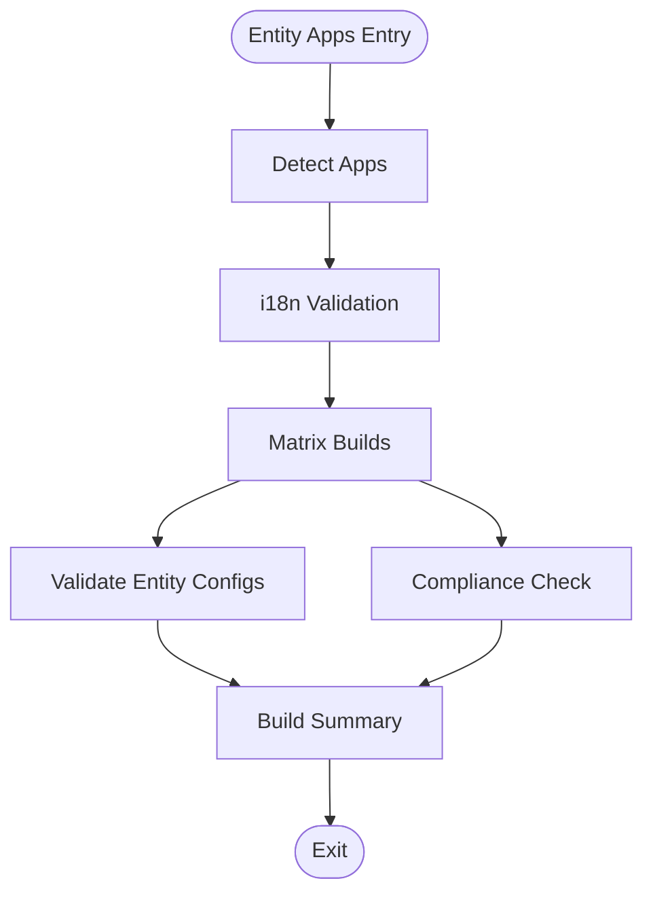
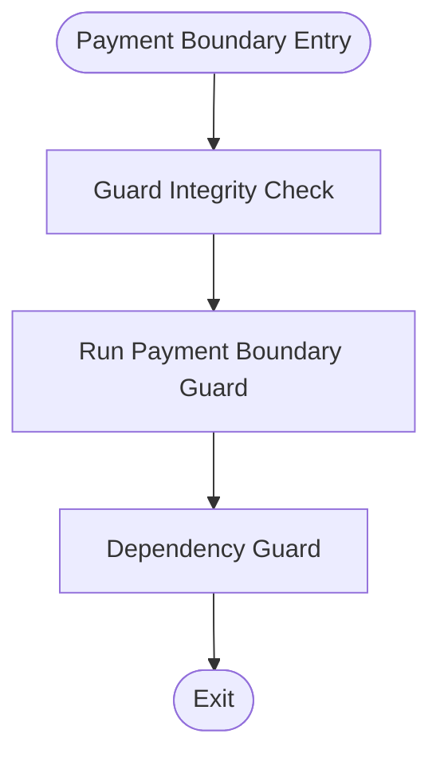
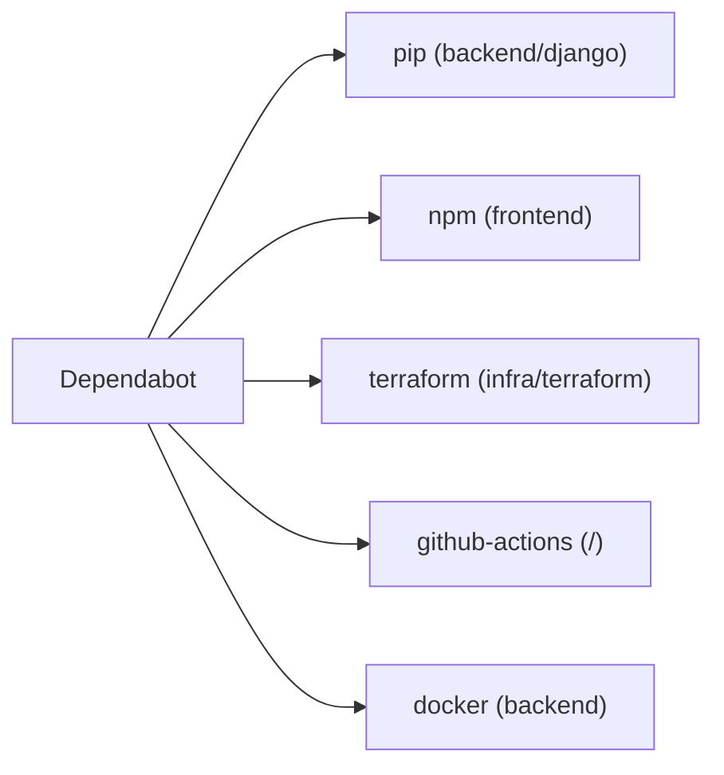

# CI/CD Pipelines

<cite>
**Referenced Files in This Document**
- [ci.yml](file://.github/workflows/ci.yml)
- [cd.yml](file://.github/workflows/cd.yml)
- [security-scan.yml](file://.github/workflows/security-scan.yml)
- [compliance-check.yml](file://.github/workflows/compliance-check.yml)
- [frontend-test.yml](file://.github/workflows/frontend-test.yml)
- [entity-apps.yml](file://.github/workflows/entity-apps.yml)
- [payment-boundary-guard.yml](file://.github/workflows/payment-boundary-guard.yml)
- [release.yml](file://.github/workflows/release.yml)
- [dependabot.yml](file://.github/dependabot.yml)
- [Dockerfile](file://backend/Dockerfile)
</cite>

## Table of Contents
1. [Introduction](#introduction)
2. [Project Structure](#project-structure)
3. [Core Components](#core-components)
4. [Architecture Overview](#architecture-overview)
5. [Detailed Component Analysis](#detailed-component-analysis)
6. [Dependency Analysis](#dependency-analysis)
7. [Performance Considerations](#performance-considerations)
8. [Troubleshooting Guide](#troubleshooting-guide)
9. [Conclusion](#conclusion)
10. [Appendices](#appendices)

## Introduction
This document describes the JOL-HUB platform’s CI/CD pipelines implemented with GitHub Actions. It covers automated testing, code quality checks, container builds, security and compliance scans, and deployment automation to staging and production environments. It also explains environment-specific configurations, artifact management, rollback procedures, pipeline monitoring, and guidance for customization and extending pipelines.

## Project Structure
The CI/CD system is organized into multiple workflows that run on different triggers:
- Continuous Integration (CI): linting, type checking, unit/integration tests, frontend build, Docker build test
- Continuous Deployment (CD): build/push images, deploy to staging and production, rollback
- Security Scans: secret detection, SAST, SCA, container scanning, IaC scanning, CodeQL
- Compliance Checks: GDPR, accessibility, security posture, documentation validation
- Frontend Testing: unit/integration, build gate, a11y, security, E2E
- Entity Apps Build: multi-app matrix builds with i18n validation and entity config checks
- Payment Boundary Guard: enforces architectural boundaries around payments
- Release: versioning and publishing via Changesets

```mermaid
graph TB
subgraph "Triggers"
PR["Pull Requests"]
PUSH["Push to main/develop"]
TAGS["Tags v*"]
SCHEDULE["Scheduled Cron"]
DISPATCH["Manual Dispatch"]
end
subgraph "CI"
CI["CI Pipeline"]
end
subgraph "Security & Compliance"
SEC["Security Scan"]
COMP["Compliance Check"]
PAY["Payment Boundary Guard"]
end
subgraph "Frontend"
FE_TEST["Frontend Testing"]
ENT_BUILD["Entity Apps Build"]
end
subgraph "CD"
CD["CD Pipeline"]
end
PR --> CI
PR --> FE_TEST
PR --> ENT_BUILD
PR --> SEC
PR --> COMP
PR --> PAY
PUSH --> CI
PUSH --> SEC
PUSH --> COMP
PUSH --> CD
TAGS --> CD
SCHEDULE --> SEC
SCHEDULE --> COMP
DISPATCH --> CD
```

**Diagram sources**
- [ci.yml:1-379](file://.github/workflows/ci.yml#L1-L379)
- [cd.yml:1-335](file://.github/workflows/cd.yml#L1-L335)
- [security-scan.yml:1-379](file://.github/workflows/security-scan.yml#L1-L379)
- [compliance-check.yml:1-591](file://.github/workflows/compliance-check.yml#L1-L591)
- [frontend-test.yml:1-208](file://.github/workflows/frontend-test.yml#L1-L208)
- [entity-apps.yml:1-372](file://.github/workflows/entity-apps.yml#L1-L372)
- [payment-boundary-guard.yml:1-59](file://.github/workflows/payment-boundary-guard.yml#L1-L59)

**Section sources**
- [ci.yml:1-379](file://.github/workflows/ci.yml#L1-L379)
- [cd.yml:1-335](file://.github/workflows/cd.yml#L1-L335)
- [security-scan.yml:1-379](file://.github/workflows/security-scan.yml#L1-L379)
- [compliance-check.yml:1-591](file://.github/workflows/compliance-check.yml#L1-L591)
- [frontend-test.yml:1-208](file://.github/workflows/frontend-test.yml#L1-L208)
- [entity-apps.yml:1-372](file://.github/workflows/entity-apps.yml#L1-L372)
- [payment-boundary-guard.yml:1-59](file://.github/workflows/payment-boundary-guard.yml#L1-L59)

## Core Components
- CI Pipeline: Linting and formatting for backend and frontend; type checks; unit and integration tests with services; frontend build; Docker build test; summary job.
- CD Pipeline: Builds and pushes backend/frontend images to GitHub Container Registry; deploys to staging and production using kubectl; smoke/health checks; release creation; rollback job.
- Security Scan: Secret detection (Gitleaks, TruffleHog), SAST (Bandit, Semgrep), SCA (Safety, pip-audit, pnpm audit, Snyk), container scanning (Trivy), IaC scanning (Checkov, Terrascan), CodeQL analysis.
- Compliance Check: GDPR checks, automated compliance tests (GDPR/SOC2/PCI-DSS), accessibility checks (WCAG), security posture checks, documentation validation.
- Frontend Testing: Unit/integration suites, build gate with performance budget and secret scan, accessibility scans, security suite, Playwright E2E across browsers.
- Entity Apps Build: Detects changed apps, validates i18n keys, builds apps in parallel, validates entity configs, runs compliance checks, summarizes results.
- Payment Boundary Guard: Enforces payment boundary rules and dependency constraints.
- Release: Versioning and publishing via Changesets.

**Section sources**
- [ci.yml:31-379](file://.github/workflows/ci.yml#L31-L379)
- [cd.yml:34-335](file://.github/workflows/cd.yml#L34-L335)
- [security-scan.yml:30-379](file://.github/workflows/security-scan.yml#L30-L379)
- [compliance-check.yml:42-591](file://.github/workflows/compliance-check.yml#L42-L591)
- [frontend-test.yml:33-208](file://.github/workflows/frontend-test.yml#L33-L208)
- [entity-apps.yml:45-372](file://.github/workflows/entity-apps.yml#L45-L372)
- [payment-boundary-guard.yml:26-59](file://.github/workflows/payment-boundary-guard.yml#L26-L59)
- [release.yml:1-48](file://.github/workflows/release.yml#L1-L48)

## Architecture Overview
The pipeline architecture separates concerns across CI, security/compliance, frontend testing, and CD. Jobs are orchestrated with dependencies to ensure quality gates before deployment. Artifacts and reports are uploaded for traceability.



**Diagram sources**
- [ci.yml:31-379](file://.github/workflows/ci.yml#L31-L379)
- [security-scan.yml:30-379](file://.github/workflows/security-scan.yml#L30-L379)
- [compliance-check.yml:42-591](file://.github/workflows/compliance-check.yml#L42-L591)
- [frontend-test.yml:33-208](file://.github/workflows/frontend-test.yml#L33-L208)
- [entity-apps.yml:45-372](file://.github/workflows/entity-apps.yml#L45-L372)
- [cd.yml:34-335](file://.github/workflows/cd.yml#L34-L335)

## Detailed Component Analysis

### CI Pipeline
- Backend lint/type/test: Black, isort, flake8, mypy; Django tests with PostgreSQL and Redis services; coverage upload to Codecov.
- Frontend lint/type/test/build: ESLint, Prettier, TypeScript check, Vitest/node:test, Next.js build; artifacts uploaded.
- Docker build test: Validates backend image build with caching.
- Summary: Aggregates job statuses and fails if any critical job failed.



**Diagram sources**
- [ci.yml:31-379](file://.github/workflows/ci.yml#L31-L379)

**Section sources**
- [ci.yml:36-174](file://.github/workflows/ci.yml#L36-L174)
- [ci.yml:179-316](file://.github/workflows/ci.yml#L179-L316)
- [ci.yml:321-379](file://.github/workflows/ci.yml#L321-L379)

### CD Pipeline
- Image build/push: Uses metadata action to tag images by branch, PR, semver, SHA, and latest on main; caches layers via GHA cache.
- Staging deployment: Applies image updates via kubectl, waits for rollout, runs smoke tests, posts summary.
- Production deployment: Creates manifests, applies deployments, waits for rollout, runs comprehensive health checks, creates GitHub Releases for tags.
- Rollback: Reverts deployments using kubectl rollout undo based on selected environment.



**Diagram sources**
- [cd.yml:39-148](file://.github/workflows/cd.yml#L39-L148)
- [cd.yml:153-206](file://.github/workflows/cd.yml#L153-L206)
- [cd.yml:211-295](file://.github/workflows/cd.yml#L211-L295)
- [cd.yml:301-335](file://.github/workflows/cd.yml#L301-L335)

**Section sources**
- [cd.yml:39-148](file://.github/workflows/cd.yml#L39-L148)
- [cd.yml:153-206](file://.github/workflows/cd.yml#L153-L206)
- [cd.yml:211-295](file://.github/workflows/cd.yml#L211-L295)
- [cd.yml:301-335](file://.github/workflows/cd.yml#L301-L335)

### Security Scanning Pipeline
- Secret detection: Gitleaks and TruffleHog across full history.
- SAST: Bandit for Python backend; Semgrep for backend and frontend with OWASP top ten and framework-specific rules.
- SCA: Safety and pip-audit for Python; pnpm audit and Snyk for Node.js; SARIF uploads where supported.
- Container scanning: Trivy filesystem scans for backend and frontend directories.
- IaC scanning: Checkov and Terrascan for Terraform and Kubernetes manifests.
- CodeQL: Multi-language analysis for Python and JavaScript/TypeScript.
- Summary: Aggregates results and directs reviewers to the Security tab.



**Diagram sources**
- [security-scan.yml:35-103](file://.github/workflows/security-scan.yml#L35-L103)
- [security-scan.yml:105-231](file://.github/workflows/security-scan.yml#L105-L231)
- [security-scan.yml:237-302](file://.github/workflows/security-scan.yml#L237-L302)
- [security-scan.yml:315-379](file://.github/workflows/security-scan.yml#L315-L379)

**Section sources**
- [security-scan.yml:35-103](file://.github/workflows/security-scan.yml#L35-L103)
- [security-scan.yml:105-231](file://.github/workflows/security-scan.yml#L105-L231)
- [security-scan.yml:237-302](file://.github/workflows/security-scan.yml#L237-L302)
- [security-scan.yml:315-379](file://.github/workflows/security-scan.yml#L315-L379)

### Compliance Check Pipeline
- GDPR checks: Encrypted fields, consent management, data subject rights endpoints, privacy docs, retention policies, audit logging.
- Automated compliance tests: pytest suites for GDPR, SOC2, PCI-DSS, audit integrity; generates JSON report artifact.
- Accessibility: ESLint a11y plugin, ARIA attributes, image alt attributes, form labels, keyboard navigation checks.
- Security compliance: Django security headers, authentication security (MFA, password validators), CORS configuration, hardcoded secrets scan.
- Documentation: Required docs presence, OpenAPI spec validation, docstring coverage.
- Summary: Produces a compliance report artifact with retention.



**Diagram sources**
- [compliance-check.yml:47-154](file://.github/workflows/compliance-check.yml#L47-L154)
- [compliance-check.yml:160-263](file://.github/workflows/compliance-check.yml#L160-L263)
- [compliance-check.yml:269-367](file://.github/workflows/compliance-check.yml#L269-L367)
- [compliance-check.yml:373-466](file://.github/workflows/compliance-check.yml#L373-L466)
- [compliance-check.yml:472-541](file://.github/workflows/compliance-check.yml#L472-L541)
- [compliance-check.yml:547-591](file://.github/workflows/compliance-check.yml#L547-L591)

**Section sources**
- [compliance-check.yml:47-154](file://.github/workflows/compliance-check.yml#L47-L154)
- [compliance-check.yml:160-263](file://.github/workflows/compliance-check.yml#L160-L263)
- [compliance-check.yml:269-367](file://.github/workflows/compliance-check.yml#L269-L367)
- [compliance-check.yml:373-466](file://.github/workflows/compliance-check.yml#L373-L466)
- [compliance-check.yml:472-541](file://.github/workflows/compliance-check.yml#L472-L541)
- [compliance-check.yml:547-591](file://.github/workflows/compliance-check.yml#L547-L591)

### Frontend Testing Pipeline
- Unit + Integration: node:test and vitest with coverage; artifacts uploaded.
- Build Gate: Template-renderer build, performance budget check, secret leakage scan.
- Accessibility: UI showcase scan and axe-core page scans against built app.
- Security: Security test suite and production dependency audit.
- E2E: Playwright across Chromium, Firefox, WebKit; reports uploaded.
- Summary: Fails if any tier failed; placeholder for notifications.



**Diagram sources**
- [frontend-test.yml:37-65](file://.github/workflows/frontend-test.yml#L37-L65)
- [frontend-test.yml:69-93](file://.github/workflows/frontend-test.yml#L69-L93)
- [frontend-test.yml:97-127](file://.github/workflows/frontend-test.yml#L97-L127)
- [frontend-test.yml:131-153](file://.github/workflows/frontend-test.yml#L131-L153)
- [frontend-test.yml:157-187](file://.github/workflows/frontend-test.yml#L157-L187)
- [frontend-test.yml:192-208](file://.github/workflows/frontend-test.yml#L192-L208)

**Section sources**
- [frontend-test.yml:37-65](file://.github/workflows/frontend-test.yml#L37-L65)
- [frontend-test.yml:69-93](file://.github/workflows/frontend-test.yml#L69-L93)
- [frontend-test.yml:97-127](file://.github/workflows/frontend-test.yml#L97-L127)
- [frontend-test.yml:131-153](file://.github/workflows/frontend-test.yml#L131-L153)
- [frontend-test.yml:157-187](file://.github/workflows/frontend-test.yml#L157-L187)
- [frontend-test.yml:192-208](file://.github/workflows/frontend-test.yml#L192-L208)

### Entity Apps Build Pipeline
- Detect apps to build: Determines changed apps or builds all on main/develop; supports manual input.
- i18n validation: Message key parity and hardcoded string scan.
- Matrix builds: Parallel builds per app with Turbo caching; type checks; artifacts uploaded.
- Validate entity configs: Runs validation script and uploads report.
- Compliance check: Runs compliance and ROPA generation for entities.
- Build summary: Summarizes results and lists apps built.



**Diagram sources**
- [entity-apps.yml:50-126](file://.github/workflows/entity-apps.yml#L50-L126)
- [entity-apps.yml:131-163](file://.github/workflows/entity-apps.yml#L131-L163)
- [entity-apps.yml:168-226](file://.github/workflows/entity-apps.yml#L168-L226)
- [entity-apps.yml:250-276](file://.github/workflows/entity-apps.yml#L250-L276)
- [entity-apps.yml:281-319](file://.github/workflows/entity-apps.yml#L281-L319)
- [entity-apps.yml:324-372](file://.github/workflows/entity-apps.yml#L324-L372)

**Section sources**
- [entity-apps.yml:50-126](file://.github/workflows/entity-apps.yml#L50-L126)
- [entity-apps.yml:131-163](file://.github/workflows/entity-apps.yml#L131-L163)
- [entity-apps.yml:168-226](file://.github/workflows/entity-apps.yml#L168-L226)
- [entity-apps.yml:250-276](file://.github/workflows/entity-apps.yml#L250-L276)
- [entity-apps.yml:281-319](file://.github/workflows/entity-apps.yml#L281-L319)
- [entity-apps.yml:324-372](file://.github/workflows/entity-apps.yml#L324-L372)

### Payment Boundary Guard
- Verifies vendored script integrity via sha256sum.
- Runs guard to enforce no direct Stripe calls from hub.
- Dependency guard: Runs pytest to validate dependency constraints.



**Diagram sources**
- [payment-boundary-guard.yml:26-59](file://.github/workflows/payment-boundary-guard.yml#L26-L59)

**Section sources**
- [payment-boundary-guard.yml:26-59](file://.github/workflows/payment-boundary-guard.yml#L26-L59)

### Release Workflow
- Installs pnpm and Node.js, installs dependencies, builds packages, then uses Changesets to create version PRs or publish packages.

**Section sources**
- [release.yml:1-48](file://.github/workflows/release.yml#L1-L48)

## Dependency Analysis
- Dependabot manages dependency updates across ecosystems:
  - Python (pip) for backend/django with groups and ignore rules for major versions.
  - Node.js (npm) for frontend with groups for React, Radix, Tailwind; ignores major updates requiring manual review.
  - Terraform for infra/terraform.
  - GitHub Actions for workflows.
  - Docker for backend base images.



**Diagram sources**
- [dependabot.yml:10-49](file://.github/dependabot.yml#L10-L49)
- [dependabot.yml:51-101](file://.github/dependabot.yml#L51-L101)
- [dependabot.yml:103-119](file://.github/dependabot.yml#L103-L119)
- [dependabot.yml:121-147](file://.github/dependabot.yml#L121-L147)
- [dependabot.yml:149-165](file://.github/dependabot.yml#L149-L165)

**Section sources**
- [dependabot.yml:10-49](file://.github/dependabot.yml#L10-L49)
- [dependabot.yml:51-101](file://.github/dependabot.yml#L51-L101)
- [dependabot.yml:103-119](file://.github/dependabot.yml#L103-L119)
- [dependabot.yml:121-147](file://.github/dependabot.yml#L121-L147)
- [dependabot.yml:149-165](file://.github/dependabot.yml#L149-L165)

## Performance Considerations
- Caching:
  - pip cache for Python dependencies in CI and security scans.
  - pnpm cache for Node.js dependencies in frontend workflows.
  - Docker layer caching via GitHub Actions cache for builds.
  - Turbo caching for entity app builds to speed up incremental builds.
- Parallelism:
  - Frontend testing tiers run in parallel jobs to reduce total time.
  - Entity apps build matrix runs multiple apps concurrently with max-parallel limits.
- Minimal overhead:
  - Use of frozen lockfiles ensures deterministic installs.
  - Selective path filters reduce unnecessary job runs.
- Artifact retention:
  - Short retention for build artifacts reduces storage costs while maintaining traceability.

[No sources needed since this section provides general guidance]

## Troubleshooting Guide
- CI failures:
  - Check backend lint/type/test logs; ensure services (PostgreSQL, Redis) are healthy.
  - Verify frontend lint/type/test/build steps; confirm pnpm install succeeds with frozen lockfile.
  - Review Docker build test output for base image or dependency issues.
- Security scan findings:
  - Inspect SARIF reports in the Security tab; address high/critical vulnerabilities first.
  - For secret detection, remove hardcoded secrets and use environment variables or secrets managers.
- Compliance issues:
  - Address missing GDPR endpoints or consent management; ensure privacy docs exist.
  - Fix accessibility violations (ARIA, alt text, labels).
  - Resolve security posture issues (CORS, headers, MFA, password validators).
- Deployment problems:
  - Validate kubeconfig and namespace permissions; check rollout status and health endpoints.
  - Use rollback job to revert to previous stable version if deployment fails.
- Entity apps:
  - Ensure i18n keys are present across locales; fix hardcoded strings.
  - Validate entity configs and review generated ROPA reports.

**Section sources**
- [ci.yml:96-174](file://.github/workflows/ci.yml#L96-L174)
- [ci.yml:179-316](file://.github/workflows/ci.yml#L179-L316)
- [security-scan.yml:35-103](file://.github/workflows/security-scan.yml#L35-L103)
- [compliance-check.yml:47-154](file://.github/workflows/compliance-check.yml#L47-L154)
- [compliance-check.yml:269-367](file://.github/workflows/compliance-check.yml#L269-L367)
- [cd.yml:153-206](file://.github/workflows/cd.yml#L153-L206)
- [cd.yml:211-295](file://.github/workflows/cd.yml#L211-L295)
- [cd.yml:301-335](file://.github/workflows/cd.yml#L301-L335)
- [entity-apps.yml:131-163](file://.github/workflows/entity-apps.yml#L131-L163)
- [entity-apps.yml:250-276](file://.github/workflows/entity-apps.yml#L250-L276)

## Conclusion
JOL-HUB’s CI/CD system provides robust quality gates, comprehensive security and compliance scanning, and reliable deployment automation to staging and production. The modular workflow design enables parallel execution, efficient caching, and clear reporting. Teams can extend pipelines by adding new jobs, integrating additional scanners, or expanding deployment targets while maintaining strict controls and observability.

[No sources needed since this section summarizes without analyzing specific files]

## Appendices

### Environment-Specific Configurations
- Staging:
  - Triggered by pushes to develop or manual dispatch; uses staging kubeconfig secret; deploys to jolhub-staging namespace.
  - Health checks target staging URL.
- Production:
  - Triggered by pushes to main or tags; uses production kubeconfig secret; deploys to jolhub-production namespace.
  - Comprehensive health checks and GitHub Release creation for tags.

**Section sources**
- [cd.yml:153-206](file://.github/workflows/cd.yml#L153-L206)
- [cd.yml:211-295](file://.github/workflows/cd.yml#L211-L295)

### Artifact Management
- Coverage reports:
  - Backend: Codecov upload with flags.
  - Frontend: Codecov upload with flags.
- Build artifacts:
  - Frontend Next.js builds uploaded with retention.
  - Entity app builds uploaded per app.
- Security and compliance reports:
  - SCA reports uploaded as artifacts.
  - Compliance report artifact with 90-day retention.
  - Playwright reports uploaded with retention.

**Section sources**
- [ci.yml:156-174](file://.github/workflows/ci.yml#L156-L174)
- [ci.yml:266-276](file://.github/workflows/ci.yml#L266-L276)
- [ci.yml:308-316](file://.github/workflows/ci.yml#L308-L316)
- [security-scan.yml:176-184](file://.github/workflows/security-scan.yml#L176-L184)
- [compliance-check.yml:256-263](file://.github/workflows/compliance-check.yml#L256-L263)
- [compliance-check.yml:572-591](file://.github/workflows/compliance-check.yml#L572-L591)
- [frontend-test.yml:59-65](file://.github/workflows/frontend-test.yml#L59-L65)
- [frontend-test.yml:181-187](file://.github/workflows/frontend-test.yml#L181-L187)
- [entity-apps.yml:218-226](file://.github/workflows/entity-apps.yml#L218-L226)

### Rollback Procedures
- Automatic rollback job triggered on workflow_dispatch when deployment fails.
- Uses appropriate kubeconfig based on environment input.
- Executes kubectl rollout undo for backend and frontend deployments and verifies rollout status.

**Section sources**
- [cd.yml:301-335](file://.github/workflows/cd.yml#L301-L335)

### Pipeline Monitoring
- Job summaries:
  - CI summary aggregates job statuses and indicates pass/fail.
  - Security summary directs reviewers to detailed results.
  - Compliance summary includes date, run ID, and status table.
  - Frontend testing summary fails if any tier failed.
  - Entity apps build summary lists apps built and compliance notes.
- Notifications:
  - Placeholder steps for Slack/Discord webhooks in frontend testing; integrate repository secrets for real notifications.

**Section sources**
- [ci.yml:347-379](file://.github/workflows/ci.yml#L347-L379)
- [security-scan.yml:350-379](file://.github/workflows/security-scan.yml#L350-L379)
- [compliance-check.yml:547-591](file://.github/workflows/compliance-check.yml#L547-L591)
- [frontend-test.yml:192-208](file://.github/workflows/frontend-test.yml#L192-L208)
- [entity-apps.yml:324-372](file://.github/workflows/entity-apps.yml#L324-L372)

### Customizing Pipelines
- Add new build steps:
  - Insert new jobs in ci.yml or frontend-test.yml; define dependencies and caching strategies.
  - For entity apps, add new app names to detect-apps step and update matrix builds.
- Add deployment targets:
  - Extend cd.yml with new environment blocks; add kubeconfig secrets and namespaces.
  - Update health checks and rollout waits for new targets.
- Integrate additional scanners:
  - Add jobs in security-scan.yml; upload SARIF reports to GitHub Security tab.
- Configure Dependabot:
  - Adjust groups, ignore rules, and schedules in dependabot.yml for new ecosystems or repos.

**Section sources**
- [ci.yml:31-379](file://.github/workflows/ci.yml#L31-L379)
- [frontend-test.yml:33-208](file://.github/workflows/frontend-test.yml#L33-L208)
- [entity-apps.yml:50-126](file://.github/workflows/entity-apps.yml#L50-L126)
- [cd.yml:153-295](file://.github/workflows/cd.yml#L153-L295)
- [security-scan.yml:30-379](file://.github/workflows/security-scan.yml#L30-L379)
- [dependabot.yml:10-165](file://.github/dependabot.yml#L10-L165)

### Docker Configuration Notes
- Backend production image:
  - Multi-stage build with slim base; non-root user; healthcheck endpoint; gunicorn command.
  - Exposes port 8000; sets Django settings module to production.

**Section sources**
- [Dockerfile:1-72](file://backend/Dockerfile#L1-L72)