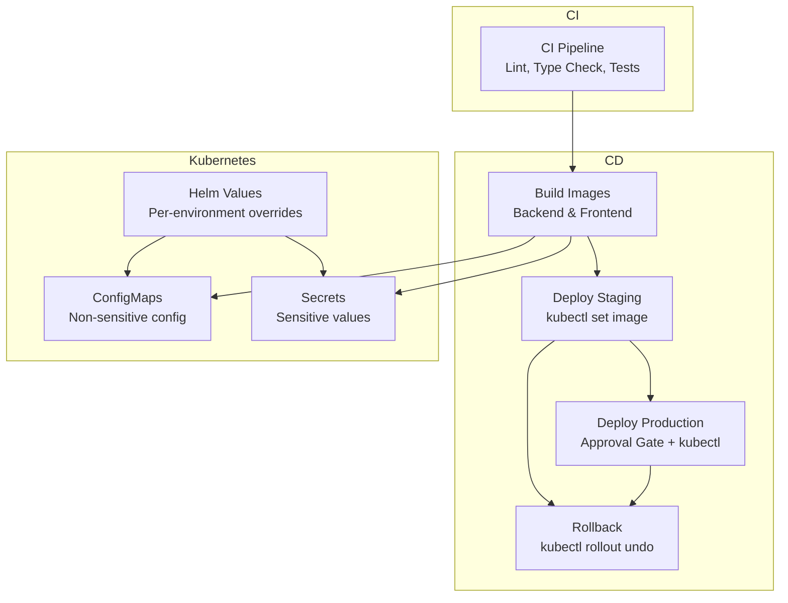
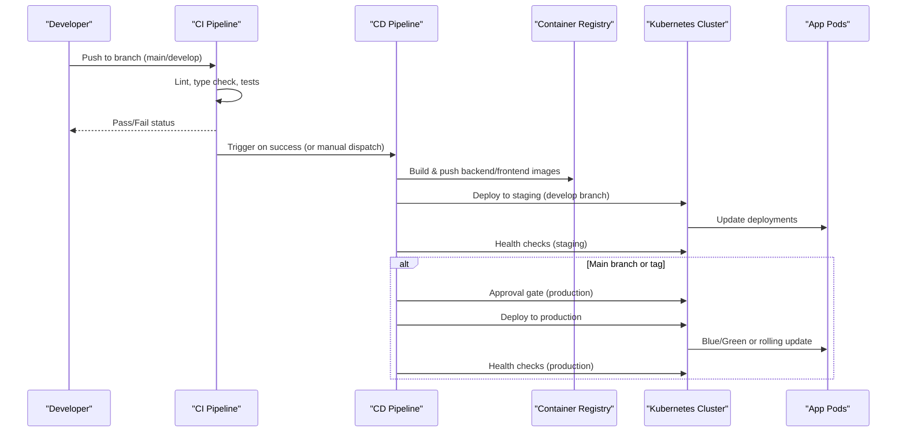
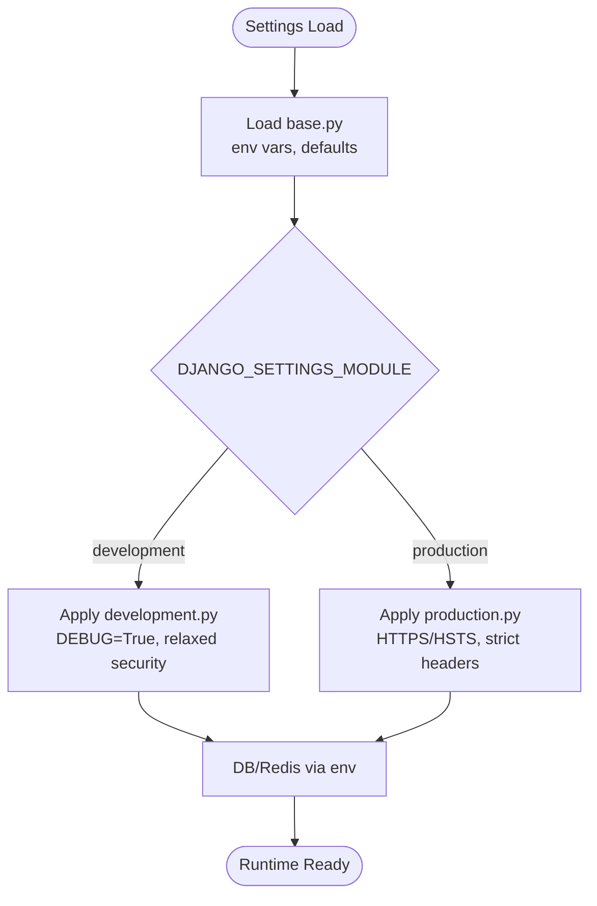
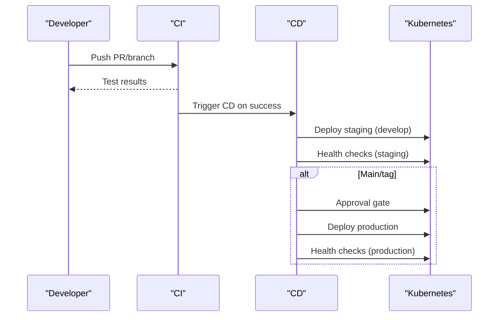
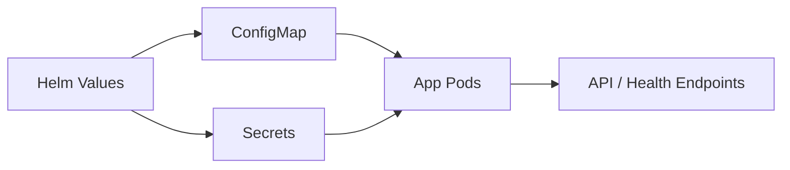
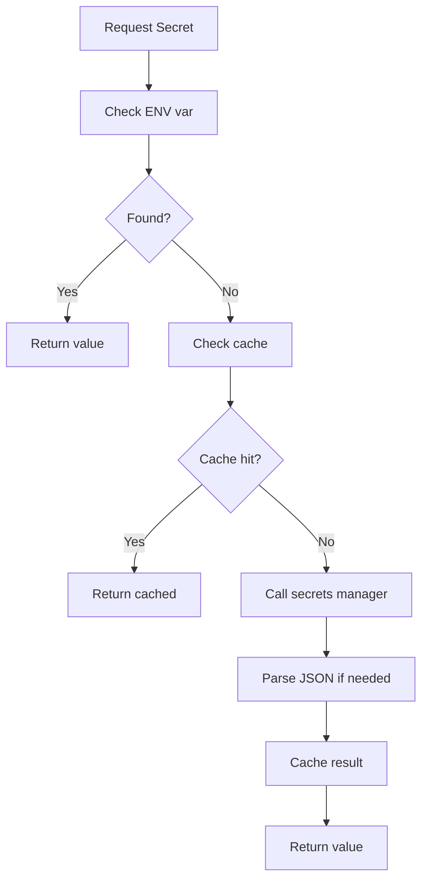
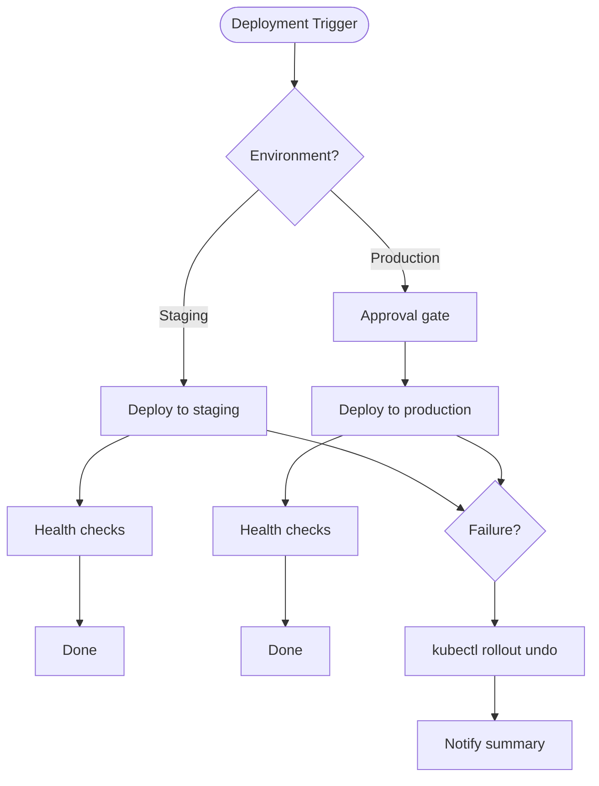
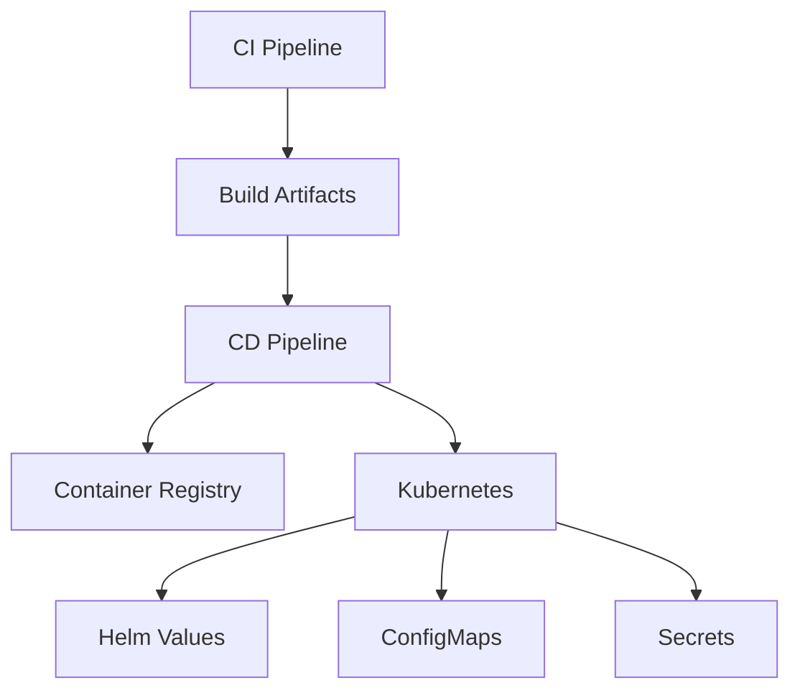

# Environment Management

<cite>
**Referenced Files in This Document**
- [cd.yml](file://.github/workflows/cd.yml)
- [ci.yml](file://.github/workflows/ci.yml)
- [entity-apps-deploy.yml](file://.github/workflows/entity-apps-deploy.yml)
- [release.yml](file://.github/workflows/release.yml)
- [base.py](file://backend/django/core/settings/base.py)
- [development.py](file://backend/django/core/settings/development.py)
- [production.py](file://backend/django/core/settings/production.py)
- [values.yaml](file://infra/helm/jol-hub/values.yaml)
- [configmap.yaml](file://infra/kubernetes/base/configmap.yaml)
- [secrets.yaml](file://infra/kubernetes/base/secrets.yaml)
- [secrets.py](file://backend/django/apps/core/secrets.py)
- [.envrc.example](file://data/.envrc.example)
</cite>

## Table of Contents
1. [Introduction](#introduction)
2. [Project Structure](#project-structure)
3. [Core Components](#core-components)
4. [Architecture Overview](#architecture-overview)
5. [Detailed Component Analysis](#detailed-component-analysis)
6. [Dependency Analysis](#dependency-analysis)
7. [Performance Considerations](#performance-considerations)
8. [Troubleshooting Guide](#troubleshooting-guide)
9. [Conclusion](#conclusion)
10. [Appendices](#appendices)

## Introduction
This document explains how environment-specific configurations and deployment strategies are implemented across development, staging, and production environments. It covers:
- How environment variables, secrets, and configuration files are managed in GitHub Actions and Kubernetes
- Environment promotion workflows from develop to main, including approval gates
- Rollback procedures and deployment verification steps
- Guidance for setting up new environments and managing environment-specific secrets
- Troubleshooting deployment issues across different environments

## Project Structure
The repository uses a layered approach:
- Application settings are split by environment (base, development, production)
- CI builds and tests code; CD builds Docker images and deploys to Kubernetes
- Helm values and Kubernetes manifests define runtime configuration and secrets
- Secrets are injected via Kubernetes Secrets or external secret managers; sensitive values are never committed

**Diagram sources**
- [cd.yml:39-148](file://.github/workflows/cd.yml#L39-L148)
- [cd.yml:153-295](file://.github/workflows/cd.yml#L153-L295)
- [entity-apps-deploy.yml:51-338](file://.github/workflows/entity-apps-deploy.yml#L51-L338)
- [values.yaml:12-264](file://infra/helm/jol-hub/values.yaml#L12-L264)
- [configmap.yaml:13-49](file://infra/kubernetes/base/configmap.yaml#L13-L49)
- [secrets.yaml:17-47](file://infra/kubernetes/base/secrets.yaml#L17-L47)

**Section sources**
- [cd.yml:10-33](file://.github/workflows/cd.yml#L10-L33)
- [entity-apps-deploy.yml:11-45](file://.github/workflows/entity-apps-deploy.yml#L11-L45)
- [values.yaml:12-264](file://infra/helm/jol-hub/values.yaml#L12-L264)
- [configmap.yaml:13-49](file://infra/kubernetes/base/configmap.yaml#L13-L49)
- [secrets.yaml:17-47](file://infra/kubernetes/base/secrets.yaml#L17-L47)

## Core Components
- Environment-aware Django settings: base defaults with per-environment overrides
- GitHub Actions workflows: CI for quality gates; CD for build and deploy; entity apps deployment with country scoping
- Kubernetes configuration: ConfigMaps for non-sensitive settings, Secrets for sensitive data, Helm values for environment-specific tuning
- Secret resolution: application-level secret loader supports environment variables and cloud secret stores

Key responsibilities:
- Settings modules define which environment is active and enforce security posture
- Workflows determine promotion rules and guardrails (approvals, health checks)
- Kubernetes resources inject configuration at runtime without leaking secrets into code

**Section sources**
- [base.py:29-44](file://backend/django/core/settings/base.py#L29-L44)
- [development.py:12-53](file://backend/django/core/settings/development.py#L12-L53)
- [production.py:18-50](file://backend/django/core/settings/production.py#L18-L50)
- [cd.yml:153-295](file://.github/workflows/cd.yml#L153-L295)
- [entity-apps-deploy.yml:159-338](file://.github/workflows/entity-apps-deploy.yml#L159-L338)
- [configmap.yaml:13-49](file://infra/kubernetes/base/configmap.yaml#L13-L49)
- [secrets.py:134-172](file://backend/django/apps/core/secrets.py#L134-L172)

## Architecture Overview
End-to-end flow from code change to deployed environment:

**Diagram sources**
- [ci.yml:10-379](file://.github/workflows/ci.yml#L10-L379)
- [cd.yml:39-295](file://.github/workflows/cd.yml#L39-L295)
- [entity-apps-deploy.yml:159-338](file://.github/workflows/entity-apps-deploy.yml#L159-L338)

## Detailed Component Analysis

### Django Environment Settings
- Base settings load environment variables and provide shared defaults
- Development enables debug tools and relaxed security for local work
- Production enforces HTTPS, strict headers, secure cookies, and optimized rendering

Environment identification:
- Base sets a default environment marker
- Production explicitly sets the environment name

Security posture:
- Development allows broad hosts and disables SSL redirects
- Production restricts allowed hosts and enforces TLS and HSTS

Database and cache:
- Both environments configure PostgreSQL and Redis via environment variables
- Production enforces SSL mode for database connections

**Diagram sources**
- [base.py:29-44](file://backend/django/core/settings/base.py#L29-L44)
- [development.py:12-53](file://backend/django/core/settings/development.py#L12-L53)
- [production.py:18-50](file://backend/django/core/settings/production.py#L18-L50)

**Section sources**
- [base.py:29-44](file://backend/django/core/settings/base.py#L29-L44)
- [development.py:12-53](file://backend/django/core/settings/development.py#L12-L53)
- [production.py:18-50](file://backend/django/core/settings/production.py#L18-L50)

### GitHub Actions: CI and CD
- CI runs linting, type checks, unit/integration tests, and Docker build validation
- CD builds images and deploys to staging on develop; production requires explicit conditions and approvals
- Entity Apps Deploy supports country-scoped deployments with optional app selection and pre-deployment validations

Promotion rules:
- Staging: automatic on develop pushes or manual dispatch
- Production: triggered on main pushes/tags or manual dispatch; includes an approval gate job

Verification:
- Staging and production jobs run health checks against endpoints after rollout
- Entity apps deployment performs pre-deployment validation and smoke tests

**Diagram sources**
- [ci.yml:36-173](file://.github/workflows/ci.yml#L36-L173)
- [cd.yml:153-295](file://.github/workflows/cd.yml#L153-L295)
- [entity-apps-deploy.yml:159-338](file://.github/workflows/entity-apps-deploy.yml#L159-L338)

**Section sources**
- [ci.yml:10-379](file://.github/workflows/ci.yml#L10-L379)
- [cd.yml:10-33](file://.github/workflows/cd.yml#L10-L33)
- [cd.yml:153-295](file://.github/workflows/cd.yml#L153-L295)
- [entity-apps-deploy.yml:11-45](file://.github/workflows/entity-apps-deploy.yml#L11-L45)
- [entity-apps-deploy.yml:159-338](file://.github/workflows/entity-apps-deploy.yml#L159-L338)

### Kubernetes Configuration and Secrets
- ConfigMaps hold non-sensitive configuration such as domains, feature flags, and service endpoints
- Secrets templates show where sensitive values belong; production should use External Secrets Operator or Sealed Secrets
- Helm values define per-environment overrides for replicas, autoscaling, ingress, and monitoring

Environment separation:
- Namespaces and labels separate environments
- Ingress and TLS settings configured via Helm values
- Feature flags and rate limiting controlled through ConfigMaps

**Diagram sources**
- [values.yaml:12-264](file://infra/helm/jol-hub/values.yaml#L12-L264)
- [configmap.yaml:13-49](file://infra/kubernetes/base/configmap.yaml#L13-L49)
- [secrets.yaml:17-47](file://infra/kubernetes/base/secrets.yaml#L17-L47)

**Section sources**
- [values.yaml:12-264](file://infra/helm/jol-hub/values.yaml#L12-L264)
- [configmap.yaml:13-49](file://infra/kubernetes/base/configmap.yaml#L13-L49)
- [secrets.yaml:17-47](file://infra/kubernetes/base/secrets.yaml#L17-L47)

### Secrets Resolution in Application
- The application’s secret loader can read from environment variables or a cloud secrets manager
- It supports namespacing by project/environment and caches resolved values
- This pattern allows consistent secret access across environments while keeping credentials out of code

**Diagram sources**
- [secrets.py:134-172](file://backend/django/apps/core/secrets.py#L134-L172)

**Section sources**
- [secrets.py:134-172](file://backend/django/apps/core/secrets.py#L134-L172)

### Promotion, Rollback, and Verification
- Promotion:
  - Develop -> Staging: automatic on push to develop or manual dispatch
  - Staging -> Production: manual dispatch or push/tag to main; includes approval gate
- Rollback:
  - Automated rollback step triggers on failure during workflow_dispatch; uses kubectl rollout undo
- Verification:
  - Staging and production jobs perform HTTP health checks against endpoints
  - Entity apps deployment validates configs and runs smoke tests before switching traffic

**Diagram sources**
- [cd.yml:153-295](file://.github/workflows/cd.yml#L153-L295)
- [cd.yml:301-335](file://.github/workflows/cd.yml#L301-L335)
- [entity-apps-deploy.yml:159-338](file://.github/workflows/entity-apps-deploy.yml#L159-L338)

**Section sources**
- [cd.yml:153-295](file://.github/workflows/cd.yml#L153-L295)
- [cd.yml:301-335](file://.github/workflows/cd.yml#L301-L335)
- [entity-apps-deploy.yml:159-338](file://.github/workflows/entity-apps-deploy.yml#L159-L338)

## Dependency Analysis
- CI depends on Python and Node toolchains; it produces artifacts used by CD
- CD depends on container registry and Kubernetes cluster access via kubeconfig secrets
- Deployment jobs depend on correct namespaces, services, and secrets being present
- Helm values influence resource scaling, ingress, and monitoring configuration

**Diagram sources**
- [ci.yml:36-173](file://.github/workflows/ci.yml#L36-L173)
- [cd.yml:39-148](file://.github/workflows/cd.yml#L39-L148)
- [values.yaml:12-264](file://infra/helm/jol-hub/values.yaml#L12-L264)

**Section sources**
- [ci.yml:36-173](file://.github/workflows/ci.yml#L36-L173)
- [cd.yml:39-148](file://.github/workflows/cd.yml#L39-L148)
- [values.yaml:12-264](file://infra/helm/jol-hub/values.yaml#L12-L264)

## Performance Considerations
- Use connection pooling and SSL for databases in production
- Tune Celery concurrency and task limits per environment workload
- Enable autoscaling based on CPU/memory targets in Helm values
- Prefer compressed static assets and CDN-backed caching for frontends
- Keep health checks lightweight to avoid false negatives during rollouts

[No sources needed since this section provides general guidance]

## Troubleshooting Guide
Common issues and resolutions:
- Missing environment variables:
  - Ensure required variables are set in Kubernetes ConfigMaps/Secrets or CI/CD environment context
  - Validate that DJANGO_SETTINGS_MODULE points to the correct module
- Database connectivity failures:
  - Confirm DB_HOST, DB_PORT, DB_NAME, and credentials are correct for the target namespace
  - Verify SSL mode is enforced in production
- Redis/cache errors:
  - Check REDIS_URL or host/port configuration and network policies
- Deployment stuck:
  - Inspect rollout status and events; use rollback if health checks fail
  - For entity apps, verify pre-deployment validations passed
- Secrets not loading:
  - Confirm secret names and keys match application expectations
  - If using a secrets manager, ensure permissions and naming conventions are correct

Operational tips:
- Use staging health checks to catch issues early
- Leverage GitHub Actions summaries for quick visibility into deployment status
- Keep rollback steps ready; they are built into the CD pipeline

**Section sources**
- [ci.yml:128-173](file://.github/workflows/ci.yml#L128-L173)
- [cd.yml:186-195](file://.github/workflows/cd.yml#L186-L195)
- [cd.yml:269-275](file://.github/workflows/cd.yml#L269-L275)
- [entity-apps-deploy.yml:257-306](file://.github/workflows/entity-apps-deploy.yml#L257-L306)
- [secrets.py:134-172](file://backend/django/apps/core/secrets.py#L134-L172)

## Conclusion
This repository implements a robust environment management strategy:
- Clear separation of concerns between CI, CD, and Kubernetes configuration
- Environment-specific settings and security postures
- Controlled promotions with approval gates and automated rollbacks
- Comprehensive verification through health checks and validations
Adhering to these practices ensures safe, repeatable deployments across development, staging, and production.

[No sources needed since this section summarizes without analyzing specific files]

## Appendices

### Setting Up a New Environment
Steps:
- Create a new GitHub Actions environment with required secrets (e.g., kubeconfig)
- Add environment-specific Kubernetes namespaces and RBAC
- Define Helm values overrides for the new environment
- Populate ConfigMaps and Secrets with appropriate values
- Extend workflows to support the new environment (if needed)

**Section sources**
- [cd.yml:153-295](file://.github/workflows/cd.yml#L153-L295)
- [entity-apps-deploy.yml:159-338](file://.github/workflows/entity-apps-deploy.yml#L159-L338)
- [values.yaml:12-264](file://infra/helm/jol-hub/values.yaml#L12-L264)
- [configmap.yaml:13-49](file://infra/kubernetes/base/configmap.yaml#L13-L49)
- [secrets.yaml:17-47](file://infra/kubernetes/base/secrets.yaml#L17-L47)

### Managing Environment-Specific Secrets
Guidelines:
- Never commit plaintext secrets; use Kubernetes Secrets or external secret managers
- Separate common and environment-specific secrets
- Validate secret formats and permissions in CI
- Rotate secrets regularly and audit access

**Section sources**
- [secrets.yaml:17-47](file://infra/kubernetes/base/secrets.yaml#L17-L47)
- [secrets.py:134-172](file://backend/django/apps/core/secrets.py#L134-L172)

### Local Development Environment Variables
Use the example environment file to configure local services like databases and analytics tools. Adjust values to match your local setup.

**Section sources**
- [.envrc.example:7-15](file://data/.envrc.example#L7-L15)