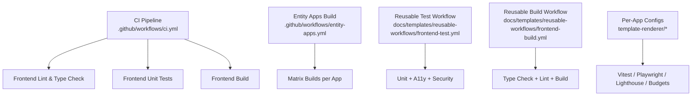
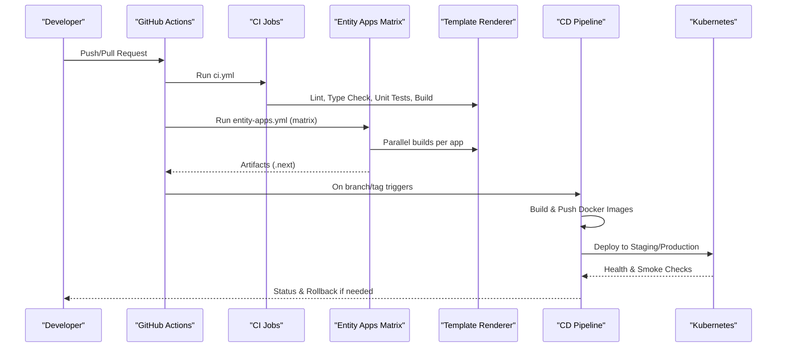
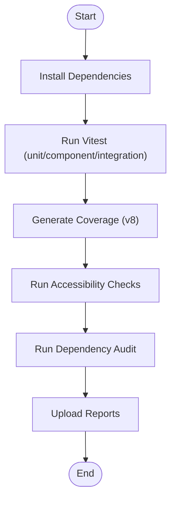
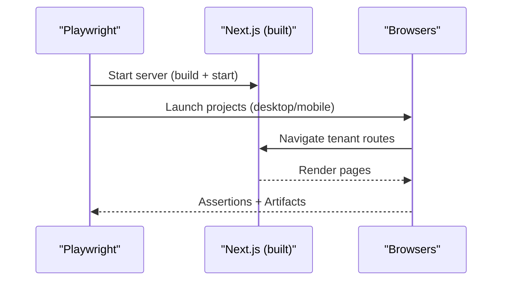
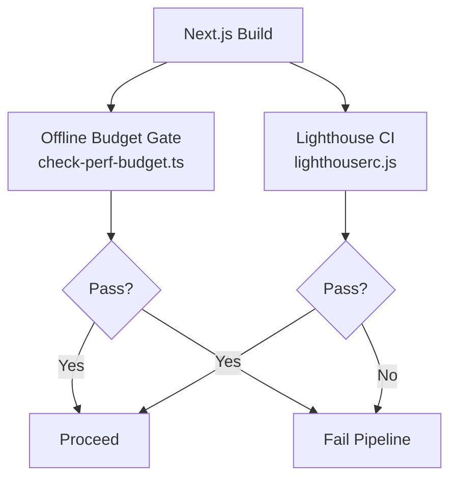
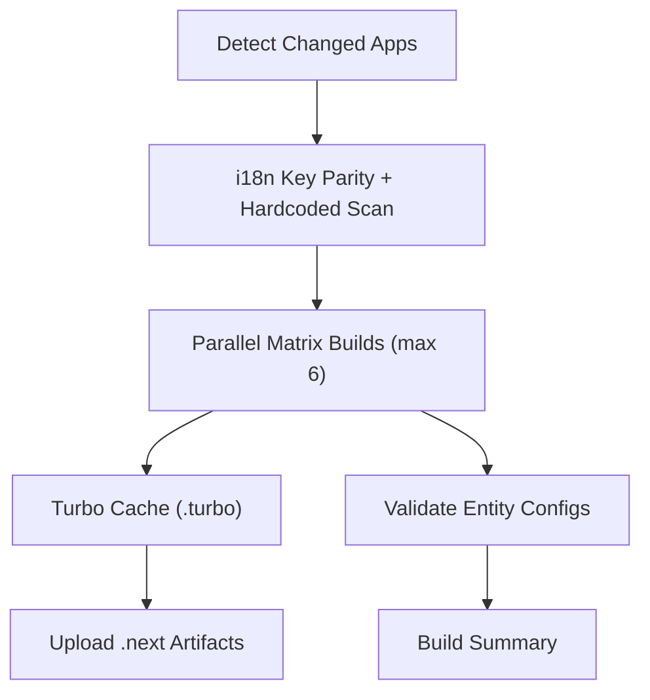
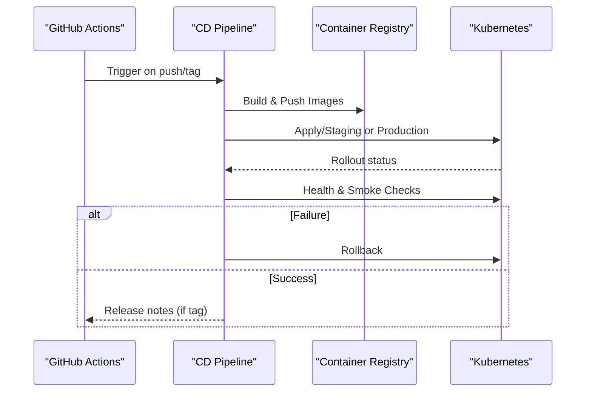
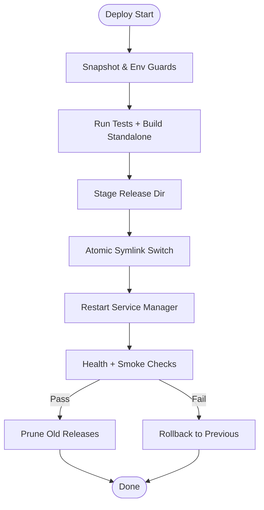
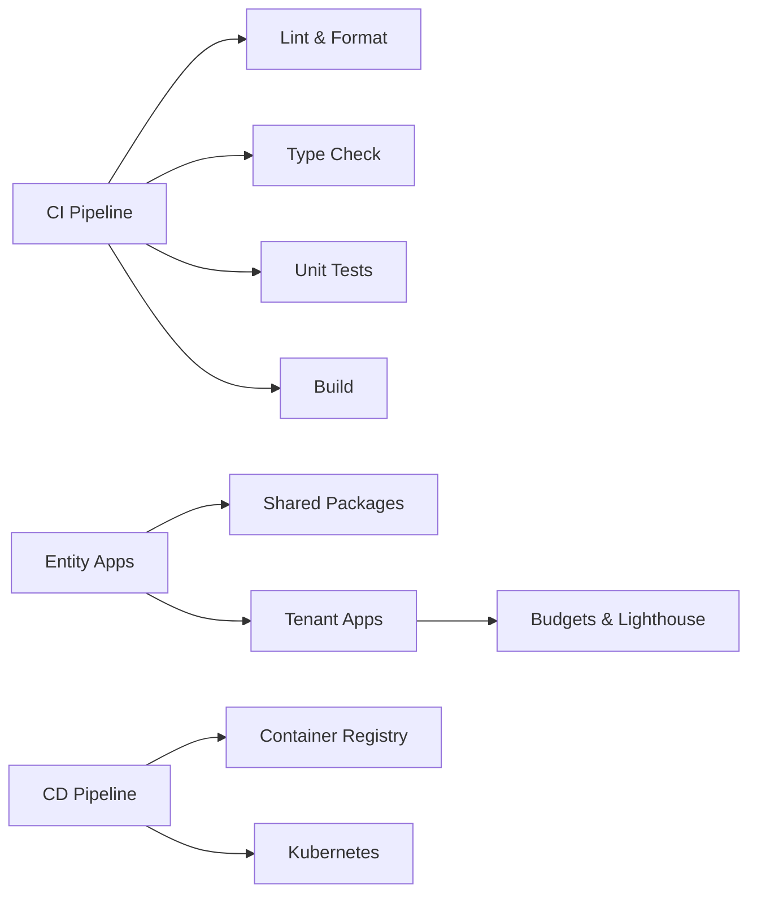

# Frontend Testing Pipeline

<cite>
**Referenced Files in This Document**
- [ci.yml](file://.github/workflows/ci.yml)
- [cd.yml](file://.github/workflows/cd.yml)
- [entity-apps.yml](file://.github/workflows/entity-apps.yml)
- [frontend-test.yml](file://docs/templates/reusable-workflows/frontend-test.yml)
- [frontend-build.yml](file://docs/templates/reusable-workflows/frontend-build.yml)
- [playwright.config.ts](file://frontend/apps/template-renderer/playwright.config.ts)
- [vitest.config.ts](file://frontend/apps/template-renderer/vitest.config.ts)
- [lighthouserc.js](file://frontend/apps/template-renderer/lighthouserc.js)
- [budget.json](file://frontend/apps/template-renderer/budget.json)
- [check-perf-budget.ts](file://frontend/apps/template-renderer/scripts/check-perf-budget.ts)
- [deploy.sh](file://frontend/apps/template-renderer/scripts/deploy.sh)
- [turbo.json](file://frontend/turbo.json)
</cite>

## Table of Contents
1. [Introduction](#introduction)
2. [Project Structure](#project-structure)
3. [Core Components](#core-components)
4. [Architecture Overview](#architecture-overview)
5. [Detailed Component Analysis](#detailed-component-analysis)
6. [Dependency Analysis](#dependency-analysis)
7. [Performance Considerations](#performance-considerations)
8. [Troubleshooting Guide](#troubleshooting-guide)
9. [Conclusion](#conclusion)

## Introduction
This document describes the frontend testing and deployment pipeline for Next.js applications in the repository. It covers:
- The test workflow that runs unit tests, component tests, accessibility checks, security audits, and end-to-end (E2E) tests.
- The entity apps workflow that builds and validates tenant-specific applications in parallel.
- The deployment workflow that publishes artifacts to container images and deploys via Kubernetes, including health checks and smoke tests.
- Caching strategies, parallel execution, and performance budget validation steps used across the pipeline.

## Project Structure
The pipeline is implemented with GitHub Actions workflows and per-app configuration files:
- CI/CD orchestration lives under .github/workflows.
- Reusable workflows are provided under docs/templates/reusable-workflows for consistent spoke repo pipelines.
- Per-app test runners and budgets live under frontend/apps/template-renderer.
- Monorepo caching and task orchestration are defined in frontend/turbo.json.

**Diagram sources**
- [ci.yml:179-315](file://.github/workflows/ci.yml#L179-L315)
- [entity-apps.yml:168-225](file://.github/workflows/entity-apps.yml#L168-L225)
- [frontend-test.yml:40-144](file://docs/templates/reusable-workflows/frontend-test.yml#L40-L144)
- [frontend-build.yml:40-85](file://docs/templates/reusable-workflows/frontend-build.yml#L40-L85)
- [vitest.config.ts:42-78](file://frontend/apps/template-renderer/vitest.config.ts#L42-L78)
- [playwright.config.ts:15-58](file://frontend/apps/template-renderer/playwright.config.ts#L15-L58)
- [lighthouserc.js:19-73](file://frontend/apps/template-renderer/lighthouserc.js#L19-L73)

**Section sources**
- [ci.yml:179-315](file://.github/workflows/ci.yml#L179-L315)
- [entity-apps.yml:168-225](file://.github/workflows/entity-apps.yml#L168-L225)
- [frontend-test.yml:40-144](file://docs/templates/reusable-workflows/frontend-test.yml#L40-L144)
- [frontend-build.yml:40-85](file://docs/templates/reusable-workflows/frontend-build.yml#L40-L85)
- [turbo.json:1-33](file://frontend/turbo.json#L1-L33)

## Core Components
- CI pipeline jobs: linting, type checking, unit tests, build, Docker build test, and summary.
- Entity apps matrix: detects changed apps or builds all on main/develop; caches Turbo outputs; uploads .next artifacts.
- Reusable workflows: standardized test and build steps for spoke repositories.
- Per-app test runners: Vitest for DOM/integration/security tests; Playwright for E2E; Lighthouse for performance budgets; offline budget gate script.
- Deployment: CD pipeline builds and pushes Docker images, deploys to staging and production via kubectl, performs health checks and smoke tests, supports rollback.

**Section sources**
- [ci.yml:179-315](file://.github/workflows/ci.yml#L179-L315)
- [entity-apps.yml:50-225](file://.github/workflows/entity-apps.yml#L50-L225)
- [frontend-test.yml:40-144](file://docs/templates/reusable-workflows/frontend-test.yml#L40-L144)
- [frontend-build.yml:40-85](file://docs/templates/reusable-workflows/frontend-build.yml#L40-L85)
- [cd.yml:94-147](file://.github/workflows/cd.yml#L94-L147)
- [cd.yml:153-295](file://.github/workflows/cd.yml#L153-L295)

## Architecture Overview
End-to-end flow from code push to deployment:

**Diagram sources**
- [ci.yml:179-315](file://.github/workflows/ci.yml#L179-L315)
- [entity-apps.yml:168-225](file://.github/workflows/entity-apps.yml#L168-L225)
- [cd.yml:94-147](file://.github/workflows/cd.yml#L94-L147)
- [cd.yml:153-295](file://.github/workflows/cd.yml#L153-L295)

## Detailed Component Analysis

### Frontend Test Workflow (Unit, Component, Integration, Security, Accessibility)
- Unit and integration tests run with Vitest using jsdom environment, with coverage thresholds enforced for critical editor components.
- Accessibility checks are executed via a dedicated job in the reusable workflow.
- Security audit runs against production dependencies at high severity threshold.
- Coverage reports are uploaded as artifacts for traceability.

**Diagram sources**
- [frontend-test.yml:40-144](file://docs/templates/reusable-workflows/frontend-test.yml#L40-L144)
- [vitest.config.ts:42-78](file://frontend/apps/template-renderer/vitest.config.ts#L42-L78)

**Section sources**
- [frontend-test.yml:40-144](file://docs/templates/reusable-workflows/frontend-test.yml#L40-L144)
- [vitest.config.ts:42-78](file://frontend/apps/template-renderer/vitest.config.ts#L42-L78)

### End-to-End Tests (Playwright)
- E2E suite targets multiple browsers (Chromium, Firefox, WebKit mobile).
- Runs against a built Next.js app served locally by Playwright’s webServer.
- Uses retries in CI, screenshots/video on failure, and traces retained on failure.
- Tenant resolution headers mimic production routing.

**Diagram sources**
- [playwright.config.ts:15-58](file://frontend/apps/template-renderer/playwright.config.ts#L15-L58)

**Section sources**
- [playwright.config.ts:15-58](file://frontend/apps/template-renderer/playwright.config.ts#L15-L58)

### Performance Budget Validation
Two complementary gates enforce performance budgets:
- Offline byte budget gate measures gzipped payloads from the Next.js build without a browser, enforcing JS/CSS budgets and excluding legacy polyfills.
- Lighthouse CI runs against a staged production build, asserting Core Web Vitals and category scores, with budgets applied via a shared budget file.

**Diagram sources**
- [check-perf-budget.ts:1-93](file://frontend/apps/template-renderer/scripts/check-perf-budget.ts#L1-L93)
- [lighthouserc.js:19-73](file://frontend/apps/template-renderer/lighthouserc.js#L19-L73)
- [budget.json:1-26](file://frontend/apps/template-renderer/budget.json#L1-L26)

**Section sources**
- [check-perf-budget.ts:1-93](file://frontend/apps/template-renderer/scripts/check-perf-budget.ts#L1-L93)
- [lighthouserc.js:19-73](file://frontend/apps/template-renderer/lighthouserc.js#L19-L73)
- [budget.json:1-26](file://frontend/apps/template-renderer/budget.json#L1-L26)

### Entity Apps Workflow (Build and Test Tenant-Specific Applications)
- Detects changed apps or builds all on main/develop; supports manual selection via inputs.
- Runs i18n key parity and hardcoded string scans before any build.
- Executes parallel matrix builds with Turbo caching; uploads .next artifacts per app.
- Validates entity configurations and generates compliance reports.

**Diagram sources**
- [entity-apps.yml:50-225](file://.github/workflows/entity-apps.yml#L50-L225)
- [turbo.json:1-33](file://frontend/turbo.json#L1-L33)

**Section sources**
- [entity-apps.yml:50-225](file://.github/workflows/entity-apps.yml#L50-L225)
- [turbo.json:1-33](file://frontend/turbo.json#L1-L33)

### Deployment Workflow (Publishing Artifacts and Rolling Out)
- Builds and pushes Docker images for backend and frontend with metadata tags.
- Deploys to staging on develop and to production on main/tags; uses kubectl to update deployments.
- Performs health checks and smoke tests post-deploy; supports rollback via kubectl rollout undo.
- Optional release creation for tagged versions.

**Diagram sources**
- [cd.yml:94-147](file://.github/workflows/cd.yml#L94-L147)
- [cd.yml:153-295](file://.github/workflows/cd.yml#L153-L295)

**Section sources**
- [cd.yml:94-147](file://.github/workflows/cd.yml#L94-L147)
- [cd.yml:153-295](file://.github/workflows/cd.yml#L153-L295)

### Template Renderer Deployment Script (Release Directory + Atomic Switch)
- Enforces snapshot confirmation and environment guards before deploying.
- Runs unit, Vitest, and E2E smoke tests prior to building standalone output.
- Copies .next standalone bundle and static assets into a timestamped release directory.
- Atomically switches symlink to new release and restarts service manager.
- Verifies health endpoint and page content; rolls back on failure and prunes old releases.

**Diagram sources**
- [deploy.sh:1-171](file://frontend/apps/template-renderer/scripts/deploy.sh#L1-L171)

**Section sources**
- [deploy.sh:1-171](file://frontend/apps/template-renderer/scripts/deploy.sh#L1-L171)

## Dependency Analysis
Key dependencies and relationships:
- CI depends on pnpm workspace and Node cache; builds and tests are gated by lint/type-check.
- Entity apps depend on shared packages; changes to shared paths trigger full rebuilds.
- Per-app configs (Vitest, Playwright, Lighthouse) drive test execution and budgets.
- CD depends on container registry and Kubernetes credentials; uses kubectl for rollouts.

**Diagram sources**
- [ci.yml:179-315](file://.github/workflows/ci.yml#L179-L315)
- [entity-apps.yml:168-225](file://.github/workflows/entity-apps.yml#L168-L225)
- [lighthouserc.js:19-73](file://frontend/apps/template-renderer/lighthouserc.js#L19-L73)
- [cd.yml:94-147](file://.github/workflows/cd.yml#L94-L147)
- [cd.yml:153-295](file://.github/workflows/cd.yml#L153-L295)

**Section sources**
- [ci.yml:179-315](file://.github/workflows/ci.yml#L179-L315)
- [entity-apps.yml:168-225](file://.github/workflows/entity-apps.yml#L168-L225)
- [cd.yml:94-147](file://.github/workflows/cd.yml#L94-L147)
- [cd.yml:153-295](file://.github/workflows/cd.yml#L153-L295)

## Performance Considerations
- Caching:
  - pnpm dependency cache keyed by lockfile.
  - Turbo task cache scoped per app with restore keys for partial hits.
  - Docker layer caching via GitHub Actions cache.
- Parallelism:
  - Playwright workers set to 4 with fully parallel execution.
  - Entity apps matrix limited to max 6 parallel builds.
- Budgets:
  - Offline gate enforces JS/CSS byte budgets without a browser.
  - Lighthouse CI asserts Core Web Vitals and category scores against budgets.
- Observability:
  - Coverage reports uploaded for unit tests.
  - Lighthouse reports saved to filesystem for review.

[No sources needed since this section provides general guidance]

## Troubleshooting Guide
Common issues and resolutions:
- Missing Chrome for Lighthouse:
  - Use the offline budget gate when Chrome is unavailable; Lighthouse CI runs where Chrome is present.
- Flaky E2E tests:
  - Increase retries in CI; capture screenshots/video/traces on failure for debugging.
- Slow builds:
  - Ensure Turbo cache is enabled; verify .turbo path and keys; check shared package changes triggering full rebuilds.
- Deployment failures:
  - Confirm snapshot confirmation flag; validate health endpoint and smoke URL; use rollback script to revert to previous release.

**Section sources**
- [lighthouserc.js:19-73](file://frontend/apps/template-renderer/lighthouserc.js#L19-L73)
- [check-perf-budget.ts:1-93](file://frontend/apps/template-renderer/scripts/check-perf-budget.ts#L1-L93)
- [playwright.config.ts:15-58](file://frontend/apps/template-renderer/playwright.config.ts#L15-L58)
- [deploy.sh:1-171](file://frontend/apps/template-renderer/scripts/deploy.sh#L1-L171)

## Conclusion
The pipeline combines robust testing (unit, component, integration, accessibility, security, E2E), strict performance budget enforcement (offline and Lighthouse), efficient parallel builds with caching, and reliable deployment with health checks and rollback. The entity apps workflow scales tenant-specific builds while maintaining shared quality gates, ensuring consistent delivery across multi-tenant Next.js applications.

[No sources needed since this section summarizes without analyzing specific files]