# GitHub Actions Workflows

<cite>
**Referenced Files in This Document**
- [ci.yml](file://.github/workflows/ci.yml)
- [cd.yml](file://.github/workflows/cd.yml)
- [release.yml](file://.github/workflows/release.yml)
- [frontend-test.yml](file://.github/workflows/frontend-test.yml)
- [compliance-check.yml](file://.github/workflows/compliance-check.yml)
- [security-scan.yml](file://.github/workflows/security-scan.yml)
- [payment-boundary-guard.yml](file://.github/workflows/payment-boundary-guard.yml)
- [entity-apps.yml](file://.github/workflows/entity-apps.yml)
- [entity-apps-deploy.yml](file://.github/workflows/entity-apps-deploy.yml)
- [dependabot.yml](file://.github/dependabot.yml)
</cite>

## Table of Contents
1. [Introduction](#introduction)
2. [Project Structure](#project-structure)
3. [Core Components](#core-components)
4. [Architecture Overview](#architecture-overview)
5. [Detailed Component Analysis](#detailed-component-analysis)
6. [Dependency Analysis](#dependency-analysis)
7. [Performance Considerations](#performance-considerations)
8. [Troubleshooting Guide](#troubleshooting-guide)
9. [Conclusion](#conclusion)
10. [Appendices](#appendices)

## Introduction
This document explains the GitHub Actions workflows that power continuous integration, continuous deployment, and release management for the JOL-HUB platform. It covers:
- CI workflow for code quality checks, unit tests, and integration tests
- CD workflow for deploying to staging and production
- Release workflow for versioning and artifact publishing
- Workflow triggers, job dependencies, environment variables, and secret management
- Examples of customizing workflows for different branches and pull request scenarios

## Project Structure
The repository centralizes automation under .github/workflows with specialized pipelines for:
- Core CI (lint, type checks, tests, build, Docker build test)
- Frontend testing tiers (unit, build gate, accessibility, security, e2e)
- Compliance checks (GDPR, WCAG, security posture, documentation)
- Security scanning (SAST, SCA, container scans, IaC, CodeQL)
- Payment boundary guard enforcement
- Entity apps build and deploy matrix
- Continuous deployment to Kubernetes environments
- Automated dependency updates via Dependabot

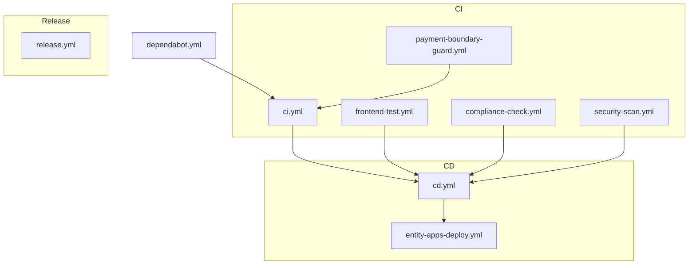

**Diagram sources**
- [ci.yml:1-379](file://.github/workflows/ci.yml#L1-L379)
- [frontend-test.yml:1-208](file://.github/workflows/frontend-test.yml#L1-L208)
- [compliance-check.yml:1-591](file://.github/workflows/compliance-check.yml#L1-L591)
- [security-scan.yml:1-379](file://.github/workflows/security-scan.yml#L1-L379)
- [payment-boundary-guard.yml:1-59](file://.github/workflows/payment-boundary-guard.yml#L1-L59)
- [cd.yml:1-335](file://.github/workflows/cd.yml#L1-L335)
- [entity-apps-deploy.yml:1-366](file://.github/workflows/entity-apps-deploy.yml#L1-L366)
- [release.yml:1-48](file://.github/workflows/release.yml#L1-L48)
- [dependabot.yml:1-165](file://.github/dependabot.yml#L1-L165)

**Section sources**
- [ci.yml:1-379](file://.github/workflows/ci.yml#L1-L379)
- [frontend-test.yml:1-208](file://.github/workflows/frontend-test.yml#L1-L208)
- [compliance-check.yml:1-591](file://.github/workflows/compliance-check.yml#L1-L591)
- [security-scan.yml:1-379](file://.github/workflows/security-scan.yml#L1-L379)
- [payment-boundary-guard.yml:1-59](file://.github/workflows/payment-boundary-guard.yml#L1-L59)
- [cd.yml:1-335](file://.github/workflows/cd.yml#L1-L335)
- [entity-apps-deploy.yml:1-366](file://.github/workflows/entity-apps-deploy.yml#L1-L366)
- [release.yml:1-48](file://.github/workflows/release.yml#L1-L48)
- [dependabot.yml:1-165](file://.github/dependabot.yml#L1-L165)

## Core Components
- CI Pipeline: Linting, type checking, backend and frontend tests, builds, Docker build validation, and a summary job.
- Frontend Testing Pipeline: Parallel tiers for unit/integration, build gate, accessibility, security, and e2e.
- Compliance Check Pipeline: GDPR, WCAG, security posture, and documentation compliance checks.
- Security Scan Pipeline: Secret detection, SAST, SCA, container scanning, IaC scanning, and CodeQL.
- Payment Boundary Guard: Enforces payment isolation rules on every push/PR.
- Entity Apps Build: Matrix-based builds for multiple entity and infrastructure apps with i18n validation.
- Entity Apps Deploy: Conditional deployments to staging and production with approval gates and blue-green support.
- CD Pipeline: Builds and pushes Docker images; deploys to staging on develop and to production on main/tags; includes rollback.
- Release Workflow: Versioning and publishing using changesets.

**Section sources**
- [ci.yml:1-379](file://.github/workflows/ci.yml#L1-L379)
- [frontend-test.yml:1-208](file://.github/workflows/frontend-test.yml#L1-L208)
- [compliance-check.yml:1-591](file://.github/workflows/compliance-check.yml#L1-L591)
- [security-scan.yml:1-379](file://.github/workflows/security-scan.yml#L1-L379)
- [payment-boundary-guard.yml:1-59](file://.github/workflows/payment-boundary-guard.yml#L1-L59)
- [entity-apps.yml:1-372](file://.github/workflows/entity-apps.yml#L1-L372)
- [entity-apps-deploy.yml:1-366](file://.github/workflows/entity-apps-deploy.yml#L1-L366)
- [cd.yml:1-335](file://.github/workflows/cd.yml#L1-L335)
- [release.yml:1-48](file://.github/workflows/release.yml#L1-L48)

## Architecture Overview
The automation architecture separates concerns across CI, security/compliance, and CD:
- CI ensures code quality and correctness before any artifacts are produced.
- Security and compliance run in parallel or as scheduled jobs to enforce policy.
- CD consumes CI outputs and deploys to environments with approvals and rollbacks.
- Release manages semantic versioning and package publishing.

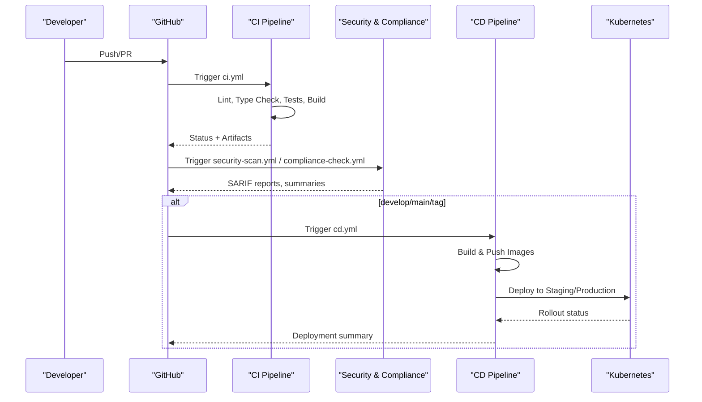

**Diagram sources**
- [ci.yml:1-379](file://.github/workflows/ci.yml#L1-L379)
- [security-scan.yml:1-379](file://.github/workflows/security-scan.yml#L1-L379)
- [compliance-check.yml:1-591](file://.github/workflows/compliance-check.yml#L1-L591)
- [cd.yml:1-335](file://.github/workflows/cd.yml#L1-L335)

## Detailed Component Analysis

### CI Pipeline (ci.yml)
- Triggers: push/PR to main, master, develop when backend, frontend, tools, or this workflow change.
- Jobs:
  - Backend lint/type checks and tests with PostgreSQL and Redis services.
  - Frontend lint/type checks, tests, and build; uploads build artifacts.
  - Docker build test using Buildx with caching.
  - Summary job aggregates results and fails if any critical job failed.
- Environment variables: Python, Node, pnpm versions; test DB URLs and secrets injected per job.
- Secrets: CODECOV_TOKEN used for coverage reporting.

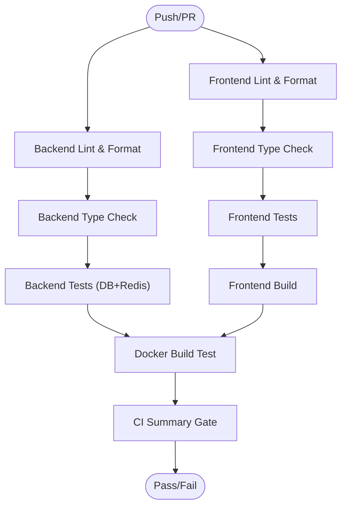

**Diagram sources**
- [ci.yml:31-379](file://.github/workflows/ci.yml#L31-L379)

**Section sources**
- [ci.yml:10-379](file://.github/workflows/ci.yml#L10-L379)

### Frontend Testing Pipeline (frontend-test.yml)
- Triggers: push/PR to main, master, develop when frontend files change.
- Jobs:
  - Unit + Integration tests with coverage upload.
  - Build gate enforcing performance budget and secret leakage scan.
  - Accessibility checks (axe-core).
  - Security suite and dependency audit.
  - E2E tests with Playwright across browsers.
  - Summary gate failing if any tier failed.
- Secrets: None required beyond repository defaults.

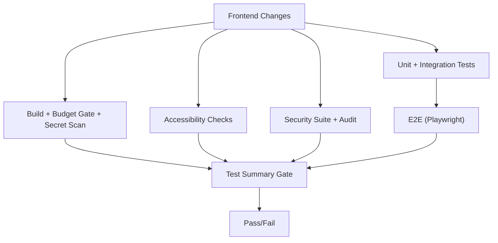

**Diagram sources**
- [frontend-test.yml:17-208](file://.github/workflows/frontend-test.yml#L17-L208)

**Section sources**
- [frontend-test.yml:17-208](file://.github/workflows/frontend-test.yml#L17-L208)

### Compliance Check Pipeline (compliance-check.yml)
- Triggers: push/PR to main/master/develop, weekly schedule, manual dispatch with check_type input.
- Jobs:
  - GDPR checks (PII handling, consent, endpoints, retention, audit logging).
  - Automated compliance tests (GDPR/SOC2/PCI-DSS) with report generation and artifact upload.
  - Accessibility checks (WCAG) including ARIA, image alt, form labels, keyboard navigation.
  - Security compliance checks (headers, auth, CORS, hardcoded secrets).
  - Documentation compliance (required docs, OpenAPI validation).
  - Summary job generating a consolidated report artifact.

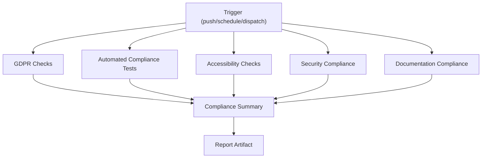

**Diagram sources**
- [compliance-check.yml:10-591](file://.github/workflows/compliance-check.yml#L10-L591)

**Section sources**
- [compliance-check.yml:10-591](file://.github/workflows/compliance-check.yml#L10-L591)

### Security Scan Pipeline (security-scan.yml)
- Triggers: push/PR to main/develop, daily schedule, manual dispatch.
- Jobs:
  - Secret detection (Gitleaks, TruffleHog).
  - SAST for backend (Bandit, Semgrep) and frontend (Semgrep).
  - SCA for backend (Safety, pip-audit) and frontend (pnpm audit, Snyk).
  - Container scanning (Trivy filesystem scan).
  - IaC scanning (Checkov, Terrascan).
  - CodeQL analysis for Python and JavaScript/TypeScript.
  - Summary job aggregating statuses.

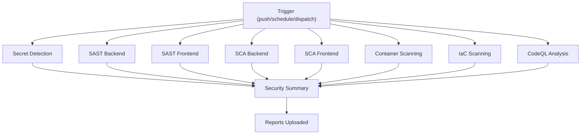

**Diagram sources**
- [security-scan.yml:10-379](file://.github/workflows/security-scan.yml#L10-L379)

**Section sources**
- [security-scan.yml:10-379](file://.github/workflows/security-scan.yml#L10-L379)

### Payment Boundary Guard (payment-boundary-guard.yml)
- Triggers: push/PR to main, master, develop.
- Jobs:
  - Verifies vendored script integrity by sha256.
  - Runs guard script to enforce no direct Stripe calls from hub.
  - Dependency guard test ensuring isolation constraints.

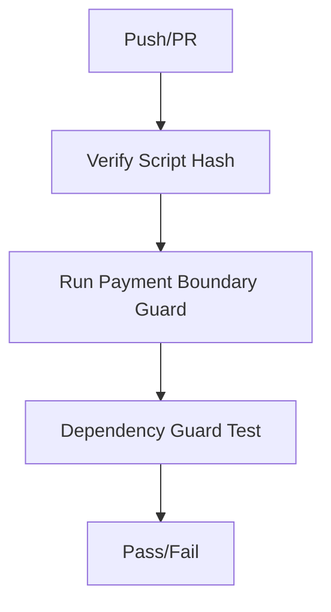

**Diagram sources**
- [payment-boundary-guard.yml:20-59](file://.github/workflows/payment-boundary-guard.yml#L20-L59)

**Section sources**
- [payment-boundary-guard.yml:20-59](file://.github/workflows/payment-boundary-guard.yml#L20-L59)

### Entity Apps Build (entity-apps.yml)
- Triggers: push/PR to main/develop when frontend apps/packages change; manual dispatch with app selection.
- Jobs:
  - Detect apps to build based on changed paths or inputs.
  - i18n key parity and hardcoded string scan.
  - Matrix builds for each app with Turbo caching and type checks.
  - Validation of entity configs and compliance checks on main/develop.
  - Build summary artifact.

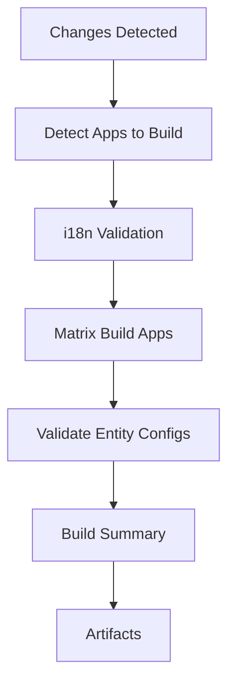

**Diagram sources**
- [entity-apps.yml:10-372](file://.github/workflows/entity-apps.yml#L10-L372)

**Section sources**
- [entity-apps.yml:10-372](file://.github/workflows/entity-apps.yml#L10-L372)

### Entity Apps Deploy (entity-apps-deploy.yml)
- Triggers: completion of Entity Apps Build on main/develop; manual dispatch with environment, apps, country inputs.
- Jobs:
  - Prepare deployment configuration (environment, country, apps).
  - Production approval gate using GitHub environments.
  - Download build artifacts per app.
  - Deploy to staging with health checks.
  - Deploy to production with pre-deployment validation and blue-green strategy.
  - Post-deployment notification.

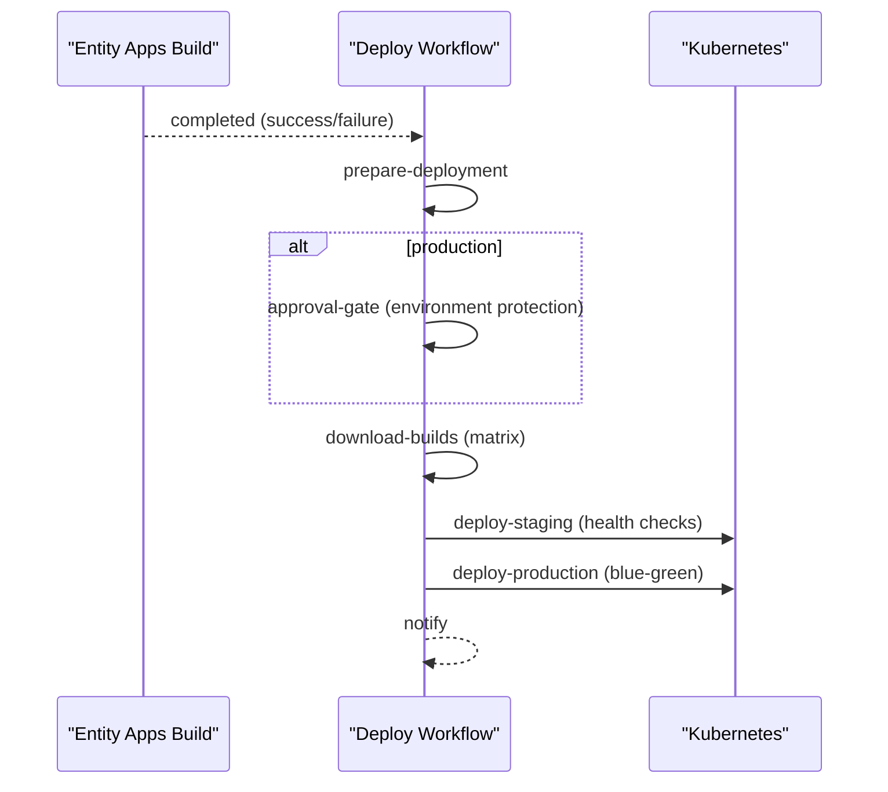

**Diagram sources**
- [entity-apps-deploy.yml:11-366](file://.github/workflows/entity-apps-deploy.yml#L11-L366)

**Section sources**
- [entity-apps-deploy.yml:11-366](file://.github/workflows/entity-apps-deploy.yml#L11-L366)

### CD Pipeline (cd.yml)
- Triggers: push to main/develop and tags v*; manual dispatch selecting environment.
- Jobs:
  - Build and push backend/frontend Docker images with metadata tags (branch, PR, semver, sha, latest on main).
  - Deploy to staging on develop branch merges or manual dispatch; smoke tests and rollout waits.
  - Deploy to production on main or version tags; create GitHub Releases for tags; comprehensive health checks.
  - Rollback job triggered on failure during manual dispatch.

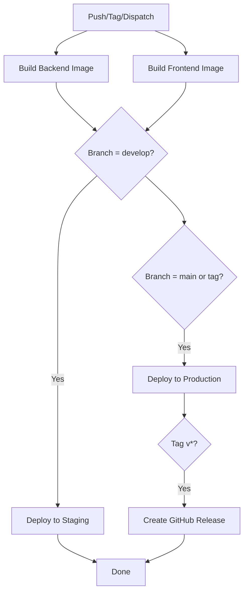

**Diagram sources**
- [cd.yml:10-335](file://.github/workflows/cd.yml#L10-L335)

**Section sources**
- [cd.yml:10-335](file://.github/workflows/cd.yml#L10-L335)

### Release Workflow (release.yml)
- Triggers: push to specific branches (including main).
- Jobs:
  - Install dependencies and build packages.
  - Use changesets to create version PRs or publish packages using NPM token.

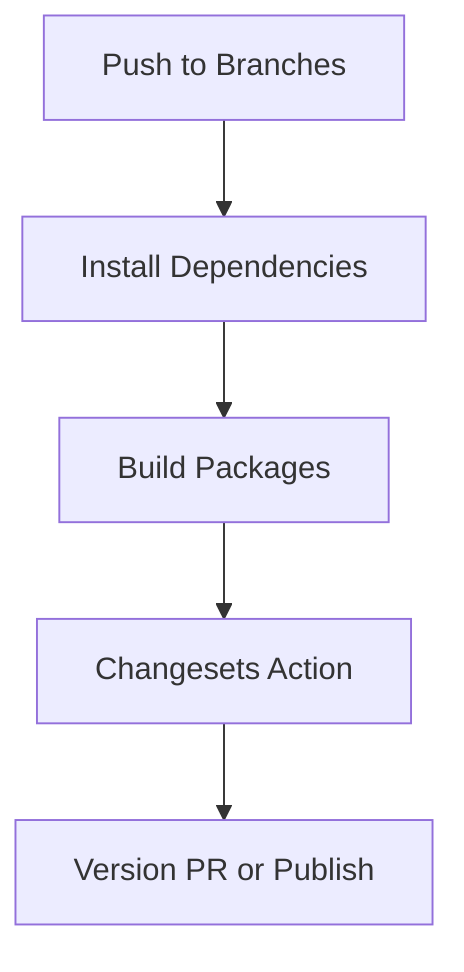

**Diagram sources**
- [release.yml:3-48](file://.github/workflows/release.yml#L3-L48)

**Section sources**
- [release.yml:3-48](file://.github/workflows/release.yml#L3-L48)

## Dependency Analysis
Workflows coordinate through explicit needs and outputs:
- ci.yml orchestrates backend and frontend jobs and produces a summary.
- frontend-test.yml runs independent tiers and enforces a summary gate.
- entity-apps.yml detects changed apps and builds them in parallel; entity-apps-deploy.yml consumes those artifacts.
- cd.yml depends on successful builds and deploys to environments gated by branches/tags and manual dispatch.
- security-scan.yml and compliance-check.yml run independently and produce SARIF/report artifacts.

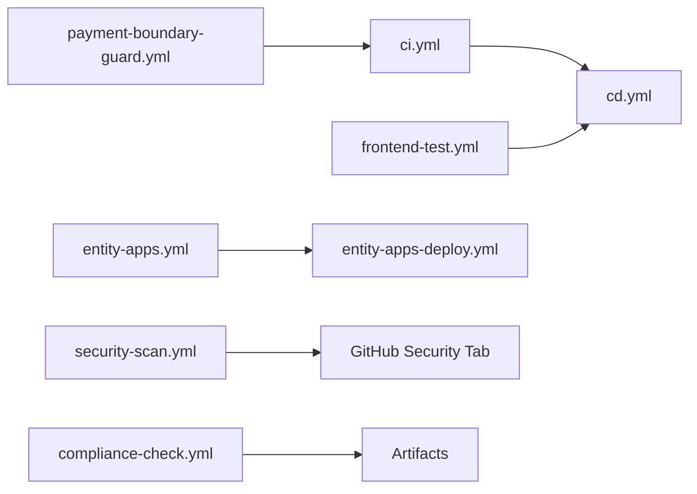

**Diagram sources**
- [ci.yml:31-379](file://.github/workflows/ci.yml#L31-L379)
- [frontend-test.yml:17-208](file://.github/workflows/frontend-test.yml#L17-L208)
- [entity-apps.yml:10-372](file://.github/workflows/entity-apps.yml#L10-L372)
- [entity-apps-deploy.yml:11-366](file://.github/workflows/entity-apps-deploy.yml#L11-L366)
- [security-scan.yml:10-379](file://.github/workflows/security-scan.yml#L10-L379)
- [compliance-check.yml:10-591](file://.github/workflows/compliance-check.yml#L10-L591)
- [payment-boundary-guard.yml:20-59](file://.github/workflows/payment-boundary-guard.yml#L20-L59)

**Section sources**
- [ci.yml:31-379](file://.github/workflows/ci.yml#L31-L379)
- [entity-apps.yml:10-372](file://.github/workflows/entity-apps.yml#L10-L372)
- [entity-apps-deploy.yml:11-366](file://.github/workflows/entity-apps-deploy.yml#L11-L366)
- [cd.yml:10-335](file://.github/workflows/cd.yml#L10-L335)
- [security-scan.yml:10-379](file://.github/workflows/security-scan.yml#L10-L379)
- [compliance-check.yml:10-591](file://.github/workflows/compliance-check.yml#L10-L591)

## Performance Considerations
- Caching:
  - pip cache for Python dependencies in CI and compliance jobs.
  - pnpm cache for Node dependencies across frontend workflows.
  - Docker Buildx cache-to/from GHA for faster image builds.
  - Turbo cache for entity apps builds.
- Parallelism:
  - Matrix strategies for entity apps builds and downloads.
  - Independent jobs for lint/type/test/build to maximize throughput.
- Service containers:
  - PostgreSQL and Redis launched inline for backend tests to avoid external dependencies.
- Artifact retention:
  - Short-lived artifacts for builds and reports to manage storage.

[No sources needed since this section provides general guidance]

## Troubleshooting Guide
Common issues and resolutions:
- CI failures:
  - Backend tests fail due to database connectivity: verify service container readiness and DATABASE_URL settings.
  - Frontend build fails due to missing dependencies: ensure pnpm install uses frozen lockfile and correct Node/pnpm versions.
  - Docker build fails: confirm Dockerfile context and available build args.
- CD deployment failures:
  - kubectl not configured: ensure kubeconfig secrets are correctly base64-decoded and placed in ~/.kube/config.
  - Rollout timeouts: increase timeout or investigate pod logs in the target namespace.
  - Health checks fail: validate endpoints and ingress routing for staging/production.
- Security/compliance:
  - SARIF findings: review CodeQL, Semgrep, Bandit, Trivy, and Checkov reports in the Security tab.
  - Hardcoded secrets: remove literals and use environment variables or secrets managers.
- Payment boundary guard:
  - Guard script hash mismatch: update vendored script only via coordinated change window per ADR.
  - Dependency guard failures: resolve unauthorized imports or direct Stripe calls.

**Section sources**
- [ci.yml:103-173](file://.github/workflows/ci.yml#L103-L173)
- [cd.yml:166-295](file://.github/workflows/cd.yml#L166-L295)
- [security-scan.yml:35-379](file://.github/workflows/security-scan.yml#L35-L379)
- [payment-boundary-guard.yml:27-59](file://.github/workflows/payment-boundary-guard.yml#L27-L59)

## Conclusion
JOL-HUB’s GitHub Actions workflows provide a robust, secure, and compliant CI/CD system:
- CI enforces code quality and correctness with comprehensive tests and builds.
- Security and compliance pipelines run continuously to maintain standards and generate auditable reports.
- CD automates safe deployments to staging and production with approvals, rollouts, and rollbacks.
- Release workflow standardizes versioning and publishing.
- Dependabot keeps dependencies updated safely with grouped PRs and review processes.

[No sources needed since this section summarizes without analyzing specific files]

## Appendices

### Workflow Triggers and Customization Examples
- Branch-specific behavior:
  - CI runs on main, master, develop; restrict paths to relevant directories.
  - CD deploys to staging on develop and production on main/tags.
- Pull Request scenarios:
  - CI and frontend-test run on PRs to main/master/develop; block merge until all jobs pass.
  - Payment boundary guard runs on all PRs to enforce isolation rules.
- Manual dispatch:
  - CD allows choosing environment (staging/production) and triggering rollbacks.
  - Entity apps deploy accepts environment, apps list, and country code.
  - Compliance check supports selective checks via check_type input.

**Section sources**
- [ci.yml:10-24](file://.github/workflows/ci.yml#L10-L24)
- [cd.yml:10-32](file://.github/workflows/cd.yml#L10-L32)
- [entity-apps-deploy.yml:11-39](file://.github/workflows/entity-apps-deploy.yml#L11-L39)
- [compliance-check.yml:10-36](file://.github/workflows/compliance-check.yml#L10-L36)

### Environment Variables and Secrets Management
- Environment variables:
  - PYTHON_VERSION, NODE_VERSION, PNPM_VERSION for consistent toolchains.
  - REGISTRY, IMAGE_NAME_BACKEND, IMAGE_NAME_FRONTEND for container tagging.
  - Database and broker URLs for backend tests.
- Secrets:
  - CODECOV_TOKEN for coverage reporting.
  - KUBE_CONFIG_STAGING, KUBE_CONFIG_PRODUCTION for Kubernetes access.
  - SNYK_TOKEN for frontend dependency scanning.
  - GITLEAKS_LICENSE for secret detection.
  - NPM_TOKEN for package publishing.
  - GITHUB_TOKEN for registry access and releases.

**Section sources**
- [ci.yml:26-173](file://.github/workflows/ci.yml#L26-L173)
- [cd.yml:26-295](file://.github/workflows/cd.yml#L26-L295)
- [security-scan.yml:25-379](file://.github/workflows/security-scan.yml#L25-L379)
- [release.yml:38-48](file://.github/workflows/release.yml#L38-L48)

### Job Dependencies and Gates
- CI summary depends on backend-lint, backend-tests, frontend-lint, frontend-tests, frontend-build, docker-build.
- Frontend test summary depends on unit, build-gate, a11y, security, e2e.
- Entity apps deploy depends on build artifacts and approval gates for production.
- CD deploy jobs depend on image builds and environment conditions.

**Section sources**
- [ci.yml:347-379](file://.github/workflows/ci.yml#L347-L379)
- [frontend-test.yml:192-208](file://.github/workflows/frontend-test.yml#L192-L208)
- [entity-apps-deploy.yml:100-124](file://.github/workflows/entity-apps-deploy.yml#L100-L124)
- [cd.yml:153-215](file://.github/workflows/cd.yml#L153-L215)

### Dependabot Configuration
- Weekly updates for pip, npm, terraform, github-actions, docker.
- Grouped updates for Django, React, Tailwind ecosystems.
- Ignored major updates requiring manual review.
- Labels and reviewers assigned for visibility.

**Section sources**
- [dependabot.yml:10-165](file://.github/dependabot.yml#L10-L165)