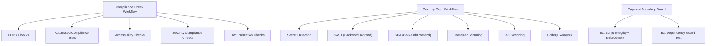
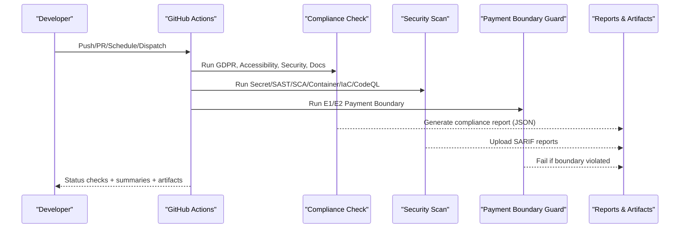
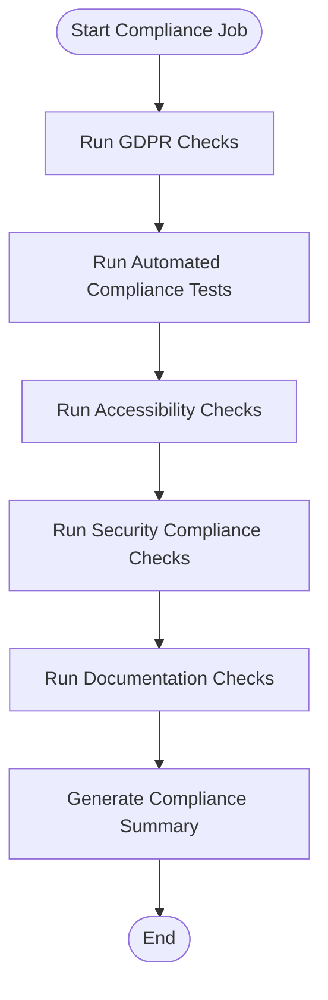
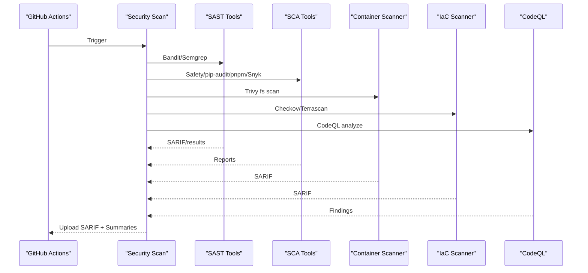
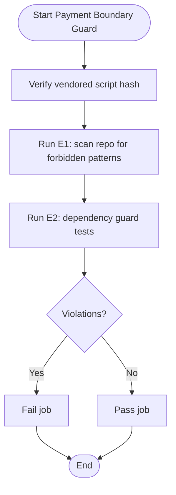
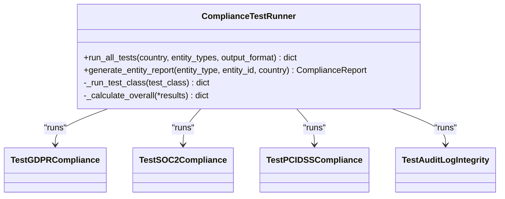
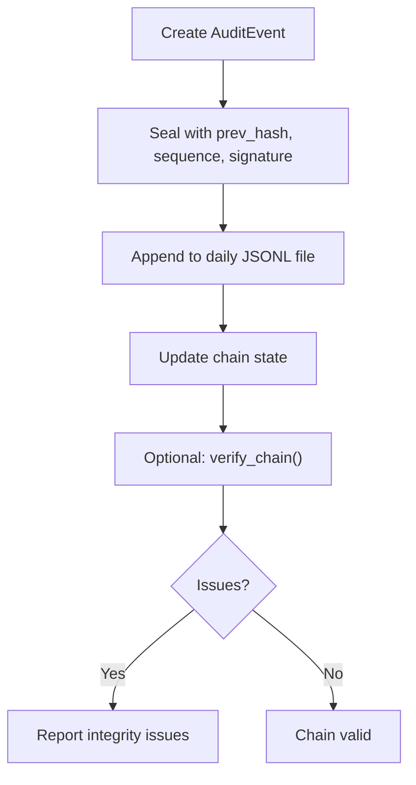
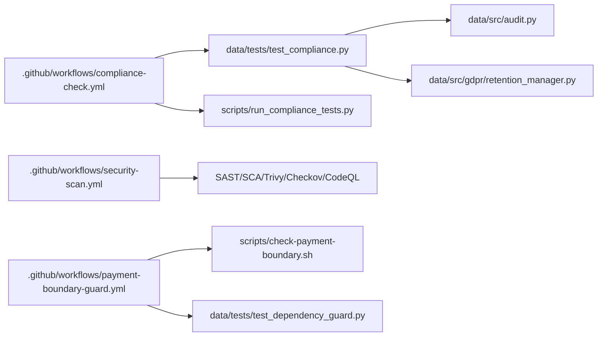

# Quality & Security Checks

<cite>
**Referenced Files in This Document**
- [compliance-check.yml](file://.github/workflows/compliance-check.yml)
- [security-scan.yml](file://.github/workflows/security-scan.yml)
- [payment-boundary-guard.yml](file://.github/workflows/payment-boundary-guard.yml)
- [check-payment-boundary.sh](file://scripts/check-payment-boundary.sh)
- [test_dependency_guard.py](file://data/tests/test_dependency_guard.py)
- [test_compliance.py](file://data/tests/test_compliance.py)
- [run_compliance_tests.py](file://scripts/run_compliance_tests.py)
- [audit.py](file://data/src/audit.py)
- [retention_manager.py](file://data/src/gdpr/retention_manager.py)
- [GDPR-checklist.md](file://docs/compliance/GDPR-checklist.md)
- [ADR-009-payment-boundary.md](file://docs/decisions/ADR-009-payment-boundary.md)
- [reusable-ci-workflows.md](file://docs/architecture/reusable-ci-workflows.md)
</cite>

## Table of Contents
1. [Introduction](#introduction)
2. [Project Structure](#project-structure)
3. [Core Components](#core-components)
4. [Architecture Overview](#architecture-overview)
5. [Detailed Component Analysis](#detailed-component-analysis)
6. [Dependency Analysis](#dependency-analysis)
7. [Performance Considerations](#performance-considerations)
8. [Troubleshooting Guide](#troubleshooting-guide)
9. [Conclusion](#conclusion)
10. [Appendices](#appendices)

## Introduction
This document explains the automated quality and security checks embedded in the CI/CD pipeline for JOL-HUB, with a focus on:
- Compliance check workflow validating GDPR requirements and data protection standards
- Security scan workflow covering dependency vulnerability scanning, container security analysis, and code security audits
- Payment boundary guard enforcing PCI-DSS scope minimization (Model A) so that jol-hub never directly integrates with payment service providers
- Configuration options, failure handling, and reporting mechanisms for each check type

The goal is to provide both high-level understanding and actionable details for engineers, compliance officers, and operators.

## Project Structure
The CI/CD quality and security gates are implemented as GitHub Actions workflows and supporting scripts/tests:
- Compliance checks: [.github/workflows/compliance-check.yml](file://.github/workflows/compliance-check.yml)
- Security scans: [.github/workflows/security-scan.yml](file://.github/workflows/security-scan.yml)
- Payment boundary guard: [.github/workflows/payment-boundary-guard.yml](file://.github/workflows/payment-boundary-guard.yml) and [scripts/check-payment-boundary.sh](file://scripts/check-payment-boundary.sh)
- Compliance test suite and runner: [data/tests/test_compliance.py](file://data/tests/test_compliance.py), [scripts/run_compliance_tests.py](file://scripts/run_compliance_tests.py)
- Dependency guard (CI twin): [data/tests/test_dependency_guard.py](file://data/tests/test_dependency_guard.py)
- Audit logging and retention: [data/src/audit.py](file://data/src/audit.py), [data/src/gdpr/retention_manager.py](file://data/src/gdpr/retention_manager.py)
- Policy and guidance: [docs/compliance/GDPR-checklist.md](file://docs/compliance/GDPR-checklist.md), [docs/decisions/ADR-009-payment-boundary.md](file://docs/decisions/ADR-009-payment-boundary.md), [docs/architecture/reusable-ci-workflows.md](file://docs/architecture/reusable-ci-workflows.md)

**Diagram sources**
- [compliance-check.yml:1-591](file://.github/workflows/compliance-check.yml#L1-L591)
- [security-scan.yml:1-379](file://.github/workflows/security-scan.yml#L1-L379)
- [payment-boundary-guard.yml:1-59](file://.github/workflows/payment-boundary-guard.yml#L1-L59)

**Section sources**
- [compliance-check.yml:1-591](file://.github/workflows/compliance-check.yml#L1-L591)
- [security-scan.yml:1-379](file://.github/workflows/security-scan.yml#L1-L379)
- [payment-boundary-guard.yml:1-59](file://.github/workflows/payment-boundary-guard.yml#L1-L59)

## Core Components
- Compliance Check Workflow
  - Triggers: push/PR/schedule/manual dispatch; runs GDPR, accessibility, security, documentation checks; generates summary artifacts
  - Key jobs: gdpr-check, automated-compliance-tests, accessibility-check, security-compliance, documentation-check, compliance-summary
- Security Scan Workflow
  - Triggers: push/PR/schedule/manual dispatch; runs secret detection, SAST, SCA, container scanning, IaC scanning, CodeQL
  - Outputs: SARIF reports uploaded to GitHub Security tab; artifacts retained per job
- Payment Boundary Guard
  - Enforces Model A: jol-hub must not integrate directly with PSPs; only internal payment API usage allowed
  - Two enforcement layers: E1 script integrity + runtime scan, E2 dependency guard tests

Configuration highlights:
- Python/Node versions via environment variables
- Optional inputs for compliance workflow to select check types
- Secrets required for some scanners (e.g., Snyk token)
- Artifact retention policies for reports

Failure handling:
- Many steps use continue-on-error or non-fatal outputs where appropriate
- Summary jobs aggregate results and produce final status
- Some checks intentionally fail builds when critical issues are found (e.g., payment boundary violations)

Reporting:
- Step summaries written to GitHub step logs
- JSON reports generated and uploaded as artifacts
- SARIF files uploaded to GitHub Security tab for centralized view

**Section sources**
- [compliance-check.yml:1-591](file://.github/workflows/compliance-check.yml#L1-L591)
- [security-scan.yml:1-379](file://.github/workflows/security-scan.yml#L1-L379)
- [payment-boundary-guard.yml:1-59](file://.github/workflows/payment-boundary-guard.yml#L1-L59)

## Architecture Overview
The CI/CD architecture orchestrates multiple independent checks to ensure continuous compliance and security posture.

**Diagram sources**
- [compliance-check.yml:1-591](file://.github/workflows/compliance-check.yml#L1-L591)
- [security-scan.yml:1-379](file://.github/workflows/security-scan.yml#L1-L379)
- [payment-boundary-guard.yml:1-59](file://.github/workflows/payment-boundary-guard.yml#L1-L59)

## Detailed Component Analysis

### Compliance Check Workflow
Purpose: Validate GDPR compliance, accessibility, security configuration, and documentation presence.

Key behaviors:
- GDPR checks:
  - Scans for encryption patterns, consent management, data subject rights endpoints, privacy docs, retention policies, audit logging
- Automated compliance tests:
  - Runs pytest suites for GDPR, SOC2 Type II, PCI-DSS, audit log integrity
  - Generates JSON report and uploads artifacts
- Accessibility checks:
  - ESLint with jsx-a11y, ARIA attributes, alt text, form labels, keyboard navigation
- Security compliance checks:
  - Validates Django security headers, authentication settings, CORS config, hardcoded secrets
- Documentation checks:
  - Ensures required docs exist and validates OpenAPI spec

Configuration options:
- Inputs: check_type (all, gdpr, accessibility, security, documentation)
- Versions: PYTHON_VERSION, NODE_VERSION, PNPM_VERSION

Failure handling:
- Steps append results to step summaries; some checks warn rather than fail
- Final summary job aggregates statuses across all sub-jobs

Reporting:
- Step summaries include pass/fail indicators
- JSON compliance report artifact retained for 90 days

**Diagram sources**
- [compliance-check.yml:42-591](file://.github/workflows/compliance-check.yml#L42-L591)

**Section sources**
- [compliance-check.yml:42-591](file://.github/workflows/compliance-check.yml#L42-L591)
- [test_compliance.py:133-800](file://data/tests/test_compliance.py#L133-L800)
- [run_compliance_tests.py:35-315](file://scripts/run_compliance_tests.py#L35-L315)

### Security Scan Workflow
Purpose: Detect secrets, vulnerabilities, misconfigurations, and unsafe code patterns across backend, frontend, containers, and infrastructure.

Scanners and scopes:
- Secret detection: Gitleaks, TruffleHog
- SAST: Bandit (Python), Semgrep (Python/Django/JS/React/Next.js)
- SCA: Safety, pip-audit (backend); pnpm audit, Snyk (frontend)
- Container scanning: Trivy filesystem scans for backend/frontend directories
- IaC scanning: Checkov (Terraform, Dockerfile, Kubernetes), Terrascan
- CodeQL: Security-extended and security-and-quality queries for Python and JavaScript/TypeScript

Configuration options:
- Environment variables for tool versions
- Secrets: SNYK_TOKEN for Snyk integration
- Severity thresholds and ignore-unfixed flags for container scans

Failure handling:
- Some steps continue-on-error to collect comprehensive results
- SARIF files uploaded to GitHub Security tab for triage
- Summary job lists statuses for each scan type

Reporting:
- SARIF artifacts for CodeQL and scanner integrations
- JSON reports for SCA tools uploaded as artifacts
- Step summaries include overall status table

**Diagram sources**
- [security-scan.yml:30-379](file://.github/workflows/security-scan.yml#L30-L379)

**Section sources**
- [security-scan.yml:30-379](file://.github/workflows/security-scan.yml#L30-L379)

### Payment Boundary Guard
Purpose: Enforce Model A (ADR-009) so jol-hub remains out of PCI scope by ensuring no direct Stripe SDK usage, keys, or server endpoints anywhere in the repository tree.

Enforcement layers:
- E1: Vendored script integrity verification (sha256sum) and execution against the workspace
- E2: Dependency guard test ensures stripe distribution is not installed and not declared in manifests; import attempt fails

Guard behavior:
- Scans server-side Python code, manifests, full tree, and frontend source trees
- Exemptions are explicitly enumerated (dependency trees, fixtures, ledger vocabulary files, rule documents)
- Violations cause the job to fail, blocking merges

Configuration options:
- No additional inputs; runs on push/PR to main/master/develop
- Requires pinned script hash verification

Failure handling:
- Any violation prints detailed hits and exits non-zero
- Dependency guard asserts absence of stripe package and importability

Reporting:
- Console output indicates violations or success message
- CI status reflects pass/fail for required checks

**Diagram sources**
- [payment-boundary-guard.yml:26-59](file://.github/workflows/payment-boundary-guard.yml#L26-L59)
- [check-payment-boundary.sh:49-193](file://scripts/check-payment-boundary.sh#L49-L193)
- [test_dependency_guard.py:25-68](file://data/tests/test_dependency_guard.py#L25-L68)

**Section sources**
- [payment-boundary-guard.yml:26-59](file://.github/workflows/payment-boundary-guard.yml#L26-L59)
- [check-payment-boundary.sh:49-193](file://scripts/check-payment-boundary.sh#L49-L193)
- [test_dependency_guard.py:25-68](file://data/tests/test_dependency_guard.py#L25-L68)
- [ADR-009-payment-boundary.md:1-111](file://docs/decisions/ADR-009-payment-boundary.md#L1-L111)

### Compliance Test Suite and Runner
Purpose: Provide automated validation of GDPR, SOC2 Type II, PCI-DSS, and audit log integrity, plus entity-specific reporting.

Key elements:
- Test classes cover GDPR articles, SOC2 trust services criteria, PCI-DSS requirements, and audit chain integrity
- Runner supports running all tests or specific standards, generating JSON/text output
- Exit codes reflect failures to gate CI pipelines

Configuration options:
- CLI arguments: country, standard, entity-type, entity-id, output format
- Defaults: country lt, output text

Failure handling:
- Non-zero exit on any failed test
- Aggregated scores classify compliant/partial/non-compliant

Reporting:
- Text summaries printed to console
- JSON output suitable for artifact storage and downstream processing

**Diagram sources**
- [run_compliance_tests.py:35-315](file://scripts/run_compliance_tests.py#L35-L315)
- [test_compliance.py:133-800](file://data/tests/test_compliance.py#L133-L800)

**Section sources**
- [test_compliance.py:133-800](file://data/tests/test_compliance.py#L133-L800)
- [run_compliance_tests.py:35-315](file://scripts/run_compliance_tests.py#L35-L315)

### Audit Logging and Retention
Purpose: Ensure tamper-evident audit trails and enforce retention rules aligned with GDPR and SOC2.

Key capabilities:
- AuditEvent with hash chain and HMAC signatures
- AuditLogger manages chain state, daily rotation, and query/reporting
- RetentionManager enforces legal holds and deletion policies

Configuration options:
- AUDIT_LOG_DIR, AUDIT_LOG_SECRET_KEY environment variables
- Retention rules defined per data type

Failure handling:
- Chain verification detects breaks, sequence gaps, hash mismatches, invalid signatures
- Deletion blocked when legal holds are active

Reporting:
- Query events and generate compliance reports
- Log directory contains structured JSONL entries

**Diagram sources**
- [audit.py:65-203](file://data/src/audit.py#L65-L203)
- [audit.py:205-370](file://data/src/audit.py#L205-L370)
- [audit.py:513-589](file://data/src/audit.py#L513-L589)
- [retention_manager.py:188-336](file://data/src/gdpr/retention_manager.py#L188-L336)

**Section sources**
- [audit.py:65-203](file://data/src/audit.py#L65-L203)
- [audit.py:205-370](file://data/src/audit.py#L205-L370)
- [audit.py:513-589](file://data/src/audit.py#L513-L589)
- [retention_manager.py:188-336](file://data/src/gdpr/retention_manager.py#L188-L336)

## Dependency Analysis
Relationships between components:
- Workflows orchestrate tests and scanners; tests depend on project structure and configs
- Payment boundary guard depends on vendored script integrity and dependency guard tests
- Compliance tests rely on existence and content of modules (audit, retention, models)
- Reusable workflows guide spoke repos to call standardized gates

**Diagram sources**
- [compliance-check.yml:1-591](file://.github/workflows/compliance-check.yml#L1-L591)
- [security-scan.yml:1-379](file://.github/workflows/security-scan.yml#L1-L379)
- [payment-boundary-guard.yml:1-59](file://.github/workflows/payment-boundary-guard.yml#L1-L59)
- [test_compliance.py:133-800](file://data/tests/test_compliance.py#L133-L800)
- [run_compliance_tests.py:35-315](file://scripts/run_compliance_tests.py#L35-L315)
- [check-payment-boundary.sh:49-193](file://scripts/check-payment-boundary.sh#L49-L193)
- [test_dependency_guard.py:25-68](file://data/tests/test_dependency_guard.py#L25-L68)
- [audit.py:65-203](file://data/src/audit.py#L65-L203)
- [retention_manager.py:188-336](file://data/src/gdpr/retention_manager.py#L188-L336)

**Section sources**
- [compliance-check.yml:1-591](file://.github/workflows/compliance-check.yml#L1-L591)
- [security-scan.yml:1-379](file://.github/workflows/security-scan.yml#L1-L379)
- [payment-boundary-guard.yml:1-59](file://.github/workflows/payment-boundary-guard.yml#L1-L59)

## Performance Considerations
- Parallel jobs: Each workflow defines independent jobs that run concurrently, reducing total pipeline time
- Caching: Node and pip caches used to speed up installs
- Selective triggers: Path filters limit runs to relevant changes
- Tool selection: Lightweight scanners (Bandit, Safety, pnpm audit) complement heavier ones (Semgrep, CodeQL)
- Artifact retention: Configured to balance visibility and storage costs

[No sources needed since this section provides general guidance]

## Troubleshooting Guide
Common issues and resolutions:
- Compliance checks failing due to missing documentation or endpoints:
  - Add required files (privacy policy, cookie policy, terms) and implement data subject rights endpoints
  - Reference: [compliance-check.yml:110-154](file://.github/workflows/compliance-check.yml#L110-L154)
- Security scan findings:
  - Review SARIF reports in GitHub Security tab; remediate medium/high severity issues
  - For SCA, update vulnerable dependencies; for SAST, fix insecure patterns
  - Reference: [security-scan.yml:62-141](file://.github/workflows/security-scan.yml#L62-L141), [security-scan.yml:147-231](file://.github/workflows/security-scan.yml#L147-L231)
- Payment boundary guard violations:
  - Remove any direct Stripe SDK imports, keys, or server endpoints from hub code/config
  - Ensure no stripe package in requirements; confirm import fails at runtime
  - Reference: [check-payment-boundary.sh:132-187](file://scripts/check-payment-boundary.sh#L132-L187), [test_dependency_guard.py:36-68](file://data/tests/test_dependency_guard.py#L36-L68)
- Audit log integrity issues:
  - Verify chain continuity, sequence numbers, and HMAC signatures
  - Investigate potential tampering or misconfiguration of secret key
  - Reference: [audit.py:513-589](file://data/src/audit.py#L513-L589)
- Retention and erasure requests blocked:
  - Check for active legal holds preventing deletion
  - Adjust legal hold registry or resolve legal constraints
  - Reference: [retention_manager.py:257-336](file://data/src/gdpr/retention_manager.py#L257-L336)

**Section sources**
- [compliance-check.yml:110-154](file://.github/workflows/compliance-check.yml#L110-L154)
- [security-scan.yml:62-141](file://.github/workflows/security-scan.yml#L62-L141)
- [security-scan.yml:147-231](file://.github/workflows/security-scan.yml#L147-L231)
- [check-payment-boundary.sh:132-187](file://scripts/check-payment-boundary.sh#L132-L187)
- [test_dependency_guard.py:36-68](file://data/tests/test_dependency_guard.py#L36-L68)
- [audit.py:513-589](file://data/src/audit.py#L513-L589)
- [retention_manager.py:257-336](file://data/src/gdpr/retention_manager.py#L257-L336)

## Conclusion
JOL-HUB’s CI/CD pipeline implements robust, automated quality and security checks:
- Compliance checks validate GDPR, accessibility, security configuration, and documentation
- Security scans detect secrets, vulnerabilities, and misconfigurations across code, dependencies, containers, and infrastructure
- Payment boundary guard enforces PCI scope minimization through strict pattern scanning and dependency checks
- Reporting mechanisms provide clear visibility into compliance and security status, enabling timely remediation

Adhering to these gates ensures ongoing regulatory compliance and reduces risk exposure across the platform.

[No sources needed since this section summarizes without analyzing specific files]

## Appendices

### Configuration Options Summary
- Compliance workflow:
  - Inputs: check_type (all, gdpr, accessibility, security, documentation)
  - Versions: PYTHON_VERSION, NODE_VERSION, PNPM_VERSION
- Security scan workflow:
  - Secrets: SNYK_TOKEN
  - Tools: Gitleaks, TruffleHog, Bandit, Semgrep, Safety, pip-audit, pnpm audit, Snyk, Trivy, Checkov, Terrascan, CodeQL
- Payment boundary guard:
  - Vendored script integrity via sha256sum
  - E1/E2 enforcement via script and tests

**Section sources**
- [compliance-check.yml:10-41](file://.github/workflows/compliance-check.yml#L10-L41)
- [security-scan.yml:25-29](file://.github/workflows/security-scan.yml#L25-L29)
- [payment-boundary-guard.yml:31-40](file://.github/workflows/payment-boundary-guard.yml#L31-L40)

### Failure Handling and Reporting Mechanisms
- Step summaries: Written to GitHub step logs for immediate visibility
- Artifacts: JSON reports and SARIF files uploaded with retention policies
- Gate failures: Payment boundary guard and critical security findings can block merges
- Aggregation: Summary jobs compile statuses across sub-jobs

**Section sources**
- [compliance-check.yml:547-591](file://.github/workflows/compliance-check.yml#L547-L591)
- [security-scan.yml:350-379](file://.github/workflows/security-scan.yml#L350-L379)
- [payment-boundary-guard.yml:34-40](file://.github/workflows/payment-boundary-guard.yml#L34-L40)