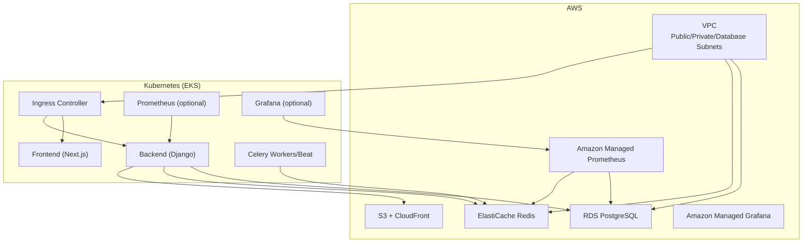
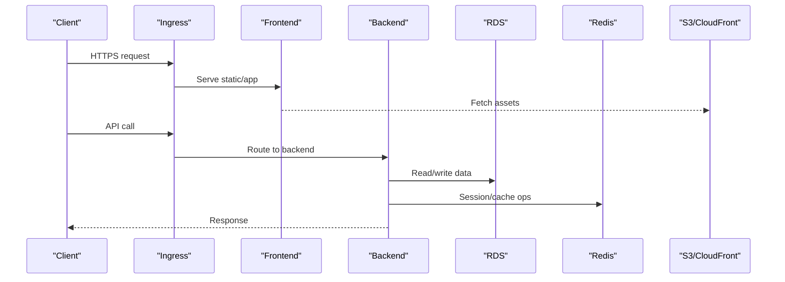
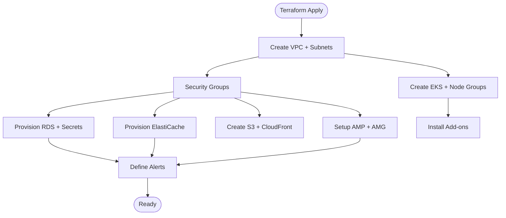
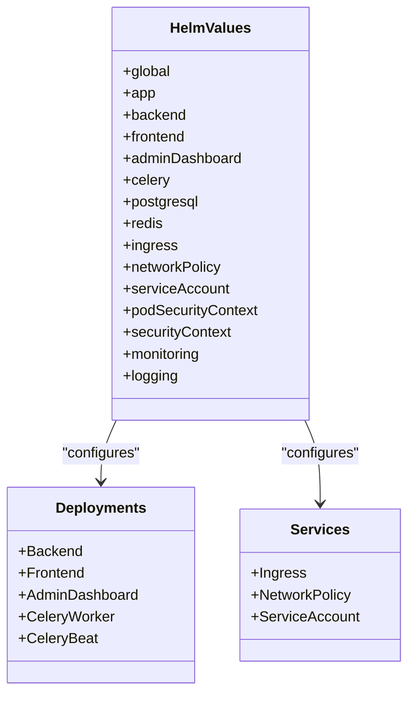
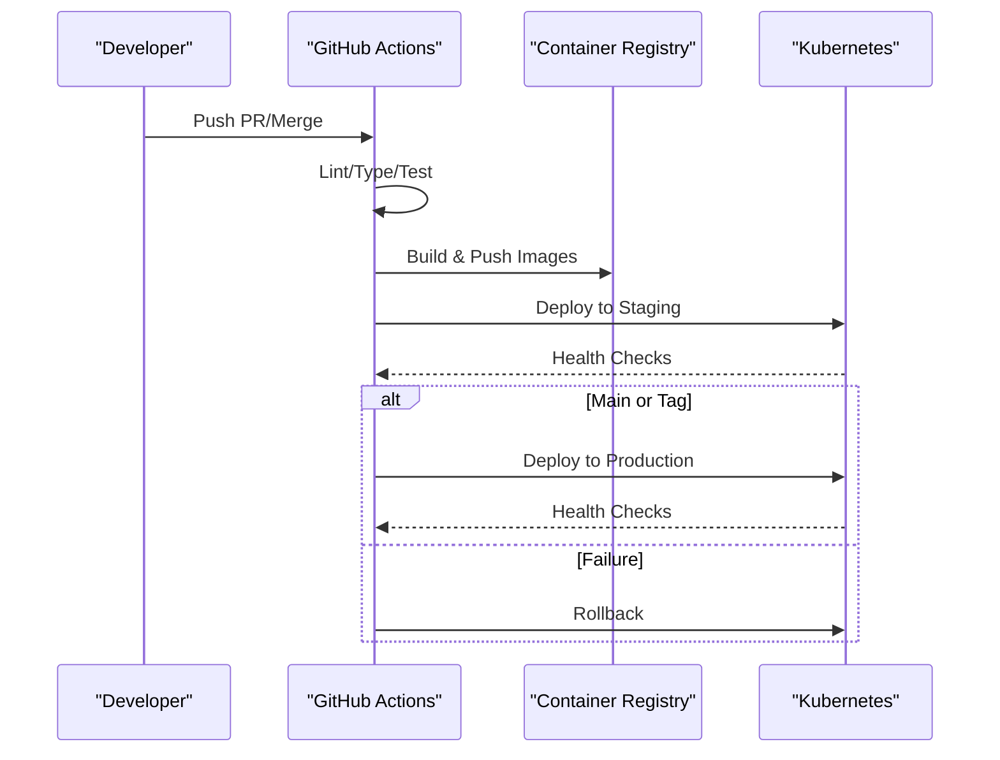
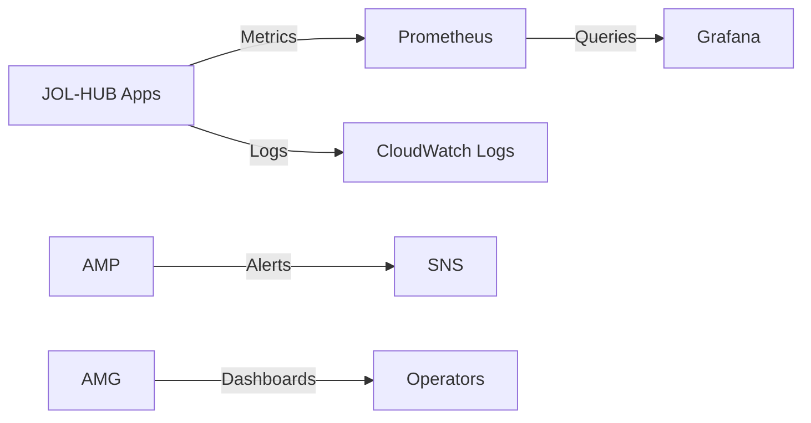
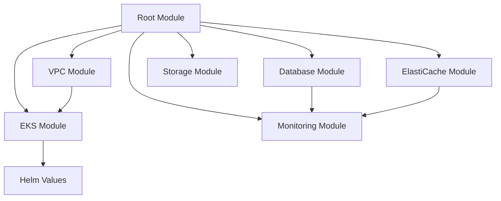

# Infrastructure & Deployment

<cite>
**Referenced Files in This Document**
- [main.tf](file://infra/terraform/main.tf)
- [vpc/main.tf](file://infra/terraform/modules/vpc/main.tf)
- [eks/main.tf](file://infra/terraform/modules/eks/main.tf)
- [database/main.tf](file://infra/terraform/modules/database/main.tf)
- [values.yaml](file://infra/helm/jol-hub/values.yaml)
- [Chart.yaml](file://infra/helm/jol-hub/Chart.yaml)
- [ci.yml](file://.github/workflows/ci.yml)
- [cd.yml](file://.github/workflows/cd.yml)
- [monitoring/main.tf](file://infra/terraform/modules/monitoring/main.tf)
- [prometheus.yaml](file://infra/kubernetes/monitoring/prometheus.yaml)
- [grafana.yaml](file://infra/kubernetes/monitoring/grafana.yaml)
</cite>

## Table of Contents
1. Introduction
2. Project Structure
3. Core Components
4. Architecture Overview
5. Detailed Component Analysis
6. Dependency Analysis
7. Performance Considerations
8. Troubleshooting Guide
9. Conclusion
10. Appendices

## Introduction
This document describes the infrastructure and deployment strategy for the JOL-HUB platform. It covers Terraform modules for provisioning AWS resources (VPC, EKS, RDS, ElastiCache, S3/CloudFront), Kubernetes application packaging with Helm, CI/CD automation via GitHub Actions, monitoring and observability with Prometheus and Grafana (both on-cluster and AWS managed), environment management, secrets handling, backup and disaster recovery procedures, and production performance tuning guidelines.

## Project Structure
The repository organizes infrastructure and deployment artifacts into clear layers:
- Infrastructure as Code (Terraform): Root module orchestrates VPC, security, databases, caching, storage, ECS/EKS, monitoring, logging, and secrets.
- Kubernetes manifests and Helm charts: Application deployments, services, ingress, network policies, and optional in-cluster monitoring/logging stacks.
- CI/CD pipelines: GitHub Actions workflows for continuous integration and deployment to staging and production.
- Monitoring and observability: On-cluster Prometheus/Grafana and AWS Managed Prometheus/Grafana with CloudWatch alarms and dashboards.

**Diagram sources**
- [main.tf:63-271](file://infra/terraform/main.tf#L63-L271)
- [vpc/main.tf:20-250](file://infra/terraform/modules/vpc/main.tf#L20-L250)
- [eks/main.tf:15-240](file://infra/terraform/modules/eks/main.tf#L15-L240)
- [database/main.tf:111-162](file://infra/terraform/modules/database/main.tf#L111-L162)
- [monitoring/main.tf:11-85](file://infra/terraform/modules/monitoring/main.tf#L11-L85)

**Section sources**
- [main.tf:1-326](file://infra/terraform/main.tf#L1-L326)
- [Chart.yaml:1-19](file://infra/helm/jol-hub/Chart.yaml#L1-L19)

## Core Components
- Networking and isolation: Multi-AZ VPC with public/private/database subnets, NAT Gateways per AZ, and VPC Endpoints for AWS APIs.
- Compute: Optional EKS cluster with general-purpose and compute-optimized node groups; ECS/Fargate path also supported by the root module.
- Data stores: RDS PostgreSQL with parameter tuning, backups, and enhanced monitoring; ElastiCache Redis for caching and task queues.
- Storage: S3 buckets with CloudFront distribution for static assets.
- Observability: AWS Managed Prometheus and Grafana with alert rules and dashboards; optional in-cluster Prometheus/Grafana.
- Secrets: AWS Secrets Manager-backed credentials for DB and cache; optional HashiCorp Vault integration.

**Section sources**
- [vpc/main.tf:20-250](file://infra/terraform/modules/vpc/main.tf#L20-L250)
- [eks/main.tf:15-240](file://infra/terraform/modules/eks/main.tf#L15-L240)
- [database/main.tf:65-162](file://infra/terraform/modules/database/main.tf#L65-L162)
- [monitoring/main.tf:11-85](file://infra/terraform/modules/monitoring/main.tf#L11-L85)

## Architecture Overview
The platform provisions a secure multi-AZ VPC, deploys an optional EKS cluster, and connects applications to RDS and ElastiCache. Static assets are served via S3/CloudFront. Observability is provided through AWS Managed Prometheus/Grafana with CloudWatch alarms, while an optional in-cluster Prometheus/Grafana stack can be used for deeper application metrics.

**Diagram sources**
- [values.yaml:184-196](file://infra/helm/jol-hub/values.yaml#L184-L196)
- [database/main.tf:111-162](file://infra/terraform/modules/database/main.tf#L111-L162)

## Detailed Component Analysis

### Terraform Modules
- VPC: Creates a multi-AZ VPC with public, private, and database subnets, IGW, NAT Gateways per AZ, route tables, and VPC Endpoints for ECR, Logs, and S3 to reduce NAT costs and improve security.
- Security: Centralized security groups for ALB, ECS/EKS, RDS, and ElastiCache; bastion support and admin CIDR restrictions.
- Database (RDS): PostgreSQL instance with optimized parameter group, encryption, backups, maintenance windows, enhanced monitoring, and CloudWatch alarms. Credentials stored in Secrets Manager.
- ElastiCache: Redis cluster with snapshot retention and alarms.
- Storage: S3 bucket(s) with CloudFront distribution for global content delivery.
- EKS: Cluster with two node groups (general and compute-optimized), addons (VPC CNI, CoreDNS, kube-proxy, EBS CSI), KMS encryption for secrets, and IRSA for OIDC-based permissions.
- Monitoring: Amazon Managed Prometheus workspace, AlertManager configuration, rule groups, and Amazon Managed Grafana workspace with IAM roles and VPC egress.
- Logging: Optional OpenSearch/ELK stack provisioned with VPC networking and retention settings.
- Secrets: Centralized secret management using AWS Secrets Manager with rotation options and optional Vault integration.

**Diagram sources**
- [main.tf:63-271](file://infra/terraform/main.tf#L63-L271)
- [vpc/main.tf:20-250](file://infra/terraform/modules/vpc/main.tf#L20-L250)
- [database/main.tf:111-162](file://infra/terraform/modules/database/main.tf#L111-L162)
- [monitoring/main.tf:11-85](file://infra/terraform/modules/monitoring/main.tf#L11-L85)

**Section sources**
- [main.tf:63-271](file://infra/terraform/main.tf#L63-L271)
- [vpc/main.tf:20-250](file://infra/terraform/modules/vpc/main.tf#L20-L250)
- [eks/main.tf:15-240](file://infra/terraform/modules/eks/main.tf#L15-L240)
- [database/main.tf:65-162](file://infra/terraform/modules/database/main.tf#L65-L162)
- [monitoring/main.tf:11-85](file://infra/terraform/modules/monitoring/main.tf#L11-L85)

### Kubernetes Deployment Strategy (Helm)
- Chart structure: Application chart defines backend, frontend, admin dashboard, Celery workers/beat, PostgreSQL, Redis, Ingress, NetworkPolicy, ServiceAccount, and optional monitoring.
- Autoscaling: Horizontal Pod Autoscaler configured for backend and Celery based on CPU/memory targets.
- Ingress: TLS termination via cert-manager with Nginx annotations; separate domains for API and admin.
- Security: Non-root containers, dropped capabilities, read-only filesystems, and pod security contexts enforced.
- Environment variables: Configured via values and envFrom patterns; sensitive values should be injected from Kubernetes Secrets or external secret managers.

**Diagram sources**
- [values.yaml:5-264](file://infra/helm/jol-hub/values.yaml#L5-L264)

**Section sources**
- [values.yaml:19-196](file://infra/helm/jol-hub/values.yaml#L19-L196)
- [Chart.yaml:1-19](file://infra/helm/jol-hub/Chart.yaml#L1-L19)

### CI/CD Pipelines (GitHub Actions)
- Continuous Integration:
  - Linting, type checks, unit/integration tests for backend and frontend.
  - Docker build verification with caching.
  - Coverage reporting to Codecov.
- Continuous Deployment:
  - Build and push images to GitHub Container Registry with semantic versioning and SHA tags.
  - Staging deployment on develop branch merges with smoke tests.
  - Production deployment on main branch or tagged releases with health checks and release notes.
  - Rollback workflow triggered on failure to revert deployments.

**Diagram sources**
- [ci.yml:36-379](file://.github/workflows/ci.yml#L36-L379)
- [cd.yml:39-335](file://.github/workflows/cd.yml#L39-L335)

**Section sources**
- [ci.yml:36-379](file://.github/workflows/ci.yml#L36-L379)
- [cd.yml:39-335](file://.github/workflows/cd.yml#L39-L335)

### Monitoring and Observability
- AWS Managed Prometheus: Workspace created with logging to CloudWatch, AlertManager definitions, and rule groups for API latency, error rates, DB CPU, connections, and Redis memory.
- Amazon Managed Grafana: Workspace with SAML authentication, data sources (Prometheus, CloudWatch, Loki), and VPC egress access.
- In-cluster Prometheus/Grafana: Optional stack with RBAC, scrape configs for Kubernetes, nodes, pods, backend, PostgreSQL, and Redis exporters; persistent storage for metrics and dashboards.
- Dashboards: Predefined Grafana dashboards for overview metrics including API response time, request rate, CPU, and memory usage.

**Diagram sources**
- [monitoring/main.tf:11-85](file://infra/terraform/modules/monitoring/main.tf#L11-L85)
- [prometheus.yaml:51-225](file://infra/kubernetes/monitoring/prometheus.yaml#L51-L225)
- [grafana.yaml:5-414](file://infra/kubernetes/monitoring/grafana.yaml#L5-L414)

**Section sources**
- [monitoring/main.tf:11-391](file://infra/terraform/modules/monitoring/main.tf#L11-L391)
- [prometheus.yaml:51-225](file://infra/kubernetes/monitoring/prometheus.yaml#L51-L225)
- [grafana.yaml:5-414](file://infra/kubernetes/monitoring/grafana.yaml#L5-L414)

## Dependency Analysis
- Terraform root module composes multiple modules with explicit dependencies:
  - VPC provides subnets and security groups consumed by database, elasticache, ecs/eks, monitoring, and logging modules.
  - Database and elasticache expose secrets ARNs consumed by ECS/ECS tasks and optionally by EKS workloads via IRSA.
  - Monitoring depends on ALB name, DB identifier, and Redis cluster ID to configure alarms and dashboards.
- Kubernetes components depend on Helm values for image tags, autoscaling thresholds, and ingress configuration.
- CI/CD depends on container registry credentials and Kubernetes kubeconfigs for staging and production.

**Diagram sources**
- [main.tf:63-271](file://infra/terraform/main.tf#L63-L271)
- [values.yaml:19-196](file://infra/helm/jol-hub/values.yaml#L19-L196)

**Section sources**
- [main.tf:63-271](file://infra/terraform/main.tf#L63-L271)

## Performance Considerations
- Database tuning:
  - Use the provided parameter group with shared_buffers, effective_cache_size, and maintenance_work_mem tuned to instance memory.
  - Enable Performance Insights and set appropriate retention for production.
  - Monitor CPU and connection limits; adjust instance class or enable read replicas if needed.
- Caching:
  - Configure Redis node types and cluster size based on workload; monitor memory usage and eviction policies.
- Autoscaling:
  - Set HPA targets for backend and Celery based on observed CPU/memory profiles; ensure minimum replicas for high availability.
- Ingress and CDN:
  - Offload static assets to S3/CloudFront; tune proxy body size and timeouts in ingress annotations.
- Observability:
  - Define alert rules for API latency, error rates, DB CPU, and Redis memory; integrate with SNS for notifications.
  - Use Prometheus scrapes at appropriate intervals; consider resource requests/limits to avoid noisy neighbor issues.

[No sources needed since this section provides general guidance]

## Troubleshooting Guide
- Database connectivity:
  - Verify security groups allow traffic from app subnets; check subnet groups and parameter group assignments.
  - Inspect CloudWatch alarms for CPU and storage thresholds; review logs for slow queries.
- Redis issues:
  - Confirm ElastiCache security groups and subnet placement; monitor memory alarms and snapshots.
- EKS cluster access:
  - Ensure OIDC provider and IRSA roles are configured; validate node group labels/taints for workload placement.
- Ingress/TLS:
  - Check cert-manager issuer status and TLS secrets; verify Nginx annotations and domain DNS records.
- CI/CD failures:
  - Review job logs for lint/type/test errors; confirm registry login and kubeconfig secrets for target environments.
- Rollbacks:
  - Use the rollback workflow to revert deployments when health checks fail; verify rollout status after undo.

**Section sources**
- [database/main.tf:196-233](file://infra/terraform/modules/database/main.tf#L196-L233)
- [monitoring/main.tf:163-287](file://infra/terraform/modules/monitoring/main.tf#L163-L287)
- [cd.yml:301-335](file://.github/workflows/cd.yml#L301-L335)

## Conclusion
JOL-HUB’s infrastructure is defined declaratively with Terraform, deployed via Helm on Kubernetes, and automated through GitHub Actions. The design emphasizes security (multi-AZ, least privilege, encryption), scalability (autoscaling, CDN), and observability (managed Prometheus/Grafana, CloudWatch alarms). With robust CI/CD, secrets management, and performance tuning guidelines, the platform supports reliable production operations and rapid iteration.

[No sources needed since this section summarizes without analyzing specific files]

## Appendices

### Environment Management and Secrets Handling
- Environments:
  - Staging: Automatic deployment on develop branch merges with smoke tests.
  - Production: Manual or tag-triggered deployment with comprehensive health checks.
- Secrets:
  - AWS Secrets Manager stores DB and cache credentials; ECS/EKS workloads retrieve them via IAM roles and service accounts.
  - Optional HashiCorp Vault integration available for centralized secret management.
  - Kubernetes Secrets used for Grafana admin credentials and other runtime secrets.

**Section sources**
- [cd.yml:153-295](file://.github/workflows/cd.yml#L153-L295)
- [database/main.tf:25-45](file://infra/terraform/modules/database/main.tf#L25-L45)
- [grafana.yaml:407-414](file://infra/kubernetes/monitoring/grafana.yaml#L407-L414)

### Backup and Disaster Recovery Procedures
- RDS:
  - Automated backups with retention period; point-in-time recovery enabled.
  - Enhanced monitoring and alarms for CPU and storage thresholds.
- ElastiCache:
  - Snapshot retention configured; restore from snapshots if needed.
- S3:
  - Versioning and lifecycle policies recommended for asset durability.
- EKS:
  - Maintain Helm values and manifests in version control; use GitOps practices for drift detection and rollbacks.
- Stateful data:
  - Regularly test restore procedures; document runbooks for DR scenarios.

**Section sources**
- [database/main.tf:138-162](file://infra/terraform/modules/database/main.tf#L138-L162)
- [monitoring/main.tf:196-233](file://infra/terraform/modules/monitoring/main.tf#L196-L233)

### Production Performance Tuning Guidelines
- Right-size instances and node groups; use compute-optimized nodes for Celery workers.
- Tune HPA thresholds based on load testing; ensure minimum replicas for HA.
- Optimize database parameters and connection pooling; monitor slow query logs.
- Use CloudFront for static assets; configure caching headers and compression.
- Enable and review Prometheus alerts; adjust thresholds to minimize noise while catching real issues.

[No sources needed since this section provides general guidance]