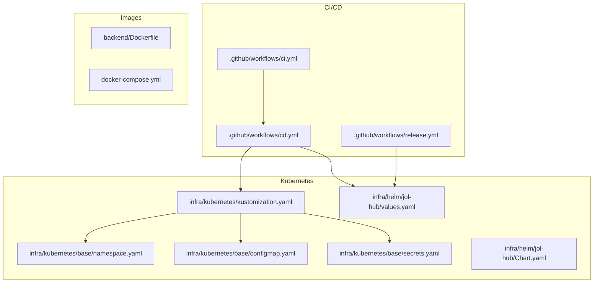
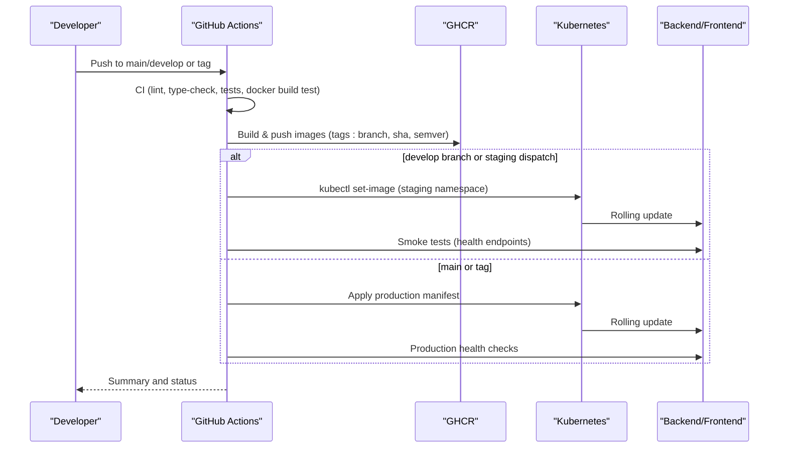
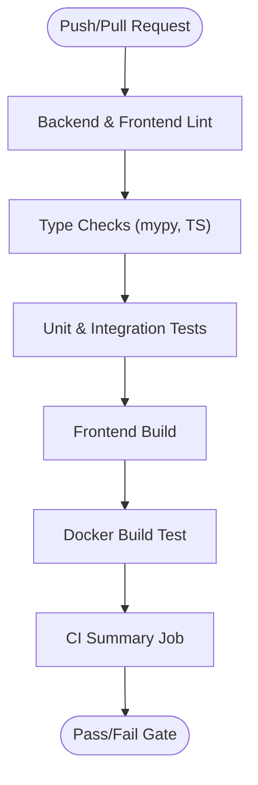
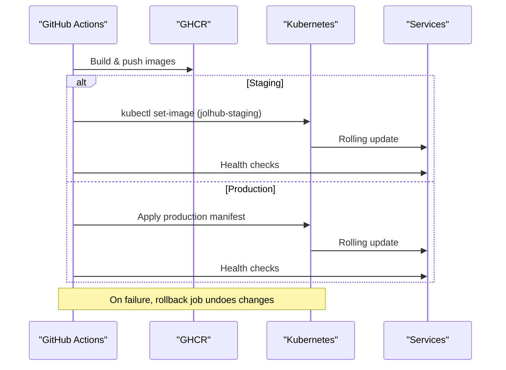
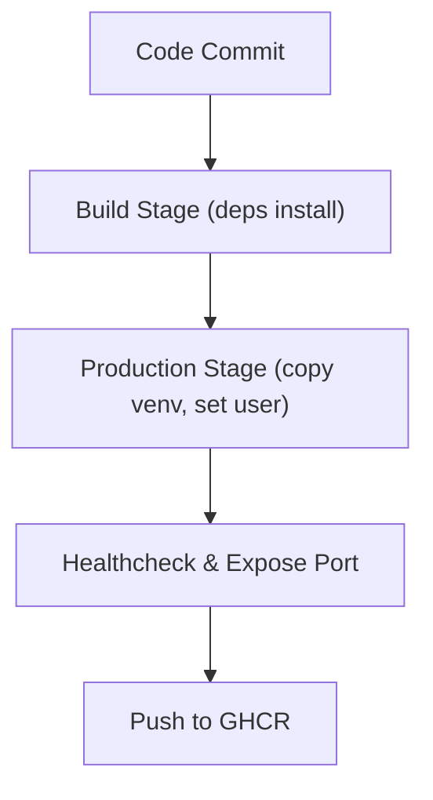
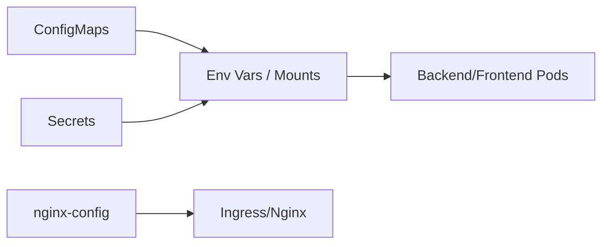
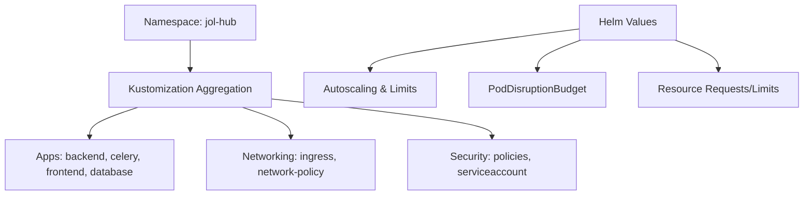
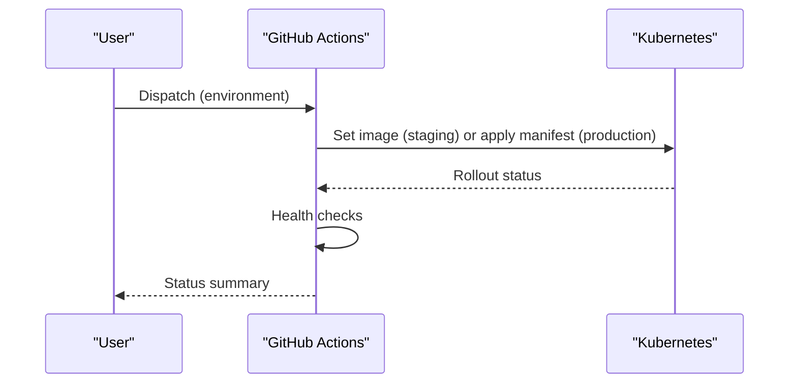
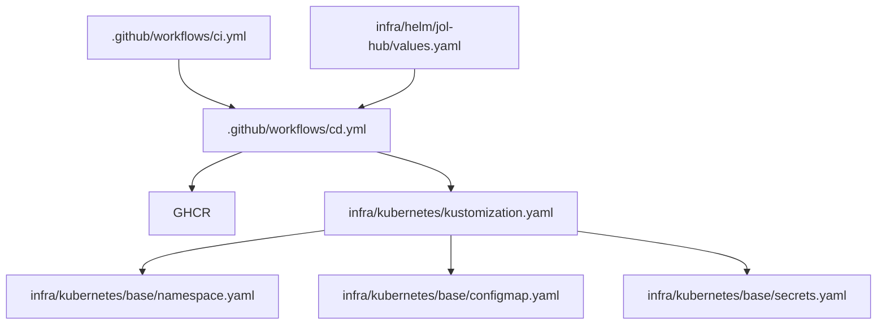

# Deployment Workflows & CI/CD

<cite>
**Referenced Files in This Document**
- [ci.yml](file://.github/workflows/ci.yml)
- [cd.yml](file://.github/workflows/cd.yml)
- [release.yml](file://.github/workflows/release.yml)
- [reusable-ci-workflows.md](file://docs/architecture/reusable-ci-workflows.md)
- [Dockerfile](file://backend/Dockerfile)
- [docker-compose.yml](file://docker-compose.yml)
- [kustomization.yaml](file://infra/kubernetes/kustomization.yaml)
- [namespace.yaml](file://infra/kubernetes/base/namespace.yaml)
- [configmap.yaml](file://infra/kubernetes/base/configmap.yaml)
- [secrets.yaml](file://infra/kubernetes/base/secrets.yaml)
- [Chart.yaml](file://infra/helm/jol-hub/Chart.yaml)
- [values.yaml](file://infra/helm/jol-hub/values.yaml)
</cite>

## Table of Contents
1. Introduction
2. Project Structure
3. Core Components
4. Architecture Overview
5. Detailed Component Analysis
6. Dependency Analysis
7. Performance Considerations
8. Troubleshooting Guide
9. Conclusion

## Introduction
This document describes the end-to-end deployment workflow for the JOL-HUB platform, from code commit to production release. It covers automated testing, image building, Kubernetes deployment via kubectl and Helm, environment-specific configuration with ConfigMaps and Secrets, namespace organization, resource quotas and limit ranges, rollback procedures, blue-green and canary strategies, backup and disaster recovery, data migration, maintenance windows, troubleshooting, and performance optimization across environments.

## Project Structure
The repository organizes CI/CD pipelines under .github/workflows, container images under backend and frontend directories, and Kubernetes manifests under infra/kubernetes (Kustomize) and infra/helm (Helm chart). A local development stack is defined with docker-compose.

**Diagram sources**
- [ci.yml:1-379](file://.github/workflows/ci.yml#L1-L379)
- [cd.yml:1-335](file://.github/workflows/cd.yml#L1-L335)
- [release.yml:1-48](file://.github/workflows/release.yml#L1-L48)
- [Dockerfile:1-72](file://backend/Dockerfile#L1-L72)
- [docker-compose.yml:1-156](file://docker-compose.yml#L1-L156)
- [kustomization.yaml:1-58](file://infra/kubernetes/kustomization.yaml#L1-L58)
- [namespace.yaml:1-16](file://infra/kubernetes/base/namespace.yaml#L1-L16)
- [configmap.yaml:1-198](file://infra/kubernetes/base/configmap.yaml#L1-L198)
- [secrets.yaml:1-88](file://infra/kubernetes/base/secrets.yaml#L1-L88)
- [values.yaml:1-264](file://infra/helm/jol-hub/values.yaml#L1-L264)
- [Chart.yaml:1-19](file://infra/helm/jol-hub/Chart.yaml#L1-L19)

**Section sources**
- [ci.yml:1-379](file://.github/workflows/ci.yml#L1-L379)
- [cd.yml:1-335](file://.github/workflows/cd.yml#L1-L335)
- [release.yml:1-48](file://.github/workflows/release.yml#L1-L48)
- [docker-compose.yml:1-156](file://docker-compose.yml#L1-L156)
- [kustomization.yaml:1-58](file://infra/kubernetes/kustomization.yaml#L1-L58)
- [values.yaml:1-264](file://infra/helm/jol-hub/values.yaml#L1-L264)

## Core Components
- Continuous Integration (CI): Linting, type checks, unit/integration tests, Docker build validation.
- Continuous Deployment (CD): Build and push images to GitHub Container Registry; deploy to staging and production using kubectl; smoke/health checks; rollback on failure.
- Releases: Automated package versioning and publishing via Changesets.
- Images: Multi-stage Python backend image with health check and non-root execution.
- Kubernetes: Namespace, ConfigMaps, Secrets, Ingress, NetworkPolicy, and application Deployments via Kustomize; Helm values for environment tuning.
- Local Dev: docker-compose orchestrates DB, Redis, MongoDB, backend, Celery worker, and scheduler.

**Section sources**
- [ci.yml:36-174](file://.github/workflows/ci.yml#L36-L174)
- [ci.yml:179-315](file://.github/workflows/ci.yml#L179-L315)
- [cd.yml:39-148](file://.github/workflows/cd.yml#L39-L148)
- [cd.yml:153-295](file://.github/workflows/cd.yml#L153-L295)
- [release.yml:1-48](file://.github/workflows/release.yml#L1-L48)
- [Dockerfile:1-72](file://backend/Dockerfile#L1-L72)
- [kustomization.yaml:1-58](file://infra/kubernetes/kustomization.yaml#L1-L58)
- [values.yaml:19-139](file://infra/helm/jol-hub/values.yaml#L19-L139)

## Architecture Overview
The pipeline builds and tests both backend and frontend, pushes images to GHCR, then deploys to staging on develop and to production on main or tags. Staging uses kubectl set-image; production applies a generated manifest. Health checks validate rollout success. Rollback is available via workflow dispatch.

**Diagram sources**
- [ci.yml:321-342](file://.github/workflows/ci.yml#L321-L342)
- [cd.yml:39-148](file://.github/workflows/cd.yml#L39-L148)
- [cd.yml:153-205](file://.github/workflows/cd.yml#L153-L205)
- [cd.yml:211-295](file://.github/workflows/cd.yml#L211-L295)

**Section sources**
- [cd.yml:1-335](file://.github/workflows/cd.yml#L1-L335)
- [ci.yml:1-379](file://.github/workflows/ci.yml#L1-L379)

## Detailed Component Analysis

### CI Pipeline
- Triggers on push/pull requests to main, master, develop.
- Backend: lint/format (black, isort, flake8), type check (mypy), unit/integration tests with PostgreSQL and Redis services, coverage upload.
- Frontend: lint/format (ESLint, Prettier), TypeScript check, unit tests, build artifacts uploaded.
- Docker build test validates multi-stage backend image.

**Diagram sources**
- [ci.yml:36-174](file://.github/workflows/ci.yml#L36-L174)
- [ci.yml:179-315](file://.github/workflows/ci.yml#L179-L315)
- [ci.yml:321-342](file://.github/workflows/ci.yml#L321-L342)
- [ci.yml:347-379](file://.github/workflows/ci.yml#L347-L379)

**Section sources**
- [ci.yml:1-379](file://.github/workflows/ci.yml#L1-L379)

### CD Pipeline
- Builds and pushes backend/frontend images with metadata tags (branch, PR, semver, sha, latest on main).
- Deploys to staging on develop or manual dispatch; updates deployments via kubectl set-image and waits for rollout; runs smoke tests.
- Deploys to production on main or tags; applies generated manifest; waits for rollout; runs comprehensive health checks; creates GitHub release for tags.
- Rollback job triggers on failure during dispatch; undoes deployments and reports status.

**Diagram sources**
- [cd.yml:39-148](file://.github/workflows/cd.yml#L39-L148)
- [cd.yml:153-205](file://.github/workflows/cd.yml#L153-L205)
- [cd.yml:211-295](file://.github/workflows/cd.yml#L211-L295)
- [cd.yml:301-335](file://.github/workflows/cd.yml#L301-L335)

**Section sources**
- [cd.yml:1-335](file://.github/workflows/cd.yml#L1-L335)

### Image Building
- Backend uses a multi-stage Dockerfile: builder installs dependencies into a virtual environment; production stage copies venv, sets non-root user, exposes port 8000, defines a health check, and runs Gunicorn.
- Frontend build is executed in CI and packaged into an image by the CD pipeline.

**Diagram sources**
- [Dockerfile:1-72](file://backend/Dockerfile#L1-L72)

**Section sources**
- [Dockerfile:1-72](file://backend/Dockerfile#L1-L72)

### Environment Configuration (ConfigMaps and Secrets)
- ConfigMaps provide non-sensitive settings: Django modules, allowed hosts/CORS/CSRF origins, database and Redis host/port, Celery URLs, GDPR flags, email settings, feature flags, rate limiting. An nginx ConfigMap includes security headers, compression, rate limits, upstream, TLS config, static/media locations, and proxy rules.
- Secrets templates include Django secret key, DB credentials, Redis password, PayPal/BITRIX/OAuth credentials, email credentials, Sentry DSN, MFA issuer, Postgres credentials, Redis credentials, and TLS secrets. The template notes external secret management for production.

**Diagram sources**
- [configmap.yaml:1-198](file://infra/kubernetes/base/configmap.yaml#L1-L198)
- [secrets.yaml:1-88](file://infra/kubernetes/base/secrets.yaml#L1-L88)

**Section sources**
- [configmap.yaml:1-198](file://infra/kubernetes/base/configmap.yaml#L1-L198)
- [secrets.yaml:1-88](file://infra/kubernetes/base/secrets.yaml#L1-L88)

### Namespace Organization and Resource Controls
- Namespace jol-hub is defined with labels and annotations for environment tagging and scheduling.
- Kustomization targets namespace jol-hub, aggregates base resources, adds security/networking/apps, sets common labels, pins images, generates config literals, and patches replica counts.
- Helm values define per-component replicas, autoscaling, PodDisruptionBudget, resource requests/limits, storage classes, ingress class/annotations/TLS, network policy enablement, service account, pod/security contexts, monitoring/logging toggles, and payment boundary CIDR.

**Diagram sources**
- [namespace.yaml:1-16](file://infra/kubernetes/base/namespace.yaml#L1-L16)
- [kustomization.yaml:1-58](file://infra/kubernetes/kustomization.yaml#L1-L58)
- [values.yaml:19-139](file://infra/helm/jol-hub/values.yaml#L19-L139)
- [values.yaml:184-205](file://infra/helm/jol-hub/values.yaml#L184-L205)

**Section sources**
- [namespace.yaml:1-16](file://infra/kubernetes/base/namespace.yaml#L1-L16)
- [kustomization.yaml:1-58](file://infra/kubernetes/kustomization.yaml#L1-L58)
- [values.yaml:1-264](file://infra/helm/jol-hub/values.yaml#L1-L264)

### Deployment Automation and Environments
- Staging: triggered on develop or manual dispatch; updates deployments via kubectl set-image; waits for rollout; performs basic health checks.
- Production: triggered on main or tags; applies a generated manifest; waits for rollout; performs comprehensive health checks; creates GitHub release for tags.
- Rollback: workflow dispatch triggers rollback by undoing deployments and reporting status.

**Diagram sources**
- [cd.yml:153-205](file://.github/workflows/cd.yml#L153-L205)
- [cd.yml:211-295](file://.github/workflows/cd.yml#L211-L295)
- [cd.yml:301-335](file://.github/workflows/cd.yml#L301-L335)

**Section sources**
- [cd.yml:1-335](file://.github/workflows/cd.yml#L1-L335)

### Releases and Package Publishing
- Changesets-driven release workflow builds packages and publishes them when triggered on specified branches.

**Section sources**
- [release.yml:1-48](file://.github/workflows/release.yml#L1-L48)

### Reusable CI Workflows
- Central reusable workflows are staged under docs/templates/reusable-workflows and published to the org’s .github repo for spokes to consume. Includes enforcement that all required gates run.

**Section sources**
- [reusable-ci-workflows.md:1-100](file://docs/architecture/reusable-ci-workflows.md#L1-L100)

### Local Development Stack
- docker-compose defines PostgreSQL, Redis, MongoDB, Django dev server, Celery worker, and Celery beat with volumes and health checks.

**Section sources**
- [docker-compose.yml:1-156](file://docker-compose.yml#L1-L156)

## Dependency Analysis
- CI depends on backend and frontend toolchains; CD depends on successful CI jobs and registry access; Kubernetes manifests depend on namespace, configmaps, secrets, and networking resources; Helm values influence runtime behavior and scaling.

**Diagram sources**
- [ci.yml:1-379](file://.github/workflows/ci.yml#L1-L379)
- [cd.yml:1-335](file://.github/workflows/cd.yml#L1-L335)
- [kustomization.yaml:1-58](file://infra/kubernetes/kustomization.yaml#L1-L58)
- [namespace.yaml:1-16](file://infra/kubernetes/base/namespace.yaml#L1-L16)
- [configmap.yaml:1-198](file://infra/kubernetes/base/configmap.yaml#L1-L198)
- [secrets.yaml:1-88](file://infra/kubernetes/base/secrets.yaml#L1-L88)
- [values.yaml:1-264](file://infra/helm/jol-hub/values.yaml#L1-L264)

**Section sources**
- [ci.yml:1-379](file://.github/workflows/ci.yml#L1-L379)
- [cd.yml:1-335](file://.github/workflows/cd.yml#L1-L335)
- [kustomization.yaml:1-58](file://infra/kubernetes/kustomization.yaml#L1-L58)
- [values.yaml:1-264](file://infra/helm/jol-hub/values.yaml#L1-L264)

## Performance Considerations
- Autoscaling: Configure HPA targets for CPU/memory per component via Helm values to match workload profiles.
- Resource requests/limits: Tune per-service requests and limits to avoid throttling and ensure fair scheduling.
- PodDisruptionBudget: Maintain minimum availability during voluntary disruptions.
- Ingress tuning: Adjust proxy timeouts, body size, and rate-limit zones based on traffic patterns.
- Database/Redis: Size persistent volumes and set appropriate CPU/memory for stateful workloads.
- Monitoring: Enable ServiceMonitor and metrics endpoint exposure for observability-driven tuning.

[No sources needed since this section provides general guidance]

## Troubleshooting Guide
Common issues and resolutions:
- CI failures:
  - Lint/type errors: Fix formatting and type mismatches; re-run CI.
  - Test failures: Ensure DB/Redis services are healthy; verify migrations and test fixtures.
  - Coverage thresholds: Increase coverage or add missing tests.
- Docker build issues:
  - Missing dependencies: Update requirements and rebuild cache.
  - Non-root permissions: Ensure file ownership matches USER in image.
- Deployment failures:
  - Rollout stuck: Inspect events and logs; verify image tags and secrets exist.
  - Health checks failing: Validate endpoints and environment variables.
  - Secrets not mounted: Confirm Secret names and keys match references.
- Networking:
  - Ingress misconfiguration: Check annotations, TLS secrets, and domain mappings.
  - NetworkPolicy blocking traffic: Review allow/deny rules for namespaces and ports.
- Data:
  - DB connectivity: Verify host/port and credentials from ConfigMap/Secrets.
  - Redis connectivity: Confirm broker/result backend URLs and auth if enabled.

**Section sources**
- [ci.yml:36-174](file://.github/workflows/ci.yml#L36-L174)
- [cd.yml:153-205](file://.github/workflows/cd.yml#L153-L205)
- [cd.yml:211-295](file://.github/workflows/cd.yml#L211-L295)
- [configmap.yaml:1-198](file://infra/kubernetes/base/configmap.yaml#L1-L198)
- [secrets.yaml:1-88](file://infra/kubernetes/base/secrets.yaml#L1-L88)

## Conclusion
JOL-HUB employs a robust CI/CD pipeline with automated testing, secure image builds, and controlled deployments to staging and production. Kubernetes configurations separate concerns between configuration and secrets, while Helm values standardize environment-specific tuning. With built-in rollback, health checks, and monitoring hooks, teams can safely iterate and maintain high availability. For advanced rollout strategies such as blue-green and canary, integrate GitOps tools or progressive delivery controllers alongside the existing kubectl-based flows.

[No sources needed since this section summarizes without analyzing specific files]