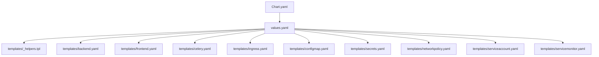
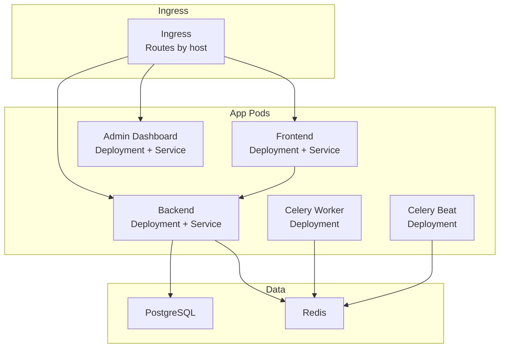
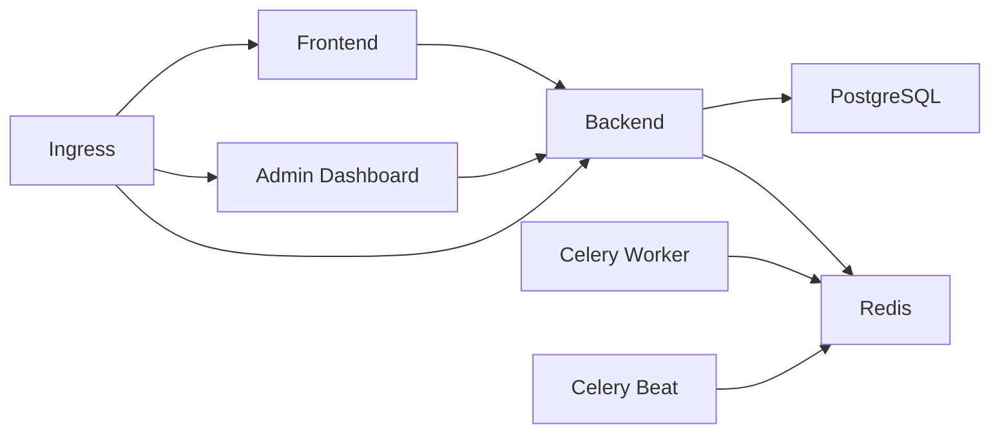

# Helm Charts & Packaging

<cite>
**Referenced Files in This Document**
- [Chart.yaml](file://infra/helm/jol-hub/Chart.yaml)
- [values.yaml](file://infra/helm/jol-hub/values.yaml)
- [_helpers.tpl](file://infra/helm/jol-hub/templates/_helpers.tpl)
- [backend.yaml](file://infra/helm/jol-hub/templates/backend.yaml)
- [frontend.yaml](file://infra/helm/jol-hub/templates/frontend.yaml)
- [celery.yaml](file://infra/helm/jol-hub/templates/celery.yaml)
- [ingress.yaml](file://infra/helm/jol-hub/templates/ingress.yaml)
- [configmap.yaml](file://infra/helm/jol-hub/templates/configmap.yaml)
- [secrets.yaml](file://infra/helm/jol-hub/templates/secrets.yaml)
- [networkpolicy.yaml](file://infra/helm/jol-hub/templates/networkpolicy.yaml)
- [serviceaccount.yaml](file://infra/helm/jol-hub/templates/serviceaccount.yaml)
- [servicemonitor.yaml](file://infra/helm/jol-hub/templates/servicemonitor.yaml)
</cite>

## Table of Contents
1. [Introduction](#introduction)
2. [Project Structure](#project-structure)
3. [Core Components](#core-components)
4. [Architecture Overview](#architecture-overview)
5. [Detailed Component Analysis](#detailed-component-analysis)
6. [Dependency Analysis](#dependency-analysis)
7. [Performance Considerations](#performance-considerations)
8. [Troubleshooting Guide](#troubleshooting-guide)
9. [Conclusion](#conclusion)
10. [Appendices](#appendices)

## Introduction
This document provides comprehensive guidance for packaging and deploying the JOL-HUB platform using its Helm chart. It explains the Chart.yaml metadata and versioning, values customization across environments, template structure and reusable helpers, dependencies, networking, monitoring, and operational procedures such as install, upgrade, and rollback. Practical examples are included to help you configure development, staging, and production deployments safely and consistently.

## Project Structure
The Helm chart is located under infra/helm/jol-hub and contains:
- Chart metadata and versioning (Chart.yaml)
- Default configuration and environment overrides (values.yaml)
- Kubernetes resource templates organized by component (templates/*)
- Reusable helper templates (_helpers.tpl)

**Diagram sources**
- [Chart.yaml:1-19](file://infra/helm/jol-hub/Chart.yaml#L1-L19)
- [values.yaml:1-264](file://infra/helm/jol-hub/values.yaml#L1-L264)
- [_helpers.tpl:1-77](file://infra/helm/jol-hub/templates/_helpers.tpl#L1-L77)
- [backend.yaml:1-152](file://infra/helm/jol-hub/templates/backend.yaml#L1-L152)
- [frontend.yaml:1-144](file://infra/helm/jol-hub/templates/frontend.yaml#L1-L144)
- [celery.yaml:1-105](file://infra/helm/jol-hub/templates/celery.yaml#L1-L105)
- [ingress.yaml:1-73](file://infra/helm/jol-hub/templates/ingress.yaml#L1-L73)
- [configmap.yaml:1-27](file://infra/helm/jol-hub/templates/configmap.yaml#L1-L27)
- [secrets.yaml:1-24](file://infra/helm/jol-hub/templates/secrets.yaml#L1-L24)
- [networkpolicy.yaml:1-111](file://infra/helm/jol-hub/templates/networkpolicy.yaml#L1-L111)
- [serviceaccount.yaml:1-49](file://infra/helm/jol-hub/templates/serviceaccount.yaml#L1-L49)
- [servicemonitor.yaml:1-20](file://infra/helm/jol-hub/templates/servicemonitor.yaml#L1-L20)

**Section sources**
- [Chart.yaml:1-19](file://infra/helm/jol-hub/Chart.yaml#L1-L19)
- [values.yaml:1-264](file://infra/helm/jol-hub/values.yaml#L1-L264)

## Core Components
- Chart metadata and versioning:
  - Chart name, type, version, appVersion, maintainers, sources, keywords, and home URL define identity and discoverability.
- Values and environment configuration:
  - Global registry and image pull secrets
  - Application domains and environment flags
  - Per-component images, replicas, resources, autoscaling, and probes
  - Database and cache settings
  - Ingress routing, TLS, and annotations
  - Network policies, service account, pod security context
  - Monitoring and logging toggles
  - Payment boundary egress CIDR for secure external access
- Templates:
  - Backend Deployment with init container for migrations, Service, optional HPA and PDB
  - Frontend Deployment and Service
  - Admin Dashboard Deployment and Service
  - Celery Worker and Beat Deployments with optional HPA
  - ConfigMap and Secret for runtime configuration and sensitive data
  - Ingress with TLS and host-based routing
  - NetworkPolicy enforcing least-privilege ingress/egress
  - ServiceAccount with Role and RoleBinding
  - Prometheus ServiceMonitor for metrics scraping

**Section sources**
- [Chart.yaml:1-19](file://infra/helm/jol-hub/Chart.yaml#L1-L19)
- [values.yaml:1-264](file://infra/helm/jol-hub/values.yaml#L1-L264)
- [_helpers.tpl:1-77](file://infra/helm/jol-hub/templates/_helpers.tpl#L1-L77)
- [backend.yaml:1-152](file://infra/helm/jol-hub/templates/backend.yaml#L1-L152)
- [frontend.yaml:1-144](file://infra/helm/jol-hub/templates/frontend.yaml#L1-L144)
- [celery.yaml:1-105](file://infra/helm/jol-hub/templates/celery.yaml#L1-L105)
- [ingress.yaml:1-73](file://infra/helm/jol-hub/templates/ingress.yaml#L1-L73)
- [configmap.yaml:1-27](file://infra/helm/jol-hub/templates/configmap.yaml#L1-L27)
- [secrets.yaml:1-24](file://infra/helm/jol-hub/templates/secrets.yaml#L1-L24)
- [networkpolicy.yaml:1-111](file://infra/helm/jol-hub/templates/networkpolicy.yaml#L1-L111)
- [serviceaccount.yaml:1-49](file://infra/helm/jol-hub/templates/serviceaccount.yaml#L1-L49)
- [servicemonitor.yaml:1-20](file://infra/helm/jol-hub/templates/servicemonitor.yaml#L1-L20)

## Architecture Overview
The chart deploys a multi-component application stack:
- Ingress routes traffic to frontend, backend API, and admin dashboard based on hostnames.
- Frontend serves UI and calls backend API.
- Backend runs Django with database migrations via an init container, exposes metrics, and integrates with Redis for caching and Celery.
- Celery workers process background tasks; Celery beat schedules periodic jobs.
- PostgreSQL and Redis provide persistence and caching.
- NetworkPolicies restrict communication to required endpoints only.
- Prometheus scrapes metrics via ServiceMonitor.

**Diagram sources**
- [ingress.yaml:1-73](file://infra/helm/jol-hub/templates/ingress.yaml#L1-L73)
- [frontend.yaml:1-144](file://infra/helm/jol-hub/templates/frontend.yaml#L1-L144)
- [backend.yaml:1-152](file://infra/helm/jol-hub/templates/backend.yaml#L1-L152)
- [celery.yaml:1-105](file://infra/helm/jol-hub/templates/celery.yaml#L1-L105)
- [configmap.yaml:1-27](file://infra/helm/jol-hub/templates/configmap.yaml#L1-L27)

## Detailed Component Analysis

### Chart Metadata and Versioning
- Chart.yaml defines:
  - apiVersion, name, description, type
  - version and appVersion for chart and packaged app
  - maintainers, sources, keywords, home
- Versioning strategy:
  - Use semantic versioning for Chart.yaml version to track packaging changes.
  - Align appVersion with the application release tag for traceability.
  - Keep values.yaml stable and use per-environment overlays to avoid drift.

**Section sources**
- [Chart.yaml:1-19](file://infra/helm/jol-hub/Chart.yaml#L1-L19)

### Values Customization and Environment Overrides
Key value groups:
- global: imageRegistry, imagePullSecrets, storageClass
- app: environment, debug, domain, apiDomain, adminDomain
- backend: enabled, replicaCount, image, resources, autoscaling, env/envFrom, PDB
- frontend: enabled, replicaCount, image, resources, autoscaling, env
- adminDashboard: enabled, replicaCount, image, resources
- celery.worker and celery.beat: enabled, replicaCount, concurrency, image, resources, autoscaling
- postgresql: enabled, auth (database, username, existingSecret), primary.persistence, resources
- redis: enabled, auth, master.persistence, resources
- ingress: enabled, className, annotations, tls, tlsSecret
- networkPolicy: enabled
- serviceAccount: create, name, annotations
- podSecurityContext and securityContext: runAsNonRoot, capabilities, readOnlyRootFilesystem
- affinity, tolerations, nodeSelector, priorityClassName, topologySpreadConstraints
- serviceMesh: enabled
- monitoring: enabled, serviceMonitor interval/path/port
- logging: enabled, format
- paymentsApi: cidr, port (secure egress boundary)

Environment-specific recommendations:
- Development: lower replicas, disable autoscaling, enable debug, smaller resources
- Staging: moderate replicas, enable autoscaling, tighten security contexts
- Production: higher replicas, autoscaling tuned, strict network policies, robust resources

Example overlay patterns:
- dev-values.yaml: set app.environment=development, reduce resources, disable some features
- staging-values.yaml: set app.environment=staging, enable autoscaling, set proper domains
- prod-values.yaml: set app.environment=production, enforce TLS, strict policies, larger resources

**Section sources**
- [values.yaml:1-264](file://infra/helm/jol-hub/values.yaml#L1-L264)

### Template Helpers and Reusability
_helpers.tpl provides:
- Name generation (chart name, fullname)
- Labels and selector labels
- Service account name resolution
- Image name composition with optional registry prefix

These helpers ensure consistent naming, labeling, and image references across all components.

**Section sources**
- [_helpers.tpl:1-77](file://infra/helm/jol-hub/templates/_helpers.tpl#L1-L77)

### Backend Component
- Deployment includes:
  - Init container running database migrations before app start
  - Readiness and liveness probes against health endpoint
  - Environment injection from ConfigMap and Secret
  - Optional HorizontalPodAutoscaler and PodDisruptionBudget
- Service exposes HTTP port for internal access
- Autoscaling targets CPU and optionally memory utilization

Operational notes:
- Ensure DB credentials exist in referenced Secret or external secret manager
- Tune readiness/liveness thresholds based on startup time
- Set appropriate resource requests/limits to avoid throttling

**Section sources**
- [backend.yaml:1-152](file://infra/helm/jol-hub/templates/backend.yaml#L1-L152)
- [values.yaml:19-55](file://infra/helm/jol-hub/values.yaml#L19-L55)

### Frontend and Admin Dashboard
- Frontend Deployment:
  - Exposes HTTP port, health checks, environment variables
  - Served via ClusterIP Service
- Admin Dashboard Deployment:
  - Similar structure with environment variables pointing to API and admin domains
  - Health checks and resources configurable

Routing:
- Ingress maps hosts to services for frontend, API, and admin dashboard

**Section sources**
- [frontend.yaml:1-144](file://infra/helm/jol-hub/templates/frontend.yaml#L1-L144)
- [ingress.yaml:1-73](file://infra/helm/jol-hub/templates/ingress.yaml#L1-L73)
- [values.yaml:56-101](file://infra/helm/jol-hub/values.yaml#L56-L101)

### Celery Workers and Beat
- Worker Deployment:
  - Runs Celery worker with configurable concurrency
  - Reads environment from ConfigMap and Secret
  - Optional HPA based on CPU utilization
- Beat Deployment:
  - Runs scheduled tasks using Django-Celery-Beat scheduler
  - Minimal resources suitable for scheduling workload

Integration:
- Connects to Redis for broker and result backend
- Shares environment configuration with backend

**Section sources**
- [celery.yaml:1-105](file://infra/helm/jol-hub/templates/celery.yaml#L1-L105)
- [values.yaml:102-139](file://infra/helm/jol-hub/values.yaml#L102-L139)
- [configmap.yaml:1-27](file://infra/helm/jol-hub/templates/configmap.yaml#L1-L27)

### Configuration and Secrets
- ConfigMap provides non-sensitive runtime configuration:
  - Django settings module, allowed hosts, CORS origins
  - Database and Redis connection details
  - Celery broker and result backend URLs
  - GDPR and feature toggles
- Secret holds sensitive data:
  - Django secret key, DB credentials, email credentials
  - OAuth/payment keys (currently empty placeholders)
  - NextAuth secret and MFA issuer name

Best practices:
- Do not commit real secrets; use external secret management or CI/CD injection
- Rotate secrets regularly and update values overlays accordingly
- Validate that referenced secrets exist before installation

**Section sources**
- [configmap.yaml:1-27](file://infra/helm/jol-hub/templates/configmap.yaml#L1-L27)
- [secrets.yaml:1-24](file://infra/helm/jol-hub/templates/secrets.yaml#L1-L24)
- [values.yaml:140-183](file://infra/helm/jol-hub/values.yaml#L140-L183)

### Networking and Security
- Ingress:
  - Host-based routing for frontend, API, and admin dashboard
  - TLS termination with configured secrets
  - Annotations for controller behavior and body size limits
- NetworkPolicy:
  - Restricts ingress to pods from ingress controller namespace
  - Limits egress to database, Redis, DNS, and optional payment boundary CIDR
  - Enforces least-privilege communication paths

Operational guidance:
- Ensure ingress controller namespace label matches policy expectations
- Configure paymentsApi.cidr only when required; otherwise egress row does not render
- Validate DNS egress is permitted for service discovery

**Section sources**
- [ingress.yaml:1-73](file://infra/helm/jol-hub/templates/ingress.yaml#L1-L73)
- [networkpolicy.yaml:1-111](file://infra/helm/jol-hub/templates/networkpolicy.yaml#L1-L111)
- [values.yaml:184-264](file://infra/helm/jol-hub/values.yaml#L184-L264)

### Service Account and RBAC
- ServiceAccount creation controlled by values
- Role grants read-only access to configmaps, secrets, pods, and deployments
- RoleBinding attaches role to the ServiceAccount
- automountServiceAccountToken enabled for API access if needed

Security considerations:
- Limit permissions to minimum required
- Avoid granting write access unless necessary
- Review token usage and rotate as needed

**Section sources**
- [serviceaccount.yaml:1-49](file://infra/helm/jol-hub/templates/serviceaccount.yaml#L1-L49)
- [values.yaml:201-206](file://infra/helm/jol-hub/values.yaml#L201-L206)

### Monitoring and Logging
- ServiceMonitor:
  - Scrapes metrics endpoint at configured path and interval
  - Targets pods matching selector labels
- Logging:
  - JSON format recommended for structured logs
  - Integrate with cluster logging pipeline

Operational tips:
- Ensure metrics endpoint is exposed and accessible to Prometheus
- Adjust scrape intervals based on performance requirements
- Centralize logs for observability and auditing

**Section sources**
- [servicemonitor.yaml:1-20](file://infra/helm/jol-hub/templates/servicemonitor.yaml#L1-L20)
- [values.yaml:242-255](file://infra/helm/jol-hub/values.yaml#L242-L255)

## Dependency Analysis
Internal dependencies:
- Backend depends on PostgreSQL and Redis
- Celery depends on Redis
- Frontend and Admin Dashboard depend on Backend API
- Ingress depends on Services for routing
- NetworkPolicy constrains communication between components

External dependencies:
- Ingress controller (e.g., nginx)
- cert-manager for TLS certificates
- Prometheus Operator for ServiceMonitor scraping

**Diagram sources**
- [frontend.yaml:1-144](file://infra/helm/jol-hub/templates/frontend.yaml#L1-L144)
- [backend.yaml:1-152](file://infra/helm/jol-hub/templates/backend.yaml#L1-L152)
- [celery.yaml:1-105](file://infra/helm/jol-hub/templates/celery.yaml#L1-L105)
- [ingress.yaml:1-73](file://infra/helm/jol-hub/templates/ingress.yaml#L1-L73)
- [configmap.yaml:1-27](file://infra/helm/jol-hub/templates/configmap.yaml#L1-L27)

**Section sources**
- [values.yaml:1-264](file://infra/helm/jol-hub/values.yaml#L1-L264)

## Performance Considerations
- Autoscaling:
  - Enable HPA for backend and celery worker based on CPU/memory targets
  - Set min/max replicas to match expected load profiles
- Resource requests/limits:
  - Right-size CPU and memory to prevent throttling and OOM kills
  - Monitor actual usage and adjust values accordingly
- Probes:
  - Tune initialDelaySeconds and periodSeconds for slow-starting workloads
- Storage:
  - Choose appropriate storageClass and sizes for PostgreSQL and Redis
- Network:
  - Use NetworkPolicy to minimize unnecessary traffic
  - Ensure DNS egress is allowed for service discovery

[No sources needed since this section provides general guidance]

## Troubleshooting Guide
Common issues and resolutions:
- Migration failures:
  - Verify database credentials in Secret and connectivity
  - Check init container logs for migration errors
- Health check failures:
  - Confirm readiness/liveness endpoints respond correctly
  - Inspect pod events and logs for startup issues
- Ingress routing problems:
  - Validate hostnames and TLS secrets exist
  - Ensure ingress controller is installed and configured
- NetworkPolicy blocks:
  - Confirm namespace labels and selectors match policy rules
  - Allow DNS egress for service discovery
- Metrics not scraped:
  - Verify ServiceMonitor labels and endpoints
  - Check Prometheus target status

Operational commands:
- View pod logs: kubectl logs <pod-name> -n <namespace>
- Describe resources: kubectl describe deployment <name> -n <namespace>
- Test connectivity: kubectl exec <pod> -- curl <endpoint>
- Rollback releases: helm rollback <release-name> <revision>

**Section sources**
- [backend.yaml:1-152](file://infra/helm/jol-hub/templates/backend.yaml#L1-L152)
- [ingress.yaml:1-73](file://infra/helm/jol-hub/templates/ingress.yaml#L1-L73)
- [networkpolicy.yaml:1-111](file://infra/helm/jol-hub/templates/networkpolicy.yaml#L1-L111)
- [servicemonitor.yaml:1-20](file://infra/helm/jol-hub/templates/servicemonitor.yaml#L1-L20)

## Conclusion
The JOL-HUB Helm chart provides a complete, secure, and scalable deployment model for the platform. With clear separation of concerns, robust defaults, and flexible values, it supports diverse environments from development to production. By following the guidance in this document, teams can confidently manage versions, customize configurations, and operate the platform with strong security and observability.

[No sources needed since this section summarizes without analyzing specific files]

## Appendices

### Example Values Files

- Development (dev-values.yaml):
  - app.environment: development
  - Reduce replica counts and resources
  - Disable autoscaling where appropriate
  - Enable debug flags if supported by the application

- Staging (staging-values.yaml):
  - app.environment: staging
  - Enable autoscaling with conservative min/max
  - Set proper domains and TLS secrets
  - Tighten network policies and security contexts

- Production (prod-values.yaml):
  - app.environment: production
  - Higher replicas and robust resource limits
  - Strict network policies and minimal egress
  - Enable monitoring and logging with appropriate intervals

[No sources needed since this section provides conceptual examples]

### Installation, Upgrade, and Rollback Procedures

- Install:
  - helm install <release-name> ./infra/helm/jol-hub -f <values-file> -n <namespace>
  - Verify resources: kubectl get all -n <namespace>
  - Check ingress and TLS: kubectl get ingress -n <namespace>

- Upgrade:
  - helm upgrade <release-name> ./infra/helm/jol-hub -f <values-file> -n <namespace>
  - Monitor rollout: kubectl rollout status deployment/<deployment-name> -n <namespace>
  - Validate health endpoints and metrics scraping

- Rollback:
  - List revisions: helm history <release-name> -n <namespace>
  - Rollback to previous revision: helm rollback <release-name> <revision> -n <namespace>
  - Verify stability after rollback

- Uninstall:
  - helm uninstall <release-name> -n <namespace>
  - Clean up persistent volumes if necessary

[No sources needed since this section provides procedural guidance]