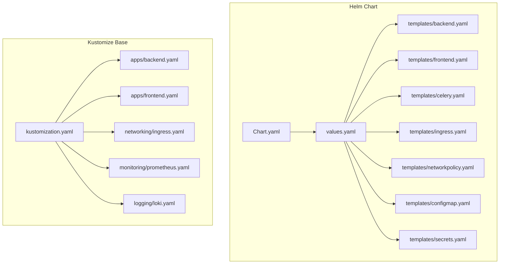
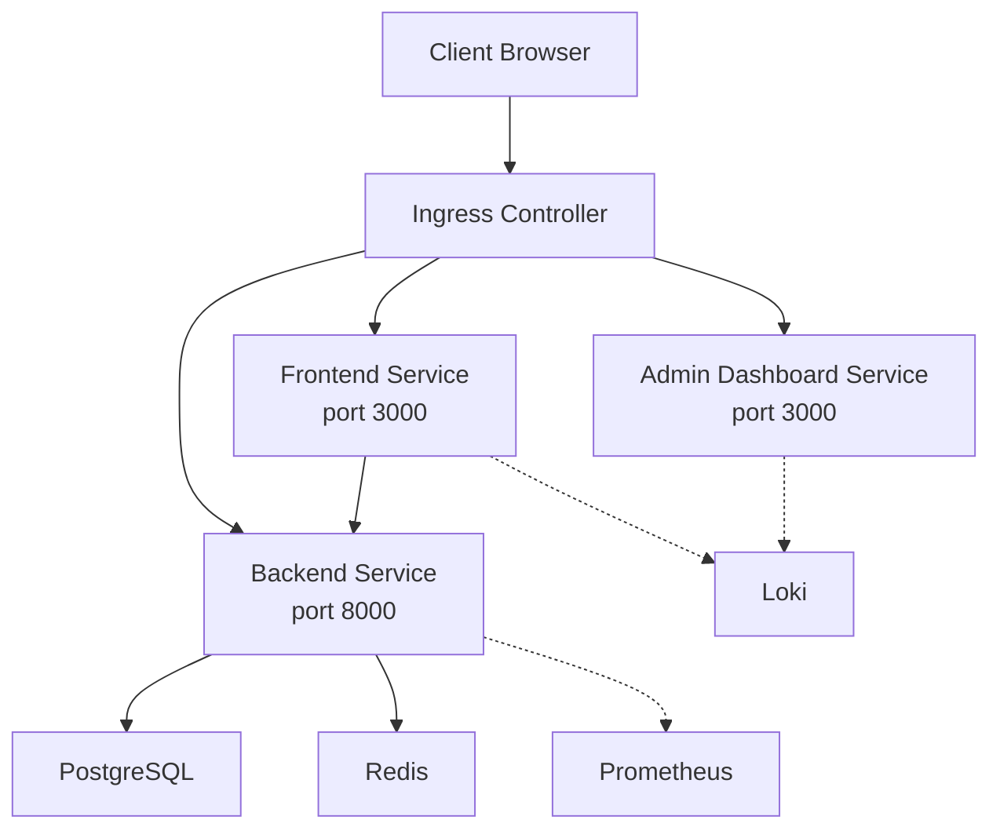
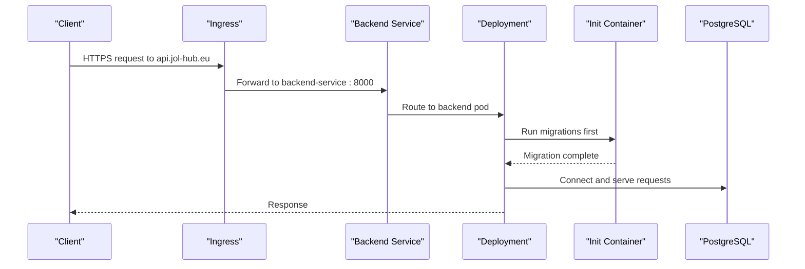
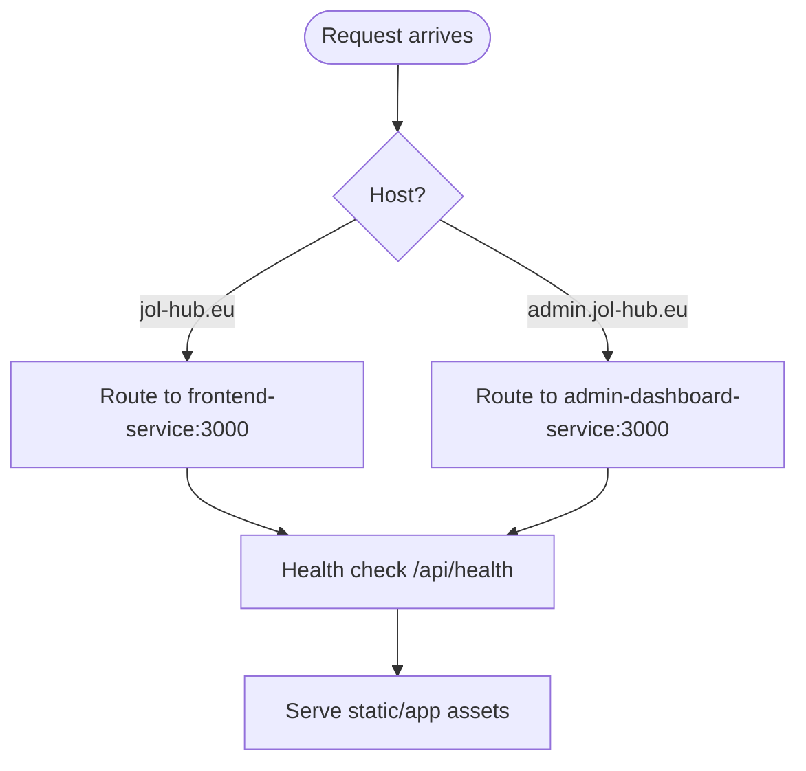
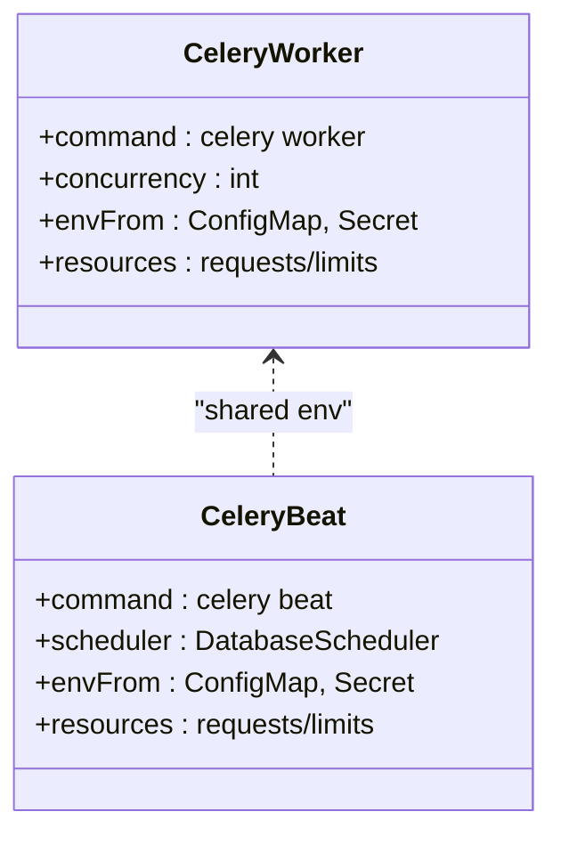
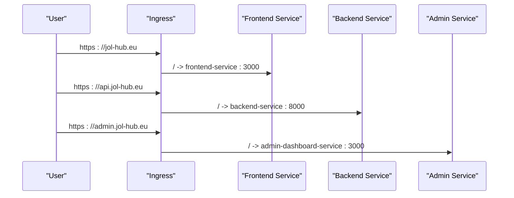
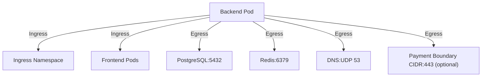
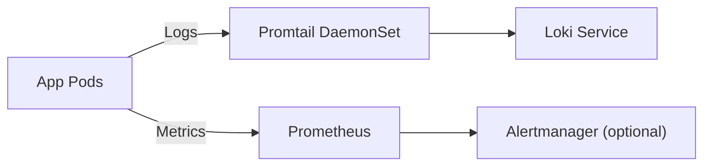
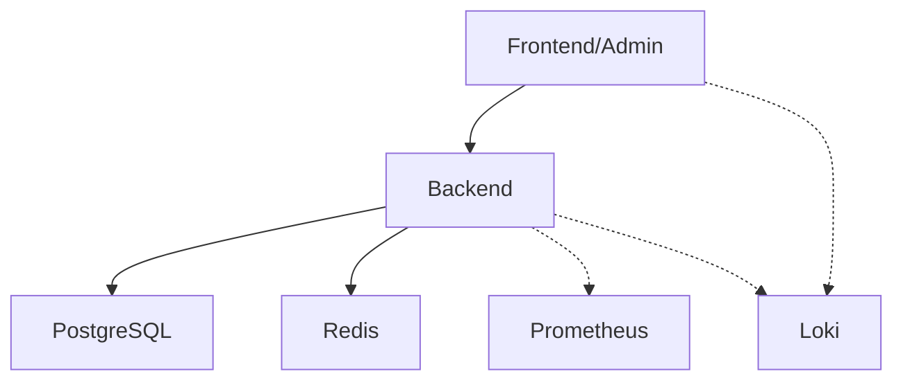

# Kubernetes Deployment

<cite>
**Referenced Files in This Document**
- [Chart.yaml](file://infra/helm/jol-hub/Chart.yaml)
- [values.yaml](file://infra/helm/jol-hub/values.yaml)
- [backend.yaml](file://infra/helm/jol-hub/templates/backend.yaml)
- [frontend.yaml](file://infra/helm/jol-hub/templates/frontend.yaml)
- [celery.yaml](file://infra/helm/jol-hub/templates/celery.yaml)
- [ingress.yaml](file://infra/helm/jol-hub/templates/ingress.yaml)
- [networkpolicy.yaml](file://infra/helm/jol-hub/templates/networkpolicy.yaml)
- [configmap.yaml](file://infra/helm/jol-hub/templates/configmap.yaml)
- [secrets.yaml](file://infra/helm/jol-hub/templates/secrets.yaml)
- [kustomization.yaml](file://infra/kubernetes/kustomization.yaml)
- [backend.yaml](file://infra/kubernetes/apps/backend.yaml)
- [frontend.yaml](file://infra/kubernetes/apps/frontend.yaml)
- [ingress.yaml](file://infra/kubernetes/networking/ingress.yaml)
- [prometheus.yaml](file://infra/kubernetes/monitoring/prometheus.yaml)
- [loki.yaml](file://infra/kubernetes/logging/loki.yaml)
</cite>

## Table of Contents
1. Introduction
2. Project Structure
3. Core Components
4. Architecture Overview
5. Detailed Component Analysis
6. Dependency Analysis
7. Performance Considerations
8. Troubleshooting Guide
9. Conclusion
10. Appendices

## Introduction
This document provides comprehensive Kubernetes deployment guidance for the JOL-HUB platform. It covers Helm chart structure, container orchestration strategies, service discovery, scaling policies, ingress configuration, network policies, resource limits, and health checks. It also documents environment-specific configurations, secrets management, and operational workflows using kubectl and Helm to deploy and manage backend services, frontend applications, and supporting components such as monitoring and logging.

## Project Structure
JOL-HUB exposes two complementary deployment approaches:
- Helm-based deployment under infra/helm/jol-hub with templated resources and values-driven configuration.
- Kustomize-based manifests under infra/kubernetes for direct application and infrastructure layering.

Key areas:
- Helm chart metadata and defaults define images, replicas, autoscaling, networking, security, and observability toggles.
- Templates render Deployments, Services, Ingress, NetworkPolicies, ConfigMaps, Secrets, ServiceAccounts, and optional Prometheus ServiceMonitors.
- Kustomize composes base resources (namespace, config, secrets), security, networking, and application layers with image overrides and patches.

**Diagram sources**
- [Chart.yaml:1-19](file://infra/helm/jol-hub/Chart.yaml#L1-L19)
- [values.yaml:1-264](file://infra/helm/jol-hub/values.yaml#L1-L264)
- [backend.yaml:1-152](file://infra/helm/jol-hub/templates/backend.yaml#L1-L152)
- [frontend.yaml:1-144](file://infra/helm/jol-hub/templates/frontend.yaml#L1-L144)
- [celery.yaml:1-105](file://infra/helm/jol-hub/templates/celery.yaml#L1-L105)
- [ingress.yaml:1-73](file://infra/helm/jol-hub/templates/ingress.yaml#L1-L73)
- [networkpolicy.yaml:1-111](file://infra/helm/jol-hub/templates/networkpolicy.yaml#L1-L111)
- [configmap.yaml:1-27](file://infra/helm/jol-hub/templates/configmap.yaml#L1-L27)
- [secrets.yaml:1-24](file://infra/helm/jol-hub/templates/secrets.yaml#L1-L24)
- [kustomization.yaml:1-58](file://infra/kubernetes/kustomization.yaml#L1-L58)
- [backend.yaml:1-204](file://infra/kubernetes/apps/backend.yaml#L1-L204)
- [frontend.yaml:1-181](file://infra/kubernetes/apps/frontend.yaml#L1-L181)
- [ingress.yaml:1-115](file://infra/kubernetes/networking/ingress.yaml#L1-L115)
- [prometheus.yaml:1-225](file://infra/kubernetes/monitoring/prometheus.yaml#L1-L225)
- [loki.yaml:1-251](file://infra/kubernetes/logging/loki.yaml#L1-L251)

**Section sources**
- [Chart.yaml:1-19](file://infra/helm/jol-hub/Chart.yaml#L1-L19)
- [values.yaml:1-264](file://infra/helm/jol-hub/values.yaml#L1-L264)
- [kustomization.yaml:1-58](file://infra/kubernetes/kustomization.yaml#L1-L58)

## Core Components
- Backend (Django):
  - Deployment with an init container running database migrations.
  - Health probes on /health/.
  - ClusterIP Service on port 8000.
  - Optional HorizontalPodAutoscaler and PodDisruptionBudget.
- Frontend (Next.js) and Admin Dashboard:
  - Deployments exposing port 3000 with health probes on /api/health.
  - ClusterIP Services for internal routing.
- Celery Workers and Beat:
  - Worker Deployment with concurrency control; optional HPA.
  - Beat Deployment for scheduled tasks.
- Networking:
  - Ingress routes for main site, API, admin dashboard, and wildcard parish subdomains.
  - NetworkPolicies restricting traffic to/from backend and frontend.
- Configuration and Secrets:
  - ConfigMap for non-sensitive settings (DB, Redis, CORS, feature flags).
  - Secret for sensitive keys (database credentials, app secrets, email, SSO).
- Observability:
  - Prometheus stack with scrape targets for pods and exporters.
  - Loki + Promtail for log aggregation and retention.

**Section sources**
- [backend.yaml:1-152](file://infra/helm/jol-hub/templates/backend.yaml#L1-L152)
- [frontend.yaml:1-144](file://infra/helm/jol-hub/templates/frontend.yaml#L1-L144)
- [celery.yaml:1-105](file://infra/helm/jol-hub/templates/celery.yaml#L1-L105)
- [ingress.yaml:1-73](file://infra/helm/jol-hub/templates/ingress.yaml#L1-L73)
- [networkpolicy.yaml:1-111](file://infra/helm/jol-hub/templates/networkpolicy.yaml#L1-L111)
- [configmap.yaml:1-27](file://infra/helm/jol-hub/templates/configmap.yaml#L1-L27)
- [secrets.yaml:1-24](file://infra/helm/jol-hub/templates/secrets.yaml#L1-L24)
- [prometheus.yaml:1-225](file://infra/kubernetes/monitoring/prometheus.yaml#L1-L225)
- [loki.yaml:1-251](file://infra/kubernetes/logging/loki.yaml#L1-L251)

## Architecture Overview
The platform is composed of stateless web tiers (frontend/admin) and a stateful backend that connects to PostgreSQL and Redis. Traffic enters via an Ingress controller, which routes to the appropriate Service based on hostnames. NetworkPolicies enforce least-privilege egress/ingress. Autoscaling protects availability during load spikes, while PDBs ensure minimum pod availability during disruptions. Monitoring and logging are provided by Prometheus and Loki/Promtail respectively.

**Diagram sources**
- [ingress.yaml:1-73](file://infra/helm/jol-hub/templates/ingress.yaml#L1-L73)
- [backend.yaml:1-152](file://infra/helm/jol-hub/templates/backend.yaml#L1-L152)
- [frontend.yaml:1-144](file://infra/helm/jol-hub/templates/frontend.yaml#L1-L144)
- [networkpolicy.yaml:1-111](file://infra/helm/jol-hub/templates/networkpolicy.yaml#L1-L111)
- [prometheus.yaml:1-225](file://infra/kubernetes/monitoring/prometheus.yaml#L1-L225)
- [loki.yaml:1-251](file://infra/kubernetes/logging/loki.yaml#L1-L251)

## Detailed Component Analysis

### Backend (Django)
- Orchestration:
  - Deployment with rolling updates and anti-affinity to spread pods across nodes.
  - Init container runs migrations before the main container starts.
  - Readiness and liveness probes call /health/ to ensure service readiness.
- Scaling:
  - HPA scales based on CPU and memory utilization thresholds.
  - PDB ensures a minimum number of pods remain available during voluntary disruptions.
- Networking:
  - Exposed via ClusterIP Service on port 8000.
  - Ingress routes api.jol-hub.eu to this Service.
- Security:
  - Runs as non-root with restricted capabilities and read-only filesystem.
  - Egress limited to PostgreSQL, Redis, DNS, and optionally a payment boundary CIDR.
- Configuration:
  - Environment variables from ConfigMap and Secret.
  - Database URL sourced from a secret reference.

**Diagram sources**
- [backend.yaml:1-152](file://infra/helm/jol-hub/templates/backend.yaml#L1-L152)
- [ingress.yaml:1-73](file://infra/helm/jol-hub/templates/ingress.yaml#L1-L73)

**Section sources**
- [backend.yaml:1-152](file://infra/helm/jol-hub/templates/backend.yaml#L1-L152)
- [backend.yaml:1-204](file://infra/kubernetes/apps/backend.yaml#L1-L204)

### Frontend and Admin Dashboard (Next.js)
- Orchestration:
  - Stateless Deployments with rolling updates and node anti-affinity.
  - Health probes on /api/health for readiness and liveness.
- Networking:
  - ClusterIP Services on port 3000.
  - Ingress routes jol-hub.eu and www.jol-hub.eu to frontend-service; admin.jol-hub.eu to admin-dashboard-service.
- Configuration:
  - Environment variables set API URLs and auth endpoints.
  - Secrets provide NEXTAUTH_SECRET.

**Diagram sources**
- [frontend.yaml:1-144](file://infra/helm/jol-hub/templates/frontend.yaml#L1-L144)
- [ingress.yaml:1-73](file://infra/helm/jol-hub/templates/ingress.yaml#L1-L73)

**Section sources**
- [frontend.yaml:1-144](file://infra/helm/jol-hub/templates/frontend.yaml#L1-L144)
- [frontend.yaml:1-181](file://infra/kubernetes/apps/frontend.yaml#L1-L181)

### Celery Workers and Beat
- Workers:
  - Concurrency controlled via command-line flag.
  - Optional HPA based on CPU utilization.
  - Reads configuration from shared ConfigMap and Secret.
- Beat:
  - Runs Django-Celery-Beat scheduler against the database.
  - Shares environment with workers for consistent configuration.

**Diagram sources**
- [celery.yaml:1-105](file://infra/helm/jol-hub/templates/celery.yaml#L1-L105)

**Section sources**
- [celery.yaml:1-105](file://infra/helm/jol-hub/templates/celery.yaml#L1-L105)

### Ingress and TLS
- Routes:
  - Main site and www to frontend-service.
  - API to backend-service.
  - Admin dashboard to admin-dashboard-service.
  - Wildcard *.jol-hub.eu for parish sites.
- TLS:
  - cert-manager cluster issuer provisions certificates.
  - Separate TLS secrets per host group.
- Security headers and timeouts configured via annotations.

**Diagram sources**
- [ingress.yaml:1-73](file://infra/helm/jol-hub/templates/ingress.yaml#L1-L73)
- [ingress.yaml:1-115](file://infra/kubernetes/networking/ingress.yaml#L1-L115)

**Section sources**
- [ingress.yaml:1-73](file://infra/helm/jol-hub/templates/ingress.yaml#L1-L73)
- [ingress.yaml:1-115](file://infra/kubernetes/networking/ingress.yaml#L1-L115)

### Network Policies
- Default deny with explicit allow rules:
  - Backend accepts ingress from ingress-nginx namespace and frontend pods on port 8000.
  - Backend egress allowed to PostgreSQL (5432), Redis (6379), DNS (UDP 53), and optionally a payment boundary CIDR on port 443.
  - Frontend accepts ingress from ingress-nginx and egress to backend and DNS.

**Diagram sources**
- [networkpolicy.yaml:1-111](file://infra/helm/jol-hub/templates/networkpolicy.yaml#L1-L111)

**Section sources**
- [networkpolicy.yaml:1-111](file://infra/helm/jol-hub/templates/networkpolicy.yaml#L1-L111)

### Configuration and Secrets Management
- ConfigMap:
  - Non-sensitive runtime settings: Django settings module, allowed hosts, CORS origins, database and Redis host/port, Celery broker/result URLs, GDPR and feature flags.
- Secrets:
  - Sensitive data: Django secret key, database credentials, Redis password, email credentials, Sentry DSN, NextAuth secret.
  - Some fields are intentionally empty or managed externally (e.g., payment keys purged per policy).

Operational notes:
- Use separate namespaces and distinct ConfigMaps/Secrets per environment.
- Rotate secrets regularly and restrict access via RBAC.

**Section sources**
- [configmap.yaml:1-27](file://infra/helm/jol-hub/templates/configmap.yaml#L1-L27)
- [secrets.yaml:1-24](file://infra/helm/jol-hub/templates/secrets.yaml#L1-L24)

### Monitoring and Logging
- Prometheus:
  - Scrapes Kubernetes API, nodes, and pods annotated for metrics.
  - Dedicated job for JOL-HUB backend pods.
  - Exporters for PostgreSQL and Redis.
  - Persistent storage for metrics retention.
- Loki and Promtail:
  - Loki stores logs with configurable retention.
  - Promtail DaemonSet collects pod and system logs and forwards to Loki.

**Diagram sources**
- [prometheus.yaml:1-225](file://infra/kubernetes/monitoring/prometheus.yaml#L1-L225)
- [loki.yaml:1-251](file://infra/kubernetes/logging/loki.yaml#L1-L251)

**Section sources**
- [prometheus.yaml:1-225](file://infra/kubernetes/monitoring/prometheus.yaml#L1-L225)
- [loki.yaml:1-251](file://infra/kubernetes/logging/loki.yaml#L1-L251)

## Dependency Analysis
- Application dependencies:
  - Frontend/Admin depend on Backend API via Ingress.
  - Backend depends on PostgreSQL and Redis.
  - Celery workers/beat depend on Redis and database.
- Infrastructure dependencies:
  - Ingress depends on cert-manager and TLS secrets.
  - Monitoring depends on pod annotations and exporter services.
  - Logging depends on Promtail DaemonSet and Loki service.

**Diagram sources**
- [backend.yaml:1-152](file://infra/helm/jol-hub/templates/backend.yaml#L1-L152)
- [frontend.yaml:1-144](file://infra/helm/jol-hub/templates/frontend.yaml#L1-L144)
- [prometheus.yaml:1-225](file://infra/kubernetes/monitoring/prometheus.yaml#L1-L225)
- [loki.yaml:1-251](file://infra/kubernetes/logging/loki.yaml#L1-L251)

**Section sources**
- [values.yaml:1-264](file://infra/helm/jol-hub/values.yaml#L1-L264)
- [backend.yaml:1-152](file://infra/helm/jol-hub/templates/backend.yaml#L1-L152)
- [frontend.yaml:1-144](file://infra/helm/jol-hub/templates/frontend.yaml#L1-L144)

## Performance Considerations
- Autoscaling:
  - Backend HPA targets CPU and memory utilization thresholds.
  - Celery worker HPA scales based on CPU.
- Resource Limits:
  - Requests and limits defined for all components to ensure fair scheduling and prevent noisy neighbors.
- Rolling Updates:
  - maxSurge and maxUnavailable tuned for zero-downtime deployments.
- Anti-Affinity:
  - Spreads pods across nodes to improve resilience.
- Storage:
  - Persistent volumes for database, media, and observability backends sized appropriately.

[No sources needed since this section provides general guidance]

## Troubleshooting Guide
Common issues and resolutions:
- Pods not ready:
  - Check readiness/liveness probe paths (/health/ for backend, /api/health for frontends).
  - Verify environment variables and secrets are correctly mounted.
- Database connectivity errors:
  - Ensure DB_HOST, DB_PORT, DB_NAME, and credentials are set via ConfigMap/Secret.
  - Confirm PostgreSQL service is reachable within the namespace.
- Redis connectivity errors:
  - Validate REDIS_HOST/PORT and any required passwords.
  - Check NetworkPolicy egress allows Redis port.
- Ingress 502/504 errors:
  - Verify TLS secrets exist and match hostnames.
  - Confirm backend/frontend services are healthy and ports match ingress rules.
- High latency or throttling:
  - Review HPA metrics and adjust thresholds if necessary.
  - Inspect rate-limiting annotations on Ingress.

**Section sources**
- [backend.yaml:1-152](file://infra/helm/jol-hub/templates/backend.yaml#L1-L152)
- [frontend.yaml:1-144](file://infra/helm/jol-hub/templates/frontend.yaml#L1-L144)
- [ingress.yaml:1-73](file://infra/helm/jol-hub/templates/ingress.yaml#L1-L73)
- [networkpolicy.yaml:1-111](file://infra/helm/jol-hub/templates/networkpolicy.yaml#L1-L111)

## Conclusion
JOL-HUB’s Kubernetes deployment leverages Helm templates and Kustomize manifests to deliver a secure, scalable, and observable platform. The architecture isolates concerns with clear networking boundaries, enforces least-privilege access via NetworkPolicies, and automates scaling and rollout strategies. Monitoring and logging are integrated through Prometheus and Loki/Promtail, enabling proactive operations. Follow the environment-specific configuration and secrets management practices outlined here to maintain reliability and compliance across deployments.

[No sources needed since this section summarizes without analyzing specific files]

## Appendices

### Environment-Specific Configuration Guidance
- Use Helm values overrides per environment (dev/staging/prod) to change domains, replica counts, autoscaling thresholds, and feature flags.
- Maintain separate ConfigMaps and Secrets per environment; never commit secrets to version control.
- For production, enable strict NetworkPolicies, enforce TLS, and tune resource limits based on observed usage.

**Section sources**
- [values.yaml:1-264](file://infra/helm/jol-hub/values.yaml#L1-L264)
- [configmap.yaml:1-27](file://infra/helm/jol-hub/templates/configmap.yaml#L1-L27)
- [secrets.yaml:1-24](file://infra/helm/jol-hub/templates/secrets.yaml#L1-L24)

### Deployment Workflows (kubectl and Helm)
- Using Helm:
  - Install or upgrade the release with environment-specific values file.
  - Rollback to previous revision if issues arise.
  - Inspect rendered templates to validate configuration.
- Using kubectl:
  - Apply Kustomize overlays to build and deploy manifests.
  - Scale deployments or update replicas as needed.
  - View events and logs for troubleshooting.

Example commands:
- Helm install/upgrade:
  - helm install jol-hub ./infra/helm/jol-hub -f values-prod.yaml
  - helm upgrade jol-hub ./infra/helm/jol-hub -f values-prod.yaml
  - helm rollback jol-hub <revision>
  - helm template jol-hub ./infra/helm/jol-hub -f values-prod.yaml
- Kubectl apply:
  - kubectl apply -k infra/kubernetes
  - kubectl rollout status deployment/backend -n jol-hub
  - kubectl get events -n jol-hub --sort-by=.metadata.creationTimestamp

[No sources needed since this section provides general guidance]