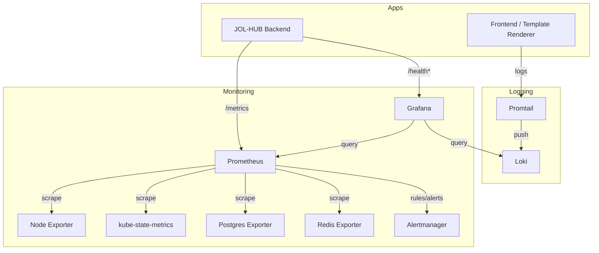
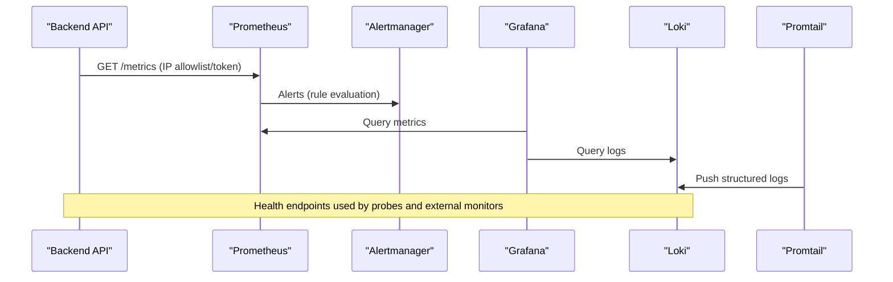
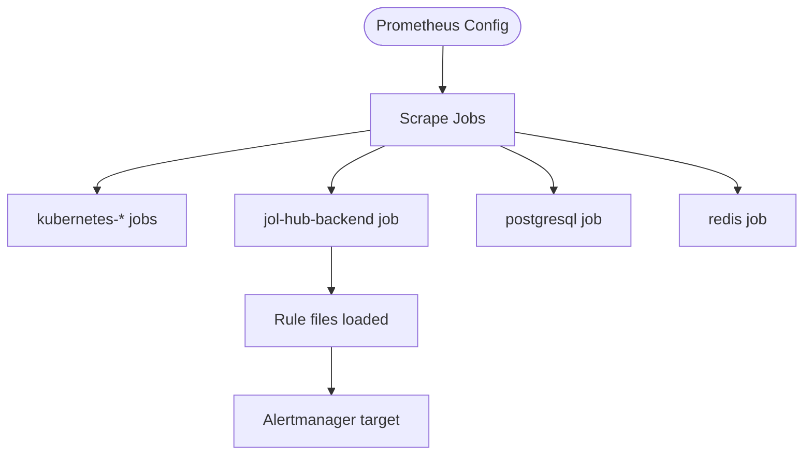
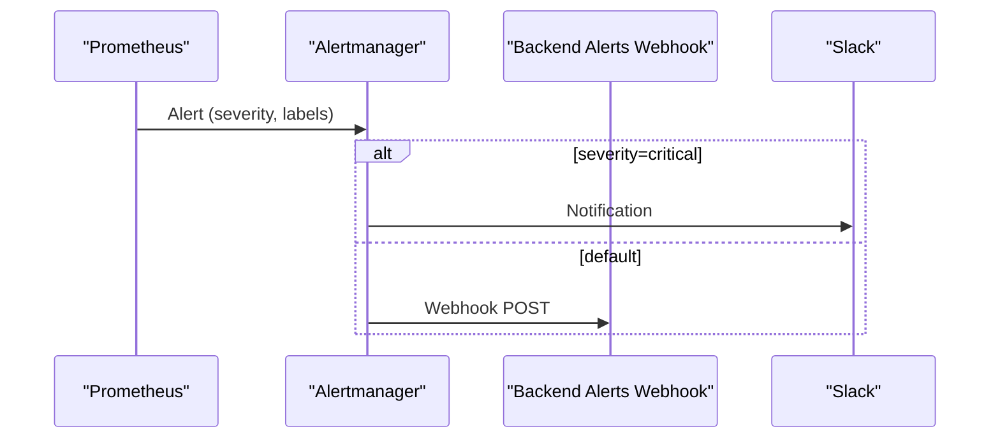
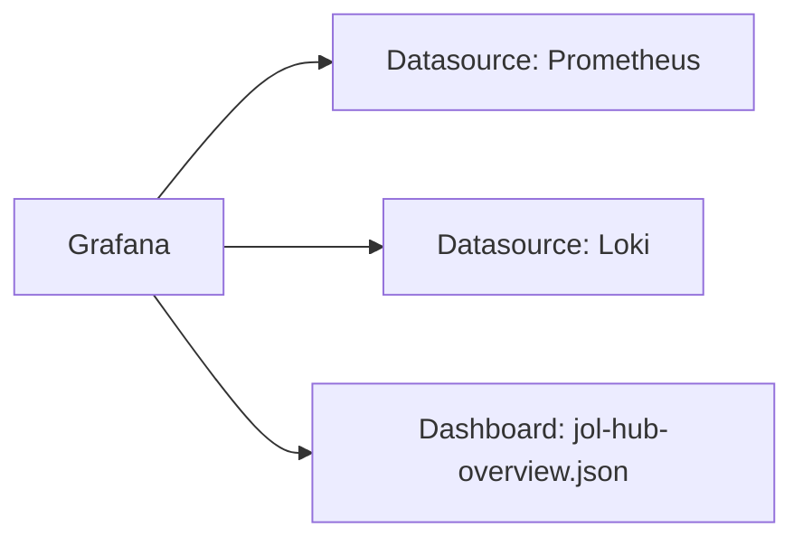
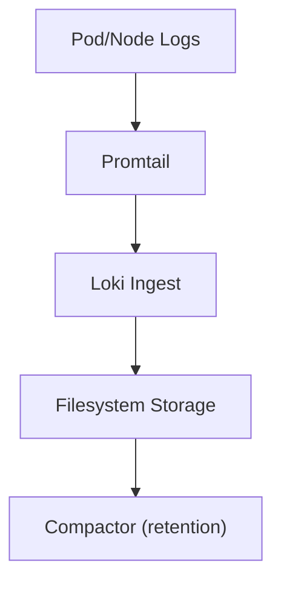
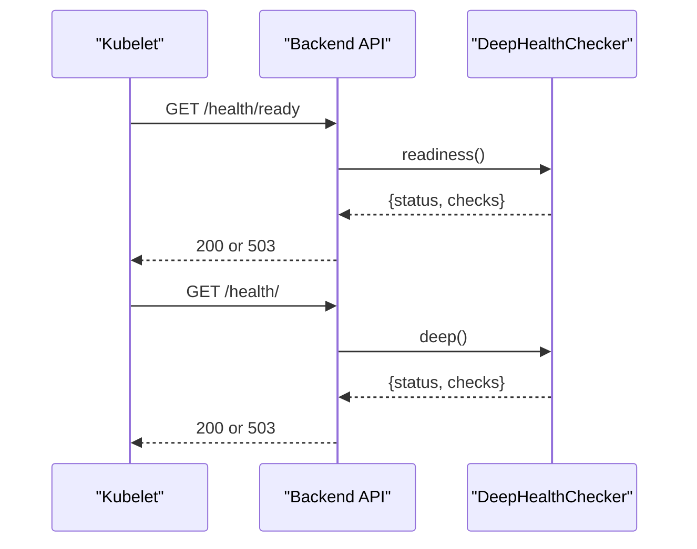
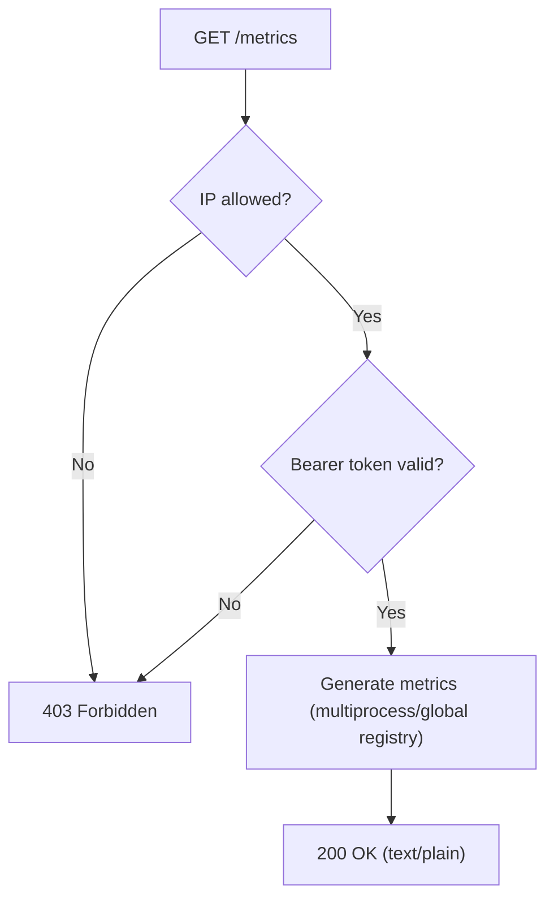
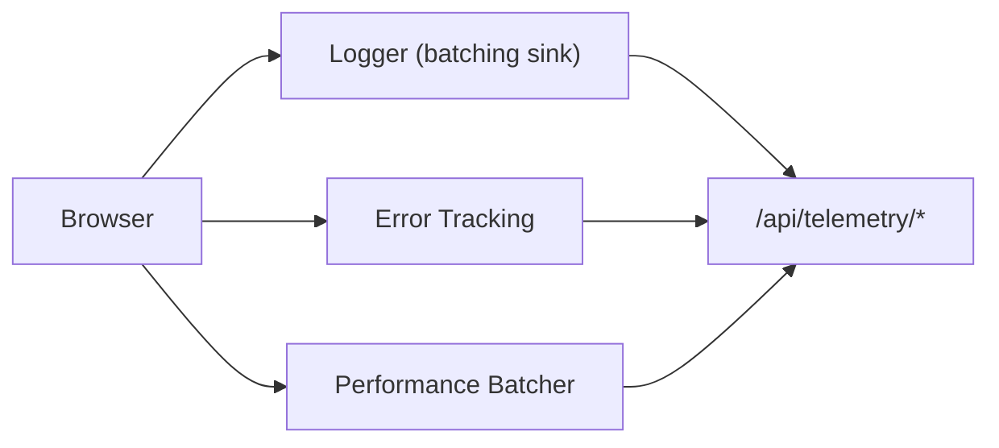
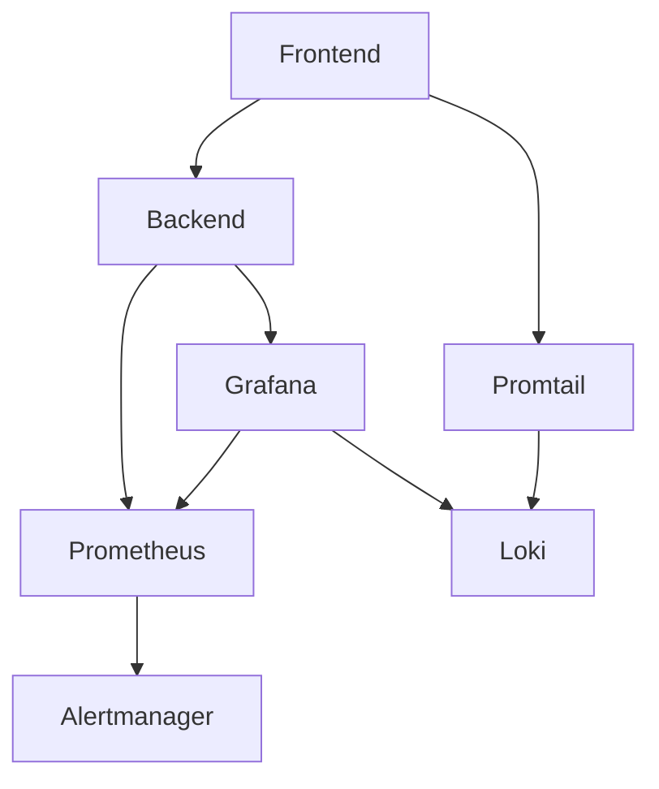

# Monitoring & Observability

<cite>
**Referenced Files in This Document**
- [prometheus.yaml](file://infra/kubernetes/monitoring/prometheus.yaml)
- [grafana.yaml](file://infra/kubernetes/monitoring/grafana.yaml)
- [loki.yaml](file://infra/kubernetes/logging/loki.yaml)
- [observability.yaml](file://infra/kubernetes/observability/observability.yaml)
- [metrics_endpoint.py](file://backend/django/apps/core/metrics_endpoint.py)
- [health.py](file://backend/django/apps/core/health.py)
- [views.py](file://backend/django/apps/core/views.py)
- [values.yaml](file://infra/helm/jol-hub/values.yaml)
- [servicemonitor.yaml](file://infra/helm/jol-hub/templates/servicemonitor.yaml)
- [alert-rules.yml](file://frontend/apps/template-renderer/observability/alert-rules.yml)
- [package.json](file://frontend/packages/observability/package.json)
- [index.ts](file://frontend/packages/observability/src/index.ts)
- [health.ts](file://frontend/packages/observability/src/health.ts)
- [logger.ts](file://frontend/packages/observability/src/logger.ts)
- [error-tracking.ts](file://frontend/packages/observability/src/error-tracking.ts)
- [route.ts](file://frontend/apps/template-renderer/src/app/api/telemetry/errors/route.ts)
- [ObservabilityClient.tsx](file://frontend/apps/template-renderer/src/components/ObservabilityClient.tsx)
</cite>

## Table of Contents
1. Introduction
2. Project Structure
3. Core Components
4. Architecture Overview
5. Detailed Component Analysis
6. Dependency Analysis
7. Performance Considerations
8. Troubleshooting Guide
9. Conclusion
10. Appendices

## Introduction
This document provides comprehensive monitoring and observability guidance for the JOL-HUB Kubernetes deployment. It covers Prometheus metrics collection, alerting rules, Grafana dashboards and alerts, logging with Loki and Promtail, health endpoints (liveness/readiness), performance monitoring, error tracking, and distributed tracing considerations. It also includes production-ready guidance for setting up alerts, creating custom metrics, and troubleshooting performance issues.

## Project Structure
The observability stack is deployed across dedicated namespaces:
- monitoring: Prometheus, Alertmanager, Node Exporter, kube-state-metrics, Postgres/Redis exporters, Grafana
- logging: Loki and Promtail
- Application services expose metrics and health endpoints consumed by these components

**Diagram sources**
- [prometheus.yaml:57-151](file://infra/kubernetes/monitoring/prometheus.yaml#L57-L151)
- [observability.yaml:208-292](file://infra/kubernetes/observability/observability.yaml#L208-L292)
- [loki.yaml:22-147](file://infra/kubernetes/logging/loki.yaml#L22-L147)
- [grafana.yaml:10-21](file://infra/kubernetes/monitoring/grafana.yaml#L10-L21)

**Section sources**
- [prometheus.yaml:57-151](file://infra/kubernetes/monitoring/prometheus.yaml#L57-L151)
- [grafana.yaml:10-21](file://infra/kubernetes/monitoring/grafana.yaml#L10-L21)
- [loki.yaml:22-147](file://infra/kubernetes/logging/loki.yaml#L22-L147)
- [observability.yaml:208-292](file://infra/kubernetes/observability/observability.yaml#L208-L292)

## Core Components
- Prometheus: Scrapes application, Kubernetes, and infrastructure metrics; evaluates rules; forwards alerts to Alertmanager.
- Grafana: Visualizes metrics/logs; provisions dashboards and datasources; supports alerting via data source integrations.
- Loki + Promtail: Aggregates structured logs from pods and nodes; supports retention and search.
- Health Endpoints: Deep liveness/readiness checks for backend services.
- Metrics Endpoint: Secure Prometheus exposition endpoint for Django app.
- Frontend Observability: Structured logging, error tracking, performance telemetry, and health aggregation.

**Section sources**
- [prometheus.yaml:57-151](file://infra/kubernetes/monitoring/prometheus.yaml#L57-L151)
- [grafana.yaml:10-21](file://infra/kubernetes/monitoring/grafana.yaml#L10-L21)
- [loki.yaml:22-147](file://infra/kubernetes/logging/loki.yaml#L22-L147)
- [metrics_endpoint.py:68-153](file://backend/django/apps/core/metrics_endpoint.py#L68-L153)
- [health.py:55-127](file://backend/django/apps/core/health.py#L55-L127)
- [index.ts:1-61](file://frontend/packages/observability/src/index.ts#L1-L61)

## Architecture Overview
The system follows a standard Prometheus/Grafana/Loki stack with application instrumentation and Kubernetes-native exporters.

**Diagram sources**
- [metrics_endpoint.py:68-153](file://backend/django/apps/core/metrics_endpoint.py#L68-L153)
- [prometheus.yaml:65-72](file://infra/kubernetes/monitoring/prometheus.yaml#L65-L72)
- [grafana.yaml:10-21](file://infra/kubernetes/monitoring/grafana.yaml#L10-L21)
- [loki.yaml:158-185](file://infra/kubernetes/logging/loki.yaml#L158-L185)

## Detailed Component Analysis

### Prometheus Configuration and Scrape Targets
- Global scrape and evaluation intervals are set; external labels identify cluster/environment.
- Rule files are mounted for alerting rules.
- Scrape targets include:
  - Kubernetes API server and nodes
  - Pods annotated for scraping
  - JOL-HUB backend pods (label-based selection)
  - PostgreSQL and Redis exporters
- Storage retention configured for TSDB.

**Diagram sources**
- [prometheus.yaml:57-151](file://infra/kubernetes/monitoring/prometheus.yaml#L57-L151)

**Section sources**
- [prometheus.yaml:57-151](file://infra/kubernetes/monitoring/prometheus.yaml#L57-L151)

### Alerting Rules and Alertmanager
- Prometheus rule_files path points to mounted rules directory.
- Alertmanager configuration defines routing and receivers:
  - Default receiver via webhook to backend alerts endpoint
  - Critical severity routed to Slack channel
- Terraform template shows SNS integration option for cloud deployments.

**Diagram sources**
- [prometheus.yaml:65-72](file://infra/kubernetes/monitoring/prometheus.yaml#L65-L72)
- [observability.yaml:208-236](file://infra/kubernetes/observability/observability.yaml#L208-L236)

**Section sources**
- [prometheus.yaml:65-72](file://infra/kubernetes/monitoring/prometheus.yaml#L65-L72)
- [observability.yaml:208-236](file://infra/kubernetes/observability/observability.yaml#L208-L236)

### Grafana Dashboards and Datasources
- Datasources provisioned for Prometheus and Loki.
- Dashboard provider configured to load JSON dashboards from a ConfigMap.
- A built-in “JOL-HUB Overview” dashboard includes panels for API response time, request rate, CPU, and memory.

**Diagram sources**
- [grafana.yaml:10-21](file://infra/kubernetes/monitoring/grafana.yaml#L10-L21)
- [grafana.yaml:28-40](file://infra/kubernetes/monitoring/grafana.yaml#L28-L40)
- [grafana.yaml:41-315](file://infra/kubernetes/monitoring/grafana.yaml#L41-L315)

**Section sources**
- [grafana.yaml:10-21](file://infra/kubernetes/monitoring/grafana.yaml#L10-L21)
- [grafana.yaml:28-40](file://infra/kubernetes/monitoring/grafana.yaml#L28-L40)
- [grafana.yaml:41-315](file://infra/kubernetes/monitoring/grafana.yaml#L41-L315)

### Logging with Loki and Promtail
- Loki runs with filesystem storage and retention policies.
- Promtail DaemonSet scrapes pod and node logs, parses Docker format, relabels metadata, and pushes to Loki.
- Retention period and compactor settings are defined.

**Diagram sources**
- [loki.yaml:22-71](file://infra/kubernetes/logging/loki.yaml#L22-L71)
- [loki.yaml:158-185](file://infra/kubernetes/logging/loki.yaml#L158-L185)

**Section sources**
- [loki.yaml:22-71](file://infra/kubernetes/logging/loki.yaml#L22-L71)
- [loki.yaml:158-185](file://infra/kubernetes/logging/loki.yaml#L158-L185)

### Health Check Endpoints (Liveness/Readiness)
- Backend exposes deep health and readiness endpoints that check database, cache, and Celery broker connectivity.
- Views return appropriate HTTP status codes based on aggregated health.

**Diagram sources**
- [health.py:55-127](file://backend/django/apps/core/health.py#L55-L127)
- [views.py:36-85](file://backend/django/apps/core/views.py#L36-L85)

**Section sources**
- [health.py:55-127](file://backend/django/apps/core/health.py#L55-L127)
- [views.py:36-85](file://backend/django/apps/core/views.py#L36-L85)

### Prometheus Metrics Endpoint (Django)
- Secure /metrics endpoint with IP allowlist and optional bearer token.
- Supports multi-process collectors for worker environments.
- Returns standard Prometheus text exposition.

**Diagram sources**
- [metrics_endpoint.py:68-153](file://backend/django/apps/core/metrics_endpoint.py#L68-L153)

**Section sources**
- [metrics_endpoint.py:68-153](file://backend/django/apps/core/metrics_endpoint.py#L68-L153)

### ServiceMonitor Integration (Helm)
- Helm values enable ServiceMonitor for Prometheus Operator-based setups.
- Endpoint path and interval are configurable.

**Section sources**
- [values.yaml:242-249](file://infra/helm/jol-hub/values.yaml#L242-L249)
- [servicemonitor.yaml:1-20](file://infra/helm/jol-hub/templates/servicemonitor.yaml#L1-L20)

### Frontend Observability: Logging, Errors, Performance
- Structured JSON logging with PII redaction and batching.
- Error tracking with categorization, fingerprinting, and breadcrumbs.
- Performance telemetry (navigation phases, slow resources) batched and sent to backend.
- Health aggregation utility for frontend dependencies.

**Diagram sources**
- [logger.ts:60-139](file://frontend/packages/observability/src/logger.ts#L60-L139)
- [error-tracking.ts:1-37](file://frontend/packages/observability/src/error-tracking.ts#L1-L37)
- [ObservabilityClient.tsx:39-75](file://frontend/apps/template-renderer/src/components/ObservabilityClient.tsx#L39-L75)
- [route.ts:33-77](file://frontend/apps/template-renderer/src/app/api/telemetry/errors/route.ts#L33-L77)

**Section sources**
- [package.json:1-30](file://frontend/packages/observability/package.json#L1-L30)
- [index.ts:1-61](file://frontend/packages/observability/src/index.ts#L1-L61)
- [health.ts:1-89](file://frontend/packages/observability/src/health.ts#L1-L89)
- [logger.ts:60-139](file://frontend/packages/observability/src/logger.ts#L60-L139)
- [error-tracking.ts:1-37](file://frontend/packages/observability/src/error-tracking.ts#L1-L37)
- [ObservabilityClient.tsx:39-75](file://frontend/apps/template-renderer/src/components/ObservabilityClient.tsx#L39-L75)
- [route.ts:33-77](file://frontend/apps/template-renderer/src/app/api/telemetry/errors/route.ts#L33-L77)

### Frontend Alert Rules (PromQL)
- Alert groups define severity ladder (P0–P3).
- Rules derive from Loki log rates, health probes, and RUM metrics.
- Annotations include runbooks and incident channels.

**Section sources**
- [alert-rules.yml:1-144](file://frontend/apps/template-renderer/observability/alert-rules.yml#L1-L144)

## Dependency Analysis
- Prometheus depends on:
  - Kubernetes SD for dynamic discovery
  - Exporters for Postgres and Redis
  - Rule files for alerting
  - Alertmanager for notifications
- Grafana depends on Prometheus and Loki datasources.
- Loki depends on Promtail for log ingestion.
- Backend exposes metrics and health endpoints consumed by Prometheus and probes.
- Frontend emits logs, errors, and performance data to backend telemetry endpoints.

**Diagram sources**
- [prometheus.yaml:57-151](file://infra/kubernetes/monitoring/prometheus.yaml#L57-L151)
- [grafana.yaml:10-21](file://infra/kubernetes/monitoring/grafana.yaml#L10-L21)
- [loki.yaml:158-185](file://infra/kubernetes/logging/loki.yaml#L158-L185)
- [metrics_endpoint.py:68-153](file://backend/django/apps/core/metrics_endpoint.py#L68-L153)

**Section sources**
- [prometheus.yaml:57-151](file://infra/kubernetes/monitoring/prometheus.yaml#L57-L151)
- [grafana.yaml:10-21](file://infra/kubernetes/monitoring/grafana.yaml#L10-L21)
- [loki.yaml:158-185](file://infra/kubernetes/logging/loki.yaml#L158-L185)
- [metrics_endpoint.py:68-153](file://backend/django/apps/core/metrics_endpoint.py#L68-L153)

## Performance Considerations
- Scrape intervals and timeouts:
  - Prometheus global scrape_interval and evaluation_interval set to 30s.
  - ServiceMonitor scrapeTimeout configured to 10s.
- Resource requests/limits:
  - Prometheus, Grafana, Loki, and exporters have resource constraints to ensure stability.
- Retention:
  - Prometheus TSDB retention set to 15 days.
  - Loki retention_period set to 31 days with compactor enabled.
- Autoscaling:
  - Backend and frontend autoscaling thresholds defined in Helm values.
- Network policies and security context:
  - Pod security contexts restrict privileges; network policies can be enabled.

[No sources needed since this section provides general guidance]

## Troubleshooting Guide
- Metrics endpoint access denied:
  - Ensure Prometheus IPs are in PROMETHEUS_ALLOWED_IPS and bearer token matches if configured.
- No metrics scraped:
  - Verify pod annotations for scraping and label selectors match backend component labels.
- High error rates:
  - Use frontend alert rules to detect spikes; inspect Loki logs via Grafana.
- Health endpoint failures:
  - Check database connectivity and cache availability via readiness/liveness responses.
- Alert noise:
  - Tune rule durations and thresholds; use severity labels to prioritize.

**Section sources**
- [metrics_endpoint.py:95-129](file://backend/django/apps/core/metrics_endpoint.py#L95-L129)
- [prometheus.yaml:100-139](file://infra/kubernetes/monitoring/prometheus.yaml#L100-L139)
- [alert-rules.yml:18-66](file://frontend/apps/template-renderer/observability/alert-rules.yml#L18-L66)
- [health.py:55-127](file://backend/django/apps/core/health.py#L55-L127)

## Conclusion
JOL-HUB’s observability stack integrates Prometheus, Grafana, Loki, and application-level instrumentation to provide robust monitoring, alerting, and logging. The configuration supports secure metrics exposure, scalable scraping, persistent storage with retention, and clear health signaling for Kubernetes orchestration. Frontend observability adds structured logging, error tracking, and performance telemetry to complement backend metrics.

[No sources needed since this section summarizes without analyzing specific files]

## Appendices

### Prometheus Rule Files Location
- Rule files are expected under the mounted path referenced in Prometheus config.

**Section sources**
- [prometheus.yaml:71-72](file://infra/kubernetes/monitoring/prometheus.yaml#L71-L72)

### Helm Values for Monitoring and Logging
- Monitoring toggles and ServiceMonitor parameters.
- Logging format and enabling flags.

**Section sources**
- [values.yaml:242-255](file://infra/helm/jol-hub/values.yaml#L242-L255)

### Production Settings Impact on Observability
- Logging level and output behavior in production.
- Security headers and HTTPS enforcement.

**Section sources**
- [production.py:103-122](file://backend/django/core/settings/production.py#L103-L122)