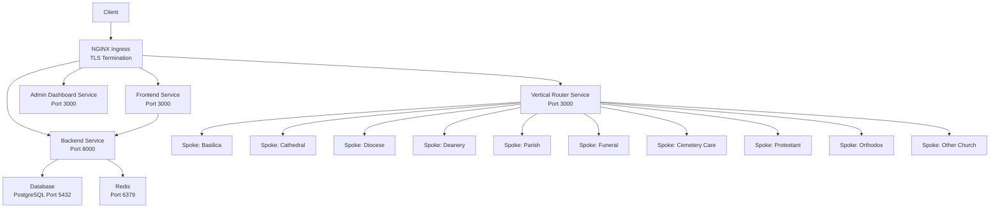
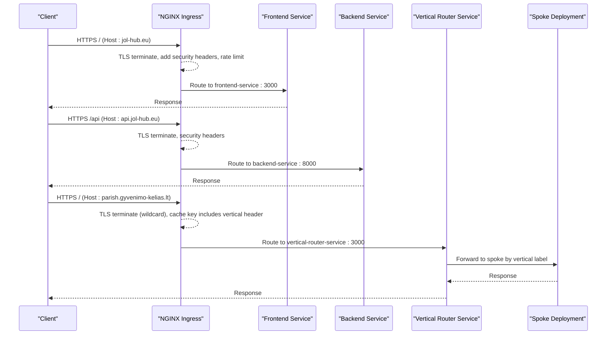
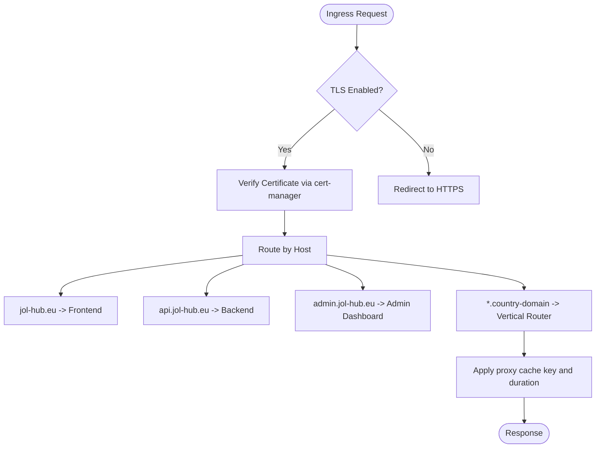
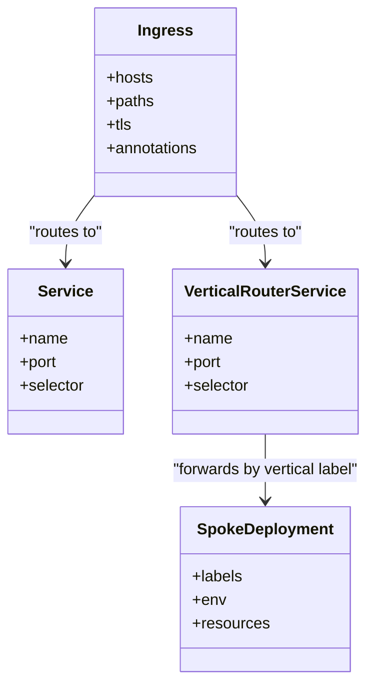
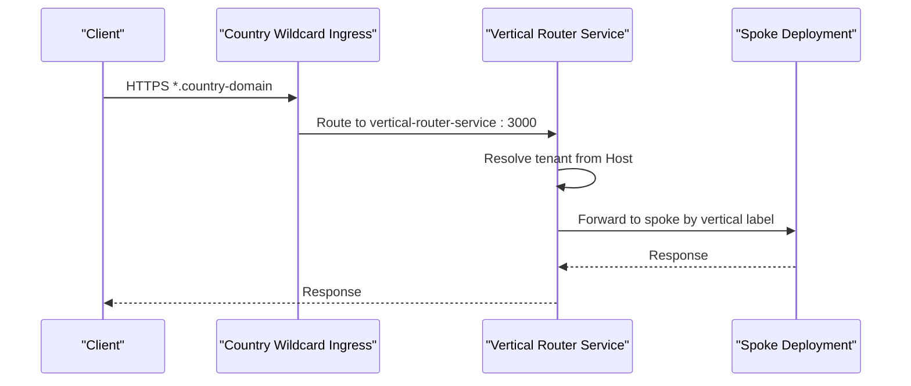
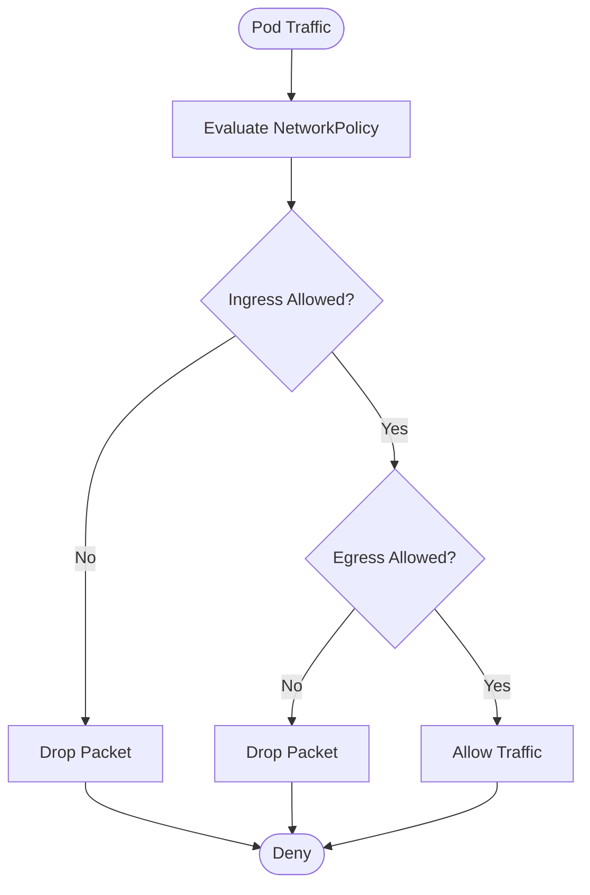
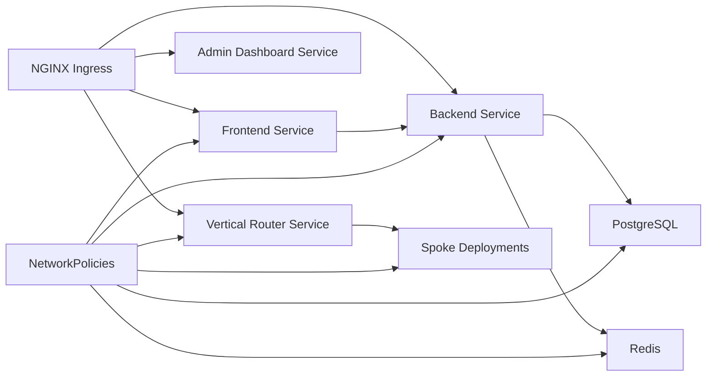

# Networking & Ingress

<cite>
**Referenced Files in This Document**
- [ingress.yaml](file://infra/kubernetes/networking/ingress.yaml)
- [network-policy.yaml](file://infra/kubernetes/networking/network-policy.yaml)
- [vertical-router.yaml](file://infra/kubernetes/networking/vertical-router.yaml)
- [security.yaml](file://infra/kubernetes/security/security.yaml)
- [values.yaml](file://infra/helm/jol-hub/values.yaml)
- [ingress template](file://infra/helm/jol-hub/templates/ingress.yaml)
- [networkpolicy template](file://infra/helm/jol-hub/templates/networkpolicy.yaml)
- [frontend middleware](file://frontend/apps/master-site/src/middleware.ts)
- [grafana.yaml](file://infra/kubernetes/monitoring/grafana.yaml)
</cite>

## Table of Contents
1. [Introduction](#introduction)
2. [Project Structure](#project-structure)
3. [Core Components](#core-components)
4. [Architecture Overview](#architecture-overview)
5. [Detailed Component Analysis](#detailed-component-analysis)
6. [Dependency Analysis](#dependency-analysis)
7. [Performance Considerations](#performance-considerations)
8. [Troubleshooting Guide](#troubleshooting-guide)
9. [Conclusion](#conclusion)
10. [Appendices](#appendices)

## Introduction
This document provides comprehensive networking documentation for the JOL-HUB Kubernetes cluster configuration. It covers ingress controller setup with TLS termination, SSL certificate management via cert-manager, and routing rules for multi-tenant access. It also details network policies for security isolation between services and external traffic control, vertical router configuration for tenant-specific domain routing and subdomain management, service mesh integration points, load balancing strategies, and traffic management policies. Guidance is included for DNS configuration, certificate lifecycle, firewall considerations, troubleshooting, performance optimization, and production security best practices.

## Project Structure
The networking stack is defined across multiple layers:
- Ingress resources define host-based routing and TLS termination at the edge (NGINX Ingress).
- NetworkPolicies enforce least-privilege communication between pods and namespaces.
- A vertical router manages multi-tenant routing to spoke deployments per country and vertical.
- Helm templates parameterize deployment of ingress and network policies.
- Security manifests configure cert-manager ClusterIssuers and external secrets.
- Frontend middleware implements runtime subdomain resolution and rewrite logic.
- Monitoring components expose metrics and dashboards for observability.

**Diagram sources**
- [ingress.yaml:1-115](file://infra/kubernetes/networking/ingress.yaml#L1-L115)
- [vertical-router.yaml:27-226](file://infra/kubernetes/networking/vertical-router.yaml#L27-L226)

**Section sources**
- [ingress.yaml:1-115](file://infra/kubernetes/networking/ingress.yaml#L1-L115)
- [network-policy.yaml:1-188](file://infra/kubernetes/networking/network-policy.yaml#L1-L188)
- [vertical-router.yaml:1-226](file://infra/kubernetes/networking/vertical-router.yaml#L1-L226)
- [security.yaml:106-138](file://infra/kubernetes/security/security.yaml#L106-L138)
- [values.yaml:184-196](file://infra/helm/jol-hub/values.yaml#L184-L196)
- [ingress template:1-73](file://infra/helm/jol-hub/templates/ingress.yaml#L1-L73)
- [networkpolicy template:1-111](file://infra/helm/jol-hub/templates/networkpolicy.yaml#L1-L111)
- [frontend middleware:1-301](file://frontend/apps/master-site/src/middleware.ts#L1-L301)
- [grafana.yaml:1-414](file://infra/kubernetes/monitoring/grafana.yaml#L1-L414)

## Core Components
- NGINX Ingress Controller: Host-based routing, TLS termination, rate limiting, security headers, proxy timeouts, and body size limits.
- Cert-Manager ClusterIssuers: Automated issuance of TLS certificates from Let’s Encrypt using HTTP-01 challenges.
- Network Policies: Default-deny baseline with explicit allow rules for ingress and egress per component.
- Vertical Router: Country-scoped wildcard ingress entries that route to a shared router service, which resolves tenants and forwards to spoke deployments by vertical label.
- Helm Values and Templates: Parameterized ingress and network policy rendering for consistent deployments.
- Frontend Middleware: Runtime subdomain extraction, validation, and rewriting to dynamic routes for parish sites.
- Monitoring: Grafana dashboards and Prometheus data sources for performance and availability visibility.

**Section sources**
- [ingress.yaml:1-115](file://infra/kubernetes/networking/ingress.yaml#L1-L115)
- [security.yaml:106-138](file://infra/kubernetes/security/security.yaml#L106-L138)
- [network-policy.yaml:1-188](file://infra/kubernetes/networking/network-policy.yaml#L1-L188)
- [vertical-router.yaml:27-226](file://infra/kubernetes/networking/vertical-router.yaml#L27-L226)
- [values.yaml:184-196](file://infra/helm/jol-hub/values.yaml#L184-L196)
- [ingress template:1-73](file://infra/helm/jol-hub/templates/ingress.yaml#L1-L73)
- [networkpolicy template:1-111](file://infra/helm/jol-hub/templates/networkpolicy.yaml#L1-L111)
- [frontend middleware:1-301](file://frontend/apps/master-site/src/middleware.ts#L1-L301)
- [grafana.yaml:1-414](file://infra/kubernetes/monitoring/grafana.yaml#L1-L414)

## Architecture Overview
The request path flows through NGINX Ingress, which terminates TLS and enforces security headers and rate limits. Requests are routed based on hostnames to frontend, backend, admin dashboard, or the vertical router. The vertical router uses country-scoped wildcard domains to resolve tenant slugs and route to spoke deployments labeled by vertical. NetworkPolicies restrict inter-service communication to only required paths and ports, while DNS and cert-manager ensure secure and valid TLS for all hosts.

**Diagram sources**
- [ingress.yaml:1-115](file://infra/kubernetes/networking/ingress.yaml#L1-L115)
- [vertical-router.yaml:27-226](file://infra/kubernetes/networking/vertical-router.yaml#L27-L226)

**Section sources**
- [ingress.yaml:1-115](file://infra/kubernetes/networking/ingress.yaml#L1-L115)
- [vertical-router.yaml:27-226](file://infra/kubernetes/networking/vertical-router.yaml#L27-L226)

## Detailed Component Analysis

### Ingress Controller Setup and TLS Termination
- Ingress class is set to NGINX; TLS is enabled for multiple hosts including main site, API, and admin domains.
- Wildcard TLS is configured for parish subdomains under each country domain.
- Proxy settings include body size limits, timeouts, and rate limiting annotations.
- Security headers are added via configuration snippets to harden responses.
- Cert-Manager ClusterIssuers are configured for automated certificate provisioning using HTTP-01 challenges.

**Diagram sources**
- [ingress.yaml:1-115](file://infra/kubernetes/networking/ingress.yaml#L1-L115)
- [security.yaml:106-138](file://infra/kubernetes/security/security.yaml#L106-L138)

**Section sources**
- [ingress.yaml:1-115](file://infra/kubernetes/networking/ingress.yaml#L1-L115)
- [security.yaml:106-138](file://infra/kubernetes/security/security.yaml#L106-L138)
- [values.yaml:184-196](file://infra/helm/jol-hub/values.yaml#L184-L196)
- [ingress template:1-73](file://infra/helm/jol-hub/templates/ingress.yaml#L1-L73)

### SSL Certificates and Certificate Management
- Two ClusterIssuers are defined: production and staging, both using HTTP-01 solver with NGINX ingress class.
- Secrets referenced by Ingress resources hold TLS certificates for each host group.
- External Secrets Operator integrates with AWS Secrets Manager for application secrets; this does not replace cert-manager but complements it for non-TLS secrets.

Best practices:
- Use staging issuer during development and switch to production issuer before rollout.
- Ensure DNS records point to the ingress controller IP for ACME challenges.
- Monitor certificate expiration and renewals via cert-manager events.

**Section sources**
- [security.yaml:106-138](file://infra/kubernetes/security/security.yaml#L106-L138)
- [ingress.yaml:1-115](file://infra/kubernetes/networking/ingress.yaml#L1-L115)

### Routing Rules for Multi-Tenant Access
- Host-based routing directs requests to appropriate services:
  - Main site to frontend service on port 3000.
  - API to backend service on port 8000.
  - Admin dashboard to admin service on port 3000.
- Wildcard ingress entries route parish subdomains to the vertical router service.
- The vertical router reads the Host header and forwards to spoke deployments labeled by vertical.

**Diagram sources**
- [ingress.yaml:1-115](file://infra/kubernetes/networking/ingress.yaml#L1-L115)
- [vertical-router.yaml:150-226](file://infra/kubernetes/networking/vertical-router.yaml#L150-L226)

**Section sources**
- [ingress.yaml:1-115](file://infra/kubernetes/networking/ingress.yaml#L1-L115)
- [vertical-router.yaml:27-226](file://infra/kubernetes/networking/vertical-router.yaml#L27-L226)

### Vertical Router Configuration for Tenant-Specific Domain Routing and Subdomain Management
- Country-scoped wildcard ingresses exist for LT, LV, and EE domains, each pointing to the vertical router service.
- The router service selects pods labeled for the router component and forwards requests based on Host and optional vertical headers.
- Spoke deployments are labeled with vertical identifiers (e.g., basilica, cathedral) and environment variables for tenant context.
- Frontend middleware handles subdomain extraction, validation, and rewriting to dynamic routes for parish sites.

**Diagram sources**
- [vertical-router.yaml:27-226](file://infra/kubernetes/networking/vertical-router.yaml#L27-L226)
- [frontend middleware:1-301](file://frontend/apps/master-site/src/middleware.ts#L1-L301)

**Section sources**
- [vertical-router.yaml:27-226](file://infra/kubernetes/networking/vertical-router.yaml#L27-L226)
- [frontend middleware:1-301](file://frontend/apps/master-site/src/middleware.ts#L1-L301)

### Network Policies for Security Isolation and External Traffic Control
- Default deny policy applied to the namespace ensures no traffic is allowed unless explicitly permitted.
- Backend allows ingress from ingress-nginx namespace and frontend pods on port 8000; egress restricted to database (5432), redis (6379), and DNS (UDP 53).
- Frontend allows ingress from ingress-nginx namespace on port 3000; egress restricted to backend (8000) and DNS (UDP 53).
- Database and Redis allow ingress only from backend and celery components on their respective ports; egress limited to DNS.
- Optional payment boundary egress row renders only when a specific CIDR is provided, ensuring fail-closed behavior.

**Diagram sources**
- [network-policy.yaml:1-188](file://infra/kubernetes/networking/network-policy.yaml#L1-L188)
- [networkpolicy template:1-111](file://infra/helm/jol-hub/templates/networkpolicy.yaml#L1-L111)

**Section sources**
- [network-policy.yaml:1-188](file://infra/kubernetes/networking/network-policy.yaml#L1-L188)
- [networkpolicy template:1-111](file://infra/helm/jol-hub/templates/networkpolicy.yaml#L1-L111)

### Service Mesh Integration, Load Balancing, and Traffic Management
- Service mesh support is present as a configurable option in Helm values; currently disabled by default.
- When enabled, Istio can be integrated to provide advanced traffic management (canary releases, retries, circuit breaking) and mTLS for service-to-service encryption.
- Load balancing is handled by NGINX Ingress and Kubernetes Services; horizontal scaling is configured via replica counts and autoscaling targets.
- For production, consider enabling service mesh to gain fine-grained traffic controls and enhanced observability.

**Section sources**
- [values.yaml:238-241](file://infra/helm/jol-hub/values.yaml#L238-L241)

### DNS Configuration
- DNS must resolve:
  - jol-hub.eu and www.jol-hub.eu to the ingress controller.
  - api.jol-hub.eu and admin.jol-hub.eu to the ingress controller.
  - Country wildcard domains (*.gyvenimo-kelias.lt, *.dzives-cels.lv, *.elu-tee.ee) to the ingress controller.
- Ensure DNS records match the hosts declared in Ingress TLS sections to avoid certificate issuance failures.

[No sources needed since this section provides general guidance]

### Firewall Rules
- Cloud provider firewalls should allow inbound TCP 443 to the ingress controller nodes or load balancer.
- Internal firewall rules should align with NetworkPolicies to permit only necessary traffic between namespaces and pods.
- Outbound egress from pods is restricted by NetworkPolicies; ensure DNS (UDP 53) is allowed for name resolution.

[No sources needed since this section provides general guidance]

## Dependency Analysis
The following diagram shows how ingress, services, and network policies interact:

**Diagram sources**
- [ingress.yaml:1-115](file://infra/kubernetes/networking/ingress.yaml#L1-L115)
- [network-policy.yaml:1-188](file://infra/kubernetes/networking/network-policy.yaml#L1-L188)
- [vertical-router.yaml:150-226](file://infra/kubernetes/networking/vertical-router.yaml#L150-L226)

**Section sources**
- [ingress.yaml:1-115](file://infra/kubernetes/networking/ingress.yaml#L1-L115)
- [network-policy.yaml:1-188](file://infra/kubernetes/networking/network-policy.yaml#L1-L188)
- [vertical-router.yaml:150-226](file://infra/kubernetes/networking/vertical-router.yaml#L150-L226)

## Performance Considerations
- Ingress proxy timeouts and body size limits are tuned for typical workloads; adjust based on observed latency and payload sizes.
- Rate limiting is configured at the ingress layer to protect backends from excessive traffic.
- Vertical router caching uses proxy cache keys that include host, URI, and vertical header; tune cache duration and validity for content freshness needs.
- Autoscaling is enabled for backend and frontend with CPU/memory targets; monitor utilization and adjust thresholds.
- Monitoring via Grafana and Prometheus provides visibility into API response times, request rates, CPU, and memory usage.

**Section sources**
- [ingress.yaml:1-115](file://infra/kubernetes/networking/ingress.yaml#L1-L115)
- [vertical-router.yaml:27-226](file://infra/kubernetes/networking/vertical-router.yaml#L27-L226)
- [values.yaml:37-42](file://infra/helm/jol-hub/values.yaml#L37-L42)
- [values.yaml:74-79](file://infra/helm/jol-hub/values.yaml#L74-L79)
- [grafana.yaml:1-414](file://infra/kubernetes/monitoring/grafana.yaml#L1-L414)

## Troubleshooting Guide
Common issues and resolutions:
- TLS handshake errors:
  - Verify cert-manager ClusterIssuer status and ACME challenge success.
  - Confirm DNS records point to the ingress controller and that the correct secret names are referenced in Ingress TLS sections.
- 404 or misrouted requests:
  - Check Ingress rules and hostnames; ensure they match DNS and cert-manager issuers.
  - Validate vertical router ingress entries and service selectors.
- Network connectivity denied:
  - Inspect NetworkPolicies to ensure required ingress/egress rules exist for pod labels and ports.
  - Confirm namespace labels for ingress-nginx are correctly applied.
- High latency or timeouts:
  - Review proxy timeouts and rate limits; adjust if necessary.
  - Use Grafana dashboards to identify bottlenecks and scale horizontally.

**Section sources**
- [security.yaml:106-138](file://infra/kubernetes/security/security.yaml#L106-L138)
- [ingress.yaml:1-115](file://infra/kubernetes/networking/ingress.yaml#L1-L115)
- [network-policy.yaml:1-188](file://infra/kubernetes/networking/network-policy.yaml#L1-L188)
- [grafana.yaml:1-414](file://infra/kubernetes/monitoring/grafana.yaml#L1-L414)

## Conclusion
JOL-HUB’s networking stack combines NGINX Ingress with cert-manager for robust TLS termination and automated certificate management, NetworkPolicies for strict isolation, and a vertical router for scalable multi-tenant routing across country domains. Helm templating ensures consistent deployments, while monitoring provides operational visibility. For production, enable service mesh for advanced traffic controls, validate DNS and firewall configurations, and continuously tune performance parameters based on telemetry.

[No sources needed since this section summarizes without analyzing specific files]

## Appendices

### Helm Chart Configuration Highlights
- Ingress enabled with className and annotations; TLS toggled via values.
- NetworkPolicies enabled by default; conditional rendering for payment boundary egress.
- Service mesh toggle available for future activation.

**Section sources**
- [values.yaml:184-196](file://infra/helm/jol-hub/values.yaml#L184-L196)
- [values.yaml:197-200](file://infra/helm/jol-hub/values.yaml#L197-L200)
- [values.yaml:238-241](file://infra/helm/jol-hub/values.yaml#L238-L241)
- [ingress template:1-73](file://infra/helm/jol-hub/templates/ingress.yaml#L1-L73)
- [networkpolicy template:1-111](file://infra/helm/jol-hub/templates/networkpolicy.yaml#L1-L111)